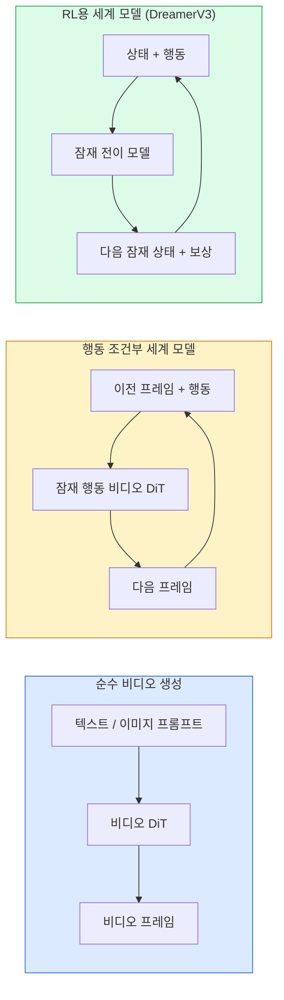

# 월드 모델 & 비디오 확산

> 장면의 다음 몇 초를 예측하는 비디오 모델은 월드 시뮬레이터입니다. 그 예측을 행동에 조건화하면 학습된 게임 엔진이 됩니다.

**유형:** 학습 + 빌드
**언어:** Python
**선수 요건:** 4단계 10강 (확산 모델), 4단계 12강 (비디오 이해), 4단계 23강 (DiT + 정류 흐름)
**시간:** 약 75분

## 학습 목표

- 순수 비디오 생성 모델(Sora 2)과 행동 조건화 월드 모델(Genie 3, DreamerV3)의 차이를 설명하세요.
- 비디오 DiT를 설명하세요: 시공간 패치, 3D 위치 인코딩, (T, H, W) 토큰에 걸친 결합 어텐션.
- 월드 모델이 로봇공학에 어떻게 연결되는지 추적하세요: VLM이 계획 → 비디오 모델이 시뮬레이션 → 역동학이 행동을 방출.
- 주어진 사용 사례(창의적 비디오, 인터랙티브 시뮬레이션, 자율주행 합성)에 따라 Sora 2, Genie 3, Runway GWM-1 Worlds, Wan-Video, HunyuanVideo 중 하나를 선택하세요.

## 문제점

비디오 생성과 월드 모델링은 2026년에 융합되었습니다. coherent한 1분짜리 비디오를 생성할 수 있는 모델은 어떤 의미에서 세계가 어떻게 움직이는지, 즉 객체 영속성, 중력, 인과관계, 스타일을 학습했습니다. 그 예측을 행동(왼쪽으로 걷기, 문 열기)에 조건화하면, 비디오 모델은 게임 엔진, 드라이빙 시뮬레이터, 또는 로봇공학 환경을 대체할 수 있는 학습 가능한 시뮬레이터가 됩니다.

이러한 중요성은 구체적입니다. Genie 3는 단일 이미지로부터 플레이 가능한 환경을 생성합니다. Runway GWM-1 Worlds는 무한히 탐색 가능한 장면을 합성합니다. Sora 2는 동기화된 오디오와 모델링된 물리 법칙을 포함하는 1분짜리 비디오를 생성합니다. NVIDIA Cosmos-Drive, Wayve Gaia-2, Tesla DrivingWorld는 자율주행차 학습 데이터를 위한 현실적인 드라이빙 비디오를 생성합니다. 월드 모델 패러다임은 로봇공학의 시뮬레이션-실물(sim-to-real) 영역을 조용히 장악하고 있습니다.

이 강의는 4단계의 "큰 그림" 강의입니다. 이미지 생성, 비디오 이해, 에이전트 추론을 지배적인 연구가 이동하고 있는 아키텍처 패턴으로 연결합니다.

## 개념

### 월드 모델링의 세 가지 계열



- **Sora 2**는 프롬프트에 조건을 둔 순수한 비디오 생성입니다. 행동 인터페이스가 없습니다. 생성 중 "조향"할 수 없습니다.
- **Genie 3**, **GWM-1 Worlds**, **Mirage / Magica**는 행동 조건부 세계 모델입니다. 관찰된 비디오에서 잠재 행동을 추론한 후, 행동에 조건을 둔 미래 프레임 예측을 수행합니다. 인터랙티브합니다 — 키를 누르거나 카메라를 움직이면 장면이 반응합니다.
- **DreamerV3**와 전통적인 RL 세계 모델 계열은 보상 신호로 학습되며, 명시적인 행동 조건을 포함해 잠재 공간에서 예측합니다. 시각적으로 덜 직관적이지만, 샘플 효율적인 RL에 더 유용합니다.

### 비디오 DiT 아키텍처

```
Video latent:          (C, T, H, W)
Patchify (spatial):    grid of P_h x P_w patches per frame
Patchify (temporal):   group P_t frames into a temporal patch
Resulting tokens:      (T / P_t) * (H / P_h) * (W / P_w) tokens
```

위치 인코딩은 3D입니다: (t, h, w) 좌표마다 회전(rotary) 또는 학습된 임베딩을 사용합니다. 어텐션은 다음과 같이 구성될 수 있습니다:

- **전체 결합(Full joint)** — 모든 토큰이 모든 토큰에 어텐션합니다. N개 토큰에 대해 O(N^2) 복잡도를 가지며, 긴 비디오에는 부적합합니다.
- **분할(Divided)** — 시간 어텐션(동일한 공간 위치, 시간 축: `(H*W) * T^2`)과 공간 어텐션(동일한 시간 단계, 공간 축: `T * (H*W)^2`)을 번갈아 사용합니다. TimeSformer와 대부분의 비디오 DiT가 이 방식을 사용합니다.
- **윈도우(Window)** — (t, h, w) 내의 지역 윈도우를 사용합니다. Video Swin이 이 방식을 사용합니다.

2026년 모든 비디오 확산 모델은 이 세 가지 패턴 중 하나와 AdaLN 조건화(23강) 및 정류 흐름(rectified flow)을 사용합니다.

### 행동 조건화: 잠재 행동 모델

Genie는 연속된 두 프레임 사이의 행동을 판별적으로 예측하여 프레임별 **잠재 행동(latent action)**을 학습합니다. 모델의 디코더는 명시적인 키보드 키가 아닌, 추론된 잠재 행동에 조건을 둡니다. 추론 시 사용자는 잠재 행동을 지정하거나(또는 새로운 사전 분포에서 샘플링하여) 모델이 해당 행동과 일치하는 다음 프레임을 생성하도록 할 수 있습니다.

Sora는 행동 인터페이스를 완전히 생략합니다. 디코더는 이전 시공간 토큰에서 다음 시공간 토큰을 예측합니다. 프롬프트가 시작 조건을 설정하며, 생성 중에는 아무것도 조향하지 않습니다.

### 물리적 타당성

Sora 2의 2026년 출시에서는 **물리적 타당성**(weight, balance, object permanence, cause-and-effect)을 명시적으로 홍보했습니다. 팀이 수작업으로 평가한 타당성 점수로 측정했으며, Sora 1에 비해 떨어지는 물체, 캐릭터 충돌, 의도적 실패(점프 실패) 등에서 모델이 눈에 띄게 개선되었습니다.

타당성은 여전히 지배적인 실패 모드입니다. 2024-2025년 스파게티를 먹거나 유리잔에서 물을 마시는 사람들의 영상은 모델의 지속적 객체 표현 부재를 드러냈습니다. 2026년 모델(Sora 2, Runway Gen-5, HunyuanVideo)은 이러한 문제를 줄이지만 완전히 없애지는 못합니다.

### 자율 주행 세계 모델

주행 세계 모델은 궤적, 바운딩 박스, 내비게이션 맵을 조건으로 현실적인 도로 장면을 생성합니다. 사용 사례:

- **Cosmos-Drive-Dreams** (NVIDIA) — RL 훈련을 위해 몇 분간의 주행 영상을 생성합니다.
- **Gaia-2** (Wayve) — 정책 평가를 위한 궤적 조건부 장면 합성.
- **DrivingWorld** (Tesla) — 다양한 날씨, 시간대, 교통 조건을 시뮬레이션합니다.
- **Vista** (ByteDance) — 반응형 주행 장면 합성.

이들은 야간 보행자 무단횡단, 결빙된 교차로, 특이한 차량 유형 등 수백만 마일의 주행이 필요할 코너 케이스에 대한 비싼 실데이터 수집을 대체합니다.

### 로보틱스 스택: VLM + 비디오 모델 + 역동학

emerging three-component robotics loop:

1. **VLM**은 목표("빨간 컵을 집어")를 파싱하고 고수준 행동 시퀀스를 계획합니다.
2. **비디오 생성 모델**은 각 행동을 실행하면 어떻게 보일지 시뮬레이션합니다 — N 프레임 후의 관측을 예측합니다.
3. **역동학 모델**은 이러한 관측을 생성할 구체적인 모터 명령을 추출합니다.

이 구조는 보상 shaping과 샘플이 많은 RL을 대체합니다. 세계 모델이 상상력을 담당하고, 역동학이 actuation 루프를 닫습니다. Genie Envisioner는 이 구조의 한 구현이며, 많은 연구 그룹이 이 구조로 수렴하고 있습니다.

### 평가

- **시각적 품질** — FVD (Fréchet Video Distance), 사용자 연구.
- **프롬프트 정렬** — 프레임별 CLIPScore, VQA 스타일 평가.
- **물리적 타당성** — 벤치마크 스위트(Sora 2의 내부 벤치마크, VBench)에서 사람이 직접 평가했습니다.
- **제어 가능성**(인터랙티브 월드 모델의 경우) — 행동 → 관측 일관성; 이전 상태로 되돌아갈 수 있나요?

### 2026년 모델 현황

| 모델 | 용도 | 매개변수 | 출력 | 라이선스 |
|-------|-----|------------|--------|---------|
| Sora 2 | 텍스트-비디오, 오디오 | — | 1분 1080p + 오디오 | API 전용 |
| Runway Gen-5 | 텍스트/이미지-비디오 | — | 10초 클립 | API |
| Runway GWM-1 Worlds | 인터랙티브 월드 | — | 무한 3D 롤아웃 | API |
| Genie 3 | 이미지 기반 인터랙티브 월드 | 11B+ | 플레이 가능한 프레임 | 연구 프리뷰 |
| Wan-Video 2.1 | 오픈 텍스트-비디오 | 14B | 고품질 클립 | 비영리 |
| HunyuanVideo | 오픈 텍스트-비디오 | 13B | 10초 클립 | 허용적 |
| Cosmos / Cosmos-Drive | 자율주행 시뮬레이션 | 7-14B | 주행 장면 | NVIDIA 오픈 |
| Magica / Mirage 2 | AI 네이티브 게임 엔진 | — | 수정 가능한 월드 | 제품 |

```figure
v4-world-rollout
```

## 구현하기

### 1단계: 비디오용 3D 패치화

```python
import torch
import torch.nn as nn


class VideoPatch3D(nn.Module):
    def __init__(self, in_channels=4, dim=64, patch_t=2, patch_h=2, patch_w=2):
        super().__init__()
        self.proj = nn.Conv3d(
            in_channels, dim,
            kernel_size=(patch_t, patch_h, patch_w),
            stride=(patch_t, patch_h, patch_w),
        )
        self.patch_t = patch_t
        self.patch_h = patch_h
        self.patch_w = patch_w

    def forward(self, x):
        # x: (N, C, T, H, W)
        x = self.proj(x)
        n, c, t, h, w = x.shape
        tokens = x.reshape(n, c, t * h * w).transpose(1, 2)
        return tokens, (t, h, w)
```

스트라이드가 커널과 동일한 3D 컨볼루션이 시공간 패치화 역할을 수행합니다. `(T, H, W) -> (T/2, H/2, W/2)` 토큰 그리드.

### 2단계: 3D 로터리 위치 인코딩

로터리 위치 임베딩(RoPE)을 `t`, `h`, `w` 축에 각각 적용합니다:

```python
def rope_3d(tokens, t_dim, h_dim, w_dim, grid):
    """
    tokens: (N, T*H*W, D)
    grid: (T, H, W) sizes
    t_dim + h_dim + w_dim == D
    """
    T, H, W = grid
    n, seq, d = tokens.shape
    if t_dim + h_dim + w_dim != d:
        raise ValueError(f"t_dim+h_dim+w_dim ({t_dim}+{h_dim}+{w_dim}) must equal D={d}")
    assert seq == T * H * W
    t_idx = torch.arange(T, device=tokens.device).repeat_interleave(H * W)
    h_idx = torch.arange(H, device=tokens.device).repeat_interleave(W).repeat(T)
    w_idx = torch.arange(W, device=tokens.device).repeat(T * H)
    # 단순화: 주파수에 따라 채널을 스케일링하는 것만 수행합니다. 실제 RoPE는 쌍을 회전시킵니다.
    freqs_t = torch.exp(-torch.log(torch.tensor(10000.0)) * torch.arange(t_dim // 2, device=tokens.device) / (t_dim // 2))
    freqs_h = torch.exp(-torch.log(torch.tensor(10000.0)) * torch.arange(h_dim // 2, device=tokens.device) / (h_dim // 2))
    freqs_w = torch.exp(-torch.log(torch.tensor(10000.0)) * torch.arange(w_dim // 2, device=tokens.device) / (w_dim // 2))
    emb_t = torch.cat([torch.sin(t_idx[:, None] * freqs_t), torch.cos(t_idx[:, None] * freqs_t)], dim=-1)
    emb_h = torch.cat([torch.sin(h_idx[:, None] * freqs_h), torch.cos(h_idx[:, None] * freqs_h)], dim=-1)
    emb_w = torch.cat([torch.sin(w_idx[:, None] * freqs_w), torch.cos(w_idx[:, None] * freqs_w)], dim=-1)
    return tokens + torch.cat([emb_t, emb_h, emb_w], dim=-1)
```

단순화된 가산 형태입니다. 실제 RoPE는 주파수에서 쌍을 이루는 채널을 회전시키며, 위치 정보는 동일합니다.

### 3단계: 분리된 어텐션 블록

```python
class DividedAttentionBlock(nn.Module):
    def __init__(self, dim=64, heads=2):
        super().__init__()
        self.time_attn = nn.MultiheadAttention(dim, heads, batch_first=True)
        self.space_attn = nn.MultiheadAttention(dim, heads, batch_first=True)
        self.ln1 = nn.LayerNorm(dim)
        self.ln2 = nn.LayerNorm(dim)
        self.ln3 = nn.LayerNorm(dim)
        self.mlp = nn.Sequential(nn.Linear(dim, 4 * dim), nn.GELU(), nn.Linear(4 * dim, dim))

    def forward(self, x, grid):
        T, H, W = grid
        n, seq, d = x.shape
        # 시간 어텐션: 동일한 (h, w)에서 t에 걸쳐
        xt = x.view(n, T, H * W, d).permute(0, 2, 1, 3).reshape(n * H * W, T, d)
        a, _ = self.time_attn(self.ln1(xt), self.ln1(xt), self.ln1(xt), need_weights=False)
        xt = (xt + a).reshape(n, H * W, T, d).permute(0, 2, 1, 3).reshape(n, seq, d)
        # 공간 어텐션: 동일한 t에서 (h, w)에 걸쳐
        xs = xt.view(n, T, H * W, d).reshape(n * T, H * W, d)
        a, _ = self.space_attn(self.ln2(xs), self.ln2(xs), self.ln2(xs), need_weights=False)
        xs = (xs + a).reshape(n, T, H * W, d).reshape(n, seq, d)
        xs = xs + self.mlp(self.ln3(xs))
        return xs
```

시간 어텐션은 각 공간 위치 내에서 시간에 걸쳐 어텐션하며, 공간 어텐션은 각 프레임 내에서 위치에 걸쳐 어텐션합니다. 하나의 O((THW)^2) 연산 대신 두 개의 O(T^2 + (HW)^2) 연산이 수행됩니다. 이는 TimeSformer와 모든 최신 비디오 DiT의 핵심입니다.

### 4단계: 작은 비디오 DiT 구성하기

```python
class TinyVideoDiT(nn.Module):
    def __init__(self, in_channels=4, dim=64, depth=2, heads=2):
        super().__init__()
        self.patch = VideoPatch3D(in_channels=in_channels, dim=dim, patch_t=2, patch_h=2, patch_w=2)
        self.blocks = nn.ModuleList([DividedAttentionBlock(dim, heads) for _ in range(depth)])
        self.out = nn.Linear(dim, in_channels * 2 * 2 * 2)

    def forward(self, x):
        tokens, grid = self.patch(x)
        for blk in self.blocks:
            tokens = blk(tokens, grid)
        return self.out(tokens), grid
```

작동하는 비디오 생성기가 아니라, 모든 부분이 올바르게 형태를 잡는 구조적 데모입니다.

### 5단계: 모양 확인

```python
vid = torch.randn(1, 4, 8, 16, 16)  # (N, C, T, H, W)
model = TinyVideoDiT()
out, grid = model(vid)
print(f"input  {tuple(vid.shape)}")
print(f"tokens grid {grid}")
print(f"output {tuple(out.shape)}")
```

패치 적용 후 `grid = (4, 8, 8)`와 `out = (1, 256, 32)`을 기대하세요. 헤드는 토큰별 시공간 패치로 투사하여, 비디오로 복원(un-patchify)할 준비가 됩니다.

## 사용하기

2026년 프로덕션 접근 패턴:

- **Sora 2 API** (OpenAI) — 텍스트-비디오 생성, 동기화된 오디오. 프리미엄 가격.
- **Runway Gen-5 / GWM-1** (Runway) — 이미지-비디오 생성, 인터랙티브 월드.
- **Wan-Video 2.1 / HunyuanVideo** — 오픈소스 셀프 호스트.
- **Cosmos / Cosmos-Drive** (NVIDIA) — 시뮬레이션 오픈 가중치.
- **Genie 3** — 연구 프리뷰, 접근 요청.

인터랙티브 월드 모델 데모를 구축하려면: 품질을 위해 Wan-Video로 시작하고, 인터랙티브성을 위해 잠재적 행동(latent-action) 어댑터를 계층화하세요. 자율 주행 시뮬레이션의 경우: Cosmos-Drive가 2026년 오픈 레퍼런스입니다.

로보틱스의 경우, 실제 스택은 다음과 같습니다:

1. 언어 목표 -> VLM (Qwen3-VL) -> 고수준 계획.
2. 계획 -> 잠재적 행동(latent-action) 비디오 모델 -> 상상된 롤아웃(rollout).
3. 롤아웃 -> 역동학 모델 -> 저수준 행동.
4. 실행된 행동 -> 관찰 결과를 1단계로 피드백.

## 출시하기

이 강의는 다음을 생성합니다:

- `outputs/prompt-video-model-picker.md` — 작업, 라이선스, 지연(latency)에 따라 Sora 2 / Runway / Wan / HunyuanVideo / Cosmos 중 선택합니다.
- `outputs/skill-physical-plausibility-checks.md` — 출시 전 생성된 모든 비디오에서 자동화된 체크(객체 영속성, 중력, 연속성)를 실행하는 스킬을 정의합니다.

## 연습 문제

1. **(쉬움)** patch-t=2, patch-h=8, patch-w=8인 5초 360p 비디오의 토큰 수를 계산하세요. 이 크기에서 어텐션 메모리에 대해 추론해 보세요.
2. **(중간)** 위의 분할 어텐션 블록을 전체 결합 어텐션 블록으로 교체하고 모양과 매개변수 수를 측정하세요. 실제 비디오 모델에 분할 어텐션이 필요한 이유를 설명하세요.
3. **(어려움)** 최소한의 잠재적 행동(latent-action) 비디오 모델을 구축하세요: (frame_t, action_t, frame_{t+1}) 삼중 쌍 데이터셋(간단한 2D 게임)을 가져와 행동 임베딩에 조건을 건 작은 비디오 DiT를 학습하고, 서로 다른 행동이 서로 다른 다음 프레임을 생성함을 보이세요.

## 핵심 용어

| 용어 | 사람들이 말하는 표현 | 실제 의미 |
|------|----------------|----------------------|
| 세계 모델 | "학습된 시뮬레이터" | 상태와 행동이 주어졌을 때 미래 관측값을 예측하는 모델 |
| Video DiT | "시공간 트랜스포머" | 3D 패치화 및 분할 어텐션을 사용하는 확산 트랜스포머 |
| 잠재 행동 | "추론된 제어" | 프레임 쌍에서 추론된 이산 또는 연속 행동 잠재 변수; 다음 프레임 생성 조건에 사용 |
| 분할 어텐션 | "시간 후 공간" | 블록당 두 번의 어텐션 연산 — 먼저 시간 간, 그 후 공간 간 — O(N^2)을 관리 가능하게 유지 |
| 대상 영속성 | "사물은 실재한다" | 비디오 모델이 학습해야 하는 장면 속성; 음식, 유리 제품에서 고전적인 실패 모드 |
| FVD | "Fréchet Video Distance" | FID의 비디오 버전; 주요 시각 품질 지표 |
| 역동학 모델 | "관측에서 행동으로" | (상태, 다음 상태)가 주어지면 이를 연결하는 행동을 출력; 로봇공학 루프를 닫음 |
| Cosmos-Drive | "NVIDIA 드라이빙 시뮬레이터" | RL 및 평가를 위한 오픈 웨이트 자율 주행 세계 모델 |

## 추가 읽기

- [Sora technical report (OpenAI)](https://openai.com/index/video-generation-models-as-world-simulators/)
- [Genie: Generative Interactive Environments (Bruce et al., 2024)](https://arxiv.org/abs/2402.15391) — 잠재 행동 세계 모델
- [TimeSformer (Bertasius et al., 2021)](https://arxiv.org/abs/2102.05095) — 비디오 트랜스포머용 분할 어텐션
- [DreamerV3 (Hafner et al., 2023)](https://arxiv.org/abs/2301.04104) — RL용 세계 모델
- [Cosmos-Drive-Dreams (NVIDIA, 2025)](https://research.nvidia.com/labs/toronto-ai/cosmos-drive-dreams/) — 드라이빙 세계 모델
- [Top 10 Video Generation Models 2026 (DataCamp)](https://www.datacamp.com/blog/top-video-generation-models)
- [From Video Generation to World Model — survey repo](https://github.com/ziqihuangg/Awesome-From-Video-Generation-to-World-Model/)
