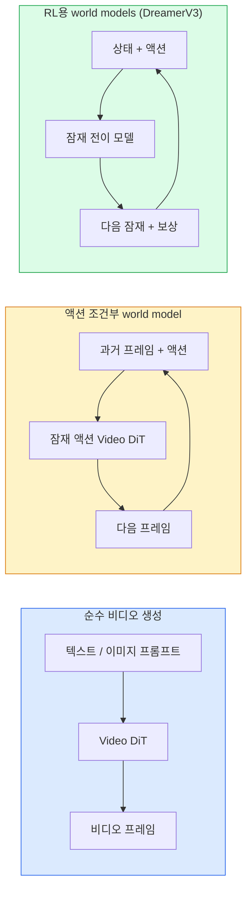

# World Models와 Video Diffusion (World Models & Video Diffusion)

> 장면의 다음 몇 초를 예측하는 비디오 모델은 세계 시뮬레이터입니다. 그 예측을 액션으로 조건화하면 학습된 게임 엔진이 됩니다.

**Type:** Learn + Build
**Languages:** Python
**Prerequisites:** Phase 4 Lesson 10 (Diffusion), Phase 4 Lesson 12 (Video Understanding), Phase 4 Lesson 23 (DiT + Rectified Flow)
**Time:** ~75 minutes

## 학습 목표 (Learning Objectives)

- 순수 비디오 생성 모델(Sora 2)과 액션 조건부 world model(Genie 3, DreamerV3)의 차이를 설명합니다
- Video DiT를 기술합니다: 시공간 패치, 3D 위치 인코딩, (T, H, W) 토큰에 걸친 조인트 어텐션
- World model이 로보틱스에 어떻게 꽂히는지 추적합니다: VLM이 계획 → 비디오 모델이 시뮬레이션 → inverse dynamics가 액션을 냄
- 주어진 유스케이스(크리에이티브 비디오, 인터랙티브 sim, 자율주행 합성)에 대해 Sora 2, Genie 3, Runway GWM-1 Worlds, Wan-Video, HunyuanVideo 중 고릅니다

## 문제 상황 (The Problem)

비디오 생성과 world modelling이 2026년에 수렴했습니다. 일관된 1분 비디오를 생성할 수 있는 모델은, 어떤 의미에서, 세계가 움직이는 방식을 배웠습니다: 물체 영속성, 중력, 인과, 스타일. 그 예측을 액션(왼쪽으로 걷기, 문 열기)으로 조건화하면, 비디오 모델이 게임 엔진·주행 시뮬레이터·로보틱스 환경을 대체할 수 있는 학습 가능 시뮬레이터가 됩니다.

이해관계는 구체적입니다. Genie 3는 단일 이미지에서 플레이 가능한 환경을 생성합니다. Runway GWM-1 Worlds는 무한 탐험 장면을 합성합니다. Sora 2는 동기화된 오디오와 모델링된 물리로 1분 비디오를 만듭니다. NVIDIA Cosmos-Drive, Wayve Gaia-2, Tesla DrivingWorld는 자율주행 학습 데이터용 사실적 주행 비디오를 생성합니다. World-model 패러다임이 로보틱스의 sim-to-real을 조용히 장악하고 있습니다.

이 레슨은 Phase 4의 "큰 그림" 레슨입니다. 이미지 생성, 비디오 이해, 에이전트 추론을 지배적 연구가 향하는 아키텍처 패턴으로 연결합니다.

## 핵심 개념 (The Concept)

### World-modelling의 세 패밀리 (Three families of world-modelling)



- **Sora 2**는 프롬프트에 조건화된 순수 비디오 생성입니다. 액션 인터페이스 없음. 롤아웃 중간에 "조향"할 수 없습니다.
- **Genie 3**, **GWM-1 Worlds**, **Mirage / Magica**는 액션 조건부 world model입니다. 관측된 비디오에서 잠재 액션을 추론한 뒤, 미래 프레임 예측을 액션에 조건화합니다. 인터랙티브 — 키를 누르거나 카메라를 움직이면 장면이 반응합니다.
- **DreamerV3**와 고전 RL world-model 패밀리는 명시적 액션 조건화와 보상 신호로 잠재 공간에서 예측합니다. 덜 시각적; sample-efficient RL에 더 유용.

### Video DiT 아키텍처 (Video DiT architecture)

```
Video latent:          (C, T, H, W)
Patchify (spatial):    grid of P_h x P_w patches per frame
Patchify (temporal):   group P_t frames into a temporal patch
Resulting tokens:      (T / P_t) * (H / P_h) * (W / P_w) tokens
```

위치 인코딩은 3D입니다: (t, h, w) 좌표당 rotary 또는 학습된 임베딩. 어텐션은:

- **Full joint** — 모든 토큰이 모든 토큰에 어텐드. N 토큰에 O(N^2). 긴 비디오에는 금지적.
- **Divided** — 시간 어텐션(같은 공간 위치, 시간에 걸쳐: `(H*W) * T^2`)과 공간 어텐션(같은 타임스텝, 공간에 걸쳐: `T * (H*W)^2`)을 교대. TimeSformer와 대부분 video DiT가 사용.
- **Window** — (t, h, w)의 로컬 윈도우. Video Swin이 사용.

모든 2026 비디오 확산 모델이 이 세 패턴 중 하나와 AdaLN 조건화(Lesson 23), rectified flow를 씁니다.

### 액션 조건화: 잠재 액션 모델 (Conditioning on actions: latent action models)

Genie는 연속 프레임 쌍 사이의 액션을 판별적으로 예측해 프레임당 **잠재 액션**을 학습합니다. 모델의 디코더는 명시적 키보드 키가 아니라 추론된 잠재 액션에 조건화합니다. 추론 시 사용자가 잠재 액션을 지정(또는 새 prior에서 샘플)하면 모델이 그 액션과 일관된 다음 프레임을 생성합니다.

Sora는 액션 인터페이스를 완전히 건너뜁니다. 디코더가 과거 spacetime 토큰에서 다음 spacetime 토큰을 예측합니다. 프롬프트가 시작을 조건화하고; 생성 중간에 아무것도 조향하지 않습니다.

### 물리적 개연성 (Physical plausibility)

Sora 2의 2026 출시는 **물리적 개연성**을 명시적으로 광고했습니다: 무게, 균형, 물체 영속성, 인과. 팀이 수동 평가 개연성 점수로 측정했고; 모델이 떨어지는 물체, 캐릭터 충돌, 의도적 실패(놓친 점프)에서 Sora 1보다 눈에 띄게 개선됩니다.

개연성은 여전히 지배적 실패 모드입니다. 2024–2025의 스파게티를 먹거나 잔을 마시는 사람 비디오는 모델의 지속적 객체 표현 부족을 드러냈습니다. 2026 모델(Sora 2, Runway Gen-5, HunyuanVideo)은 줄이지만 제거하지는 않습니다.

### 자율주행 world models (Autonomous driving world models)

주행 world models는 궤적·바운딩 박스·내비게이션 맵에 조건화된 사실적 도로 장면을 생성합니다. 용도:

- **Cosmos-Drive-Dreams** (NVIDIA) — RL 학습용 수분 주행 비디오 생성.
- **Gaia-2** (Wayve) — 정책 평가용 궤적 조건부 장면 합성.
- **DrivingWorld** (Tesla) — 다양한 날씨·시간대·교통 조건 시뮬레이션.
- **Vista** (ByteDance) — 반응형 주행 장면 합성.

그렇지 않으면 수백만 마일의 주행이 필요한 코너 케이스 — 밤에 무단횡단하는 보행자, 빙판 교차로, 특이한 차량 유형 — 의 비싼 실세계 데이터 수집을 대체합니다.

### 로보틱스 스택: VLM + 비디오 모델 + inverse dynamics (Robotics stack)

떠오르는 세 구성요소 로보틱스 루프:

1. **VLM**이 목표를 파싱("빨간 컵 집어")하고 고수준 액션 시퀀스를 계획.
2. **비디오 생성 모델**이 각 액션 실행이 어떻게 보일지 시뮬레이션 — N 프레임 앞 관측을 예측.
3. **Inverse dynamics model**이 그 관측을 만들 구체적 모터 명령을 추출.

보상 셰이핑과 샘플 무거운 RL을 대체합니다. World model이 상상하고; inverse dynamics가 액추에이션 루프를 닫습니다. Genie Envisioner가 한 인스턴스이고; 많은 연구 그룹이 이 구조로 수렴합니다.

### 평가 (Evaluation)

- **시각 품질** — FVD (Fréchet Video Distance), 사용자 연구.
- **프롬프트 정렬** — 프레임당 CLIPScore, VQA형 평가.
- **물리적 개연성** — 벤치마크 스위트에서 수동 평가(Sora 2의 내부 벤치마크, VBench).
- **제어성** (인터랙티브 world models용) — 액션 → 관측 일관성; 이전 상태로 돌아갈 수 있는가?

### 2026 모델 지형 (Model landscape in 2026)

| Model | Use | Parameters | Output | License |
|-------|-----|------------|--------|---------|
| Sora 2 | text-to-video, audio | — | 1-min 1080p + audio | API only |
| Runway Gen-5 | text/image-to-video | — | 10s clips | API |
| Runway GWM-1 Worlds | interactive world | — | infinite 3D rollout | API |
| Genie 3 | interactive world from image | 11B+ | playable frames | research preview |
| Wan-Video 2.1 | open text-to-video | 14B | high-quality clips | non-commercial |
| HunyuanVideo | open text-to-video | 13B | 10s clips | permissive |
| Cosmos / Cosmos-Drive | autonomous driving sim | 7-14B | driving scenes | NVIDIA open |
| Magica / Mirage 2 | AI-native game engine | — | modifiable worlds | product |

```figure
v4-world-rollout
```

## 직접 만들기 (Build It)

### Step 1: 비디오용 3D patchify (3D patchify for video)

```python
import torch
import torch.nn as nn


class VideoPatch3D(nn.Module):
    def __init__(self, in_channels=4, dim=64, patch_t=2, patch_h=2, patch_w=2):
        super().__init__()
        self.proj = nn.Conv3d(
            in_channels, dim,
            kernel_size=(patch_t, patch_h, patch_w),
            stride=(patch_t, patch_h, patch_w),
        )
        self.patch_t = patch_t
        self.patch_h = patch_h
        self.patch_w = patch_w

    def forward(self, x):
        # x: (N, C, T, H, W)
        x = self.proj(x)
        n, c, t, h, w = x.shape
        tokens = x.reshape(n, c, t * h * w).transpose(1, 2)
        return tokens, (t, h, w)
```

커널과 같은 stride의 3D conv가 시공간 patchifier 역할을 합니다. `(T, H, W) -> (T/2, H/2, W/2)` 토큰 그리드.

### Step 2: 3D rotary position encoding

`t`, `h`, `w` 축에 따로 적용된 Rotary Position Embeddings (RoPE):

```python
def rope_3d(tokens, t_dim, h_dim, w_dim, grid):
    """
    tokens: (N, T*H*W, D)
    grid: (T, H, W) sizes
    t_dim + h_dim + w_dim == D
    """
    T, H, W = grid
    n, seq, d = tokens.shape
    if t_dim + h_dim + w_dim != d:
        raise ValueError(f"t_dim+h_dim+w_dim ({t_dim}+{h_dim}+{w_dim}) must equal D={d}")
    assert seq == T * H * W
    t_idx = torch.arange(T, device=tokens.device).repeat_interleave(H * W)
    h_idx = torch.arange(H, device=tokens.device).repeat_interleave(W).repeat(T)
    w_idx = torch.arange(W, device=tokens.device).repeat(T * H)
    # Simplified: just scale channels by frequencies. Real RoPE rotates pairs.
    freqs_t = torch.exp(-torch.log(torch.tensor(10000.0)) * torch.arange(t_dim // 2, device=tokens.device) / (t_dim // 2))
    freqs_h = torch.exp(-torch.log(torch.tensor(10000.0)) * torch.arange(h_dim // 2, device=tokens.device) / (h_dim // 2))
    freqs_w = torch.exp(-torch.log(torch.tensor(10000.0)) * torch.arange(w_dim // 2, device=tokens.device) / (w_dim // 2))
    emb_t = torch.cat([torch.sin(t_idx[:, None] * freqs_t), torch.cos(t_idx[:, None] * freqs_t)], dim=-1)
    emb_h = torch.cat([torch.sin(h_idx[:, None] * freqs_h), torch.cos(h_idx[:, None] * freqs_h)], dim=-1)
    emb_w = torch.cat([torch.sin(w_idx[:, None] * freqs_w), torch.cos(w_idx[:, None] * freqs_w)], dim=-1)
    return tokens + torch.cat([emb_t, emb_h, emb_w], dim=-1)
```

단순화된 가산 형태. 실제 RoPE는 주파수에서 짝 채널을 회전합니다; 위치 정보는 같습니다.

### Step 3: Divided attention 블록 (Divided attention block)

```python
class DividedAttentionBlock(nn.Module):
    def __init__(self, dim=64, heads=2):
        super().__init__()
        self.time_attn = nn.MultiheadAttention(dim, heads, batch_first=True)
        self.space_attn = nn.MultiheadAttention(dim, heads, batch_first=True)
        self.ln1 = nn.LayerNorm(dim)
        self.ln2 = nn.LayerNorm(dim)
        self.ln3 = nn.LayerNorm(dim)
        self.mlp = nn.Sequential(nn.Linear(dim, 4 * dim), nn.GELU(), nn.Linear(4 * dim, dim))

    def forward(self, x, grid):
        T, H, W = grid
        n, seq, d = x.shape
        # time attention: same (h, w), across t
        xt = x.view(n, T, H * W, d).permute(0, 2, 1, 3).reshape(n * H * W, T, d)
        a, _ = self.time_attn(self.ln1(xt), self.ln1(xt), self.ln1(xt), need_weights=False)
        xt = (xt + a).reshape(n, H * W, T, d).permute(0, 2, 1, 3).reshape(n, seq, d)
        # space attention: same t, across (h, w)
        xs = xt.view(n, T, H * W, d).reshape(n * T, H * W, d)
        a, _ = self.space_attn(self.ln2(xs), self.ln2(xs), self.ln2(xs), need_weights=False)
        xs = (xs + a).reshape(n, T, H * W, d).reshape(n, seq, d)
        xs = xs + self.mlp(self.ln3(xs))
        return xs
```

시간 어텐션은 각 공간 위치에서 시간에 걸쳐 어텐드하고; 공간 어텐션은 각 프레임에서 위치에 걸쳐 어텐드합니다. 하나의 O((THW)^2) 대신 두 개의 O(T^2 + (HW)^2) 연산. TimeSformer와 모든 현대 video DiT의 핵심입니다.

### Step 4: 작은 video DiT 조립 (Compose a tiny video DiT)

```python
class TinyVideoDiT(nn.Module):
    def __init__(self, in_channels=4, dim=64, depth=2, heads=2):
        super().__init__()
        self.patch = VideoPatch3D(in_channels=in_channels, dim=dim, patch_t=2, patch_h=2, patch_w=2)
        self.blocks = nn.ModuleList([DividedAttentionBlock(dim, heads) for _ in range(depth)])
        self.out = nn.Linear(dim, in_channels * 2 * 2 * 2)

    def forward(self, x):
        tokens, grid = self.patch(x)
        for blk in self.blocks:
            tokens = blk(tokens, grid)
        return self.out(tokens), grid
```

동작하는 비디오 생성기가 아니라; 모든 조각이 올바르게 형태를 잡는 구조 데모입니다.

### Step 5: 형태 확인 (Check shapes)

```python
vid = torch.randn(1, 4, 8, 16, 16)  # (N, C, T, H, W)
model = TinyVideoDiT()
out, grid = model(vid)
print(f"input  {tuple(vid.shape)}")
print(f"tokens grid {grid}")
print(f"output {tuple(out.shape)}")
```

패칭 후 `grid = (4, 8, 8)`과 `out = (1, 256, 32)`를 기대합니다; 헤드가 토큰당 시공간 패치로 투영한 뒤, 다시 비디오로 un-patchify할 준비가 됩니다.

## 활용하기 (Use It)

2026 프로덕션 접근 패턴:

- **Sora 2 API** (OpenAI) — text-to-video, 동기화 오디오. 프리미엄 가격.
- **Runway Gen-5 / GWM-1** (Runway) — image-to-video, 인터랙티브 월드.
- **Wan-Video 2.1 / HunyuanVideo** — 오픈소스 셀프호스트.
- **Cosmos / Cosmos-Drive** (NVIDIA) — 주행 시뮬레이션 오픈 가중치.
- **Genie 3** — 연구 프리뷰, 액세스 요청.

인터랙티브 world-model 데모를 만들려면: 품질에는 Wan-Video로 시작하고, 인터랙티비티용 잠재 액션 어댑터를 얹으세요. 자율주행 시뮬레이션에는 Cosmos-Drive가 2026 오픈 참고입니다.

로보틱스의 현장 스택:

1. 언어 목표 -> VLM (Qwen3-VL) -> 고수준 계획.
2. 계획 -> 잠재 액션 비디오 모델 -> 상상된 롤아웃.
3. 롤아웃 -> inverse dynamics model -> 저수준 액션.
4. 액션 실행 -> 관측이 step 1로 피드백.

## 결과물 배포 (Ship It)

이 레슨이 만드는 것:

- `outputs/prompt-video-model-picker.md` — 과제·라이선스·지연에 따라 Sora 2 / Runway / Wan / HunyuanVideo / Cosmos 중 고릅니다.
- `outputs/skill-physical-plausibility-checks.md` — 배포 전 생성 비디오에 돌릴 자동 검사(물체 영속성, 중력, 연속성)를 정의하는 스킬.

## 연습 문제 (Exercises)

1. **(Easy)** patch-t=2, patch-h=8, patch-w=8인 5초 360p 비디오의 토큰 수를 계산합니다. 이 크기에서 어텐션 메모리를 추론합니다.
2. **(Medium)** 위 divided attention 블록을 full joint attention 블록으로 바꾸고 형태와 파라미터 수를 측정합니다. 실제 비디오 모델에 divided attention이 왜 필요한지 설명합니다.
3. **(Hard)** 최소 잠재 액션 비디오 모델을 만듭니다: (frame_t, action_t, frame_{t+1}) 삼중항 데이터셋(임의의 단순 2D 게임)을 취하고, 액션 임베딩에 조건화된 작은 video DiT를 학습하며, 다른 액션이 다른 다음 프레임을 만듦을 보입니다.

## 핵심 용어 (Key Terms)

| 용어 | 사람들이 말하는 것 | 실제 의미 |
|------|----------------|----------------------|
| World model | "학습된 시뮬레이터" | 상태와 액션이 주어지면 미래 관측을 예측하는 모델 |
| Video DiT | "Spacetime transformer" | 3D patchification과 divided attention이 있는 확산 트랜스포머 |
| Latent action | "추론된 제어" | 프레임 쌍에서 추론된 이산 또는 연속 액션 잠재; 다음 프레임 생성 조건화에 사용 |
| Divided attention | "시간 다음 공간" | 블록당 두 어텐션 연산 — 시간에 걸쳐 그다음 공간에 걸쳐 — O(N^2)를 다루기 쉽게 |
| Object permanence | "사물이 진짜로 남음" | 비디오 모델이 배워야 하는 장면 속성; 음식·유리 제품에서 고전적 실패 모드 |
| FVD | "Fréchet Video Distance" | FID의 비디오 동등물; 주 시각 품질 지표 |
| Inverse dynamics model | "관측에서 액션으로" | (상태, 다음 상태)가 주어지면 연결하는 액션을 출력; 로보틱스 루프를 닫음 |
| Cosmos-Drive | "NVIDIA 주행 sim" | RL과 평가용 오픈 가중치 자율주행 world model |

## 더 읽을거리 (Further Reading)

- [Sora technical report (OpenAI)](https://openai.com/index/video-generation-models-as-world-simulators/)
- [Genie: Generative Interactive Environments (Bruce et al., 2024)](https://arxiv.org/abs/2402.15391) — 잠재 액션 world models
- [TimeSformer (Bertasius et al., 2021)](https://arxiv.org/abs/2102.05095) — 비디오 트랜스포머용 divided attention
- [DreamerV3 (Hafner et al., 2023)](https://arxiv.org/abs/2301.04104) — RL용 world models
- [Cosmos-Drive-Dreams (NVIDIA, 2025)](https://research.nvidia.com/labs/toronto-ai/cosmos-drive-dreams/) — 주행 world model
- [Top 10 Video Generation Models 2026 (DataCamp)](https://www.datacamp.com/blog/top-video-generation-models)
- [From Video Generation to World Model — survey repo](https://github.com/ziqihuangg/Awesome-From-Video-Generation-to-World-Model/)
