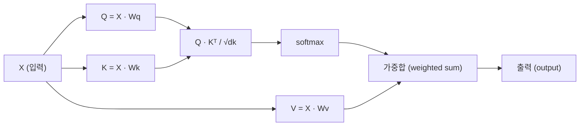

# 밑바닥부터 구현하는 셀프 어텐션 (Self-Attention from Scratch)

> 어텐션(Attention)은 모든 단어가 "나에게 중요한 것은 누구인가?"라고 묻고, 그 답을 학습하는 룩업 테이블(lookup table)입니다.

**Type:** Build
**Languages:** Python
**Prerequisites:** Phase 3 (Deep Learning Core), Phase 5 Lesson 10 (Sequence-to-Sequence)
**Time:** ~90 minutes

## 학습 목표 (Learning Objectives)

- `query`/`key`/`value` 프로젝션 및 `softmax` 가중 합산을 포함하여, 오직 NumPy만을 사용하여 스케일드 닷-프로덕트 셀프 어텐션(scaled dot-product self-attention)을 처음부터 구현해 보세요.
- 헤드를 분할하고, 병렬 어텐션을 계산하며, 결과를 결합하는 멀티 헤드 어텐션(multi-head attention) 레이어를 구축해 보세요.
- 어텐션 행렬이 토큰 간의 관계를 어떻게 포착하는지 추적하고, 왜 `sqrt(d_k)`로 스케일링하는 것이 `softmax` 포화(saturation)를 방지하는지 설명해 보세요.
- 양방향 어텐션(bidirectional attention)을 자기회귀(autoregressive, 디코더 스타일) 어텐션으로 변환하기 위해 인과적 마스킹(causal masking)을 적용해 보세요.

## 문제점 (The Problem)

RNN은 시퀀스를 한 번에 하나의 토큰씩 처리합니다. 50번째 토큰에 도달할 때쯤이면, 1번째 토큰의 정보는 50번의 압축 과정을 거치게 됩니다. 이 과정에서 장기 의존성(long-range dependencies)은 고정된 크기의 은닉 상태(hidden state)로 압축되며, 이는 LSTM 게이팅(gating)을 아무리 사용하더라도 완전히 해결할 수 없는 병목 현상(bottleneck)을 야기합니다.

2014년 Bahdanau의 어텐션(attention) 논문은 이 문제에 대한 해결책을 제시했습니다. 디코더가 인코더의 모든 위치를 다시 살펴보고, 현재 단계에서 어떤 위치가 중요한지 결정하도록 하는 것입니다. 하지만 이는 여전히 RNN에 덧붙여진 형태였습니다. 2017년 "Attention Is All You Need" 논문은 더 날카로운 질문을 던졌습니다. 만약 어텐션이 *유일한* 메커니즘이라면 어떻게 될까요? 재귀(recurrence)도, 합성곱(convolution)도 없이 오직 어텐션만 사용하는 것입니다.

셀프 어텐션(Self-attention)은 시퀀스의 모든 위치가 단 한 번의 병렬 단계 내에서 다른 모든 위치를 참조할 수 있게 합니다. 이것이 바로 트랜스포머(transformer)를 빠르고, 확장 가능하며, 지배적인 모델로 만드는 핵심입니다.

## 개념 (The Concept)

### 데이터베이스 조회 비유 (The Database Lookup Analogy)

어텐션(Attention)을 소프트 데이터베이스 조회(soft database lookup)라고 생각해 보세요:

```
전통적인 데이터베이스:
  Query: "capital of France"  -->  정확한 일치(exact match)  -->  "Paris"

어텐션(Attention):
  Query: "capital of France"  -->  모든 Key와의 유사도 측정  -->  모든 Value의 가중치 혼합(weighted blend)
```

모든 토큰은 세 가지 벡터를 생성합니다:
- **Query (Q)**: "내가 찾고 있는 것은 무엇인가?"
- **Key (K)**: "나는 어떤 내용을 담고 있는가?"
- **Value (V)**: "내가 선택된다면 어떤 정보를 제공하는가?"

쿼리(Query)와 모든 키(Key) 사이의 내적(dot product)은 어텐션 점수(attention scores)를 생성합니다. 점수가 높다는 것은 "이 키가 나의 쿼리와 일치한다"는 것을 의미합니다. 이 점수들은 값(Value)들에 가중치를 부여합니다. 최종 출력은 값들의 가중합(weighted sum)입니다.

### Q, K, V 연산 (Q, K, V Computation)

각 토큰 임베딩은 세 개의 학습 가능한 가중치 행렬을 통해 투영(projection)됩니다:

```
입력 임베딩 (n개 토큰의 시퀀스, 각 토큰은 d차원):

  X = [x1, x2, x3, ..., xn]       shape: (n, d)

세 개의 가중치 행렬:

  Wq  shape: (d, dk)
  Wk  shape: (d, dk)
  Wv  shape: (d, dv)

투영(Projections):

  Q = X @ Wq    shape: (n, dk)      각 토큰의 쿼리(query)
  K = X @ Wk    shape: (n, dk)      각 토큰의 키(key)
  V = X @ Wv    shape: (n, dv)      각 토큰의 값(value)
```

시각적으로, 하나의 토큰에 대해 다음과 같이 나타낼 수 있습니다:

```
             Wq
  x_i ------[*]------> q_i    "내가 찾고 있는 것은 무엇인가?"
       |
       |     Wk
       +----[*]------> k_i    "내가 담고 있는 정보는 무엇인가?"
       |
       |     Wv
       +----[*]------> v_i    "내가 제공할 수 있는 것은 무엇인가?"
```

### 어텐션 행렬 (The Attention Matrix)

모든 토큰에 대한 `Q`, `K`, `V`가 준비되면, 어텐션 점수(attention scores)는 다음과 같이 행렬을 형성합니다:

```
Scores = Q @ K^T    shape: (n, n)

              k1    k2    k3    k4    k5
        +-----+-----+-----+-----+-----+
   q1   | 2.1 | 0.3 | 0.1 | 0.8 | 0.2 |   <- q1이 각 키(key)에 얼마나 주의를 기울이는지
        +-----+-----+-----+-----+-----+
   q2   | 0.4 | 1.9 | 0.7 | 0.1 | 0.3 |
        +-----+-----+-----+-----+-----+
   q3   | 0.2 | 0.6 | 2.3 | 0.5 | 0.1 |
        +-----+-----+-----+-----+-----+
   q4   | 0.9 | 0.1 | 0.4 | 1.7 | 0.6 |
        +-----+-----+-----+-----+-----+
   q5   | 0.1 | 0.3 | 0.2 | 0.5 | 2.0 |
        +-----+-----+-----+-----+-----+

각 행: 전체 시퀀스에 대한 한 토큰의 어텐션
```

한 번에 하나의 쿼리(query)가 키(keys)를 훑는 과정을 살펴보세요: 각 행은 모든 토큰에 대한 점수를 계산하고, `softmax`가 이 점수들을 가중치(weights)로 변환하며, 컨텍스트 벡터(context vector)는 값(values)들의 가중치 혼합(weighted blend)이 됩니다.

```figure
attention-matrix
```

### 왜 스케일링(Scale)을 하나요?

내적(dot product) 값은 차원 수인 $d_k$에 따라 커집니다. 만약 $d_k = 64$라면, 내적 값은 수십 단위의 범위에 이를 수 있으며, 이는 `softmax`를 그래디언트 소실(gradient vanishing)이 발생하는 영역으로 밀어넣을 수 있습니다. 해결 방법은 $\sqrt{d_k}$로 나누는 것입니다.

```
Scaled scores = (Q @ K^T) / sqrt(dk)
```

이렇게 하면 `softmax`가 유용한 그래디언트를 생성할 수 있는 범위 내로 값을 유지할 수 있습니다.

### Softmax는 점수를 가중치로 변환합니다 (Softmax Turns Scores into Weights)

`softmax`는 가공되지 않은 점수(raw scores)를 각 행에 대한 확률 분포로 변환합니다:

```
q1에 대한 원시 점수(Raw scores): [2.1, 0.3, 0.1, 0.8, 0.2]
                            |
                         softmax
                            |
어텐션 가중치(Attention weights): [0.52, 0.09, 0.07, 0.14, 0.08]   (합계가 ~1.0임)
```

이제 각 토큰은 다른 모든 토큰에 대해 얼마나 주의를 기울일지(attend to)를 나타내는 일련의 가중치 세트를 갖게 됩니다.

### 값들의 가중합 (Weighted Sum of Values)

각 토큰에 대한 최종 출력은 모든 값(value) 벡터들의 가중합입니다:

```
output_i = sum( attention_weight[i][j] * v_j  for all j )

토큰 1의 경우:
  output_1 = 0.52 * v1 + 0.09 * v2 + 0.07 * v3 + 0.14 * v4 + 0.08 * v5
```

### 전체 파이프라인 (Full Pipeline)



한 줄로 표현한 공식:

```
Attention(Q, K, V) = softmax( Q @ K^T / sqrt(dk) ) @ V
```

```figure
softmax-attention-scaling
```

## 직접 구현해 보기 (Build It)

### 1단계: Softmax 직접 구현하기 (Softmax from scratch)

`softmax`는 가공되지 않은 로짓(logits)을 확률로 변환합니다. 수치적 안정성(numerical stability)을 위해 최댓값을 빼주는 과정을 거칩니다.

```python
import numpy as np

def softmax(x):
    # 수치적 안정성을 위해 최댓값을 빼줍니다.
    shifted = x - np.max(x, axis=-1, keepdims=True)
    exp_x = np.exp(shifted)
    return exp_x / np.sum(exp_x, axis=-1, keepdims=True)

logits = np.array([2.0, 1.0, 0.1])
print(f"logits:  {logits}")
print(f"softmax: {softmax(logits)}")
print(f"sum:     {softmax(logits).sum():.4f}")
```

### 2단계: 스케일링된 점곱 어텐션 (Scaled dot-product attention)

핵심 함수입니다. `Q`, `K`, `V` 행렬을 입력받아 어텐션 출력값과 가중치 행렬을 반환합니다.

```python
def scaled_dot_product_attention(Q, K, V):
    dk = Q.shape[-1]
    scores = Q @ K.T / np.sqrt(dk)
    weights = softmax(scores)
    output = weights @ V
    return output, weights
```

### 3단계: 학습 가능한 투영(projections)을 포함한 Self-attention 클래스

Xavier 방식의 스케일링으로 초기화된 `Wq`, `Wk`, `Wv` 가중치 행렬을 포함한 전체 Self-attention 모듈입니다.

```python
class SelfAttention:
    def __init__(self, d_model, dk, dv, seed=42):
        rng = np.random.default_rng(seed)
        scale = np.sqrt(2.0 / (d_model + dk))
        self.Wq = rng.normal(0, scale, (d_model, dk))
        self.Wk = rng.normal(0, scale, (d_model, dk))
        scale_v = np.sqrt(2.0 / (d_model + dv))
        self.Wv = rng.normal(0, scale_v, (d_model, dv))
        self.dk = dk

    def forward(self, X):
        Q = X @ self.Wq
        K = X @ self.Wk
        V = X @ self.Wv
        output, weights = scaled_dot_product_attention(Q, K, V)
        return output, weights
```

### 4단계: 문장에 적용해 보기 (Run it on a sentence)

문장에 대한 가짜 임베딩(fake embeddings)을 생성하고 어텐션 가중치(attention weights)를 관찰해 보세요.

```python
sentence = ["The", "cat", "sat", "on", "the", "mat"]
n_tokens = len(sentence)
d_model = 8
dk = 4
dv = 4

rng = np.random.default_rng(42)
X = rng.normal(0, 1, (n_tokens, d_model))

attn = SelfAttention(d_model, dk, dv, seed=42)
output, weights = attn.forward(X)

print("Attention weights (each row: where that token looks):\n")
print(f"{'':>6}", end="")
for token in sentence:
    print(f"{token:>6}", end="")
print()

for i, token in enumerate(sentence):
    print(f"{token:>6}", end="")
    for j in range(n_tokens):
        w = weights[i][j]
        print(f"{w:6.3f}", end="")
    print()
```

### 5단계: ASCII 히트맵(heatmap)으로 어텐션 시각화하기

어텐션 가중치를 문자에 매핑하여 빠르게 시각화해 보세요.

```python
def ascii_heatmap(weights, tokens, chars=" ░▒▓█"):
    n = len(tokens)
    print(f"\n{'':>6}", end="")
    for t in tokens:
        print(f"{t:>6}", end="")
    print()

    for i in range(n):
        print(f"{tokens[i]:>6}", end="")
        for j in range(n):
            # 가중치를 문자 레벨로 변환합니다.
            level = int(weights[i][j] * (len(chars) - 1) / weights.max())
            level = min(level, len(chars) - 1)
            print(f"{'  ' + chars[level] + '   '}", end="")
        print()

ascii_heatmap(weights, sentence)
```

## 사용해 보기 (Use It)

PyTorch의 `nn.MultiheadAttention`은 우리가 직접 구현한 기능에 멀티 헤드 분할(multi-head splitting)과 출력 투영(output projection)을 더한 기능을 수행합니다:

```python
import torch
import torch.nn as nn

d_model = 8
n_heads = 2
seq_len = 6

mha = nn.MultiheadAttention(embed_dim=d_model, num_heads=n_heads, batch_first=True)

X_torch = torch.randn(1, seq_len, d_model)

output, attn_weights = mha(X_torch, X_torch, X_torch)

print(f"Input shape:            {X_torch.shape}")
print(f"Output shape:           {output.shape}")
print(f"Attention weight shape: {attn_weights.shape}")
print(f"\nAttn weights (averaged over heads):")
print(attn_weights[0].detach().numpy().round(3))
```

핵심적인 차이점은 다음과 같습니다: 멀티 헤드 어텐션(multi-head attention)은 각각 `dk = d_model / n_heads` 크기의 고유한 `Q`, `K`, `V` 투영을 가진 여러 개의 어텐션 함수를 병렬로 실행한 다음 그 결과들을 결합(concatenate)합니다. 이를 통해 모델은 서로 다른 관계 유형에 동시에 주의(attend)를 기울일 수 있습니다.

## Ship It (실행해 보기)

이 레슨을 통해 다음 결과물을 생성합니다:
- `outputs/prompt-attention-explainer.md` - 데이터베이스 조회(database lookup) 비유를 통해 어텐션(attention)을 설명하기 위한 프롬프트

## 연습 문제 (Exercises)

1. `scaled_dot_product_attention`을 수정하여 `softmax`를 적용하기 전에 특정 위치를 음의 무한대($-\infty$)로 설정하는 선택적 마스크 행렬(optional mask matrix)을 받도록 만드세요 (이는 인과적/디코더 마스킹(causal/decoder masking)이 작동하는 방식입니다).
2. 멀티 헤드 어텐션(multi-head attention)을 처음부터 직접 구현해 보세요: `Q`, `K`, `V`를 `n_heads` 개의 청크(chunks)로 분할하고, 각 청크에 대해 어텐션을 실행한 뒤, 이를 결합(concatenate)하고 최종 가중치 행렬 `Wo`를 통해 투영(project)합니다.
3. 길이가 동일한 서로 다른 두 문장을 가져와 동일한 `SelfAttention` 인스턴스에 입력하고, 두 문장의 어텐션 패턴(attention patterns)을 비교해 보세요. 무엇이 변하나요? 무엇이 동일하게 유지되나요?

## 주요 용어 (Key Terms)

| 용어 | 통용되는 표현 | 실제 의미 |
|------|----------------|----------------------|
| Query (Q) | "질문 벡터" | 이 토큰이 어떤 정보를 찾고 있는지를 나타내는, 입력값의 학습된 투영(projection) |
| Key (K) | "라벨 벡터" | 쿼리와 대조하여 이 토큰이 어떤 정보를 포함하고 있는지를 나타내는, 학습된 투영 |
| Value (V) | "콘텐츠 벡터" | 어텐션 점수에 따라 집계되는 실제 정보를 담고 있는, 학습된 투영 |
| Scaled dot-product attention | "어텐션 공식" | `softmax(QK^T / sqrt(dk)) @ V` - 스케일링은 고차원에서 `softmax`가 포화(saturation)되는 것을 방지합니다 |
| Self-attention | "토큰이 자신과 다른 토큰을 보는 것" | `Q`, `K`, `V`가 모두 동일한 시퀀스에서 유도되어, 모든 위치가 다른 모든 위치를 참조할 수 있게 하는 어텐션 |
| Attention weights | "얼마나 집중하는가" | 스케일링된 내적값에 `softmax`를 적용하여 생성된, 각 위치에 대한 확률 분포 |
| Multi-head attention | "병렬 어텐션" | 서로 다른 투영을 가진 여러 어텐션 함수를 실행한 후, 더 풍부한 표현을 위해 결과들을 결합하는 방식 |

## 추가 읽기 (Further Reading)

- [Attention Is All You Need (Vaswani et al., 2017)](https://arxiv.org/abs/1706.03762) - 트랜스포머(Transformer)의 원본 논문
- [The Illustrated Transformer (Jay Alammar)](https://jalammar.github.io/illustrated-transformer/) - 전체 아키텍처를 시각적으로 가장 잘 설명한 가이드
- [The Annotated Transformer (Harvard NLP)](https://nlp.seas.harvard.edu/annotated-transformer/) - 설명과 함께 제공되는 PyTorch 기반의 라인별 구현체
