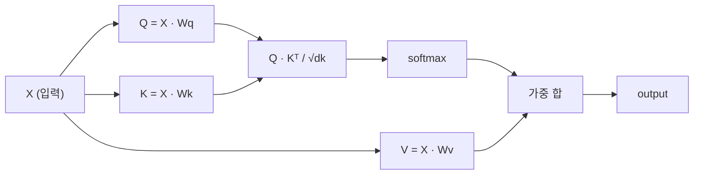

# 셀프 어텐션(셀프 어텐션)을 처음부터 구현하기

> 어텐션은 모든 단어가 "나에게 중요한 것은 무엇인가?"라고 묻고 그 답을 학습하는 조회 테이블입니다.

**유형:** Build
**언어:** Python
**선수 요건:** 3단계 (딥러닝 코어), 5단계 10강 (시퀀스 투 시퀀스)
**시간:** 약 90분

## 학습 목표

- NumPy만 사용하여 쿼리/키/값 투영과 소프트맥스 가중 합을 포함한 스케일된 점곱 셀프 어텐션을 처음부터 구현해 보세요
- 헤드를 분할하고 병렬 어텐션을 계산한 후 결과를 연결하는 멀티헤드 어텐션 레이어를 구축해 보세요
- 어텐션 매트릭스가 토큰 간 관계를 포착하는 과정을 추적하고, sqrt(d_k)로 스케일링하는 것이 소프트맥스 포화를 방지하는 이유를 설명해 보세요
- 인과적 마스킹(causal masking)을 적용하여 양방향 어텐션을 자기회귀(decoder 스타일) 어텐션으로 변환해 보세요

## 문제점

RNN은 시퀀스를 토큰 단위로 처리합니다. 50번째 토큰에 도달할 때쯤이면 1번째 토큰의 정보는 50번의 압축 단계를 거치며 소실됩니다. 장거리 의존성은 고정 크기의 은닉 상태로 압축되어 LSTM 게이트로는 완전히 해결할 수 없는 병목 현상을 일으킵니다.

2014년 Bahdanau의 어텐션 논문은 해결책을 제시했습니다. 디코더가 인코더의 모든 위치를 참조하여 현재 단계에 중요한 위치를 결정하도록 하는 것입니다. 하지만 이는 여전히 RNN에 부착된 형태였습니다. 2017년 "Attention Is All You Need" 논문은 더 날카로운 질문을 던졌습니다. 어텐션이 *유일한* 메커니즘이라면 어떨까요? 재귀도, 합성곱도 없는 순수한 어텐션만 남는다면 말입니다.

셀프 어텐션은 시퀀스의 모든 위치가 단일 병렬 단계에서 다른 모든 위치를 참조할 수 있게 합니다. 이것이 트랜스포머가 빠르고 확장 가능하며 지배적인 이유입니다.

## 개념

### 데이터베이스 조회 비유

어텐션을 소프트 데이터베이스 조회로 생각해 보세요:

```
Traditional database:
  Query: "capital of France"  -->  exact match  -->  "Paris"

Attention:
  Query: "capital of France"  -->  similarity to ALL keys  -->  weighted blend of ALL values
```

모든 토큰은 세 개의 벡터를 생성합니다:
- **쿼리 (Q)**: "무엇을 찾고 있는가?"
- **키 (K)**: "무엇을 포함하고 있는가?"
- **값 (V)**: "선택될 경우 어떤 정보를 제공하는가?"

쿼리와 모든 키의 내적은 어텐션 점수를 생성합니다. 높은 점수는 "이 키가 내 쿼리와 일치한다"는 의미입니다. 이 점수들이 값에 가중치를 부여합니다. 출력은 값의 가중 합입니다.

### Q, K, V 계산

각 토큰 임베딩은 세 개의 학습된 가중치 행렬을 통해 투영됩니다:

```
Input embeddings (sequence of n tokens, each d-dimensional):

  X = [x1, x2, x3, ..., xn]       shape: (n, d)

Three weight matrices:

  Wq  shape: (d, dk)
  Wk  shape: (d, dk)
  Wv  shape: (d, dv)

Projections:

  Q = X @ Wq    shape: (n, dk)      each token's query
  K = X @ Wk    shape: (n, dk)      each token's key
  V = X @ Wv    shape: (n, dv)      each token's value
```

하나의 토큰에 대해 시각적으로 표현하면:

```
             Wq
  x_i ------[*]------> q_i    "What am I looking for?"
       |
       |     Wk
       +----[*]------> k_i    "What do I contain?"
       |
       |     Wv
       +----[*]------> v_i    "What do I offer?"
```

### 어텐션 행렬

모든 토큰에 대해 Q, K, V를 얻으면 어텐션 점수가 행렬을 형성합니다:

```
Scores = Q @ K^T    shape: (n, n)

              k1    k2    k3    k4    k5
        +-----+-----+-----+-----+-----+
   q1   | 2.1 | 0.3 | 0.1 | 0.8 | 0.2 |   <- how much q1 attends to each key
        +-----+-----+-----+-----+-----+
   q2   | 0.4 | 1.9 | 0.7 | 0.1 | 0.3 |
        +-----+-----+-----+-----+-----+
   q3   | 0.2 | 0.6 | 2.3 | 0.5 | 0.1 |
        +-----+-----+-----+-----+-----+
   q4   | 0.9 | 0.1 | 0.4 | 1.7 | 0.6 |
        +-----+-----+-----+-----+-----+
   q5   | 0.1 | 0.3 | 0.2 | 0.5 | 2.0 |
        +-----+-----+-----+-----+-----+

Each row: one token's attention over the entire sequence
```

하나의 쿼리가 키를 순차적으로 훑어가는 것을 보세요. 각 행은 모든 토큰에 점수를 매기고, 소프트맥스가 점수를 가중치로 변환하며, 컨텍스트 벡터는 값의 가중 혼합이 됩니다.

```figure
attention-matrix
```

### 왜 스케일링하나요?

내적은 차원 dk에 따라 커집니다. dk = 64라면 내적 값이 수십 범위까지 커질 수 있으며, 이는 소프트맥스를 기울기가 소멸하는 영역으로 밀어냅니다. 해결책: sqrt(dk)로 나누는 것입니다.

```
Scaled scores = (Q @ K^T) / sqrt(dk)
```

이렇게 하면 값이 소프트맥스가 유용한 기울기를 생성하는 범위에 유지됩니다.

### 소프트맥스가 점수를 가중치로 변환

소프트맥스는 원시 점수를 각 행에 대한 확률 분포로 변환합니다:

```
Raw scores for q1:   [2.1, 0.3, 0.1, 0.8, 0.2]
                            |
                         softmax
                            |
Attention weights:   [0.52, 0.09, 0.07, 0.14, 0.08]   (sums to ~1.0)
```

이제 각 토큰은 다른 모든 토큰에 얼마나 주의를 기울여야 하는지 나타내는 가중치 집합을 갖습니다.

### 값의 가중 합

각 토큰의 최종 출력은 모든 값 벡터의 가중 합입니다:

```
output_i = sum( attention_weight[i][j] * v_j  for all j )

For token 1:
  output_1 = 0.52 * v1 + 0.09 * v2 + 0.07 * v3 + 0.14 * v4 + 0.08 * v5
```

### 전체 파이프라인



한 줄 공식:

```
Attention(Q, K, V) = softmax( Q @ K^T / sqrt(dk) ) @ V
```

```figure
softmax-attention-scaling
```

## 구현하기

### 1단계: 처음부터 소프트맥스 구현

소프트맥스는 원시 로짓을 확률로 변환합니다. 수치적 안정성을 위해 최대값을 빼세요.

```python
import numpy as np

def softmax(x):
    shifted = x - np.max(x, axis=-1, keepdims=True)
    exp_x = np.exp(shifted)
    return exp_x / np.sum(exp_x, axis=-1, keepdims=True)

logits = np.array([2.0, 1.0, 0.1])
print(f"logits:  {logits}")
print(f"softmax: {softmax(logits)}")
print(f"sum:     {softmax(logits).sum():.4f}")
```

### 2단계: 스케일된 내적 어텐션

핵심 함수입니다. Q, K, V 행렬을 받아 어텐션 출력과 가중치 행렬을 반환합니다.

```python
def scaled_dot_product_attention(Q, K, V):
    dk = Q.shape[-1]
    scores = Q @ K.T / np.sqrt(dk)
    weights = softmax(scores)
    output = weights @ V
    return output, weights
```

### 3단계: 학습된 투영을 포함한 셀프 어텐션 클래스

Xavier 유사 스케일링으로 초기화된 Wq, Wk, Wv 가중치 행렬을 갖춘 완전한 셀프 어텐션 모듈입니다.

```python
class SelfAttention:
    def __init__(self, d_model, dk, dv, seed=42):
        rng = np.random.default_rng(seed)
        scale = np.sqrt(2.0 / (d_model + dk))
        self.Wq = rng.normal(0, scale, (d_model, dk))
        self.Wk = rng.normal(0, scale, (d_model, dk))
        scale_v = np.sqrt(2.0 / (d_model + dv))
        self.Wv = rng.normal(0, scale_v, (d_model, dv))
        self.dk = dk

    def forward(self, X):
        Q = X @ self.Wq
        K = X @ self.Wk
        V = X @ self.Wv
        output, weights = scaled_dot_product_attention(Q, K, V)
        return output, weights
```

### 4단계: 문장에 대해 실행

문장에 대한 가짜 임베딩을 만들고 어텐션 가중치를 관찰해 보세요.

```python
sentence = ["The", "cat", "sat", "on", "the", "mat"]
n_tokens = len(sentence)
d_model = 8
dk = 4
dv = 4

rng = np.random.default_rng(42)
X = rng.normal(0, 1, (n_tokens, d_model))

attn = SelfAttention(d_model, dk, dv, seed=42)
output, weights = attn.forward(X)

print("Attention weights (each row: where that token looks):\n")
print(f"{'':>6}", end="")
for token in sentence:
    print(f"{token:>6}", end="")
print()

for i, token in enumerate(sentence):
    print(f"{token:>6}", end="")
    for j in range(n_tokens):
        w = weights[i][j]
        print(f"{w:6.3f}", end="")
    print()
```

### 5단계: ASCII 히트맵으로 어텐션 시각화하기

어텐션 가중치를 문자에 매핑하여 빠르게 시각화해 보세요.

```python
def ascii_heatmap(weights, tokens, chars=" ░▒▓█"):
    n = len(tokens)
    print(f"\n{'':>6}", end="")
    for t in tokens:
        print(f"{t:>6}", end="")
    print()

    for i in range(n):
        print(f"{tokens[i]:>6}", end="")
        for j in range(n):
            level = int(weights[i][j] * (len(chars) - 1) / weights.max())
            level = min(level, len(chars) - 1)
            print(f"{'  ' + chars[level] + '   '}", end="")
        print()

ascii_heatmap(weights, sentence)
```

## 사용하기

PyTorch의 `nn.MultiheadAttention`는 우리가 만든 기능에 다중 헤드 분할 및 출력 투영을 추가하여 정확히 동일한 작업을 수행합니다:

```python
import torch
import torch.nn as nn

d_model = 8
n_heads = 2
seq_len = 6

mha = nn.MultiheadAttention(embed_dim=d_model, num_heads=n_heads, batch_first=True)

X_torch = torch.randn(1, seq_len, d_model)

output, attn_weights = mha(X_torch, X_torch, X_torch)

print(f"Input shape:            {X_torch.shape}")
print(f"Output shape:           {output.shape}")
print(f"Attention weight shape: {attn_weights.shape}")
print(f"\nAttn weights (averaged over heads):")
print(attn_weights[0].detach().numpy().round(3))
```

핵심 차이점: 다중 헤드 어텐션은 여러 어텐션 함수를 병렬로 실행하며, 각 헤드는 크기가 dk = d_model / n_heads인 자체 Q, K, V 투영을 가진 후 결과를 연결합니다. 이를 통해 모델은 동시에 다양한 관계 유형에 어텐션할 수 있습니다.

## 출시하기

이 강의는 다음을 생성합니다:
- `outputs/prompt-attention-explainer.md` - 데이터베이스 조회 비유를 통해 어텐션을 설명하는 프롬프트

## 연습 문제

1. `scaled_dot_product_attention`를 수정하여, 소프트맥스 전에 특정 위치를 음의 무한대로 설정하는 선택적 마스크 매트릭스를 허용하세요 (이것이 인과적/디코더 마스크가 작동하는 방식입니다)
2. 처음부터 다중 헤드 어텐션을 구현하세요: Q, K, V를 `n_heads` 청크로 분할하고, 각 청크에 어텐션을 실행한 후 연결하고, 최종 가중치 매트릭스 Wo를 통해 투영하세요
3. 동일한 길이의 두 문장을 동일한 SelfAttention 인스턴스를 통해 입력하고 어텐션 패턴을 비교하세요. 무엇이 변하고, 무엇이 동일하게 유지됩니까?

## 핵심 용어

| 용어 | 사람들이 말하는 표현 | 실제 의미 |
|------|----------------|----------------------|
| 쿼리 (Q) | "질문 벡터" | 이 토큰이 찾고 있는 정보를 나타내는 입력의 학습된 투영 |
| 키 (K) | "라벨 벡터" | 이 토큰이 포함하는 정보를 나타내며 쿼리와 매칭되는 학습된 투영 |
| 값 (V) | "콘텐츠 벡터" | 어텐션 점수에 기반하여 집계되는 실제 정보를 담고 있는 학습된 투영 |
| 스케일된 점곱 어텐션 | "어텐션 공식" | softmax(QK^T / sqrt(dk)) @ V - 스케일링은 고차원에서의 소프트맥스 포화를 방지합니다 |
| 셀프 어텐션 | "토큰이 자기 자신과 다른 토큰을 본다" | Q, K, V가 모두 동일한 시퀀스에서 유래하며, 모든 위치가 다른 모든 위치에 어텐션할 수 있게 하는 어텐션 |
| 어텐션 가중치 | "집중의 정도" | 스케일된 점곱에 대한 소프트맥스를 통해 생성된 위치에 대한 확률 분포 |
| 멀티헤드 어텐션 | "병렬 어텐션" | 서로 다른 투영을 사용하는 여러 어텐션 함수를 병렬로 실행한 후 결과를 연결하여 더 풍부한 표현을 생성 |

## 추가 읽기

- [Attention Is All You Need (Vaswani et al., 2017)](https://arxiv.org/abs/1706.03762) - 트랜스포머 원 논문
- [The Illustrated Transformer (Jay Alammar)](https://jalammar.github.io/illustrated-transformer/) - 전체 아키텍처에 대한 최고의 시각적 안내
- [The Annotated Transformer (Harvard NLP)](https://nlp.seas.harvard.edu/annotated-transformer/) - 설명이 포함된 PyTorch 라인별 구현
