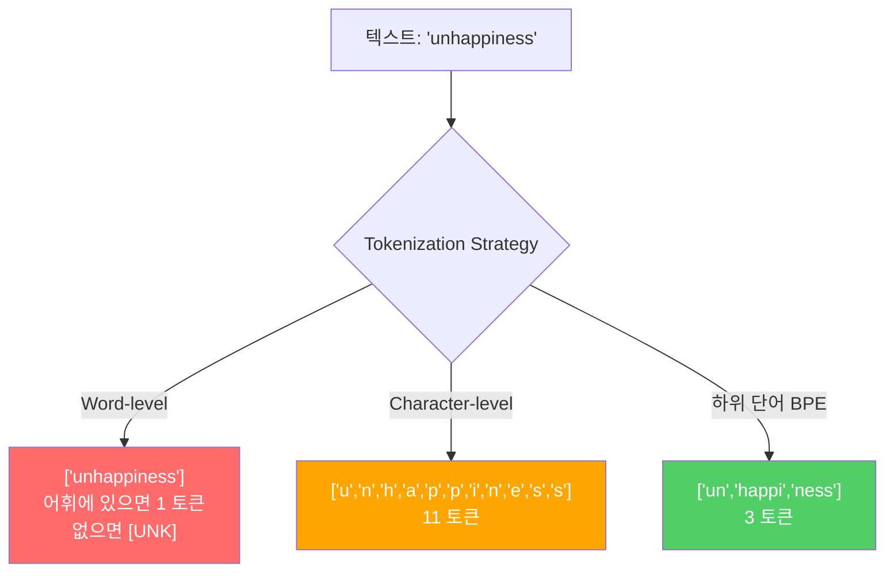
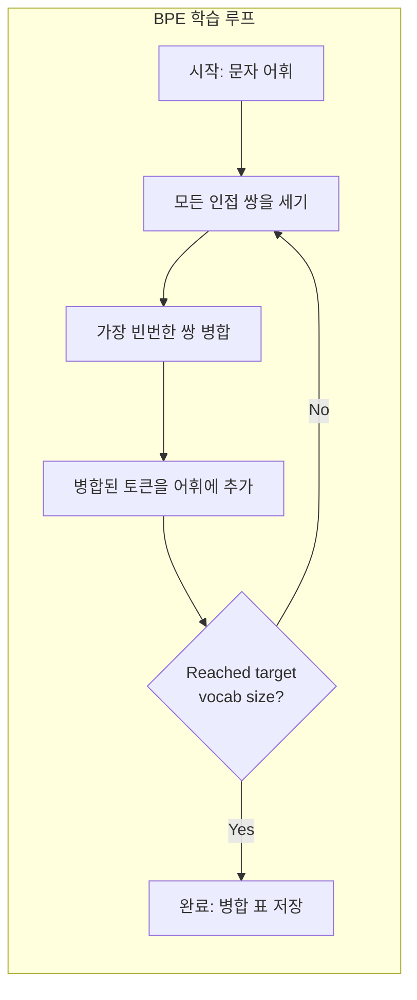
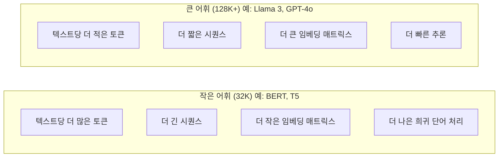

# 토크나이저: BPE, WordPiece, SentencePiece

> LLM은 영어를 읽지 않습니다. 정수를 읽습니다. 토크나이저가 그 정수가 의미를 담는지, 낭비하는지 결정합니다.

**유형:** Build
**언어:** Python
**선수 요건:** 05단계 (NLP 기초)
**시간:** 약 90분

## 학습 목표

- BPE, WordPiece, Unigram 토크나이저 알고리즘을 처음부터 구현하고 병합 전략을 비교해 보세요
- 어휘 크기가 모델 효율성에 미치는 영향을 설명해 보세요: 너무 작으면 긴 시퀀스가 생성되고, 너무 크면 임베딩 매개변수를 낭비합니다
- 언어 및 코드 전반에 걸친 토크나이저 산출물을 분석하고, 특정 토크나이저가 고장 나는 지점을 식별해 보세요
- tiktoken 및 sentencepiece 라이브러리를 사용하여 텍스트를 토크나이징하고 결과 토큰 ID를 검사해 보세요

## 문제점

LLM은 영어를 읽지 않습니다. 어떤 언어도 읽지 않습니다. 숫자를 읽습니다.

"Hello, world!"와 [15496, 11, 995, 0] 사이의 간격은 토크나이저입니다. 모든 단어, 모든 공백, 모든 구두점은 모델이 처리하기 전에 정수로 변환되어야 합니다. 이 변환은 중립적이지 않습니다. 나중에 되돌릴 수 없는 가정을 모델에 내장합니다.

이 부분을 잘못하면 모델은 공통 단어를 여러 토큰으로 인코딩하며 용량을 낭비합니다. "unfortunately"는 하나의 토큰이 아니라 네 개의 토큰이 됩니다. 다음절 단어가 많은 텍스트의 경우 128K 컨텍스트 윈도우가 75% 축소됩니다. 이 부분을 잘 처리하면 동일한 컨텍스트 윈도우가 두 배의 의미를 담습니다. "이 모델은 코드를 잘 처리한다"와 "이 모델은 Python에서 막힌다"의 차이는 토크나이저가 어떻게 학습되었는지에 따라 결정되는 경우가 많습니다.

GPT-4나 Claude에 대한 모든 API 호출은 토큰 단위로 과금됩니다. 모델이 생성하는 모든 토큰은 컴퓨팅 비용을 발생시킵니다. 출력을 표현하는 데 필요한 토큰이 적을수록 엔드투엔드 추론이 빨라집니다. 토크나이징은 전처리가 아닙니다. 아키텍처입니다.

## 개념

### 실패한 세 가지 접근법 (그리고 성공한 한 가지)

텍스트를 숫자로 변환하는 세 가지 명백한 방법이 있습니다. 그중 두 가지는 대규모로 작동하지 않습니다.

**단어 단위 토큰화**는 공백과 구두점을 기준으로 분할합니다. "The cat sat"은 ["The", "cat", "sat"]가 됩니다. 간단합니다. 하지만 "tokenization"은 어떻게 처리할까요? "GPT-4o"는요? "Geschwindigkeitsbegrenzung" 같은 독일어 복합어는요? 단어 단위 토큰화는 모든 언어의 모든 단어를 다루기 위해 방대한 어휘가 필요합니다. 단어를 놓치면 끔찍한 `[UNK]` 토큰이 생성됩니다. 이는 모델이 "이게 뭔지 모르겠다"라고 말하는 방식입니다. 영어만으로도 백만 개 이상의 단어 형태가 있습니다. 코드, URL, 과학적 표기법, 그리고 다른 100개 언어를 추가하면 무한한 어휘가 필요합니다.

**문자 단위 토큰화**는 반대 방향으로 진행합니다. "hello"는 ["h", "e", "l", "l", "o"]가 됩니다. 어휘는 매우 작습니다 (몇백 개의 문자). 알 수 없는 토큰은 절대 발생하지 않습니다. 하지만 시퀀스는 극도로 길어집니다. 단어 단위 토큰으로 10개였던 문장이 문자 단위 토큰으로는 50개가 됩니다. 모델은 "t", "h", "e"가 합쳐져 "the"를 의미한다는 것을 학습해야 합니다. 이는 인간이 세 살 때 배우는 것에 주의력 용량을 소진하는 셈입니다.

**하위 단어(subword) 토큰화**는 최적의 균형점을 찾습니다. 흔한 단어는 그대로 유지됩니다: "the"는 하나의 토큰입니다. 희소한 단어는 의미 있는 조각으로 분해됩니다: "unhappiness"는 ["un", "happi", "ness"]가 됩니다. 어휘는 관리 가능한 크기를 유지합니다 (30K~128K 토큰). 시퀀스는 짧게 유지됩니다. 모든 단어를 하위 단어 조각으로 구성할 수 있으므로 알 수 없는 토큰은 사실상 사라집니다.

모든 최신 LLM (대규모 언어 모델)은 하위 단어 토큰화를 사용합니다. GPT-2, GPT-4, BERT, Llama 3, Claude -- 모두 그렇습니다. 문제는 어떤 알고리즘을 사용할지입니다.



### BPE: 바이트 쌍 인코딩 (BPE)(Byte Pair Encoding (BPE))

BPE는 토큰화를 위해 재사용된 탐욕적(greedy) 압축 알고리즘입니다. 아이디어는 간단하여 카드 한 장에 담을 수 있을 정도입니다.

개별 문자로 시작합니다. 학습 코퍼스에서 모든 인접 쌍을 세어 보세요. 가장 빈번한 쌍을 새로운 토큰으로 병합합니다. 목표 어휘 크기에 도달할 때까지 반복합니다.

```figure
tokenizer-bpe
```

여기서는 "lower", "lowest", "newest"라는 단어를 포함한 작은 코퍼스에서 BPE가 실행되는 과정을 보여줍니다:

```
Corpus (with word frequencies):
  "lower"  x5
  "lowest" x2
  "newest" x6

Step 0 -- Start with characters:
  l o w e r       (x5)
  l o w e s t     (x2)
  n e w e s t     (x6)

Step 1 -- Count adjacent pairs:
  (e,s): 8    (s,t): 8    (l,o): 7    (o,w): 7
  (w,e): 13   (e,r): 5    (n,e): 6    ...

Step 2 -- Merge most frequent pair (w,e) -> "we":
  l o we r        (x5)
  l o we s t      (x2)
  n e we s t      (x6)

Step 3 -- Recount and merge (e,s) -> "es":
  l o we r        (x5)
  l o we s t      (x2)    <- 'es' only forms from 'e'+'s', not 'we'+'s'
  n e we s t      (x6)    <- wait, the 'e' before 'we' and 's' after 'we'

Actually tracking this precisely:
  After "we" merge, remaining pairs:
  (l,o): 7   (o,we): 7   (we,r): 5   (we,s): 8
  (s,t): 8   (n,e): 6    (e,we): 6

Step 3 -- Merge (we,s) -> "wes" or (s,t) -> "st" (tied at 8, pick first):
  Merge (we,s) -> "wes":
  l o we r        (x5)
  l o wes t       (x2)
  n e wes t       (x6)

Step 4 -- Merge (wes,t) -> "west":
  l o we r        (x5)
  l o west        (x2)
  n e west        (x6)

...continue until target vocab size reached.
```

병합 표가 바로 토크나이저입니다. 새로운 텍스트를 인코딩하려면 학습된 순서대로 병합을 적용하세요. 학습 코퍼스가 어떤 병합이 존재하는지 결정하며, 이 선택은 모델이 보는 내용을 영구적으로 형성합니다.



### 바이트 수준 BPE (GPT-2, GPT-3, GPT-4)

표준 BPE는 유니코드 문자를 다룹니다. 바이트 수준 BPE는 원시 바이트(0-255)를 다룹니다. 이는 정확히 256개의 기본 어휘를 제공하며, 모든 언어 및 인코딩을 처리하고, 알 수 없는 토큰을 생성하지 않습니다.

GPT-2가 이 접근법을 도입했습니다. 기본 어휘는 모든 가능한 바이트를 포함합니다. BPE 병합은 그 위에 구축됩니다. OpenAI의 `tiktoken` 라이브러리는 다음 어휘 크기로 바이트 수준 BPE를 구현합니다:

- GPT-2: 50,257 토큰
- GPT-3.5/GPT-4: 약 100,256 토큰 (cl100k_base 인코딩)
- GPT-4o: 200,019 토큰 (o200k_base 인코딩)

### WordPiece (BERT)

WordPiece는 BPE와 유사해 보이지만 병합을 선택하는 방식이 다릅니다. 원시 빈도 대신 학습 데이터의 최대 우도를 극대화합니다:

```
BPE merge criterion:      count(A, B)
WordPiece merge criterion: count(AB) / (count(A) * count(B))
```

BPE는 "어떤 쌍이 가장 자주 나타나는가?"라고 묻습니다. WordPiece는 "어떤 쌍이 우연히 기대되는 것보다 더 자주 함께 나타나는가?"라고 묻습니다. 이 미묘한 차이로 인해 서로 다른 어휘가 생성됩니다. WordPiece는 단순히 빈번한 것이 아니라 공현상이 놀라운 병합을 선호합니다.

WordPiece는 연속 하위 단어를 위해 "##" 접두사를 사용하기도 합니다:

```
"unhappiness" -> ["un", "##happi", "##ness"]
"embedding"   -> ["em", "##bed", "##ding"]
```

"##" 접두사는 이 조각이 이전 토큰을 계속한다는 것을 알려줍니다. BERT는 30,522 토큰 어휘로 WordPiece를 사용합니다. 모든 BERT 변형 -- DistilBERT의 토크나이저는 실제로 BPE이지만, BERT 자체는 WordPiece입니다.

### SentencePiece (Llama, T5)

SentencePiece는 입력을 공백을 포함한 원시 유니코드 문자 스트림으로 취급합니다. 사전 토큰화 단계가 없습니다. 단어 경계에 대한 언어별 규칙도 없습니다. 이는 SentencePiece를 진정한 언어 독립적으로 만듭니다 -- 공백이 단어를 분리하지 않는 중국어, 일본어, 태국어 및 기타 언어에서도 작동합니다.

SentencePiece는 두 가지 알고리즘을 지원합니다:
- **BPE 모드**: 표준 BPE와 동일한 병합 로직을 원시 문자열에 적용
- **Unigram 모드**: 큰 어휘로 시작하여 전체 가능성에 가장 적게 영향을 미치는 토큰을 반복적으로 제거합니다. BPE의 역방향 -- 병합 대신 가지치기(prune)를 수행합니다.

Llama 2는 32,000개 토큰 어휘를 사용하는 SentencePiece BPE를 사용합니다. T5는 32,000개 토큰을 사용하는 SentencePiece Unigram을 사용합니다. 참고: Llama 3는 128,256개 토큰을 사용하는 tiktoken 기반 바이트 수준 BPE 토크나이저로 전환했습니다.

### 어휘 크기 절충안

이는 측정 가능한 결과를 가져오는 실제 엔지니어링 결정입니다.



구체적인 수치. 4,096차원 임베딩을 사용하는 128K 어휘의 경우, 임베딩 매트릭스만으로도 128,000 x 4,096 = 5억 2,400만 개의 매개변수가 필요합니다. 32K 어휘의 경우 1억 3,100만 개의 매개변수입니다. 토크나이저 선택만으로 4억 개의 매개변수 차이가 발생합니다.

그러나 더 큰 어휘는 텍스트를 더 공격적으로 압축합니다. 32K 어휘로 100개 토큰이 필요한 동일한 영어 단락이 128K 어휘에서는 70개 토큰이 될 수 있습니다. 이는 생성 중 순방향 패스가 30% 감소한다는 의미입니다. 수백만 개의 요청을 처리하는 모델의 경우, 이는 컴퓨팅 비용의 직접적인 감소로 이어집니다.

추세는 명확합니다: 어휘 크기가 증가하고 있습니다. GPT-2는 50,257개를 사용했습니다. GPT-4는 약 100K개를 사용합니다. Llama 3는 128K개를 사용합니다. GPT-4o는 200K개를 사용합니다.

| 모델 | 어휘 크기 | 토크나이저 유형 | 영어 단어당 평균 토큰 수 |
|-------|-----------|----------------|---------------------------|
| BERT | 30,522 | WordPiece | ~1.4 |
| GPT-2 | 50,257 | 바이트 수준 BPE | ~1.3 |
| Llama 2 | 32,000 | SentencePiece BPE | ~1.4 |
| GPT-4 | ~100,256 | 바이트 수준 BPE | ~1.2 |
| Llama 3 | 128,256 | 바이트 수준 BPE (tiktoken) | ~1.1 |
| GPT-4o | 200,019 | 바이트 수준 BPE | ~1.0 |

### 다국어 비용

주로 영어에 기반하여 훈련된 토크나이저는 다른 언어에 대해 가혹합니다. GPT-2의 토크나이저에서 한국어는 평균적으로 단어당 2~3개의 토큰을 차지합니다. 중국어는 더 나쁠 수 있습니다. 이는 한국어 사용자가 영어 사용자와 비교하여 컨텍스트 윈도우(Context Window)의 크기가 절반에 불과하다는 것을 의미합니다 -- 동일한 비용을 지불하면서 정보 밀도는 더 낮습니다.

이것이 Llama 3가 어휘를 32K에서 128K로 네 배 늘린 이유입니다. 비영어 문자에 더 많은 토큰을 할당하면 언어 간에 더 공정한 압축이 가능합니다.

```figure
tokenizer-tradeoff
```

## 구현하기

### 1단계: 문자 단위 토크나이저

기초부터 시작하세요. 문자 단위 토크나이저는 각 문자를 유니코드 코드 포인트에 매핑합니다. 훈련이 필요하지 않으며, 알 수 없는 토큰도 없습니다. 단순한 직접 매핑일 뿐입니다.

```python
class CharTokenizer:
    def encode(self, text):
        return [ord(c) for c in text]

    def decode(self, tokens):
        return "".join(chr(t) for t in tokens)
```

"hello"는 [104, 101, 108, 108, 111]이 됩니다. 모든 문자가 자체 토큰입니다. 이것이 우리가 개선해 나갈 기준선입니다.

### 2단계: 처음부터 만드는 BPE 토크나이저

실제 구현입니다. 원시 바이트(GPT-2처럼)로 훈련하고, 쌍을 세고, 가장 빈번한 쌍을 병합하며, 모든 병합을 순서대로 기록합니다. 병합 테이블이 토크나이저입니다.

```python
from collections import Counter

class BPETokenizer:
    def __init__(self):
        self.merges = {}
        self.vocab = {}

    def _get_pairs(self, tokens):
        pairs = Counter()
        for i in range(len(tokens) - 1):
            pairs[(tokens[i], tokens[i + 1])] += 1
        return pairs

    def _merge_pair(self, tokens, pair, new_token):
        merged = []
        i = 0
        while i < len(tokens):
            if i < len(tokens) - 1 and tokens[i] == pair[0] and tokens[i + 1] == pair[1]:
                merged.append(new_token)
                i += 2
            else:
                merged.append(tokens[i])
                i += 1
        return merged

    def train(self, text, num_merges):
        tokens = list(text.encode("utf-8"))
        self.vocab = {i: bytes([i]) for i in range(256)}

        for i in range(num_merges):
            pairs = self._get_pairs(tokens)
            if not pairs:
                break
            best_pair = max(pairs, key=pairs.get)
            new_token = 256 + i
            tokens = self._merge_pair(tokens, best_pair, new_token)
            self.merges[best_pair] = new_token
            self.vocab[new_token] = self.vocab[best_pair[0]] + self.vocab[best_pair[1]]

        return self

    def encode(self, text):
        tokens = list(text.encode("utf-8"))
        for pair, new_token in self.merges.items():
            tokens = self._merge_pair(tokens, pair, new_token)
        return tokens

    def decode(self, tokens):
        byte_sequence = b"".join(self.vocab[t] for t in tokens)
        return byte_sequence.decode("utf-8", errors="replace")
```

훈련 루프는 BPE의 핵심입니다: 쌍을 세고, 승자를 병합하고, 반복하세요. 각 병합은 총 토큰 수를 줄입니다. `num_merges` 라운드 후, 어휘는 256(기본 바이트)에서 256 + num_merges로 증가합니다.

인코딩은 학습된 순서대로 병합을 적용합니다. 이것이 중요합니다. 병합 1이 "th"를 생성하고 병합 5가 "the"를 생성했다면, 병합 5에서 "th" + "e"로 "the"가 형성될 수 있도록 병합 1을 먼저 적용해야 합니다.

디코딩은 역순입니다: 어휘에서 각 토큰 ID를 조회하고, 바이트를 연결하여 UTF-8로 디코딩하세요.

### 3단계: 인코딩 및 디코딩 왕복

```python
corpus = (
    "The cat sat on the mat. The cat ate the rat. "
    "The dog sat on the log. The dog ate the frog. "
    "Natural language processing is the study of how computers "
    "understand and generate human language. "
    "Tokenization is the first step in any NLP pipeline."
)

tokenizer = BPETokenizer()
tokenizer.train(corpus, num_merges=40)

test_sentences = [
    "The cat sat on the mat.",
    "Natural language processing",
    "tokenization pipeline",
    "unhappiness",
]

for sentence in test_sentences:
    encoded = tokenizer.encode(sentence)
    decoded = tokenizer.decode(encoded)
    raw_bytes = len(sentence.encode("utf-8"))
    ratio = len(encoded) / raw_bytes
    print(f"'{sentence}'")
    print(f"  Tokens: {len(encoded)} (from {raw_bytes} bytes) -- ratio: {ratio:.2f}")
    print(f"  Roundtrip: {'PASS' if decoded == sentence else 'FAIL'}")
```

압축 비율은 토크나이저의 효율성을 알려줍니다. 비율이 0.50이면 토크나이저가 원시 바이트의 절반 수의 토큰으로 텍스트를 압축했다는 의미입니다. 낮을수록 좋습니다. 훈련 코퍼스에서는 비율이 좋습니다. "unhappiness"(코퍼스에 나타나지 않는)와 같은 분포 밖(out-of-distribution) 텍스트에서는 비율이 더 나빠집니다 -- 토크나이저는 보지 못한 패턴에 대해 문자 단위 인코딩으로 폴백합니다.

### 4단계: tiktoken과 비교하기

```python
import tiktoken

enc = tiktoken.get_encoding("cl100k_base")

texts = [
    "The cat sat on the mat.",
    "unhappiness",
    "Hello, world!",
    "def fibonacci(n): return n if n < 2 else fibonacci(n-1) + fibonacci(n-2)",
    "Geschwindigkeitsbegrenzung",
]

for text in texts:
    our_tokens = tokenizer.encode(text)
    tiktoken_tokens = enc.encode(text)
    tiktoken_pieces = [enc.decode([t]) for t in tiktoken_tokens]
    print(f"'{text}'")
    print(f"  Our BPE:   {len(our_tokens)} tokens")
    print(f"  tiktoken:  {len(tiktoken_tokens)} tokens -> {tiktoken_pieces}")
```

tiktoken은 동일한 알고리즘을 사용하지만, 수백 GB의 텍스트로 학습하고 100,000번의 병합을 수행합니다. 알고리즘은 동일합니다. 차이점은 학습 데이터와 병합 횟수입니다. 단락으로 학습하고 병합 횟수가 40번인 토크나이저는 대규모 코퍼스로 학습한 tiktoken의 100K 병합과 경쟁할 수 없습니다. 하지만 메커니즘은 동일합니다.

### 5단계: 어휘 분석

```python
def analyze_vocabulary(tokenizer, test_texts):
    total_tokens = 0
    total_chars = 0
    token_usage = Counter()

    for text in test_texts:
        encoded = tokenizer.encode(text)
        total_tokens += len(encoded)
        total_chars += len(text)
        for t in encoded:
            token_usage[t] += 1

    print(f"Vocabulary size: {len(tokenizer.vocab)}")
    print(f"Total tokens across all texts: {total_tokens}")
    print(f"Total characters: {total_chars}")
    print(f"Avg tokens per character: {total_tokens / total_chars:.2f}")

    print(f"\nMost used tokens:")
    for token_id, count in token_usage.most_common(10):
        token_bytes = tokenizer.vocab[token_id]
        display = token_bytes.decode("utf-8", errors="replace")
        print(f"  Token {token_id:4d}: '{display}' (used {count} times)")

    unused = [t for t in tokenizer.vocab if t not in token_usage]
    print(f"\nUnused tokens: {len(unused)} out of {len(tokenizer.vocab)}")
```

이 분석을 통해 어휘의 Zipf 분포가 드러납니다. 몇몇 토큰(공백, "the", "e")이 지배적입니다. 대부분의 토큰은 거의 사용되지 않습니다. 프로덕션 토크나이저는 이 분포에 최적화되어 있습니다. 즉, 흔한 패턴은 짧은 토큰 ID를 받고, 드문 패턴은 더 긴 표현을 받습니다.

## 사용하기

직접 만든 BPE가 작동합니다. 이제 프로덕션 도구가 어떻게 생겼는지 확인해 보세요.

### tiktoken (OpenAI)

```python
import tiktoken

enc = tiktoken.get_encoding("cl100k_base")

text = "Tokenizers convert text to integers"
tokens = enc.encode(text)
print(f"Tokens: {tokens}")
print(f"Pieces: {[enc.decode([t]) for t in tokens]}")
print(f"Roundtrip: {enc.decode(tokens)}")
```

tiktoken은 Rust로 작성되었으며 Python 바인딩을 제공합니다. 초당 수백만 개의 토큰을 인코딩합니다. 동일한 BPE 알고리즘을 산업용 강도로 구현한 것입니다.

### Hugging Face 토크나이저

```python
from tokenizers import Tokenizer
from tokenizers.models import BPE
from tokenizers.trainers import BpeTrainer
from tokenizers.pre_tokenizers import ByteLevel

tokenizer = Tokenizer(BPE())
tokenizer.pre_tokenizer = ByteLevel()

trainer = BpeTrainer(vocab_size=1000, special_tokens=["<pad>", "<eos>", "<unk>"])
tokenizer.train(["corpus.txt"], trainer)

output = tokenizer.encode("The cat sat on the mat.")
print(f"Tokens: {output.tokens}")
print(f"IDs: {output.ids}")
```

Hugging Face 토크나이저 라이브러리도 내부적으로 Rust를 사용합니다. 기가바이트 규모의 코퍼스로 BPE를 몇 초 만에 학습합니다. 자체 모델을 학습할 때 이 도구를 사용합니다.

### Llama의 토크나이저 로드하기

```python
from transformers import AutoTokenizer

tokenizer = AutoTokenizer.from_pretrained("meta-llama/Llama-3.1-8B")

text = "Tokenizers are the unsung heroes of LLMs"
tokens = tokenizer.encode(text)
print(f"Token IDs: {tokens}")
print(f"Tokens: {tokenizer.convert_ids_to_tokens(tokens)}")
print(f"Vocab size: {tokenizer.vocab_size}")

multilingual = ["Hello world", "Hola mundo", "Bonjour le monde"]
for text in multilingual:
    ids = tokenizer.encode(text)
    print(f"'{text}' -> {len(ids)} tokens")
```

Llama 3의 128K 어휘는 GPT-2의 50K 어휘보다 비영어권 텍스트를 훨씬 더 잘 압축합니다. 직접 확인해 보세요. 같은 문장을 여러 언어로 인코딩하고 토큰 수를 세어 보세요.

## 출시하기

이 강의는 `outputs/prompt-tokenizer-analyzer.md`를 생성합니다. 이는 임의의 텍스트와 모델 조합에 대해 토큰화 효율성을 분석하는 재사용 가능한 프롬프트입니다. 텍스트 샘플을 입력하면 어떤 모델의 토크나이저가 가장 잘 처리하는지 알려줍니다.

## 연습 문제

1. BPE 토크나이저가 각 병합 단계에서 어휘를 출력하도록 수정하세요. "t" + "h"가 "th"가 되고, "th" + "e"가 "the"가 되는 과정을 지켜보세요. 흔한 영어 단어가 조각조각 조립되는 과정을 추적하세요.

2. BPE 토크나이저에 특수 토큰(`<pad>`, `<eos>`, `<unk>`)을 추가하세요. 이들에게 ID 0, 1, 2를 할당하고 나머지 모든 토큰의 ID를相应하게 이동하세요. BPE를 실행하기 전에 공백으로 분할하는 사전 토큰화 단계를 구현하세요.

3. WordPiece 병합 기준(빈도 대신 우도 비율)을 구현해 보세요. 동일한 코퍼스로 BPE와 WordPiece를 동일한 병합 횟수로 학습한 후, 생성된 어휘를 비교해 보세요. 어느 쪽이 언어학적으로 더 의미 있는 하위 단어를 생성하나요?

4. 다국어 토크나이저 효율성 벤치마크를 구축해 보세요. 영어, 스페인어, 중국어, 한국어, 아랍어로 각각 10문장을 선택하세요. 각 문장을 `tiktoken` (`cl100k_base`)으로 토큰화하고 문자당 평균 토큰 수를 측정하세요. 각 언어의 "다국어 세금(multilingual tax)"을 정량화해 보세요.

5. 더 큰 코퍼스로 BPE 토크나이저를 학습해 보세요 (위키피디아 기사를 다운로드하세요). 병합 횟수를 조정하여 동일한 텍스트에서 `tiktoken` 대비 압축률이 10% 이내가 되도록 하세요. 이를 통해 코퍼스 크기, 병합 횟수, 압축 품질 간의 관계를 이해할 수 있습니다.

## 핵심 용어

| 용어 | 사람들이 말하는 것 | 실제 의미 |
|------|----------------|----------------------|
| 토큰(Token) | "단어" | 모델 어휘의 단위 -- 문자, 하위 단어, 단어, 또는 다중 단어 청크일 수 있음 |
| BPE | "압축 같은 것" | 바이트 쌍 인코딩 (Byte Pair Encoding) -- 목표 어휘 크기에 도달할 때까지 가장 빈번한 인접 토큰 쌍을 반복적으로 병합 |
| WordPiece | "BERT의 토크나이저" | BPE와 유사하지만, 단순 빈도 대신 우도 비율 count(AB)/(count(A)*count(B))을 최대화하는 병합을 수행 |
| SentencePiece | "토크나이저 라이브러리" | 사전 토큰화 없이 원시 유니코드에서 작동하는 언어 독립적 토크나이저로, BPE와 Unigram 알고리즘을 지원 |
| 어휘 크기 | "알고 있는 단어의 수" | 고유 토큰의 총 개수: GPT-2는 50,257, BERT는 30,522, Llama 3는 128,256 |
| Fertility | "토크나이저 용어가 아님" | 단어당 평균 토큰 수 -- 언어 간 토크나이저 효율성을 측정 (1.0은 완벽, 3.0은 모델이 3배 더 힘들게 작동함을 의미) |
| 바이트 수준 BPE | "GPT의 토크나이저" | 유니코드 문자 대신 원시 바이트(0-255)에서 작동하는 BPE로, 모든 입력에 대해 알 수 없는 토큰이 없음을 보장 |
| 병합 테이블 | "토크나이저 파일" | 학습 중에 학습된 쌍 병합의 순서 있는 목록 -- 이것이 토크나이저이며, 순서가 중요함 |
| 토큰화 전 처리 | "공백으로 분리" | 하위 단어(subword) 토큰화 전에 적용되는 규칙: 공백 분리, 숫자 분리, 구두점 처리 |
| 압축률 | "토크나이저의 효율성" | 생성된 토큰 수를 입력 바이트 수로 나눈 값 -- 낮을수록 압축률이 좋고 추론이 빠릅니다 |

## 추가 읽기

- [Sennrich et al., 2016 -- "Neural Machine Translation of Rare Words with Subword Units"](https://arxiv.org/abs/1508.07909) -- NLP에 BPE를 도입한 논문으로, 1994년 압축 알고리즘을 현대 토큰화의 기초로 전환했습니다
- [Kudo & Richardson, 2018 -- "SentencePiece: A simple and language independent subword tokenizer"](https://arxiv.org/abs/1808.06226) -- 언어에 독립적인 토큰화로 다국어 모델을 실용화했습니다
- [OpenAI tiktoken repository](https://github.com/openai/tiktoken) -- GPT-3.5/4/4o에서 사용되는 Rust 기반 Python 바인딩의 프로덕션 BPE 구현체입니다
- [Hugging Face Tokenizers documentation](https://huggingface.co/docs/tokenizers) -- Rust 성능을 활용한 프로덕션급 토크나이저 훈련 도구입니다
