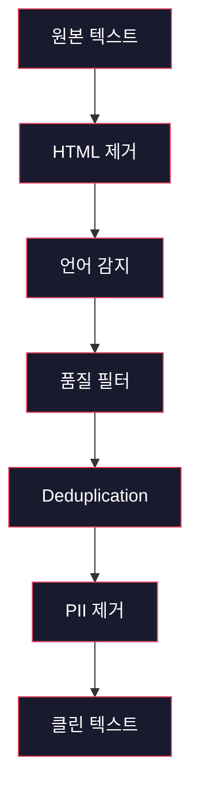
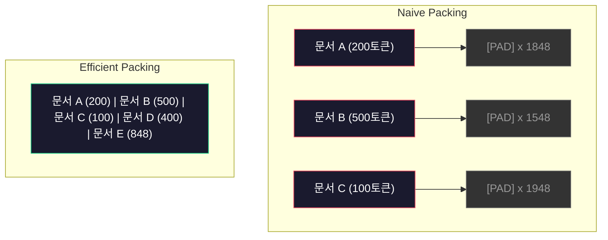

# 사전 학습을 위한 데이터 파이프라인

> 모델은 거울입니다. 입력하는 데이터를 그대로 반영합니다. 쓰레기를 입력하면, 완벽한 유창성으로 쓰레기를 반영합니다.

**유형:** Build
**언어:** Python
**선수 요건:** 10단계, 01-02강 (토크나이저, 토크나이저 구축)
**시간:** 약 90분

## 학습 목표

- 전체 데이터를 메모리에 로드하지 않고, 수 테라바이트의 텍스트를 토큰화, 청킹, 셔플, 배치 처리하는 스트리밍 데이터 파이프라인을 구축해 보세요
- 실제 사전 학습 파이프라인에서 사용되는 데이터 품질 필터(중복 제거, 언어 감지, 콘텐츠 필터링)를 구현해 보세요
- 적절한 어텐션 마스크와 문서 경계 처리를 통해 고정 길이 학습 시퀀스를 생성해 보세요
- 파이프라인 처리량을 프로파일링하여 데이터 로더가 GPU 학습 속도를 따라잡을 수 있는지 확인해 보세요

## 문제점

토크나이저가 있습니다. 이제 데이터가 필요합니다.

데이터셋이 아닙니다. CSV 파일도 아닙니다. 수 테라바이트의 텍스트가 필요합니다. 이 텍스트는 정제되고, 중복이 제거되며, 품질 필터링을 거치고, 고정 길이 시퀀스로 토큰화되며, 8-GPU 클러스터가 다음 배치를 기다리지 않을 정도로 빠르게 랜덤 배치로 제공되어야 합니다.

대부분의 사람들은 LLM 학습이 모델 아키텍처에 관한 것이라고 생각합니다. 그렇지 않습니다. Llama 3는 15.6조 개의 토큰을 사용했습니다. GPT-3는 3000억 개를 사용했습니다. DeepSeek-V2는 8.1조 개를 사용했습니다. 세 모델의 아키텍처는 어텐션과 피드포워드 레이어를 가진 스택형 트랜스포머 블록으로 대략 동일합니다. 출력 품질의 차이는 압도적으로 데이터에서 옵니다.

DeepMind의 Chinchilla 논문은 이를 정밀하게 명시했습니다. 주어진 컴퓨팅 예산에 대해 모델 매개변수와 학습 토큰 수의 최적 비율이 존재합니다. Chinchilla는 2022년 대부분의 모델이 극도로 학습이 부족했음을 보여 주었습니다. 즉, 본 데이터의 양에 비해 매개변수가 너무 많았습니다. 1.4조 개의 토큰으로 학습된 700억 매개변수 모델(Chinchilla 최적)은 3000억 개의 토큰으로 학습된 2800억 매개변수 모델(Gopher)보다 성능이 더 좋았습니다.

데이터 파이프라인은 모델이 언어를 학습할지, 잡음을 학습할지를 결정합니다.

## 개념

### 데이터가 오는 곳

모든 대규모 언어 모델은 다양한 출처의 혼합 데이터로 학습됩니다. 정확한 구성은 대부분의 연구소 기밀이지만, 범주를 이해할 만큼은 충분히 알려져 있습니다.

| 출처 | 크기 | 품질 | 사용 모델 |
|--------|------|---------|---------|
| Common Crawl | 원본 약 250 TB | 낮음 (강한 필터링 필요) | GPT-3, Llama, 대부분의 오픈 모델 |
| Wikipedia | 약 20 GB | 높음 | 모든 주요 LLM |
| GitHub 코드 | 약 1 TB 이상 | 중간 (중복 및 죽은 코드 많음) | StarCoder, CodeLlama, DeepSeek-Coder |
| 도서 (BookCorpus, Pile) | 약 100 GB | 높음 | GPT-2, GPT-3, 초기 모델 |
| 학술 논문 (arXiv, S2ORC) | 약 100 GB | STEM 분야에 높음 | Llama, Galactica |
| StackOverflow, Reddit | 약 100 GB | 중간 | Llama, Falcon |
| 큐레이션된 웹 (C4, RefinedWeb) | 약 5 TB | 중간~높음 (사전 필터링됨) | T5, Falcon |

Llama 3는 데이터 구성을 공개했습니다: 웹 데이터 약 50%, 코드 25%, 도서 및 학술 논문 13%, 수학 데이터 8%, 다국어 웹 데이터 4%. 총 15.6조 토큰이며, 원본 텍스트는 5 TB를 초과하는 출처에서 수집되었습니다.

비율은 총 크기만큼 중요합니다. 웹 데이터가 너무 많으면 모델은 Reddit 앵무새가 됩니다. 코드가 너무 적으면 프로그래밍을 할 수 없습니다. 수학이 너무 적으면 추론에 실패합니다. 이 혼합을 적절히 구성하는 것은 LLM 학습에서 가장 어려운 부분 중 하나이며, 공식이 없습니다. 실험과 평가가 필요합니다.

### 데이터 클리닝

원본 웹 데이터는 매우 오염되어 있습니다. 일반적인 Common Crawl 덤프에는 다음이 포함됩니다:

- HTML 태그 및 JavaScript
- 보일러플레이트 헤더, 푸터, 내비게이션 메뉴
- 중복 페이지 (정확한 중복 및 유사 중복)
- 기계 생성 스팸
- 개인 식별 정보 (PII)
- 저품질 텍스트 (키워드 목록, SEO 스팸)
- 텍스트로 인코딩된 비텍스트 콘텐츠

이 클리닝은 선택 사항이 아닙니다. 이는 일관된 단락을 생성하는 모델과 HTML 태그가 제품 목록과 섞여 출력되는 모델의 차이입니다.



각 단계는 잡음의 한 범주를 제거합니다:

**HTML 제거:** 모든 마크업을 제거합니다. 가시적인 텍스트 내용만 남깁니다. `trafilatura`이나 `readability`와 같은 라이브러리는 내비게이션, 광고, 템플릿 텍스트를 버리고 기사 내용을 추출합니다.

**언어 감지:** fastText의 언어 식별 모델(lid.176.bin)을 사용하여 각 문서를 분류합니다. 목표 언어로 필터링하세요. 영어로 분류되었지만 신뢰도가 0.8 미만인 문서는 깨끗한 영어가 아닐 가능성이 높습니다.

**품질 필터링:** 여기서 흥미로운 부분이 시작됩니다. RefinedWeb (Falcon의 기반 데이터셋)은 퍼플렉시티 기반 필터를 사용합니다. Wikipedia에 작은 언어 모델을 학습시킨 후 각 문서에 점수를 매깁니다. 높은 퍼플렉시티는 문서가 Wikipedia와 다르다는 것을 의미하며, 스팸, 키워드 목록, 기계 생성 콘텐츠일 가능성이 높습니다. 임계값 이상의 퍼플렉시티를 가진 문서는 제거됩니다.

**중복 제거:** 가장 영향력 있는 클리닝 단계입니다. Common Crawl은 방대한 수의 중복 페이지를 포함하고 있습니다. 법적 고지, 쿠키 알림, 서비스 약관 등이 이에 해당합니다. 중복된 데이터로 학습하면 연산 자원을 낭비하며, 모델이 특정 구절을 그대로 암기하고 재생하는 원인이 될 수 있습니다.

**PII 제거:** 이름, 이메일 주소, 전화번호, 사회 보장 번호. 구조화된 PII는 정규식 기반 탐지를, 문맥 내 이름은 NER 모델을 사용합니다.

### MinHash를 이용한 중복 제거

정확한 중복 제거는 쉽습니다. 각 문서의 해시를 계산하고 중복을 제거하면 됩니다. 하지만 유사 중복(near-duplicates)이 진짜 문제입니다. 광고가 약간 다른 같은 뉴스 기사의 두 사본은 유사 중복입니다. 내용은 95% 동일하지만, 바이트 단위로 보면 다릅니다.

MinHash + 지역 민감 해싱(LSH)이 이를 효율적으로 해결합니다.


아이디어는 다음과 같습니다:

1. **셔링(Shingling):** 각 문서를 n-gram 세트(예: 단어 또는 문자의 5-gram)로 변환합니다. "the quick brown fox"는 3단어 셔링을 적용하면 {"the quick brown", "quick brown fox"}가 됩니다.

2. **MinHash:** 각 문서의 신글 집합에 대해 k개의 해시 값을 계산합니다. 각 해시 값은 서로 다른 해시 함수 아래 모든 신글 중 최소 해시 값입니다. 이는 두 문서 간의 자카드 유사도를 근사하는 고정 크기의 "서명(signature)"을 생성합니다.

3. **LSH:** MinHash 서명의 밴드(band)에 기반하여 문서를 버킷으로 그룹화합니다. 같은 버킷에 속한 문서는 후보 준중복(near-duplicate)입니다. 이는 모든 쌍을 비교하는 것을 피하며, 후보만 비교하도록 합니다.

4. **검증:** 각 후보 쌍에 대해 정확한 자카드 유사도를 계산합니다. 유사도가 임계값(통상 0.8)을 초과하면 복사본 하나를 제거합니다.

Llama 팀은 중복 제거를 통해 웹 데이터의 약 38%를 제거했다고 보고했습니다. 이는 작은 숫자가 아닙니다. Common Crawl의 3분의 1 이상이 중복 또는 준중복 콘텐츠입니다.

### 시퀀스 패킹

모델은 고정 길이 입력 시퀀스를 기대합니다. 문서의 길이는 가변적입니다. 어떤 문서는 50토큰이고, 어떤 문서는 50,000토큰입니다.

소박한 접근법: 모든 문서를 최대 시퀀스 길이로 패딩합니다. 이는 학습에 기여하지 않는 패딩 토큰에 막대한 연산 자원을 낭비합니다.

더 나은 접근법: 여러 문서를 단일 시퀀스에 패킹하고, 시퀀스 종료(end-of-sequence) 토큰으로 분리합니다. 2048토큰 시퀀스는 [EOS] 토큰으로 분리된 세 개의 짧은 문서를 포함할 수 있습니다.



어텐션 마스크를 올바르게 설정해야 합니다. 같은 패킹된 시퀀스 내에서 문서 A의 토큰은 문서 B의 토큰에 어텐션하지 않아야 합니다. 이는 블록 대각(block-diagonal) 어텐션 마스크가 필요합니다.

긴 문서는 시퀀스 경계에서 잘리거나 청크로 분할됩니다. 분할 지점이 중요합니다: 문장 중간에서 분할하면 모델이 불완전한 생각을 보게 됩니다. 일부 파이프라인은 가능한 경우 분할을 단락(paragraph)이나 문장 경계에 맞추도록 정렬합니다.

### Chinchilla Scaling Law

고정된 연산 예산 C (FLOPs로 측정)에 대해, 최적의 모델 크기 N과 데이터셋 크기 D는 다음을 따릅니다:

```
N_opt ~ C^0.5
D_opt ~ C^0.5
```

실제로 이는 모델 크기와 데이터셋 크기를 대략적으로 동일하게 확장해야 함을 의미합니다. 매개변수가 10배 많은 모델은 동일한 손실(loss)에 도달하기 위해 대략 10배 더 많은 학습 토큰이 필요합니다.

| 모델 | 매개변수 | 학습 토큰 | Chinchilla 최적화 여부 |
|-------|-----------|----------------|-------------------|
| GPT-3 | 175B | 300B | 아니오 (3-4배 과소 학습) |
| Chinchilla | 70B | 1.4T | 예 (설계상) |
| Llama 2 | 70B | 2T | 과잉 학습 (의도적) |
| Llama 3 | 70B | 15T | 대폭 과잉 학습 |

Llama 3는 Chinchilla 법칙을 의도적으로 위반합니다. Meta는 컴퓨팅 최적 비율을 훨씬 넘어서는 더 많은 데이터로 과잉 학습하면 추론(inference)에 더 나은 모델을 생성한다는 것을 발견했습니다. 추가 학습 비용은 한 번만 지불되지만, 더 작은 모델은 영원히 서빙(serve)하는 비용이 저렴합니다. 이는 때때로 "추론 최적" 확장 접근법이라고 불리며, 2024년 이후 업계 표준이 되었습니다.

```figure
l5-data-pipeline
```

## 구현하기

### 1단계: 텍스트 정리

HTML을 제거하고, 공백을 정규화하며, 비텍스트 콘텐츠를 제거합니다. 작은 코퍼스로 퍼블릭 도메인 텍스트(Project Gutenberg)를 사용할 것입니다.

```python
import re

def clean_text(text):
    text = re.sub(r"<[^>]+>", "", text)
    text = re.sub(r"http\S+", "", text)
    text = re.sub(r"[^\x20-\x7E\n]", "", text)
    text = re.sub(r"\n{3,}", "\n\n", text)
    text = re.sub(r" {2,}", " ", text)
    return text.strip()

def quality_filter(text, min_words=50, max_ratio_caps=0.3, max_ratio_special=0.1):
    words = text.split()
    if len(words) < min_words:
        return False
    caps_ratio = sum(1 for w in words if w.isupper()) / len(words)
    if caps_ratio > max_ratio_caps:
        return False
    special_chars = sum(1 for c in text if not c.isalnum() and not c.isspace())
    if special_chars / max(len(text), 1) > max_ratio_special:
        return False
    return True
```

품질 필터는 SEO 스팸(전체 대문자), 기계 생성 잡음(높은 특수 문자 비율), 스텁 페이지(너무 짧음)를 잡아냅니다. 이 세 가지 검사만으로도 웹 크롤링에서 놀라울 정도로 많은 잡음을 제거합니다.

### 2단계: MinHash 중복 제거

MinHash를 처음부터 구현합니다. 외부 라이브러리는 필요하지 않으며, `hashlib`만 사용합니다.

```python
import hashlib
from collections import defaultdict

def get_shingles(text, k=5):
    words = text.lower().split()
    if len(words) < k:
        return set()
    return {" ".join(words[i:i+k]) for i in range(len(words) - k + 1)}

def minhash_signature(shingles, num_hashes=128):
    signature = []
    for i in range(num_hashes):
        min_hash = float("inf")
        for shingle in shingles:
            h = int(hashlib.sha256(f"{i}:{shingle}".encode()).hexdigest(), 16)
            min_hash = min(min_hash, h)
        signature.append(min_hash)
    return signature

def lsh_buckets(signature, bands=16):
    rows_per_band = len(signature) // bands
    buckets = []
    for b in range(bands):
        start = b * rows_per_band
        band_data = tuple(signature[start:start + rows_per_band])
        bucket_hash = hashlib.md5(str(band_data).encode()).hexdigest()
        buckets.append((b, bucket_hash))
    return buckets

def deduplicate(documents, threshold=0.8, num_hashes=128, bands=16):
    signatures = []
    shingle_sets = []
    for doc in documents:
        shingles = get_shingles(doc)
        shingle_sets.append(shingles)
        signatures.append(minhash_signature(shingles, num_hashes))

    bucket_map = defaultdict(list)
    for doc_idx, sig in enumerate(signatures):
        for band_id, bucket_hash in lsh_buckets(sig, bands):
            bucket_map[(band_id, bucket_hash)].append(doc_idx)

    duplicate_pairs = set()
    for bucket_docs in bucket_map.values():
        if len(bucket_docs) < 2:
            continue
        for i in range(len(bucket_docs)):
            for j in range(i + 1, len(bucket_docs)):
                duplicate_pairs.add((bucket_docs[i], bucket_docs[j]))

    removed = set()
    for i, j in duplicate_pairs:
        if i in removed or j in removed:
            continue
        s1, s2 = shingle_sets[i], shingle_sets[j]
        if not s1 or not s2:
            continue
        jaccard = len(s1 & s2) / len(s1 | s2)
        if jaccard >= threshold:
            removed.add(j)

    return [doc for idx, doc in enumerate(documents) if idx not in removed], len(removed)
```

`num_hashes=128` 및 `bands=16` 매개변수는 정밀도-재현율(tradeoff)을 제어합니다. 더 많은 해시(hash)는 더 정확한 유사성 추정치를 제공합니다. 더 많은 밴드(band)는 더 많은 중복을 잡는 재현율을 높이지만, 더 많은 오탐(false positive)의 대가를 치릅니다. 이 값들은 일반적인 웹 텍스트에 잘 작동합니다.

### 3단계: 토큰화 및 시퀀스 패킹

정리되고 중복이 제거된 텍스트를 토큰화하고, 학습을 위해 고정 길이 시퀀스로 패킹합니다.

```python
def tokenize_corpus(documents, tokenizer):
    all_tokens = []
    for doc in documents:
        tokens = tokenizer.encode(doc)
        all_tokens.extend(tokens)
        all_tokens.append(tokenizer.eos_id)
    return all_tokens

def pack_sequences(token_ids, seq_length, pad_id=0):
    sequences = []
    attention_masks = []
    for i in range(0, len(token_ids), seq_length):
        seq = token_ids[i:i + seq_length]
        mask = [1] * len(seq)
        if len(seq) < seq_length:
            pad_count = seq_length - len(seq)
            seq = seq + [pad_id] * pad_count
            mask = mask + [0] * pad_count
        sequences.append(seq)
        attention_masks.append(mask)
    return sequences, attention_masks
```

### 4단계: 학습용 DataLoader

패킹된 시퀀스의 랜덤화 배치(batch)를 생성합니다. 이는 학습 루프가 소비하는 것입니다.

```python
import random

class PreTrainingDataLoader:
    def __init__(self, sequences, attention_masks, batch_size, shuffle=True):
        self.sequences = sequences
        self.attention_masks = attention_masks
        self.batch_size = batch_size
        self.shuffle = shuffle

    def __len__(self):
        return (len(self.sequences) + self.batch_size - 1) // self.batch_size

    def __iter__(self):
        indices = list(range(len(self.sequences)))
        if self.shuffle:
            random.shuffle(indices)
        for start in range(0, len(indices), self.batch_size):
            batch_idx = indices[start:start + self.batch_size]
            batch_seqs = [self.sequences[i] for i in batch_idx]
            batch_masks = [self.attention_masks[i] for i in batch_idx]
            yield batch_seqs, batch_masks
```

### 5단계: 데이터셋 통계

중요한 수치들을 계산합니다: 총 토큰 수, 고유 토큰 수, 압축 비율, 문서 길이 분포.

```python
from collections import Counter

def compute_statistics(documents, token_ids, sequences, tokenizer_vocab_size):
    total_chars = sum(len(d) for d in documents)
    total_tokens = len(token_ids)
    unique_tokens = len(set(token_ids))
    compression_ratio = total_chars / total_tokens

    doc_lengths = [len(d.split()) for d in documents]
    avg_doc_length = sum(doc_lengths) / max(len(doc_lengths), 1)
    max_doc_length = max(doc_lengths) if doc_lengths else 0
    min_doc_length = min(doc_lengths) if doc_lengths else 0

    token_counts = Counter(token_ids)
    top_tokens = token_counts.most_common(10)

    non_pad_tokens = sum(sum(1 for t in seq if t != 0) for seq in sequences)
    total_positions = sum(len(seq) for seq in sequences)
    utilization = non_pad_tokens / max(total_positions, 1)

    stats = {
        "total_documents": len(documents),
        "total_characters": total_chars,
        "total_tokens": total_tokens,
        "unique_tokens": unique_tokens,
        "vocab_utilization": unique_tokens / tokenizer_vocab_size,
        "compression_ratio": compression_ratio,
        "avg_doc_length_words": avg_doc_length,
        "max_doc_length_words": max_doc_length,
        "min_doc_length_words": min_doc_length,
        "num_sequences": len(sequences),
        "sequence_utilization": utilization,
        "top_10_tokens": top_tokens,
    }
    return stats
```

압축 비율은 이 코퍼스에서 토크나이저가 얼마나 효율적인지 알려줍니다. 영어 텍스트는 일반적으로 토큰당 약 3-4자 압축됩니다. 토큰당 1.5자라면 토크나이저가 너무 공격적으로 분할하고 있습니다. 8자 이상이라면 매우 도메인 특화된 병합을 학습한 것입니다.

시퀀스 활용률은 패킹된 시퀀스 중 실제 데이터가 차지하는 비율이 패딩과 비교해 얼마나 되는지 알려줍니다. 90% 미만이면 패킹이 비효율적이라는 뜻이며, 패딩 토큰에 연산 자원을 낭비하고 있습니다.

## 사용하기

### HuggingFace Datasets와 비교하기

동일한 코퍼스를 HuggingFace의 datasets 라이브러리를 통해 로드하여 파이프라인 속도를 비교해 보세요.

```python
from datasets import load_dataset
from transformers import AutoTokenizer

ds = load_dataset("wikitext", "wikitext-2-raw-v1", split="train")
tokenizer = AutoTokenizer.from_pretrained("meta-llama/Meta-Llama-3-8B")

import time

start = time.time()
tokenized = ds.map(
    lambda x: tokenizer(x["text"], truncation=True, max_length=2048),
    batched=True,
    num_proc=4,
)
hf_time = time.time() - start
total_tokens = sum(len(t) for t in tokenized["input_ids"])
print(f"HuggingFace: {total_tokens:,} tokens in {hf_time:.2f}s ({total_tokens/hf_time:,.0f} tokens/sec)")
```

HuggingFace 파이프라인은 내부적으로 Rust 토크나이저를 사용하며 4코어에서 병렬 처리를 수행합니다. 순수 Python 파이프라인은 10-50배 더 느릴 것입니다. 이 격차 때문에 프로덕션 팀은 컴파일된 토크나이저를 사용합니다. 알고리즘은 동일합니다. 구현 언어가 차이입니다.

## 출시하기

이 강의는 LLM 학습 파이프라인에서 데이터 품질을 검증하고 디버깅하기 위한 프롬프트를 생성합니다. `outputs/prompt-data-quality-checker.md`를 참조하세요.

## 연습 문제

1. **쉬움:** 간단한 휴리스틱(문자 집합 분석)을 사용하여 클리닝 파이프라인에 언어 감지를 추가하세요. 영어 문서만 필터링하고 제거된 문서의 수를 측정해 보세요.
2. **중간:** MinHash 근사 중복 제거와 함께 SHA-256 해시를 사용하여 정확한 중복 제거를 구현하세요. 웹 스크래핑된 코퍼스에서 각 방법이 잡아낸 중복의 수를 비교해 보세요.
3. **어려움:** 퍼플렉시티 기반 품질 필터를 구축하세요. Wikipedia 텍스트에 작은 바이그램 언어 모델을 학습하고, 각 문서의 퍼플렉티스로 점수를 매겨 하위 20%를 제거하세요. 필터링된 데이터와 필터링되지 않은 데이터로 학습했을 때 모델 출력 품질을 비교해 보세요.

## 핵심 용어

| 용어 | 사람들이 말하는 것 | 실제 의미 |
|------|----------------|----------------------|
| Common Crawl | "인터넷" | 웹을 월간 단위로 크롤링하는 비영리 단체 -- 원본 약 250TB, 대부분의 LLM 학습 데이터의 시작점 |
| MinHash | "어떤 해싱 트릭" | 고정 크기 서명(signature)을 사용하여 집합 간 Jaccard 유사도를 추정하는 기법 -- 대규모 근사 중복 감지를 가능하게 함 |
| LSH | "Locality-Sensitive Hashing" | 유사한 항목을 같은 버킷에 그룹화하는 방법 -- 쌍별 비교를 O(n^2)에서 준선형으로 줄임 |
| Sequence packing | "Concatenating documents" | 적절한 어텐션 마스크를 사용하여 여러 문서를 고정 길이 시퀀스에 맞추는 것 -- 패딩 낭비를 제거함 |
| Chinchilla scaling | "Train on more data" | 고정된 컴퓨팅 예산에서 최적의 성능은 모델 크기와 학습 토큰 수를 대략적으로 동일하게 확장해야 함 |
| Fertility | "Tokens per word" | 단어당 평균 토큰 수 -- GPT-4의 영어는 1.3, 비라틴 문자는 더 높음 |
| Data mixing | "Choosing training data" | 코드, 텍스트, 수학, 다국어 데이터의 비율 -- 공식이 없으며 실험이 필요함 |
| Perplexity filter | "Quality scoring" | 작은 언어 모델을 사용하여 문서 점수를 매김 -- 높은 퍼플렉시티는 텍스트가 깨끗한 참조 데이터와 다르다는 의미 |
| Deduplication | "Removing copies" | 정확하고 유사한 중복 문서를 제거 -- 일반적으로 원시 웹 데이터의 30-40%를 제거함 |
| Attention mask | "Which tokens to look at" | 패킹된 시퀀스에서 문서 경계를 넘어 어텐션이 일어나지 않도록 방지하는 이진 마스크 |

## 추가 읽기

- [Hoffmann et al., 2022 -- Training Compute-Optimal Large Language Models (Chinchilla)](https://arxiv.org/abs/2203.15556) -- 데이터 규모에 대한 우리의 사고 방식을 바꾼 논문
- [Penedo et al., 2023 -- The RefinedWeb Dataset for Falcon LLM](https://arxiv.org/abs/2306.01116) -- Common Crawl을 고품질로 필터링하는 방법
- [Touvron et al., 2023 -- Llama 2: Open Foundation and Fine-Tuned Chat Models](https://arxiv.org/abs/2307.09288) -- Llama 2의 데이터 파이프라인 세부 사항
- [Lee et al., 2022 -- Deduplicating Training Data Makes Language Models Better](https://arxiv.org/abs/2107.06499) -- 중복 제거가 생각보다 중요한 이유
- [Broder, 1997 -- On the Resemblance and Containment of Documents](https://ieeexplore.ieee.org/document/666900) -- 원본 MinHash 논문
- [Meta, 2024 -- Llama 3 Technical Report](https://arxiv.org/abs/2407.21783) -- 15.6T 토큰, 데이터 혼합 비율, 필터링 파이프라인
