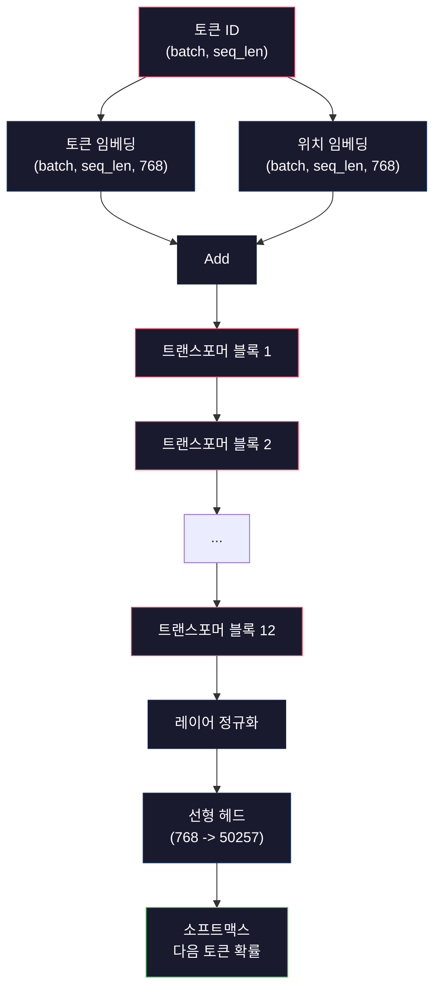
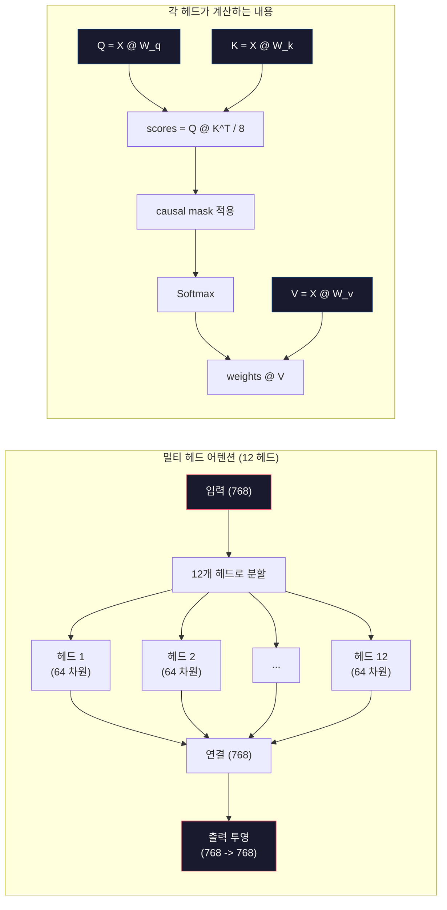
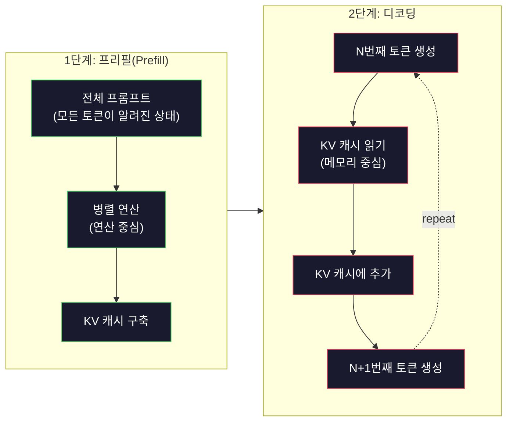

# 미니 GPT 사전 학습 (124M 파라미터)

> GPT-2 Small은 1억 2,400만 개의 파라미터를 가지고 있습니다. 이는 12개의 트랜스포머 레이어, 12개의 어텐션 헤드, 그리고 768차원 임베딩으로 구성됩니다. 단일 GPU에서 몇 시간 만에 처음부터 학습할 수 있습니다. 대부분의 사람들은 이 과정을 거치지 않습니다. 사전 학습된 체크포인트를 사용하죠. 하지만 직접 학습해 보지 않으면, 제품 개발의 기반이 되는 모델 내부에서 실제로 일어나는 일을 이해하지 못합니다.

**유형:** Build
**언어:** Python (numpy 사용)
**선수 요건:** 10단계, 01-03강 (토크나이저, 토크나이저 구축, 데이터 파이프라인)
**시간:** 약 120분

## 학습 목표

- GPT-2 전체 아키텍처(124M 파라미터)를 처음부터 구현해 보세요: 토큰 임베딩, 위치 임베딩, 트랜스포머 블록, 언어 모델 헤드
- 교차 엔트로피 손실(Cross-Entropy Loss)을 사용하여 다음 토큰 예측으로 텍스트 코퍼스에 GPT 모델을 학습해 보세요
- 온도(Temperature) 샘플링과 Top-k/Top-p 필터링을 사용하여 자기회귀(Autoregressive) 텍스트 생성을 구현해 보세요
- 학습 손실 곡선을 모니터링하고 모델이 일관된 언어 패턴을 학습하는지 검증해 보세요

## 문제점

트랜스포머가 무엇인지 알고 있습니다. 다이어그램을 읽어보셨죠. "어텐션이 전부다(attention is all you need)"라고 암기할 수 있고, 화이트보드에 "멀티 헤드 어텐션(Multi-Head Attention)"이라고 라벨을 붙인 상자를 그릴 수 있습니다.

이 모든 것에도 불구하고, 모델이 텍스트를 생성할 때 실제로 일어나는 일을 이해하지는 못합니다.

GPT-2 Small에는 가중치 공유(weight tying)를 포함하여 124,438,272개의 파라미터가 있습니다. 이 모든 파라미터는 학습 루프를 실행하여 설정되었습니다: 순전파, 손실 계산, 역전파, 가중치 업데이트. 12개의 트랜스포머 블록. 블록당 12개의 어텐션 헤드. 768차원 임베딩 공간. 50,257개의 토큰 어휘. 모델이 토큰을 생성할 때마다, 1억 2,400만 개의 파라미터가 모두 토큰 ID 시퀀스를 입력으로 받아 다음 토큰에 대한 확률 분포를 생성하는 단일 행렬 곱 연쇄에 참여합니다.

직접 이 과정을 구축해 보지 않았다면, 당신은 블랙 박스를 다루고 있는 것입니다. API를 사용할 수 있고, 미세 조정(Fine-tuning)을 할 수도 있습니다. 하지만 문제가 생겼을 때 -- 모델이 환각(Hallucination)을 일으키거나, 반복적인 행동을 하거나, 지시문을 따르지 않을 때 -- *왜* 그런 일이 일어나는지 이해할 수 있는 개념적 모델이 없습니다.

이 강의는 GPT-2 Small을 처음부터 구축합니다. PyTorch가 아닌 numpy로 진행합니다. 모든 행렬 곱셈이 명확하게 드러나며, 모든 기울기는 코드로 계산됩니다. 1억 2,400만 개의 숫자가 다음 단어를 예측하기 위해 어떻게 협력하는지 정확히 확인할 수 있습니다.

## 개념

### GPT 아키텍처

GPT는 자기회귀(Autoregressive) 언어 모델입니다. "자기회귀"는 모든 이전 토큰을 조건으로 삼아 한 번에 하나의 토큰을 생성한다는 의미입니다. 아키텍처는 트랜스포머 디코더 블록의 스택으로 구성됩니다.

토큰 ID에서 다음 토큰 확률까지의 전체 계산 그래프는 다음과 같습니다:

1. 토큰 ID가 입력됩니다. 형태: (batch_size, seq_len).
2. 토큰 임베딩 조회. 각 ID는 768차원 벡터로 매핑됩니다. 형태: (batch_size, seq_len, 768).
3. 위치 임베딩 조회. 각 위치(0, 1, 2, ...)는 768차원 벡터로 매핑됩니다. 형태는 동일합니다.
4. 토큰 임베딩과 위치 임베딩을 더합니다.
5. 12개의 트랜스포머 블록을 통과합니다.
6. 최종 레이어 정규화(Normalization)를 수행합니다.
7. 어휘(Vocabulary) 크기로 선형 투영합니다. 형태: (batch_size, seq_len, vocab_size).
8. 소프트맥스(Softmax)를 적용하여 확률을 얻습니다.

이것이 모델의 전부입니다. 컨볼루션도 재귀도 없습니다. 임베딩, 어텐션(Attention), 피드포워드 네트워크, 레이어 정규화를 12번 쌓은 것뿐입니다.



### 트랜스포머 블록

12개 블록 모두 동일한 패턴을 따릅니다. 프리-노름(pre-norm) 아키텍처를 사용하며, GPT-2는 원조 트랜스포머의 포스트-노름(post-norm)이 아닌 프리-노름을 사용합니다:

1. 레이어 정규화
2. 멀티 헤드 셀프 어텐션(Multi-Head Self-Attention)
3. 잔여 연결(입력을 다시 더함)
4. 레이어 정규화
5. 피드포워드 네트워크(MLP)
6. 잔여 연결(입력을 다시 더함)

잔여 연결은 매우 중요합니다. 잔여 연결이 없으면 역전파 시 블록 1에 도달할 때 기울기가 소멸됩니다. 잔여 연결이 있으면 손실로부터 모든 레이어로 "스킵" 경로를 통해 기울기가 직접 흐를 수 있습니다. 이 때문에 12, 32, 심지어 96개의 블록을 쌓을 수 있습니다 (GPT-4는 120개를 사용한다는 소문이 있습니다).

### 어텐션: 핵심 메커니즘

셀프 어텐션(Self-Attention)은 모든 토큰이 이전의 모든 토큰을 살펴보고 각각에 얼마나 주의를 기울일지 결정할 수 있게 합니다. 수식은 다음과 같습니다.

각 토큰 위치에 대해 입력에서 세 개의 벡터를 계산합니다:
- **쿼리(Query, Q)**: "무엇을 찾고 있는가?"
- **키(Key, K)**: "무엇을 포함하고 있는가?"
- **값(Value, V)**: "어떤 정보를 담고 있는가?"

```
Q = input @ W_q    (768 -> 768)
K = input @ W_k    (768 -> 768)
V = input @ W_v    (768 -> 768)

attention_scores = Q @ K^T / sqrt(d_k)
attention_scores = mask(attention_scores)   # causal mask: 미래 위치에 대해 -inf
attention_weights = softmax(attention_scores)
output = attention_weights @ V
```

causal mask는 GPT를 자기회귀(Autoregressive)로 만드는 요소입니다. 위치 5는 위치 0-5를 참조할 수 있지만 6, 7, 8 등은 참조할 수 없습니다. 이는 학습 중 모델이 미래 토큰을 "치팅"하는 것을 방지합니다.

**멀티 헤드 어텐션(Multi-head attention)**은 768차원 공간을 각각 64차원인 12개의 헤드로 분할합니다. 각 헤드는 서로 다른 어텐션 패턴을 학습합니다. 한 헤드는 구문적 관계(주어-동사 일치)를 추적할 수 있습니다. 다른 헤드는 의미적 유사성(동의어)을 추적할 수 있습니다. 또 다른 헤드는 위치적 근접성(가까운 단어)을 추적할 수 있습니다. 모든 12개 헤드의 출력은 연결(concatenate)되어 768차원으로 투영됩니다.



sqrt(d_k)로 나누는 연산 -- sqrt(64) = 8 --은 스케일링입니다. 이 연산이 없으면 고차원 벡터의 내적이 커져서 softmax가 기울기가 거의 0인 영역으로 밀려납니다. 이는 원본 "Attention Is All You Need" 논문에서 나온 핵심 통찰 중 하나였습니다.

### KV 캐시: 추론이 빠른 이유

학습 중에는 전체 시퀀스를 한 번에 처리합니다. 추론 중에는 토큰을 하나씩 생성합니다. 최적화 없이 토큰 N을 생성하려면 이전 N-1개 토큰의 어텐션을 모두 다시 계산해야 합니다. 이는 생성된 토큰당 O(N^2)이며, 길이 N인 시퀀스에 대해 총 O(N^3)입니다.

KV 캐시(KV Cache)가 이를 해결합니다. 각 토큰의 K와 V를 계산한 후 저장하세요. 토큰 N+1을 생성할 때, 새 토큰의 Q만 계산하고 이전 모든 토큰의 캐시된 K와 V를 조회하면 됩니다. 이는 K와 V 계산의 토큰당 비용을 O(N)에서 O(1)로 줄입니다. 어텐션 점수 계산은 여전히 모든 이전 위치를 참조하므로 O(N)이지만, 입력에 대한 중복된 행렬 곱셈을 피할 수 있습니다.

12층과 12헤드를 가진 GPT-2의 경우, KV 캐시(KV Cache)는 토큰당 2 (K + V) x 12층 x 12헤드 x 64차원 = 18,432개의 값을 저장합니다. 1024토큰 시퀀스의 경우 FP32에서 약 75MB입니다. Llama 3 405B의 경우 128층이 있으며, 단일 시퀀스에 대한 KV 캐시(KV Cache)는 10GB를 초과할 수 있습니다. 이것이 긴 컨텍스트 추론이 메모리 바운드(memory-bound)인 이유입니다.

### 프리필(Prefill) vs 디코딩(Decode): 추론의 두 단계

프롬프트를 LLM (대규모 언어 모델)(LLM (Large Language Model))에 보내면 추론이 두 가지 명확한 단계로 진행됩니다.

**프리필(Prefill)**은 전체 프롬프트를 병렬로 처리합니다. 모든 토큰이 알려져 있으므로 모델은 모든 위치의 어텐션(Attention)을 동시에 계산할 수 있습니다. 이 단계는 컴퓨트 바운드(compute-bound)입니다. GPU는 전체 처리량으로 행렬 곱셈을 수행합니다. A100에서 1000토큰 프롬프트의 프리필(Prefill)은 대략 20-50ms가 소요됩니다.

**디코딩(Decode)**은 토큰을 하나씩 생성합니다. 각 새 토큰은 이전 모든 토큰에 의존합니다. 이 단계는 메모리 바운드(memory-bound)입니다. 병목 현상은 GPU 메모리에서 모델 가중치(Weight)와 KV 캐시(KV Cache)를 읽는 것이며, 행렬 연산 자체는 아닙니다. GPU의 연산 코어는 메모리 읽기를 기다리며 대부분 유휴 상태입니다. GPT-2의 경우, 행렬 곱셈이 요구하는 FLOPs의 양에 관계없이 각 디코딩(Decode) 단계는 거의 동일한 시간이 소요됩니다. 메모리 대역폭이 제약 조건이기 때문입니다.

이 구분은 프로덕션 시스템에서 중요합니다. 프리필(Prefill) 처리량은 GPU 연산에 따라 확장됩니다 (더 많은 FLOPS = 더 빠른 프리필(Prefill)). 디코딩(Decode) 처리량은 메모리 대역폭에 따라 확장됩니다 (더 빠른 메모리 = 더 빠른 디코딩(Decode)). NVIDIA의 H100이 A100 대비 메모리 대역폭 개선에 집중했던 이유입니다. 이는 토큰 생성을 직접적으로 가속화합니다.



### 학습 루프

LLM 학습은 다음 토큰 예측입니다. 토큰 [0, 1, 2, ..., N-1]이 주어지면 토큰 [1, 2, 3, ..., N]을 예측합니다. 손실 함수는 모델이 예측한 확률 분포와 실제 다음 토큰 간의 교차 엔트로피(Cross-Entropy)입니다.

한 학습 단계:

1. **순전파**: 배치를 12개 블록 전체를 통해 실행합니다. 각 위치에 대한 로짓(Logits)(소프트맥스 이전 점수)을 얻습니다.
2. **손실 계산**: 로짓과 대상 토큰(입력을 한 위치 이동한 것) 간의 교차 엔트로피(Cross-Entropy)를 계산합니다.
3. **역전파**: 역전파(Backpropagation)를 사용하여 124M 매개변수(Parameter)에 대한 기울기(Gradient)를 계산합니다.
4. **옵티마이저(Optimizer) 단계**: 가중치(Weight)를 업데이트합니다. GPT-2는 학습률(Learning Rate) 워밍업(Warmup)과 코사인 감쇠를 사용하는 Adam 옵티마이저(Adam (Optimizer))를 사용합니다.

학습률 스케줄(Learning Rate Schedule)은 예상보다 중요합니다. GPT-2는 첫 2,000단계 동안 0에서 피크 학습률까지 워밍업(Warmup)한 후 코사인 곡선을 따라 감쇠합니다. 높은 학습률로 시작하면 모델이 발산합니다. 높은 학습률을 일정하게 유지하면 후반 학습에서 진동(Oscillation)이 발생합니다. 워밍업 후 감쇠 패턴은 모든 주요 LLM (대규모 언어 모델)(LLM (Large Language Model))에서 사용됩니다.

### GPT-2 Small: 수치

| 구성 요소 | 형태 | 매개변수 |
|-----------|-------|------------|
| 토큰 임베딩(Embedding) | (50257, 768) | 38,597,376 |
| 위치 임베딩(Embedding) | (1024, 768) | 786,432 |
| 블록별 어텐션(Attention) (W_q, W_k, W_v, W_out) | 4 x (768, 768) | 2,359,296 |
| 블록별 FFN (up + down) | (768, 3072) + (3072, 768) | 4,718,592 |
| 블록별 LayerNorm (2x) | 2 x 768 x 2 | 3,072 |
| 최종 LayerNorm | 768 x 2 | 1,536 |
| **블록별 총합** | | **7,080,960** |
| **총합 (12개 블록)** | | **85,054,464 + 39,383,808 = 124,438,272** |

출력 투사(logits head)는 토큰 임베딩 행렬과 가중치를 공유합니다. 이를 가중치 결합(weight tying)이라고 하며, 매개변수 수를 38M 줄이고 성능을 향상시킵니다. 입력과 출력에 동일한 표현 공간을 사용하도록 강제하기 때문입니다.

## 구현하기

### 1단계: 임베딩 레이어

토큰 임베딩은 가능한 50,257개의 토큰 각각을 768차원 벡터로 매핑합니다. 위치 임베딩은 시퀀스에서 각 토큰이 어디에 위치하는지에 대한 정보를 추가합니다. 두 임베딩은 합산됩니다.

```python
import numpy as np

class Embedding:
    def __init__(self, vocab_size, embed_dim, max_seq_len):
        self.token_embed = np.random.randn(vocab_size, embed_dim) * 0.02
        self.pos_embed = np.random.randn(max_seq_len, embed_dim) * 0.02

    def forward(self, token_ids):
        seq_len = token_ids.shape[-1]
        tok_emb = self.token_embed[token_ids]
        pos_emb = self.pos_embed[:seq_len]
        return tok_emb + pos_emb
```

초기화를 위한 0.02의 표준 편차는 GPT-2 논문에서 유래했습니다. 너무 크면 초기 순방향 전달이 극단적인 값을 생성하여 학습을 불안정하게 만듭니다. 너무 작으면 초기 출력은 모든 입력에 대해 거의 동일해져 초기 기울기 신호가 무용지물이 됩니다.

### 2단계: 인과 마스크를 적용한 셀프 어텐션

먼저 단일 헤드 어텐션을 구현합니다. 인과 마스크는 소프트맥스 전에 미래 위치를 음의 무한대로 설정하여, 각 위치가 자기 자신과 이전 위치에만 어텐션할 수 있도록 보장합니다.

```python
def attention(Q, K, V, mask=None):
    d_k = Q.shape[-1]
    scores = Q @ K.transpose(0, -1, -2 if Q.ndim == 4 else 1) / np.sqrt(d_k)
    if mask is not None:
        scores = scores + mask
    weights = np.exp(scores - scores.max(axis=-1, keepdims=True))
    weights = weights / weights.sum(axis=-1, keepdims=True)
    return weights @ V
```

소프트맥스 구현은 지수화하기 전에 최대값을 뺍니다. 이 과정을 거치지 않으면 exp(large_number)가 무한대로 오버플로됩니다. 이는 수치적 안정성을 위한 트릭으로, 임의의 상수 c에 대해 softmax(x - c) = softmax(x)이므로 출력은 변하지 않습니다.

### 3단계: 멀티 헤드 어텐션

768차원 입력을 각각 64차원인 12개의 헤드로 분할합니다. 각 헤드는 독립적으로 어텐션을 계산합니다. 결과를 연결(concatenate)하고 768차원으로 투사합니다.

```python
class MultiHeadAttention:
    def __init__(self, embed_dim, num_heads):
        self.num_heads = num_heads
        self.head_dim = embed_dim // num_heads
        self.W_q = np.random.randn(embed_dim, embed_dim) * 0.02
        self.W_k = np.random.randn(embed_dim, embed_dim) * 0.02
        self.W_v = np.random.randn(embed_dim, embed_dim) * 0.02
        self.W_out = np.random.randn(embed_dim, embed_dim) * 0.02

    def forward(self, x, mask=None):
        batch, seq_len, d = x.shape
        Q = (x @ self.W_q).reshape(batch, seq_len, self.num_heads, self.head_dim).transpose(0, 2, 1, 3)
        K = (x @ self.W_k).reshape(batch, seq_len, self.num_heads, self.head_dim).transpose(0, 2, 1, 3)
        V = (x @ self.W_v).reshape(batch, seq_len, self.num_heads, self.head_dim).transpose(0, 2, 1, 3)

        scores = Q @ K.transpose(0, 1, 3, 2) / np.sqrt(self.head_dim)
        if mask is not None:
            scores = scores + mask
        weights = np.exp(scores - scores.max(axis=-1, keepdims=True))
        weights = weights / weights.sum(axis=-1, keepdims=True)
        attn_out = weights @ V

        attn_out = attn_out.transpose(0, 2, 1, 3).reshape(batch, seq_len, d)
        return attn_out @ self.W_out
```

리셰이프-트랜스포즈-리셰이프 과정은 멀티 헤드 어텐션에서 가장 혼란스러운 부분입니다. 일어나는 일은 다음과 같습니다: (batch, seq_len, 768) 텐서가 (batch, seq_len, 12, 64)가 되고, 그 다음 (batch, 12, seq_len, 64)이 됩니다. 이제 12개의 헤드 각각은 어텐션을 실행하기 위한 자체 (seq_len, 64) 행렬을 갖게 됩니다. 어텐션 후에는 과정을 역순으로 진행합니다: (batch, 12, seq_len, 64)가 (batch, seq_len, 12, 64)가 되고, 그 다음 (batch, seq_len, 768)이 됩니다.

### 4단계: 트랜스포머 블록

완전한 트랜스포머 블록 하나: 레이어 정규화(LayerNorm), 잔여 연결(residual)이 포함된 멀티 헤드 어텐션, 레이어 정규화, 잔여 연결이 포함된 피드포워드(feedforward).

```python
class LayerNorm:
    def __init__(self, dim, eps=1e-5):
        self.gamma = np.ones(dim)
        self.beta = np.zeros(dim)
        self.eps = eps

    def forward(self, x):
        mean = x.mean(axis=-1, keepdims=True)
        var = x.var(axis=-1, keepdims=True)
        return self.gamma * (x - mean) / np.sqrt(var + self.eps) + self.beta


class FeedForward:
    def __init__(self, embed_dim, ff_dim):
        self.W1 = np.random.randn(embed_dim, ff_dim) * 0.02
        self.b1 = np.zeros(ff_dim)
        self.W2 = np.random.randn(ff_dim, embed_dim) * 0.02
        self.b2 = np.zeros(embed_dim)

    def forward(self, x):
        h = x @ self.W1 + self.b1
        h = np.maximum(0, h)  # GELU 근사화: 단순화를 위해 ReLU 사용
        return h @ self.W2 + self.b2


class TransformerBlock:
    def __init__(self, embed_dim, num_heads, ff_dim):
        self.ln1 = LayerNorm(embed_dim)
        self.attn = MultiHeadAttention(embed_dim, num_heads)
        self.ln2 = LayerNorm(embed_dim)
        self.ffn = FeedForward(embed_dim, ff_dim)

    def forward(self, x, mask=None):
        x = x + self.attn.forward(self.ln1.forward(x), mask)
        x = x + self.ffn.forward(self.ln2.forward(x))
        return x
```

피드포워드 네트워크는 768차원 입력을 3,072차원(4배)으로 확장하고, 비선형성을 적용한 후 다시 768차원으로 투영합니다. 이 확장-축소 패턴은 각 위치에서 모델이 더 "넓은" 내부 표현을 사용할 수 있게 해줍니다. GPT-2는 GELU 활성화 함수를 사용하지만, 여기서는 단순함을 위해 ReLU를 사용합니다. 아키텍처를 이해하는 데 있어 차이점은 미미합니다.

### 5단계: 전체 GPT 모델

12개의 트랜스포머 블록을 쌓습니다. 앞쪽에 임베딩 레이어를 추가하고, 뒤쪽에 출력 투영을 추가합니다.

```python
class MiniGPT:
    def __init__(self, vocab_size=50257, embed_dim=768, num_heads=12,
                 num_layers=12, max_seq_len=1024, ff_dim=3072):
        self.embedding = Embedding(vocab_size, embed_dim, max_seq_len)
        self.blocks = [
            TransformerBlock(embed_dim, num_heads, ff_dim)
            for _ in range(num_layers)
        ]
        self.ln_f = LayerNorm(embed_dim)
        self.vocab_size = vocab_size
        self.embed_dim = embed_dim

    def forward(self, token_ids):
        seq_len = token_ids.shape[-1]
        mask = np.triu(np.full((seq_len, seq_len), -1e9), k=1)

        x = self.embedding.forward(token_ids)
        for block in self.blocks:
            x = block.forward(x, mask)
        x = self.ln_f.forward(x)

        logits = x @ self.embedding.token_embed.T
        return logits

    def count_parameters(self):
        total = 0
        total += self.embedding.token_embed.size
        total += self.embedding.pos_embed.size
        for block in self.blocks:
            total += block.attn.W_q.size + block.attn.W_k.size
            total += block.attn.W_v.size + block.attn.W_out.size
            total += block.ffn.W1.size + block.ffn.b1.size
            total += block.ffn.W2.size + block.ffn.b2.size
            total += block.ln1.gamma.size + block.ln1.beta.size
            total += block.ln2.gamma.size + block.ln2.beta.size
        total += self.ln_f.gamma.size + self.ln_f.beta.size
        return total
```

가중치 공유(weight tying)를 주목하세요: `logits = x @ self.embedding.token_embed.T`. 출력 투영은 토큰 임베딩 행렬(전치된 상태)을 재사용합니다. 이는 단순한 파라미터 절약 트릭이 아닙니다. 모델이 토큰을 이해하는 데(임베딩) 사용하는 것과 토큰을 예측하는 데(출력) 사용하는 동일한 벡터 공간을 사용한다는 의미입니다.

### 6단계: 학습 루프

1억 2,400만 파라미터를 가진 실제 학습을 수행하려면 GPU와 PyTorch가 필요합니다. 이 학습 루프는 순수 numpy로 실행되는 작은 모델의 메커니즘을 시연합니다. 계산이 가능하도록 매우 작은 모델(4층, 4헤드, 128차원)을 사용합니다.

```python
def cross_entropy_loss(logits, targets):
    batch, seq_len, vocab_size = logits.shape
    logits_flat = logits.reshape(-1, vocab_size)
    targets_flat = targets.reshape(-1)

    max_logits = logits_flat.max(axis=-1, keepdims=True)
    log_softmax = logits_flat - max_logits - np.log(
        np.exp(logits_flat - max_logits).sum(axis=-1, keepdims=True)
    )

    loss = -log_softmax[np.arange(len(targets_flat)), targets_flat].mean()
    return loss


def train_mini_gpt(text, vocab_size=256, embed_dim=128, num_heads=4,
                   num_layers=4, seq_len=64, num_steps=200, lr=3e-4):
    tokens = np.array(list(text.encode("utf-8")[:2048]))
    model = MiniGPT(
        vocab_size=vocab_size, embed_dim=embed_dim, num_heads=num_heads,
        num_layers=num_layers, max_seq_len=seq_len, ff_dim=embed_dim * 4
    )

    print(f"Model parameters: {model.count_parameters():,}")
    print(f"Training tokens: {len(tokens):,}")
    print(f"Config: {num_layers} layers, {num_heads} heads, {embed_dim} dims")
    print()

    for step in range(num_steps):
        start_idx = np.random.randint(0, max(1, len(tokens) - seq_len - 1))
        batch_tokens = tokens[start_idx:start_idx + seq_len + 1]

        input_ids = batch_tokens[:-1].reshape(1, -1)
        target_ids = batch_tokens[1:].reshape(1, -1)

        logits = model.forward(input_ids)
        loss = cross_entropy_loss(logits, target_ids)

        if step % 20 == 0:
            print(f"Step {step:4d} | Loss: {loss:.4f}")

    return model
```

손실은 ln(vocab_size) 근처에서 시작합니다. 256개 토큰의 바이트 수준 어휘의 경우, ln(256) = 5.55입니다. 랜덤 모델은 모든 토큰에 동일한 확률을 할당합니다. 학습이 진행됨에 따라 손실이 감소합니다. 모델이 "t" 뒤에 "th", 마침표 뒤에 공백 등 일반적인 패턴을 예측하는 법을 학습하기 때문입니다.

프로덕션 환경에서는 기울기 누적, 학습률 워밍업, 기울기 클리핑을 사용하는 Adam 옵티마이저를 사용합니다. 순전파-손실-역전파-업데이트 루프는 동일합니다. 옵티마이저가 더 정교할 뿐입니다.

### 7단계: 텍스트 생성

생성은 학습된 모델을 사용하여 한 번에 하나의 토큰을 예측합니다. 각 예측은 출력 분포에서 샘플링되거나(또는 argmax로贪婪적으로 선택됩니다).

```python
def generate(model, prompt_tokens, max_new_tokens=100, temperature=0.8):
    tokens = list(prompt_tokens)
    seq_len = model.embedding.pos_embed.shape[0]

    for _ in range(max_new_tokens):
        context = np.array(tokens[-seq_len:]).reshape(1, -1)
        logits = model.forward(context)
        next_logits = logits[0, -1, :]

        next_logits = next_logits / temperature
        probs = np.exp(next_logits - next_logits.max())
        probs = probs / probs.sum()

        next_token = np.random.choice(len(probs), p=probs)
        tokens.append(next_token)

    return tokens
```

온도는 랜덤성을 제어합니다. 온도 1.0은 원시 분포를 사용합니다. 온도 0.5는 분포를 날카롭게 만듭니다(더 결정론적 -- 모델이 상위 선택지를 더 자주 선택합니다). 온도 1.5는 분포를 평평하게 만듭니다(더 랜덤 -- 낮은 확률의 토큰이 더 큰 기회를 얻습니다). 온도 0.0은贪婪 디코딩입니다(항상 가장 높은 확률의 토큰을 선택합니다).

`tokens[-seq_len:]` 윈도우는 모델이 최대 컨텍스트 길이(GPT-2의 경우 1024)를 가지고 있기 때문에 필요합니다. 이를 초과하면 가장 오래된 토큰을 제거해야 합니다. 이것이 모두가 이야기하는 "컨텍스트 윈도우"입니다.

```figure
sampling-decoder
```

## 사용하기

### 전체 학습 및 생성 데모

```python
corpus = """The transformer architecture has revolutionized natural language processing.
Attention mechanisms allow the model to focus on relevant parts of the input.
Self-attention computes relationships between all pairs of positions in a sequence.
Multi-head attention splits the representation into multiple subspaces.
Each attention head can learn different types of relationships.
The feedforward network provides nonlinear transformations at each position.
Residual connections enable gradient flow through deep networks.
Layer normalization stabilizes training by normalizing activations.
Position embeddings give the model information about token ordering.
The causal mask ensures autoregressive generation during training.
Pre-training on large text corpora teaches the model general language understanding.
Fine-tuning adapts the pre-trained model to specific downstream tasks."""

model = train_mini_gpt(corpus, num_steps=200)

prompt = list("The transformer".encode("utf-8"))
output_tokens = generate(model, prompt, max_new_tokens=100, temperature=0.8)
generated_text = bytes(output_tokens).decode("utf-8", errors="replace")
print(f"\nGenerated: {generated_text}")
```

작은 코퍼스와 작은 모델을 사용하면 생성된 텍스트는 최악의 경우 반쯤 일관된 수준일 것입니다. 학습 텍스트에서 바이트 단위 패턴을 몇 가지 학습할 수 있지만, 40GB의 학습 데이터와 전체 124M 매개변수 아키텍처를 사용하는 GPT-2처럼 일반화할 수는 없습니다. 요점은 출력의 품질이 아닙니다. 요점은 모든 단계를 추적할 수 있다는 점입니다: 임베딩 조회, 어텐션 계산, 피드포워드 변환, 로짓 투영, 소프트맥스, 샘플링. 모든 연산이 가시적입니다.

## 출시하기

이 강의는 `outputs/prompt-gpt-architecture-analyzer.md`를 생성합니다 -- 임의의 GPT 스타일 모델의 아키텍처 선택을 분석하는 프롬프트입니다. 모델 카드나 기술 보고서를 입력하면 매개변수 할당, 어텐션 설계, 스케일링 결정을 분해합니다.

## 연습 문제

1. 모델을 수정하여 12/12 대신 24층과 16헤드를 사용하세요. 매개변수를 세어 보세요. 깊이를 두 배로 늘리는 것과 너비(임베딩 차원)를 두 배로 늘리는 것은 어떻게 비교됩니까?

2. GELU 활성화 함수(GELU(x) = x * 0.5 * (1 + erf(x / sqrt(2))))를 구현하고 피드포워드 네트워크의 ReLU를 대체하세요. 각 활성화 함수로 500 스텝 동안 학습을 실행하고 최종 손실을 비교하세요.

3. 생성 함수에 KV 캐시를 추가하세요. 첫 번째 순방향 패스 이후 각 층의 K 및 V 텐서를 저장하고, 이후 토큰에 대해 재사용하세요. 속도 향상을 측정하세요: 캐시 유무에 따라 200 토큰을 생성하고 벽시계 시간을 비교하세요.

4. Top-k 샘플링(확률이 가장 높은 k개 토큰만 고려)과 Top-p 샘플링(핵 샘플링: 누적 확률이 p를 초과하는 가장 작은 토큰 집합을 고려)을 구현하세요. 온도 0.8에서 Top-k=50강 Top-p=0.95의 출력 품질을 비교하세요.

5. 학습 손실 곡선 플로터를 구축하세요. 모델을 1000 스텝 동안 학습하고 스텝 대비 손실을 플롯하세요. 세 가지 단계를 식별하세요: 빠른 초기 하강(공통 바이트 학습), 느린 중간 단계(바이트 패턴 학습), 평탄화(작은 코퍼스에 대한 과적합). 이 곡선의 모양은 128차원 모델을 학습하든 GPT-4를 학습하든 동일합니다.

## 핵심 용어

| 용어 | 사람들이 말하는 것 | 실제 의미 |
|------|----------------|----------------------|
| 자기회귀(Autoregressive) | "한 단어씩 생성합니다" | 각 출력 토큰은 모든 이전 토큰에 조건을 두며 -- 모델은 P(token_n \| token_0, ..., token_{n-1})를 예측합니다 |
| 인과적 마스크(Causal mask) | "미래를 볼 수 없습니다" | 학습 중 미래 위치에 대한 어텐션을 방지하는 -무한대 값의 상삼각 행렬 |
| 멀티헤드 어텐션(Multi-head attention) | "다양한 어텐션 패턴" | Q, K, V를 병렬 헤드(예: GPT-2의 경우 각각 64차원인 12개 헤드)로 분할하여 각 헤드가 서로 다른 관계 유형을 학습할 수 있도록 합니다 |
| KV 캐시(KV Cache) | "속도를 위한 캐싱" | 자기회귀 생성 중 중복 계산을 피하기 위해 이전 토큰에서 계산된 Key 및 Value 텐서를 저장합니다 |
| 프리필(Prefill) | "프롬프트 처리" | 모든 프롬프트 토큰이 병렬로 처리되는 첫 번째 추론 단계 -- GPU FLOPS에 계산 바운드(compute-bound) |
| 디코딩(Decode) | "토큰 생성" | 토큰을 하나씩 생성하는 두 번째 추론 단계 -- GPU 대역폭에 메모리 바운드(memory-bound) |
| 가중치 공유(Weight tying) | "임베딩 공유" | 입력 토큰 임베딩과 출력 투사 헤드에 동일한 행렬을 사용 -- GPT-2에서 38M 매개변수를 절약합니다 |
| 잔여 연결(Residual connection) | "스킵 연결" | 서브레이어의 출력에 입력을 직접 더함(x + sublayer(x)) -- 깊은 네트워크에서 기울기 흐름을 가능하게 합니다 |
| 레이어 정규화(Layer normalization) | "활성화 정규화" | 특징 차원 전체에 대해 평균 0, 분산 1로 정규화하며, 학습 가능한 스케일 및 편향 매개변수를 사용합니다 |
| 교차 엔트로피 손실(Cross-entropy loss) | "예측이 얼마나 틀렸는지" | 올바른 다음 토큰에 할당된 확률의 -log를 모든 위치에 대해 평균낸 값 -- 표준 LLM 학습 목표 |

## 추가 읽기

- [Radford et al., 2019 -- "Language Models are Unsupervised Multitask Learners" (GPT-2)](https://cdn.openai.com/better-language-models/language_models_are_unsupervised_multitask_learners.pdf) -- 124M에서 1.5B 매개변수 계열을 도입한 GPT-2 논문
- [Vaswani et al., 2017 -- "Attention Is All You Need"](https://arxiv.org/abs/1706.03762) -- 스케일된 점곱 어텐션과 멀티헤드 어텐션을 담은 원조 트랜스포머 논문
- [Llama 3 Technical Report](https://arxiv.org/abs/2407.21783) -- Meta가 GPT 아키텍처를 16K GPU로 405B 매개변수까지 확장한 방법
- [Pope et al., 2022 -- "Efficiently Scaling Transformer Inference"](https://arxiv.org/abs/2211.05102) -- 프리필 vs 디코딩 및 KV 캐시 분석을 공식화한 논문
