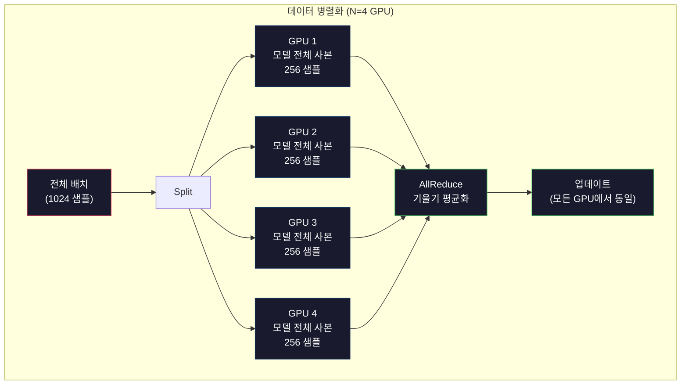
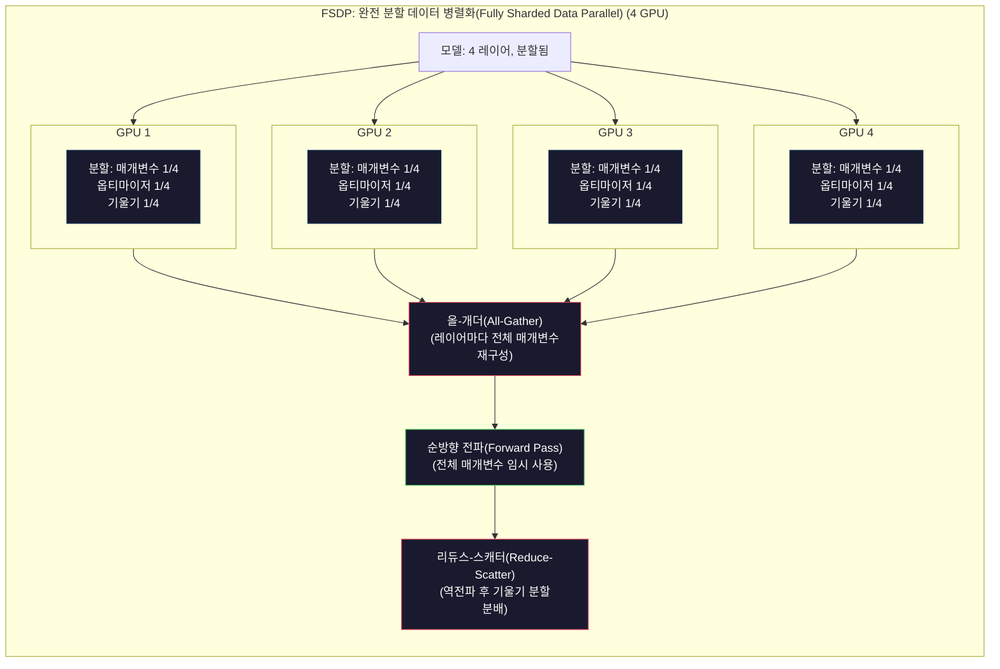
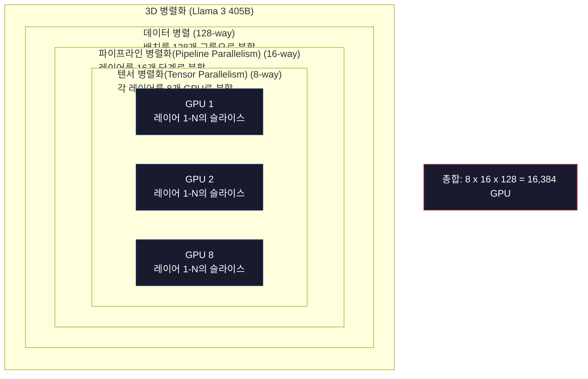

# 확장성: 분산 학습, FSDP, DeepSpeed

> 124M 모델은 단일 GPU에서 학습했습니다. 이제 70억 파라미터에 도전해 보세요. 모델이 메모리에 맞지 않습니다. 단일 머신에서는 데이터 처리에 몇 주가 걸립니다. 대규모 환경에서는 분산 학습이 선택 사항이 아닙니다. 유일한 진행 경로입니다.

**유형:** Build
**언어:** Python
**선수 요건:** 10단계, 04강 (미니 GPT 사전 학습)
**시간:** 약 120분

## 학습 목표

- 세 가지 병렬화 유형(데이터, 텐서, 파이프라인)을 설명하고, 모델 및 클러스터 크기에 따라 각각이 언제 필요한지 설명하세요
- PyTorch DDP를 사용하여 여러 GPU 간에 기울기 동기화를 수행하는 데이터 병렬 학습을 구현하세요
- 주어진 모델 크기(가중치 + 옵티마이저 상태 + 기울기 + 활성화)에 대한 메모리 예산을 계산하여 최소 하드웨어를 결정하세요
- FSDP 또는 DeepSpeed ZeRO 단계를 설정하여 모델 상태를 GPU에 분할(shard)하고 단일 GPU 메모리를 초과하는 모델을 수용하세요

## 문제점

FP16의 7B 파라미터 모델은 가중치에만 14GB가 필요합니다. Adam 옵티마이저는 모든 파라미터의 두 가지 추가 사본(1차 및 2차 모멘트 추정치)을 저장합니다. 이는 추가로 28GB입니다. 역전파过程中的 기울기가 14GB를 더 추가합니다. 활성화가 저장되기 전에도 56GB가 사용되고 있습니다.

NVIDIA A100은 80GB의 메모리를 가지고 있습니다.

80GB 중 56GB가 소비되었습니다. 활성화에 남는 공간은 24GB입니다. 활성화는 순방향 전파 중 계산된 중간 값으로, 역전파를 위해 유지해야 합니다. 2048 토큰 시퀀스와 4096 차원 모델의 경우, 단일 레이어의 활성화는 약 64MB를 사용합니다. 32 레이어가 있으므로 샘플당 2GB가 필요합니다. 배치 크기 8은 16GB가 필요합니다. 사용 가능한 공간은 24GB입니다. 배치 크기 12는 폭발합니다.

이제 70B 파라미터에 도전해 보세요. 가중치만: FP16에서 140GB. 단일 GPU에 맞지 않습니다. 가중치를 보관하기 위해 최소 2개의 A100(2 x 80GB = 160GB)이 필요합니다. 옵티마이저 상태와 기울기를 추가하면 훨씬 더 많은 공간이 필요합니다. 최소 3개 이상의 GPU가 필요하며, 분할(sharding) 전략에 따라 현실적으로 8-16개가 필요합니다.

Llama 3 405B는 16,384개의 NVIDIA H100 GPU로 학습되었습니다. 아키텍처(Mixture of Experts는 토큰마다 파라미터의 일부만 활성화됨)와 학습 효율성을 고려하여 약 $100 million in compute. DeepSeek V3 trained a comparable model for roughly $560만 달러의 비용이 들었습니다.

이 강의에서는 대규모 학습을 가능하게 하는 네 가지 전략인 데이터 병렬화, 텐서 병렬화, 파이프라인 병렬화, 완전 분할 데이터 병렬화를 다룹니다. 분산 학습 프레임워크를 다루기 전에 순수 Python으로 각 전략을 시뮬레이션하여 메커니즘을 이해해 보세요.

## 개념

### 분산이 필요한 이유

실제 모델에 대한 메모리 계산입니다. 모든 숫자는 추정치가 아닌 계산된 값입니다.

| 모델 | 파라미터 | 가중치 (FP16) | Adam 상태 | 기울기 (FP16) | 합계 (활성화 제외) |
|-------|--------|----------------|-------------|------------------|----------------------|
| GPT-2 Small | 124M | 248 MB | 992 MB | 248 MB | 1.5 GB |
| Llama 3 8B | 8B | 16 GB | 64 GB | 16 GB | 96 GB |
| Llama 3 70B | 70B | 140 GB | 560 GB | 140 GB | 840 GB |
| Llama 3 405B | 405B | 810 GB | 3,240 GB | 810 GB | 4,860 GB |

"Adam 상태" 열이 결정적입니다. Adam은 모든 파라미터에 대해 FP32로 이동 평균(m)과 이동 분산(v)을 저장합니다. 70B 모델의 경우, 70B x 4 bytes x 2 = 560GB입니다. 옵티마이저만으로도 A100 GPU 7개가 필요합니다.

단일 H100은 80GB를 가지고 있습니다. Llama 3 405B는 가중치, 옵티마이저, 기울기를 저장하기 위해 최소 61개의 H100이 필요합니다. 활성화를 포함하면 이 숫자는 더 커집니다. Meta가 16,384개의 GPU를 사용한 것은 원해서가 아니라, 그렇게 해야 했기 때문입니다.

### 데이터 병렬화

가장 단순한 분산 전략입니다. 전체 모델을 N개의 GPU에 복사합니다. 각 학습 배치를 N개의 균등한 부분으로 분할합니다. 각 GPU는 데이터의 조각에 대해 순전파와 역전파를 수행합니다. 역전파 후, 모든 GPU의 기울기를 평균냅니다. 모든 GPU는 평균화된 기울기로 가중치 사본을 업데이트하여 모든 사본을 동기화합니다.

**장점:** 선형 처리량 확장. N개의 GPU는 단계마다 N배 더 많은 데이터를 처리합니다. 통신은 기울기 평균으로 제한되며, 이는 연산과 겹칠 수 있습니다.

**단점:** 모든 GPU가 모델, 옵티마이저 상태, 기울기의 완전한 사본을 보유합니다. 70B 모델의 경우 각 GPU는 840GB가 필요합니다. 데이터 병렬화는 GPU별 메모리를 줄이지 못합니다. 오직 학습 시간만 단축합니다.

**수식:** 유효 배치 크기 = per_gpu_batch_size x N. N=64 GPU이고 GPU별 배치가 16인 경우, 유효 배치는 1,024입니다. Llama 3는 단계당 1,600만 토큰의 유효 배치 크기를 사용했습니다.



### 텐서 병렬화(Tensor Parallelism)

개별 레이어를 GPU 간에 분할합니다. 단일 행렬 곱셈은 GPU 간에 나누어지며, 각 GPU는 결과의 일부만 계산합니다.

피드포워드 레이어의 (8192, 8192) 크기의 가중치 행렬을 고려해 보세요. 4-way 텐서 병렬화(Tensor Parallelism)를 사용하면 각 GPU는 (8192, 2048) 조각을 보유합니다. 각 GPU는 입력을 자신의 조각과 곱하여 부분 결과를 생성합니다. 부분 결과는 all-reduce 또는 all-gather를 통해 결합되어 전체 출력을 생성합니다.

**장점:** 모델 가중치에 대한 GPU별 메모리를 줄입니다. 70B 모델을 8 GPU로 분할하면 각 GPU는 약 8.75B 파라미터에 해당하는 가중치를 보유합니다.

**단점:** 모든 레이어 이후에 빠른 GPU 간 통신이 필요합니다. 각 행렬 곱셈(matmul) 이후의 all-reduce는 지연을 추가합니다. 이는 같은 노드 내 GPU 간 NVLink (900 GB/s) 환경에서는 잘 작동하지만, InfiniBand (400 Gb/s, 약 50 GB/s)로 연결된 노드 간에는 잘 작동하지 않습니다. 텐서 병렬화(Tensor Parallelism)는 거의 항상 단일 노드 내(8 GPU)로 제한됩니다.

**실제 사용 사례:** Megatron-LM이 텐서 병렬화(Tensor Parallelism)를 개척했습니다. Llama 3 405B는 각 노드 내에서 8-way 텐서 병렬화(Tensor Parallelism)를 사용합니다.

### 파이프라인 병렬화(Pipeline Parallelism)

모델을 레이어별로 분할합니다. GPU 1은 레이어 1-8을 실행합니다. GPU 2는 레이어 9-16을 실행합니다. GPU 3은 레이어 17-24를 실행합니다. GPU 4는 레이어 25-32를 실행합니다. 데이터는 파이프라인을 통해 흐릅니다: GPU 1이 자신의 레이어를 계산하고 활성화 값을 GPU 2로 전송하면, GPU 2는 자신의 레이어를 계산하고 GPU 3으로 전송하며, 이 과정이 계속됩니다.

**장점:** GPU 간 통신이 최소화됩니다. 레이어 경계에서의 활성화 값만 전송하며, 이는 기울기나 가중치에 비해 크기가 작습니다. 대역폭 요구 사항이 낮으므로 노드 간에도 작동합니다.

**단점:** 파이프라인 버블이 발생합니다. GPU 4가 마이크로 배치 1의 순전파를 계산할 때, GPU 1, 2, 3은 유휴 상태입니다(이미 자신의 부분을 전달 완료했기 때문입니다). 역전파 중에는 패턴이 역전됩니다. 단순한 파이프라인 처리 방식에서는 N개의 파이프라인 단계에 대해 GPU 활용률이 1/N에 불과합니다.

**GPipe와 PipeDream**은 배치를 마이크로 배치로 분할하여 버블 문제를 해결합니다. GPU 1은 마이크로 배치 1의 전달을 완료하자마자 마이크로 배치 2를 시작합니다. 이는 파이프라인 단계 간 연산을 겹치게 합니다. M개의 마이크로 배치와 N개의 단계를 사용하면 버블 비율이 (N-1)/M로 감소합니다. N=4단계에 M=16개의 마이크로 배치를 사용하면 버블은 3/16 = 18.75%의 유휴 시간입니다.

### FSDP: 완전 분할 데이터 병렬(Fully Sharded Data Parallel)

FSDP는 데이터 병렬화의 확장성과 분할(sharding)의 메모리 효율성을 결합합니다. 각 GPU가 모델의 전체 사본을 보유하는 대신, 각 GPU는 매개변수, 기울기, 옵티마이저 상태의 1/N만 보유합니다.

레이어의 순전파 전에 FSDP는 **all-gather**를 실행하여 모든 GPU의 전체 매개변수를 각 GPU의 메모리로 수집합니다. 순전파 후, 각 GPU는 비국소(non-local) 매개변수를 폐기합니다. 역전파 중에는 기울기 계산을 위해 매개변수를 재구성하기 위해 all-gather가 다시 실행됩니다. 역전파 후, **reduce-scatter**가 기울기 분할을 배포하여 각 GPU는 기울기의 1/N만 저장합니다.

**8개 GPU에서 70B 모델에 대한 계산:**

| 구성 요소 | FSDP 없이 | FSDP 사용 시 |
|-----------|-------------|-----------|
| 가중치 (FP16) | GPU당 140 GB | GPU당 17.5 GB |
| Adam 상태 (FP32) | GPU당 560 GB | GPU당 70 GB |
| 기울기 (FP16) | GPU당 140 GB | GPU당 17.5 GB |
| **합계** | **GPU당 840 GB** | **GPU당 105 GB** |

FSDP가 없으면 단일 80GB GPU에 70B 모델을 수용할 수 없습니다. 8개 GPU에서 FSDP를 사용하면 각 GPU가 105GB를 사용합니다. 이는 여전히 수용되지 않습니다. GPU당 80GB 미만으로 줄이려면 최소 16개 GPU가 필요하거나, FSDP를 활성화 체크포인팅(Activation Checkpointing)과 결합해야 합니다(역전파 중 활성화 값을 저장하는 대신 재계산합니다).

레이어마다 올-개더(all-gather)가 수행되므로 통신 비용은 바닐라 데이터 병렬화보다 높습니다. 하지만 메모리 절감 덕분에 이전에는 불가능했던 학습 실행이 가능해집니다.



### DeepSpeed ZeRO

DeepSpeed의 ZeRO (Zero Redundancy Optimizer)는 개념적으로 FSDP와 동일하지만 Microsoft가 독립적으로 개발했습니다. 세 단계로 정의되며, 각 단계가 더 aggressively 분할합니다:

| 단계 | 분할 대상 | 메모리 절감 | 통신 |
|-------|--------|---------------|---------------|
| ZeRO-1 | 옵티마이저 상태만 | 약 4배 감소 | 데이터 병렬화와 동일 |
| ZeRO-2 | + 기울기 | 약 8배 감소 | 약간 더 많음 |
| ZeRO-3 | + 매개변수 | 약 N배 감소 (N GPU) | 레이어마다 올-개더 |

ZeRO-3는 FSDP와 동등합니다. 명칭만 다르고 메커니즘은 동일합니다. PyTorch는 DeepSpeed가 개념을 입증한 후 FSDP를 네이티브 구현으로 추가했습니다.

DeepSpeed는 ZeRO-Offload (옵티마이저 상태를 CPU RAM으로 오프로드, 더 저렴하고 용량이 큼)와 ZeRO-Infinity (NVMe SSD로 오프로드)도 도입했습니다. 이들은 연산 속도를 메모리 용량과 교환합니다 -- 오프로드된 연산은 느리지만 GPU 메모리를 확보합니다.

### 혼합 정밀도 학습(Mixed Precision Training)

현대적 학습은 여러 부동소수점 형식을 동시에 사용합니다:

- **순방향 전파**: FP16 또는 BF16 (16비트). FP32의 절반 메모리. 텐서 코어에서 행렬 곱이 2배 빠름.
- **마스터 가중치**: FP32 (32비트). 가중치 업데이트 중 수치적 정밀도를 위해 옵티마이저가 유지합니다.
- **손실 스케일링**: 역전파 전에 손실에 큰 상수를 곱하여 FP16 기울기가 0으로 언더플로우되는 것을 방지합니다. 옵티마이저 스텝 전에 같은 상수로 나누어 주세요.

BF16 (Brain Float 16)은 FP32와 동일한 지수 범위(8비트 지수)를 가지지만, 정밀도는 낮습니다(7비트 가수 vs FP32의 23비트). BF16은 동일한 범위의 값을 표현할 수 있어 손실 스케일링이 거의 필요하지 않습니다. FP16은 5비트 지수와 10비트 가수를 가지며 -- 세밀한 값은 잘 표현할 수 있지만, 극단적인 크기에서는 오버플로우/언더플로우가 발생합니다.

Google의 TPU는 BF16을 네이티브로 사용합니다. NVIDIA의 A100강 H100은 FP16강 BF16을 모두 지원합니다. 업계는 손실 스케일링의 번거로움을 없애기 위해 BF16으로 대부분 전환했습니다.

**7B 모델의 메모리 비교:**

| 정밀도 | 가중치 | 옵티마이저 | 기울기 | 총계 |
|-----------|---------|-----------|-----------|-------|
| 전체 FP32 | 28 GB | 56 GB | 28 GB | 112 GB |
| 혼합 (BF16 + FP32 마스터) | 14 GB | 56 GB | 14 GB | 84 GB |

이 모델에서 혼합 정밀도는 28GB를 절약합니다. 옵티마이저 상태는 항상 FP32로 유지됩니다 -- 메모리의 대부분이 여기에 소모됩니다.

### Megatron-LM과 3D 병렬화

실제 대규모 학습은 세 가지 병렬화를 모두 결합합니다:

- **데이터 병렬화**는 노드 그룹 간에 수행합니다 (배치 크기를 확장)
- **텐서 병렬화**는 노드 내에서 수행합니다 (레이어를 8개 GPU에 분할)
- **파이프라인 병렬화**는 노드 간에 수행합니다 (레이어 그룹을 기계에 분할)

16,384개의 H100에서 Llama 3 405B 학습:
- 각 노드 내에서 8-way 텐서 병렬화 (노드당 8개 GPU)
- 노드 간에 16-way 파이프라인 병렬화 (16개 파이프라인 스테이지)
- 나머지 차원에서 128-way 데이터 병렬화 (16,384 / 8 / 16 = 128)

이 3D 분해(8 x 16 x 128 = 16,384)는 수천 개의 GPU로 확장하는 방법입니다. 각 GPU는 서로 다른 데이터 샤드를 보고(데이터 병렬), 각 레이어의 한 조각을 보유하며(텐서 병렬), 서로 다른 레이어 집합을 계산합니다(파이프라인 병렬).

DeepSeek V3는 다른 접근 방식을 취했습니다. 그들의 MoE (혼합 전문가)(MoE (Mixture of Experts)) 아키텍처는 토큰당 671B 파라미터 중 37B만 활성화합니다. 이는 각 GPU가 활성화된 파라미터만 계산하고 (활성화 값을 저장해야 함) 필요하다는 의미입니다. Meta의 GPU 수의 1/8 미만인 2,048개의 H800 GPU로 $5.6M vs Meta's estimated $100M 동안 학습했습니다.



```figure
paged-kv-cache
```

## 구현하기

### 1단계: 데이터 병렬화 시뮬레이션

배치를 시뮬레이션된 GPU로 분할합니다. 각 GPU는 자신의 샤드(shard)에 대해 순전파(forward pass)를 계산합니다. "기울기"를 평균 내세요 (우리는 이를 손실 값으로 시뮬레이션합니다).

```python
import numpy as np

def simulate_data_parallelism(data, num_gpus, model_fn):
    batch_size = len(data)
    shard_size = batch_size // num_gpus
    remainder = batch_size % num_gpus

    gpu_losses = []
    gpu_gradients = []

    offset = 0
    for gpu_id in range(num_gpus):
        extra = 1 if gpu_id < remainder else 0
        shard = data[offset:offset + shard_size + extra]
        offset += shard_size + extra

        loss, grad = model_fn(shard)
        gpu_losses.append(loss)
        gpu_gradients.append(grad)

    avg_loss = np.mean(gpu_losses)
    avg_gradient = np.mean(gpu_gradients, axis=0)

    return avg_loss, avg_gradient
```

all-reduce 연산 (기울기 평균화)은 데이터 병렬화에서의 유일한 통신입니다. 실제로는 NVIDIA GPU의 NCCL 라이브러리를 사용하며, 이는 ring all-reduce를 구현합니다: 각 GPU는 자신의 기울기의 1/N을 이웃 GPU로 전송하고, 다른 이웃 GPU로부터 1/N을 수신하며, N-1단계 후 모든 GPU가 완전한 평균을 갖게 됩니다. 총 통신량: 2 x 기울기 크기 x (N-1)/N, 큰 N에서는 기울기 크기의 2배에 근접합니다.

### 2단계: 텐서 병렬화 시뮬레이션

가중치 행렬을 GPU로 분할합니다. 각 GPU는 부분적인 행렬 곱셈을 계산합니다. 결과를 결합하세요.

```python
def simulate_tensor_parallelism(input_data, weight_matrix, num_gpus):
    d_in, d_out = weight_matrix.shape
    assert d_out % num_gpus == 0, f"d_out {d_out} not divisible by num_gpus {num_gpus}"
    shard_size = d_out // num_gpus

    partial_results = []
    for gpu_id in range(num_gpus):
        start = gpu_id * shard_size
        end = start + shard_size
        weight_shard = weight_matrix[:, start:end]

        partial = input_data @ weight_shard
        partial_results.append(partial)

    full_output = np.concatenate(partial_results, axis=-1)

    direct_output = input_data @ weight_matrix
    error = np.abs(full_output - direct_output).max()

    return full_output, error
```

오차는 정확히 0 (또는 머신 epsilon)이어야 합니다. 텐서 병렬화는 수학적으로 정확합니다 -- 하나의 GPU에서 전체 행렬 곱을 계산한 것과 동일한 결과를 생성합니다. 분할은 출력 차원을 따라 이루어지므로, 각 GPU는 서로 다른 열의 청크를 생성하며, 연결(concatenation)이 전체 결과를 재구성합니다.

열 병렬 선형 레이어 (출력 차원 분할)의 경우 연결(concatenate)합니다. 행 병렬 (입력 차원 분할)의 경우 합(sum)합니다. 트랜스포머 FFN에서 첫 번째 선형 레이어 (확장)는 열 병렬을 사용하고 두 번째 선형 레이어 (축소)는 행 병렬을 사용합니다. 이는 두 레이어 간의 all-reduce를 피합니다.

### 3단계: 파이프라인 병렬화 시뮬레이션

모델의 레이어를 가상 GPU에 분할하세요. 초기 단계는 유휴 상태이고 후기 단계는 연산 중일 때 발생하는 버블 문제를 보여주세요.

```python
def simulate_pipeline_parallelism(num_layers, num_stages, num_microbatches):
    layers_per_stage = num_layers // num_stages

    timeline = {}
    clock = 0

    for mb in range(num_microbatches):
        for stage in range(num_stages):
            start_time = max(
                timeline.get((stage, mb - 1, "fwd"), (0, 0))[1] if mb > 0 else 0,
                timeline.get((stage - 1, mb, "fwd"), (0, 0))[1] if stage > 0 else 0,
            )
            end_time = start_time + layers_per_stage
            timeline[(stage, mb, "fwd")] = (start_time, end_time)

    last_fwd_end = max(v[1] for v in timeline.values())

    for mb in range(num_microbatches - 1, -1, -1):
        for stage in range(num_stages - 1, -1, -1):
            deps = [last_fwd_end]
            if mb < num_microbatches - 1 and (stage, mb + 1, "bwd") in timeline:
                deps.append(timeline[(stage, mb + 1, "bwd")][1])
            if stage < num_stages - 1 and (stage + 1, mb, "bwd") in timeline:
                deps.append(timeline[(stage + 1, mb, "bwd")][1])
            start_time = max(deps)
            end_time = start_time + layers_per_stage
            timeline[(stage, mb, "bwd")] = (start_time, end_time)

    total_time = max(v[1] for v in timeline.values())
    compute_time = num_microbatches * num_stages * layers_per_stage * 2
    bubble_fraction = 1.0 - compute_time / (total_time * num_stages)

    return timeline, total_time, bubble_fraction
```

4단계와 1마이크로배치를 사용하면 버블 비율은 75%입니다. 즉, 네 개의 GPU 중 세 개가 항상 유휴 상태입니다. 16마이크로배치를 사용하면 이 비율은 약 19%로 떨어집니다. 버블을 제거하는 비용은 메모리입니다. 모든 진행 중인 마이크로배치의 활성화 값을 동시에 저장해야 합니다.

### 4단계: 메모리 계산기

임의의 모델 크기를 학습하는 데 필요한 정확한 메모리 요구 사항을 계산하세요.

```python
def memory_calculator(
    params_billions,
    precision_bytes=2,
    optimizer="adam",
    num_gpus=1,
    sharding="none",
    sequence_length=2048,
    batch_size_per_gpu=1,
    hidden_dim=None,
    num_layers=None,
):
    params = params_billions * 1e9

    weight_memory = params * precision_bytes

    if optimizer == "adam":
        optimizer_memory = params * 4 * 2
    elif optimizer == "sgd":
        optimizer_memory = params * 4
    else:
        optimizer_memory = 0

    gradient_memory = params * precision_bytes

    total_no_activation = weight_memory + optimizer_memory + gradient_memory

    if hidden_dim and num_layers:
        activation_per_layer = (
            sequence_length * batch_size_per_gpu * hidden_dim * precision_bytes * 4
        )
        activation_memory = activation_per_layer * num_layers
    else:
        activation_memory = params * precision_bytes * 0.5

    if sharding == "fsdp" or sharding == "zero3":
        weight_memory /= num_gpus
        optimizer_memory /= num_gpus
        gradient_memory /= num_gpus
    elif sharding == "zero2":
        optimizer_memory /= num_gpus
        gradient_memory /= num_gpus
    elif sharding == "zero1":
        optimizer_memory /= num_gpus

    per_gpu_total = weight_memory + optimizer_memory + gradient_memory + activation_memory

    return {
        "params_billions": params_billions,
        "weights_gb": weight_memory / 1e9,
        "optimizer_gb": optimizer_memory / 1e9,
        "gradients_gb": gradient_memory / 1e9,
        "activations_gb": activation_memory / 1e9,
        "per_gpu_total_gb": per_gpu_total / 1e9,
        "total_across_gpus_gb": per_gpu_total * num_gpus / 1e9,
        "fits_on_80gb": per_gpu_total / 1e9 <= 80,
        "num_gpus": num_gpus,
        "sharding": sharding,
    }
```

이 계산기는 모든 ML 엔지니어가 묻는 질문, "GPU가 몇 개 필요합니까?"에 대한 답을 제공합니다. 모델 크기를 입력하여 Fits 여부를 확인하세요. GPU당 총 메모리가 80GB 미만으로 떨어질 때까지 샤딩 전략을 조정하세요.

### 5단계: 혼합 정밀도 시뮬레이션

FP32, FP16 및 혼합 정밀도 학습 간의 메모리 사용량을 비교하세요.

```python
def mixed_precision_comparison(params_billions):
    params = params_billions * 1e9

    fp32_weights = params * 4
    fp32_optimizer = params * 4 * 2
    fp32_gradients = params * 4
    fp32_total = fp32_weights + fp32_optimizer + fp32_gradients

    fp16_weights = params * 2
    fp16_master = params * 4
    fp16_optimizer = params * 4 * 2
    fp16_gradients = params * 2
    fp16_total = fp16_weights + fp16_master + fp16_optimizer + fp16_gradients

    mixed_weights = params * 2
    mixed_optimizer = params * 4 * 2
    mixed_gradients = params * 2
    mixed_total = mixed_weights + mixed_optimizer + mixed_gradients

    return {
        "fp32_total_gb": fp32_total / 1e9,
        "fp16_with_master_gb": fp16_total / 1e9,
        "mixed_bf16_gb": mixed_total / 1e9,
        "savings_vs_fp32": 1 - mixed_total / fp32_total,
    }
```

대부분의 사람에게 가장 큰 놀라움은 혼합 정밀도가 메모리를 절반으로 줄이지 못한다는 점입니다. 옵티마이저 상태(Adam의 m과 v)는 정밀도와 관계없이 FP32로 유지됩니다. 7B 모델의 경우 FP32 학습은 112GB를 사용합니다. 혼합 정밀도는 84GB를 사용합니다. 이는 50%가 아닌 25%의 감소입니다. 옵티마이저가 지배적입니다.

## 사용하기

### 모든 시뮬레이션 실행

```python
def run_all_demos():
    print("=" * 70)
    print("DATA PARALLELISM SIMULATION")
    print("=" * 70)

    np.random.seed(42)
    data = np.random.randn(64, 32)
    weight = np.random.randn(32, 16)

    def model_fn(batch):
        output = batch @ weight
        loss = np.mean(output ** 2)
        grad = 2 * batch.T @ (batch @ weight) / len(batch)
        return loss, grad

    for n_gpus in [1, 2, 4, 8]:
        loss, grad = simulate_data_parallelism(data, n_gpus, model_fn)
        print(f"  {n_gpus} GPUs: loss={loss:.4f}, grad_norm={np.linalg.norm(grad):.4f}")

    print()
    print("=" * 70)
    print("TENSOR PARALLELISM SIMULATION")
    print("=" * 70)

    x = np.random.randn(4, 8192)
    W = np.random.randn(8192, 8192)

    for n_gpus in [1, 2, 4, 8]:
        output, error = simulate_tensor_parallelism(x, W, n_gpus)
        print(f"  {n_gpus} GPUs: output_shape={output.shape}, max_error={error:.2e}")

    print()
    print("=" * 70)
    print("PIPELINE PARALLELISM SIMULATION")
    print("=" * 70)

    for n_mb in [1, 4, 8, 16, 32]:
        _, total_t, bubble = simulate_pipeline_parallelism(32, 4, n_mb)
        print(f"  {n_mb:2d} micro-batches: total_time={total_t:4d}, bubble={bubble:.1%}")

    print()
    print("=" * 70)
    print("MEMORY CALCULATOR")
    print("=" * 70)

    configs = [
        (7, "none", 1),
        (7, "fsdp", 8),
        (70, "none", 1),
        (70, "fsdp", 8),
        (70, "fsdp", 16),
        (405, "fsdp", 64),
        (405, "fsdp", 128),
    ]

    print(f"  {'Model':>8} {'Sharding':>8} {'GPUs':>5} {'Per-GPU':>10} {'Fits 80GB':>10}")
    print("  " + "-" * 50)
    for params, shard, gpus in configs:
        result = memory_calculator(params, num_gpus=gpus, sharding=shard)
        fits = "Yes" if result["fits_on_80gb"] else "No"
        print(f"  {params:>6}B {shard:>8} {gpus:>5} {result['per_gpu_total_gb']:>8.1f}GB {fits:>10}")

    print()
    print("=" * 70)
    print("MIXED PRECISION COMPARISON")
    print("=" * 70)

    for params_b in [7, 13, 70, 405]:
        result = mixed_precision_comparison(params_b)
        print(f"  {params_b}B: FP32={result['fp32_total_gb']:.0f}GB, "
              f"Mixed BF16={result['mixed_bf16_gb']:.0f}GB, "
              f"Savings={result['savings_vs_fp32']:.0%}")
```

## 출시하기

이 강의는 `outputs/prompt-distributed-training-planner.md`를 생성합니다. 이 프롬프트는 모델 크기와 가용 하드웨어를 입력받아 완전한 분산 학습 계획을 생성합니다. 병렬화 전략, 메모리 예산, 통신 오버헤드 및 예상 처리량이 포함됩니다.

## 연습 문제

1. 메모리 계산기에 활성화 체크포인팅(Activation Checkpointing)을 포함하도록 수정하세요. 체크포인팅을 사용하면 K번째 레이어마다 활성화 값만 저장합니다(일반적으로 K=1, 즉 전체 재계산). 메모리-연산 트레이드오프를 보여주세요. 체크포인팅이 얼마나 많은 메모리를 절약하며, 학습을 얼마나 느리게 만드나요(전체 체크포인팅의 경우 연산량이 약 33% 증가)?

2. 파이프라인 병렬화 시뮬레이션(Pipeline Parallelism)을 확장하여 PipeDream이 사용하는 1F1B(one forward, one backward) 스케줄을 구현하세요. 4단계와 8마이크로배치에서 단순 스케줄과 비교하여 버블 비율을 비교하세요. 1F1B 스케줄은 역전파를 더 일찍 시작하므로 피크 메모리가 더 적어야 합니다.

3. 기울기 누적 시뮬레이터를 구현해 보세요. 모든 마이크로 배치마다 all-reduce를 수행하는 대신, K 단계 동안 기울기를 로컬에 누적한 후 all-reduce를 수행합니다. 이렇게 하면 통신량이 K배 감소하지만 최종 기울기(따라서 학습 결과)는 동일하게 유지되는 방식을 보여 주세요.

4. 비용 추정기를 구축해 보세요. 모델 크기, 목표 토큰 수, GPU 유형(A100은 $2/hr, H100 at $3.50/hr), 병렬화 전략을 입력으로 받아 총 학습 비용을 달러 단위로 추정합니다. 알려진 비용으로 검증해 보세요: Llama 3 405B는 약 $100M, DeepSeek V3 cost ~$5.6M의 비용이 든 것으로 보고되었습니다.

5. 메모리 계산기에 ZeRO-Offload를 추가해 보세요. CPU RAM은 노드당 512GB, NVMe는 2TB라고 가정합니다. 옵티마이저 상태를 CPU로 오프로드하면 70B 모델을 16개 GPU 대신 4개 GPU로 학습할 수 있으며, 그 대가로 옵티마이저 단계가 30-50% 느려지는 방식을 보여 주세요.

## 핵심 용어

| 용어 | 사람들이 말하는 표현 | 실제 의미 |
|------|----------------|----------------------|
| 데이터 병렬화 | "모델을 모든 GPU에 복사" | 각 GPU가 서로 다른 데이터 샤드를 처리하며, 각 단계 후 all-reduce를 통해 기울기를 평균냅니다 |
| 텐서 병렬화 | "레이어를 GPU 간에 분할" | 가중치 행렬을 분할하여 각 GPU가 행렬 곱의 일부만 계산합니다. 빠른 NVLink 인터커넥트가 필요합니다 |
| 파이프라인 병렬화 | "레이어를 GPU 간에 분할" | 각 GPU가 서로 다른 레이어 그룹을 실행합니다. 버블을 줄이기 위해 마이크로 배치를 사용하여 데이터를 파이프라인을 통해 전달합니다 |
| FSDP | "모든 것을 샤딩" | Fully Sharded Data Parallel -- 각 GPU가 가중치, 기울기, 옵티마이저 상태의 1/N을 보유하며, 계산 전에 all-gather를 수행합니다 |
| ZeRO | "DeepSpeed의 FSDP 버전" | Zero Redundancy Optimizer는 3단계로 구성됩니다: 옵티마이저 샤딩(Stage 1), + 기울기 샤딩(Stage 2), + 파라미터 샤딩(Stage 3) |
| All-reduce | "GPU 간에 평균" | 모든 GPU가 모든 GPU 입력의 합(또는 평균)을 갖게 되는 집합 연산입니다. 일반적으로 ring all-reduce로 구현됩니다 |
| All-gather | "모든 GPU에서 수집" | 모든 GPU가 모든 GPU 데이터의 연결(concatenation)을 갖게 되는 집합 연산입니다. FSDP에서 전체 파라미터를 재구성하는 데 사용됩니다 |
| Reduce-scatter | "합산하고 분배" | 데이터를 감소(합산)하고 서로 다른 청크를 서로 다른 GPU에 분산하는 집합 연산입니다. FSDP에서 기울기 샤딩에 사용됩니다 |
| 혼합 정밀도(Mixed Precision) | "반정밀도로 학습" | 순전파/역전파에는 FP16/BF16를, 옵티마이저 상태에는 FP32를 사용 -- 메모리를 약 25% 절약하며, 50%가 아닙니다. 옵티마이저가 지배적이기 때문입니다 |
| 파이프라인 버블(Pipeline Bubble) | "파이프라인의 유휴 시간" | 이전 단계의 데이터를 기다리는 동안 GPU가 유휴 상태로 있는 시간의 비율 -- 더 많은 마이크로 배치를 사용하여 줄일 수 있습니다 |

## 추가 읽기

- [Rajbhandari et al., 2020 -- "ZeRO: Memory Optimizations Toward Training Trillion Parameter Models"](https://arxiv.org/abs/1910.02054) -- 세 가지 샤딩 단계를 정의한 DeepSpeed ZeRO 논문
- [Shoeybi et al., 2020 -- "Megatron-LM: Training Multi-Billion Parameter Language Models Using Model Parallelism"](https://arxiv.org/abs/1909.08053) -- 트랜스포머용 NVIDIA의 텐서 병렬화(Tensor Parallelism)
- [Narayanan et al., 2021 -- "Efficient Large-Scale Language Model Training on GPU Clusters Using Megatron-LM"](https://arxiv.org/abs/2104.04473) -- 데이터, 텐서, 파이프라인을 결합한 3D 병렬화
- [Zhao et al., 2023 -- "PyTorch FSDP: Experiences on Scaling Fully Sharded Data Parallel"](https://arxiv.org/abs/2304.11277) -- PyTorch의 네이티브 FSDP 구현
- [Llama 3 Technical Report](https://arxiv.org/abs/2407.21783) -- 16,384 GPU 학습 및 3D 병렬화 세부 사항
- [DeepSeek-V3 Technical Report](https://arxiv.org/abs/2412.19437) -- MoE 아키텍처가 학습 비용을 한 자리 수 감소시키는 방법
