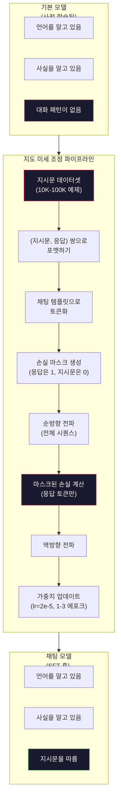

# 지시문 튜닝 (SFT)

> 기본 모델은 다음 토큰을 예측합니다. 그것뿐입니다. 지시를 따르거나, 질문에 답하거나, 해로운 요청을 거절하지 않습니다. SFT는 토큰 예측기와 유용한 어시스턴트 사이의 다리입니다. Claude, GPT, Llama Chat 등 여러분이 대화해 본 모든 모델은 이 단계를 거쳤습니다.

**유형:** Build
**언어:** Python (numpy 포함)
**선수 요건:** 10단계, 04강 (미니 GPT 사전 학습)
**시간:** 약 90분

## 학습 목표

- 기본 언어 모델을 지시문 따르기 어시스턴트로 변환하는 지도 미세 조정 (SFT)을 구현해 보세요
- 시스템, 사용자, 어시스턴트 역할이 포함된 채팅 템플릿으로 훈련 데이터를 포맷하고, 어시스턴트 토큰이 아닌 토큰에 대한 손실은 마스킹하세요
- 기본 모델이 질문에 답하기보다 텍스트를 계속 이어 나가기 때문에 SFT가 필수적인 이유를 설명하세요
- 보유한 지시문 세트에서 기본 모델과 미세 조정된 모델의 응답을 비교하여 SFT 품질을 평가하세요

## 문제점

04강에서 모델을 훈련했습니다. 이 모델은 시퀀스가 주어지면 다음 토큰을 예측할 수 있습니다. "The transformer architecture"를 입력하면 "has revolutionized natural language processing."라고 계속 이어 나갈 수 있습니다. 다음 토큰 예측기로서는 인상적입니다.

이제 이것을 시도해 보세요: "What is the capital of France?"를 입력하면 기본 모델은 "Paris"라고 답하지 않습니다. 패턴을 계속 이어 나갑니다. 질문 목록이 포함된 문서에서 학습했기 때문에 "What is the capital of Germany? What is the capital of Spain?"를 생성할 수 있습니다. 또는 "is a question that many people ask"를 생성할 수도 있습니다. 이는 타당한 다음 토큰 연속이기 때문입니다. 모델에는 *답변*이라는 개념이 없습니다. *계속 이어 나가기*만 알 뿐입니다.

이것이 GPT-3 (기본 모델, 2020년 6월 출시)과 ChatGPT (지시문 튜닝, 2022년 11월 출시) 사이의 차이입니다. 아키텍처는 동일하고, 사전 학습도 동일합니다. 차이는 모델이 대화 패턴을 따르도록 가르친 20,000~100,000개의 정교하게 제작된 (지시문, 응답) 쌍입니다.

Stanford Alpaca는 수백만 개의 예제가 필요하지 않음을 증명했습니다. 2023년 3월, 그들은 GPT-3.5가 생성한 52,000개의 지시문-응답 쌍으로 Llama 7B를 미세 조정했습니다. 총 비용: $600. The result was a chatbot that could follow instructions, answer questions, and hold conversations. Not as good as ChatGPT, but shockingly close for $600 및 몇 시간의 훈련.

Meta의 Llama 2 Chat은 초기 SFT 단계에서 약 27,000개의 고품질 예시만 사용했습니다. 핵심 통찰은 다음과 같습니다: 양보다 질이 중요합니다. 숙련된 어노테이터가 작성한 27,000개의 예시가 인터넷에서 스크래핑한 100만 개의 잡음 있는 예시보다 더 효과적입니다.

## 개념

### SFT가 실제로 하는 일

지도 미세 조정(SFT)은 사전 학습에서의 동일한 학습 루프를 이어갑니다 -- 순방향 전파, 손실 계산, 역방향 전파, 가중치 업데이트 -- 하지만 다른 종류의 데이터에서 수행합니다. 원시 텍스트 대신, 구조화된 대화로 학습합니다:

```json
{
  "system": "You are a helpful assistant.",
  "user": "What is the capital of France?",
  "assistant": "The capital of France is Paris."
}
```

모델은 이미 파리가 프랑스의 수도라는 것을 알고 있습니다. 이는 위키백과, 교과서, 웹 페이지를 통해 사전 학습 중에 배운 것입니다. SFT는 모델에게 새로운 사실을 가르치지 않습니다. 모델에게 새로운 *행동*을 가르칩니다: 질문을 보면 답변을 생성하고, 지시문을 보면 완성을 생성하며, 해로운 요청을 보면 거절을 생성하는 것입니다.

이렇게 생각해 보세요. 사전 학습은 모델에 지식을 제공합니다. SFT는 모델에 예절을 제공합니다.

### 데이터 형식

세 가지 형식이 업계에서 지배적입니다. 각 형식은 동일한 정보 -- 누가 무엇을 말했는지 --를 다른 구분자로 인코딩합니다.

**Alpaca 형식** (Stanford, 2023년 3월):

```json
{
  "instruction": "Summarize the following article in 3 sentences.",
  "input": "The European Central Bank raised interest rates...",
  "output": "The ECB increased rates by 25 basis points..."
}
```

단순하며 널리 사용됩니다. `input` 필드는 선택 사항입니다 -- 많은 지시문은 추가 컨텍스트가 필요하지 않습니다. Stanford는 이 형식으로 GPT-3.5를 통해 생성된 52,000개의 예시를 $600에 공개했습니다. 이는 오픈 소스 지시문 튜닝 운동을 촉발했습니다.

**ShareGPT 형식** (커뮤니티, 2023):

```json
{
  "conversations": [
    {"from": "system", "value": "You are a helpful assistant."},
    {"from": "human", "value": "What causes tides?"},
    {"from": "gpt", "value": "Tides are caused by the gravitational pull of the Moon..."},
    {"from": "human", "value": "How often do they occur?"},
    {"from": "gpt", "value": "Most coastal areas experience two high tides and two low tides per day..."}
  ]
}
```

다중 턴 대화를 지원합니다. "from" 필드는 실제 모델에 관계없이 관례적으로 "human"과 "gpt"를 사용합니다. Vicuna는 사용자가 공유한 ChatGPT 대화 기록에서 스크래핑한 70,000개의 ShareGPT 대화로 학습되었습니다.

**ChatML 형식** (OpenAI, 많은 오픈 소스 모델에서 사용):

```
<|im_start|>system
You are a helpful assistant.<|im_end|>
<|im_start|>user
What is the capital of France?<|im_end|>
<|im_start|>assistant
The capital of France is Paris.<|im_end|>
```

역할을 구분하기 위해 특수 토큰(`<|im_start|>`, `<|im_end|>`)을 사용합니다. 이 토큰들은 미세 조정 중에 토크나이저의 어휘에 추가됩니다. Qwen, Yi 및 기타 많은 모델이 ChatML을 사용합니다.

세 형식 모두 동일한 일을 수행합니다: 모델에게 "이것이 지시문이고, 이것이 응답이며, 이 패턴을 학습하라"라고 알려줍니다.

### 왜 효과가 있는가

모델은 사전 학습을 통해 이미 언어를 알고 있습니다. 질문이 답변으로 이어지는 수십억 개의 예시, 지시가 완결로 이어지는 예시, 사람들 간의 대화 등을 이미 보았습니다. 이러한 패턴은 가중치에 이미 인코딩되어 있습니다.

SFT는 이러한 잠재적 능력을 집중시킵니다. 모델이 컨텍스트로부터 질문을 답변해야 하는지, 문서를 계속 작성해야 하는지 스스로 파악해야 하는 대신, SFT는 대화 패턴을 명시적으로 학습합니다. 몇 천 개의 예시를 거치면 모델은 다음과 같이 학습합니다: 어시스턴트 역할 마커를 보면 유용한 응답을 생성합니다.

이것이 27,000개의 예시가 충분한 이유입니다. 모델에게 영어를 가르치는 것이 아닙니다. 세계에 대한 사실을 가르치는 것도 아닙니다. 지시에 응답하는 한 가지 단순한 행동을 가르치는 것입니다. 지식은 이미 존재했습니다.

### 마스크 손실(Masked Loss)

이것은 SFT에서 가장 중요한 기술적 세부 사항이며, 대부분의 튜토리얼은 이를 생략합니다.

사전 학습에서는 모든 토큰에 대해 손실을 계산합니다. 모델은 시퀀스의 모든 다음 토큰을 예측하는 것을 학습합니다. SFT에서는 *응답(response)* 토큰에 대해서만 손실을 계산합니다. 지시(instruction) 토큰은 컨텍스트로 존재하지만, 모델이 이를 "예측"하는 데 실패했다고 해서 페널티를 받지는 않습니다.

왜일까요? 모델이 지시를 *생성하는* 것을 학습하기를 원하지 않기 때문입니다. 지시에 *응답하는* 것을 학습하기를 원합니다. 지시 토큰에 대해 손실을 계산하면, 모델이 마치 질문하는 쪽인 것처럼 "프랑스의 수도는 무엇인가요?"를 예측하도록 훈련하는 셈입니다. 이는 기울기 신호를 낭비하며 모델이 자신의 역할에 대해 혼란을 겪게 할 수 있습니다.

실제로는 손실 마스크를 생성합니다: 응답 토큰은 1, 지시 토큰은 0으로 설정합니다. 평균을 내기 전에 토큰별 손실에 이 마스크를 곱합니다.

```
Tokens:    [SYS] You are helpful [USER] What is the capital? [ASST] Paris is the capital [EOS]
Loss mask:   0    0    0     0      0     0   0  0     0       1     1    1   1     1      1
```

`[ASST]` 이후의 토큰만 손실에 기여합니다. 모델은 순방향 전파(forward pass) 동안 전체 대화를 보게 됩니다 (올바른 응답을 생성하기 위해 지시가 필요함)하지만, 응답을 얼마나 잘 예측했는지에 기반해서만 가중치를 업데이트합니다.

### 학습 하이퍼파라미터

SFT는 사전 학습과 극적으로 다른 하이퍼파라미터를 사용합니다. 처음부터 학습하는 것이 아닙니다. 이미 작동하는 모델을 조정하는 것입니다.

| 매개변수 | 사전 학습 (Llama 2 7B) | SFT (Llama 2 Chat) |
|-----------|---------------------------|---------------------|
| 학습률 | 3e-4 (피크) | 2e-5 |
| 에포크 | 1 (데이터를 한 번 순회) | 2 |
| 배치 크기 | 4M 토큰 | 64개 예제 |
| 워밍업 단계 | 2,000 | 0-100 |
| 가중치 감쇠 | 0.1 | 0.0-0.1 |
| 데이터 크기 | 2T 토큰 | 27,000개 예제 |

SFT에서는 학습률이 15배 낮습니다. 이는 매우 중요합니다. 미세 조정 중 학습률이 높으면 사전 학습된 지식이 파괴됩니다. 모델이 학습한 내용을 "잊어버리고" 작은 미세 조정 데이터셋에 과적합됩니다. 이는 catastrophic forgetting(치명적遗忘)입니다.

2 에포크는 모델이 각 학습 예제를 두 번 본다는 의미입니다. 작은 데이터셋에서 3 에포크 이상 학습하면 암기 현상이 발생합니다. 모델이 일반화하는 대신 학습 예제를 그대로 재현하기 시작합니다.

### Catastrophic Forgetting (치명적遗忘)

미세 조정은 일반적인 능력을 파괴할 수 있습니다. 지시문 따르기 데이터로 너무 오래 학습하면 모델은 코드를 작성하거나, 수학을 풀거나, 창의적인 텍스트를 생성하는 능력을 잃습니다. 모델은 학습 데이터의 특정 형식에는 매우 능숙해지지만, 그 외의 모든 것에는 형편없어집니다.

세 가지 완화 전략:

1. **낮은 학습률.** 1e-5에서 5e-5. 더 작은 업데이트는 사전 학습된 기능의 파괴를 줄입니다.

2. **짧은 학습.** 1-3 에포크. 모델이 과적합하기 전에 멈추세요.

3. **사전 학습 데이터를 혼합하세요.** Llama 2 Chat은 SFT 데이터셋에 원시 사전 학습 데이터를 소량(2-5%) 혼합했습니다. 이는 새로운 지시문 따르기 행동을 학습하는 동안 모델의 일반적인 능력을 "상기"시킵니다.

### 실제 수치

7B 모델을 10,000개의 고품질 지시문 쌍으로 미세 조정하는 데 단일 NVIDIA A100 80GB GPU에서 약 1시간이 소요됩니다. 계산 과정은 다음과 같습니다:

- 10,000개 예제 x 평균 512 토큰 = 5.12M 토큰
- 2 에포크 = 총 10.24M 토큰
- 7B 모델 미세 조정 시 A100 처리량: ~3,000 토큰/초
- 10.24M / 3,000 = ~3,400초 = ~57분

우리의 미니 GPT (4층, 128 차원)는 학습이 거의 즉각적입니다. 핵심은 규모가 아니라 메커니즘을 이해하는 것입니다.



```figure
loss-masking
```

## 구현하기

### 1단계: 지시문 데이터셋

합성 지시문 데이터셋을 만드세요. 실제 운영에서는 Scale AI나 Anthropic 같은 회사가 인간 어노테이터를 고용하여 이를 작성합니다. 여기서는 형식을 시연하기 위해 프로그램적으로 생성합니다.

```python
import numpy as np

INSTRUCTION_DATA = [
    {
        "instruction": "What is the capital of France?",
        "response": "The capital of France is Paris."
    },
    {
        "instruction": "Explain gravity in one sentence.",
        "response": "Gravity is the force that attracts objects with mass toward each other."
    },
    {
        "instruction": "Write a haiku about the ocean.",
        "response": "Waves crash on the shore, salt and foam beneath the sun, endless blue expanse."
    },
    {
        "instruction": "What is 15 multiplied by 7?",
        "response": "15 multiplied by 7 is 105."
    },
    {
        "instruction": "Name three programming languages.",
        "response": "Three programming languages are Python, Rust, and TypeScript."
    },
    {
        "instruction": "Summarize photosynthesis.",
        "response": "Photosynthesis converts sunlight, water, and carbon dioxide into glucose and oxygen."
    },
    {
        "instruction": "What year did World War II end?",
        "response": "World War II ended in 1945."
    },
    {
        "instruction": "Define machine learning.",
        "response": "Machine learning is a field where algorithms learn patterns from data to make predictions."
    },
]
```

8개 예제는 매우 작습니다. Stanford Alpaca는 52,000개를 사용했습니다. 하지만 8개든 52,000개든 메커니즘은 동일합니다: 토큰화, 마스크, 응답에만 손실 계산.

### 2단계: 채팅 템플릿으로 토큰화

지시문-응답 쌍을 특수한 역할 마커가 포함된 토큰 시퀀스로 변환하세요. 마커는 모델이 지시문이 끝나는 위치와 응답이 시작되는 위치를 알 수 있게 해줍니다.

```python
SPECIAL_TOKENS = {
    "INST_START": 253,
    "INST_END": 254,
    "RESP_START": 255,
}


def tokenize_instruction_pair(instruction, response, vocab_size=256):
    inst_tokens = list(instruction.encode("utf-8"))
    resp_tokens = list(response.encode("utf-8"))

    inst_tokens = [min(t, vocab_size - 4) for t in inst_tokens]
    resp_tokens = [min(t, vocab_size - 4) for t in resp_tokens]

    tokens = (
        [SPECIAL_TOKENS["INST_START"]]
        + inst_tokens
        + [SPECIAL_TOKENS["INST_END"]]
        + [SPECIAL_TOKENS["RESP_START"]]
        + resp_tokens
    )

    return tokens


def create_loss_mask(tokens):
    mask = np.zeros(len(tokens), dtype=np.float32)
    in_response = False

    for i, token in enumerate(tokens):
        if token == SPECIAL_TOKENS["RESP_START"]:
            in_response = True
            continue
        if in_response:
            mask[i] = 1.0

    return mask
```

손실 마스크는 지시문 토큰에 대해 모두 0이고, 응답 토큰에 대해 모두 1입니다. `RESP_START` 토큰 자체는 구분자이므로 응답 콘텐츠의 일부가 아니기 때문에 마스크가 0입니다.

### 3단계: 마스크된 교차 엔트로피 손실

표준 교차 엔트로피 손실이지만 손실 마스크를 곱합니다. 응답 토큰만 기울기에 기여합니다.

```python
def masked_cross_entropy_loss(logits, targets, loss_mask):
    batch, seq_len, vocab_size = logits.shape
    logits_flat = logits.reshape(-1, vocab_size)
    targets_flat = targets.reshape(-1)
    mask_flat = loss_mask.reshape(-1)

    max_logits = logits_flat.max(axis=-1, keepdims=True)
    log_softmax = logits_flat - max_logits - np.log(
        np.exp(logits_flat - max_logits).sum(axis=-1, keepdims=True)
    )

    per_token_loss = -log_softmax[np.arange(len(targets_flat)), targets_flat]

    masked_loss = per_token_loss * mask_flat
    num_response_tokens = mask_flat.sum()
    if num_response_tokens == 0:
        return 0.0
    loss = masked_loss.sum() / num_response_tokens

    return loss
```

분모는 `num_response_tokens`이며 `seq_len`이 아닙니다. 전체 시퀀스 길이로 나누면 긴 지시문이 기울기 신호를 희석시킵니다. 응답 토큰 수로 나누면 지시문 길이에 관계없이 각 응답 토큰의 가중치가 동일하게 유지됩니다.

### 4단계: SFT 학습 루프

04강의 MiniGPT를 재사용하세요. 학습 루프는 사전 학습과 거의 동일해 보이지만, 지시문 형식과 마스크된 손실이 적용됩니다.

```python
import sys
import os
sys.path.insert(0, os.path.join(os.path.dirname(__file__), "..", "..", "04-pre-training-mini-gpt", "code"))
from main import MiniGPT, LayerNorm, FeedForward, MultiHeadAttention, TransformerBlock, Embedding


def sft_train(model, dataset, num_epochs=2, lr=2e-5, seq_len=64):
    formatted_data = []
    for example in dataset:
        tokens = tokenize_instruction_pair(example["instruction"], example["response"])
        mask = create_loss_mask(tokens)
        formatted_data.append((tokens, mask))

    print(f"SFT Training: {len(formatted_data)} examples, {num_epochs} epochs, lr={lr}")
    print(f"Total tokens: {sum(len(t) for t, _ in formatted_data):,}")
    print()

    losses = []

    for epoch in range(num_epochs):
        epoch_loss = 0.0
        num_batches = 0

        indices = np.random.permutation(len(formatted_data))

        for idx in indices:
            tokens, mask = formatted_data[idx]

            if len(tokens) < 3:
                continue
            if len(tokens) > seq_len:
                tokens = tokens[:seq_len]
                mask = mask[:seq_len]

            input_ids = np.array(tokens[:-1]).reshape(1, -1)
            target_ids = np.array(tokens[1:]).reshape(1, -1)
            loss_mask = np.array(mask[1:]).reshape(1, -1)

            logits = model.forward(input_ids)
            loss = masked_cross_entropy_loss(logits, target_ids, loss_mask)

            batch_size, s_len, v_size = logits.shape
            probs = np.exp(logits - logits.max(axis=-1, keepdims=True))
            probs = probs / probs.sum(axis=-1, keepdims=True)
            dlogits = probs.copy()
            dlogits[np.arange(batch_size)[:, None], np.arange(s_len), target_ids] -= 1.0

            mask_expanded = loss_mask[:, :, np.newaxis]
            num_resp = loss_mask.sum()
            if num_resp > 0:
                dlogits = dlogits * mask_expanded / num_resp

            for block in model.blocks:
                block.ffn.W1 -= lr * np.random.randn(*block.ffn.W1.shape) * 0.01
                block.ffn.W2 -= lr * np.random.randn(*block.ffn.W2.shape) * 0.01
                block.ffn.b1 -= lr * np.random.randn(*block.ffn.b1.shape) * 0.01
                block.ffn.b2 -= lr * np.random.randn(*block.ffn.b2.shape) * 0.01

            epoch_loss += loss
            num_batches += 1
            losses.append(loss)

        avg_loss = epoch_loss / max(num_batches, 1)
        print(f"Epoch {epoch + 1}/{num_epochs} | Avg Loss: {avg_loss:.4f}")

    return model, losses
```

학습률은 Llama 2 Chat과 동일하게 2e-5입니다. 사전 학습에서 사용된 3e-4와 비교해 보세요 -- 15배 더 작습니다. 기울기는 마스킹됩니다: 지시문 토큰은 기울기를 생성하지 않습니다. 응답 토큰만 가중치를 업데이트합니다.

### 5단계: Base 모델과 SFT 모델 비교

SFT의 핵심은 행동 변화입니다. 지시문 형식의 입력과 원시 텍스트 연속에 모델이 어떻게 반응하는지 확인하여 이를 측정해 보세요.

```python
def generate_response(model, prompt_tokens, max_new_tokens=50, temperature=0.8):
    tokens = list(prompt_tokens)
    seq_len = model.embedding.pos_embed.shape[0]

    for _ in range(max_new_tokens):
        context = np.array(tokens[-seq_len:]).reshape(1, -1)
        logits = model.forward(context)
        next_logits = logits[0, -1, :]

        next_logits = next_logits / max(temperature, 1e-8)
        probs = np.exp(next_logits - next_logits.max())
        probs = probs / probs.sum()
        probs = np.clip(probs, 1e-10, 1.0)
        probs = probs / probs.sum()

        next_token = np.random.choice(len(probs), p=probs)
        tokens.append(int(next_token))

    return tokens


def evaluate_instruction_following(model, instructions):
    print("Evaluating instruction following:")
    print("-" * 50)

    for instruction in instructions:
        tokens = (
            [SPECIAL_TOKENS["INST_START"]]
            + [min(t, 252) for t in list(instruction.encode("utf-8"))]
            + [SPECIAL_TOKENS["INST_END"]]
            + [SPECIAL_TOKENS["RESP_START"]]
        )

        output = generate_response(model, tokens, max_new_tokens=30, temperature=0.6)
        response_start = len(tokens)
        response_tokens = output[response_start:]
        response_bytes = bytes([t for t in response_tokens if t < 128])
        response_text = response_bytes.decode("utf-8", errors="replace")

        print(f"  Q: {instruction}")
        print(f"  A: {response_text[:80]}")
        print()
```

8개의 예제만 있는 작은 모델에서는 응답이 의미 있는 결과를 내지 못할 것입니다. 이는 예상된 결과입니다. 중요한 것은 *구조*입니다: 모델은 지시문을 계속 생성하는 대신 응답 마커 이후에 출력을 생성하는 것을 학습합니다.

### 6단계: 파괴적遗忘(Catastrophic Forgetting) 측정

SFT 전후의 모델의 다음 토큰 예측 능력을 비교하세요. SFT가 일반 능력을 손상시킨다면, 원시 텍스트에 대한 손실(loss)이 증가할 것입니다.

```python
def measure_forgetting(model, test_text, seq_len=64):
    tokens = np.array(list(test_text.encode("utf-8")[:512]))

    total_loss = 0.0
    num_windows = 0

    for start in range(0, len(tokens) - seq_len - 1, seq_len):
        input_ids = tokens[start:start + seq_len].reshape(1, -1)
        target_ids = tokens[start + 1:start + seq_len + 1].reshape(1, -1)

        logits = model.forward(input_ids)

        batch, s_len, vocab_size = logits.shape
        logits_flat = logits.reshape(-1, vocab_size)
        targets_flat = target_ids.reshape(-1)

        max_logits = logits_flat.max(axis=-1, keepdims=True)
        log_softmax = logits_flat - max_logits - np.log(
            np.exp(logits_flat - max_logits).sum(axis=-1, keepdims=True)
        )

        loss = -log_softmax[np.arange(len(targets_flat)), targets_flat].mean()
        total_loss += loss
        num_windows += 1

    return total_loss / max(num_windows, 1)
```

실제 미세 조정에서는 학습 전체 기간 동안 이 지표를 추적합니다. 원시 텍스트 손실이 10-15% 이상 증가한다면, SFT가 너무 공격적입니다. 학습률을 낮추거나 에포크 수를 줄이세요.

## 사용하기

### 전체 SFT 파이프라인 데모

```python
if __name__ == "__main__":
    np.random.seed(42)

    test_text = """The transformer architecture processes sequences through self-attention.
Each layer applies multi-head attention followed by a feedforward network.
Residual connections and layer normalization stabilize deep networks.
The model learns to predict the next token given all previous tokens."""

    print("=" * 70)
    print("INSTRUCTION TUNING (SFT) DEMO")
    print("=" * 70)
    print()

    model = MiniGPT(
        vocab_size=256, embed_dim=128, num_heads=4,
        num_layers=4, max_seq_len=128, ff_dim=512
    )
    print(f"Model: {model.count_parameters():,} parameters")
    print(f"Config: 4 layers, 4 heads, 128 dims (mini GPT from 04강)")
    print()

    print("PRE-SFT: Measuring base model loss on raw text")
    base_loss = measure_forgetting(model, test_text)
    print(f"  Base model loss: {base_loss:.4f}")
    print()

    print("=" * 70)
    print("SFT TRAINING")
    print("=" * 70)

    model, losses = sft_train(
        model, INSTRUCTION_DATA, num_epochs=3, lr=2e-5, seq_len=128
    )

    print()
    print("POST-SFT: Measuring fine-tuned model loss on raw text")
    sft_loss = measure_forgetting(model, test_text)
    print(f"  SFT model loss: {sft_loss:.4f}")
    print(f"  Change: {((sft_loss - base_loss) / base_loss * 100):+.1f}%")
    if abs(sft_loss - base_loss) / base_loss < 0.15:
        print("  Minimal forgetting (< 15% change)")
    else:
        print("  Significant forgetting detected")
    print()

    print("=" * 70)
    print("INSTRUCTION FOLLOWING EVALUATION")
    print("=" * 70)
    print()

    test_instructions = [
        "What is the capital of France?",
        "Name a programming language.",
        "Define gravity.",
    ]
    evaluate_instruction_following(model, test_instructions)

    print("=" * 70)
    print("DATA FORMAT EXAMPLES")
    print("=" * 70)
    print()

    for i, example in enumerate(INSTRUCTION_DATA[:3]):
        tokens = tokenize_instruction_pair(example["instruction"], example["response"])
        mask = create_loss_mask(tokens)
        resp_count = int(mask.sum())
        total_count = len(tokens)
        print(f"  Example {i + 1}: {total_count} tokens, {resp_count} response tokens ({resp_count/total_count:.0%} of sequence)")
        print(f"    Instruction: {example['instruction']}")
        print(f"    Response: {example['response']}")
        print()

    print("=" * 70)
    print("TRAINING LOSS CURVE")
    print("=" * 70)
    print()

    if losses:
        window = max(1, len(losses) // 5)
        for i in range(0, len(losses), window):
            chunk = losses[i:i + window]
            avg = sum(chunk) / len(chunk)
            print(f"  Steps {i:3d}-{i + len(chunk) - 1:3d}: avg loss = {avg:.4f}")
```

## 출시하기

이 강의는 `outputs/prompt-sft-data-curator.md`를 생성합니다 -- SFT를 위한 지시문 데이터셋을 설계하고 큐레이션하는 데 도움이 되는 프롬프트입니다. 목표 능력(코드 생성, 수학, 대화)을 입력하면 형식 사양, 품질 기준, 다양성 요구 사항이 포함된 데이터 수집 계획을 생성합니다.

## 연습 문제

1. 시스템 프롬프트 지원 추가. `tokenize_instruction_pair`를 수정하여 시스템 메시지를 받아들이고 지시문 앞에 붙이세요. 서로 다른 시스템 프롬프트("You are a poet", "You are a math tutor")를 가진 5개의 예제를 만들고, 학습 중 모델이 서로 다른 시스템 프롬프트를 인식하는지 확인하세요.

2. 데이터 혼합 구현. SFT 데이터셋과 원시 텍스트 코퍼스를 받아들이고, 예제의 5%는 원시 텍스트(마스킹 없음)이고 95%는 지시문 쌍(마스킹됨)인 학습 배치를 생성하는 함수를 만드세요. 3에포크를 실행하고 순수 SFT 학습과 forgetting 지표를 비교하세요.

3. 데이터 품질 점수 계산기를 구축해 보세요. 각 지시문-응답 쌍에 대해 다음을 계산합니다: (a) 토큰 단위의 응답 길이, (b) 지시문 대비 응답 비율, (c) 어휘 다양성 (고유 토큰 수 / 총 토큰 수). 응답 길이가 10 토큰 미만이거나 다양성이 0.3 미만인 예제를 필터링합니다. 필터링이 최종 손실에 미치는 영향을 보여 주세요.

4. 다중 턴 대화 학습을 구현해 보세요. 토큰화를 확장하여 3턴 대화(사용자-어시스턴트-사용자-어시스턴트-사용자-어시스턴트)를 처리합니다. 손실 마스크는 세 개의 어시스턴트 턴 모두를 포함해야 합니다. 한 예제에 대해 토큰-마스크 정렬을 출력하여 마스크가 올바른지 검증해 보세요.

5. 학습률을 비교해 보세요. 동일한 모델을 세 번 학습하되, lr=1e-4, lr=2e-5, lr=1e-6을 각각 사용합니다. 손실 곡선을 플롯합니다. 1e-4 실행은 초기 급격한 하강을 보이지만 최종 손실이 더 높습니다(과적합). 1e-6 실행은 거의 변화가 없습니다. 2e-5 실행이 최적의 지점(sweet spot)이 됩니다.

## 핵심 용어

| 용어 | 사람들이 말하는 것 | 실제 의미 |
|------|----------------|----------------------|
| SFT | "대화 기반 미세 조정" | 지도 미세 조정 (SFT)(Supervised Fine-Tuning): (지시문, 응답) 쌍에 대해 학습을 계속하되, 손실은 응답 토큰에만 계산 |
| 지시문 튜닝 | "모델이 지시문을 따르도록 가르침" | 명시적인 지시문-응답 쌍으로 학습하여, 기본 모델이 새로운 지식이 아닌 대화 패턴을 학습 |
| 손실 마스크 | "프롬프트 무시" | 지시문 토큰의 손실을 0으로 설정하여, 기울기가 응답 토큰 예측에서만 흐르도록 함 |
| ChatML | "채팅 마크업 언어" | `<\|im_start\|>` 및 `<\|im_end\|>` 구분자를 사용하여 대화 데이터에서 화자 역할을 표시하는 토큰 형식 |
| Alpaca 형식 | "Stanford의 형식" | instruction/input/output 필드를 가진 JSON 형식으로, 비용이 $600인 GPT-3.5 생성 예제 52K에 사용 |
| 파괴적遗忘 (Catastrophic forgetting) | "모델이 더 바보가 됨" | 미세 조정이 사전 학습된 능력을 파괴하는 이유는, 기울기 업데이트가 일반 지식을 작업 특화 패턴으로 덮어쓰기 때문 |
| 가중치 결합 (Weight tying) | "공유 임베딩" | 입력 토큰 임베딩과 출력 예측 헤드에 동일한 매트릭스를 사용하여, 매개변수를 절약하고 일관성을 개선 |
| 채팅 템플릿 | "프롬프트를 포맷하는 방법" | 모델에 대한 대화를 구조화하는 특정 토큰 시퀀스(역할 마커, 구분자) |

## 추가 읽기

- [Ouyang et al., 2022 -- "Training language models to follow instructions with human feedback" (InstructGPT)](https://arxiv.org/abs/2203.02155) -- OpenAI에서 지시 미세 조정(SFT)과 RLHF를 도입한 논문
- [Taori et al., 2023 -- "Stanford Alpaca: An Instruction-following LLaMA Model"](https://github.com/tatsu-lab/stanford_alpaca) -- 600달러로 52K개의 지시 예제를 확보하여, 소규모 데이터셋에서도 SFT가 작동함을 입증
- [Touvron et al., 2023 -- "Llama 2: Open Foundation and Fine-Tuned Chat Models"](https://arxiv.org/abs/2307.09288) -- Meta의 SFT + RLHF 파이프라인, 27K개의 고품질 예제 사용
- [Chiang et al., 2023 -- "Vicuna: An Open-Source Chatbot Impressing GPT-4"](https://lmsys.org/blog/2023-03-30-vicuna/) -- 70K개의 ShareGPT 대화로 학습
- [Zhou et al., 2023 -- "LIMA: Less Is More for Alignment"](https://arxiv.org/abs/2305.11206) -- 신중하게 선별된 1,000개의 예제가 훨씬 더 큰 데이터셋에서의 SFT와 동등한 성능을 낼 수 있음을 입증
