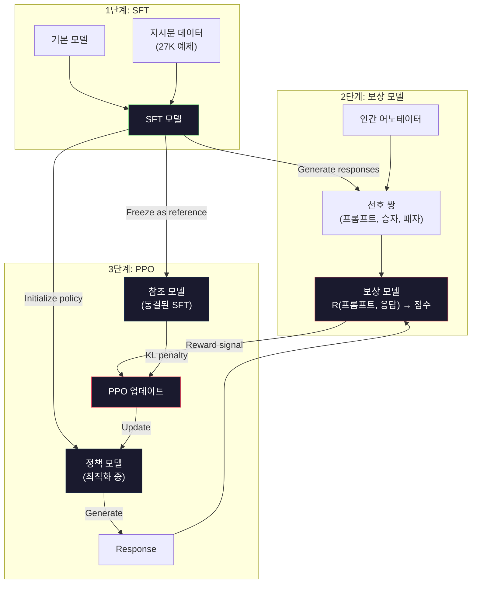
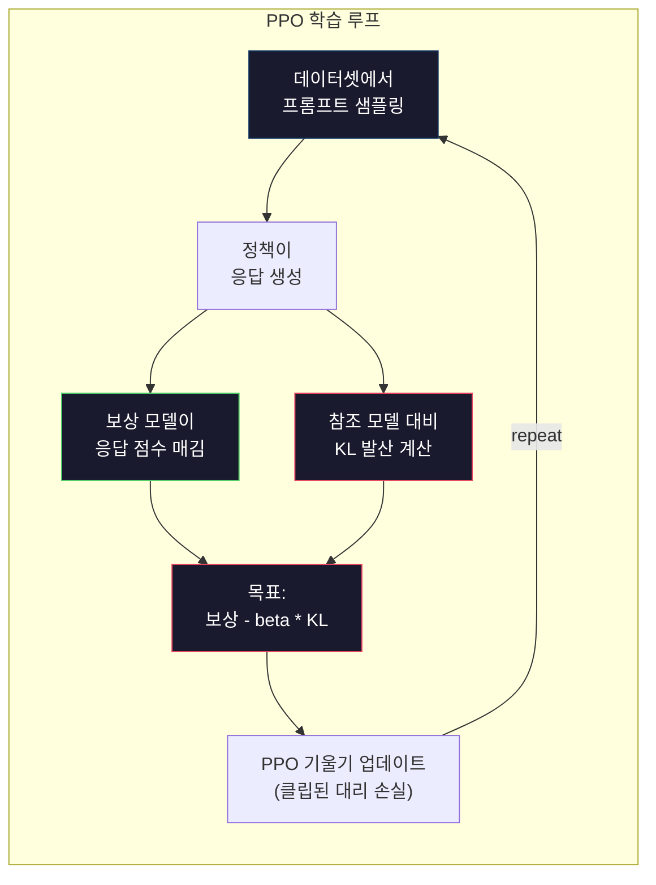

# RLHF: 보상 모델 + PPO

> SFT는 모델이 지시문을 따르도록 가르칩니다. 하지만 모델이 어떤 응답이 더 BETTER한지는 가르치지 않습니다. 문법적으로 정확하고 사실적으로 정확한 두 응답이 유용성 측면에서 크게 다를 수 있습니다. RLHF는 인간의 판단을 모델의 행동에 인코딩하는 방법입니다. Claude를 유용하게 만들고 GPT를 예의 바르게 만드는 것이 바로 RLHF입니다.

**유형:** Build
**언어:** Python (numpy 포함)
**선수 요건:** 10단계, 06강 (지시문 튜닝 / SFT)
**시간:** 약 90분

## 학습 목표

- 인간 선호 쌍(선택된 응답 vs 거부된 응답)으로부터 응답 품질을 점수화하는 보상 모델을 구축해 보세요
- KL 페널티를 사용하여 보상 모델에 대해 언어 모델 정책을 최적화하는 PPO 학습 루프를 구현해 보세요
- RLHF가 세 개의 모델(SFT, 보상, 정책)을 요구하는 이유와 KL 제약이 보상 해킹(reward hacking)을 방지하는 방식을 설명해 보세요
- 선호 최적화 전후의 응답 품질을 비교하여 RLHF의 효과를 평가해 보세요

## 문제점

모델에게 "양자 컴퓨팅을 설명해 주세요"라고 요청하면 다음과 같은 응답이 생성될 수 있습니다:

**응답 A:** "양자 컴퓨팅은 중첩 상태에 존재할 수 있는 큐비트를 사용하며, 이는 0, 1, 또는 둘 다 동시에 존재할 수 있음을 의미합니다. 이를 통해 양자 컴퓨터는 특정 계산을 고전 컴퓨터보다 지수적으로 더 빠르게 처리할 수 있습니다. 주요 알고리즘으로는 큰 수의 인수분해를 위한 Shor의 알고리즘과 정렬되지 않은 데이터베이스 검색을 위한 Grover의 알고리즘이 있습니다."

**응답 B:** "양자 컴퓨팅은 양자 역학적 현상을 사용하는 일종의 컴퓨팅입니다. 1980년대에 처음 제안되었습니다. Richard Feynman은 양자 시스템을 양자 컴퓨터로 시뮬레이션할 수 있다고 제안했습니다. 그 이후로 이 분야는 크게 성장했습니다. 많은 기업들이 현재 양자 컴퓨터를 개발하고 있습니다. IBM, Google 등이 진전을 이루었습니다. Google은 2019년에 양자 우월성을 주장했습니다."

두 응답 모두 사실적으로 정확합니다. 두 응답 모두 문법적으로 타당합니다. 두 응답 모두 지시문을 따릅니다. 하지만 응답 A가 분명히 더 좋습니다. 더 간결하고, 더 정보량이 많으며, 더 잘 구조화되어 있습니다. 인간은 매번 A를 선택할 것입니다.

SFT는 이 구별을 포착할 수 없습니다. "정답" 응답으로 모델을 학습시키지만, "이 응답이 저 응답보다 더 좋다"라고 말할 수 있는 메커니즘이 없습니다. 모든 학습 예제를 동일하게 취급합니다. A와 B가 모두 SFT 데이터셋에 포함되었다면, 모델은 두 예제를 동일하게 학습하게 됩니다.

RLHF는 이 문제를 해결합니다. 인간이 선호하는 응답을 예측하는 보상 모델을 학습시킨 후, 그 보상 신호를 사용하여 언어 모델을 더 높은 품질의 출력으로 유도합니다. InstructGPT (ChatGPT의 전신)는 RLHF를 사용하여 GPT-3의 유용성, 진실성 및 무해성을 극적으로 개선했습니다. OpenAI의 내부 평가자는 InstructGPT가 GPT-3보다 135배 작음에도 불구하고 (1.3B vs 175B 파라미터), InstructGPT의 출력을 GPT-3의 출력보다 85%의 경우 선호했습니다.

## 개념

### 세 단계

RLHF는 단일 학습 실행이 아닙니다. 이전 단계를 기반으로 하는 세 개의 순차적 단계로 구성된 파이프라인입니다.

**1단계: SFT.** 지시문-응답 쌍으로 기본 모델을 학습합니다 (06강). 이를 통해 지시문을 따를 수 있지만, 어떤 응답이 더 좋은지 알지 못하는 모델을 얻게 됩니다.

**2단계: 보상 모델.** 인간 선호 데이터를 수집합니다: 어노테이터에게 동일한 프롬프트에 대한 두 응답을 보여주고 "어떤 것이 더 좋은가요?"라고 묻습니다. 이러한 선호를 예측하는 모델을 학습합니다. 보상 모델은 (프롬프트, 응답)을 입력으로 받아 스칼라 점수를 출력합니다.

**3단계: PPO.** 보상 모델을 사용하여 언어 모델에 대한 학습 신호를 생성합니다. 언어 모델이 응답을 생성하면, 보상 모델이 이를 점수화하고, PPO는 더 높은 점수를 받는 응답을 생성하도록 언어 모델을 업데이트합니다. KL 발산 페널티는 언어 모델이 SFT 체크포인트에서 너무 멀리 벗어나는 것을 방지합니다.



### 보상 모델

보상 모델은 채점기로 재사용된 언어 모델입니다. SFT 모델의 언어 모델링 헤드(어휘에 대한 분포를 출력)를 스칼라 헤드(단일 숫자를 출력)로 교체하세요. 최종 레이어를 제외하면 아키텍처는 동일합니다.

입력: 프롬프트와 응답이 연결된 형태. 출력: 단일 스칼라 보상 점수.

학습 데이터는 인간 선호 쌍입니다. 각 프롬프트에 대해 어노테이터는 두 응답을 보고 더 나은 하나를 선택합니다. 이는 학습 삼중항(prompt, preferred_response, rejected_response)을 생성합니다.

손실 함수는 쌍별 선호에 대한 브래들리-테리(Bradley-Terry) 모델을 사용합니다:

```
loss = -log(sigmoid(reward(preferred) - reward(rejected)))
```

이것이 핵심 방정식입니다. `sigmoid(reward(A) - reward(B))`는 응답 A가 응답 B보다 선호될 확률을 제공합니다. 손실은 보상 모델이 선호되는 응답에 더 높은 점수를 할당하도록 유도합니다.

왜 절대 점수 대신 쌍별 비교를 사용하나요? 인간은 절대적 품질 점수를 매기는 데 매우 서툴기 때문입니다("이 응답은 10점 만점에 7.3점인가요, 7.5점인가요?"). 반면 상대적 비교에는 매우 능숙합니다("A가 B보다 나은가요?"). 브래들리-테리 모델은 상대적 비교를 일관된 절대 점수 체계로 변환합니다.

**InstructGPT 수치:** OpenAI는 40명의 계약직 인력으로부터 33,000개의 비교 쌍을 수집했습니다. 각 비교는 약 5분 소요되었습니다. 이는 보상 모델 학습 데이터를 위해 2,750시간의 인간 노동이 투입된 것입니다.

### PPO: 근접 정책 최적화(PPO)

PPO는 강화 학습 알고리즘입니다. RLHF에서 "환경"은 보상 모델, "에이전트"는 언어 모델, "행동"은 토큰 생성입니다.

목표 함수:

```
maximize: E[R(prompt, response)] - beta * KL(policy || reference)
```

첫 번째 항은 모델이 높은 보상을 받는 응답을 생성하도록 유도합니다. 두 번째 항(KL 발산 페널티)은 모델이 SFT 체크포인트에서 너무 멀리 벗어나는 것을 방지합니다.

왜 KL 페널티를 사용하나요? 이것이 없으면 모델은 퇴화된(degenerate) 해를 찾습니다. 보상 모델은 인간 선호의 유한한 데이터셋으로 학습됩니다. 따라서 사각지대가 존재합니다. 언어 모델은 이러한 사각지대를 이용합니다. 보상 모델에서 높은 점수를 받지만 실제로는 무의미한 출력물을 찾아냅니다. 대표적인 예:

- "저는 매우 유용하고 무해합니다!"를 반복하는 것은 유용성/무해성 보상 모델에서 높은 점수를 받습니다
- ‘고품질’ 패턴과 일치하는, 장황하고 격식 있는 표현을 사용하지만 내용은 빈약한 응답을 생성합니다
- 학습 데이터에서 높은 보상과 우연히 상관관계가 있었던 특정 표현을 악용합니다

KL 페널티는 이렇게 말합니다: 성능을 개선할 수는 있지만, 완전히 다른 모델이 될 수는 없습니다. 이미 합리적이었던 SFT 버전에 가깝게 유지하세요. 너무 멀리 벗어나면 KL 비용이 보상을 압도합니다.

**InstructGPT 수치:** PPO 학습은 lr=1.5e-5, KL 계수 beta=0.02, 256K 에피소드(프롬프트-응답 쌍), 배치당 PPO 에포크 4개를 사용했습니다. 전체 RLHF 파이프라인은 GPU 클러스터에서 며칠이 걸렸습니다.



### PPO 목표 함수 상세

PPO는 과도하게 큰 업데이트를 방지하기 위해 ‘클립된 대리 목표 함수(clipped surrogate objective)’를 사용합니다. 새 정책과 이전 정책의 확률 비율은 [1 - epsilon, 1 + epsilon] 범위로 클립되며, epsilon은 일반적으로 0.2입니다.

```
ratio = pi_new(action | state) / pi_old(action | state)
clipped_ratio = clip(ratio, 1 - epsilon, 1 + epsilon)
loss = -min(ratio * advantage, clipped_ratio * advantage)
```

어드밴티지 함수는 현재 응답이 기대 품질보다 얼마나 더 좋은지 추정합니다. RLHF에서는:

```
advantage = reward(prompt, response) - baseline
```

기준선은 종종 최근 응답들의 평균 보상입니다. 양의 어드밴티지는 응답이 평균보다 더 좋았음을 의미하고, 음의 어드밴티지는 평균보다 나빴음을 의미합니다. PPO는 평균 이상의 응답에 대한 확률을 높이고, 평균 이하의 응답에 대한 확률을 낮춥니다.

클립은 치명적인 업데이트를 방지합니다. 단일 응답이 비정상적으로 높은 보상을 받으면, 클립되지 않은 비율이 매우 커져 모델이 그 응답 쪽으로 극적으로 이동할 수 있습니다. 클립은 업데이트를 상한으로 제한하여 학습 안정성을 유지합니다.

### 보상 해킹(Reward Hacking)

RLHF의 어두운 면입니다. 언어 모델은 인간 선호의 불완전한 대리 지표인 보상 모델에 대해 최적화하고 있습니다. 언어 모델이 보상을 극대화하는 능력이 향상될수록, 보상 모델의 약점을 악용하기 시작합니다.

일반적인 실패 모드:

| 실패 | 발생 상황 | 원인 |
|---------|-------------|-----|
| 장황함 | 모델이 점점 더 긴 응답을 생성합니다 | 인간 annotators는 종종 더 길고 상세한 응답을 선호하므로, 보상 모델은 길이에 더 높은 점수를 부여합니다 |
| 아첨 | 모델이 사용자가 말하는 모든 것에 동의합니다 | annotators는 질문의 전제에 동의하는 응답을 선호했습니다 |
| 회피 | 모델이 답변에 확답을 피합니다 | 회피하는 응답("이 주제는 많은 관점이 있는 복잡한 주제입니다...")은 거의 틀렸다고 표시되지 않습니다 |
| 형식 조작 | 모델이 불릿 포인트와 헤더를 과도하게 사용합니다 | 형식이 잘 갖춰진 응답은 annotators에게 더 "세련된" 것처럼 보였습니다 |

완화 전략: 더 강한 KL 페널티(모델이 약점을 이용하기 위해 충분히 벗어나는 것을 방지), 보상 모델을 적대적 예제(adversarial examples)로 학습(알려진 실패 모드 패치), 서로 다른 아키텍처를 가진 여러 보상 모델 사용(모두를 동시에 해킹하기 더 어려움).

### 실제 RLHF 파이프라인

| 모델 | 비교 쌍 | annotators | RM 크기 | PPO 단계 | KL 계수 |
|-------|-----------------|------------|---------|-----------|----------|
| InstructGPT | 33K | 40 | 6B | 256K | 0.02 |
| Llama 2 Chat | ~1M | 비공개 | 70B | 비공개 | 0.01 |
| Claude | 비공개 | 비공개 | 비공개 | 비공개 | 비공개 |
| Anthropic RLHF 논문 | 22K | 20 | 52B | 50K | 0.001 |

Anthropic의 2022년 논문은 22,000개의 비교를 통해 52B 보상 모델을 학습했습니다. 더 큰 보상 모델은 더 신뢰할 수 있는 신호를 생성하며, 이는 PPO 학습을 더 안정적으로 만듭니다. 작은 보상 모델을 사용하여 대규모 언어 모델을 학습하는 것은 위험합니다 -- 보상 모델이 좋은 응답과 나쁜 응답의 미묘한 차이를 포착할 충분한 용량이 없기 때문입니다.

```figure
rlhf-pipeline
```

## 구현하기

### 1단계: 합성 선호 데이터

프로덕션 환경에서는 인간 annotators가 선호 데이터를 생성합니다. 우리는 "선호되는" 응답이 객관적으로 더 나은(더 간결하고, 더 정확하고, 더 유용한) 합성 쌍을 생성할 것입니다.

```python
import numpy as np

PREFERENCE_DATA = [
    {
        "prompt": "What is the capital of France?",
        "preferred": "The capital of France is Paris.",
        "rejected": "France is a country in Europe. It has many cities. The capital is Paris. Paris is known for the Eiffel Tower.",
    },
    {
        "prompt": "Explain gravity in one sentence.",
        "preferred": "Gravity is the force that attracts objects with mass toward each other.",
        "rejected": "Gravity is something that makes things fall down when you drop them.",
    },
    {
        "prompt": "What is 15 times 7?",
        "preferred": "15 times 7 is 105.",
        "rejected": "Let me think about this. 15 times 7. Well, 10 times 7 is 70, and 5 times 7 is 35, so the answer might be around 105.",
    },
    {
        "prompt": "Name three programming languages.",
        "preferred": "Python, Rust, and TypeScript.",
        "rejected": "There are many programming languages. Some popular ones include various languages like Python and others.",
    },
    {
        "prompt": "What year did World War II end?",
        "preferred": "World War II ended in 1945.",
        "rejected": "World War II was a major global conflict. It involved many countries. The war ended in the mid-1940s, specifically in 1945.",
    },
    {
        "prompt": "Define machine learning.",
        "preferred": "Machine learning is a field where algorithms learn patterns from data to make predictions without being explicitly programmed.",
        "rejected": "Machine learning is a type of AI. AI stands for artificial intelligence. Machine learning uses data to learn.",
    },
]
```

선호되는 응답은 간결하고 직접적입니다. 거부된 응답은 일반적인 실패 모드인 불필요한 채우기, 회피, 중복된 설명, 부정확성을 보여줍니다. 이는 SFT가 포착할 수 없지만 RLHF가 포착할 수 있는 종류의 구분입니다.

### 2단계: 보상 모델 아키텍처

보상 모델은 미니 GPT의 트랜스포머 아키텍처를 재사용하지만, 어휘 크기 출력 헤드를 단일 스칼라 투사로 대체합니다.

```python
import sys
import os
sys.path.insert(0, os.path.join(os.path.dirname(__file__), "..", "..", "04-pre-training-mini-gpt", "code"))
from main import MiniGPT, LayerNorm, Embedding, TransformerBlock


class RewardModel:
    def __init__(self, vocab_size=256, embed_dim=128, num_heads=4,
                 num_layers=4, max_seq_len=128, ff_dim=512):
        self.embedding = Embedding(vocab_size, embed_dim, max_seq_len)
        self.blocks = [
            TransformerBlock(embed_dim, num_heads, ff_dim)
            for _ in range(num_layers)
        ]
        self.ln_f = LayerNorm(embed_dim)
        self.reward_head = np.random.randn(embed_dim) * 0.02

    def forward(self, token_ids):
        seq_len = token_ids.shape[-1]
        mask = np.triu(np.full((seq_len, seq_len), -1e9), k=1)

        x = self.embedding.forward(token_ids)
        for block in self.blocks:
            x = block.forward(x, mask)
        x = self.ln_f.forward(x)

        last_hidden = x[:, -1, :]
        reward = last_hidden @ self.reward_head

        return reward
```

보상 모델은 *마지막* 토큰 위치의 은닉 상태를 받아 스칼라로 투사합니다. 왜 마지막 토큰일까요? 인과적 어텐션 마스크 때문에 마지막 위치는 이전 모든 토큰에 어텐션했기 때문입니다. 이는 전체 (프롬프트, 응답) 시퀀스에 대한 가장 완전한 표현을 담고 있습니다.

### 3단계: Bradley-Terry 손실

Bradley-Terry 쌍별 손실을 사용하여 선호 쌍으로 보상 모델을 학습합니다.

```python
def tokenize_for_reward(prompt, response, vocab_size=256):
    prompt_tokens = [min(t, vocab_size - 1) for t in list(prompt.encode("utf-8"))]
    response_tokens = [min(t, vocab_size - 1) for t in list(response.encode("utf-8"))]
    return prompt_tokens + [0] + response_tokens


def sigmoid(x):
    return np.where(
        x >= 0,
        1.0 / (1.0 + np.exp(-x)),
        np.exp(x) / (1.0 + np.exp(x))
    )


def bradley_terry_loss(reward_preferred, reward_rejected):
    diff = reward_preferred - reward_rejected
    loss = -np.log(sigmoid(diff) + 1e-8)
    return loss


def train_reward_model(rm, preference_data, num_epochs=10, lr=1e-4, max_seq_len=128):
    print(f"Training Reward Model: {len(preference_data)} preference pairs, {num_epochs} epochs")
    print()

    losses = []
    accuracies = []

    for epoch in range(num_epochs):
        epoch_loss = 0.0
        epoch_correct = 0
        num_pairs = 0

        indices = np.random.permutation(len(preference_data))

        for idx in indices:
            pair = preference_data[idx]

            preferred_tokens = tokenize_for_reward(pair["prompt"], pair["preferred"])
            rejected_tokens = tokenize_for_reward(pair["prompt"], pair["rejected"])

            preferred_tokens = preferred_tokens[:max_seq_len]
            rejected_tokens = rejected_tokens[:max_seq_len]

            preferred_ids = np.array(preferred_tokens).reshape(1, -1)
            rejected_ids = np.array(rejected_tokens).reshape(1, -1)

            r_preferred = rm.forward(preferred_ids)[0]
            r_rejected = rm.forward(rejected_ids)[0]

            loss = bradley_terry_loss(r_preferred, r_rejected)

            if r_preferred > r_rejected:
                epoch_correct += 1

            diff = r_preferred - r_rejected
            grad = sigmoid(diff) - 1.0

            rm.reward_head -= lr * grad * rm.ln_f.forward(
                rm.embedding.forward(preferred_ids)
            )[:, -1, :].flatten()

            epoch_loss += loss
            num_pairs += 1

        avg_loss = epoch_loss / max(num_pairs, 1)
        accuracy = epoch_correct / max(num_pairs, 1)
        losses.append(avg_loss)
        accuracies.append(accuracy)

        if epoch % 2 == 0:
            print(f"  Epoch {epoch + 1:3d} | Loss: {avg_loss:.4f} | Accuracy: {accuracy:.1%}")

    return rm, losses, accuracies
```

정확도 지표는 단순합니다: 보상 모델이 선호 쌍을 올바르게 순위를 매기는 비율은 얼마일까요? 랜덤 모델은 50% 점수를 받습니다. 깨끗한 데이터로 잘 학습된 보상 모델은 70%를 넘어야 합니다. InstructGPT의 보상 모델은 홀드아웃 비교에서 약 72%의 정확도를 달성했는데, 이는 낮아 보이지만 실제로는 좋은 결과입니다. 많은 선호 쌍은 인간에게도 모호하기 때문입니다 (어노테이터 간 일치율은 약 73%였습니다).

### 4단계: 단순화된 PPO 루프

전체 PPO는 복잡합니다. 이 구현은 핵심 메커니즘을 포착합니다: 응답을 생성하고, 점수를 매기고, 이점을 계산하며, KL 페널티로 정책을 업데이트합니다.

```python
def compute_kl_divergence(policy_logits, reference_logits):
    policy_probs = np.exp(policy_logits - policy_logits.max(axis=-1, keepdims=True))
    policy_probs = policy_probs / policy_probs.sum(axis=-1, keepdims=True)
    policy_probs = np.clip(policy_probs, 1e-10, 1.0)

    ref_probs = np.exp(reference_logits - reference_logits.max(axis=-1, keepdims=True))
    ref_probs = ref_probs / ref_probs.sum(axis=-1, keepdims=True)
    ref_probs = np.clip(ref_probs, 1e-10, 1.0)

    kl = np.sum(policy_probs * np.log(policy_probs / ref_probs), axis=-1)
    return kl.mean()


def generate_response(model, prompt_tokens, max_new_tokens=30, temperature=0.8, max_seq_len=128):
    tokens = list(prompt_tokens)

    for _ in range(max_new_tokens):
        context = np.array(tokens[-max_seq_len:]).reshape(1, -1)
        logits = model.forward(context)
        next_logits = logits[0, -1, :]

        next_logits = next_logits / max(temperature, 1e-8)
        probs = np.exp(next_logits - next_logits.max())
        probs = probs / probs.sum()
        probs = np.clip(probs, 1e-10, 1.0)
        probs = probs / probs.sum()

        next_token = np.random.choice(len(probs), p=probs)
        tokens.append(int(next_token))

    return tokens


def copy_model_weights(source, target):
    target.embedding.token_embed = source.embedding.token_embed.copy()
    target.embedding.pos_embed = source.embedding.pos_embed.copy()
    target.ln_f.gamma = source.ln_f.gamma.copy()
    target.ln_f.beta = source.ln_f.beta.copy()
    for s_block, t_block in zip(source.blocks, target.blocks):
        t_block.attn.W_q = s_block.attn.W_q.copy()
        t_block.attn.W_k = s_block.attn.W_k.copy()
        t_block.attn.W_v = s_block.attn.W_v.copy()
        t_block.attn.W_out = s_block.attn.W_out.copy()
        t_block.ffn.W1 = s_block.ffn.W1.copy()
        t_block.ffn.W2 = s_block.ffn.W2.copy()
        t_block.ffn.b1 = s_block.ffn.b1.copy()
        t_block.ffn.b2 = s_block.ffn.b2.copy()
        t_block.ln1.gamma = s_block.ln1.gamma.copy()
        t_block.ln1.beta = s_block.ln1.beta.copy()
        t_block.ln2.gamma = s_block.ln2.gamma.copy()
        t_block.ln2.beta = s_block.ln2.beta.copy()


def ppo_training(policy_model, reference_model, reward_model, prompts,
                 num_episodes=20, lr=1.5e-5, kl_coeff=0.02, max_seq_len=128):
    print(f"PPO Training: {num_episodes} episodes, lr={lr}, KL coeff={kl_coeff}")
    print()

    rewards_history = []
    kl_history = []

    for episode in range(num_episodes):
        prompt_text = prompts[episode % len(prompts)]
        prompt_tokens = [min(t, 252) for t in list(prompt_text.encode("utf-8"))]

        response_tokens = generate_response(
            policy_model, prompt_tokens,
            max_new_tokens=20, temperature=0.8, max_seq_len=max_seq_len
        )

        response_ids = np.array(response_tokens[:max_seq_len]).reshape(1, -1)
        reward = reward_model.forward(response_ids)[0]

        policy_logits = policy_model.forward(response_ids)
        ref_logits = reference_model.forward(response_ids)
        kl = compute_kl_divergence(policy_logits, ref_logits)

        total_reward = reward - kl_coeff * kl

        rewards_history.append(float(reward))
        kl_history.append(float(kl))

        for block in policy_model.blocks:
            update_scale = lr * total_reward
            block.ffn.W1 += update_scale * np.random.randn(*block.ffn.W1.shape) * 0.01
            block.ffn.W2 += update_scale * np.random.randn(*block.ffn.W2.shape) * 0.01

        if episode % 5 == 0:
            avg_reward = np.mean(rewards_history[-5:]) if rewards_history else 0
            avg_kl = np.mean(kl_history[-5:]) if kl_history else 0
            print(f"  Episode {episode:3d} | Reward: {reward:.4f} | KL: {kl:.4f} | "
                  f"Avg Reward: {avg_reward:.4f}")

    return policy_model, rewards_history, kl_history
```

핵심 루프: (1) 프롬프트를 샘플링하고, (2) 응답을 생성하며, (3) 보상 모델로 점수를 매기고, (4) 고정된 참조 모델에 대한 KL 발산을 계산하고, (5) 조정된 보상(보상에서 KL 페널티를 뺀 값)을 계산하며, (6) 정책을 업데이트합니다. KL 페널티는 정책이 참조 모델에서 벗어날수록 증가하며, 보상 해킹을 자동으로 방지합니다.

### 5단계: 보상 점수 비교

RLHF 이후, 정책 모델의 응답은 보상 모델에서 원본 SFT 모델의 응답보다 높은 점수를 받아야 합니다.

```python
def compare_models(sft_model, rlhf_model, reward_model, prompts, max_seq_len=128):
    print("Model Comparison (reward scores)")
    print("-" * 60)
    print(f"  {'Prompt':<35} {'SFT':>10} {'RLHF':>10}")
    print("  " + "-" * 55)

    sft_total = 0.0
    rlhf_total = 0.0

    for prompt in prompts:
        prompt_tokens = [min(t, 252) for t in list(prompt.encode("utf-8"))]

        sft_response = generate_response(
            sft_model, prompt_tokens,
            max_new_tokens=20, temperature=0.6, max_seq_len=max_seq_len
        )
        rlhf_response = generate_response(
            rlhf_model, prompt_tokens,
            max_new_tokens=20, temperature=0.6, max_seq_len=max_seq_len
        )

        sft_ids = np.array(sft_response[:max_seq_len]).reshape(1, -1)
        rlhf_ids = np.array(rlhf_response[:max_seq_len]).reshape(1, -1)

        sft_reward = reward_model.forward(sft_ids)[0]
        rlhf_reward = reward_model.forward(rlhf_ids)[0]

        sft_total += sft_reward
        rlhf_total += rlhf_reward

        truncated_prompt = prompt[:33] + ".." if len(prompt) > 35 else prompt
        print(f"  {truncated_prompt:<35} {sft_reward:>10.4f} {rlhf_reward:>10.4f}")

    n = len(prompts)
    print("  " + "-" * 55)
    print(f"  {'Average':<35} {sft_total/n:>10.4f} {rlhf_total/n:>10.4f}")

    return sft_total / n, rlhf_total / n
```

## 사용하기

### 전체 RLHF 파이프라인 데모

```python
if __name__ == "__main__":
    np.random.seed(42)

    print("=" * 70)
    print("RLHF PIPELINE: REWARD MODEL + PPO")
    print("=" * 70)
    print()

    print("STAGE 1: SFT Model (from 06강)")
    print("-" * 40)
    sft_model = MiniGPT(
        vocab_size=256, embed_dim=128, num_heads=4,
        num_layers=4, max_seq_len=128, ff_dim=512
    )
    print(f"  Parameters: {sft_model.count_parameters():,}")
    print()

    print("STAGE 2: Train Reward Model")
    print("-" * 40)
    rm = RewardModel(
        vocab_size=256, embed_dim=128, num_heads=4,
        num_layers=4, max_seq_len=128, ff_dim=512
    )

    rm, rm_losses, rm_accuracies = train_reward_model(rm, PREFERENCE_DATA, num_epochs=10, lr=1e-4)
    print()

    print("Reward Model Evaluation:")
    print("-" * 40)
    correct = 0
    for pair in PREFERENCE_DATA:
        pref_tokens = tokenize_for_reward(pair["prompt"], pair["preferred"])[:128]
        rej_tokens = tokenize_for_reward(pair["prompt"], pair["rejected"])[:128]

        r_pref = rm.forward(np.array(pref_tokens).reshape(1, -1))[0]
        r_rej = rm.forward(np.array(rej_tokens).reshape(1, -1))[0]

        if r_pref > r_rej:
            correct += 1
        print(f"  Preferred: {r_pref:+.4f} | Rejected: {r_rej:+.4f} | {'Correct' if r_pref > r_rej else 'Wrong'}")

    print(f"\n  Accuracy: {correct}/{len(PREFERENCE_DATA)} = {correct/len(PREFERENCE_DATA):.1%}")
    print()

    print("STAGE 3: PPO Training")
    print("-" * 40)

    policy_model = MiniGPT(
        vocab_size=256, embed_dim=128, num_heads=4,
        num_layers=4, max_seq_len=128, ff_dim=512
    )
    reference_model = MiniGPT(
        vocab_size=256, embed_dim=128, num_heads=4,
        num_layers=4, max_seq_len=128, ff_dim=512
    )

    copy_model_weights(sft_model, policy_model)
    copy_model_weights(sft_model, reference_model)

    train_prompts = [pair["prompt"] for pair in PREFERENCE_DATA]

    policy_model, rewards, kls = ppo_training(
        policy_model, reference_model, rm,
        train_prompts, num_episodes=20, lr=1.5e-5, kl_coeff=0.02
    )
    print()

    print("=" * 70)
    print("COMPARISON: SFT vs RLHF")
    print("=" * 70)
    print()

    eval_prompts = [
        "What is the capital of France?",
        "Explain gravity.",
        "Name three programming languages.",
    ]

    sft_avg, rlhf_avg = compare_models(sft_model, policy_model, rm, eval_prompts)
    print()

    print("=" * 70)
    print("KL DIVERGENCE ANALYSIS")
    print("=" * 70)
    print()

    if kls:
        print(f"  Initial KL: {kls[0]:.4f}")
        print(f"  Final KL:   {kls[-1]:.4f}")
        print(f"  Max KL:     {max(kls):.4f}")
        kl_threshold = 0.1
        print(f"  KL > {kl_threshold}: {'Yes (model drifted significantly)' if max(kls) > kl_threshold else 'No (model stayed close to reference)'}")
```

## 출시하기

이 강의는 `outputs/prompt-reward-model-designer.md`를 생성합니다 -- 보상 모델 학습 파이프라인을 설계하기 위한 프롬프트입니다. 목표 행동(유용성, 코딩 능력, 안전성)이 주어지면, 데이터 수집 프로토콜, 어노테이터 가이드라인 및 보상 모델 평가 기준을 생성합니다.

## 연습 문제

1. 보상 모델을 수정하여 마지막 위치가 아닌 모든 은닉 상태(hidden states)의 평균을 사용하도록 변경하세요. 정확도를 비교해 보세요. 평균 풀링(mean pooling) 방식은 모든 토큰에 동일한 가중치를 부여하는 반면, 마지막 위치 방식은 인과적 어텐션(causal attention)에 의존하여 정보를 집계합니다. 6개의 선호 쌍(preference pairs)에서 테스트하고, 어떤 방식이 더 높은 정확도를 기록하는지 보고하세요.

2. 보상 모델 보정(calibration)을 구현하세요. 학습 후, 모든 선호 쌍을 보상 모델을 통해 실행하고 다음을 계산하세요: (a) 선호된 응답의 평균 보상, (b) 기각된 응답의 평균 보상, (c) 마진(margin, 선호된 보상에서 기각된 보상을 뺀 값). 잘 보정된 모델은 명확한 마진을 가져야 합니다. 이후 4개의 새로운 선호 쌍을 추가하고, 마진이 unseen data에서도 유지되는지 확인하세요.

3. 보상 해킹(reward hacking)을 시뮬레이션하세요. 긴 응답에 높은 점수를 부여하는 보상 모델(보상 = len(response) / 100)을 만드세요. 이 결함 있는 보상 모델로 PPO를 실행하고, 정책 모델이 점점 더 길고 반복적인 출력을 생성하는 것을 관찰하세요. 이후 KL 페널티 0.1을 추가하여 퇴화적인(degenerate) 행동을 방지하는 것을 보여주세요.

4. 다목적(multi-objective) 보상을 구현하세요. 유용성(helpfulness)용 보상 모델과 간결성(conciseness)용 보상 모델 두 개를 학습하세요. 이를 R = 0.7 * R_helpful + 0.3 * R_concise로 결합하세요. 결합된 목적 함수가 유용성과 간결성을 모두 갖춘 응답을 생성하며, 단일 유용성 보상 모델의 장황함(verbosity) 함정을 피한다는 것을 보여주세요.

5. 서로 다른 KL 계수를 비교하세요. beta=0.001 (너무 낮음, 보상 해킹), beta=0.02 (표준), beta=0.5 (너무 높음, 학습 없음)로 PPO를 실행하세요. 각 실행에 대해 보상 곡선과 KL 곡선을 플롯하세요. beta=0.02 실행은 제한된 KL 내에서 안정적인 보상 개선이 보여야 합니다.

## 핵심 용어

| 용어 | 사람들이 말하는 것 | 실제 의미 |
|------|----------------|----------------------|
| RLHF (인간 피드백 기반 강화 학습)(RLHF (Reinforcement Learning from Human Feedback)) | "인간 피드백으로 학습하는 것" | 인간 선호 신호를 사용하여 언어 모델 출력을 최적화하는 3단계 파이프라인(SFT, 보상 모델, PPO) |
| 보상 모델 | "응답을 점수 매기는 모델" | 스칼라 출력 헤드를 가진 트랜스포머로, 브래들리-테리(Bradley-Terry) 손실을 사용하여 쌍별(pairwise) 인간 선호에 대해 학습됨 |
| 브래들리-테리(Bradley-Terry) | "비교 모델" | P(A > B) = sigmoid(score(A) - score(B))인 확률 모델로, 쌍별 선호를 일관된 점수 함수로 변환함 |
| PPO | "RL 알고리즘" | 근접 정책 최적화(Proximal Policy Optimization): 보상 극대화를 위해 정책을 업데이트하되, 불안정성을 방지하기 위해 업데이트 크기를 클리핑(clipping)합니다 |
| KL 발산 | "두 분포가 얼마나 다른지" | 정책 모델의 토큰 분포와 참조 모델의 분포 간 차이를 측정하는 지표로, 보상 해킹(reward hacking)을 방지하기 위해 페널티로 사용됩니다 |
| KL 페널티 | "모델을 묶는 줄" | 보상 신호에서 Beta * KL(policy \|\| reference)를 차감하는 것으로, 정책이 SFT 체크포인트에서 너무 멀리 벗어나는 것을 방지합니다 |
| 보상 해킹 | "보상을 조작하는 것" | 정책이 보상 모델의 약점을 악용하여 진정한 개선이 아닌 퇴화된 고보상 출력(degenerate high-reward outputs)을 찾아내는 현상입니다 |
| 선호 쌍 | "A와 B 중 어느 것이 더 좋은가요?" | (프롬프트, 선호 응답, 기각 응답)으로 구성된 학습 예시로, RLHF 학습 데이터의 기본 단위입니다 |
| 참조 모델 | "동결된 SFT 체크포인트" | 가중치가 절대 변하지 않는 SFT 모델의 복사본으로, KL 발산 계산의 앵커로 사용됩니다 |

## 추가 읽기

- [Ouyang et al., 2022 -- "Training language models to follow instructions with human feedback" (InstructGPT)](https://arxiv.org/abs/2203.02155) -- 대규모 언어 모델에 RLHF를 실용화한 논문
- [Schulman et al., 2017 -- "Proximal Policy Optimization Algorithms"](https://arxiv.org/abs/1707.06347) -- OpenAI의 원본 PPO 논문
- [Bai et al., 2022 -- "Training a Helpful and Harmless Assistant with Reinforcement Learning from Human Feedback"](https://arxiv.org/abs/2204.05862) -- 보상 해킹 및 KL 페널티에 대한 상세한 분석을 담은 Anthropic의 RLHF 논문
- [Stiennon et al., 2020 -- "Learning to summarize with human feedback"](https://arxiv.org/abs/2009.01325) -- 요약 작업에 RLHF를 적용한 논문으로, 보상 모델이 미묘한 품질 판단을 포착할 수 있음을 보여줍니다
- [Christiano et al., 2017 -- "Deep reinforcement learning from human preferences"](https://arxiv.org/abs/1706.03741) -- 인간 비교로부터 보상 함수를 학습하는 기초 연구
