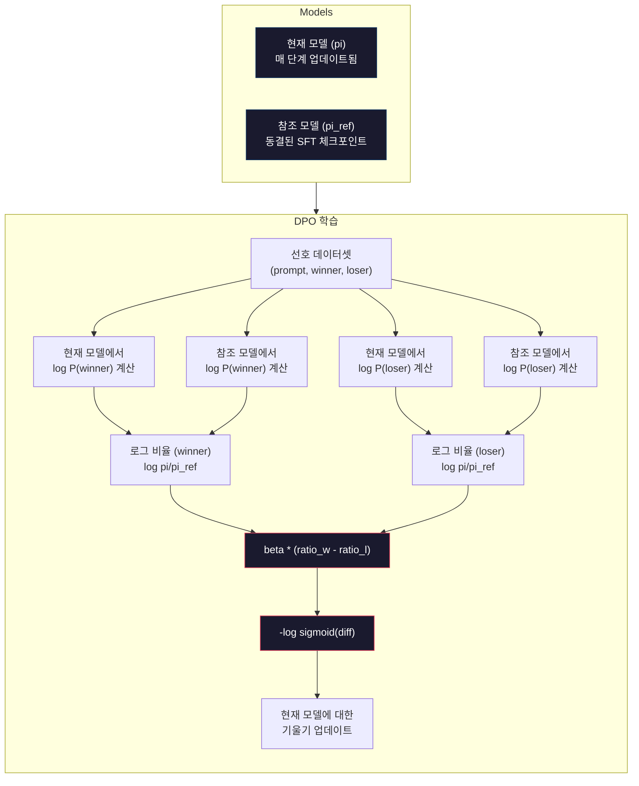

# DPO: 직접 선호 최적화(DPO: Direct Preference Optimization)

> RLHF는 작동합니다. 또한 세 개의 모델(SFT, 보상 모델, 정책)을 학습해야 하고, PPO의 불안정성을 관리하며, KL 페널티를 조정해야 합니다. DPO는 이렇게 묻습니다: 그 모든 과정을 건너뛸 수 있다면 어떨까요? DPO는 선호 쌍(preference pairs)에 대해 언어 모델을 직접 최적화합니다. 보상 모델이 필요 없습니다. PPO도 필요 없습니다. 하나의 학습 루프. 결과는 동일합니다.

**유형:** Build
**언어:** Python (numpy 포함)
**선수 요건:** 10단계, 07강 (RLHF)
**시간:** 약 90분

## 학습 목표

- 별도의 보상 모델 없이 선호 쌍(preference pairs)에 대해 언어 모델을 직접 최적화하는 DPO 학습을 구현해 보세요
- DPO 손실 함수를 유도하고, 정책(policy)의 로그 확률(log probabilities)을 통해 보상 모델을 암묵적으로 표현하는 방식을 설명해 보세요
- 학습 안정성, 연산 비용, 필요한 모델의 수 측면에서 DPO와 RLHF를 비교해 보세요
- beta 매개변수를 조정하여 학습된 정책이 참조 모델(reference model)로부터 얼마나 벗어날지 제어해 보세요

## 문제점

07강에서 RLHF 파이프라인을 구축했습니다. 세 단계. 세 개의 모델. SFT 모델, 보상 모델, 그리고 PPO로 최적화된 정책 모델. 보상 모델만으로도 수천 개의 인간 선호 쌍과 별도의 학습 루프가 필요했습니다. PPO는 KL 계수, 학습률, 클립 비율, 에포크 수를 세심하게 조정해야 했습니다.

실제로 PPO 학습은 악명 높게 불안정합니다. 작은 하이퍼파라미터 변경으로도 학습이 발산(diverge)합니다. 보상 모델은 인간 선호의 불완전한 대리(proxy)이며, 정책은 그 약점을 이용하려는 방법을 찾아냅니다. KL 페널티는 도움이 되지만 자체적인 조정이 필요합니다 -- 너무 낮으면 보상 해킹(reward hacking)이 발생하고, 너무 높으면 모델이 거의 학습되지 않습니다.

이러한 복잡성 때문에 대부분의 오픈소스 모델은 InstructGPT가 발표된 후 수년간 RLHF에 어려움을 겪었습니다. 세 단계 파이프라인은 취약합니다. 각 단계마다 고유한 실패 모드(failure modes)가 있으며, 오류가 누적됩니다.

2023년 5월, 스탠퍼드 대학의 Rafael Rafailov, Archit Sharma 및 동료들은 "Direct Preference Optimization: Your Language Model is Secretly a Reward Model"을 발표했습니다. 핵심 통찰은 다음과 같습니다: 별도의 보상 모델이 필요하지 않습니다. 최적의 보상 함수는 언어 모델 자체의 토큰 확률로 수학적으로 결정됩니다. 보상 모델을 완전히 생략하고 선호 쌍(preference pairs)에 대해 언어 모델을 직접 최적화할 수 있습니다.

DPO는 RLHF를 단일 지도 학습 단계로 줄입니다. 하나의 모델, 하나의 손실 함수, 하나의 학습 루프. 강화 학습은 없습니다. 대규모로 DPO를 사용한 최초의 모델 중 하나인 Zephyr-7B는 여러 벤치마크에서 완전한 RLHF로 학습된 모델과 동등하거나 더 나은 성능을 보였습니다. Meta는 Llama 3의 정렬 파이프라인의 일부로 DPO를 사용했습니다. Anthropic은 정렬 연구에서 DPO 방식의 방법을 인용했습니다.

## 개념

### 핵심 통찰

RLHF는 다음 목적 함수를 최적화합니다:

```
maximize: E[R(x, y)] - beta * KL(pi || pi_ref)
```

여기서 R은 보상 모델, pi는 정책(policy), pi_ref는 참조 모델, beta는 KL 계수입니다.

DPO 논문은 이 목적 함수가 폐형(closed-form) 최적해를 가진다는 것을 보여 주었습니다. 임의의 보상 함수 R에 대해 최적의 정책은 다음과 같습니다:

```
pi*(y | x) = pi_ref(y | x) * exp(R(x, y) / beta) / Z(x)
```

여기서 Z(x)는 정규화 상수입니다. 이를 재배열하면:

```
R(x, y) = beta * log(pi*(y | x) / pi_ref(y | x)) + beta * log Z(x)
```

이것이 돌파구입니다. 보상은 정책 모델의 확률과 참조 모델의 확률만으로 완전히 표현됩니다. 별도의 보상 모델을 훈련할 필요가 없습니다. 보상은 확률 비율에 *암묵적으로* 내재되어 있습니다.

이를 Bradley-Terry 선호 모델에 대입하면:

```
P(y_w > y_l | x) = sigmoid(R(x, y_w) - R(x, y_l))
                  = sigmoid(beta * (log pi(y_w|x)/pi_ref(y_w|x) - log pi(y_l|x)/pi_ref(y_l|x)))
```

Z(x) 항은 두 응답이 동일한 프롬프트 x에 조건을 걸기 때문에 상쇄됩니다. 남는 것은 선호된 응답과 거부된 응답에 대한 정책 모델의 로그 확률과 참조 모델의 로그 확률만의 함수입니다.

### DPO 손실

```
L_DPO = -log(sigmoid(beta * (log pi(y_w|x)/pi_ref(y_w|x) - log pi(y_l|x)/pi_ref(y_l|x))))
```

각 부분을 살펴보세요:

- **y_w** = 선호된(승리한) 응답
- **y_l** = 거부된(패한) 응답
- **x** = 프롬프트
- **pi** = 현재 모델(학습 중)
- **pi_ref** = 참조 모델(동결된 SFT 체크포인트)
- **beta** = 참조 모델로부터의 편차를 제어하는 온도 매개변수(일반적으로 0.1~0.5)

비율 `log pi(y|x) / pi_ref(y|x)`은 로그 확률 비율입니다. 이 비율이 양수일 경우, 현재 모델이 참조 모델보다 응답 y에 더 높은 확률을 부여합니다. 음수일 경우, 현재 모델이 더 낮은 확률을 부여합니다.

DPO 손실은 선호되는 응답에 대한 로그 확률 비율을 높이고, 거부된 응답에 대해서는 낮추도록 모델을 유도합니다. beta 매개변수는 모델이 참조 모델에서 얼마나 공격적으로 벗어날 수 있는지를 제어합니다. 작은 beta는 큰 편차를 허용하며, 큰 beta는 모델을 참조 모델에 가깝게 유지합니다.



### DPO가 더 단순한 이유

| 측면 | RLHF (PPO) | DPO |
|--------|-----------|-----|
| 학습할 모델 | 3개 (SFT + 보상 + 정책) | 1개 (정책만) |
| 학습 루프 | 3개 (SFT, RM 학습, PPO) | 2개 (SFT, DPO) |
| 하이퍼파라미터 | lr, KL 계수, 클리핑 비율, RM lr, 에포크 x3 | lr, beta, 에포크 |
| 보상 모델 | 필요 (별도 학습) | 모델 확률에 내재됨 |
| RL 알고리즘 | PPO (복잡하고 불안정) | 지도 학습 (안정적) |
| GPU 메모리 | PPO 동안 메모리에 3-4개 모델 | 2개 모델 (현재 + 참조) |
| 학습 안정성 | 하이퍼파라미터에 민감 | SFT와 유사하게 견고 |

DPO는 학습 중에 현재 모델과 동결된 참조 모델 두 개를 메모리에 필요로 합니다. RLHF는 정책, 참조 모델, 보상 모델, 그리고 선택적으로 가치 함수 기준선까지 세 개 또는 네 개가 필요합니다. 70B 모델의 경우, FP16에서 각 사본은 140GB를 차지합니다. 보상 모델을 제거함으로써 얻는 메모리 절감 효과는 상당합니다.

### DPO가 RLHF를 이기는 경우

**소규모 데이터셋.** 5,000~20,000개의 선호 쌍이 있을 때, DPO는 RLHF와 동등하거나 더 나은 성능을 보이는 경우가 많습니다. RLHF의 보상 모델은 일반화하기 위해 충분한 데이터가 필요합니다. 데이터가 제한되면 과적합되어 신뢰할 수 없는 보상 신호를 생성합니다. DPO는 보상 모델이 전혀 필요하지 않으므로 이 문제를 우회합니다.

**제한된 컴퓨팅 자원.** DPO는 전체 RLHF의 약 3분의 1 수준의 컴퓨팅 자원(훈련 루프가 3개가 아닌 1개)이 필요합니다. 대규모 GPU 클러스터가 없는 팀에게는 실용적인 선택입니다.

**빠른 반복.** 10개의 서로 다른 선호 데이터셋을 시도하여 어떤 것이 최상의 모델을 생성하는지 확인하고 싶으신가요? DPO를 사용하면 각 실험을 몇 시간 안에 실행할 수 있습니다. RLHF는 각 데이터셋마다 보상 모델을 다시 훈련해야 합니다.

### RLHF가 DPO를 이기는 경우

**대규모 훈련.** GPT-4나 Claude의 규모에서는 RLHF의 독립적인 보상 모델이 더 미묘한 선호 신호를 포착할 수 있습니다. 보상 모델은 복잡한 품질 기준에 적응하는 학습된 손실 함수 역할을 합니다.

**복잡한 보상 신호.** "더 좋음"이 여러 차원(유용성, 무해성, 정직성)을 포함할 때, 보상 모델은 이러한 다목적 트레이드오프를 학습할 수 있습니다. DPO는 각 선호 쌍을 이진 신호로 취급합니다. 하나는 더 좋고, 하나는 더 나쁘다는 것이지, 왜 그런지는 모델링하지 않습니다.

**반복적 정렬.** RLHF 파이프라인은 현재 정책으로 새로운 응답을 생성하고, 인간이 이를 평가하며, 보상 모델을 온라인 루프에서 재훈련할 수 있습니다. DPO는 고정된 선호 쌍 데이터셋에서 작동합니다. Constitutional AI(Anthropic의 접근 방식)는 RLHF의 이러한 반복적 특성을 광범위하게 활용합니다.

### DPO를 넘어: KTO, ORPO, SimPO

DPO는 단순화된 정렬 방법의 계열을 영감했습니다.

**KTO (Kahneman-Tversky Optimization, 2024):** 쌍이 필요하지조차 않습니다. KTO는 쌍이 아닌 피드백으로 작동합니다. 대안과 비교하지 않고 각 응답을 "좋음" 또는 "나쁨"으로만 라벨링하면 됩니다. 이는 데이터 수집을 극적으로 단순화합니다. 두 응답을 보여주고 "어떤 것이 더 좋은가요?"라고 묻는 대신, 하나의 응답을 보여주고 "이것이 좋은가요?"라고 묻습니다. 손실 함수는 프로스펙트 이론의 손실 회피를 적용합니다. 나쁜 응답은 좋은 응답이 보상되는 것보다 더 큰 페널티를 받습니다.

**ORPO (Odds Ratio Preference Optimization, 2024):** SFT와 정렬을 단일 학습 단계로 결합합니다. 먼저 SFT를 수행한 후 DPO를 적용하는 방식이 아니라, ORPO는 SFT 손실에 선호 신호를 포함하도록 수정합니다. 손실은 두 항으로 구성됩니다: 선호 응답에 대한 표준 다음 토큰 예측 손실, 그리고 선호 응답과 거부된 응답의 확률 간 격차를 증가시키는 오dds ratio 항. 두 개의 학습 루프 대신 하나의 학습 루프를 사용합니다.

**SimPO (Simple Preference Optimization, 2024):** 참조 모델을 완전히 제거합니다. 동결된 참조 모델에 대한 로그 확률 비율을 계산하는 대신, SimPO는 응답의 평균 로그 확률(길이로 정규화됨)을 암시적 보상(reward)으로 사용합니다. 이는 메모리를 절약하고(참조 모델이 필요 없음) 학습을 단순화합니다. 길이 정규화는 모델이 짧은 응답을 선호하는 것을 방지합니다.

| 방법 | 연도 | 메모리 내 모델 수 | 쌍 필요 여부? | 참조 모델 필요 여부? | 학습 루프 수 |
|--------|------|-----------------|-------------|-----------------|----------------|
| RLHF | 2022 | 3-4 | 예 (RM용) | 예 | 3 |
| DPO | 2023 | 2 | 예 | 예 | 2 |
| KTO | 2024 | 2 | 아니요 (비쌍) | 예 | 2 |
| ORPO | 2024 | 1 | 예 | 아니요 | 1 |
| SimPO | 2024 | 1 | 예 | 아니요 | 1 |

추세는 명확합니다: 각 방법은 하나의 복잡성을 더 제거합니다. RLHF는 보상 모델과 PPO가 필요했습니다. DPO는 둘 다 제거했습니다. KTO는 쌍 데이터(pair data)를 제거했습니다. ORPO는 별도의 SFT 단계를 제거했습니다. SimPO는 참조 모델을 제거했습니다. 정렬 비용(alignment tax) -- 기본 모델에서 정렬된 모델로 가는 데 드는 연산 및 복잡성 비용 --는 계속 감소하고 있습니다.

### 실제 DPO 배포 사례

**Zephyr-7B (HuggingFace, 2023년 10월):** Mistral 7B를 기본 모델로 사용, UltraChat(200K 예제)에서 SFT를 수행한 후 UltraFeedback(60K 선호 쌍)에서 DPO를 적용했습니다. MT-Bench에서 6.47점을 획득했으며, 당시 7B 모델 중 최고 점수였습니다. 비교를 위해, Llama 2 Chat 70B는 6.86점을 획득했으며, 이는 Zephyr가 DPO 정렬만 사용하여 크기가 10배인 모델의 6% 이내 성능을 달성했음을 의미합니다.

**Llama 3 (Meta, 2024년 4월):** 초기 RLHF 단계 이후 DPO를 사용했습니다. 이 조합은 DPO와 RLHF가 상호 보완적일 수 있음을 시사합니다 -- RLHF는 광범위한 정렬을 위해, DPO는 타겟팅된 정밀 보정을 위해.

**Neural Magic / nm-chat (2024):** 여러 오픈 소스 모델에 DPO를 적용하여, SFT 전용 기준선(baseline) 대비 정렬 벤치마크에서 일관되게 5-15%의 개선이 있음을 보여줍니다.

```figure
dpo-loss
```

## 구현하기

### 1단계: 선호 데이터셋

RLHF와 동일한 형식 -- (프롬프트, 선호 응답, 기각 응답) 삼중항. DPO는 중간 보상 모델 없이 이 데이터를 직접 소비합니다.

```python
import numpy as np
import sys
import os
sys.path.insert(0, os.path.join(os.path.dirname(__file__), "..", "..", "04-pre-training-mini-gpt", "code"))
from main import MiniGPT, LayerNorm, Embedding, TransformerBlock

PREFERENCE_DATA = [
    {
        "prompt": "What is the capital of France?",
        "preferred": "The capital of France is Paris.",
        "rejected": "France is a country in Europe. It has many cities. The capital is Paris. Paris is known for the Eiffel Tower.",
    },
    {
        "prompt": "Explain gravity in one sentence.",
        "preferred": "Gravity is the force that attracts objects with mass toward each other.",
        "rejected": "Gravity is something that makes things fall down when you drop them.",
    },
    {
        "prompt": "What is 15 times 7?",
        "preferred": "15 times 7 is 105.",
        "rejected": "Let me think about this. 15 times 7. Well, 10 times 7 is 70, and 5 times 7 is 35, so the answer might be around 105.",
    },
    {
        "prompt": "Name three programming languages.",
        "preferred": "Python, Rust, and TypeScript.",
        "rejected": "There are many programming languages. Some popular ones include various languages like Python and others.",
    },
    {
        "prompt": "What year did World War II end?",
        "preferred": "World War II ended in 1945.",
        "rejected": "World War II was a major global conflict. It involved many countries. The war ended in the mid-1940s, specifically in 1945.",
    },
    {
        "prompt": "Define machine learning.",
        "preferred": "Machine learning is a field where algorithms learn patterns from data to make predictions without being explicitly programmed.",
        "rejected": "Machine learning is a type of AI. AI stands for artificial intelligence. Machine learning uses data to learn.",
    },
]
```

### 2단계: 시퀀스 로그 확률

DPO 손실은 프롬프트가 주어졌을 때 응답의 총 로그 확률을 계산해야 합니다. 이는 전체 (프롬프트 + 응답) 시퀀스에 대해 모델을 실행하고 각 응답 토큰의 로그 확률을 합산하는 것을 의미합니다.

```python
def tokenize_sequence(text, vocab_size=256):
    return [min(t, vocab_size - 1) for t in list(text.encode("utf-8"))]


def compute_sequence_log_prob(model, prompt_tokens, response_tokens, max_seq_len=128):
    full_sequence = prompt_tokens + response_tokens
    if len(full_sequence) > max_seq_len:
        full_sequence = full_sequence[:max_seq_len]

    if len(full_sequence) < 2:
        return 0.0

    input_ids = np.array(full_sequence[:-1]).reshape(1, -1)
    target_ids = np.array(full_sequence[1:])

    logits = model.forward(input_ids)
    logits = logits[0]

    max_logits = logits.max(axis=-1, keepdims=True)
    log_probs = logits - max_logits - np.log(
        np.exp(logits - max_logits).sum(axis=-1, keepdims=True)
    )

    prompt_len = len(prompt_tokens)
    response_start = max(0, prompt_len - 1)
    response_end = len(target_ids)

    if response_start >= response_end:
        return 0.0

    response_log_probs = log_probs[response_start:response_end, :]
    response_targets = target_ids[response_start:response_end]

    total_log_prob = 0.0
    for i, target in enumerate(response_targets):
        total_log_prob += response_log_probs[i, target]

    return total_log_prob
```

이 함수는 DPO의 핵심 작업입니다. 각 선호 쌍에 대해 네 번 실행됩니다: 모델이 선호 응답에 대해, 모델이 기각 응답에 대해, 참조 모델이 선호 응답에 대해, 참조 모델이 기각 응답에 대해. 이는 RLHF의 생성 + 보상 점수 매기기 + 가치 추정 + PPO 업데이트와 비교하여 학습 예제당 4번의 순방향 전파입니다. 더 단순하고, 더 빠르며, 더 안정적입니다.

### 3단계: DPO 손실

논문 핵심을 코드로 구현합니다. 하나의 함수. 하나의 손실. 보상 모델 없음.

```python
def sigmoid(x):
    return np.where(
        x >= 0,
        1.0 / (1.0 + np.exp(-x)),
        np.exp(x) / (1.0 + np.exp(x))
    )


def dpo_loss(policy_logprob_preferred, policy_logprob_rejected,
             ref_logprob_preferred, ref_logprob_rejected, beta=0.1):
    preferred_ratio = policy_logprob_preferred - ref_logprob_preferred
    rejected_ratio = policy_logprob_rejected - ref_logprob_rejected

    logit = beta * (preferred_ratio - rejected_ratio)

    loss = -np.log(sigmoid(logit) + 1e-8)

    preferred_reward = beta * preferred_ratio
    rejected_reward = beta * rejected_ratio

    return loss, {
        "preferred_ratio": float(preferred_ratio),
        "rejected_ratio": float(rejected_ratio),
        "logit": float(logit),
        "implicit_preferred_reward": float(preferred_reward),
        "implicit_rejected_reward": float(rejected_reward),
        "reward_margin": float(preferred_reward - rejected_reward),
    }
```

`preferred_ratio`와 `rejected_ratio`는 DPO 유도에서 나온 로그 확률 비율입니다. 현재 모델이 참조 모델에 비해 선호 응답에 더 높은 확률을 부여하고 기각 응답에 더 낮은 확률을 부여할 때, 로짓은 양수이며 손실은 낮습니다. 학습 신호는 모델을 정확히 이 방향으로 밀어냅니다.

`implicit_preferred_reward`와 `implicit_rejected_reward`는 DPO 손실이 암묵적으로 부여하는 보상입니다. 학습이 잘 작동하는지 확인하기 위해 이를 추출할 수 있습니다 -- 선호 보상과 기각 보상 사이의 마진이 학습 동안 증가해야 합니다.

### 4단계: DPO 학습 루프

표준 지도 학습 루프입니다. PPO 없음. 보상 모델 없음. 순방향 전파와 기울기 업데이트만 수행합니다.

```python
def copy_model_weights(source, target):
    target.embedding.token_embed = source.embedding.token_embed.copy()
    target.embedding.pos_embed = source.embedding.pos_embed.copy()
    target.ln_f.gamma = source.ln_f.gamma.copy()
    target.ln_f.beta = source.ln_f.beta.copy()
    for s_block, t_block in zip(source.blocks, target.blocks):
        t_block.attn.W_q = s_block.attn.W_q.copy()
        t_block.attn.W_k = s_block.attn.W_k.copy()
        t_block.attn.W_v = s_block.attn.W_v.copy()
        t_block.attn.W_out = s_block.attn.W_out.copy()
        t_block.ffn.W1 = s_block.ffn.W1.copy()
        t_block.ffn.W2 = s_block.ffn.W2.copy()
        t_block.ffn.b1 = s_block.ffn.b1.copy()
        t_block.ffn.b2 = s_block.ffn.b2.copy()
        t_block.ln1.gamma = s_block.ln1.gamma.copy()
        t_block.ln1.beta = s_block.ln1.beta.copy()
        t_block.ln2.gamma = s_block.ln2.gamma.copy()
        t_block.ln2.beta = s_block.ln2.beta.copy()


def dpo_train(policy_model, reference_model, preference_data,
              num_epochs=5, lr=5e-6, beta=0.1, max_seq_len=128):
    print(f"DPO Training: {len(preference_data)} pairs, {num_epochs} epochs, "
          f"lr={lr}, beta={beta}")
    print()

    losses = []
    margins = []

    for epoch in range(num_epochs):
        epoch_loss = 0.0
        epoch_margin = 0.0
        num_examples = 0

        indices = np.random.permutation(len(preference_data))

        for idx in indices:
            pair = preference_data[idx]

            prompt_tokens = tokenize_sequence(pair["prompt"])
            preferred_tokens = tokenize_sequence(pair["preferred"])
            rejected_tokens = tokenize_sequence(pair["rejected"])

            pi_logprob_w = compute_sequence_log_prob(
                policy_model, prompt_tokens, preferred_tokens, max_seq_len
            )
            pi_logprob_l = compute_sequence_log_prob(
                policy_model, prompt_tokens, rejected_tokens, max_seq_len
            )
            ref_logprob_w = compute_sequence_log_prob(
                reference_model, prompt_tokens, preferred_tokens, max_seq_len
            )
            ref_logprob_l = compute_sequence_log_prob(
                reference_model, prompt_tokens, rejected_tokens, max_seq_len
            )

            loss, metrics = dpo_loss(
                pi_logprob_w, pi_logprob_l,
                ref_logprob_w, ref_logprob_l, beta
            )

            update_direction = 1.0 if metrics["logit"] < 0 else -0.1
            for block in policy_model.blocks:
                block.ffn.W1 += lr * update_direction * np.random.randn(*block.ffn.W1.shape) * 0.01
                block.ffn.W2 += lr * update_direction * np.random.randn(*block.ffn.W2.shape) * 0.01

            epoch_loss += loss
            epoch_margin += metrics["reward_margin"]
            num_examples += 1
            losses.append(float(loss))
            margins.append(metrics["reward_margin"])

        avg_loss = epoch_loss / max(num_examples, 1)
        avg_margin = epoch_margin / max(num_examples, 1)

        print(f"  Epoch {epoch + 1}/{num_epochs} | Loss: {avg_loss:.4f} | "
              f"Avg Margin: {avg_margin:.4f}")

    return policy_model, losses, margins
```

학습 루프는 RLHF와 비교하여 상쾌할 정도로 단순합니다. 각 선호 쌍에 대해: 네 개의 로그 확률을 계산하고 (두 모델, 두 응답), DPO 손실에 대입하고, 기울기를 계산하고, 정책을 업데이트합니다. 생성 단계 없음. 보상 모델 추론 없음. 이점 추정 없음. 클리핑 없음.

### 5단계: DPO와 RLHF 비교

암묵적 보상 마진과 로그 확률 변화를 측정하여 DPO를 07강의 RLHF 모델과 비교합니다.

```python
def evaluate_preference_accuracy(model, reference_model, preference_data, beta=0.1, max_seq_len=128):
    correct = 0
    total = 0

    for pair in preference_data:
        prompt_tokens = tokenize_sequence(pair["prompt"])
        preferred_tokens = tokenize_sequence(pair["preferred"])
        rejected_tokens = tokenize_sequence(pair["rejected"])

        pi_w = compute_sequence_log_prob(model, prompt_tokens, preferred_tokens, max_seq_len)
        pi_l = compute_sequence_log_prob(model, prompt_tokens, rejected_tokens, max_seq_len)
        ref_w = compute_sequence_log_prob(reference_model, prompt_tokens, preferred_tokens, max_seq_len)
        ref_l = compute_sequence_log_prob(reference_model, prompt_tokens, rejected_tokens, max_seq_len)

        preferred_reward = beta * (pi_w - ref_w)
        rejected_reward = beta * (pi_l - ref_l)

        if preferred_reward > rejected_reward:
            correct += 1
        total += 1

    return correct / max(total, 1)


def analyze_implicit_rewards(model, reference_model, preference_data, beta=0.1, max_seq_len=128):
    print("Implicit Reward Analysis:")
    print("-" * 65)
    print(f"  {'Prompt':<30} {'Pref Reward':>12} {'Rej Reward':>12} {'Margin':>10}")
    print("  " + "-" * 60)

    for pair in preference_data:
        prompt_tokens = tokenize_sequence(pair["prompt"])
        preferred_tokens = tokenize_sequence(pair["preferred"])
        rejected_tokens = tokenize_sequence(pair["rejected"])

        pi_w = compute_sequence_log_prob(model, prompt_tokens, preferred_tokens, max_seq_len)
        pi_l = compute_sequence_log_prob(model, prompt_tokens, rejected_tokens, max_seq_len)
        ref_w = compute_sequence_log_prob(reference_model, prompt_tokens, preferred_tokens, max_seq_len)
        ref_l = compute_sequence_log_prob(reference_model, prompt_tokens, rejected_tokens, max_seq_len)

        pref_reward = beta * (pi_w - ref_w)
        rej_reward = beta * (pi_l - ref_l)
        margin = pref_reward - rej_reward

        truncated = pair["prompt"][:28] + ".." if len(pair["prompt"]) > 30 else pair["prompt"]
        print(f"  {truncated:<30} {pref_reward:>12.4f} {rej_reward:>12.4f} {margin:>10.4f}")

    print()
```

### 6단계: Beta 민감도 분석

beta 매개변수는 RLHF의 KL 계수에 해당하는 DPO의 값입니다. 모델이 참조 모델(reference)로부터 얼마나 벗어날 수 있는지를 제어합니다. 이 실험은 그 효과를 보여줍니다.

```python
def beta_sensitivity_analysis(sft_model, preference_data, betas, max_seq_len=128):
    print("Beta Sensitivity Analysis")
    print("-" * 60)
    print(f"  {'Beta':>8} {'Final Loss':>12} {'Final Margin':>14} {'Accuracy':>10}")
    print("  " + "-" * 55)

    results = []

    for beta in betas:
        policy = MiniGPT(
            vocab_size=256, embed_dim=128, num_heads=4,
            num_layers=4, max_seq_len=max_seq_len, ff_dim=512
        )
        reference = MiniGPT(
            vocab_size=256, embed_dim=128, num_heads=4,
            num_layers=4, max_seq_len=max_seq_len, ff_dim=512
        )
        copy_model_weights(sft_model, policy)
        copy_model_weights(sft_model, reference)

        policy, losses, margins_list = dpo_train(
            policy, reference, preference_data,
            num_epochs=3, lr=5e-6, beta=beta, max_seq_len=max_seq_len
        )

        accuracy = evaluate_preference_accuracy(
            policy, reference, preference_data, beta, max_seq_len
        )

        final_loss = losses[-1] if losses else 0
        final_margin = margins_list[-1] if margins_list else 0

        print(f"  {beta:>8.3f} {final_loss:>12.4f} {final_margin:>14.4f} {accuracy:>10.1%}")
        results.append({
            "beta": beta,
            "final_loss": final_loss,
            "final_margin": final_margin,
            "accuracy": accuracy,
        })

        print()

    return results
```

작은 beta (0.01)는 모델이 참조 모델로부터 자유롭게 벗어날 수 있게 합니다 -- 학습은 빠르지만 퇴화(degenerate)된 솔루션의 위험이 있습니다. 큰 beta (1.0)는 모델을 참조 모델에 가깝게 유지합니다 -- 안정적이지만 학습이 느립니다. 대부분의 애플리케이션에 대한 최적의 값은 0.1에서 0.3 사이입니다.

## 사용하기

### 전체 DPO 파이프라인 데모

```python
if __name__ == "__main__":
    np.random.seed(42)

    print("=" * 70)
    print("DPO: DIRECT PREFERENCE OPTIMIZATION")
    print("=" * 70)
    print()

    print("STEP 1: Initialize SFT Model (from 06강)")
    print("-" * 50)
    sft_model = MiniGPT(
        vocab_size=256, embed_dim=128, num_heads=4,
        num_layers=4, max_seq_len=128, ff_dim=512
    )
    print(f"  Parameters: {sft_model.count_parameters():,}")
    print()

    print("STEP 2: DPO Training")
    print("-" * 50)

    policy_model = MiniGPT(
        vocab_size=256, embed_dim=128, num_heads=4,
        num_layers=4, max_seq_len=128, ff_dim=512
    )
    reference_model = MiniGPT(
        vocab_size=256, embed_dim=128, num_heads=4,
        num_layers=4, max_seq_len=128, ff_dim=512
    )
    copy_model_weights(sft_model, policy_model)
    copy_model_weights(sft_model, reference_model)

    policy_model, losses, margins = dpo_train(
        policy_model, reference_model, PREFERENCE_DATA,
        num_epochs=5, lr=5e-6, beta=0.1
    )
    print()

    print("=" * 70)
    print("STEP 3: Evaluate")
    print("=" * 70)
    print()

    pre_accuracy = evaluate_preference_accuracy(
        sft_model, reference_model, PREFERENCE_DATA, beta=0.1
    )
    post_accuracy = evaluate_preference_accuracy(
        policy_model, reference_model, PREFERENCE_DATA, beta=0.1
    )

    print(f"  Preference accuracy (pre-DPO):  {pre_accuracy:.1%}")
    print(f"  Preference accuracy (post-DPO): {post_accuracy:.1%}")
    print()

    analyze_implicit_rewards(policy_model, reference_model, PREFERENCE_DATA, beta=0.1)

    print("=" * 70)
    print("STEP 4: Training Dynamics")
    print("=" * 70)
    print()

    if losses:
        print("  Loss curve:")
        window = max(1, len(losses) // 5)
        for i in range(0, len(losses), window):
            chunk = losses[i:i + window]
            avg = sum(chunk) / len(chunk)
            print(f"    Steps {i:3d}-{i + len(chunk) - 1:3d}: loss = {avg:.4f}")
        print()

    if margins:
        print("  Reward margin curve:")
        window = max(1, len(margins) // 5)
        for i in range(0, len(margins), window):
            chunk = margins[i:i + window]
            avg = sum(chunk) / len(chunk)
            print(f"    Steps {i:3d}-{i + len(chunk) - 1:3d}: margin = {avg:.4f}")
        print()

    print("=" * 70)
    print("STEP 5: Beta Sensitivity")
    print("=" * 70)
    print()

    beta_results = beta_sensitivity_analysis(
        sft_model, PREFERENCE_DATA, betas=[0.01, 0.1, 0.3, 1.0]
    )

    print("=" * 70)
    print("DPO vs RLHF COMPARISON")
    print("=" * 70)
    print()
    print("  DPO advantages:")
    print("    - 1 training loop (vs 3 for RLHF)")
    print("    - 2 models in memory (vs 3-4 for RLHF)")
    print("    - Supervised learning (vs RL, more stable)")
    print("    - No reward model to train or maintain")
    print()
    print("  RLHF advantages:")
    print("    - Separate reward model captures complex preferences")
    print("    - Online learning: generate, rate, retrain")
    print("    - Better for multi-objective alignment")
    print("    - Proven at largest scales (GPT-4, Claude)")
    print()
    print("  Practical guidance:")
    print("    - Start with DPO. It's simpler and often sufficient.")
    print("    - Switch to RLHF if DPO plateaus on your eval metrics.")
    print("    - Many production systems use both: RLHF first, DPO to refine.")
```

## 출시하기

이 강의는 `outputs/prompt-alignment-method-selector.md`를 생성합니다 -- 사용 사례에 적합한 정렬(alignment) 방법(SFT, RLHF, DPO, KTO, ORPO, SimPO)을 선택하는 데 도움이 되는 프롬프트입니다. 데이터 가용성, 컴퓨팅 예산, 정렬 목표에 따라 방법과 학습 계획을 추천합니다.

## 연습 문제

1. KTO (Kahneman-Tversky Optimization)를 구현하세요. KTO는 쌍(pair)이 필요하지 않습니다 -- 각 응답을 "good" 또는 "bad"로만 레이블링하세요. 좋은 응답에 대한 손실은 `-log(sigmoid(beta * log_ratio))`이고, 나쁜 응답에 대한 손실은 `-log(1 - sigmoid(beta * log_ratio))`이며, 나쁜 응답 손실에 손실 회피(loss aversion) 배수(일반적으로 1.5배)를 적용합니다. 동일한 데이터로 학습하세요 (선호된 응답을 "good", 거부된 응답을 "bad"로 독립적으로 취급)하고 DPO와 정확도를 비교하세요.

2. 길이 정규화된(length-normalized) DPO를 구현하세요. 원시 로그 확률(raw log-probabilities) 대신 응답 토큰 수로 나누세요: `normalized_logprob = total_logprob / num_tokens`. 이는 모델이 더 짧은 응답(총 로그 확률이 더 높음)을 선호하는 것을 방지합니다. 정규화 여부에 따른 암시적 보상(margin)을 비교하세요.

3. ORPO 스타일의 결합 손실을 구축하세요. 선호된 응답에 대한 표준 다음 토큰 예측 손실을 DPO 손실에 더하세요: `L = L_sft(preferred) + alpha * L_dpo`. alpha 값을 0.1, 0.5, 1.0으로 시도해 보세요. 결합 손실은 지시문을 따르는(SFT 항에서) 동시에 더 나은 응답을 선호하는(DPO 항에서) 모델을 생성해야 하며, 별도의 SFT 단계가 필요하지 않게 됩니다.

4. 반복적(iterative) DPO를 구현하세요. DPO를 3 에포크(epoch) 동안 실행한 후, 학습된 모델에서 새로운 응답을 생성하고, 이를 원본 선호 응답과 쌍을 이루어 새로운 선호 쌍으로 만든 후 DPO를 다시 실행하세요. 이 "자기 대국(self-play)" 과정을 2라운드 진행하세요. 1라운드와 2라운드 이후의 선호 정확도를 비교하여 반복적 정제가 도움이 되는지 확인하세요.

5. DPO를 다양한 참조 모델과 비교해 보세요. SFT 체크포인트를 참조로 사용하는 대신, (a) 기본 모델(SFT 이전), (b) DPO의 1에포크 체크포인트, (c) 정책 모델의 지수 이동 평균을 시도해 보세요. 어떤 참조 모델이 가장 높은 선호 정확도와 가장 안정적인 학습 곡선을 생성하는지 보고하세요.

## 핵심 용어

| 용어 | 사람들이 말하는 것 | 실제 의미 |
|------|----------------|----------------------|
| DPO | "RL 없이 하는 RLHF" | 직접 선호 최적화(DPO (Direct Preference Optimization)): 보상 모델과 PPO를 거치지 않고 선호 쌍에 대해 언어 모델을 직접 최적화하는 지도 학습 알고리즘 |
| 암시적 보상 | "보상은 모델 안에 있다" | 보상 함수는 정책 모델과 참조 모델 간의 로그 확률 비율로 결정됩니다 -- 별도의 보상 모델이 필요하지 않습니다 |
| Beta (DPO) | "온도" | 정책 모델이 참조 모델에서 얼마나 벗어날 수 있는지 제어합니다 -- 작은 beta는 큰 편차를 허용하고, 큰 beta는 모델을 참조 모델에 가깝게 유지합니다 |
| 로그 확률 비율 | "모델이 얼마나 변했는지" | log pi(y\|x) - log pi_ref(y\|x) -- 양수 값은 현재 모델이 참조 모델보다 더 높은 확률을 할당한다는 의미입니다 |
| 참조 모델 | "동결된 체크포인트" | 가중치가 절대 변하지 않는 SFT 모델의 복사본 -- 확률 비율 계산의 앵커로 사용됩니다 |
| KTO | "쌍이 없는 DPO" | Kahneman-Tversky Optimization: 선호 쌍을 요구하는 대신 쌍이 없는 "좋음" 또는 "나쁨" 레이블로 작동합니다 |
| ORPO | "단일 단계 정렬" | Odds Ratio Preference Optimization: SFT 손실에 선호 항을 추가하여 SFT와 정렬을 단일 학습 루프로 결합합니다 |
| SimPO | "참조 모델이 필요 없음" | Simple Preference Optimization: 길이 정규화된 평균 로그 확률을 암시적 보상으로 사용하여 참조 모델을 제거합니다 |
| 정렬 비용 | "모델을 안전하게 만드는 비용" | 기본 모델에서 정렬된 모델로 가기 위해 필요한 추가적인 컴퓨팅, 데이터 및 복잡성 -- DPO는 이를 크게 줄입니다 |

## 추가 읽기

- [Rafailov et al., 2023 -- "Direct Preference Optimization: Your Language Model is Secretly a Reward Model"](https://arxiv.org/abs/2305.18290) -- RLHF에서 정렬을 지도 학습으로 단순화한 DPO 논문
- [Tunstall et al., 2023 -- "Zephyr: Direct Distillation of LM Alignment"](https://arxiv.org/abs/2310.16944) -- Zephyr-7B, UltraFeedback에서의 DPO가 벤치마크에서 RLHF와 일치함을 보여줍니다
- [Ethayarajh et al., 2024 -- "KTO: Model Alignment as Prospect Theoretic Optimization"](https://arxiv.org/abs/2402.01306) -- 쌍 선호가 필요하지 않게 됩니다
- [Hong et al., 2024 -- "ORPO: Monolithic Preference Optimization without Reference Model"](https://arxiv.org/abs/2403.07691) -- SFT와 정렬을 한 단계로 결합합니다
- [Meng et al., 2024 -- "SimPO: Simple Preference Optimization with a Reference-Free Reward"](https://arxiv.org/abs/2405.14734) -- 참조 모델을 완전히 제거합니다
- [Llama 3 Technical Report](https://arxiv.org/abs/2407.21783) -- RLHF와 DPO를 결합한 Meta의 정렬 파이프라인
