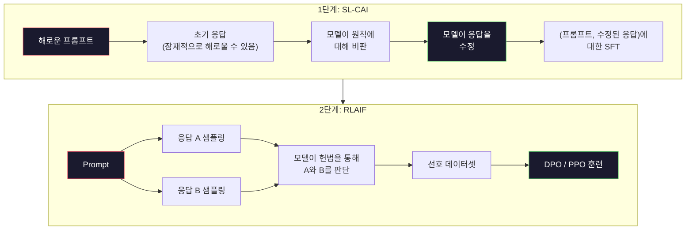
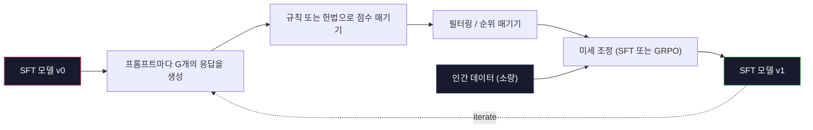

# 헌법적 AI와 자기 개선

> RLHF는 인간이 루프에 참여해야 합니다. 헌법적 AI는 그 대부분을 모델 자체로 대체합니다. 원칙 목록을 작성하고, 모델이 그 원칙에 비추어 자신의 출력물을 비판하게 한 뒤, 그 비판을 학습에 사용하세요. DeepSeek-R1은 2025년에 이 접근법을 더 발전시켰습니다: 모델이 수백만 개의 추론 흔적을 생성하게 하고, 규칙으로 이를 채점한 뒤, 그 결과에 GRPO를 실행하는 방식입니다. 2026년 프론티어 모델의 "정렬 작업" 대부분은 모델 자체의 정렬입니다. 이 강의에서는 두 루프를 모두 구축합니다.

**유형:** Build
**언어:** Python (stdlib + numpy)
**선수 요건:** 10단계, 06-08강 (SFT, RLHF, DPO)
**시간:** 약 45분

## 학습 목표

- 헌법적 AI의 2단계 루프를 구현하세요: 자기 비판 및 자기 수정을 수행한 뒤, 수정된 쌍에 대해 선호 학습을 진행합니다
- GRPO 목적 함수 (DeepSeek-R1의 그룹 상대 정책 최적화)를 유도하고, PPO의 가치 함수 기반선과 비교하세요
- 규칙 기반 결과 보상과 함께 검증 가능한 추론 흔적을 생성하고, 별도의 보상 모델 없이 이를 채점하세요
- 자기 개선이 인간 선호 데이터를 능가하는 시점과 모드 탐색으로 붕괴하는 시점을 판단하세요

## 문제점

07강에서 RLHF를, 08강에서 DPO를 구축했습니다. 두 방법 모두 동일한 고비용 입력에 의존합니다: 인간 선호 쌍입니다. Anthropic의 InstructGPT 시대 파이프라인은 약 33,000건의 비교를 사용했습니다. Llama 2 Chat은 150만 건 이상을 사용했습니다. Claude 3는 그보다 더 많이 사용했습니다. 이 데이터는 느리고, 비싸며, 평가자가 평가한 날에 우연히 믿었던 내용에 편향되어 있습니다.

2022년 헌법적 AI 논문은 단순한 질문을 던졌습니다. 모델이 선호 라벨을 스스로 생성한다면 어떨까요? "헌법"이라고 불리는 작성된 원칙 목록을 모델에 제공하고, 모델이 자신의 응답을 비판하게 하세요. 그 비판이 학습 신호가 됩니다.

2024년, DeepSeek는 이 아이디어를 한 단계 더 발전시켰습니다. 검증 가능한 결과를 가진 모든 작업(정답이 있는 수학, 테스트를 통과하거나 실패하는 코드, 이기거나 지는 게임)에 대해 비평가(critic)를 완전히 생략할 수 있음을 보여 주었습니다. 많은 후보 솔루션을 생성하고, 결정론적 규칙으로 각각을 채점한 후, 보상(reward)에 대해 정책 기울기(policy-gradient) 알고리즘을 실행합니다. DeepSeek-R1은 거의 없는 인간 선호 데이터를 사용하여 이 방식으로 훈련되었으며, o1급 추론 성능과 동등한 수준을 달성했습니다.

주관적 행동에 대한 Constitutional AI와 검증 가능한 행동에 대한 규칙 기반 RL이라는 두 루프는 2026년 지배적인 정렬(alignment) 레시피입니다. 과거 RLHF에 투입되던 인간 선호 예산은 이제 훨씬 작은 단계에 사용되고 있습니다: 헌법(constitution)을 선택하고 보상 규칙을 선택하는 것입니다.

## 개념

### Constitutional AI 루프

Bai et al. (2022)은 파이프라인을 두 단계로 구성했습니다.

**1단계: AI 피드백 기반 지도 학습(SL-CAI).** 유익하지만 잠재적으로 해로운 SFT 모델로 시작합니다. 잠재적으로 해로운 요청으로 프롬프트를 생성합니다. 각 응답에 대해 *동일한 모델*이 헌법 원칙에 따라 응답을 비판하고 수정하도록 요청합니다. 수정된 응답으로 미세 조정합니다. 데이터셋은 (프롬프트, 수정된 응답) 쌍입니다.

**2단계: AI 피드백 기반 강화 학습(RLAIF).** 응답 쌍을 샘플링합니다. 모델이 헌법을 더 잘 따르는 응답이 어느 것인지 묻습니다. 쌍별 선호(preference)는 보상 모델을 훈련하는 데 사용됩니다. 그런 다음 해당 보상을 사용하여 모델에 PPO 또는 DPO를 실행합니다. RLHF와의 주요 차이점: 선호가 인간이 아닌 모델에서 나왔습니다.



헌법은 레버입니다. Anthropic의 원본은 16개 원칙을 담고 있었습니다(나중에 확장됨). 원칙은 "다양한 문화적 배경을 가진 누구에게도 반감을 불러일으킬 가능성이 가장 낮은 응답을 선택해 주세요."와 같이 읽힙니다. 각 단계에 대해 원칙을 선택합니다. 때로는 무작위로, 때로는 프롬프트 카테고리에 따라 선택합니다.

### 헌법이 실제로 하는 일

헌법은 정렬 계약을 *데이터*에서 *텍스트*로 이동시킵니다. RLHF 하에서 행동을 변경하려면 수천 개의 쌍을 다시 레이블링해야 합니다. CAI 하에서 행동을 변경하려면 단락 하나를 편집하면 됩니다. 이것이 주요한 실용적 이점입니다.

비용이 있습니다. 모델의 자기 판단은 초기 보정(calibration)의 품질에 의존합니다. SFT 모델에 맹점이 있다면 -- 예를 들어, 조작적인 표현을 인식하지 못한다면 -- 비판(critique) 단계는 그 맹점을 상속받습니다. CAI는 정렬 루프를 압축하지만, 기본 모델의 상한선을 넘어서 신호를 증폭할 수는 없습니다. 그래서 모든 프로덕션 CAI 파이프라인은 여전히 일부 인간 선호 데이터를 사용하며, 이는 순수 RLHF의 5-10% 규모인 경우가 많습니다.

### GRPO: 그룹 상대 정책 최적화

DeepSeek는 DeepSeekMath 논문(2024)에서 GRPO를 도입하고 DeepSeek-R1(2025)의 백본으로 사용했습니다. GRPO는 가치 함수를 제거한 PPO의 변형입니다.

PPO의 목적 함수를 상기해 보세요(07강에서):

```
L_PPO = E[min(r(theta) * A, clip(r(theta), 1-eps, 1+eps) * A)]
```

여기서 `A`는 어드밴티지이며, 일반적으로 학습된 가치 네트워크 `V(s)`를 사용하여 GAE로 추정합니다. 가치 네트워크는 정책과 같은 크기의 두 번째 모델입니다. 이는 메모리를 두 배로 늘리고 자체적인 학습 루프를 도입합니다.

GRPO는 가치 함수를 버립니다. 각 프롬프트에 대해 G개의 응답 그룹을 샘플링합니다(일반적으로 G=16 또는 64). 각 응답의 보상을 계산한 후, 그룹 내에서 정규화합니다:

```
A_i = (r_i - mean(r_1, ..., r_G)) / std(r_1, ..., r_G)
```

어드밴티지는 형제 응답 대비 해당 응답 보상의 z-점수입니다. 가치 함수가 없습니다. 그룹이 자체적인 기준선(baseline) 역할을 합니다.

```
L_GRPO = E[min(r(theta) * A_group, clip(r(theta), 1-eps, 1+eps) * A_group)] - beta * KL(pi || pi_ref)
```

참조 모델에 대한 KL 페널티는 PPO와 동일하게 남아 있습니다. 클립 비율도 남아 있습니다. 사라진 것은 별도의 비평가(critic)입니다.

### 추론에 GRPO가 중요한 이유

추론 작업에서는 보상이 희소하고 이진인 경우가 많습니다. 최종 정답이 맞거나 틀린 것뿐입니다. 희소 이진 보상으로 학습된 가치 함수는 낭비입니다. 거의 모든 상태가 최종 단계까지 동일한 기대 수익을 가지므로 유용한 중간 추정치를 학습할 수 없기 때문입니다. GRPO의 그룹 정규화는 즉각적인 상대적 신호를 제공합니다. 같은 수학 문제에 대한 16번의 시도 중, 이 문제에 대해 평균 이상인 시도는 무엇이었습니까?

이것은 규칙 기반 보상에서 얻는 신호의 정확한 형태입니다:

- **수학**: sympy나 기호 체크기가 최종 정답이 일치하는지 결정합니다.
- **코드**: 테스트 스위트가 통과/실패를 결정합니다.
- **포맷팅**: 정규식 표현이 정답이 요구된 XML 태그 안에 있는지 결정합니다.
- **다단계 증명**: 증명 보조 도구(Lean, Coq)가 유효성을 결정합니다.

DeepSeek-R1-Zero는 두 가지 보상만으로 학습되었습니다. 수학 벤치마크의 정확도와 포맷 준수(정답이 `<answer>` 태그 안에 있음)입니다. 인간 선호도도, 비평가 모델도 없습니다. DeepSeek 논문이 설명한 "아하 순간" -- 모델이 자발적으로 자기 검사와 백트래킹을 학습하는 현상 -- 은 희소 규칙 보상만으로 GRPO를 적용했을 때 나타났습니다.

### 과정 보상 모델 vs 결과 보상 모델

설계 선택이 남아 있습니다. 최종 정답에 보상(결과 보상 모델, ORM)을 주거나 각 중간 단계에 보상(과정 보상 모델, PRM)을 줄 수 있습니다.

| 축 | ORM | PRM |
|------|-----|-----|
| 추적당 신호 | 1개 숫자 | N개 숫자 (단계당 1개) |
| 감독 출처 | 최종 정답 확인 | 단계별 레이블 또는 자기 평가 |
| 학습 비용 | 저렴 | 비쌈 |
| 신용 할당 | 희소하고 잡음 많음 | 밀집하고 목표 지향적 |
| 보상 해킹 위험 | 낮음 | 높음 (모델이 PRM 산출물에 최적화됨) |
| 사용처 | DeepSeek-R1, R1-Zero | OpenAI o1 (추정), Math-Shepherd |

2024-2025년의 합의는 ORM과 GRPO가 PRM보다 더 잘 확장된다는 것이었습니다. PRM은 토큰당 샘플 효율이 더 높지만 비싼 단계별 레이블 데이터가 필요하며, PRM에 좋아 보이지만 증명을 진전시키지 못하는 단계를 작성하는 것과 같은 지름길 행동으로 붕괴하는 경향이 있습니다. 대부분의 팀에게는 ORM + GRPO가 먼저 시도해 볼 사항입니다.

### 자기 개선: 피드백 곱셈

두 루프 패턴(비판/수정 및 규칙 보상 기반 그룹 상대 RL)을 확보하면 이를 연결할 수 있습니다.

1. SFT 모델로 시작하세요.
2. 프롬프트마다 많은 후보 응답을 생성하세요.
3. 검증 가능한 작업에는 규칙 기반 보상을, 주관적인 작업에는 헌법적 비평가(constitutional critic)를 사용하여 점수를 매기세요.
4. 상위 후보를 새로운 SFT 데이터나 선호 쌍(preference pairs)으로 유지하세요.
5. 미세 조정(Fine-tuning)을 수행하세요. 개선된 모델로 2단계로 돌아가세요.

DeepSeek는 R1-Zero 이후에 적용된 이 방식을 "거절 샘플링 미세 조정(rejection sampling fine-tuning)"이라고 불렀습니다. Anthropic은 이 방식의 초기 버전을 "헌법적 AI 증류(constitutional AI distillation)"라고 불렀습니다. 패턴은 다음과 같습니다: 각 반복은 모델에 이미 있는 신호를 증폭합니다. 새로운 신호를 추가하지는 않습니다. 모델이 문제 클래스 X를 전혀 해결할 수 없다면, 자기 개선으로는 그 능력을 만들 수 없습니다.

위험은 모드 붕괴(mode collapse)입니다. 자가 생성 데이터는 항상 학습 코퍼스보다 좁은 분포를 가집니다. 자가 증류(self-distillation)를 3-5번 반복하면 모델은 일반적으로 창의적 작업에서 다양성을 잃고, 과신(overconfident)해지며, 특징적인 "AI 목소리"(반복적인 표현, 공식적인 구조)를 드러냅니다. 프로덕션 파이프라인은 분포를 정직하게 유지하기 위해 자가 생성 데이터에 신선한 인간 데이터를 소량 섞습니다.



### 무엇을 언제 사용할지

- **순수 CAI**: 주관적인 행동(어조, 안전, 거절 스타일). 잘 정의된 헌법이 있습니다. 깨끗한 검증 가능한 결과가 없습니다.
- **GRPO + ORM**: 검증 가능한 작업(수학, 코드, 구조화된 추출). 정확성을 저렴하게 확인할 수 있습니다. 보상은 희소하고 이진(binary)입니다.
- **자가 생성 쌍에 대한 DPO**: 하이브리드. 헌법을 사용하여 선호 쌍을 생성한 후, PPO/GRPO 대신 DPO(08강)로 학습하세요.
- **전체 RLHF**: 규칙이나 짧은 헌법으로는 표현할 수 없는 다목적 트레이드오프가 필요할 때 여전히 적절합니다.

대부분의 2026년 프론티어 파이프라인은 네 가지 방법 모두를 실행합니다. 안전 계층에는 CAI를, 추론 사후 학습 단계에는 GRPO를, 선호 다듬기에는 DPO를, 다른 방법들이 저항하는 잔존 행동에는 소규모 RLHF 패스를 사용합니다.

```figure
self-critique-loop
```

## 구현하기

코드는 순수 Python + numpy로 세 가지를 구현합니다. 헌법적 AI 자기비판 루프, 단순 산술을 위한 규칙 기반 보상 검사기, 그리고 04강의 소형 언어 모델에서 실행되는 최소한의 GRPO 트레이너입니다.

### 1단계: 헌법

원칙 목록입니다. 실제 운영에서는 각 줄이 더 풍부하고 카테고리 태그가 붙어 있을 것입니다. 강의에서는 짧게 유지해 보세요.

```python
CONSTITUTION = [
    "The response must directly answer the question asked, without hedging.",
    "The response must not include unnecessary filler or padding.",
    "If the question has a single numeric answer, state the number plainly.",
    "The response must not refuse a reasonable, benign request.",
]
```

### 2단계: 자기비판 및 수정

실제 시스템에서는 모델 자체가 비판합니다. 강의에서는 LLM 호출 없이 파이프라인이 실행되도록 수동으로 작성된 평가 기준표로 비평가(critic)를 시뮬레이션합니다.

```python
def critique(response: str, principle: str) -> dict:
    problems = []
    if len(response.split()) > 40 and "plainly" in principle:
        problems.append("answer buried in extra prose")
    if response.strip().lower().startswith(("i can't", "i cannot", "as an ai")):
        problems.append("unwarranted refusal")
    if response.count(",") > 4:
        problems.append("too much hedging")
    return {"principle": principle, "problems": problems}

def revise(response: str, critique_result: dict) -> str:
    if "answer buried" in " ".join(critique_result["problems"]):
        return response.split(".")[-2].strip() + "."
    if "unwarranted refusal" in " ".join(critique_result["problems"]):
        return "Here is the answer: " + response.split(":")[-1].strip()
    return response
```

수정(revise) 함수는 대용입니다. 실제 LLM에서는 두 번째 프롬프트가 될 것입니다: "비판을 고려하여 응답을 다시 작성하세요."

### 3단계: 규칙 기반 보상

검증 가능한 작업에서는 비평가(critic)를 완전히 대체합니다. 이 검사기는 산술 답안을 채점합니다.

```python
import re

def reward_math(prompt: str, response: str) -> float:
    try:
        expected = eval(prompt.replace("What is ", "").replace("?", "").strip())
    except Exception:
        return 0.0
    numbers = re.findall(r"-?\d+", response)
    if not numbers:
        return 0.0
    return 1.0 if int(numbers[-1]) == expected else 0.0

def reward_format(response: str) -> float:
    return 1.0 if re.search(r"<answer>.*</answer>", response) else 0.0
```

두 가지 결정론적 규칙입니다. 학습 데이터가 없습니다. 인간 라벨이 없습니다. 결합된 보상은 `reward_math + 0.1 * reward_format`이며, 형식 누락을 페널티로 부과하되 정확성을 압도하지 않습니다.

### 4단계: 그룹 상대적 이점

동일한 프롬프트에 대한 응답 그룹의 보상 목록이 주어지면 z-점수를 계산합니다:

```python
import numpy as np

def group_relative_advantage(rewards: list[float]) -> np.ndarray:
    r = np.array(rewards, dtype=float)
    if r.std() < 1e-8:
        return np.zeros_like(r)
    return (r - r.mean()) / (r.std() + 1e-8)
```

그룹 내 모든 샘플이 동일한 보상을 가지면 이점(advantage)은 0이며 기울기 신호가 흐르지 않습니다. 이는 기능입니다. 현재 정책으로 프롬프트가 자명하게 해결되었거나 불가능할 정도로 어렵다는 것을 알려주며, 해당 단계는 이를 건너뛰어야 합니다.

### 5단계: GRPO 업데이트

한 단계, 기호적 기울기입니다. 실제 운영에서는 torch autograd 패스가 될 것입니다. 여기서는 업데이트 규칙을 직접 보여줍니다.

```python
def grpo_step(policy_logprobs: np.ndarray, ref_logprobs: np.ndarray,
              advantages: np.ndarray, beta: float = 0.01, clip_eps: float = 0.2) -> dict:
    ratios = np.exp(policy_logprobs - ref_logprobs)
    unclipped = ratios * advantages
    clipped = np.clip(ratios, 1 - clip_eps, 1 + clip_eps) * advantages
    policy_loss = -np.minimum(unclipped, clipped).mean()
    kl = (ref_logprobs - policy_logprobs).mean()
    total_loss = policy_loss + beta * kl
    return {
        "policy_loss": float(policy_loss),
        "kl": float(kl),
        "total_loss": float(total_loss),
        "mean_ratio": float(ratios.mean()),
    }
```

이것은 PPO의 클립드 대리(surrogate)에 한 가지 변경이 적용된 것입니다: 이점(advantage)은 가치 함수가 아닌 그룹 상대적 z-점수에서 나왔습니다. 학습할 V(s)가 없습니다. GAE가 없습니다. 그룹이 기준선(baseline)입니다.

### 6단계: 자기 개선 라운드

각 부분을 연결합니다. 그룹을 샘플링하고, 규칙으로 각 응답을 점수화하고, 이점(advantage)을 계산하고, 실제 옵티마이저에 입력할 지표들을 보고합니다.

```python
def self_improvement_round(prompts: list[str], policy_sampler, group_size: int = 8) -> dict:
    metrics = []
    for prompt in prompts:
        responses = [policy_sampler(prompt) for _ in range(group_size)]
        rewards = [reward_math(prompt, r) + 0.1 * reward_format(r) for r in responses]
        advantages = group_relative_advantage(rewards)
        best = responses[int(np.argmax(rewards))]
        metrics.append({
            "prompt": prompt,
            "mean_reward": float(np.mean(rewards)),
            "best_reward": float(np.max(rewards)),
            "std_reward": float(np.std(rewards)),
            "best_response": best,
            "advantages": advantages.tolist(),
        })
    return {"per_prompt": metrics,
            "overall_mean": float(np.mean([m["mean_reward"] for m in metrics]))}
```

## 사용하기

`code/main.py`을 실행하면 두 루프를 처음부터 끝까지 수행합니다. CAI 루프는 미세 조정(fine-tune)에 사용할 수 있는 (초기, 수정) 쌍의 작은 집합을 생성합니다. GRPO 루프는 산술 문제에 대한 프롬프트별 보상 통계 생성하며, 그룹 상대적 이점(group-relative advantages)이 가치 함수나 인간 라벨 없이 약한 샘플러를 개선하는 방법을 보여줍니다.

숫자는 핵심이 아닙니다. 훈련된 모델로 실제 실행할 경우, 라운드에 걸쳐 보상 평균이 상승해야 하고, 보상 표준 편차는 양수를 유지해야 하며(0으로 수렴하면 정책이 모드 붕괴(mode-collapse)된 것이므로 중단해야 합니다), 참조 모델에 대한 KL divergence는 천천히 증가해야 합니다. 이 세 가지 곡선 -- 보상 평균 상승, 표준 편차 안정, KL 제한 -- 은 GRPO 또는 CAI 파이프라인의 생산 환경 건강 상태 체크입니다.

## 출시하기

이 강의는 `outputs/skill-self-improvement-auditor.md`을 생성합니다. 제안된 자기 개선 파이프라인을 입력하면, 검증 가능한 보상 규칙, 참조 모델에 대한 KL 예산, 다양성 하한, 인간 데이터 할당량 등 절대 타협할 수 없는 게이트를 강제합니다. 외부 근거(grounding) 없이 "순수 자기 개선"이라고 주장하는 루프의 승인을 거부합니다.

## 연습 문제

1. 2단계의 수작업 비평가(critic)를 LLM 호출로 대체하세요. 로컬 채팅 모델을 사용하세요. 비평과 수정이 응답을 실제로 개선하는 빈도와 변경하지 않는 빈도를 측정하세요.

2. 사실성(factuality)에 관한 세 번째 헌법적 원칙을 추가하세요. 사실적 주장(수도, 날짜)이 필요한 프롬프트로 파이프라인을 실행하고, 수정이 사실적 오류를 제거하는 횟수와 새로운 오류를 도입하는 횟수를 측정하세요.

3. CAI 2단계가 생성한 선호 쌍(preference pairs)에 DPO (직접 선호 최적화)(DPO (Direct Preference Optimization))를 구현하세요. 20개 프롬프트를 가져와 각각 두 응답을 생성하고, 비평가가 쌍마다 승자를 선택한 후, 08강의 DPO 손실(loss)을 실행하세요. 동일한 데이터에서 GRPO 경로와 비교하세요.

4. GRPO 목적 함수에 엔트로피 정규화(entropy regularization)를 추가하세요. alpha=0.01인 `-alpha * entropy(policy)` 항은 다양한 샘플링을 장려합니다. 5번의 자기 개선 라운드에 걸쳐 모드 붕괴(mode collapse)를 지연시키는지 측정하세요.

5. 2단계 산술 문제에 대한 프로세스 보상 scorer를 구축하세요. "(3+4)*5는 무엇인가요?"라는 질문에 대해 모델은 중간 단계인 3+4=7을 보여야 합니다. 중간 단계와 최종 답을 별도로 채점하고, PRM 가중 GRPO와 순수 ORM 가중 GRPO를 10번의 라운드에 걸쳐 비교하세요.

## 핵심 용어

| 용어 | 사람들이 말하는 것 | 실제 의미 |
|------|----------------|----------------------|
| Constitutional AI | "모델이 스스로 정렬한다" | 인간 선호 라벨의 대부분을 모델이 작성된 헌법에 대한 자기 판단으로 대체하는 2단계 파이프라인(자기 비판 + RLAIF) |
| RLAIF | "인간 없는 RLHF" | Reinforcement Learning from AI Feedback -- 모델 자체가 생성한 선호도에 대해 PPO 또는 DPO를 적용 |
| GRPO | "가치 함수 없는 PPO" | Group-Relative Policy Optimization -- 프롬프트당 G개의 응답을 샘플링하고, z-점수화한 그룹 보상을 이점(advantage)으로 사용 |
| ORM | "답변에 보상 부여" | Outcome Reward Model -- 최종 답변에만 단일 스칼라 보상을 부여 |
| PRM | "각 단계에 보상 부여" | Process Reward Model -- 모든 중간 추론 단계에 보상을 부여하며, 보통 단계별 라벨이 있는 데이터로 학습 |
| Rule-based reward | "결정적 채점자" | 학습된 모델 없이 정규식, sympy, 테스트 스위트 등 검증기를 사용하여 이진 또는 수치 점수를 반환 |
| Rejection sampling FT | "승자만 남기고 재학습" | 많은 응답을 샘플링하고, 가장 높은 보상을 받은 응답만 필터링하여 SFT 데이터에 추가한 후 재학습 |
| Mode collapse | "모델이 다양성을 잃었다" | 학습 후 정책이 응답 공간의 좁은 영역에 집중하는 현상; 그룹 내 보상 표준 편차의 감소로 측정 |
| KL budget | "얼마나 멀리 벗어날 수 있는가" | 학습이 중단되기 전에 옵티마이저가 허용되는 참조 모델로부터의 총 KL 발산 |
| R1 moment | "모델이 되돌아가는 법을 배웠다" | DeepSeek가 보고한 현상으로, 결과 보상만으로 학습된 정책이 사고의 연쇄(CoT) 내에서 자기 점검과 되돌아가는 행동을 자발적으로 개발 |

## 추가 읽기

- [Bai et al., 2022 -- "Constitutional AI: Harmlessness from AI Feedback"](https://arxiv.org/abs/2212.08073) -- Anthropic의 원본 CAI 논문으로, 2단계 SL-CAI + RLAIF 파이프라인을 포함
- [Shao et al., 2024 -- "DeepSeekMath: Pushing the Limits of Mathematical Reasoning in Open Language Models"](https://arxiv.org/abs/2402.03300) -- GRPO를 소개
- [DeepSeek-AI, 2025 -- "DeepSeek-R1: Incentivizing Reasoning Capability in LLMs via Reinforcement Learning"](https://arxiv.org/abs/2501.12948) -- R1 및 R1-Zero, 대규모 GRPO + 규칙 기반 보상
- [Lightman et al., 2023 -- "Let's Verify Step by Step"](https://arxiv.org/abs/2305.20050) -- OpenAI의 PRM800K 및 프로세스 보상 모델에 대한 논거
- [Wang et al., 2024 -- "Math-Shepherd: Verify and Reinforce LLMs Step-by-step without Human Annotations"](https://arxiv.org/abs/2312.08935) -- Monte Carlo 롤아웃을 통한 PRM 자동 라벨링
- [Huang et al., 2024 -- "Large Language Models Cannot Self-Correct Reasoning Yet"](https://arxiv.org/abs/2310.01798) -- 외부 근거 없는 자기 개선에 대한 회의적인 반론
