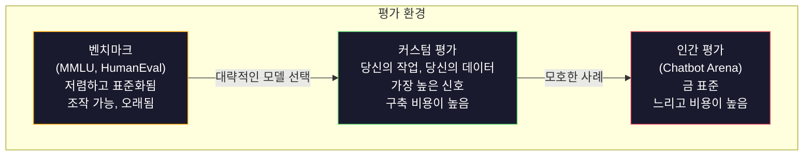
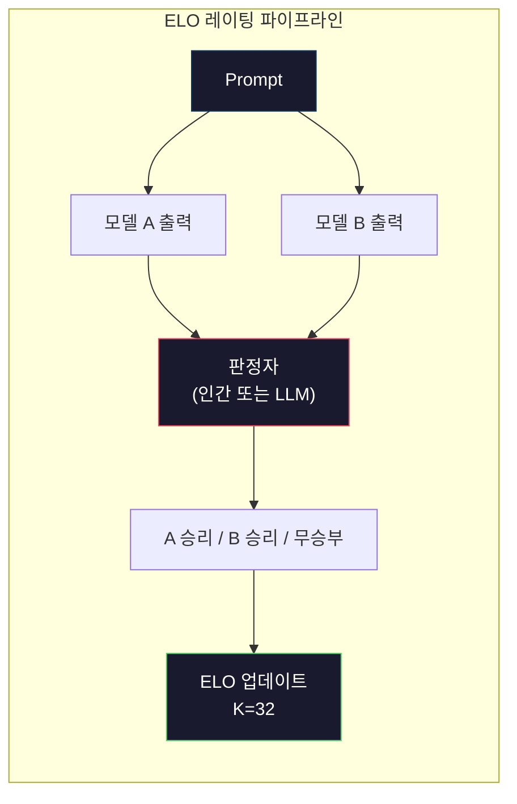

# 평가: 벤치마크, 평가 세트, LM 하네스

> 굿하트의 법칙: 측정 지표가 목표가 되면, 그 지표는 더 이상 좋은 지표가 아닙니다. 모든 프론티어 랩은 벤치마크를 조작합니다. MMLU 점수는 올라가지만, 모델은 여전히 "strawberry"에 있는 R의 개수를 신뢰할 수 있게 세지 못합니다. 중요한 평가는 오직 YOUR 평가 -- YOUR 작업, YOUR 데이터를 사용하는 평가입니다.

**유형:** Build
**언어:** Python
**선수 요건:** 10단계, 01-05강 (LLM从零부터 시작하기)
**시간:** 약 90분

## 학습 목표

- 언어 모델에 대해 객관식 및 개방형 벤치마크를 실행하는 맞춤형 평가 하네스를 구축해 보세요
- 표준 벤치마크(MMLU, HumanEval)가 포화 상태에 도달하고 프론티어 모델을 구분하지 못하는 이유를 설명해 보세요
- 정확 일치, F1, BLEU 및 LLM-as-judge 점수 등 적절한 메트릭을 사용하여 작업별 평가를 구현해 보세요
- 공개 리더보드에만 의존하지 않고, 특정 사용 사례를 겨냥한 맞춤형 평가 스위트를 설계해 보세요

## 문제점

MMLU는 2020년 57개 과목의 15,908개 질문과 함께 발표되었습니다. 3년 이내에 프론티어 모델이 이를 포화시켰습니다. GPT-4는 86.4%, Claude 3 Opus는 86.8%, Llama 3 405B는 88.6%를 기록했습니다. 리더보드는 3점 범위로 압축되어, 그 차이는 통계적 잡음일 뿐 실제 능력 격차가 아닙니다.

한편, 동일한 모델들은 10세 아이가 아무런 고민 없이 처리하는 작업에서 실패합니다. MMLU에서 88.7%를 기록한 Claude 3.5 Sonnet은 초기에 "strawberry"의 글자 수를 세지 못했습니다 -- 이는 세계 지식이나 추론이 전혀 필요하지 않고, 문자 단위 반복만 요구하는 작업입니다. HumanEval은 164개 문제로 코드 생성을 테스트합니다. 모델은 여기서 90% 이상 점수를 받지만, 주니어 개발자라면 누구나 잡을 수 있는 엣지 케이스에서 크래시하는 코드를 여전히 생성합니다.

벤치마크 성능과 실제 신뢰성 간의 격차는 LLM 평가의 핵심 문제입니다. 벤치마크는 모델이 벤치마크에서 어떻게 수행하는지 알려줍니다. 특정 데이터, 특정 실패 모드, 특정 작업에서 모델이 어떻게 수행할지에 대해서는 거의 알려주지 않습니다. 고객 지원 봇을 구축하고 있다면 MMLU는 관련이 없습니다. 코드 어시스턴트를 구축하고 있다면 HumanEval은 함수 수준 생성만 다루며, 디버깅, 리팩토링, 파일 간 코드 설명에 대해서는 아무것도 말하지 않습니다.

커스텀 평가가 필요합니다. 벤치마크가 무용지물이라서가 아닙니다. 거친 모델 선택에는 유용합니다. 최종 평가가 배포 조건과 정확히 일치해야 하기 때문입니다.

## 개념

### 평가 환경

평가에는 비용과 신호 품질이 서로 다른 세 가지 범주가 있습니다.

**벤치마크**는 표준화된 테스트 스위트입니다. MMLU, HumanEval, SWE-bench, MATH, ARC, HellaSwag. 모델이 벤치마크에 대해 실행되면 점수를 얻습니다. 장점: 모두가 동일한 테스트를 사용하므로 모델을 비교할 수 있습니다. 단점: 모델과 학습 데이터가 점점 더 이러한 벤치마크를 오염시킵니다. 연구소는 벤치마크 질문을 포함하는 데이터로 모델을 학습합니다. 점수는 올라갑니다. 능력은 오르지 않을 수 있습니다.

**커스텀 평가**는 특정 사용 사례를 위해 구축하는 테스트 스위트입니다. 입력, 예상 출력, 채점 함수를 정의합니다. 법률 문서 요약기는 법률 문서로 평가됩니다. SQL 생성기는 데이터베이스 스키마로 평가됩니다. 구축 비용이 높지만, 생산 환경 성능을 예측하는 유일한 평가입니다.

**인간 평가**는 유급 annotator를 사용하여 모델 출력을 유용성, 정확성, 유창성, 안전성 등의 기준으로 판단합니다. 자동 채점이 실패하는 개방형 작업의 금 표준입니다. Chatbot Arena는 100개 이상의 모델에 걸쳐 200만 개 이상의 인간 선호 투표 데이터를 수집했습니다. 단점: 비용 ($0.10-$2.00당 판단)과 속도 (수 시간에서 수 일).



### 벤치마크가 무너지는 이유

세 가지 메커니즘이 벤치마크 점수가 실제 능력을 반영하지 못하게 만듭니다.

**데이터 오염(Benchmark Contamination).** 학습 코퍼스는 인터넷을 스크랩합니다. 벤치마크 질문은 인터넷에 존재합니다. 모델은 학습 중에 정답을 보게 됩니다. 이는 전통적인 의미의 부정행위는 아닙니다 -- 연구소들이 의도적으로 벤치마크 데이터를 포함하지는 않습니다. 하지만 웹 규모 스크랩핑은 이를 제외하는 것을 거의 불가능하게 만듭니다.

**시험을 위한 가르침(Teaching to the test).** 연구소들은 벤치마크 성능을 위해 학습 혼합을 최적화합니다. 학습 혼합의 5%가 MMLU 스타일의 객관식 문제라면, 모델은 형식과 정답 분포를 학습합니다. MMLU는 4지선다 객관식입니다. 모델은 정답 분포가 A/B/C/D에 걸쳐 대략 균일하다는 것을 학습하며, 이는 모델이 정답을 모를 때에도 도움이 됩니다.

**포화(Saturation).** 모든 프론티어 모델이 벤치마크에서 85-90%의 점수를 받으면, 벤치마크는 변별력을 잃습니다. 남은 10-15%의 질문은 모호하거나, 라벨이 잘못되었거나, obscure한 도메인 지식을 요구할 수 있습니다. MMLU에서 87%에서 89%로 개선된 것은 모델이 obscure한 질문 두 개를 더 암기했다는 의미일 수 있으며, 더 똑똑해졌다는 의미는 아닙니다.

### 퍼플렉시티(Perplexity): 빠른 건강 체크

퍼플렉시티(Perplexity)는 모델이 토큰 시퀀스에 대해 얼마나 놀라워하는지를 측정합니다. 형식적으로는 음의 로그 우도(negative log-likelihood)의 평균을 지수화한 값입니다:

```
PPL = exp(-1/N * sum(log P(token_i | context)))
```

퍼플렉시티가 10이라는 것은 모델이 각 토큰 위치에서 평균적으로 10개의 옵션 중 하나를 균일하게 선택하는 것과 같은 수준의 불확실성을 가짐을 의미합니다. 낮을수록 좋습니다. GPT-2는 WikiText-103에서 약 30의 퍼플렉시티를 얻습니다. GPT-3는 약 20입니다. Llama 3 8B는 약 7을 얻습니다.

퍼플렉시티는 동일한 테스트 세트에서 모델을 비교하는 데 유용하지만, 사각지대가 있습니다. 모델은 흔한 패턴을 잘 예측하면서 희소하지만 중요한 패턴에는 형편없을 수 있으며, 이 경우 낮은 퍼플렉시티를 가질 수 있습니다. 또한 지시문 따르기(Instruction Following), 추론, 사실적 정확성에 대해서는 아무것도 말하지 않습니다. 이를 최종 판단이 아닌 Sanity Check로 사용하세요.

### LLM-as-Judge

강한 모델을 사용해 더 약한 모델의 출력을 평가하세요. 아이디어는 간단합니다: GPT-4o나 Claude Sonnet에게 응답의 정확성, 유용성, 안전성을 1-5 척도로 평가하도록 요청하는 것입니다. GPT-4o-mini를 사용할 경우 판정당 약 $0.01의 비용이 들며, 인간 판정과 놀라울 정도로 잘 상관됩니다 -- 대부분의 작업에서 약 80%의 일치율을 보입니다.

채점 프롬프트는 모델보다 더 중요합니다. 모호한 프롬프트("이 응답을 평가하세요")는 잡음이 많은 점수를 생성합니다. 루브릭이 포함된 구조화된 프롬프트("답변이 사실적으로 정확하고 출처를 인용하면 5점, 정확하지만 출처가 없으면 4점, 부분적으로 정확하면 3점...")는 일관되고 재현 가능한 점수를 생성합니다.

실패 모드: 판정 모델은 위치 편향(pairwise 비교에서 첫 번째 응답을 선호함), 장황함 편향(더 긴 응답을 선호함), 자기 선호(GPT-4가 동등한 Claude 출력보다 GPT-4 출력을 더 높게 평가함)를 보입니다. 완화책: 순서를 랜덤화하고, 길이를 정규화하며, 평가 대상 모델과 다른 판정 모델을 사용하세요.

### Pairwise 비교를 통한 ELO 레이팅

Chatbot Arena의 접근 방식입니다. 서로 다른 모델의 두 응답을 동일한 프롬프트에 대해 보여줍니다. 인간(또는 LLM 판정자)이 더 나은 하나를 선택합니다. 수천 개의 이러한 비교로부터 각 모델의 ELO 레이팅을 계산합니다 -- 체스에서 사용되는 것과 동일한 시스템입니다.

ELO의 장점: 상대적 순위는 절대 점수보다 더 신뢰할 수 있으며, 무승부를 우아하게 처리하고, 모든 출력을 독립적으로 채점하는 것보다 더 적은 비교로 수렴합니다. 2026년 초 기준, Chatbot Arena 순위는 GPT-4o, Claude 3.5 Sonnet, Gemini 1.5 Pro가 상위권에서 서로 20 ELO 포인트 이내임을 보여줍니다.



### 평가 프레임워크

**lm-evaluation-harness** (EleutherAI): 표준 오픈소스 평가 프레임워크입니다. 200개 이상의 벤치마크를 지원합니다. 하나의 명령으로 MMLU, HellaSwag, ARC 등에 대해 Hugging Face 모델을 실행할 수 있습니다. Open LLM Leaderboard에서 사용됩니다.

**RAGAS**: RAG 파이프라인을 위한 전용 평가 프레임워크입니다. 충실도(답변이 검색된 컨텍스트와 일치하는가?), 관련성(검색된 컨텍스트가 질문과 관련 있는가?), 답변 정확성을 측정합니다.

**promptfoo**: 프롬프트 엔지니어링을 위한 설정 기반 평가 도구입니다. YAML로 테스트 케이스를 정의하고, 여러 모델에 대해 실행하며, 통과/실패 보고서를 얻습니다. 프롬프트의 회귀 테스트에 유용합니다. 프롬프트 변경이 기존 테스트 케이스를 깨뜨리지 않는지 확인하세요.

### 커스텀 평가 구축하기

프로덕션 환경에서 중요한 유일한 평가입니다. 과정은 다음과 같습니다:

1. **작업을 정의하세요.** 모델이 정확히 무엇을 해야 합니까? 구체적으로 정의하세요. "질문에 답하기"는 너무 모호합니다. "고객 불만 이메일을 받아 제품명, 문제 범주, 감정을 추출하기"는 평가 가능한 작업입니다.

2. **테스트 케이스를 만드세요.** 프로토타입 평가에는 최소 50개, 프로덕션에는 200개 이상을 사용하세요. 각 테스트 케이스는 (입력, 예상 출력) 쌍입니다. 엣지 케이스를 포함하세요: 빈 입력, 적대적 입력, 모호한 입력, 다른 언어의 입력 등.

3. **채점 방식을 정의하세요.** 구조화된 출력에는 정확 일치(Exact Match)를, 텍스트 유사성에는 BLEU/ROUGE를, 개방형 품질에는 LLM-as-judge를, 추출 작업에는 F1을 사용하세요. 여러 지표를 가중치와 함께 조합하세요.

4. **자동화하세요.** 모든 평가는 한 번의 명령으로 실행됩니다. 수동 단계는 없습니다. 시간에 따른 비교가 가능한 형식으로 결과를 저장하세요.

5. **시간에 따라 추적하세요.** 평가 점수는 단독으로 의미가 없습니다. 추세선이 필요합니다. 마지막 프롬프트 변경 후 점수가 개선되었습니까? 모델 전환 후 점수가 후퇴했습니까? 프롬프트와 함께 평가도 버전 관리하세요.

| 평가 유형 | 판정당 비용 | 인간과의 일치율 | 최적 용도 |
|-----------|------------------|----------------------|----------|
| 정확 일치 | ~$0 | 100% (적용 가능한 경우) | 구조화된 출력, 분류 |
| BLEU/ROUGE | ~$0 | ~60% | 번역, 요약 |
| LLM-as-judge | ~$0.01 | ~80% | 개방형 생성 |
| 인간 평가 | $0.10-$2.00 | N/A (정답 기준) | 모호하고 고위험 작업 |

```figure
perplexity-loss
```

## 구현하기

### 1단계: 최소한의 평가 프레임워크

핵심 추상화를 정의하세요. 평가 케이스는 입력, 예상 출력, 선택적 메타데이터 딕셔너리를 포함합니다. 채점기는 예측값과 참조값을 받아 00강 1 사이의 점수를 반환합니다.

```python
import json
from collections import Counter

class EvalCase:
    def __init__(self, input_text, expected, metadata=None):
        self.input_text = input_text
        self.expected = expected
        self.metadata = metadata or {}

class EvalSuite:
    def __init__(self, name, cases, scorers):
        self.name = name
        self.cases = cases
        self.scorers = scorers

    def run(self, model_fn):
        results = []
        for case in self.cases:
            prediction = model_fn(case.input_text)
            scores = {}
            for scorer_name, scorer_fn in self.scorers.items():
                scores[scorer_name] = scorer_fn(prediction, case.expected)
            results.append({
                "input": case.input_text,
                "expected": case.expected,
                "prediction": prediction,
                "scores": scores,
            })
        return results
```

### 2단계: 채점 함수

정확 일치, 토큰 F1, 그리고 시뮬레이션된 LLM-as-judge 채점기를 만드세요.

```python
def exact_match(prediction, expected):
    return 1.0 if prediction.strip().lower() == expected.strip().lower() else 0.0

def token_f1(prediction, expected):
    pred_tokens = set(prediction.lower().split())
    exp_tokens = set(expected.lower().split())
    if not pred_tokens or not exp_tokens:
        return 0.0
    common = pred_tokens & exp_tokens
    precision = len(common) / len(pred_tokens)
    recall = len(common) / len(exp_tokens)
    if precision + recall == 0:
        return 0.0
    return 2 * (precision * recall) / (precision + recall)

def llm_judge_simulated(prediction, expected):
    pred_words = set(prediction.lower().split())
    exp_words = set(expected.lower().split())
    if not exp_words:
        return 0.0
    overlap = len(pred_words & exp_words) / len(exp_words)
    length_penalty = min(1.0, len(prediction) / max(len(expected), 1))
    return round(overlap * 0.7 + length_penalty * 0.3, 3)
```

### 3단계: ELO 레이팅 시스템

ELO 업데이트를 통해 쌍별 비교를 구현합니다. Chatbot Arena가 모델을 순위를 매기는 데 사용하는 시스템과 정확히 동일합니다.

```python
class ELOTracker:
    def __init__(self, k=32, initial_rating=1500):
        self.ratings = {}
        self.k = k
        self.initial_rating = initial_rating
        self.history = []

    def _ensure_player(self, name):
        if name not in self.ratings:
            self.ratings[name] = self.initial_rating

    def expected_score(self, rating_a, rating_b):
        return 1 / (1 + 10 ** ((rating_b - rating_a) / 400))

    def record_match(self, player_a, player_b, outcome):
        self._ensure_player(player_a)
        self._ensure_player(player_b)

        ea = self.expected_score(self.ratings[player_a], self.ratings[player_b])
        eb = 1 - ea

        if outcome == "a":
            sa, sb = 1.0, 0.0
        elif outcome == "b":
            sa, sb = 0.0, 1.0
        else:
            sa, sb = 0.5, 0.5

        self.ratings[player_a] += self.k * (sa - ea)
        self.ratings[player_b] += self.k * (sb - eb)

        self.history.append({
            "a": player_a, "b": player_b,
            "outcome": outcome,
            "rating_a": round(self.ratings[player_a], 1),
            "rating_b": round(self.ratings[player_b], 1),
        })

    def leaderboard(self):
        return sorted(self.ratings.items(), key=lambda x: -x[1])
```

### 4단계: 퍼플렉시티 계산

토큰 확률을 사용하여 퍼플렉시티를 계산합니다. 실제로는 모델의 로짓에서 이 값을 얻습니다. 여기서는 확률 분포로 시뮬레이션합니다.

```python
import numpy as np

def perplexity(log_probs):
    if not log_probs:
        return float("inf")
    avg_neg_log_prob = -np.mean(log_probs)
    return float(np.exp(avg_neg_log_prob))

def token_log_probs_simulated(text, model_quality=0.8):
    np.random.seed(hash(text) % 2**31)
    tokens = text.split()
    log_probs = []
    for i, token in enumerate(tokens):
        base_prob = model_quality
        if len(token) > 8:
            base_prob *= 0.6
        if i == 0:
            base_prob *= 0.7
        prob = np.clip(base_prob + np.random.normal(0, 0.1), 0.01, 0.99)
        log_probs.append(float(np.log(prob)))
    return log_probs
```

### 5단계: 결과 집계

평가 실행 전반에 걸쳐 평균, 중앙값, 임계값에서의 통과율, 지표별 세부 분석 등 요약 통계를 계산합니다.

```python
def summarize_results(results, threshold=0.8):
    all_scores = {}
    for r in results:
        for metric, score in r["scores"].items():
            all_scores.setdefault(metric, []).append(score)

    summary = {}
    for metric, scores in all_scores.items():
        arr = np.array(scores)
        summary[metric] = {
            "mean": round(float(np.mean(arr)), 3),
            "median": round(float(np.median(arr)), 3),
            "std": round(float(np.std(arr)), 3),
            "min": round(float(np.min(arr)), 3),
            "max": round(float(np.max(arr)), 3),
            "pass_rate": round(float(np.mean(arr >= threshold)), 3),
            "n": len(scores),
        }
    return summary

def print_summary(summary, suite_name="Eval"):
    print(f"\n{'=' * 60}")
    print(f"  {suite_name} Summary")
    print(f"{'=' * 60}")
    for metric, stats in summary.items():
        print(f"\n  {metric}:")
        print(f"    Mean:      {stats['mean']:.3f}")
        print(f"    Median:    {stats['median']:.3f}")
        print(f"    Std:       {stats['std']:.3f}")
        print(f"    Range:     [{stats['min']:.3f}, {stats['max']:.3f}]")
        print(f"    Pass rate: {stats['pass_rate']:.1%} (threshold >= 0.8)")
        print(f"    N:         {stats['n']}")
```

### 6단계: 전체 파이프라인 실행

모든 요소를 연결합니다. 작업을 정의하고, 테스트 케이스를 생성하고, 두 모델을 시뮬레이션하고, 평가를 실행하고, 쌍별 비교에서 ELO를 계산하고, 리더보드를 출력합니다.

```python
def demo_model_good(prompt):
    responses = {
        "What is the capital of France?": "Paris",
        "What is 2 + 2?": "4",
        "Who wrote Hamlet?": "William Shakespeare",
        "What language is PyTorch written in?": "Python and C++",
        "What is the boiling point of water?": "100 degrees Celsius",
    }
    return responses.get(prompt, "I don't know")

def demo_model_bad(prompt):
    responses = {
        "What is the capital of France?": "Paris is the capital city of France",
        "What is 2 + 2?": "The answer is four",
        "Who wrote Hamlet?": "Shakespeare",
        "What language is PyTorch written in?": "Python",
        "What is the boiling point of water?": "212 Fahrenheit",
    }
    return responses.get(prompt, "Unknown")

cases = [
    EvalCase("What is the capital of France?", "Paris"),
    EvalCase("What is 2 + 2?", "4"),
    EvalCase("Who wrote Hamlet?", "William Shakespeare"),
    EvalCase("What language is PyTorch written in?", "Python and C++"),
    EvalCase("What is the boiling point of water?", "100 degrees Celsius"),
]

suite = EvalSuite(
    name="General Knowledge",
    cases=cases,
    scorers={
        "exact_match": exact_match,
        "token_f1": token_f1,
        "llm_judge": llm_judge_simulated,
    },
)

results_good = suite.run(demo_model_good)
results_bad = suite.run(demo_model_bad)

print_summary(summarize_results(results_good), "Model A (concise)")
print_summary(summarize_results(results_bad), "Model B (verbose)")
```

"좋은" 모델은 정확한 답변을 제공합니다. "나쁜" 모델은 장황한 패러프레이즈를 제공합니다. 정확 일치 지표는 장황한 모델에 대해 매우 엄격하게 벌점을 부여합니다. 토큰 F01강 LLM-as-judge는 더 관대합니다. 이는 지표 선택이 중요한 이유를 보여줍니다. 동일한 모델도 점수 매기는 방식에 따라 훌륭해 보이거나 형편없어 보일 수 있습니다.

### 7단계: ELO 토너먼트

여러 라운드에 걸쳐 모델 간 쌍별 비교를 실행합니다.

```python
elo = ELOTracker(k=32)

for case in cases:
    pred_a = demo_model_good(case.input_text)
    pred_b = demo_model_bad(case.input_text)

    score_a = token_f1(pred_a, case.expected)
    score_b = token_f1(pred_b, case.expected)

    if score_a > score_b:
        outcome = "a"
    elif score_b > score_a:
        outcome = "b"
    else:
        outcome = "tie"

    elo.record_match("model_a_concise", "model_b_verbose", outcome)

print("\nELO Leaderboard:")
for name, rating in elo.leaderboard():
    print(f"  {name}: {rating:.0f}")
```

### 8단계: 퍼플렉시티 비교

다양한 품질 수준의 "모델" 간 퍼플렉시티를 비교합니다.

```python
test_text = "The quick brown fox jumps over the lazy dog in the garden"

for quality, label in [(0.9, "Strong model"), (0.7, "Medium model"), (0.4, "Weak model")]:
    log_probs = token_log_probs_simulated(test_text, model_quality=quality)
    ppl = perplexity(log_probs)
    print(f"  {label} (quality={quality}): perplexity = {ppl:.2f}")
```

## 사용하기

### lm-evaluation-harness (EleutherAI)

임의의 모델에 대해 벤치마크를 실행하는 표준 도구입니다.

```python
# pip install lm-eval
# 명령줄:
# lm_eval --model hf --model_args pretrained=meta-llama/Llama-3.1-8B --tasks mmlu --batch_size 8

# Python API:
# import lm_eval
# results = lm_eval.simple_evaluate(
#     model="hf",
#     model_args="pretrained=meta-llama/Llama-3.1-8B",
#     tasks=["mmlu", "hellaswag", "arc_easy"],
#     batch_size=8,
# )
# print(results["results"])
```

### promptfoo

프롬프트 엔지니어링을 위한 설정 기반 평가입니다. YAML로 테스트를 정의하고 여러 제공자(providers)에 대해 실행합니다.

```yaml
# promptfoo.yaml
providers:
  - openai:gpt-4o-mini
  - anthropic:claude-3-haiku

prompts:
  - "Answer in one word: {{question}}"

tests:
  - vars:
      question: "What is the capital of France?"
    assert:
      - type: contains
        value: "Paris"
  - vars:
      question: "What is 2 + 2?"
    assert:
      - type: equals
        value: "4"
```

### RAGAS for RAG evaluation

```python
# pip install ragas
# from ragas import evaluate
# from ragas.metrics import faithfulness, answer_relevancy, context_precision
#
# result = evaluate(
#     dataset,
#     metrics=[faithfulness, answer_relevancy, context_precision],
# )
# print(result)
```

RAGAS는 일반적인 평가가 놓치는 부분을 측정합니다: 모델의 답변이 검색된 컨텍스트에 근거하는지 여부, 즉 추상적으로 답변이 "정확"한지 여부만 보는 것이 아닙니다.

## 출시하기

이 강의는 `outputs/prompt-eval-designer.md`를 생성합니다 -- 모든 작업에 대해 맞춤형 평가 스위트(custom eval suites)를 설계하는 재사용 가능한 프롬프트입니다. 작업 설명을 입력하면 테스트 케이스, 채점 함수, 통과/실패 임계값 권장 사항을 생성합니다.

이 강의는 `outputs/skill-llm-evaluation.md`도 생성합니다 -- 작업 유형, 예산, 지연(latency) 요구 사항에 따라 올바른 평가 전략을 선택하기 위한 의사결정 프레임워크입니다.

## 연습 문제

1. 동일한 입력을 모델에 5번 실행하고 출력 일치 빈도를 측정하는 "일관성(consistency)" 채점기를 추가해 보세요. 결정론적 입력에서 일관되지 않은 답변은 취약한 프롬프트나 높은 온도 설정을 드러냅니다.

2. ELO 트래커가 여러 채점 함수(정확 일치, F1, LLM-as-judge)를 지원하고 가중치를 부여하도록 확장해 보세요. 정확 일치에 큰 가중치를 부여했을 때와 F1에 큰 가중치를 부여했을 때 리더보드가 어떻게 변하는지 비교해 보세요.

3. 특정 작업에 대한 평가 스위트를 구축해 보세요: 이메일을 5개 범주로 분류하는 작업입니다. 다양한 예시와 엣지 케이스(다중 범주에 속할 수 있는 이메일, 빈 이메일, 다른 언어의 이메일)를 포함하여 100개의 테스트 케이스를 만드세요. 서로 다른 "모델"(규칙 기반, 키워드 매칭, 시뮬레이션된 LLM)이 어떻게 수행되는지 측정하세요.

4. 오염(benchmark contamination) 감지를 구현해 보세요: 평가 질문 집합과 학습 코퍼pus가 주어졌을 때, 평가 질문(또는 가까운 패러프레이즈)이 학습 데이터에 나타나는 비율을 확인하세요. 연구자들이 벤치마크 유효성을 감사하는 방법입니다.

5. "모델 diff" 도구를 구축하세요. 두 모델 버전의 평가 결과가 주어지면, 특정 테스트 케이스 중 개선된 것, 후퇴한 것, 동일한 것을 강조 표시하세요. 이는 코드 diff의 평가 버전으로, 변경 사항이 도움이 되었는지 해가 되었는지 이해하는 데 필수적입니다.

## 핵심 용어

| 용어 | 사람들이 말하는 것 | 실제 의미 |
|------|----------------|----------------------|
| MMLU | "벤치마크" | Massive Multitask Language Understanding -- 57개 과목에 걸친 15,908개의 객관식 문제, 2025년 기준 88% 이상에서 포화 상태 |
| HumanEval | "코드 평가" | OpenAI의 164개 Python 함수 완성 문제, 고립된 함수 생성만 테스트 |
| SWE-bench | "실제 코딩 평가" | 12개 Python 저장소의 GitHub 이슈 2,294개, 테스트 생성을 포함한 엔드투엔드 버그 수정을 측정 |
| 퍼플렉시티(Perplexity) | "모델이 얼마나 혼란스러운지" | exp(-avg(log P(token_i given context))) -- 낮을수록 모델이 실제 토큰에 더 높은 확률을 할당한다는 의미 |
| ELO 레이팅 | "모델을 위한 체스 레이팅" | 쌍대 승패 기록에서 계산된 상대적 기술 레이팅, Chatbot Arena가 100개 이상 모델을 레이팅하는 데 사용 |
| LLM-as-judge | "AI로 AI를 채점하기" | 강력한 모델이 약한 모델의 출력을 평가 기준에 따라 채점하며, 인간 평가자와 약 80% 일치, 채점당 약 $0.01 |
| 벤치마크 오염(Benchmark Contamination) | "모델이 테스트를 본 경우" | 학습 데이터에 벤치마크 문제가 포함되어, 실제 능력을 향상시키지 않으면서 점수를 부풀림 |
| 평가 세트(Eval Set) | "테스트 집합" | 특정 능력을 측정하는 (입력, 예상 출력, 채점자) 삼중항의 버전 관리된 컬렉션 |
| 통과율(Pass rate) | "정답률" | 임계값 이상 점수를 받은 평가 사례의 비율 -- 신뢰성을 측정하므로 평균 점수보다 실행 가능 |
| Chatbot Arena | "모델 레이팅 웹사이트" | 200만 개 이상의 인간 선호 투표가 있는 LMSYS 플랫폼, ELO 레이팅을 통해 가장 신뢰할 수 있는 LLM 리더보드 생성 |

## 추가 읽기

- [Hendrycks et al., 2021 -- "Measuring Massive Multitask Language Understanding"](https://arxiv.org/abs/2009.03300) -- MMLU 논문, 포화 상태임에도 여전히 가장 많이 인용되는 LLM 벤치마크
- [Chen et al., 2021 -- "Evaluating Large Language Models Trained on Code"](https://arxiv.org/abs/2107.03374) -- OpenAI의 HumanEval 논문, 코드 생성 평가 방법론을 확립
- [Zheng et al., 2023 -- "Judging LLM-as-a-Judge"](https://arxiv.org/abs/2306.05685) -- LLM을 사용하여 LLM을 평가하는 것에 대한 체계적인 분석, 위치 편향 및 장황함 편향 발견 포함
- [Arena (formerly LMSYS Chatbot Arena)](https://arena.ai/leaderboard) -- 200만 개 이상의 투표가 있는 크라우드소싱 모델 비교 플랫폼, 가장 신뢰할 수 있는 실제 LLM 레이팅
