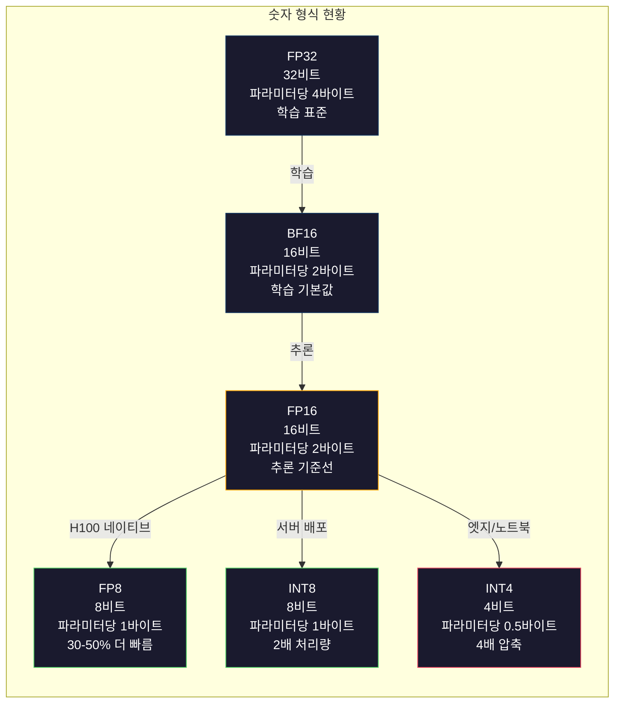
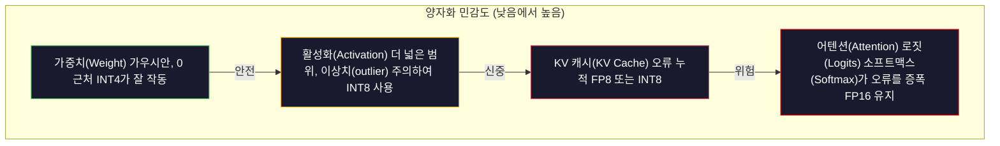
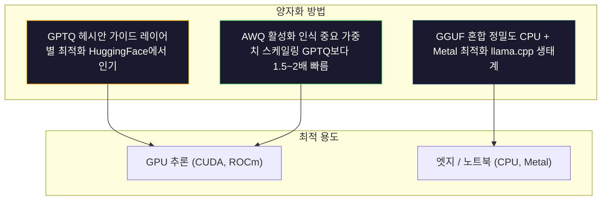

# 양자화: 모델이 맞도록 만들기

> FP16의 70B 모델은 140GB가 필요합니다. 가중치만으로도 A100 두 개가 필요합니다. FP8로 양자화하면 80GB GPU 하나면 됩니다. INT4: MacBook에서 실행됩니다.

**유형:** Build
**언어:** Python (numpy 포함)
**선수 요건:** 10단계, 01-10강 (LLM을 처음부터 만들기)
**시간:** 약 120분

## 학습 목표

- FP16에서 INT8 및 INT4로 대칭 및 비대칭 양자화를 구현하고, 텐서별 및 채널별 스케일링을 포함합니다
- 양자화로 인한 메모리 절감량을 계산하고, 주어진 GPU의 VRAM에 어떤 정밀도가 맞는지 결정합니다
- 사후 학습 양자화 (PTQ)와 양자화 인식 학습 (QAT)의 차이를 설명합니다
- GPTQ 또는 AWQ를 적용하여 실제 모델을 양자화하고, 벤치마크에서 정확도-메모리 트레이드오프를 측정합니다

## 문제점

Llama 3 70B는 700억 개의 매개변수를 가지고 있습니다. 각 매개변수는 16비트 부동 소수점 숫자입니다. 이는 1400억 바이트, 즉 140GB입니다. 단일 A100은 80GB의 VRAM을 가지고 있습니다. 단일 GPU에서는 가중치를 로드할 수도, 추론을 실행할 수도 없습니다. 하나의 모델을 서빙하기 위해 시간당 $2인 A100 두 개가 필요합니다.

그러나 매개변수당 16비트는 낭비적입니다. 신경망의 대부분의 가중치는 0 근처에 집중되어 있습니다. FP16의 전체 동적 범위 (0.000000059에서 65,504까지)는 거의 사용되지 않습니다. Llama 3 70B의 가중치 실제 분포를 측정하면, 95%가 -0.01강 +0.1 사이에 떨어집니다. 4비트로 표현할 수 있는 값을 위해 16비트를 낭비하고 있습니다.

양자화는 고정밀도 숫자를 저정밀도 숫자로 대체합니다. FP16에서 FP8로 바꾸면 메모리가 절반으로 줄어듭니다. FP16에서 INT4로 바꾸면 4분의 1로 줄어듭니다. 그 140GB 모델은 35GB가 됩니다. 단일 소비자용 GPU에 맞습니다. 2비트 양자화 (공격적이고 손실이 크지만 일부 작업에는 사용 가능)로 밀어 넣으면 같은 모델이 16GB 노트북에서 실행됩니다.

비용은 정확도입니다. 제거하는 모든 비트는 정보를 파괴합니다. 문제는 정확도를 얼마나, 어디에서 잃느냐입니다. 잘 양자화된 INT4 모델은 대부분의 벤치마크에서 원본 품질의 95-99%를 유지합니다. 단순한 INT4 양자화는 모델을 완전히 파괴할 수 있습니다. 차이는 기술입니다.

Llama 3를 GPTQ로 INT4 양자화(Quantization)한 커뮤니티 버전은 WikiText에서 약 1-2 퍼플렉시티(Perplexity) 포인트가 손실되는 것으로 나타납니다. Mistral은 Mixtral 8x22B의 FP8 체크포인트(Checkpoint)를 공개했으며, MMLU에서 측정 가능한 품질 손실이 0입니다. GGUF 형식은 llama.cpp의 기반이 되며, M 시리즈 칩이 장착된 MacBook에서 70B 모델을 실행할 수 있게 합니다. 양자화(Quantization)는 해킹이 아닙니다. 7B보다 큰 모든 모델의 표준 배포 경로입니다.

## 개념

### 숫자 형식: 각 비트의 역할

모든 부동 소수점 숫자는 세 부분으로 구성됩니다: 부호, 지수, 그리고 가수(mantissa, 유효숫자라고도 함). 부호는 1비트입니다. 지수는 범위(숫자가 얼마나 크거나 작을 수 있는지)를 결정합니다. 가수는 정밀도(소수점 이하 자릿수)를 결정합니다.

```
FP32:  [1 sign] [8 exponent] [23 mantissa]  = 32 bits
FP16:  [1 sign] [5 exponent] [10 mantissa]  = 16 bits
BF16:  [1 sign] [8 exponent] [7  mantissa]  = 16 bits
FP8:   [1 sign] [4 exponent] [3  mantissa]  = 8  bits (E4M3)
FP8:   [1 sign] [5 exponent] [2  mantissa]  = 8  bits (E5M2)
INT8:  [1 sign] [7 value]                   = 8  bits (uniform steps)
INT4:  [1 sign] [3 value]                   = 4  bits (16 levels total)
```

**FP32**는 완전한 정밀도입니다. 23비트의 가수는 약 7자리의 소수점 정밀도를 제공합니다. 범위: 대략 1.2 x 10^-38에서 3.4 x 10^38까지. 학습은 과거에 FP32로만 수행되었습니다. 행렬 곱셈 중 누적 합계(running sums)에는 여전히 FP32가 사용됩니다.

**FP16**는 비트 수를 절반으로 줄입니다. 10비트의 가수는 약 3.3자리의 소수점 정밀도를 제공합니다. 지수는 5비트로 줄어들어 범위가 극적으로 감소합니다(최대 값 ~65,504). 이는 가중치(Weight)(0 근처에 집중됨)에는 적합하지만, 학습 중 급상승할 수 있는 활성화(Activation)와 기울기(Gradient)에는 위험합니다. FP16 학습은 언더플로우(underflow)를 방지하기 위해 손실 스케일링(loss scaling)이 필요합니다.

**BF16** (Brain Float 16)은 FP32의 8비트 지수를 유지하면서 가수를 7비트로 줄입니다. FP32와 동일한 범위를 가지며, FP16보다 정밀도가 낮습니다. Google은 딥러닝을 위해 특별히 설계했습니다. 직관적으로, 신경망에서는 정밀도보다 범위가 더 중요합니다. FP16에서 0으로 언더플로우되는 10^-20의 기울기(Gradient)는 BF16에서 살아남습니다. BF16에서 0.0734로 반올림되는 0.07342의 가중치(Weight)는 충분히 가깝습니다. 모든 현대적인 학습 실행은 BF16 또는 BF16/FP32 혼합을 사용합니다.

**FP8**는 두 가지 변형이 있습니다. E4M3 (4비트 지수, 3비트 가수)는 추론(Inference) 중 가중치(Weight)와 활성화(Activation)에 사용됩니다. E5M2 (5비트 지수, 2비트 가수)는 정밀도보다 범위가 더 중요한 학습 중 기울기(Gradient)에 사용됩니다. H100 GPU에서의 FP8 추론(Inference)은 FP16 대비 30-50%의 속도 향상을 달성하며, 품질 손실은 무시할 수 있는 수준입니다.

**INT8**는 정수 형식입니다. 지수도, 가수도 없습니다. -128부터 127까지 고르게 분포된 256개의 값만 존재합니다. 부동소수점 가중치를 이 범위에 매핑하려면 스케일 팩터가 필요합니다. 장점: 정수 연산은 부동소수점 연산보다 더 빠르고 전력 효율적입니다. A100에서 INT8 행렬 곱은 FP16의 312 TFLOPS에 비해 624 TOPS로 실행됩니다.

**INT4**는 더 나아가습니다. 가능한 값이 16개뿐입니다. 스케일 팩터가 중요한 역할을 합니다. 품질은 스케일을 어떻게 선택하고 어떤 가중치를 양자화하느냐에 전적으로 달려 있습니다. 최신 INT4 방법(GPTQ, AWQ)은 원본 모델 품질의 95% 이상을 유지합니다.



### 양자화 작동 방식

핵심 연산은 간단합니다. 부동소수점 값의 텐서를 가져와 스케일 팩터를 찾고, 곱한 후 가장 가까운 정수로 반올림하여, 정수와 스케일 팩터를 저장합니다.

**양자화:**
```
scale = max(abs(tensor)) / max_int_value
quantized = round(tensor / scale)
```

**역양자화:**
```
reconstructed = quantized * scale
```

대칭 범위(-127~127)의 INT8의 경우:
```
scale = max(abs(tensor)) / 127
quantized = clamp(round(tensor / scale), -128, 127)
```

오차는 반올림 오차입니다. 각 값은 최대 `scale / 2`만큼 벗어날 수 있습니다. 레이어 전체의 총 오차는 가중치 개수와 가중치 변화에 대한 모델의 민감도에 따라 달라집니다.

**텐서별 vs 채널별 양자화.** 텐서별 양자화는 전체 가중치 행렬에 대해 하나의 스케일 팩터를 사용합니다. 간단하지만 손실이 큽니다: 한 열에 큰 값이 있고 다른 열에 작은 값이 있는 경우, 작은 값은 정밀도의 대부분을 잃습니다. 채널별 양자화는 출력 채널마다(가중치 행렬의 행 또는 열마다) 하나의 스케일 팩터를 사용합니다. 오버헤드가 더 큽니다(1개 대신 N개의 스케일 팩터를 저장)하지만 품질이 극적으로 개선됩니다. 모든 프로덕션 양자화 방법은 채널별 또는 더 세밀한 세분성을 사용합니다.

**비대칭 양자화(Asymmetric quantization)**는 제로 포인트 오프셋을 추가합니다: `quantized = round(tensor / scale) + zero_point`. 이는 0에 중심이 있지 않은 분포를 처리합니다. 예를 들어, ReLU 활성화는 항상 비음수입니다. 대칭 양자화(Symmetric quantization)는 나타나지 않는 음수 값에 정수 범위의 절반을 낭비합니다. 비대칭 양자화(Asymmetric quantization)는 실제 범위 [min, max]를 전체 정수 범위에 매핑합니다.

### 민감도 계층

모델 내의 모든 요소가 양자화(Quantization)를 동일하게 허용하지는 않습니다. 명확한 계층이 존재합니다.

**가중치(Weight) (가장 견고함).** 모델 가중치(Weight)는 학습 중에 천천히 변하며 0 근처에 중심을 둔 대략적인 가우시안 분포를 따릅니다. 양자화(Quantization)가 잘 작동합니다. 채널별 스케일(per-channel scale)을 적용한 INT8 가중치(Weight)는 거의 손실 없는 결과를 생성합니다. INT4는 더 정교한 방법이 필요하지만 작동합니다.

**활성화(Activation) (중간 민감도).** 활성화(Activation)는 추론(Inference) 중에 네트워크를 통해 흐르는 중간 값입니다. 가중치(Weight)보다 더 넓은 동적 범위를 가지며 이상치(outlier)를 포함합니다. 단일 어텐션 헤드(attention head)는 평균보다 100배 큰 활성화 값을 생성할 수 있습니다. 이러한 이상치(outlier)는 모델 품질에 중요합니다. 이를 단순하게 양자화(Quantization)하면 정보를 파괴합니다. 해결책: 이상치(outlier) 채널을 더 높은 정밀도로 유지(LLM.int8())하거나, 토큰별(per-token) 또는 채널별(per-channel) 활성화 스케일(activation scale)을 사용하세요.

**KV 캐시(KV Cache) (높은 민감도).** 키-값(KV) 캐시(KV Cache)는 모든 이전 토큰(Token)의 어텐션(Attention) 상태를 저장합니다. 긴 컨텍스트(Context) 길이에서는 KV 캐시(KV Cache)가 메모리를 지배합니다. 32K 컨텍스트(Context)의 70B 모델의 경우, KV 캐시(KV Cache)만 FP16에서 40GB입니다. KV 캐시(KV Cache)를 FP8 또는 INT8로 양자화(Quantization)하면 대량의 메모리를 절약하지만, 모든 미래 어텐션(Attention) 연산에서 오류가 누적됩니다. 품질 영향은 시퀀스(sequence) 길이에 따라 확대됩니다.

**어텐션(Attention) 로짓(Logits) (가장 민감함).** 어텐션(Attention)의 소프트맥스(Softmax)는 입력의 작은 변화에 매우 민감합니다. 소프트맥스(Softmax) 전 로짓(Logits)의 양자화(Quantization) 오류 0.01은 어텐션(Attention) 분포를 의미 있게 변화시킬 수 있습니다. 대부분의 양자화(Quantization) 방식은 다른 모든 것이 양자화(Quantization)되어 있더라도 어텐션(Attention) 연산은 더 높은 정밀도(FP16 또는 BF16)로 유지합니다.



### PTQ vs QAT

**학습 후 양자화 (PTQ)(Post-Training Quantization (PTQ))**는 이미 학습된 모델을 양자화합니다. 재학습이 필요 없습니다. FP16 가중치를 가져와 스케일 팩터를 계산하고, 반올림한 후 배포합니다. 빠르고(수 분에서 수 시간) 저렴합니다. INT08강 FP8에 잘 작동합니다. INT4의 경우, 단순한 PTQ는 반올림 오차가 누적되어 종종 심각하게 실패합니다. 고급 PTQ 방법(GPTQ, AWQ)은 양자화 오차를 최소화하기 위해 캘리브레이션 데이터를 사용합니다.

**양자화 인식 학습 (QAT)(Quantization-Aware Training (QAT))**은 학습 중 순방향 전파에 가짜 양자화 연산을 삽입합니다. 모델은 반올림 오차가 작은 위치에 가중치를 배치하도록 학습합니다. 기울기는 직통 추정기(STE)를 통해 가짜 양자화를 통과합니다: 반올림 연산의 기울기가 1이라고 가정합니다. QAT는 PTQ보다 더 나은 INT4 및 INT2 모델을 생성하지만, 전체 학습 실행이 필요합니다. Google은 Gemini의 효율적인 서빙을 위해 QAT를 사용했습니다. Meta는 일부 Llama 배포 목표를 위해 QAT를 사용했습니다.

| 측면 | PTQ | QAT |
|--------|-----|-----|
| 비용 | 수 분에서 수 시간 | 전체 학습 실행 |
| INT8 품질 | 우수 (< 0.1% 손실) | 우수 |
| INT4 품질 | GPTQ/AWQ 사용 시 좋음 (1-3% 손실) | 더 좋음 (< 1% 손실) |
| INT2 품질 | 낮음 | 일부 작업에 사용 가능 |
| 캘리브레이션 데이터 | 128-1024 예제 | 전체 학습 데이터셋 |
| 사용 시점 | 배포, 반복 | 낮은 비트 폭에서 최대 품질 |

### GPTQ, AWQ, GGUF

**GPTQ (GPT 양자화)(GPT Quantization)**는 일회성 PTQ 방법입니다. 작은 캘리브레이션 데이터셋(일반적으로 128 예제)을 사용하여 헤시안(출력이 각 가중치에 얼마나 민감한지에 대한 2차 정보)을 측정하며, 가중치를 한 층씩 양자화합니다. 헤시안이 중요하다고 판단한 가중치는 더 세심하게 양자화됩니다. GPTQ는 LLM에 INT4 양자화를 실용적으로 만든 최초의 방법입니다. Hugging Face의 TheBloke는 수백 개 모델의 양자화 버전을 릴리스하며 GPTQ를 대중화했습니다.

**AWQ (활성화 인식 가중치 양자화)(Activation-Aware Weight Quantization)**는 가중치의 소량(약 1%)이 큰 활성화 값과 곱해져 불균형적으로 중요하다는 것을 관찰합니다. AWQ는 캘리브레이션 데이터를 사용하여 이러한 중요한 가중치를 식별하고, 양자화 전에 이를 스케일 업합니다(그 후 대응하는 활성화 값을 스케일 다운합니다). 이를 통해 중요한 가중치를 INT4 양자화가 정확한 범위에 유지합니다. AWQ는 일반적으로 GPTQ의 품질과 동등하거나 약간 더 좋으며, 적용 속도는 1.5~2배 더 빠릅니다.

**GGUF (GPT 생성 통합 형식)(GPT-Generated Unified Format)**는 llama.cpp 및 그 생태계에서 사용하는 파일 형식입니다. 혼합 양자화를 지원하며, 각 레이어에 서로 다른 비트 폭을 적용할 수 있습니다. 첫 번째와 마지막 레이어(임베딩 및 출력 헤드)는 일반적으로 더 높은 정밀도로 유지됩니다. 중간 레이어는 INT4 또는 INT3를 사용합니다. GGUF 파일은 자기 완결적입니다: 가중치, 토크나이저, 메타데이터가 모두 하나의 파일에 포함됩니다. 이 형식은 CPU 추론 및 Apple Silicon을 위해 설계되었으며, 전체 모델을 메모리에 로드하고 CPU 또는 Metal GPU에서 행렬 곱셈을 실행하는 것이 표준 경로입니다. Q4_K_M은 품질과 크기의 균형을 맞추는 가장 인기 있는 GGUF 양자화 변형입니다.



### 품질 측정

양자화된 모델이 여전히 좋은지 어떻게 알 수 있나요?

**퍼플렉시티(Perplexity).** 가장 일반적인 지표입니다. 낮을수록 좋습니다. 원본 모델과 양자화된 모델 모두에 대해 홀드아웃 데이터셋(WikiText-2가 표준)에서 퍼플렉시티를 계산합니다. 델타는 양자화가 파괴한 정보의 양을 나타냅니다. 경험칙: 델타 < 0.5는 우수, 0.5~1.0은 좋음, 1.0~2.0은 대부분의 작업에 허용 가능, > 2.0은 문제가 발생했음을 의미합니다.

**작업별 벤치마크.** 양자화된 모델을 MMLU, HumanEval, GSM8K 또는 사용자 정의 평가 세트에서 실행합니다. 원본 모델과 비교하세요. 양자화는 다양한 능력에 고르지 않게 영향을 미칩니다. 수학 및 코드 작업은 일반 지식보다 정밀도 손실에 더 민감합니다.

**출력 비교.** 동일한 프롬프트로 두 모델의 응답을 생성하고 비교해 보세요. LLM-as-judge (10강)가 여기서 잘 작동합니다. 승률을 계산해 보세요: 양자화된 모델이 원본 모델과 동등하거나 더 나은 성능을 보이는 프롬프트의 비율은 얼마입니까?

**지연 시간 및 처리량.** 양자화는 모델을 더 빠르고 저렴하게 만들기 위해 존재합니다. 초당 토큰 수, 첫 토큰까지의 시간, 메모리 사용량을 측정해 보세요. 원본 모델보다 느린 양자화 모델은 쓸모없는 것보다 더 나쁩니다.

| 모델 | 형식 | 크기 | 퍼플렉시티 (WikiText-2) | MMLU | 초당 토큰 수 (A100) |
|-------|--------|------|------------------------|------|-------------------|
| Llama 3 70B | FP16 | 140GB | 3.12 | 79.5% | 38 |
| Llama 3 70B | FP8 | 70GB | 3.14 | 79.3% | 55 |
| Llama 3 70B | GPTQ INT4 | 35GB | 4.32 | 77.8% | 72 |
| Llama 3 70B | AWQ INT4 | 35GB | 4.18 | 78.1% | 75 |
| Llama 3 70B | GGUF Q4_K_M | 40GB | 4.25 | 77.9% | 28 (CPU) |

패턴: FP8는 거의 무료입니다. INT4는 MMLU 점수를 1-2점 잃게 하지만 처리량을 두 배로 늘리고 메모리를 4분의 1로 줄입니다. 이 트레이드오프는 거의 모든 배포에 가치가 있습니다.

### 실제 수치

H100에서의 FP16에서 FP8: 추론 속도 30-50% 향상, 품질 손실 < 0.1%. 이는 고민할 필요 없는 양자화입니다. 모든 H100 배포는 이를 사용해야 합니다.

FP16에서 INT8 (LLM.int8()): 메모리 2배 감소, 품질 손실 < 0.5%. 혼합 정밀도(Mixed Precision) 접근법은 이상치(outlier) 특징을 FP16으로 유지하면서 나머지를 모두 INT8로 양자화합니다.

FP16에서 INT4 (GPTQ/AWQ): 메모리 4배 감소, 모델 및 방법에 따라 품질 손실 1-3%. 단일 48GB GPU에서 70B 모델을 실행할 수 있게 합니다.

FP16에서 INT4 (GGUF Q4_K_M): 메모리 3.5배 감소, 품질 손실 1-2%. CPU 추론에 최적화되어 있습니다. Q4_K_M의 70B 모델은 약 40GB이며, 64GB의 M3 Max에서 초당 10-15 토큰으로 실행됩니다.

FP16에서 INT2: 메모리 8배 감소, 품질 손실 5-15%. 성능 저하를 허용할 수 있는 특정 좁은 작업에만 실행 가능합니다. 연구 최전선이며, 일반적인 사용을 위한 생산 준비가 되지 않았습니다.

```figure
quantization
```

## 구현하기

### 1단계: 숫자 형식 표현

각 형식의 비트 수준 표현을 구축하여 부호, 지수, 가수가 정확히 무엇을 하는지 확인해 보세요.

```python
import numpy as np


def float_to_fp32_bits(value):
    bits = np.float32(value).view(np.uint32)
    sign = (bits >> 31) & 1
    exponent = (bits >> 23) & 0xFF
    mantissa = bits & 0x7FFFFF
    return {"sign": int(sign), "exponent": int(exponent), "mantissa": int(mantissa),
            "exponent_bits": format(int(exponent), '08b'),
            "mantissa_bits": format(int(mantissa), '023b'),
            "value": float(value),
            "actual_exponent": int(exponent) - 127}


def float_to_fp16_bits(value):
    fp16 = np.float16(value)
    bits = fp16.view(np.uint16)
    sign = (bits >> 15) & 1
    exponent = (bits >> 10) & 0x1F
    mantissa = bits & 0x3FF
    return {"sign": int(sign), "exponent": int(exponent), "mantissa": int(mantissa),
            "exponent_bits": format(int(exponent), '05b'),
            "mantissa_bits": format(int(mantissa), '010b'),
            "value": float(fp16),
            "actual_exponent": int(exponent) - 15}


def float_to_bf16_bits(value):
    fp32_bits = np.float32(value).view(np.uint32)
    bf16_bits = (fp32_bits >> 16).astype(np.uint16)
    sign = (bf16_bits >> 15) & 1
    exponent = (bf16_bits >> 7) & 0xFF
    mantissa = bf16_bits & 0x7F
    reconstructed = np.uint32(bf16_bits.astype(np.uint32) << 16).view(np.float32)
    return {"sign": int(sign), "exponent": int(exponent), "mantissa": int(mantissa),
            "exponent_bits": format(int(exponent), '08b'),
            "mantissa_bits": format(int(mantissa), '07b'),
            "value": float(reconstructed),
            "actual_exponent": int(exponent) - 127}


def simulate_fp8_e4m3(value):
    sign = 1 if value < 0 else 0
    abs_val = abs(value)
    max_val = 448.0
    abs_val = min(abs_val, max_val)
    if abs_val == 0:
        return {"sign": sign, "exponent": 0, "mantissa": 0, "value": 0.0,
                "exponent_bits": "0000", "mantissa_bits": "000"}
    exp = int(np.floor(np.log2(abs_val)))
    exp = max(-6, min(8, exp))
    mantissa_val = abs_val / (2.0 ** exp) - 1.0
    mantissa_quant = round(mantissa_val * 8) / 8
    mantissa_quant = max(0, min(0.875, mantissa_quant))
    reconstructed = (1.0 + mantissa_quant) * (2.0 ** exp)
    if sign:
        reconstructed = -reconstructed
    mantissa_int = int(round(mantissa_quant * 8))
    return {"sign": sign, "exponent": exp + 7, "mantissa": mantissa_int,
            "exponent_bits": format(exp + 7, '04b'),
            "mantissa_bits": format(mantissa_int, '03b'),
            "value": float(reconstructed),
            "actual_exponent": exp}


def display_format_comparison(value):
    fp32 = float_to_fp32_bits(value)
    fp16 = float_to_fp16_bits(value)
    bf16 = float_to_bf16_bits(value)
    fp8 = simulate_fp8_e4m3(value)

    print(f"\n  Value: {value}")
    print(f"  {'Format':<8} {'Stored Value':>14} {'Error':>12} {'Sign':>5} {'Exp Bits':>10} {'Man Bits':>25}")
    print(f"  {'-'*76}")
    print(f"  {'FP32':<8} {fp32['value']:>14.6f} {abs(fp32['value'] - value):>12.8f} {fp32['sign']:>5} {fp32['exponent_bits']:>10} {fp32['mantissa_bits']:>25}")
    print(f"  {'FP16':<8} {fp16['value']:>14.6f} {abs(fp16['value'] - value):>12.8f} {fp16['sign']:>5} {fp16['exponent_bits']:>10} {fp16['mantissa_bits']:>25}")
    print(f"  {'BF16':<8} {bf16['value']:>14.6f} {abs(bf16['value'] - value):>12.8f} {bf16['sign']:>5} {bf16['exponent_bits']:>10} {bf16['mantissa_bits']:>25}")
    print(f"  {'FP8e4m3':<8} {fp8['value']:>14.6f} {abs(fp8['value'] - value):>12.8f} {fp8['sign']:>5} {fp8['exponent_bits']:>10} {fp8['mantissa_bits']:>25}")
```

### 2단계: 대칭 양자화 (텐서별 및 채널별)

기본 양자화 연산입니다. 텐서별(per-tensor) 양자화는 전체 행렬에 하나의 스케일을 사용합니다. 채널별(per-channel) 양자화는 각 행 또는 열마다 하나의 스케일을 사용합니다.

```python
def quantize_symmetric(tensor, num_bits=8):
    qmin = -(2 ** (num_bits - 1))
    qmax = 2 ** (num_bits - 1) - 1
    abs_max = np.max(np.abs(tensor))
    if abs_max == 0:
        return np.zeros_like(tensor, dtype=np.int32), 1.0
    scale = abs_max / qmax
    quantized = np.clip(np.round(tensor / scale), qmin, qmax).astype(np.int32)
    return quantized, float(scale)


def dequantize_symmetric(quantized, scale):
    return quantized.astype(np.float64) * scale


def quantize_per_channel(tensor, num_bits=8, axis=0):
    qmin = -(2 ** (num_bits - 1))
    qmax = 2 ** (num_bits - 1) - 1

    if axis == 0:
        abs_max = np.max(np.abs(tensor), axis=1, keepdims=True)
    else:
        abs_max = np.max(np.abs(tensor), axis=0, keepdims=True)

    abs_max = np.where(abs_max == 0, 1.0, abs_max)
    scales = abs_max / qmax
    quantized = np.clip(np.round(tensor / scales), qmin, qmax).astype(np.int32)
    return quantized, scales.squeeze()


def dequantize_per_channel(quantized, scales, axis=0):
    if axis == 0:
        return quantized.astype(np.float64) * scales.reshape(-1, 1)
    else:
        return quantized.astype(np.float64) * scales.reshape(1, -1)


def quantize_asymmetric(tensor, num_bits=8):
    qmin = 0
    qmax = 2 ** num_bits - 1
    t_min = np.min(tensor)
    t_max = np.max(tensor)
    if t_max == t_min:
        return np.zeros_like(tensor, dtype=np.int32), 1.0, 0
    scale = (t_max - t_min) / (qmax - qmin)
    zero_point = int(np.round(qmin - t_min / scale))
    zero_point = max(qmin, min(qmax, zero_point))
    quantized = np.clip(np.round(tensor / scale + zero_point), qmin, qmax).astype(np.int32)
    return quantized, float(scale), int(zero_point)


def dequantize_asymmetric(quantized, scale, zero_point):
    return (quantized.astype(np.float64) - zero_point) * scale
```

### 3단계: 품질 측정

양자화가 얼마나 많은 정보를 파괴하는지 측정해 보세요. 원본 텐서와 재구성된 텐서 간의 평균 제곱 오차, 신호 대 잡음비, 코사인 유사도(Cosine Similarity)를 계산합니다.

```python
def quantization_error(original, reconstructed):
    diff = original - reconstructed
    mse = float(np.mean(diff ** 2))
    rmse = float(np.sqrt(mse))
    max_error = float(np.max(np.abs(diff)))
    signal_power = float(np.mean(original ** 2))
    snr_db = 10 * np.log10(signal_power / max(mse, 1e-20))

    orig_flat = original.flatten()
    recon_flat = reconstructed.flatten()
    norm_orig = np.linalg.norm(orig_flat)
    norm_recon = np.linalg.norm(recon_flat)
    if norm_orig == 0 or norm_recon == 0:
        cosine_sim = 0.0
    else:
        cosine_sim = float(np.dot(orig_flat, recon_flat) / (norm_orig * norm_recon))

    return {"mse": mse, "rmse": rmse, "max_error": max_error,
            "snr_db": float(snr_db), "cosine_similarity": cosine_sim}


def compare_quantization_methods(tensor, num_bits=8):
    q_pt, s_pt = quantize_symmetric(tensor, num_bits)
    recon_pt = dequantize_symmetric(q_pt, s_pt)
    err_pt = quantization_error(tensor, recon_pt)

    q_pc, s_pc = quantize_per_channel(tensor, num_bits, axis=0)
    recon_pc = dequantize_per_channel(q_pc, s_pc, axis=0)
    err_pc = quantization_error(tensor, recon_pc)

    q_asym, s_asym, zp = quantize_asymmetric(tensor, num_bits)
    recon_asym = dequantize_asymmetric(q_asym, s_asym, zp)
    err_asym = quantization_error(tensor, recon_asym)

    print(f"\n  Quantization Comparison ({num_bits}-bit, tensor shape {tensor.shape}):")
    print(f"  {'Method':<20} {'MSE':>12} {'SNR (dB)':>10} {'Cosine Sim':>12} {'Max Error':>12}")
    print(f"  {'-'*68}")
    print(f"  {'Per-tensor sym':<20} {err_pt['mse']:>12.8f} {err_pt['snr_db']:>10.2f} {err_pt['cosine_similarity']:>12.8f} {err_pt['max_error']:>12.8f}")
    print(f"  {'Per-channel sym':<20} {err_pc['mse']:>12.8f} {err_pc['snr_db']:>10.2f} {err_pc['cosine_similarity']:>12.8f} {err_pc['max_error']:>12.8f}")
    print(f"  {'Asymmetric':<20} {err_asym['mse']:>12.8f} {err_asym['snr_db']:>10.2f} {err_asym['cosine_similarity']:>12.8f} {err_asym['max_error']:>12.8f}")

    return {"per_tensor": err_pt, "per_channel": err_pc, "asymmetric": err_asym}
```

### 4단계: 비트 폭 스윕

동일한 텐서를 다양한 비트 폭(2, 3, 4, 8, 16)으로 양자화하고 각 수준에서 품질을 측정합니다. 이를 통해 품질이 급격히 떨어지는 지점을 정확히 파악할 수 있습니다.

```python
def bit_width_sweep(tensor):
    print(f"\n  Bit-Width Sweep (tensor shape {tensor.shape}):")
    print(f"  {'Bits':>6} {'Levels':>8} {'MSE':>14} {'SNR (dB)':>10} {'Cosine Sim':>12} {'Compression':>12}")
    print(f"  {'-'*64}")

    results = []
    for bits in [2, 3, 4, 8, 16]:
        q, s = quantize_per_channel(tensor, bits, axis=0)
        recon = dequantize_per_channel(q, s, axis=0)
        err = quantization_error(tensor, recon)
        levels = 2 ** bits
        compression = 32.0 / bits

        print(f"  {bits:>6} {levels:>8} {err['mse']:>14.8f} {err['snr_db']:>10.2f} {err['cosine_similarity']:>12.8f} {compression:>11.1f}x")
        results.append({"bits": bits, "levels": levels, "error": err, "compression": compression})

    return results
```

### 5단계: 민감도 실험

트랜스포머의 다양한 부분을 양자화하는 것을 시뮬레이션하고, 가장 민감한 구성 요소가 무엇인지 측정합니다. 이를 통해 민감도 계층 구조를 확인할 수 있습니다: 가중치 < 활성화 < KV 캐시 < 어텐션.

```python
def simulate_transformer_layer(input_data, weights, kv_scale=1.0):
    hidden = input_data @ weights["qkv"]
    seq_len = hidden.shape[1]
    d_model = weights["qkv"].shape[1] // 3
    q, k, v = hidden[:, :, :d_model], hidden[:, :, d_model:2*d_model], hidden[:, :, 2*d_model:]

    attn_scores = (q @ k.transpose(0, 2, 1)) / np.sqrt(d_model) * kv_scale
    attn_max = np.max(attn_scores, axis=-1, keepdims=True)
    attn_exp = np.exp(attn_scores - attn_max)
    attn_weights = attn_exp / np.sum(attn_exp, axis=-1, keepdims=True)

    attn_output = attn_weights @ v
    output = attn_output @ weights["out"]
    return output, {"q": q, "k": k, "v": v, "attn_scores": attn_scores,
                    "attn_weights": attn_weights, "attn_output": attn_output}


def sensitivity_experiment(batch_size=2, seq_len=16, d_model=64, num_bits=8):
    np.random.seed(42)
    input_data = np.random.randn(batch_size, seq_len, d_model) * 0.1

    weights = {
        "qkv": np.random.randn(d_model, 3 * d_model) * (2.0 / d_model) ** 0.5,
        "out": np.random.randn(d_model, d_model) * (2.0 / d_model) ** 0.5,
    }

    baseline_output, baseline_internals = simulate_transformer_layer(input_data, weights)

    experiments = {}

    q_qkv, s_qkv = quantize_per_channel(weights["qkv"], num_bits, axis=0)
    q_out, s_out = quantize_per_channel(weights["out"], num_bits, axis=0)
    quantized_weights = {
        "qkv": dequantize_per_channel(q_qkv, s_qkv, axis=0),
        "out": dequantize_per_channel(q_out, s_out, axis=0),
    }
    weight_quant_output, _ = simulate_transformer_layer(input_data, quantized_weights)
    experiments["Weights only"] = quantization_error(baseline_output, weight_quant_output)

    _, fresh_internals = simulate_transformer_layer(input_data, weights)
    q_act, s_act = quantize_per_channel(
        fresh_internals["attn_output"].reshape(-1, d_model), num_bits, axis=0
    )
    quant_attn_out = dequantize_per_channel(q_act, s_act, axis=0).reshape(batch_size, seq_len, d_model)
    act_quant_output = quant_attn_out @ weights["out"]
    experiments["Activations only"] = quantization_error(baseline_output, act_quant_output)

    q_k, s_k = quantize_per_channel(fresh_internals["k"].reshape(-1, d_model), num_bits, axis=0)
    q_v, s_v = quantize_per_channel(fresh_internals["v"].reshape(-1, d_model), num_bits, axis=0)
    quant_k = dequantize_per_channel(q_k, s_k, axis=0).reshape(batch_size, seq_len, d_model)
    quant_v = dequantize_per_channel(q_v, s_v, axis=0).reshape(batch_size, seq_len, d_model)
    attn_scores_kv = (fresh_internals["q"] @ quant_k.transpose(0, 2, 1)) / np.sqrt(d_model)
    attn_max_kv = np.max(attn_scores_kv, axis=-1, keepdims=True)
    attn_exp_kv = np.exp(attn_scores_kv - attn_max_kv)
    attn_weights_kv = attn_exp_kv / np.sum(attn_exp_kv, axis=-1, keepdims=True)
    kv_quant_output = (attn_weights_kv @ quant_v) @ weights["out"]
    experiments["KV cache only"] = quantization_error(baseline_output, kv_quant_output)

    noise_scale = np.std(fresh_internals["attn_scores"]) * 0.05
    noisy_scores = fresh_internals["attn_scores"] + np.random.randn(*fresh_internals["attn_scores"].shape) * noise_scale
    noisy_max = np.max(noisy_scores, axis=-1, keepdims=True)
    noisy_exp = np.exp(noisy_scores - noisy_max)
    noisy_weights = noisy_exp / np.sum(noisy_exp, axis=-1, keepdims=True)
    attn_quant_output = (noisy_weights @ fresh_internals["v"]) @ weights["out"]
    experiments["Attention logits (5% noise)"] = quantization_error(baseline_output, attn_quant_output)

    print(f"\n  Sensitivity Experiment ({num_bits}-bit quantization):")
    print(f"  {'Component':<30} {'MSE':>14} {'SNR (dB)':>10} {'Cosine Sim':>12}")
    print(f"  {'-'*68}")
    for name, err in sorted(experiments.items(), key=lambda x: x[1]["mse"]):
        print(f"  {name:<30} {err['mse']:>14.8f} {err['snr_db']:>10.2f} {err['cosine_similarity']:>12.8f}")

    return experiments
```

### 6단계: 시뮬레이션된 GPTQ

GPTQ는 헤시안(Hessian)을 사용하여 반올림 오차를 분배할 방법을 결정하며, 한 열씩 양자화합니다. 이는 핵심 아이디어를 포착한 단순화된 버전입니다: 캘리브레이션 데이터를 사용하여 가중치의 중요도를 측정한 후, 가장 중요도가 낮은 가중치를 더 공격적으로 양자화합니다.

```python
def simulated_gptq(weight_matrix, calibration_inputs, num_bits=4):
    n_in, n_out = weight_matrix.shape
    qmin = -(2 ** (num_bits - 1))
    qmax = 2 ** (num_bits - 1) - 1

    H = np.zeros((n_in, n_in))
    for x in calibration_inputs:
        x = x.reshape(-1, 1) if x.ndim == 1 else x
        for row in range(x.shape[0]):
            xi = x[row].reshape(-1, 1)
            H += xi @ xi.T
    H /= len(calibration_inputs)
    H += np.eye(n_in) * 1e-4

    weight_importance = np.diag(H)

    quantized = np.zeros_like(weight_matrix, dtype=np.int32)
    scales = np.zeros(n_out)
    errors = np.zeros(n_out)

    W = weight_matrix.copy()

    for col in range(n_out):
        w_col = W[:, col]
        abs_max = np.max(np.abs(w_col))
        if abs_max == 0:
            scales[col] = 1.0
            continue
        scale = abs_max / qmax
        scales[col] = scale

        q_col = np.clip(np.round(w_col / scale), qmin, qmax).astype(np.int32)
        quantized[:, col] = q_col

        quant_error = w_col - q_col * scale
        errors[col] = np.sqrt(np.mean(quant_error ** 2))

        if col < n_out - 1:
            importance_weights = weight_importance / (np.max(weight_importance) + 1e-10)
            for next_col in range(col + 1, min(col + 4, n_out)):
                compensation = quant_error * importance_weights * 0.1
                W[:, next_col] += compensation

    return quantized, scales, {"column_errors": errors,
                               "mean_error": float(np.mean(errors)),
                               "max_error": float(np.max(errors))}


def dequantize_gptq(quantized, scales):
    result = np.zeros_like(quantized, dtype=np.float64)
    for col in range(quantized.shape[1]):
        result[:, col] = quantized[:, col] * scales[col]
    return result
```

### 7단계: AWQ 시뮬레이션

AWQ는 중요한 가중치(큰 활성화 값과 곱해지는 가중치)를 식별하고, 양자화 전에 스케일링하여 이를 보호합니다.

```python
def simulated_awq(weight_matrix, calibration_inputs, num_bits=4, salient_fraction=0.01):
    n_in, n_out = weight_matrix.shape
    qmin = -(2 ** (num_bits - 1))
    qmax = 2 ** (num_bits - 1) - 1

    activation_magnitudes = np.zeros(n_in)
    for x in calibration_inputs:
        if x.ndim == 1:
            activation_magnitudes += np.abs(x)
        else:
            activation_magnitudes += np.mean(np.abs(x), axis=0)
    activation_magnitudes /= len(calibration_inputs)

    n_salient = max(1, int(n_in * salient_fraction))
    salient_indices = np.argsort(activation_magnitudes)[-n_salient:]

    scale_factors = np.ones(n_in)
    for idx in salient_indices:
        col_max = np.max(np.abs(weight_matrix[idx, :]))
        if col_max > 0:
            scale_factors[idx] = min(4.0, 1.0 / (col_max + 1e-8) * np.mean(np.abs(weight_matrix)))

    scaled_weights = weight_matrix * scale_factors.reshape(-1, 1)

    quantized, scales = quantize_per_channel(scaled_weights, num_bits, axis=0)
    dequantized = dequantize_per_channel(quantized, scales, axis=0)

    result = dequantized / scale_factors.reshape(-1, 1)

    err = quantization_error(weight_matrix, result)

    return result, {"salient_indices": salient_indices,
                    "scale_factors": scale_factors[salient_indices],
                    "error": err,
                    "n_salient": n_salient}
```

### 8단계: 전체 파이프라인

모든 요소를 연결합니다. 동일한 가중치 행렬에 대해 단순 양자화, 채널별 양자화, GPTQ, AWQ를 비교합니다.

```python
def full_quantization_comparison(d_in=256, d_out=512, num_bits=4, n_calibration=32):
    np.random.seed(42)

    weight = np.random.randn(d_in, d_out) * 0.02
    outlier_rows = np.random.choice(d_in, size=5, replace=False)
    weight[outlier_rows] *= 10

    calibration = [np.random.randn(8, d_in) * 0.1 for _ in range(n_calibration)]

    q_naive, s_naive = quantize_symmetric(weight, num_bits)
    recon_naive = dequantize_symmetric(q_naive, s_naive)
    err_naive = quantization_error(weight, recon_naive)

    q_pc, s_pc = quantize_per_channel(weight, num_bits, axis=0)
    recon_pc = dequantize_per_channel(q_pc, s_pc, axis=0)
    err_pc = quantization_error(weight, recon_pc)

    q_gptq, s_gptq, gptq_info = simulated_gptq(weight, calibration, num_bits)
    recon_gptq = dequantize_gptq(q_gptq, s_gptq)
    err_gptq = quantization_error(weight, recon_gptq)

    recon_awq, awq_info = simulated_awq(weight, calibration, num_bits)
    err_awq = awq_info["error"]

    print(f"\n  Full Quantization Comparison ({num_bits}-bit, {d_in}x{d_out} matrix)")
    print(f"  Matrix has {len(outlier_rows)} outlier rows (10x scale)")
    print()
    print(f"  {'Method':<20} {'MSE':>14} {'SNR (dB)':>10} {'Cosine Sim':>12}")
    print(f"  {'-'*58}")
    print(f"  {'Naive per-tensor':<20} {err_naive['mse']:>14.8f} {err_naive['snr_db']:>10.2f} {err_naive['cosine_similarity']:>12.8f}")
    print(f"  {'Per-channel':<20} {err_pc['mse']:>14.8f} {err_pc['snr_db']:>10.2f} {err_pc['cosine_similarity']:>12.8f}")
    print(f"  {'Simulated GPTQ':<20} {err_gptq['mse']:>14.8f} {err_gptq['snr_db']:>10.2f} {err_gptq['cosine_similarity']:>12.8f}")
    print(f"  {'Simulated AWQ':<20} {err_awq['mse']:>14.8f} {err_awq['snr_db']:>10.2f} {err_awq['cosine_similarity']:>12.8f}")

    test_input = np.random.randn(4, d_in) * 0.1
    baseline = test_input @ weight
    output_naive = test_input @ recon_naive
    output_pc = test_input @ recon_pc
    output_gptq = test_input @ recon_gptq
    output_awq = test_input @ recon_awq

    print(f"\n  End-to-End Output Error (matmul with test input):")
    print(f"  {'Method':<20} {'Output MSE':>14} {'Output Cosine':>14}")
    print(f"  {'-'*50}")
    for name, output in [("Naive", output_naive), ("Per-channel", output_pc),
                          ("GPTQ", output_gptq), ("AWQ", output_awq)]:
        out_err = quantization_error(baseline, output)
        print(f"  {name:<20} {out_err['mse']:>14.8f} {out_err['cosine_similarity']:>14.8f}")

    return {"naive": err_naive, "per_channel": err_pc, "gptq": err_gptq, "awq": err_awq}


def memory_calculator(num_params_billions, bits_per_param):
    bytes_per_param = bits_per_param / 8
    total_bytes = num_params_billions * 1e9 * bytes_per_param
    total_gb = total_bytes / (1024 ** 3)
    return total_gb


def print_memory_table():
    print("\n  Memory Requirements by Model and Precision:")
    print(f"  {'Model':<15} {'FP32':>8} {'FP16':>8} {'FP8':>8} {'INT8':>8} {'INT4':>8} {'INT2':>8}")
    print(f"  {'-'*64}")
    for name, params in [("7B", 7), ("13B", 13), ("34B", 34), ("70B", 70), ("405B", 405)]:
        fp32 = memory_calculator(params, 32)
        fp16 = memory_calculator(params, 16)
        fp8 = memory_calculator(params, 8)
        int8 = memory_calculator(params, 8)
        int4 = memory_calculator(params, 4)
        int2 = memory_calculator(params, 2)
        print(f"  {name:<15} {fp32:>7.1f}G {fp16:>7.1f}G {fp8:>7.1f}G {int8:>7.1f}G {int4:>7.1f}G {int2:>7.1f}G")


if __name__ == "__main__":
    np.random.seed(42)

    print("=" * 70)
    print("QUANTIZATION: MAKING MODELS FIT")
    print("=" * 70)

    print("\nSTEP 1: Number Format Comparison")
    print("-" * 50)
    for val in [0.1, 3.14159, -0.00073, 42.5, 0.0000012]:
        display_format_comparison(val)

    print("\n\nSTEP 2: Memory Requirements")
    print("-" * 50)
    print_memory_table()

    print("\n\nSTEP 3: Quantization Methods Comparison")
    print("-" * 50)
    weight_matrix = np.random.randn(128, 256) * 0.02
    weight_matrix[0] *= 15
    weight_matrix[42] *= 8
    compare_quantization_methods(weight_matrix, num_bits=8)
    compare_quantization_methods(weight_matrix, num_bits=4)

    print("\n\nSTEP 4: Bit-Width Sweep")
    print("-" * 50)
    sweep_tensor = np.random.randn(64, 128) * 0.05
    bit_width_sweep(sweep_tensor)

    print("\n\nSTEP 5: Sensitivity Experiment")
    print("-" * 50)
    print("\n  INT8:")
    sensitivity_experiment(num_bits=8)
    print("\n  INT4:")
    sensitivity_experiment(num_bits=4)

    print("\n\nSTEP 6: GPTQ vs AWQ vs Naive (INT4)")
    print("-" * 50)
    full_quantization_comparison(d_in=256, d_out=512, num_bits=4)

    print("\n\nSTEP 7: Distribution Analysis")
    print("-" * 50)
    np.random.seed(0)
    simulated_weights = np.random.randn(1000) * 0.02
    abs_vals = np.abs(simulated_weights)
    pct_in_range = np.mean(abs_vals < 0.1) * 100
    print(f"\n  Simulated weight distribution (1000 params, std=0.02):")
    print(f"  Weights in [-0.1, 0.1]: {pct_in_range:.1f}%")
    print(f"  Weights in [-0.05, 0.05]: {np.mean(abs_vals < 0.05) * 100:.1f}%")
    print(f"  Weights in [-0.01, 0.01]: {np.mean(abs_vals < 0.01) * 100:.1f}%")
    print(f"  Max absolute value: {np.max(abs_vals):.6f}")
    print(f"  Mean absolute value: {np.mean(abs_vals):.6f}")

    histogram = np.histogram(simulated_weights, bins=20)
    print(f"\n  Weight histogram:")
    max_count = max(histogram[0])
    for i in range(len(histogram[0])):
        bar_len = int(histogram[0][i] / max_count * 40)
        lo = histogram[1][i]
        hi = histogram[1][i + 1]
        print(f"  [{lo:>7.4f}, {hi:>7.4f}] {'#' * bar_len} ({histogram[0][i]})")

    print("\n\n" + "=" * 70)
    print("DONE")
    print("=" * 70)
```

## 사용하기

### GPTQModel로 양자화하기

```python
# pip install gptqmodel
# from gptqmodel import GPTQConfig, GPTQModel
#
# model_id = "meta-llama/Llama-3.1-8B"
# quant_config = GPTQConfig(bits=4, group_size=128)
#
# model = GPTQModel.load(model_id, quant_config)
# model.quantize(calibration_texts[:128], batch_size=1)
# model.save("llama-8b-gptq-int4")
```

### LLM Compressor로 AWQ 양자화하기

```python
# pip install llmcompressor
# from transformers import AutoModelForCausalLM, AutoTokenizer
# from llmcompressor import oneshot
# from llmcompressor.modifiers.quantization import QuantizationModifier
# from llmcompressor.modifiers.transform.awq import AWQModifier
#
# model_id = "meta-llama/Llama-3.1-8B"
# model = AutoModelForCausalLM.from_pretrained(model_id)
# tokenizer = AutoTokenizer.from_pretrained(model_id)
#
# recipe = [
#     AWQModifier(duo_scaling="both"),
#     QuantizationModifier(ignore=["lm_head"], scheme="W4A16_ASYM", targets=["Linear"]),
# ]
# oneshot(
#     model=model,
#     dataset="perfectblend",
#     splits="train[:512]",
#     recipe=recipe,
#     max_seq_length=512,
#     num_calibration_samples=256,
# )
# model.save_pretrained("llama-8b-awq-int4", save_compressed=True)
# tokenizer.save_pretrained("llama-8b-awq-int4")
```

이 두 방법의 원조 도구인 AutoGPTQ와 AutoAWQ는 아카이브되었습니다. GPTQModel과 LLM Compressor가 유지 관리되는 후속 도구입니다.

### GGUF로 변환하기

```bash
# git clone https://github.com/ggml-org/llama.cpp
# cmake -S llama.cpp -B llama.cpp/build && cmake --build llama.cpp/build --config Release
# pip install -r llama.cpp/requirements.txt
# hf download meta-llama/Llama-3.1-8B --local-dir Llama-3.1-8B
# python llama.cpp/convert_hf_to_gguf.py Llama-3.1-8B --outtype f16 --outfile llama-8b-f16.gguf
# llama.cpp/build/bin/llama-quantize llama-8b-f16.gguf llama-8b-q4km.gguf Q4_K_M
# llama.cpp/build/bin/llama-server -m llama-8b-q4km.gguf -c 4096 -ngl 99
```

변환기는 K-quant 출력 형식(`--outtype`은 `f32`, `f16`, `bf16`, `q8_0`, `tq1_0`, `tq2_0`, 또는 `auto`을 허용)을 지원하지 않으므로, `llama-quantize`이 Q4_K_M 파일을 생성합니다.

### 양자화된 모델 서빙하기

```python
# pip install vllm
# vllm serve llama-8b-awq-int4 --max-model-len 8192
```

vLLM은 AWQ 및 GPTQ 모델을 네이티브로 지원하며, 체크포인트의 config에서 양자화 방법을 읽으므로 `--quantization` 플래그가 필요하지 않습니다. 행렬 곱셈 중 역양자화를 처리하고 KV 캐시에 페이지드 어텐션을 사용합니다. H100에서 FP8을 사용하려면 `--quantization fp8_per_tensor`을 추가하여 로드 시 16비트 체크포인트의 가중치를 양자화합니다.

## 출시하기

이 강의는 `outputs/skill-quantization.md`를 생성합니다. 는 올바른 양자화 전략을 선택하기 위한 결정 프레임워크입니다. 모델 크기, 대상 하드웨어, 품질 요구 사항에 따라 사용할 형식, 방법 및 검증 단계를 알려줍니다. 메모리 예산 계산, 구성 요소별 정밀도 권장 사항, vLLM, llama.cpp, TensorRT-LLM용 배포 레시피가 포함되어 있습니다.

## 연습 문제

1. 그룹 양자화를 구현해 보세요. 채널당 하나의 스케일 대신, 채널 내 128개 가중치 그룹당 하나의 스케일을 사용하세요. GPTQ와 AWQ가 실제로 사용하는 방식입니다. 동일한 가중치 행렬에서 그룹 크기를 32, 64, 128, 256으로 비교하세요. 더 작은 그룹은 더 나은 품질을 제공하지만, 스케일 팩터의 저장 오버헤드가 증가합니다.

2. 혼합 정밀도 양자화기를 구축해 보세요. 다층 네트워크의 첫 번째 및 마지막 레이어는 INT8로 양자화하고 중간 레이어는 INT4로 양자화하세요. 균일한 INT4 및 균일한 INT08강 비교하여 엔드투엔드 출력 품질을 비교하세요. 전체 INT08강 비교하여 메모리 절감량을 측정하세요.

3. 양자화 인식 학습(QAT)을 위한 직통 추정기(STE)를 구현해 보세요. 회귀 작업으로 학습된 간단한 2층 네트워크의 순방향 패스에 가짜 양자화/역양자화 연산을 삽입하세요. 정상적으로 학습한 모델(그 후 INT4로 PTQ)과 처음부터 QAT로 학습한 모델의 최종 손실을 비교하세요.

4. LLM.int8()에서 영감을 받은 이상치 인식 양자화기를 구축해 보세요. 활성화 크기가 평균의 6배를 초과하는 채널을 감지하세요. 해당 채널은 FP16으로 유지하고 나머지는 모두 INT8로 양자화하세요. 5단계의 트랜스포머 레이어에서 다양한 이상치 임계값(3배, 6배, 10배)으로 엔드투엔드 품질을 측정하세요.

5. 양자화 품질 대시보드를 구현해 보세요. 가중치 행렬이 주어지면 가중치 분포 히스토그램, 양자화 오차 분포, 채널별 스케일 팩터, 가장 나쁘게 양자화된 채널(최고 재구성 오차), 100개 랜덤 입력에 대한 원본 및 양자화 출력 간의 코사인 유사도(Cosine Similarity)를 계산하고 표시하세요. 더 높은 정밀도로 유지해야 할 채널을 식별하세요.

## 핵심 용어

| 용어 | 사람들이 말하는 것 | 실제 의미 |
|------|----------------|----------------------|
| FP16 | "반정밀도" | 지수 비트 5개와 가수 비트 10개를 가진 16비트 부동소수점, 최대 값 65,504, 표준 추론 형식 |
| BF16 | "Brain float" | 지수 비트가 8개(FP32와 동일한 범위)이고 가수 비트가 7개인 16비트 부동소수점, Google이 학습용으로 설계 |
| FP8 | "Eight-bit float" | 두 가지 변형: E4M3(추론, 더 높은 정밀도) 및 E5M2(학습, 더 넓은 범위), H100에서 네이티브 지원 |
| INT8 | "Eight-bit integer" | -128부터 127까지 균일하게 간격이 배치된 256개의 값, 부동소수점에서 매핑하기 위해 스케일 팩터가 필요 |
| INT4 | "Four-bit integer" | 총 16단계, 품질을 유지하기 위해 정교한 방법(GPTQ, AWQ)이 필요 |
| 채널별 양자화 | "행당 하나의 스케일" | 전체 텐서에 대해 하나의 스케일 팩터를 사용하는 대신 각 출력 채널마다 별도의 스케일 팩터를 사용하며, 오차를 극적으로 줄임 |
| GPTQ | "헤시안 방법" | 2차 정보를 사용하여 출력 오차를 최소화하는 학습 후 양자화, 한 번에 한 레이어씩 처리 |
| AWQ | "활성화 인식" | 양자화 전에 중요한 가중치(큰 활성화와 곱해지는 가중치)를 스케일링하여 보호 |
| GGUF | "llama.cpp 형식" | 혼합 정밀도 레이어를 포함하는 자체 완결형 모델 파일, CPU 및 Apple Silicon 추론에 최적화 |
| PTQ | "학습 후 양자화" | 학습된 모델의 가중치를 재학습 없이 낮은 정밀도로 변환, 빠르지만 극단적인 압축에서는 한계가 있음 |
| QAT | "학습 중 양자화" | 순방향 전파에 가짜 양자화를 삽입하여 모델이 반올림을 허용하도록 학습, INT4/INT2에서 더 효과적 |
| 캘리브레이션 데이터 | "128개 예시" | 스케일 팩터를 설정하기 위해 활성화 통계를 계산하는 데 모델에 통과시키는 작은 데이터셋 |
| 스케일 팩터 | "배수" | 부동소수점 범위와 정수 범위를 변환: `float_val = int_val * scale` |
| 퍼플렉시티 델타 | "얼마나 나쁜가" | 원본 모델과 양자화된 모델 간의 퍼플렉시티 차이, < 0.5는 우수, > 2.0은 문제 |

## 추가 읽기

- [Frantar et al., 2022 -- "GPTQ: Accurate Post-Training Quantization for Generative Pre-trained Transformers"](https://arxiv.org/abs/2210.17323) -- 헤시안 가이드 가중치 반올림을 사용하여 LLM에 INT4 양자화를 실용적으로 만든 논문
- [Lin et al., 2023 -- "AWQ: Activation-aware Weight Quantization for LLM Compression and Acceleration"](https://arxiv.org/abs/2306.00978) -- 양자화 전에 중요한 가중치를 스케일링하여 보호하며, GPTQ와 동등하거나 더 나은 성능을 제공
- [Dettmers et al., 2022 -- "LLM.int8(): 8-bit Matrix Multiplication for Transformers at Scale"](https://arxiv.org/abs/2208.07339) -- 이상치(outlier) 특성을 FP16으로 유지하는 혼합 정밀도 INT8, 품질 손실 없이 INT8 추론을 가능하게 함
- [Xiao et al., 2023 -- "SmoothQuant: Accurate and Efficient Post-Training Quantization for Large Language Models"](https://arxiv.org/abs/2211.10438) -- W8A8 배포를 위해 양자화 난이도를 활성화에서 가중치로 이동
- [Micikevicius et al., 2022 -- "FP8 Formats for Deep Learning"](https://arxiv.org/abs/2209.05433) -- H100에서 네이티브로 지원되는 E4M3 및 E5M2 형식을 정의한 NVIDIA/ARM/Intel 논문
