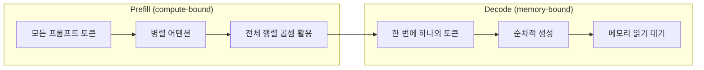
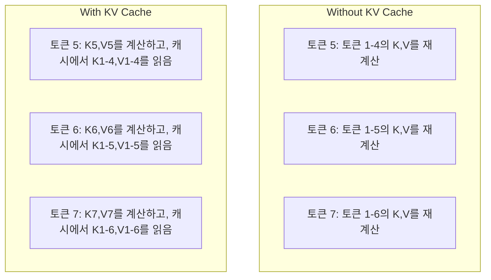
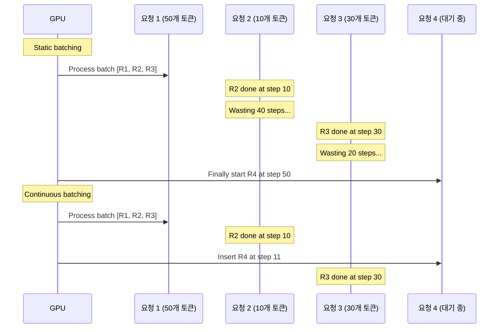
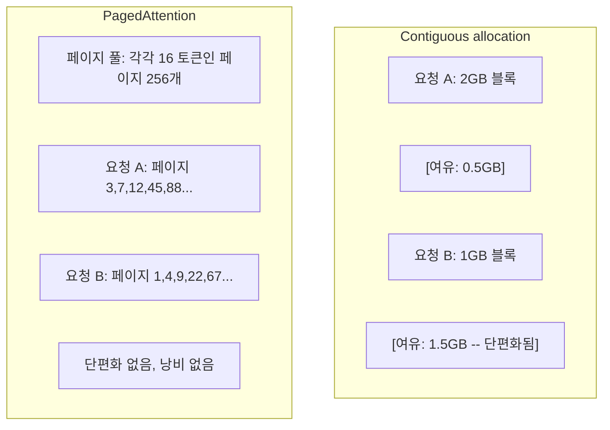
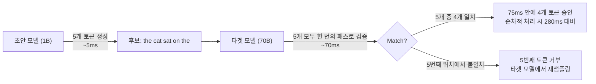

# 추론 최적화

> LLM 추론은 두 단계로 정의됩니다. 프리필(Prefill)은 프롬프트를 병렬로 처리합니다 -- 연산 집약적입니다. 디코딩(Decode)은 토큰을 하나씩 생성합니다 -- 메모리 집약적입니다. 모든 최적화는 이 두 단계 중 하나 또는 둘 모두를 목표로 합니다.

**유형:** Build
**언어:** Python
**선수 요건:** 10단계, 01-08강 (트랜스포머 아키텍처, 어텐션)
**시간:** 약 120분

## 학습 목표

- 자기회귀(Autoregressive) 토큰 생성 중 중복 연산을 제거하기 위해 KV 캐시(KV Cache)를 구현해 보세요
- LLM 추론의 프리필(Prefill)과 디코딩(Decode) 단계를 설명하고, 각 단계가 서로 다른 병목 현상(연산 집약적 vs 메모리 집약적)을 갖는 이유를 이해해 보세요
- 동시 요청 하에서 GPU 활용률을 극대화하기 위해 연속 배치(Continuous Batching)와 PagedAttention 개념을 구현해 보세요
- 추론 최적화 기법(KV 캐시, 추론적 디코딩(Speculative Decoding), 플래시 어텐션)을 비교하고, 처리량 및 지연 시간의 트레이드오프를 분석해 보세요

## 문제점

4xA100 GPU에 Llama 3 70B를 배포했습니다. 단일 사용자는 초당 약 50토큰을 받습니다. 빠르다고 느껴집니다. 그런데 100명의 사용자가 엔드포인트에 동시에 접속합니다. 처리량이 사용자당 초당 3토큰으로 떨어집니다. 월 25,000달러의 GPU 비용이 사람이 타이핑하는 속도보다 느린 응답을 서빙하고 있습니다.

1명의 사용자와 100명의 사용자 사이에서 모델 자체는 변하지 않습니다. 동일한 가중치, 동일한 아키텍처, 동일한 연산입니다. 변하는 것은 작업을 스케줄링하는 방식입니다. 단순한 추론은 가용 GPU 연산의 90% 이상을 낭비합니다. 47번째 토큰을 기다리는 사용자는 행렬 곱(matmul) 사이에 GPU 메모리 버스가 유휴 상태인 동안 전체 배치 슬롯을 점유하고 있습니다. 그 사이, 새 사용자의 2,000토큰 프롬프트는 그 유휴 시간을 유용한 연산으로 채울 수 있습니다.

이는 확장성 문제가 아니라 스케줄링 문제입니다. 이 강의의 기법들 -- KV 캐싱, 연속 배치, PagedAttention, 추론적 디코딩(Speculative Decoding), 접두어 캐싱(Prefix Caching) -- 은 $25k/month inference bill from a $5k/month의 단일 서빙이 동일한 트래픽을 처리하는 것과 구분됩니다.

vLLM은 4xA100-80GB에서 Llama 3 70B를 서빙하며, 낮은 동시성에서 사용자당 초당 약 50토큰을 달성하고, 연속 배치와 PagedAttention을 통해 100개의 동시 요청에서 사용자당 15-25 TPS를 유지합니다. 이러한 최적화 없이는 동일한 하드웨어가 해당 동시성에서 사용자당 5 TPS를 서빙합니다. 동일한 GPU, 동일한 모델, 처리량은 4배입니다.

## 개념

### 프리필(Prefill) vs 디코딩(Decode)

모든 LLM 추론 요청은 두 가지 명확한 단계로 나뉩니다.

**프리필(Prefill)**은 전체 입력 프롬프트를 처리합니다. 모든 토큰이 이미 알려져 있으므로, 전체 시퀀스에 걸쳐 어텐션을 병렬로 계산할 수 있습니다. 이는 대규모 행렬 곱셈 연산이며, GPU 코드는 계속 바쁘게 작동합니다. 병목 현상은 연산 능력, 즉 하드웨어가 초당 처리할 수 있는 FLOPS에 있습니다. A100은 312 TFLOPS (BF16)를 수행합니다. 70B 모델에서 4,096개 토큰의 프롬프트에 대한 프리필은 단일 A100에서 약 400ms가 소요됩니다.

**디코딩(Decode)**은 출력 토큰을 하나씩 생성합니다. 각 새 토큰은 이전 모든 토큰에 어텐션을 적용하지만, 한 번의 순전파(forward pass)마다 토큰은 하나만 생성됩니다. 가중치 행렬의 크기는 프리필 단계와 동일하지만, 행렬이 아닌 단일 벡터와 곱셈을 수행합니다. GPU 코드는 마이크로초 단위로 연산을 완료한 후, 메모리에서 다음 가중치 배치가 도착할 때까지 대기합니다. 병목 현상은 메모리 대역폭, 즉 HBM에서 연산 유닛으로 모델 가중치를 얼마나 빠르게 스트리밍할 수 있는지에 있습니다. A100은 2 TB/s의 대역폭을 가집니다. FP16의 70B 모델은 140 GB입니다. 전체 모델을 한 번 읽는 데 70ms가 걸리며, 이는 단일 디코딩 단계의 하한선입니다.



**연산/바이트 비율**(ops:byte ratio, 산술 강도(arithmetic intensity)라고도 함)은 이 트레이드오프를 포착합니다. 이는 메모리에서 로드한 바이트당 수행하는 연산의 수를 측정합니다.

```
ops:byte ratio = FLOPs per token / bytes read from memory
```

4,096개 토큰의 배치를 사용하는 프리필 단계에서는 로드된 가중치당 약 4,096번의 곱셈-누적 연산을 수행합니다. 비율이 높으므로 연산 바운드(compute-bound) 상태입니다. 배치 크기가 1인 디코딩 단계에서는 로드된 가중치당 약 1번의 연산을 수행합니다. 비율이 낮으므로 메모리 바운드(memory-bound) 상태입니다.

핵심 통찰은 *디코딩이 메모리 바운드인 이유는 단일 토큰을 생성하기 위해 전체 모델을 읽어야 하기 때문*이라는 점입니다. 아래 모든 최적화는 읽는 양을 줄이거나, 읽기당 처리하는 토큰 배치를 늘리거나, 읽기를 완전히 피하는 방식으로 작동합니다.

### KV 캐시(KV Cache)

어텐션 과정에서 각 토큰의 쿼리는 이전 모든 토큰의 키 및 값 벡터를 참조합니다. 캐싱이 없으면 토큰 N을 생성할 때 앞선 N-1개 토큰의 키 및 값 투영을 모두 다시 계산해야 합니다. 토큰 1은 토큰 2를 생성할 때 투영되고, 토큰 3을 생성할 때 다시 투영되며, 토큰 4를 생성할 때 또다시 투영됩니다. 토큰 1,000에 이르면 토큰 1은 총 999번 투영됩니다.

KV 캐시는 이전 모든 토큰의 키 및 값 투영을 저장합니다. 토큰 N을 생성할 때는 토큰 N의 키와 값만 계산한 후, 토큰 1부터 N-1까지의 캐시된 K/V와 연결합니다.



**KV 캐시 메모리 공식:**

```
KV cache size = 2 * num_layers * num_kv_heads * head_dim * seq_len * bytes_per_param
```

Llama 3 70B (80층, GQA를 사용하는 8개의 KV 헤드, head_dim=128, BF16)의 경우:

```
per token: 2 * 80 * 8 * 128 * 2 bytes = 327,680 bytes = 320 KB
at 4,096 tokens: 320 KB * 4,096 = 1.28 GB
at 128K tokens: 320 KB * 131,072 = 40 GB
```

Llama 3 70B에서 128K 컨텍스트의 단일 대화는 40 GB의 KV 캐시를 소비하며, 이는 A100 메모리의 절반입니다. 4K 토큰을 사용하는 100명의 동시 사용자라면 KV 캐시만으로도 128 GB가 필요합니다. 이것이 KV 캐시 관리가 추론 최적화의 핵심 과제인 이유입니다.

### 연속 배치(Continuous Batching)

정적 배치는 N개의 요청이 도착할 때까지 기다린 후 함께 처리하며, *모든* 요청이 완료될 때까지 새 요청을 받지 않습니다. 한 요청이 500개 토큰이 필요하고 다른 요청이 10개 토큰이 필요하다면, 짧은 요청은 완료된 후 490번의 디코딩 단계 동안 유휴 상태로 대기합니다.

연속 배치(iteration-level batching라고도 함)는 요청이 완료되는 즉시 새 요청을 배치에 삽입합니다. 매 디코딩 단계마다 배치를 재평가합니다. 10개 토큰 후 완료된 요청은 즉시 대기 중인 요청으로 대체됩니다.



처리량 개선은 출력 길이의 변동 폭에 따라 달라집니다. 길이가 균일한 경우 연속 배치는 정적 배치와 동일한 성능을 냅니다. 길이가 변동하는 경우(일반적인 상황)에는 GPU 슬롯이 비어 있는 시간이 없으므로 연속 배치가 2~5배 더 높은 처리량을 제공할 수 있습니다.

### PagedAttention

각 요청의 KV 캐시는 메모리의 연속된 블록입니다. 요청이 들어오고 나갈 때 메모리가 조각납니다. 이는 운영체제의 RAM 단편화와 정확히 동일한 현상입니다. 4K 토큰 요청은 1.28 GB의 연속된 메모리가 필요합니다. 총 여유 메모리가 2 GB라 하더라도 1.28 GB의 *연속된* 메모리가 없을 수 있습니다. 메모리를 낭비하거나 요청을 거부해야 합니다.

PagedAttention(vLLM에서 유래)은 OS 스타일의 가상 메모리를 KV 캐시에 적용합니다. 요청당 하나의 연속된 블록을 할당하는 대신 고정 크기의 "페이지"(일반적으로 각각 16 토큰)를 할당합니다. 페이지는 물리적 GPU 메모리의 어디에나 위치할 수 있습니다. 페이지 테이블은 각 요청의 논리적 시퀀스 위치를 물리적 페이지 위치로 매핑합니다.



PagedAttention은 공유 접두어에 대해 **카피 온 라이트(copy-on-write)**를 가능하게 합니다. 50개 요청이 동일한 시스템 프롬프트를 공유하는 경우, 해당 시스템 프롬프트의 KV 캐시 페이지는 한 번만 저장되고 모든 50개 요청이 이를 참조합니다. 요청이 분기될 때(다른 사용자 메시지)에만 자체 페이지를 할당합니다. 이는 공유 시스템 프롬프트가 있는 애플리케이션에서 메모리 사용을 극적으로 줄입니다.

vLLM은 PagedAttention을 통해 메모리 낭비를 거의 제로(~4%)로 보고합니다(소박한 할당 방식의 ~60-80% 대비).

### 추론적 디코딩(Speculative Decoding)

디코딩은 순차적이므로 느립니다. 한 토큰을 생성하고, 이를 다시 입력하여 다음 토큰을 생성합니다. 하지만 다음 5개 토큰을 저렴하게 추측한 후, 한 번에 모두 검증할 수 있다면 어떨까요?

추론적 디코딩(Speculative Decoding)은 작고 빠른 **초안 모델(draft model)**을 사용하여 K개의 후보 토큰을 생성합니다. 이후 큰 **타겟 모델(target model)**이 K개의 후보를 단일 순방향 패스(forward pass)로 처리합니다 (이는 프리필(prefill)처럼 병렬적이고, 연산 집약적이며, 효율적입니다). 타겟 모델이 초안 모델의 예측에 동의하면, 타겟 모델의 순방향 패스 한 번의 시간 안에 K개의 토큰을 모두 승인합니다. 위치 j에서 동의하지 않으면, 토큰 1부터 j-1까지 승인하고 나머지는 폐기합니다.



속도 향상은 **수락률(acceptance rate)**에 따라 달라집니다 -- 초안 모델의 예측이 타겟 모델과 얼마나 자주 일치하는지입니다. Llama 3 8B가 Llama 3 70B를 위해 초안을 생성할 경우, 자연어에서 수락률은 일반적으로 70-85%입니다. 이는 디코딩 속도를 2-3배 향상시킵니다.

추론적 디코딩의 세 가지 접근법:

| 방법 | 초안 출처 | 수락률 | 오버헤드 |
|--------|-------------|-----------------|----------|
| 초안-타겟 (Leviathan et al.) | 별도 소형 모델 | 70-85% | 초안 모델 메모리 |
| EAGLE (Li et al.) | 타겟 모델의 경량 헤드 | 75-90% | ~1% 추가 매개변수 |
| N-gram 조회 | 토큰 n-gram 테이블 | 40-60% | 무시할 수준 |

**EAGLE**는 타겟 모델의 은닉 상태(hidden states) 위에 작은 자기회귀 헤드를 훈련합니다. 타겟 모델의 마지막에서 두 번째 레이어의 특징(features)을 사용하여 다음 토큰의 임베딩(embedding)을 예측합니다. 타겟 모델 자체의 표현(representations)을 사용하므로 (별도 모델이 아닌), 최소한의 추가 메모리로 더 높은 수락률을 달성합니다. EAGLE-2는 컨텍스트에 따라 후보 수를 조정하는 동적 초안 트리를 추가합니다.

**N-gram 추론적 디코딩**은 현재 컨텍스트나 미리 구축된 코퍼스의 n-gram 연속성을 유지하는 테이블을 사용합니다. 초안이 같은 대화에서 이전에 나타난 패턴 (반복적인 패턴, 코드, 구조화된 출력)과 일치하면, 신경망 오버헤드 없이 작동합니다. 평균 수락률은 낮지만, 추론(speculation)당 비용은 사실상 무료입니다.

추론적 디코딩(Speculative Decoding)은 *수학적으로 정확합니다* -- 출력 분포는 대상 모델의 분포와 동일합니다. 이는 근사치가 아닙니다. 검증 단계는 모든 승인된 토큰이 대상 모델이 부여했을 정확한 확률을 갖도록 보장합니다.

### 접두어 캐싱(Prefix Caching)

많은 요청이 동일한 접두어를 공유합니다. 챗봇 시스템 프롬프트, RAG (검색 증강 생성)(RAG (Retrieval-Augmented Generation)) 컨텍스트 블록, 소수 예시(Few-Shot) 세트가 그 예입니다. 접두어 캐싱이 없으면 모든 요청이 이러한 공유 토큰에 대해 KV 캐시를 처음부터 다시 계산합니다.

접두어 캐싱은 공통 접두어에 대한 KV 캐시를 저장하고 요청 간에 이를 재사용합니다. 알려진 접두어를 가진 새 요청이 도착하면, 시스템은 캐시된 KV 항목을 복사(또는 참조)하고 고유한 접미어에 대해서만 KV를 계산합니다.

모든 요청에서 공유되는 2,000토큰 시스템 프롬프트의 경우, 접두어 캐싱은 요청당 프리필(Prefill) 시간을 약 400ms 제거합니다. 초당 100요청이 발생하면, 이는 초당 40초의 GPU 연산을 절약하는 것으로 -- GPU 하나 이상의 작업량에 해당합니다.

SGLang의 RadixAttention은 토큰 내용으로 접두어를 인덱싱하는 래디스 트리(trie)를 사용하여 접두어 캐싱을 구현합니다. 저장된 접두어와 일치하는 모든 요청은 KV 캐시를 무료로 얻습니다. 이 트리는 부분 접두어 매칭을 가능하게 합니다 -- 캐시된 항목과 2,000개 접두어 토큰 중 1,500개를 공유한다면, 그 1,500개를 재사용하고 나머지 500개만 다시 계산합니다.

### 추론 엔진(Inference Engines)

세 가지 엔진이 프로덕션 LLM (대규모 언어 모델)(LLM (Large Language Model)) 서빙을 지배합니다:

| 엔진 | 주요 혁신 | 최적 용도 |
|--------|---------------|----------|
| vLLM | 페이지드 어텐션(PagedAttention), 연속 배치(Continuous Batching) | 범용 서빙, 최고 호환성 |
| SGLang | RadixAttention (접두어 캐싱), 구조화된 출력(Structured Output) | 다중 턴 챗봇, 제약 디코딩(제약 디코딩) |
| TensorRT-LLM | NVIDIA 커널 융합, FP8 양자화(Quantization) | NVIDIA 하드웨어에서 최대 단일 GPU 처리량 |

**vLLM**은 기본 시작점입니다. 가장 넓은 범위의 모델을 지원하며, 모든 GPU 벤더(NVIDIA, AMD, Intel)에서 실행되고, 페이지드 어텐션(PagedAttention) + 연속 배치(Continuous Batching)를 통해 강력한 처리량을 달성합니다. OpenAI 호환 API는 OpenAI API 호출의 대체제로 이를 쉽게 도입할 수 있음을 의미합니다.

**SGLang**은 vLLM과 동일한 기반 위에 구축되지만, 접두어 캐싱을 위한 RadixAttention과 구조화된 LLM 프로그램을 위한 도메인 특화 언어를 추가합니다. 워크로드가 다중 턴 대화, 도구 사용, 또는 제약 디코딩(JSON 출력, 정규식 가이드 생성)을 포함하는 경우, SGLang은 접두어 재사용을 통해 vLLM보다 2-5배 더 높은 성능을 달성하는 경우가 많습니다.

**TensorRT-LLM**은 모델을 최적화된 NVIDIA GPU 커널로 컴파일합니다. 연산(어텐션 + 선형 + 활성화 함수를 하나의 커널로)을 융합하고, H100 GPU에서 FP8을 사용하며, 프로덕션 배포를 위해 NVIDIA Triton Inference Server와 통합됩니다. NVIDIA 하드웨어에서 단일 GPU 기준 가장 높은 처리량을 달성하지만, 더 많은 설정이 필요하며 NVIDIA GPU에서만 작동합니다.

Llama 3 70B의 실제 수치 (4xA100-80GB, BF16):

| 지표 | vLLM | SGLang | TensorRT-LLM |
|--------|------|--------|---------------|
| 처리량 (1 사용자) | ~50 TPS | ~55 TPS | ~65 TPS |
| 처리량 (100 사용자) | ~2,500 총 TPS | ~3,200 총 TPS | ~3,000 총 TPS |
| 첫 토큰까지의 시간 (TTFT) | ~400ms | ~300ms (접두어 적중) | ~350ms |
| 최대 컨텍스트 | 128K | 128K | 128K |

### Ops:Byte 프레임워크

측정하지 않는 것은 최적화할 수 없습니다. ops:byte 비율은 연산 바운드(compute-bound)인지 메모리 바운드(memory-bound)인지 알려주며, 이는 어떤 최적화가 중요한지 결정합니다.

```
Compute roof: peak FLOPS of the GPU
Memory roof:  peak bandwidth * ops:byte ratio
```

ops:byte가 낮을 때(디코딩, 작은 배치)는 메모리 대역폭 한계에 도달합니다. 더 많은 연산(더 높은 클럭, 더 많은 코어)을 추가해도 도움이 되지 않습니다. 메모리 읽기를 줄이는(양자화, KV 캐시 압축) 방법이나 더 많은 유용한 작업에 읽기를 분담(amortize)하기 위해 배치 크기를 늘리는 방법이 필요합니다.

ops:byte가 높을 때(프리필, 큰 배치)는 연산 한계에 도달합니다. 메모리 대역폭 최적화는 도움이 되지 않습니다. 더 빠른 GPU, 커널 융합, 또는 더 낮은 정밀도를 사용하여 FLOPS를 더 많이 확보해야 합니다.

| 시나리오 | ops:byte | 바운드 | 최적화 방법 |
|----------|----------|-------|---------------|
| 프리필, batch=1 | ~4,096 | 연산 | 커널 융합, FP8 |
| 디코딩, batch=1 | ~1 | 메모리 | 양자화, KV 압축 |
| 디코딩, batch=32 | ~32 | 메모리 | 더 큰 배치, 연속 배치 |
| 디코딩, batch=256 | ~256 | 전환 중 | 둘 다 중요 |
| 디코딩, 배치=1024 | ~1,024 | 연산 | 커널 융합, 텐서 병렬화 |

A100에서의 교차점은 ops:byte = 156 (312 TFLOPS / 2 TB/s) 부근입니다. 156 미만에서는 메모리 바운드(memory-bound) 상태이고, 156 초과에서는 연산 바운드(compute-bound) 상태입니다. 연속 배치(Continuous Batching)는 반복마다 더 많은 토큰을 패킹하여 디코딩을 이 교차점 쪽으로 밀어냅니다.

```figure
context-window-slide
```

## 구현하기

### 1단계: 처음부터 KV 캐시 만들기

레이어별, 헤드별 키 및 값 투영을 저장하는 멀티헤드 KV 캐시를 구축하고, 메모리 증가 패턴을 시연합니다.

```python
import numpy as np

class KVCache:
    def __init__(self, num_layers, num_heads, head_dim, max_seq_len, dtype=np.float16):
        self.num_layers = num_layers
        self.num_heads = num_heads
        self.head_dim = head_dim
        self.max_seq_len = max_seq_len
        self.dtype = dtype

        self.k_cache = np.zeros(
            (num_layers, num_heads, max_seq_len, head_dim), dtype=dtype
        )
        self.v_cache = np.zeros(
            (num_layers, num_heads, max_seq_len, head_dim), dtype=dtype
        )
        self.seq_len = 0

    def update(self, layer_idx, new_keys, new_values):
        num_new = new_keys.shape[1]
        end = self.seq_len + num_new
        self.k_cache[layer_idx, :, self.seq_len:end, :] = new_keys
        self.v_cache[layer_idx, :, self.seq_len:end, :] = new_values
        return (
            self.k_cache[layer_idx, :, :end, :],
            self.v_cache[layer_idx, :, :end, :]
        )

    def advance(self, num_tokens):
        self.seq_len += num_tokens

    def memory_bytes(self):
        return self.k_cache.nbytes + self.v_cache.nbytes

    def used_bytes(self):
        per_token = 2 * self.num_layers * self.num_heads * self.head_dim * np.dtype(self.dtype).itemsize
        return per_token * self.seq_len
```

### 2단계: KV 캐시를 사용한 어텐션

디코딩 단계에서 KV 캐시를 사용하는 단순화된 멀티헤드 어텐션입니다.

```python
def scaled_dot_product_attention(query, keys, values):
    head_dim = query.shape[-1]
    scores = np.matmul(query, keys.transpose(0, 1, 3, 2)) / np.sqrt(head_dim)
    seq_len_q = scores.shape[-2]
    seq_len_k = scores.shape[-1]
    if seq_len_q > 1:
        mask = np.triu(np.ones((seq_len_q, seq_len_k), dtype=np.float32), k=seq_len_k - seq_len_q + 1)
        scores = scores + mask * (-1e9)
    max_scores = np.max(scores, axis=-1, keepdims=True)
    exp_scores = np.exp(scores - max_scores)
    attn_weights = exp_scores / np.sum(exp_scores, axis=-1, keepdims=True)
    return np.matmul(attn_weights, values)


class MultiHeadAttention:
    def __init__(self, d_model, num_heads):
        self.num_heads = num_heads
        self.head_dim = d_model // num_heads
        scale = np.sqrt(2.0 / d_model)
        self.W_q = np.random.randn(d_model, d_model).astype(np.float32) * scale
        self.W_k = np.random.randn(d_model, d_model).astype(np.float32) * scale
        self.W_v = np.random.randn(d_model, d_model).astype(np.float32) * scale
        self.W_o = np.random.randn(d_model, d_model).astype(np.float32) * scale

    def forward(self, x, kv_cache=None, layer_idx=0):
        batch, seq_len, d_model = x.shape
        Q = np.matmul(x, self.W_q).reshape(batch, seq_len, self.num_heads, self.head_dim).transpose(0, 2, 1, 3)
        K = np.matmul(x, self.W_k).reshape(batch, seq_len, self.num_heads, self.head_dim).transpose(0, 2, 1, 3)
        V = np.matmul(x, self.W_v).reshape(batch, seq_len, self.num_heads, self.head_dim).transpose(0, 2, 1, 3)

        if kv_cache is not None:
            K_full, V_full = kv_cache.update(layer_idx, K[0], V[0])
            K = K_full[np.newaxis, :, :, :]
            V = V_full[np.newaxis, :, :, :]
            if seq_len == 1:
                kv_cache.advance(1)

        attn_out = scaled_dot_product_attention(Q, K, V)
        attn_out = attn_out.transpose(0, 2, 1, 3).reshape(batch, -1, d_model)
        return np.matmul(attn_out, self.W_o)
```

### 3단계: 연속 배치 시뮬레이터

정적 배치와 연속 배치 간의 스케줄링 차이를 시뮬레이션합니다.

```python
import heapq

class Request:
    def __init__(self, request_id, prompt_tokens, output_tokens, arrival_step):
        self.request_id = request_id
        self.prompt_tokens = prompt_tokens
        self.output_tokens = output_tokens
        self.arrival_step = arrival_step
        self.tokens_generated = 0
        self.start_step = None
        self.end_step = None

    def is_done(self):
        return self.tokens_generated >= self.output_tokens


def simulate_static_batching(requests, batch_size):
    step = 0
    completed = []
    queue = list(requests)
    queue.sort(key=lambda r: r.arrival_step)

    while queue:
        batch = []
        while queue and len(batch) < batch_size:
            r = queue.pop(0)
            r.start_step = max(step, r.arrival_step)
            batch.append(r)

        if batch:
            step = max(step, max(r.start_step for r in batch))
            max_output = max(r.output_tokens for r in batch)
            for r in batch:
                r.tokens_generated = r.output_tokens
                r.end_step = step + max_output
            step += max_output
            completed.extend(batch)

    return completed


def simulate_continuous_batching(requests, batch_size):
    step = 0
    completed = []
    queue = sorted(requests, key=lambda r: r.arrival_step)
    queue_idx = 0
    active = []
    waiting = []

    while queue_idx < len(queue) or active or waiting:
        while queue_idx < len(queue) and queue[queue_idx].arrival_step <= step:
            waiting.append(queue[queue_idx])
            queue_idx += 1

        while waiting and len(active) < batch_size:
            r = waiting.pop(0)
            r.start_step = step
            active.append(r)

        if not active:
            if waiting:
                step += 1
                continue
            elif queue_idx < len(queue):
                step = queue[queue_idx].arrival_step
                continue
            else:
                break

        for r in active:
            r.tokens_generated += 1

        done = [r for r in active if r.is_done()]
        for r in done:
            r.end_step = step + 1
            completed.append(r)
        active = [r for r in active if not r.is_done()]

        step += 1

    return completed


def batching_stats(completed):
    latencies = [r.end_step - r.arrival_step for r in completed]
    total_time = max(r.end_step for r in completed) - min(r.arrival_step for r in completed)
    total_tokens = sum(r.output_tokens for r in completed)
    return {
        "avg_latency": np.mean(latencies),
        "p50_latency": np.median(latencies),
        "p99_latency": np.percentile(latencies, 99),
        "total_time": total_time,
        "throughput": total_tokens / total_time if total_time > 0 else 0,
    }
```

### 4단계: 접두어 캐시

공유 접두어에 대한 KV 항목을 저장하는 트라이(trie) 기반 접두어 캐시입니다.

```python
class TrieNode:
    def __init__(self):
        self.children = {}
        self.kv_data = None
        self.hit_count = 0


class PrefixCache:
    def __init__(self, max_entries=1000):
        self.root = TrieNode()
        self.max_entries = max_entries
        self.total_entries = 0
        self.hits = 0
        self.misses = 0

    def _walk(self, token_ids):
        node = self.root
        depth = 0
        for tid in token_ids:
            if tid not in node.children:
                break
            node = node.children[tid]
            depth += 1
        return node, depth

    def lookup(self, token_ids):
        node, depth = self._walk(token_ids)
        if depth > 0:
            self.hits += 1
            current = self.root
            for tid in token_ids[:depth]:
                current = current.children[tid]
                current.hit_count += 1
            kv_entries = []
            current = self.root
            for tid in token_ids[:depth]:
                current = current.children[tid]
                if current.kv_data is not None:
                    kv_entries.append(current.kv_data)
            return depth, kv_entries
        self.misses += 1
        return 0, []

    def insert(self, token_ids, kv_per_token):
        node = self.root
        for i, tid in enumerate(token_ids):
            if tid not in node.children:
                if self.total_entries >= self.max_entries:
                    return i
                node.children[tid] = TrieNode()
                self.total_entries += 1
            node = node.children[tid]
            if i < len(kv_per_token):
                node.kv_data = kv_per_token[i]
        return len(token_ids)

    def hit_rate(self):
        total = self.hits + self.misses
        return self.hits / total if total > 0 else 0.0
```

### 5단계: 추론적 디코딩 시뮬레이터

설정 가능한 수용률을 사용하여 초안-대상(draft-target) 추론적 디코딩(Speculative Decoding)을 시뮬레이션합니다.

```python
class DraftModel:
    def __init__(self, vocab_size, acceptance_rate=0.8):
        self.vocab_size = vocab_size
        self.acceptance_rate = acceptance_rate

    def generate(self, context, num_tokens):
        tokens = np.random.randint(0, self.vocab_size, size=num_tokens)
        return tokens

    def get_probs(self, context, token):
        probs = np.random.dirichlet(np.ones(self.vocab_size))
        return probs


class TargetModel:
    def __init__(self, vocab_size):
        self.vocab_size = vocab_size

    def get_probs(self, context, tokens=None):
        if tokens is not None:
            return [np.random.dirichlet(np.ones(self.vocab_size)) for _ in tokens]
        return np.random.dirichlet(np.ones(self.vocab_size))


def speculative_decode(draft_model, target_model, context, num_speculative=5,
                       draft_cost=1.0, target_cost=10.0, verify_cost=12.0):
    total_tokens = 0
    total_cost = 0.0
    accepted_counts = []
    context = list(context)

    max_tokens = 100

    while total_tokens < max_tokens:
        draft_tokens = draft_model.generate(context, num_speculative)
        total_cost += draft_cost * num_speculative

        target_probs = target_model.get_probs(context, draft_tokens)
        total_cost += verify_cost

        accepted = 0
        for i, token in enumerate(draft_tokens):
            draft_p = draft_model.get_probs(context + list(draft_tokens[:i]), token)
            target_p = target_probs[i]

            r = np.random.random()
            acceptance_prob = min(1.0, target_p[token] / (draft_p[token] + 1e-10))

            if r < draft_model.acceptance_rate:
                accepted += 1
                context.append(token)
                total_tokens += 1
            else:
                new_token = np.random.choice(draft_model.vocab_size, p=target_p)
                context.append(new_token)
                total_tokens += 1
                break

        accepted_counts.append(accepted)

        if accepted == num_speculative:
            bonus_probs = target_model.get_probs(context)
            bonus_token = np.random.choice(draft_model.vocab_size, p=bonus_probs)
            context.append(bonus_token)
            total_tokens += 1

    sequential_cost = total_tokens * target_cost
    return {
        "total_tokens": total_tokens,
        "speculative_cost": total_cost,
        "sequential_cost": sequential_cost,
        "speedup": sequential_cost / total_cost if total_cost > 0 else 1.0,
        "avg_accepted": np.mean(accepted_counts),
        "acceptance_rate": np.mean(accepted_counts) / num_speculative,
    }


def compare_speculation_strategies(vocab_size=1000, num_trials=20):
    results = {}

    for name, acceptance_rate, spec_tokens in [
        ("Draft-target (8B->70B)", 0.78, 5),
        ("EAGLE", 0.85, 6),
        ("N-gram", 0.50, 4),
        ("No speculation", 0.0, 0),
    ]:
        if spec_tokens == 0:
            results[name] = {
                "speedup": 1.0,
                "acceptance_rate": 0.0,
                "avg_accepted": 0.0,
            }
            continue

        trial_results = []
        for _ in range(num_trials):
            draft = DraftModel(vocab_size, acceptance_rate=acceptance_rate)
            target = TargetModel(vocab_size)
            context = list(np.random.randint(0, vocab_size, size=10))
            result = speculative_decode(draft, target, context, num_speculative=spec_tokens)
            trial_results.append(result)

        results[name] = {
            "speedup": np.mean([r["speedup"] for r in trial_results]),
            "acceptance_rate": np.mean([r["acceptance_rate"] for r in trial_results]),
            "avg_accepted": np.mean([r["avg_accepted"] for r in trial_results]),
        }

    return results
```

### 6단계: KV 캐시 메모리 프로파일러

실제 모델 구성에 대한 KV 캐시 메모리 요구 사항을 계산합니다.

```python
MODEL_CONFIGS = {
    "Llama-3-8B": {
        "num_layers": 32, "num_kv_heads": 8, "head_dim": 128,
        "model_params_b": 8, "gqa": True,
    },
    "Llama-3-70B": {
        "num_layers": 80, "num_kv_heads": 8, "head_dim": 128,
        "model_params_b": 70, "gqa": True,
    },
    "Llama-3-405B": {
        "num_layers": 126, "num_kv_heads": 8, "head_dim": 128,
        "model_params_b": 405, "gqa": True,
    },
    "Mistral-7B": {
        "num_layers": 32, "num_kv_heads": 8, "head_dim": 128,
        "model_params_b": 7, "gqa": True,
    },
    "GPT-4-est": {
        "num_layers": 120, "num_kv_heads": 96, "head_dim": 128,
        "model_params_b": 1800, "gqa": False,
    },
}


def kv_cache_memory(config, seq_len, dtype_bytes=2):
    per_token = 2 * config["num_layers"] * config["num_kv_heads"] * config["head_dim"] * dtype_bytes
    total = per_token * seq_len
    return {
        "per_token_bytes": per_token,
        "per_token_kb": per_token / 1024,
        "total_bytes": total,
        "total_mb": total / (1024 ** 2),
        "total_gb": total / (1024 ** 3),
    }


def memory_budget(config, gpu_memory_gb, model_dtype_bytes=2, kv_dtype_bytes=2):
    model_memory_gb = config["model_params_b"] * 1e9 * model_dtype_bytes / (1024 ** 3)
    overhead_gb = gpu_memory_gb * 0.1
    available_for_kv = gpu_memory_gb - model_memory_gb - overhead_gb

    if available_for_kv <= 0:
        return {"error": "Model does not fit in GPU memory", "model_memory_gb": model_memory_gb}

    per_token = 2 * config["num_layers"] * config["num_kv_heads"] * config["head_dim"] * kv_dtype_bytes
    max_tokens = int(available_for_kv * (1024 ** 3) / per_token)

    return {
        "gpu_memory_gb": gpu_memory_gb,
        "model_memory_gb": round(model_memory_gb, 1),
        "overhead_gb": round(overhead_gb, 1),
        "available_for_kv_gb": round(available_for_kv, 1),
        "max_total_tokens": max_tokens,
        "max_users_at_2k": max_tokens // 2048,
        "max_users_at_4k": max_tokens // 4096,
        "max_users_at_32k": max_tokens // 32768,
    }
```

## 사용하기

vLLM을 사용할 경우:

```python
from vllm import LLM, SamplingParams

llm = LLM(
    model="meta-llama/Meta-Llama-3-70B-Instruct",
    tensor_parallel_size=4,
    enable_prefix_caching=True,
    max_model_len=8192,
    gpu_memory_utilization=0.9,
)

params = SamplingParams(temperature=0.7, max_tokens=256)
outputs = llm.generate(["Explain inference optimization in one paragraph."], params)
```

SGLang을 사용하여 접두어 캐싱 + 구조화된 출력(Structured Output)을 사용할 경우:

```python
import sglang as sgl

@sgl.function
def classify(s, text):
    s += sgl.system("You are a classifier. Output JSON only.")
    s += sgl.user(f"Classify this text: {text}")
    s += sgl.assistant(sgl.gen("result", regex=r'\{"label": "(positive|negative|neutral)"\}'))

runtime = sgl.Runtime(model_path="meta-llama/Meta-Llama-3-70B-Instruct", tp_size=4)
sgl.set_default_backend(runtime)

results = classify.run_batch([
    {"text": "This product is amazing!"},
    {"text": "Terrible experience."},
    {"text": "It was okay I guess."},
])
```

TensorRT-LLM을 사용할 경우:

```python
import tensorrt_llm
from tensorrt_llm.runtime import ModelRunner

runner = ModelRunner.from_dir("./llama-70b-trt-engine/", rank=0)

outputs = runner.generate(
    batch_input_ids=[tokenizer.encode("Explain KV caching.")],
    max_new_tokens=256,
    temperature=0.7,
)
```

## 출시하기

이 강의는 다음을 생성합니다:
- `outputs/skill-inference-optimization.md` -- LLM 추론 서빙(Inference Serving)을 진단하고 최적화하는 스킬

## 연습 문제

1. KV 캐시 프로파일러를 수정하여 FP16, FP8, INT4 KV 캐시 양자화(Quantization)를 비교하세요. Llama 3 70B 모델에서 4K 컨텍스트 윈도우(Context Window)를 사용할 때, 4xA100-80GB 환경에서 각 양자화 방식의 최대 동시 사용자 수를 계산하세요. INT4로 KV 양자화하면 사용자 용량이 대략 4배 증가해야 합니다.

2. 연속 배치 시뮬레이터를 확장하여 GPU 활용률(각 단계에서 배치 슬롯이 채워진 비율)을 추적하세요. 출력 길이가 파레토 분포(Pareto distribution, shape=1.5, scale=20)를 따르는 50개 요청에 대해 정적 배치와 연속 배치의 활용률을 시간에 따라 플롯하세요. 연속 배치는 80% 이상의 활용률을 유지해야 합니다.

3. `num_kv_heads < num_query_heads`인 그룹화된 쿼리 어텐션(GQA) 버전의 KV 캐시를 구현해 보세요. Llama 3 70B는 64개의 쿼리 헤드를 사용하지만 KV 헤드는 8개만 사용합니다. 전체 멀티헤드 어텐션(MHA) 대비 메모리 절감량(KV 캐시 크기 8배 감소)을 계산해 보세요.

4. LRU 제거를 사용하는 프리픽스 캐시를 구축해 보세요. max_entries를 500으로 설정하고, 5개의 공통 프리픽스 중 하나를 공유하는 요청이 60%인 1,000개의 요청을 생성해 보세요. 히트율을 측정하고 무제한 캐시와 비교해 보세요. 좋은 제거 전략을 사용하면 히트율이 55% 이상 유지되어야 합니다.

5. 추론적 디코딩(Speculative Decoding) 시뮬레이터를 확장하여 트리 기반 추론(EAGLE-2 스타일)을 구현해 보세요. K개의 드래프트 토큰 단일 체인 대신 후보 트리를 생성합니다(예: 3단계 각각에서 2개 분기 = 8개 리프 후보). 선형 추론 대비 검증 라운드당 총 허용된 토큰 수를 비교해 보세요.

## 핵심 용어

| 용어 | 사람들이 말하는 것 | 실제 의미 |
|------|----------------|----------------------|
| 프리필(Prefill) | "프롬프트 처리" | 모든 입력 토큰에 대한 어텐션을 병렬로 계산 -- 전체 행렬 곱이 GPU 코어를 바쁘게 유지하므로 연산 바운드 |
| 디코딩(Decode) | "토큰 생성" | 각 순방향 패스마다 하나의 토큰을 생성하며 매번 전체 모델 가중치를 읽음 -- 연산이 다음 가중치 도착 전에 끝나므로 메모리 바운드 |
| KV 캐시 | "어텐션 상태 캐싱" | 모든 이전 토큰의 키 및 값 투영을 저장하여 각 디코딩 단계에서 재계산하지 않음 -- 메모리를 연산과 교환 |
| 연속 배치(Continuous Batching) | "동적 배치" | 요청이 완료되면 즉시 실행 중인 배치에 새 요청을 삽입하며, 전체 배치를 기다리지 않고 모든 디코딩 반복에서 평가 |
| PagedAttention | "KV 캐시를 위한 가상 메모리" | KV 캐시를 연속 블록이 아닌 고정 크기 페이지로 할당하여 메모리 파편화를 제거하고 공유 프리픽스에 대한 카피온라이트(copy-on-write)를 가능하게 함 |
| 추론적 디코딩(Speculative Decoding) | "드래프트 및 검증" | 빠른 드래프트 모델을 사용하여 여러 토큰을 제안한 후, 타겟 모델의 단일 순방향 패스로 모두 검증 -- 수학적으로 정확하며 2-3배 속도 향상 |
| EAGLE | "자기 추론적 디코딩" | 타겟 모델 자체의 은닉 상태에 경량 헤드를 훈련하는 추론적 디코딩 변형으로, 별도 드래프트 모델보다 높은 허용률을 달성 |
| 접두어 캐싱(Prefix Caching) | "시스템 프롬프트 KV 재사용" | 공통 접두어(시스템 프롬프트, 소수 예시)에 대해 계산된 KV 캐시 항목을 저장하고 요청 간에 재사용하여 중복 프리필을 생략하는 기법 |
| 연산:바이트 비율 | "연산 강도" | 연산 횟수와 메모리에서 읽은 바이트 수의 비율 -- 워크로드가 연산 바운드(높은 비율)인지 메모리 바운드(낮은 비율)인지 결정 |
| 첫 토큰까지의 시간 (TTFT)(Time to First Token (TTFT)) | "TTFT" | 요청을 수신한 후 첫 번째 출력 토큰을 생성할 때까지의 지연 시간 -- 긴 프롬프트의 경우 프리필 시간이 지배적 |

## 추가 읽기

- Kwon et al., "Efficient Memory Management for Large Language Model Serving with PagedAttention" (2023) -- 페이지드 KV 캐시(Paged KV Cache) 관리를 도입한 vLLM 논문으로, 현재 추론 서빙의 산업 표준이 되었습니다
- Leviathan et al., "Fast Inference from Transformers via Speculative Decoding" (2023) -- 초안-검증 추론이 대상 모델의 정확한 분포를 생성하면서 2-3배의 속도 향상을 달성함을 증명한 기초 논문
- Li et al., "EAGLE: Speculative Sampling Requires Rethinking Feature Uncertainty" (2024) -- 별도의 초안 모델을 사용하는 대신 대상 모델 자체의 특징에 헤드를 학습하여 더 높은 수용률을 달성합니다
- Zheng et al., "SGLang: Efficient Execution of Structured Language Model Programs" (2024) -- 접두어 캐싱을 위한 RadixAttention과 다중 호출 LLM 프로그램을 위한 프로그래밍 모델을 도입합니다
- Williams et al., "Roofline: An Insightful Visual Performance Model for Multicore Architectures" (2009) -- 연산 대 메모리 병목 현상을 추론하기 위한 연산:바이트 프레임워크를 공식화한 원조 루프라인 논문
