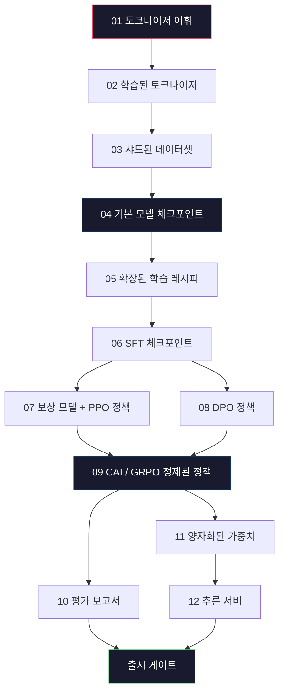
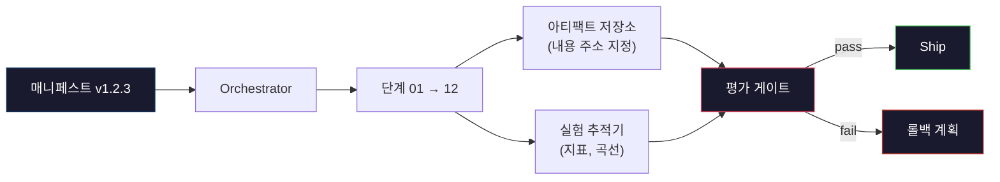

# 완전한 LLM 파이프라인 구축

> 1강부터 12강까지의 모든 내용은 하나의 파이프라인의 한 단계입니다. 이 강의는 이러한 단계들을 토큰화, 사전 학습, 스케일링, SFT, 정렬, 평가, 양자화, 서빙이라는 단일 엔드투엔드 실행으로 전환하는 뼈대입니다. 노트북에서 70B 모델을 학습하지는 않을 것입니다. 대신, 2026년 프론티어 팀이 무엇을 출시할지 결정하기 위해 사용하는 오케스트레이션 레이어, 매니페스트, 평가 게이트, 롤백 계획을 생성할 것입니다. 이것이 캡스톤입니다.

**유형:** Build
**언어:** Python (stdlib)
**선수 요건:** 10단계의 모든 01-12강
**시간:** 약 120분

## 학습 목표

- 이전 11개 강의(토크나이저, 데이터, 사전 학습, 스케일링, SFT, RLHF, DPO, CAI, 평가, 양자화, 추론)를 단일 재현 가능한 파이프라인 사양으로 구성
- 단계 간 산출물 계약 정의: 각 단계가 무엇을 소비하고, 무엇을 생성하며, 다음 단계가 입력을 어떻게 검증하는지
- 실험을 추적하고, 산출물 해시를 기록하며, 평가 임계값에 따라 출시 결정을 게이트하는 오케스트레이터 구축
- 롤백 계획 설계: 어떤 산출물이 재실행 비용이 낮은지, 어떤 산출물이 비용이 높은지, 그리고 손상된 체크포인트가 어떤 비용을 초래하는지

## 문제점

이전 강의들은 각각 잘 작동합니다. 토크나이저가 학습되었습니다. 작은 GPT가 사전 학습되었습니다. SFT 데이터셋이 조립되었습니다. 보상 모델이 학습되었습니다. DPO가 실행되었습니다. 평가가 측정되었습니다. 양자화된 가중치가 내보내졌습니다. 추론 서버가 시작되었습니다. 각각은 노트북입니다. 각각은 자체적인 관례, 자체적인 출력 경로, 자체적인 시드를 가지고 있습니다.

프론티어 학습 실행은 노트북이 아닙니다. Llama 3 405B는 약 54일 동안 3,000만 H100 시간을 사용했습니다. DeepSeek-V3는 약 280만 H800 시간을 사용했습니다. 그 기간 동안, 손상된 체크포인트 하나, 데이터 오염 하나, 평가 회귀 하나가 팀에게 일주일의 벽시계 시간과 한 달의 GPU 예산을 초래할 수 있습니다. 팀이 이를 생존하는 방법은 파이프라인 위생입니다: 모든 단계는 결정적인 입력, 결정적인 출력, 매니페스트, 해시, 게이트를 가집니다.

이것은 캡스톤 프로젝트입니다. 노트북에서 파이프라인을 엔드투엔드로 실행하지는 않습니다. 대신 각 단계를 조율하는 오케스트레이터, 실행 내용을 설명하는 매니페스트, 출시 결정을 게이트하는 검증기, 그리고 단일 파일로 제3자가 작업을 재실행할 수 있게 하는 재생(replay) 계획을 작성합니다. 코드는 작지만, 규율은 큽니다.

이 패턴은 100M에서 1T 파라미터까지 변하지 않고 확장됩니다. 동일한 네 가지 구성 요소 -- 매니페스트, 오케스트레이터, 평가 게이트, 아티팩트 저장소 --는 Llama 3도 실행하고, 당신의 취미 GPT도 실행합니다. 차이는 각 단계의 설정 내부의 숫자 크기이지, 파이프라인의 형태가 아닙니다.

## 개념

### 12단계

10단계의 모든 강은 하나의 단계입니다. 전체 의존성 그래프는 다음과 같습니다.



단계 07강 08은 병렬로 실행할 수 있습니다. 그 외의 모든 것은 하드 의존성입니다. 단계 02 (토크나이저)의 변경은 모든 하위 아티팩트를 무효화합니다. 단계 10 (평가)의 변경은 출시 결정만 무효화합니다.

### 매니페스트

매니페스트는 실행을 완전히 재생(replay)할 수 있을 정도로 설명하는 단일 파일입니다. 파이프라인이 생성하는 모든 것은 매니페스트에 없는 상태에 의존해서는 안 됩니다. 필드는 지루하지만 필수적입니다.

```
pipeline_version: 1.2.3
seed: 42
git_commit: a1b2c3d4
stages:
  01_tokenizer:
    recipe: bpe_32k
    input_hash: sha256:...
    output_hash: sha256:...
    wall_clock_sec: 3600
    cost_usd: 12
```

단계 N의 출력 해시는 단계 N+1의 입력 해시입니다. 어떤 편차라도 발생하면 파이프라인은 중단됩니다. 이렇게 데이터 손상을 조기에 포착합니다. 또한 다른 대륙의 팀원이 자신의 재생이 당신의 것과 동일한 아티팩트를 생성했는지 검증하는 방법이기도 합니다.

실제로 팀은 작은 YAML 스키마와 이전 성공적인 실행과 차이를 비교하는 매니페스트 체크어를 사용합니다. 예상 필드(비용, 벽 시계 시간) 밖의 모든 차이는 위험 신호입니다.

### 아티팩트 타입 지정

각 단계의 출력은 타입이 지정된 산출물입니다. 디렉터리 덩어리도, pickle 파일도 아닌, 알려진 스키마를 가진 명명된 타입입니다.

| 단계 | 산출물 타입 | 주요 필드 |
|-------|--------------|-----------|
| 01-02 | 토크나이저 | vocab.json, merges.txt, config.json, 해시 |
| 03 | 데이터셋 | shards[], 행 수, 토큰 수, 중복 제거 통계 |
| 04-05 | 체크포인트 | weights.safetensors, config.json, 옵티마이저 상태, 스텝 수 |
| 06 | SFT 모델 | 체크포인트 + SFT 레시피 + 데이터 믹스 |
| 07 | 보상 모델 | RM 체크포인트 + 선호 데이터 해시 |
| 08-09 | 정책 | 체크포인트 + 참조 해시 + beta + 소비된 KL 예산 |
| 10 | 평가 보고서 | 벤치마크 점수 + 회귀 차이 + 평가 데이터 해시 |
| 11 | 양자화 모델 | 양자화 가중치 + 보정 데이터 + FP16 대비 정확도 차이 |
| 12 | 서버 사양 | 엔드포인트 + 모델 해시 + 구성 + 관측 가능성 훅 |

타입 지정은 가장 흔한 실패 모드, 즉 단계 08의 출력을 단계 06의 입력으로 사용하여 DPO로 학습된 모델을 SFT 경로를 통해 출시하는 것을 방지합니다. 타입이 지정된 산출물과 타입이 지정된 단계 시그니처는 이러한 오류를 5일 차의 실패가 아닌 컴파일 타임 실패로 만듭니다.

### 평가 게이트

출시는 "학습이 완료되었습니다"가 아닙니다. 출시는 "학습이 완료되었고 평가 게이트를 통과했습니다"입니다. 게이트는 실행이 시작되기 전에 정의됩니다.

```
gates:
  mmlu:      >= baseline + 0.5   # 회귀 없음
  humaneval: >= baseline + 1.0
  truthfulqa: >= baseline         # 저하 없음
  safety_refusal_rate: <= 0.05
  kl_from_reference: <= 25.0
  cost_total_usd: <= 50000
```

모든 게이트는 수치 임계값입니다. "괜찮아 보이는" 게이트는 없습니다. 주관적인 서명 승인도 없습니다. 모든 게이트를 통과하면 산출물은 출시 가능 상태로 표시됩니다. 게이트 중 하나라도 실패하면, 실행은 지정된 리뷰어의 명시적 오버라이드를 기다리는 상태로 보류되며, 이 오버라이드 자체도 매니페스트에 기록됩니다.

두 개의 게이트가 대부분의 재앙을 잡아냅니다. *회귀* 게이트(새 모델은 핵심 벤치마크에서 이전 모델보다 적어도 같은 성능이어야 함)는 학습 버그를 잡아냅니다. *KL 예산* 게이트(정렬된 정책은 참조 모델로부터 X 이상으로 벗어날 수 없음)는 정렬 과열을 잡아냅니다. 모든 프로덕션 파이프라인에는 두 게이트가 모두 있습니다.

### 오케스트레이터

매니페스트를 읽고, 단계를 분배하며, 산출물을 추적하고, 계약 위반이 발생하면 즉시 중단하는 작은 코드 조각입니다. Airflow가 아닙니다. Kubeflow도 아닙니다. 파이프라인 위생(pipeline hygiene)을 위해선 직접 작성한 지루한(boring) 코드가 필요합니다.

오케스트레이터의 역할은 좁습니다:

1. 매니페스트에서 DAG를 해석합니다.
2. 각 단계에 대해, 올바른 해시로 예상된 출력이 이미 존재하는지 확인합니다(존재하면 건너뜁니다).
3. 단계를 실행하고, stdout/stderr를 캡처하며, 실시간(wall clock)과 비용을 측정합니다.
4. 출력 해시를 하류(downstream) 단계의 예상 입력 해시와 비교하여 검증합니다.
5. 실패 시, 실패한 단계를 정확히 기록한 부분 매니페스트를 작성하고 비영(nonzero)으로 종료합니다.

이것은 Python으로 약 200줄입니다. 이 강의의 `code/main.py` 파일처럼 보일 것입니다. 내부적으로는, 실제 파이프라인은 클러스터에서 개별 단계를 실행하기 위해 `torchrun` 또는 `ray`를 사용하지만, 오케스트레이터 자체는 단일 머신(single box)에서 실행됩니다.

### 실험 추적 및 산출물 저장

두 개의 외부 시스템이 파이프라인을 고정(anchor)합니다.

**실험 트래커 (wandb, neptune, mlflow).** 각 단계별 손실 곡선, 평가 지표, 시스템 텔레메트리를 기록합니다. 3주 후에 실행 A와 실행 B를 비교해야 할 때 트래커를 참조합니다. 팀은 거의 항상 호스팅된 트래커를 사용합니다. 직접 트래커를 작성하는 것은 훈련에 써야 할 시간을 낭비합니다.

**산출물 저장소 (S3, R2, GCS).** 체크포인트, 데이터셋, 토크나이저, 평가 보고서를 위한 불변(immutability) 객체 저장소입니다. 산출물은 파일명이 아닌 해시로 참조됩니다. `latest.pt` 같은 파일명은 함정(foot-gun)이며, `ckpt-7b-step-20000-sha256:abc123.safetensors`는 계약(contract)입니다.

오케스트레이터는 두 시스템 모두에 기록합니다. 트래커는 차트를 보는 인간을 위한 것입니다. 산출물 저장소는 입력을 조회하는 다음 단계를 위한 것입니다.

### 비용 산정

프론티어 런(frontier run)에는 달러 금액이 첨부됩니다. 예산 규율은 두 곳에서 이루어집니다.

**사전 실행 추정.** 매니페스트에서 예상 FLOPs (사전 훈련의 경우: 6 x 매개변수 x 토큰), 예상 GPU 시간 (FLOPs / 피크 처리량 / 가동률), 그리고 현재 임대료(rate) 기준의 달러 비용을 계산합니다. 추정치가 예산 게이트를 초과하면 파이프라인은 시작을 거부합니다.

**실행 중 추적.** 단계별 실제 시간과 비용이 매니페스트에 기록됩니다. 모든 단계가 끝난 후, 남은 예산이 확인됩니다. 한 단계가 예산을 초과하면, 다음 단계의 게이트는 새로운 남은 예산으로 평가됩니다. VC가 전화했을 때 예산이 떨어졌다는 사실을 뒤늦게 알게 되는 일은 없습니다.

Llama 3의 보고된 비용은 $61M. DeepSeek-V3 reported $5.6M로 주요 사전 학습 실행에 대한 것이었습니다. 이 비율은 주로 하드웨어 효율성과 혼합 전문가(MoE)에 기인합니다 -- 하지만 구체적인 비용이 가시적인 이유는 두 팀 모두 실행 단위가 아닌 단계별로 비용을 추적했기 때문입니다.

### 재현성과 결정성

이 둘은 같지 않습니다. *재현성*은 동일한 매니페스트, 동일한 코드, 동일한 인프라가 다운스트림 지표가 동등한 체크포인트를 생성함을 의미합니다. *결정성*은 비트 단위로 동일한 출력임을 의미합니다.

현대 LLM 학습은 재현 가능하지만 결정적이지는 않습니다. 분산 학습의 감소 순서, GPU 커널 비결정성(cuBLAS, flash-attn), 혼합 정밀도 반올림이 결합되어 실행 간에 1e-5 수준에서 서로 다른 floats를 생성합니다. 이는 변하지 않는 최종 지표에는 문제가 없습니다. 비트 단위 diff로 디버깅하려는 경우 이는 치명적입니다. 해결책은 모든 단계의 입력 해시, 출력 해시, 주요 지표를 기록하는 것입니다 -- 이 값들이 일치하면 가중치가 비트 단위로 동일하지 않더라도 실행은 "재현"된 것으로 간주됩니다.



### 롤백 계획

실행이 시작되기 전에, 각 단계가 실패했을 때 일어나는 일을 기록해 두세요. 세 가지 범주입니다.

- **재실행이 저렴함** (수 시간): 토크나이저, 평가, 양자화, 추론 서버. 그냥 재실행하세요.
- **중간** (수 일): SFT, DPO, CAI. 기본 모델을 유지하고 정렬 단계만 재실행하세요.
- **고비용** (수 주 및 수백만 달러): 사전 학습. 여기서 롤백 계획은 "재실행"이 아닙니다. "마지막 좋은 체크포인트를 사용하고 수정된 데이터로 더 저렴한 다운스트림 단계를 재실행하는 것"입니다.

스테이지 의존성이 타입이 지정되고 해시 처리되어, 오케스트레이터는 롤백 집합을 자동으로 계산할 수 있습니다: 실패한 스테이지와 모든 후속 스테이지를 무효화합니다. 스테이지 06 (SFT)에서 실패하면 06, 07, 08, 09, 10, 11, 12가 무효화됩니다. 스테이지 11 (양자화)에서 실패하면 11강 12만 무효화됩니다. 이를 사전에 명시하면 새벽 4시에 팀이 지쳐 있을 때 즉흥적으로 대응하지 않아도 됩니다.

### 2026년 관찰된 프로덕션 레시피

대부분의 프론티어 팀은 동일한 골격으로 수렴했습니다.

- 토크나이저: 바이트 폴백이 포함된 128k BPE. 작고 균형 잡힌 다국어 슬라이스로 학습했습니다.
- 사전 학습: 10-20T 토큰, 대부분 웹 + 코드 + 합성 데이터. Muon 또는 AdamW 옵티마이저. FSDP2 또는 DeepSpeed ZeRO-3. 기울기 체크포인팅. BF16 가중치, FP32 마스터.
- SFT: 500k-2M 지시문 쌍, 인간 및 합성 데이터 혼합, 평가 세트에 대한 엄격한 중복 제거 포함.
- 정렬: DPO 또는 CAI + GRPO. 선호 신호가 DPO에 대해 너무 다차원적인 경우에만 RLHF를 사용합니다.
- 평가: MMLU-Pro, MATH, HumanEval+, GPQA, SWE-Bench Verified, LiveBench, 그리고 공개되지 않는 비공개 홀드아웃 세트 포함.
- 양자화: 서빙용 4-bit GPTQ 또는 AWQ, 정확도 차이가 중요한 안전 평가용 8-bit.
- 서빙: vLLM, TensorRT-LLM 또는 자체 구축. 연속 배치. 추론적 디코딩. KV 캐시 제거.

숫자는 6개월마다 변합니다. 골격은 변하지 않습니다.

```figure
beam-search
```

## 구현하기

이 강의의 코드는 오케스트레이터와 매니페스트 검사기이며, 12개의 학습 스크립트가 아닙니다. 각 스테이지는 올바른 형태와 해시를 가진 출력 아티팩트를 생성하는 플레이스홀더로 시뮬레이션됩니다. 오케스트레이터를 엔드투엔드로 실행하면 실제 스테이지에 GPU 비용을 소모하기 전에 파이프라인의 배관이 작동함을 증명합니다.

전체 구현은 `code/main.py`를 참조하세요. 주요 구성 요소는 다음과 같습니다:

- `Manifest` 데이터 클래스: 파이프라인 버전, 시드, git 커밋, 스테이지, 게이트.
- `Stage` 데이터 클래스: 이름, 유형, 입력 (해시), 출력 (해시), 벽 시계, 비용.
- `Orchestrator.run()`: DAG를 해석하고, 스테이지를 디스패치하며, 해시를 검증하고, 매니페스트를 업데이트합니다.
- `EvalGate.check()`: 임계값을 읽고, 최신 평가 보고서와 비교하여 통과/실패를 반환합니다.
- `ArtifactStore` (메모리 스텁): 해시로 put/get하며, S3를 시뮬레이션합니다.
- `CostTracker`: 단계별 및 누적 비용이며, 상한을 초과하면 중단합니다.

`main.py`의 파이프라인은 12개의 플레이스홀더 단계를 실행하고 매니페스트를 생성하며, 실패하는 평가 게이트를 실행하여 보류된 실행이 어떤 모습인지 보여줍니다. 각 플레이스홀더를 해당 강의의 실제 훈련 스크립트로 교체하면 실제 프론티어 파이프라인이 사용하는 골격이 완성됩니다.

## 사용하기

표준 워크플로에는 세 개의 명령이 있습니다.

```
python code/main.py plan    # 매니페스트 검증, 비용 추정 계산, DAG 출력
python code/main.py run     # 단계 실행, `manifest.out.yaml`에 기록
python code/main.py gate    # `manifest.out.yaml` 읽기, 평가 게이트 적용, 출시 또는 보류
```

매번 `plan`를 먼저 실행하세요. 대부분의 파이프라인 버그는 계획 단계에서 드러납니다 -- 게이트 임계값 누락, 오래된 해시, 예산 초과 등. `plan` 실행은 무료입니다. `run` 실행은 비용이 많이 듭니다. 저렴한 쪽에서 버그를 잡는 것이 비용을 절약하는 방법입니다.

`gate`의 출력은 `SHIP` 또는 `HOLD: <reason>`입니다. 보류된 실행은 실패가 아니라 결정 포인트입니다. 지정된 리뷰어가 오버라이드(오버라이드는 기록됨)하거나 롤백을 승인합니다.

## 출시하기

이 강의는 `outputs/skill-llm-pipeline-reviewer.md`를 생성합니다. 제안된 파이프라인 매니페스트를 입력하면 모든 계약(단계 타입 지정, 해시 체인, 게이트, 롤백 계획, 비용 추정)을 검사합니다. 평가 게이트가 누락된 매니페스트, 무제한 KL 예산, 평가 데이터와 훈련 데이터를 혼합한 실행에 대해서는 승인을 거부합니다.

## 연습 문제

1. 오케스트레이터를 확장하여 단계 07강 08의 병렬 실행을 지원하세요. 표준 라이브러리 `concurrent.futures` 모듈을 사용하세요. 최종 매니페스트가 두 단계의 출력을 모두 기록하며, 단계 09의 입력 해시가 두 단계의 결정론적 조합임을 확인하세요.

2. "오염 검사" 게이트를 추가하세요. 평가 데이터셋 해시와 훈련 데이터셋 샤드를 받아 겹침(정확한 문자열 일치 또는 13-gram 일치)을 계산하세요. 겹침이 0.1%를 초과하면 게이트가 실패합니다. 오염된 훈련 세트가 입력되면 게이트가 실행을 보류하는지 확인하세요.

3. 첫 원리(first principles)부터 비용 추정기를 구현해 보세요. 단계 04(사전 학습)에서는 FLOPs를 6 x 매개변수 x 토큰으로 추정하고, H100의 BF16 989 TFLOPs에서 40% MFU(모델 FLOPs 활용률)를 가정하며, GPU 시간당 $2.50 비용으로 계산합니다. 2T 토큰으로 학습된 7B 모델에 대한 추정치를 보고하세요. 공개된 Llama 2 수치와 비교해 보세요.

4. 부분 롤백을 구축해 보세요. 단계 09(CAI)에서 실패를 시뮬레이션한 후, 01-08은 캐시된 상태로 두고 단계 09부터 12까지 재실행하세요. 오케스트레이터는 해시로 캐시된 아티팩트를 감지하고 이를 건너뛰어야 합니다. 전체 재실행 대비 절약된 실제 시간(wall-clock)을 측정하세요.

5. 관측 가능성을 추가하세요. 각 단계에 대해 OpenTelemetry 스팬(span)을 방출하고, 매개변수, 처리된 토큰 수, 손실, 비용에 대한 속성을 포함하세요. 스팬을 로컬 수집기로 전송하세요. 요점은 대시보드가 아니라, 단일 추적 ID(trace ID)로 모든 단계의 상태를 추적할 수 있다는 점입니다.

## 핵심 용어

| 용어 | 사람들이 말하는 표현 | 실제 의미 |
|------|----------------|----------------------|
| 매니페스트 | "레시피 파일" | 파이프라인 버전, 시드, 단계별 구성 및 게이트 임계값을 설명하는 YAML 또는 JSON — 실행을 재현(replay)하기에 충분함 |
| 내용 주소 지정(content-addressed) | "이름이 아닌 해시로" | 아티팩트를 내용 SHA-256으로 저장하므로 버전 A와 버전 B를 혼동할 수 없음 |
| 평가 게이트 | "출시 기준" | 벤치마크 지표 및 안전 점수에 대한 수치 임계값으로, 아티팩트가 출시 가능(shippable)으로 표시되기 전에 통과해야 함 |
| KL 예산 | "정렬이 얼마나 벗어났는지" | 정렬 단계 전반에 걸친 누적 KL(정책 || 참조)에 대한 상한으로, 게이트로 강제 적용됨 |
| MFU | "GPU를 얼마나 사용했는지" | 모델 FLOPs 활용률 — 달성된 FLOPs를 이론적 피크로 나눈 값. 70B 규모에서는 40%가 전형적이며, 7B에서는 55% |
| 롤백 계획 | "고장났을 때 하는 일" | 실패 시 단계별 사전 작성된 조치 세트: 재실행, 폴백(fall back), 수정된 입력으로 재학습 |
| 오케스트레이터 | "지휘자" | 매니페스트를 읽고, 단계를 분배(dispatch)하며, 해시를 검증하고, 계약 위반이 발생하면 중단하는 프로세스 |
| 아티팩트 저장소 | "가중치를 위한 버전 관리 S3" | 변경 불가능한 내용 주소 지정 객체 저장소 — 체크포인트, 데이터셋, 평가 보고서의 단일 진실 공급원(single source of truth) |
| 재현 가능 | "재생 시 동일한 지표" | 비트 단위 가중치는 다르지만 하류 지표는 동일 — 분산 LLM 훈련의 현실적 목표 |
| 비용 게이트 | "X를 초과할 수 없음" | 실행 전 비용 추정 및 실행 중 트래커 — 추정치가 예산을 초과하면 파이프라인이 시작되지 않음 |

## 추가 읽기

- [Dubey et al., 2024 -- "The Llama 3 Herd of Models"](https://arxiv.org/abs/2407.21783) -- 데이터, 훈련, 정렬, 평가를 포함한 프론티어 파이프라인에 대한 가장 상세한 공개 설명
- [DeepSeek-AI, 2024 -- "DeepSeek-V3 Technical Report"](https://arxiv.org/abs/2412.19437) -- Llama 3급 훈련 비용의 약 1/10 수준인 효율 우선 파이프라인
- [Kaplan et al., 2020 -- "Scaling Laws for Neural Language Models"](https://arxiv.org/abs/2001.08361) -- 연산량-데이터-매개변수 스케일링 관계의 원본
- [Hoffmann et al., 2022 -- "Training Compute-Optimal Large Language Models (Chinchilla)"](https://arxiv.org/abs/2203.15556) -- Kaplan의 연구에 대한 보정으로 현대적 데이터 예산을 재보정한 연구
- [PyTorch FSDP2 documentation](https://pytorch.org/docs/stable/fsdp.html) -- PyTorch 2.4+에서 FSDP1을 대체하는 분산 훈련 프리미티브
- [Weights & Biases LLM Reports](https://wandb.ai/site/solutions/llms/) -- 오픈소스 LLM 실행을 위한 실제 매니페스트 및 실험 트래커 출력, 템플릿으로 유용
