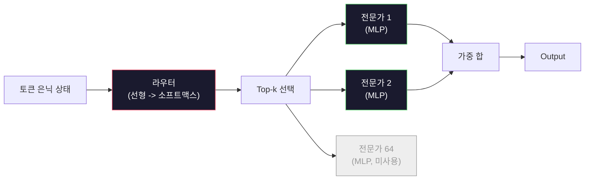

# 오픈 모델: 아키텍처 상세 분석

> 04강에서 GPT-2 Small을 처음부터 구축했습니다. 2026년의 프론티어 오픈 모델은 동일한 계열이며, RMSNorm을 LayerNorm 대신 사용, SwiGLU를 GELU 대신 사용, RoPE를 학습된 위치 인코딩 대신 사용, GQA 또는 MLA를 전체 MHA 대신 사용, 대규모 Mixture-of-Experts 적용 등 다섯 가지 또는 여섯 가지 구체적인 변경 사항이 있습니다. 이미 알고 있는 수학이 이 변경 사항의 95%를 설명합니다. 이 강의에서는 Llama 3, DeepSeek-V3, Mixtral, Qwen, Gemma를 나란히 비교하며 각 아키텍처가 갈라지는 정확한 지점을 명시합니다.

**유형:** Learn
**언어:** Python (stdlib)
**선수 요건:** 10단계, 04강, 05강, 12강 (사전 학습, 스케일링, 추론)
**시간:** 약 45분

## 학습 목표

- Llama 3, Mistral, Mixtral, Gemma 2, Qwen 2.5, DeepSeek-V3의 config.json을 읽고 모든 필드를 설명할 수 있습니다
- 각 모델이 GPT-2 Small 대비 수행한 구체적인 아키텍처 변경 사항을 명시하고, 이를 첫 원리(first principles)로부터 정당화할 수 있습니다
- 오픈 모델의 config만 사용하여 파라미터 수, KV 캐시 크기, 활성화 메모리를 계산할 수 있습니다
- 레이턴시, 메모리, 기능 제약 조건을 고려하여 배포 대상에 적합한 오픈 모델을 선택할 수 있습니다

## 문제점

04강에서 numpy로 350줄을 작성하여 GPT-2 형태의 모델을 만들었습니다. Llama 3 405B는 200페이지의 기술 보고서를 가지고 있습니다. 본능적으로 이 둘은 완전히 다른 존재라고 느끼기 쉽습니다. 하지만 그렇지 않습니다. 200페이지는 잘 동기화된 다섯 가지 또는 여섯 가지 수정 사항과 스케일링에 관한 수천 가지 구현 세부 사항을 포함하여 동일한 객체를 설명합니다. 뼈대인 임베딩, 트랜스포머 블록, 어텐션, MLP, 정규화, 헤드는 변하지 않았습니다.

이 강의는 diff입니다. 주요 오픈 모델 계열마다 GPT-2 대비 정확히 무엇이 변경되었는지, 왜 변경되었는지, 그리고 그 비용이 무엇인지 나열합니다. 강의를 완료하면 새로운 모델 카드를 읽고 이를 GPT-2 기준으로 마음속으로 번역할 수 있습니다.

실용적인 이점은 Meta가 Llama 5를 발표하거나 DeepSeek가 V4를 발표할 때 새로운 멘탈 모델이 필요하지 않다는 점입니다. config를 보고 잘 알려진 조절 변수(knobs) 중 어떤 것이 변경되었는지 확인하고, 그 하류(downstream) 영향을 파악할 수 있습니다. 2026년 아키텍처는 유한한 도구 상자입니다. 각 새로운 모델은 서로 다른 하위 집합을 선택합니다.

## 개념

### 불변 코어

모든 자기회귀(Autoregressive) 오픈 모델은 다음을 공유합니다:

- 토큰 임베딩(Embedding) 매트릭스 (vocab_size x hidden_dim).
- N개의 디코더 블록 스택: 정규화(Normalization), 셀프 어텐션(Self-Attention), 잔차 연결, 정규화, MLP, 잔차 연결.
- 최종 정규화 및 vocab_size로 투사하는 선형 헤드 (종종 임베딩과 가중치 공유(weight-tied)됨).
- 인과(causal) 마스크, 다음 토큰 교차 엔트로피(Cross-Entropy) 손실 함수(Loss Function).

이것이 형태입니다. 나머지는 조절 가능한 파라미터(knobs)입니다.

### 실제로 변화를 만드는 6가지 조절 파라미터

2024-2026년 모든 최첨단 오픈 모델에서, 동일한 6가지 설계 선택이 반복적으로 채택됩니다:

1. **정규화(Normalization).** LayerNorm -> RMSNorm.
2. **위치 인코딩(Positional Encoding).** 학습된 절대 위치 -> RoPE (변형 포함: YaRN, NTK).
3. **활성화 함수(Activation Function).** GELU -> SwiGLU (또는 GeGLU).
4. **어텐션 헤드 공유.** MHA -> GQA -> MQA -> MLA.
5. **밀집(Dense) vs 희소(Sparse) MLP.** Dense -> MoE (혼합 전문가)(MoE (Mixture of Experts)).
6. **Pre-norm 배치.** Pre-norm 유지. Post-norm 폐기.

나머지 모든 것 (학습률(Learning Rate) 스케줄, 데이터 혼합, 배치 크기(Batch Size), 컨텍스트 윈도우(Context Window) 길이)는 아키텍처가 아닌 학습 구성(training config)에 있습니다. 6가지 조절 파라미터입니다.

### 조절 파라미터 1: RMSNorm

LayerNorm은 평균을 빼고, 표준 편차로 나누고, 스케일링하고, 시프트(shift)합니다. RMSNorm은 스케일링만 유지합니다:

```
RMSNorm(x) = x / sqrt(mean(x^2) + eps) * gamma
```

평균 빼기 없음. 바이어스 없음. 토큰당 매트릭스 곱(matmul)이 하나 줄어듭니다. Zhang와 Sennrich (2019)는 기계 번역에서 LayerNorm과 성능이 같으면서 10% 더 빠르다고 주장했습니다. 모든 현대 오픈 모델이 이를 실행합니다.

비용: 없음. 이점: 작은 처리량(throughput) 향상, 더 단순한 코드.

### 조절 파라미터 2: RoPE

학습된 위치 임베딩(Embedding)은 GPT-2에서 1024 슬롯 룩업 테이블이었습니다. 컨텍스트 1025는 테이블 끝을 넘습니다. 모델은 학습된 길이를 넘어서 외삽(extrapolate)할 수 없습니다.

회전 위치 임베딩(Rotary Position Embedding, RoPE, Su et al. 2021)은 어텐션 내적(dot product) 전에 Q와 K 벡터를 쌍으로 회전시켜 위치를 주입합니다. 회전 각도는 위치의 결정론적 함수이므로, 학습된 것도 없고 소진될 것도 없습니다. 스케일링 트릭 (NTK-aware 보간, YaRN)을 사용하면, 8k 컨텍스트로 학습된 모델은 추론(Inference) 시 modest한 정확도 손실로 128k까지 확장할 수 있습니다.

```
q_rotated = rotate(q, angle(pos))
k_rotated = rotate(k, angle(pos))
score = q_rotated . k_rotated
```

Llama, Mistral, Qwen, DeepSeek, Gemma는 모두 RoPE를 사용합니다. Gemma 2는 하이브리드 방식(대부분의 레이어는 RoPE, 나머지는 로컬 슬라이딩 윈도우 어텐션)을 사용합니다.

### 조절 항목 3: SwiGLU

GPT-2의 MLP는 `x -> gelu(xW1 + b1) -> (...)W2 + b2`입니다. SwiGLU(Shazeer 2020)는 활성화 함수를 게이트된 곱으로 대체합니다:

```
SwiGLU(x) = (xW1) * sigmoid(xW1) * xV
```

하나의 투영 대신 Swish 활성화 함수로 게이트된 두 개의 병렬 투영을 사용합니다. 경험적으로 매개변수당 퍼플렉시티(perplexity)가 더 좋습니다. Llama 2가 이를 채택했고, 모두가 따랐습니다. MLP의 숨겨진 크기는 총 매개변수 수가 원래의 밀집 MLP와 일치하도록 설정하는 것이 일반적입니다: GPT-2가 `ff_dim = 4 * hidden`를 사용했다면, SwiGLU는 `ff_dim = (2/3) * 4 * hidden = 8/3 * hidden`를 사용합니다.

### 조절 항목 4: 어텐션 헤드 공유

GPT-2는 **멀티 헤드 어텐션(MHA)**을 사용했습니다: 모든 헤드가 자체 Q, K, V 투영을 가집니다.

**멀티 쿼리 어텐션(MQA, Shazeer 2019)**은 모든 헤드에 하나의 K와 하나의 V를 공유합니다. KV 캐시를 num_heads만큼 줄이며, 이는 일반적인 모델에서 12배에서 32배의 감소입니다. 어려운 벤치마크에서는 정확도가 약간 떨어집니다.

**그룹 쿼리 어텐션(GQA, Ainslie et al. 2023)**은 중간 지점입니다: G개의 Q 헤드 그룹이 하나의 K와 하나의 V를 공유합니다. Llama 3 8B는 GQA를 사용하며, 32개의 Q 헤드와 8개의 KV 헤드(G=8)를 사용하여 KV 캐시가 완전한 MHA 대비 4배 축소됩니다.

**멀티 헤드 잠재 어텐션(MLA, DeepSeek 2024)**은 K와 V를 공유된 저랭크 잠재 공간으로 압축하고, 헤드별로 다시 투영합니다. 헤드별 표현력을 유지하면서 KV 캐시를 추가로 줄입니다. DeepSeek-V2와 V3는 긴 컨텍스트 성능을 위해 이 방식을 의존합니다.

| 방식 | KV 헤드 | KV 캐시 | 정확도 |
|--------|----------|----------|----------|
| MHA    | num_heads | 전체 | 최상 |
| GQA    | num_groups (G < num_heads) | num_heads / G 감소 | MHA에 근접 |
| MQA    | 1 | num_heads 감소 | 작은 감소 |
| MLA    | 잠재 공간, 헤드별 복원 | MQA보다 작음 | MHA에 근접 |

약 13B 매개변수 이상의 모든 모델에 대해 GQA 또는 MLA는 사실상 필수입니다. 대규모에서의 완전한 MHA는 KV 캐시 재앙입니다.

### 조절 항목 5: 혼합 전문가(MoE)

밀집 MLP는 모든 토큰에 대해 모든 매개변수를 활성화합니다. MoE MLP는 블록당 K개의 전문가를 가지며, 라우터가 토큰마다 상위 k개의 전문가(일반적으로 top-2)를 선택합니다. 해당 토큰에 대해서는 선택된 전문가들의 가중치만 순전파를 수행합니다.

```
router_logits = xW_r
indices, weights = top_k(router_logits, k=2)
output = sum_i weights[i] * expert[indices[i]](x)
```

매력적인 점: 크기가 각각 7B인 전문가(expert) 64개를 가질 수 있습니다 (따라서 총 매개변수 수가 매우 큼). 토큰당 2개만 실행하므로 토큰당 연산량은 밀집(dense) 7B 모델과 동일합니다. Mixtral 8x7B는 총 매개변수가 47B이지만 토큰당 13B만 활성화합니다. DeepSeek-V3는 총 매개변수가 671B이지만 토큰당 37B만 활성화합니다.



장점: 동일한 연산량, 더 많은 매개변수, 더 나은 용량. 단점: 전문가 메모리는 어딘가에 저장되어야 하므로 서빙은 밀집 모델보다 더 많은 VRAM이 필요하며, 라우터의 부하 분산은 어렵고, 정렬(alignment) 중 라우터를 미세 조정하는 것은 그 자체로 연구 분야입니다.

### 조절 변수 6: Pre-norm 유지

원래 트랜스포머는 각 서브레이어(layer) 후에 레이어 정규화(layer norm)를 적용했습니다. GPT-2 이후의 모든 오픈 모델은 각 서브레이어 *전에* 배치합니다. Pre-norm은 깊은 깊이에서 훈련하기가 훨씬 쉽습니다. 논쟁할 여지가 없습니다.

### 모델별 차이

이 모든 것을 구체적으로 보여주는 표입니다.

| 모델 | 연도 | 총 매개변수 | 활성 매개변수 | 정규화 | 활성화 | 위치 | 어텐션 | MoE | 컨텍스트 |
|-------|------|-------------|---------------|------|-----------|----------|-----------|-----|---------|
| GPT-2 Small | 2019 | 124M | 124M | LayerNorm | GELU | 학습된 | MHA (12 헤더) | 없음 | 1k |
| Llama 3 8B | 2024 | 8B | 8B | RMSNorm | SwiGLU | RoPE | GQA (32/8) | 없음 | 128k |
| Llama 3 70B | 2024 | 70B | 70B | RMSNorm | SwiGLU | RoPE | GQA (64/8) | 없음 | 128k |
| Llama 3 405B | 2024 | 405B | 405B | RMSNorm | SwiGLU | RoPE | GQA (128/16) | 없음 | 128k |
| Mistral 7B | 2023 | 7.2B | 7.2B | RMSNorm | SwiGLU | RoPE | GQA | 없음 | 32k |
| Mixtral 8x7B | 2023 | 47B | 13B | RMSNorm | SwiGLU | RoPE | GQA | 있음 (8 전문가, top-2) | 32k |
| Gemma 2 9B | 2024 | 9B | 9B | RMSNorm (pre+post) | GeGLU | RoPE + 슬라이딩 | GQA | 없음 | 8k |
| Qwen 2.5 72B | 2024 | 72B | 72B | RMSNorm | SwiGLU | RoPE (YaRN) | GQA (64/8) | 없음 | 128k |
| DeepSeek V2 236B | 2024 | 236B | 21B | RMSNorm | SwiGLU | RoPE | MLA | 있음 (160 전문가, top-6) | 128k |
| DeepSeek V3 | 2024 | 671B | 37B | RMSNorm | SwiGLU | RoPE | MLA | 예 (256 전문가, top-8) | 128k |

열을 스캔해 보세요. RMSNorm은 보편적입니다. SwiGLU 또는 그 사촌인 GeGLU도 보편적입니다. RoPE는 보편적입니다. GQA는 7B 이상에서 보편적이며, MLA로 대체되는 경우를 제외합니다. MoE는 상단에서의 차별점입니다.

### config.json 읽기

Llama 3 8B config:

```
{
  "hidden_size": 4096,
  "intermediate_size": 14336,
  "num_hidden_layers": 32,
  "num_attention_heads": 32,
  "num_key_value_heads": 8,
  "max_position_embeddings": 131072,
  "rope_theta": 500000.0,
  "rms_norm_eps": 1e-5,
  "vocab_size": 128256
}
```

모든 필드는 이미 구현한 것과 대응됩니다.

- `hidden_size`: 임베딩 차원.
- `intermediate_size`: MLP 은닉 크기 (3.5x hidden -- SwiGLU 연산).
- `num_hidden_layers`: 스택 깊이.
- `num_attention_heads`: Q 헤드.
- `num_key_value_heads`: KV 헤드 (GQA).
- `max_position_embeddings`: 학습 컨텍스트 길이.
- `rope_theta`: RoPE 기본 주파수. Meta는 긴 컨텍스트 외삽을 위해 기본값 10k에서 500k로 스케일링했습니다.
- `rms_norm_eps`: 수치적 안정성.
- `vocab_size`: 토큰.

이 정보만으로 총 매개변수, KV 캐시, 피크 활성화 메모리를 계산할 수 있습니다. 정확한 공식은 `code/main.py`를 참조하세요.

### 활성화 메모리 예산

수십억 매개변수 이상에서는 활성화가 학습 메모리를 지배합니다. 사전 학습에 대한 경험칙 (기울기 체크포인팅 사용 시):

```
activation_mem ~ batch_size * seq_len * hidden_size * num_layers * bytes_per_element
```

Llama 3 8B, 배치 1, 시퀀스 8192, BF16, 32 레이어, hidden 4096: 체크포인팅 사용 시 활성화만으로 약 8 GB, 미사용 시 40 GB가 필요합니다. 이것이 flash-attention과 ring-attention이 중요한 이유입니다 -- 활성화가 fits하도록 어텐션 연산을 재작성합니다.

### KV 캐시 예산

최대 컨텍스트에서의 추론에 대해:

```
kv_cache = 2 * num_layers * num_kv_heads * head_dim * max_seq_len * bytes_per_element
```

Llama 3 8B, 128k 컨텍스트, BF16, head_dim = hidden / num_heads = 128:
`2 * 32 * 8 * 128 * 131072 * 2 = 17.2 GB` per sequence.

8B 가중치는 BF16에서 16 GB입니다. 단일 128k 시퀀스에 대한 KV 캐시는 가중치보다 더 큽니다. 이것이 GQA, MLA, KV 캐시 양자화 연구를 주도하는 메모리 압력입니다.

### 각 모델이 승리하는 경우

- **단일 80GB GPU, MoE 없음**: Llama 3 8B, Mistral 7B, Gemma 2 9B. 서빙이 쉽고, 도구 생태계가 넓습니다.
- **단일 노드 (8x80GB), 큰 용량**: Llama 3 70B, Qwen 2.5 72B. 가장 높은 밀집형 오픈 역량.
- **가장 큰 오픈 기능, MoE 복잡성 수용**: DeepSeek V3, Mixtral 8x22B. 활성 FLOP당 최고의 성능입니다.
- **긴 컨텍스트 필요**: Llama 3 (RoPE 스케일링으로 128k), DeepSeek (MLA의 장점).
- **저지연 서빙**: Gemma 2 9B (슬라이딩 윈도우가 긴 컨텍스트 연산을 줄입니다).

```figure
rmsnorm-vs-layernorm
```

## 구현하기

이 강의의 코드는 계산기입니다. 임의의 config.json을 입력하면 컴포넌트별 파라미터 수, 최대 컨텍스트에서의 KV 캐시, SwiGLU MLP 비율, 그리고 아키텍처(dense / GQA / MLA / MoE)에 대한 짧은 판단을 출력합니다.

```python
config = {
    "hidden_size": 4096, "intermediate_size": 14336,
    "num_hidden_layers": 32, "num_attention_heads": 32,
    "num_key_value_heads": 8, "vocab_size": 128256,
    "max_position_embeddings": 131072,
}
```

스크립트는 아키텍처 필드를 필드별로 순회하며 임베딩, 어텐션(GQA 감소 포함), MLP(SwiGLU 확장 포함), 레이어 정규화, 헤드의 파라미터 수를 계산합니다. 이후 명시된 컨텍스트 길이에서 KV 캐시를 계산하고 요약본을 출력합니다.

구현은 `code/main.py`를 참조하세요.

## 사용하기

스크립트에 포함된 Llama 3 8B, Mistral 7B, Mixtral 8x7B, DeepSeek V3 설정으로 계산기를 실행하세요. 파라미터 분해를 비교해 보세요. MoE 모델은 dense 모델보다 총 파라미터 수가 훨씬 크지만, 활성 파라미터 수는 종종 더 작다는 점을 주목하세요. DeepSeek V3의 KV 캐시는 총 파라미터 수가 더 많음에도 Llama 3 405B보다 작다는 점을 주목하세요. 이는 MLA가 작동하는 결과입니다.

그런 다음 로컬에 있는 모델의 설정을 입력하고, 요약본을 읽어 GPU에 적합한지 결정해 보세요.

## 출시하기

이 강의는 `outputs/skill-open-model-picker.md`를 생성합니다. 배포 대상(GPU 유형, VRAM, 컨텍스트 길이, 지연 예산)과 작업 프로필(채팅, 코드, 추론, 긴 컨텍스트)이 주어지면, 6가지 아키텍처 조절 변수에 대한 명시적인 추론과 함께 오픈 모델, 11강의 양자화 방식, 12강의 추론 스택을 추천합니다.

## 연습 문제

1. HuggingFace에서 Qwen 2.5 72B 설정을 읽어 보세요. 총 파라미터 수를 처음부터 계산해 보세요. HF가 보고한 값과 비교하고, 차이(delta)가 어디서 발생하는지 식별해 보세요(헤드 차원 반올림, KV 공유 계수 등).

2. DeepSeek V3는 256개의 전문가를 사용하며 top-8 라우팅을 적용합니다. 활성화된 전문가와 총 전문가의 비율을 계산하고, Mixtral 8x7B의 top-2 of 08강 비교해 보세요. 희소(sparse, 25%)에서 더 밀집된 희소(denser sparse, 3%)로의 전환이 FLOP당 용량에 대해 무엇을 시사하는지 생각해 보세요.

3. Llama 3 405B의 KV 캐시를 128k 컨텍스트에서 FP08강 BF16으로 계산해 보세요. FP8은 BF16 값의 절반입니다. 단일 8xH100 노드(각 80GB = 총 640GB, 가중치 메모리 제외)에서 몇 개의 병렬 시퀀스를 서빙할 수 있나요?

4. Gemma 2는 전체 어텐션 레이어와 슬라이딩 윈도우 어텐션 레이어를 번갈아 사용합니다. 레이어의 절반이 전체 컨텍스트 대신 4096 토큰 슬라이딩 윈도우를 사용할 때의 KV 캐시 수식을 작성해 보세요. 총 컨텍스트가 8k일 때 메모리를 얼마나 절약하나요?

5. 이 강의를 작성한 이후에 출시된 최신 프론티어 오픈 모델을 찾아보세요. 그 모델이 선택한 6가지 조절 변수(knob) 중 어떤 것을 선택했는지, 그리고 7번째 조절 변수를 도입했는지 식별해 보세요. 새로운 아키텍처가 출시되는 순간 커리큘럼은 시대에 뒤처진 것처럼 느껴질 것입니다. 목표는 멘탈 모델을 재구축하지 않으면서 표를 업데이트하는 것입니다.

## 핵심 용어

| 용어 | 사람들이 말하는 표현 | 실제 의미 |
|------|----------------|----------------------|
| RMSNorm | "평균을 제외한 LayerNorm" | 평균 제곱근(RMS)만으로 정규화하며 학습된 스케일 사용 — LayerNorm보다 저렴하고 성능이 동등 |
| RoPE | "회전 위치 인코딩" | Q와 K 벡터를 2D 쌍으로 위치 의존 각도만큼 회전 — 스케일링 트릭으로 학습 길이 이상으로 외삽 |
| SwiGLU | "새로운 MLP 활성화 함수" | Swish를 사용하는 게이트 선형 유닛: `(xW1) * sigmoid(xW1) * xV` — 2024년 이후 모든 오픈 모델의 표준 |
| GQA | "절충형 어텐션" | Grouped-Query Attention: Q 헤드의 G 그룹이 하나의 K 헤드와 하나의 V 헤드를 공유 — MQA의 정확도 손실 없이 KV 캐시를 축소 |
| MLA | "DeepSeek의 어텐션" | Multi-Head Latent Attention: K/V를 공유 저랭크 잠재 공간(latent)으로 압축하고 헤드별로 복원 — 대규모 모델에 대해 가장 작은 KV 캐시 |
| MoE | "희소 전문가" | Mixture of Experts: 블록당 N개의 MLP, 라우터가 토큰마다 top-k 선택 — 총 매개변수는 크지만 활성 매개변수는 작음 |
| Top-k 라우팅 | "토큰마다 k개 전문가 선택" | 라우터가 전문가별 점수를 계산하고 가장 높은 k개를 활성화 — 일반적인 k는 2(Mixtral)에서 8(DeepSeek) |
| YaRN | "RoPE 확장" | Yet another RoPE extension — 추론 시 컨텍스트를 8k에서 128k+로 확장하기 위해 회전 각도를 보간 |
| 슬라이딩 윈도우 어텐션 | "모든 것에 어텐션하지 마세요" | 각 토큰이 마지막 W개의 토큰에만 어텐션합니다. 토큰당 어텐션 비용을 O(W)로 제한하며, Gemma 2와 초기 Mistral에서 사용됩니다. |
| 활성 매개변수 | "토큰당 실행되는 부분" | MoE 모델에서 토큰당 순전파를 수행하는 매개변수 수입니다. 총 매개변수보다 훨씬 작으며, 토큰당 FLOPs를 결정합니다. |

## 추가 읽기

- [Dubey et al., 2024 -- "The Llama 3 Herd of Models"](https://arxiv.org/abs/2407.21783) -- 밀집 Llama 3 계열의 아키텍처 및 학습 참조 문서
- [DeepSeek-AI, 2024 -- "DeepSeek-V3 Technical Report"](https://arxiv.org/abs/2412.19437) -- MLA, 보조 손실 없는 로드 밸런싱, 671B MoE
- [Jiang et al., 2024 -- "Mixtral of Experts"](https://arxiv.org/abs/2401.04088) -- 표준 MoE 오픈 모델 논문
- [Su et al., 2021 -- "RoFormer: Enhanced Transformer with Rotary Position Embedding"](https://arxiv.org/abs/2104.09864) -- RoPE 논문
- [Shazeer, 2020 -- "GLU Variants Improve Transformer"](https://arxiv.org/abs/2002.05202) -- SwiGLU, GeGLU 및 관련 기법
- [Ainslie et al., 2023 -- "GQA: Training Generalized Multi-Query Transformer Models"](https://arxiv.org/abs/2305.13245) -- GQA 논문
- [Gemma 2 Team, 2024 -- "Gemma 2: Improving Open Language Models at a Practical Size"](https://arxiv.org/abs/2408.00118) -- 하이브리드 전체+슬라이딩 어텐션, 전+후 정규화
- [Qwen Team, 2024 -- "Qwen 2.5 Technical Report"](https://arxiv.org/abs/2412.15115) -- YaRN 컨텍스트 확장 및 긴 컨텍스트 학습 레시피
