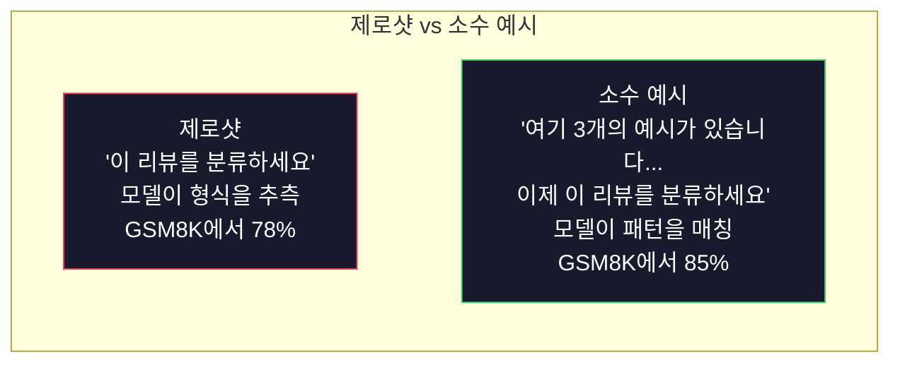
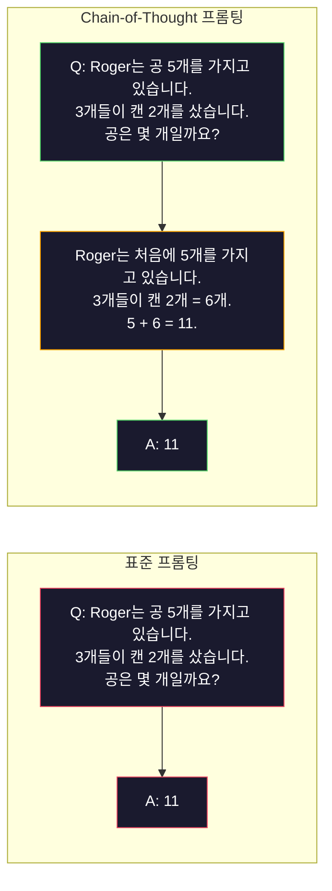
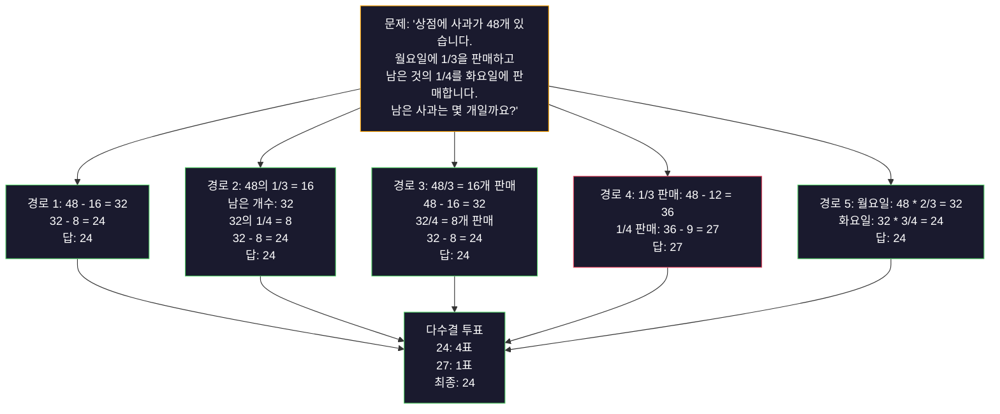
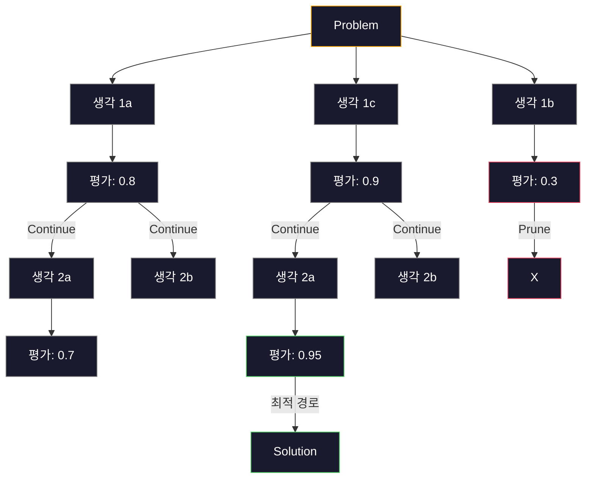

# 소수 예시(Few-Shot), 사고의 연쇄(Chain-of-Thought), 사고의 나무(Tree-of-Thought)

> 모델에게 무엇을 해야 하는지 알려주는 것은 프롬프트입니다. 모델에게 어떻게 생각하는지 보여주는 것은 엔지니어링입니다. 같은 모델, 같은 작업, 같은 데이터에서 정확도가 78%에서 91%로 올라간 차이는 더 좋은 모델이 아닙니다. 더 좋은 추론 전략입니다.

**유형:** Build
**언어:** Python
**선수 요건:** 11강 (프롬프트 엔지니어링)
**시간:** 약 45분

## 학습 목표

- 작업 정확도를 극대화하는 예시 시연(examples)을 선택하고 형식화하여 소수 예시(Few-Shot) 프롬프트를 구현해 보세요
- 수학 단어 문제와 같은 다단계 문제의 정확도를 개선하기 위해 사고의 연쇄(CoT) 추론을 적용해 보세요
- 다양한 추론 경로를 탐색하고 최선의 경로를 선택하는 사고의 나무(Tree-of-Thought) 프롬프트를 구축해 보세요
- 표준 벤치마크에서 제로샷(Zero-Shot), 소수 예시(Few-Shot), 사고의 연쇄(CoT) 간의 정확도 향상도를 측정해 보세요

## 문제점

수학 튜터링 앱을 구축합니다. 프롬프트는 "이 단어 문제를 해결하세요"라고 지시합니다. GPT-5는 표준 초등학교 수학 벤치마크인 GSM8K에서 94%의 정확도를 기록합니다. 이미 최고점에 도달했다고 생각할 수 있습니다. 아닙니다. 사고의 연쇄(CoT)는 여전히 3~4포인트를 더합니다.

"단계별로 생각해 보세요"라는 다섯 단어를 추가하면 정확도가 91%로 급상승합니다. 몇 가지 풀이 예시를 추가하면 95%에 도달합니다. 같은 모델, 같은 온도(Temperature), 같은 API 비용입니다. 유일한 차이는 모델에게 계산용 종이(scratch paper)를 제공했다는 점입니다.

이는 해킹이 아닙니다. 추론이 작동하는 방식입니다. 인간은 다단계 문제를 한 번의 정신적 도약으로 해결하지 않습니다. 트랜스포머도 마찬가지입니다. 모델이 중간 토큰을 생성하도록 강제하면, 그 토큰들은 다음 토큰의 컨텍스트의 일부가 됩니다. 각 추론 단계가 다음 단계를 돕습니다. 모델은 문자 그대로 답을 향해 계산해 나갑니다.

그러나 "단계별로 생각해 보세요"는 시작일 뿐, 끝이 아닙니다. 다섯 가지 추론 경로를 샘플링하고 다수결 투표를 한다면 어떨까요? 모델이 가능성의 나무를 탐색하고 가지를 평가하며 가지치기(pruning)하도록 허용한다면 어떨까요? 추론과 도구 사용을 교대로(interleaved) 수행한다면 어떨까요? 이는 가설이 아닙니다. 측정된 개선 효과가 있는 공개된 기법이며, 이 강의에서 이 모든 기법을 구축할 것입니다.

## 개념

### 제로샷 vs 소수 예시: 예시가 지시문보다 이기는 경우

제로샷 프롬프트는 모델에 작업만 주고 그 외의 것은 주지 않습니다. 소수 예시 프롬프트는 먼저 예시를 제공합니다.

Wei et al. (2022)은 8개 벤치마크에 걸쳐 이를 측정했습니다. 감정 분류 같은 단순한 작업에서는 제로샷과 소수 예시 방식의 성능 차이가 2% 이내였습니다. 다단계 산술 및 기호 추론 같은 복잡한 작업에서는 소수 예시 방식이 정확도를 10-25% 향상시켰습니다.

직관적으로, 예시는 압축된 지시문입니다. 출력 형식을 설명하는 대신 그것을 보여줍니다. 추론 과정을 설명하는 대신 그것을 시연합니다. 모델은 추상적인 지시문을 해석하는 것보다 예시에서 패턴을 매칭하는 것이 더 신뢰할 수 있습니다.



**소수 예시가 이기는 경우:** 형식에 민감한 작업, 분류, 구조화된 추출, 도메인 특유의 전문 용어, 모델이 특정 패턴을 매칭해야 하는 모든 작업.

**제로샷이 이기는 경우:** 단순한 사실적 질문, 예시가 창의성을 제약하는 창의적 작업, 좋은 예시를 찾는 것이 좋은 지시문을 작성하는 것보다 어려운 작업.

### 예시 선택: 유사성이 무작위 선택보다 우수함

모든 예시가 동등하지는 않습니다. 목표 입력과 유사한 예시를 선택하면 분류 작업에서 무작위 선택보다 5-15% 더 잘 수행됩니다 (Liu et al., 2022). 세 가지 원칙:

1. **시맨틱 유사성**: 임베딩 공간에서 입력과 가장 가까운 예시를 선택하세요
2. **레이블 다양성**: 예시에서 모든 출력 범주를 포함하세요
3. **난이도 매칭**: 목표 문제의 복잡도 수준을 매칭하세요

대부분의 작업에 대한 최적의 예시 개수는 3-5개입니다. 3개 미만이면 모델이 패턴을 추출할 충분한 신호를 갖지 못합니다. 5개 이상이면 수익 체감이 발생하고 컨텍스트 윈도우 토큰을 낭비합니다. 레이블이 많은 분류 작업에서는 레이블당 예시 하나를 사용하세요.

### Chain-of-Thought: 모델에 계산용 종이 제공하기

Chain-of-Thought (CoT) 프롬팅은 Google Brain의 Wei 등(2022)이 도입했습니다. 아이디어는 간단합니다: 모델에 단순히 정답만 요청하는 대신, 먼저 추론 단계를 보여 달라고 요청하는 것입니다.



이 방식이 기계적으로 왜 작동할까요? 트랜스포머가 생성하는 각 토큰은 다음 토큰의 컨텍스트가 됩니다. CoT가 없으면 모델은 모든 추론을 단일 순방향 패스의 은닉 상태로 압축해야 합니다. CoT를 사용하면 모델은 중간 계산 과정을 토큰으로 외부화합니다. 각 추론 토큰은 유효 계산 깊이를 확장합니다.

**GSM8K 벤치마크 (초등 수학, 8.5K 문제):**

| 모델 | 제로샷 | 제로샷 CoT | 소수 예시 CoT |
|-------|-----------|---------------|--------------|
| GPT-4o | 78% | 91% | 95% |
| GPT-5 | 94% | 97% | 98% |
| o4-mini (추론) | 97% | — | — |
| Claude Opus 4.7 | 93% | 97% | 98% |
| Gemini 3 Pro | 92% | 96% | 98% |
| Llama 4 70B | 80% | 89% | 94% |
| DeepSeek-V3.1 | 89% | 94% | 96% |

**추론 모델에 대한 주의.** OpenAI의 o-series (o3, o4-mini) 및 DeepSeek-R01강 같은 모델은 정답을 출력하기 전에 내부적으로 Chain-of-Thought를 수행합니다. 추론 모델에 "Let's think step by step"을 추가하는 것은 불필요하며 때로는 역효과를 낳습니다 — 이미 그 과정을 수행하고 있기 때문입니다.

CoT의 두 가지 유형:

**제로샷 CoT**: 프롬프트에 "Let's think step by step"을 추가합니다. 예시가 필요하지 않습니다. Kojima 등(2022)은 이 한 문장이 산술, 상식, 기호 추론 작업 전반에 걸쳐 정확도를 향상시킨다는 것을 보여 주었습니다.

**소수 예시 CoT**: 추론 단계를 포함하는 예시를 제공합니다. 모델이 기대하는 정확한 추론 형식을 볼 수 있기 때문에 제로샷 CoT보다 더 효과적입니다.

**CoT가 해가 되는 경우**: 단순한 사실적 회상("프랑스의 수도는 무엇인가요?"), 단일 단계 분류, 속도보다 정확도가 덜 중요한 작업. CoT는 쿼리당 50-200 토큰의 추론 오버헤드를 추가합니다. 높은 처리량, 낮은 복잡도의 작업에서는 낭비되는 비용입니다.

### 자기 일관성(Self-Consistency): 여러 번 샘플링하고 한 번 투표하기

Wang et al. (2023)은 자기 일관성(self-consistency)을 도입했습니다. 핵심 통찰: 단일 CoT 경로에는 추론 오류가 포함될 수 있습니다. 하지만 N개의 독립적인 추론 경로를 샘플링하고(온도 > 0 사용) 최종 답에 대해 다수결 투표를 하면 오류가 상쇄됩니다.



자기 일관성은 원본 PaLM 540B 실험에서 GSM8K 정확도를 단일 CoT의 56.5%에서 N=40일 때 74.4%로 개선했습니다. GPT-5에서는 개선 폭이 작습니다(97%에서 98%). 이는 기본 정확도가 이미 포화 상태이기 때문입니다. 이 기법은 기본 CoT 정확도가 60-85%인 모델에서 가장 빛을 발합니다. 단일 경로 오류가 빈번하지만 체계적이지 않은 최적의 지점입니다. 추론 모델(o-series, R1)에서는 자기 일관성이 내장된 내부 샘플링에 흡수됩니다.

트레이드오프: N개의 샘플은 API 비용과 지연 시간을 N배로 만듭니다. 실제로는 N=5가 대부분의 이점을 포착합니다. N=3은 의미 있는 투표를 위한 최소값입니다. N > 10은 대부분의 작업에서 수익이 감소합니다.

### Tree-of-Thought: 분기 탐색

Yao et al. (2023)은 Tree-of-Thought(ToT)를 도입했습니다. CoT가 하나의 선형 추론 경로를 따르는 반면, ToT는 여러 분기를 탐색하고 가장 유망한 분기를 평가한 후 계속 진행합니다.



ToT는 세 가지 구성 요소를 포함합니다:

1. **생각 생성**: 여러 후보 다음 단계를 생성합니다
2. **상태 평가**: 각 후보를 점수화합니다 (LLM 자체를 평가자로 사용할 수 있습니다)
3. **검색 알고리즘**: BFS 또는 DFS로 트리를 탐색하며 낮은 점수의 가지를 제거합니다

24 게임 작업 (4개의 숫자를 산술 연산으로 조합하여 24를 만드는 문제)에서 GPT-4는 표준 프롬프트로 문제의 7.3%를 해결합니다. CoT를 사용하면 4.0%입니다 (CoT는 검색 공간이 넓기 때문에 오히려 성능이 떨어집니다). ToT를 사용하면 74%입니다.

ToT는 비용이 많이 듭니다. 트리의 각 노드마다 LLM 호출이 필요합니다. 분기 계수 3, 깊이 3인 트리는 최대 39번의 LLM 호출이 필요합니다. 검색 공간이 크지만 평가 가능한 문제(계획, 퍼즐 풀이, 제약 조건이 있는 창의적 문제 해결)에만 사용하세요.

### ReAct: 생각 + 실행

Yao 등(2022)은 추론 추적과 행동을 결합했습니다. 모델은 생각(추론 생성)과 행동(도구 호출, 검색, 계산)을 번갈아 수행합니다.

```mermaid
graph LR
    Q["질문:\n에펠 탑이 위치한\n국가의 인구는\n얼마인가요?"]
    T1["생각: 에펠 탑이 위치한\n국가를 찾아야 합니다"]
    A1["행동: '에펠 탑 위치'\n검색"]
    O1["관찰:\n파리, 프랑스"]
    T2["생각: 이제\n프랑스의 인구가\n필요합니다"]
    A2["행동: '프랑스 인구 2024'\n검색"]
    O2["관찰:\n6,840만 명"]
    T3["생각: 답을\n얻었습니다"]
    F["답:\n6,840만 명"]

    Q --> T1 --> A1 --> O1 --> T2 --> A2 --> O2 --> T3 --> F

    style Q fill:#1a1a2e,stroke:#ffa500,color:#fff
    style T1 fill:#1a1a2e,stroke:#51cf66,color:#fff
    style A1 fill:#1a1a2e,stroke:#e94560,color:#fff
    style O1 fill:#1a1a2e,stroke:#808080,color:#fff
    style T2 fill:#1a1a2e,stroke:#51cf66,color:#fff
    style A2 fill:#1a1a2e,stroke:#e94560,color:#fff
    style O2 fill:#1a1a2e,stroke:#808080,color:#fff
    style T3 fill:#1a1a2e,stroke:#51cf66,color:#fff
    style F fill:#1a1a2e,stroke:#51cf66,color:#fff
```



ReAct는 순수 CoT보다 지식 집약적 작업에서 더 좋은 성능을 내며, 추론을 실제 데이터에 접지할 수 있기 때문입니다. HotpotQA(다중 홉 질문 답변)에서 GPT-4를 사용한 ReAct는 CoT 단독의 29.4% 대비 35.1%의 정확 일치율을 달성합니다. 진정한 강점은 추론 오류가 관찰에 의해 수정된다는 점이며, 모델은 실행 중에 계획을 업데이트할 수 있습니다.

ReAct는 현대 AI 에이전트의 기초입니다. 모든 에이전트 프레임워크(LangChain, CrewAI, AutoGen)는 Thought-Action-Observation 루프의 변형을 구현합니다. 14단계에서 완전한 에이전트를 구축하게 됩니다. 이 강의는 프롬팅 패턴을 다룹니다.

### 구조화된 프롬팅: XML 태그, 구분자, 헤더

프롬프트가 복잡해지면 구조가 모델이 섹션을 혼동하는 것을 방지합니다. 세 가지 접근 방식이 있습니다:

**XML 태그** (Claude와 가장 잘 작동하며, 모든 환경에서 안정적):
```
<context>
You are reviewing a pull request.
The codebase uses TypeScript and React.
</context>

<task>
Review the following diff for bugs, security issues, and style violations.
</task>

<diff>
{diff_content}
</diff>

<output_format>
List each issue with: file, line, severity (critical/warning/info), description.
</output_format>
```

**Markdown 헤더** (보편적):
```
## 역할
Senior security engineer at a fintech company.

## 작업
Analyze this API endpoint for vulnerabilities.

## 입력
{api_code}

## 규칙
- Focus on OWASP Top 10
- Rate each finding: critical, high, medium, low
- Include remediation steps
```

**구분자** (최소적이지만 효과적):
```
---INPUT---
{user_text}
---END INPUT---

---INSTRUCTIONS---
Summarize the above in 3 bullet points.
---END INSTRUCTIONS---
```

### 프롬프트 체이닝: 순차적 분해

일부 작업은 단일 프롬프트로는 너무 복잡합니다. 프롬프트 체이닝은 이를 단계로 나누며, 한 프롬프트의 출력이 다음 프롬프트의 입력이 됩니다.


체이닝은 세 가지 이유로 단일 프롬프트보다 우수합니다:

1. **각 단계가 더 단순합니다**: 모델이 모든 것을 처리하는 대신 하나의 집중된 작업을 수행합니다
2. **중간 출력은 검사 가능합니다**: 단계 간에 검증하고 수정할 수 있습니다
3. **각 단계에서 다른 모델을 사용할 수 있습니다**: 추출에는 저렴한 모델을, 추론에는 고가 모델을 사용합니다

### 성능 비교

| 기법 | 최적 용도 | GSM8K 정확도 (GPT-5) | API 호출 | 토큰 오버헤드 | 복잡도 |
|-----------|----------|------------------------|-----------|----------------|------------|
| 제로샷(Zero-Shot) | 단순 작업 | 94% | 1 | 없음 | 단순 |
| 소수 예시(Few-Shot) | 형식 일치 | 96% | 1 | 200-500 토큰 | 낮음 |
| 제로샷 CoT | 빠른 추론 향상 | 97% | 1 | 50-200 토큰 | 단순 |
| 소수 예시 CoT | 최대 단일 호출 정확도 | 98% | 1 | 300-600 토큰 | 낮음 |
| 자기 일관성(Self-Consistency) (N=5) | 고위험 추론 | 98.5% | 5 | 5배 토큰 비용 | 중간 |
| 추론 모델(o4-mini) | CoT 대체품 | 97% | 1 | 숨겨진 (내부적으로 2-10배) | 단순 |
| Tree-of-Thought | 탐색/계획 문제 | N/A (Game of 24에서 74%) | 10-40+ | 토큰 비용 10-40배 | 높음 |
| ReAct | 지식 기반 추론 | N/A (HotpotQA에서 35.1%) | 3-10+ | 가변 | 높음 |
| Prompt Chaining | 복잡한 다단계 작업 | 96% (파이프라인) | 2-5 | 토큰 비용 2-5배 | 중간 |

적절한 기법은 세 가지 요인에 따라 달라집니다: 정확도 요구 사항, 지연 시간 예산, 비용 허용 범위. 대부분의 프로덕션 시스템에서는 3개 샘플 자기 일관성 폴백을 사용하는 소수 예시 CoT가 사용 사례의 90%를 커버합니다.

```figure
few-shot-curve
```

## 구현하기

소수 예시 프롬팅, Chain of Thought (CoT) 추론, 자기 일관성 투표를 단일 파이프라인으로 결합한 수학 문제 해결사를 구축해 보세요. 이후 어려운 문제를 위해 Tree-of-Thought (ToT)를 추가합니다.

전체 구현은 `code/advanced_prompting.py`에 있습니다. 주요 구성 요소는 다음과 같습니다.

### 1단계: 소수 예시 저장소

첫 번째 구성 요소는 소수 예시를 관리하고 주어진 문제에 가장 관련성 높은 예시를 선택합니다.

```python
GSM8K_EXAMPLES = [
    {
        "question": "Janet's ducks lay 16 eggs per day. She eats three for breakfast every morning and bakes muffins for her friends every day with four. She sells every egg at the farmers' market for $2. How much does she make every day at the farmers' market?",
        "reasoning": "Janet's ducks lay 16 eggs per day. She eats 3 and bakes 4, using 3 + 4 = 7 eggs. So she has 16 - 7 = 9 eggs left. She sells each for $2, so she makes 9 * 2 = $18 per day.",
        "answer": "18"
    },
    ...
]
```

각 예시에는 세 가지 부분이 있습니다: 질문, 추론 체인, 최종 답변. 추론 체인은 일반적인 소수 예시를 CoT 소수 예시로 변환하는 요소입니다.

### 2단계: Chain of Thought (CoT) 프롬프트 빌더

프롬프트 빌더는 시스템 메시지, 추론 체인이 포함된 소수 예시, 목표 질문을 단일 프롬프트로 조립합니다.

```python
def build_cot_prompt(question, examples, num_examples=3):
    system = (
        "You are a math problem solver. "
        "For each problem, show your step-by-step reasoning, "
        "then give the final numerical answer on the last line "
        "in the format: 'The answer is [number]'."
    )

    example_text = ""
    for ex in examples[:num_examples]:
        example_text += f"Q: {ex['question']}\n"
        example_text += f"A: {ex['reasoning']} The answer is {ex['answer']}.\n\n"

    user = f"{example_text}Q: {question}\nA:"
    return system, user
```

형식 제약("The answer is [number]")은 매우 중요합니다. 이것이 없으면 자기 일관성이 샘플 간에 답변을 추출하고 비교할 수 없습니다.

### 3단계: 자기 일관성 투표

N개의 추론 경로를 샘플링하고 다수 답변을 선택합니다.

```python
def self_consistency_solve(question, examples, client, model, n_samples=5):
    system, user = build_cot_prompt(question, examples)

    answers = []
    reasonings = []
    for _ in range(n_samples):
        response = client.chat.completions.create(
            model=model,
            messages=[
                {"role": "system", "content": system},
                {"role": "user", "content": user}
            ],
            temperature=0.7
        )
        text = response.choices[0].message.content
        reasonings.append(text)
        answer = extract_answer(text)
        if answer is not None:
            answers.append(answer)

    vote_counts = Counter(answers)
    best_answer = vote_counts.most_common(1)[0][0] if vote_counts else None
    confidence = vote_counts[best_answer] / len(answers) if best_answer else 0

    return best_answer, confidence, reasonings, vote_counts
```

온도(Temperature) 0.7이 중요합니다. 온도 0.0에서는 N개의 모든 샘플이 동일해져 목적을 달성할 수 없습니다. 다양한 추론 경로를 위해 충분한 랜덤성이 필요하지만, 모델이 의미 없는 내용을 생성할 정도로 너무 높으면 안 됩니다.

### 4단계: Tree-of-Thought (ToT) 해결사

선형 추론이 실패하는 문제에서는 ToT가 여러 접근법을 탐색하고 가장 유망한 방향을 평가합니다.

```python
def tree_of_thought_solve(question, client, model, breadth=3, depth=3):
    thoughts = generate_initial_thoughts(question, client, model, breadth)
    scored = [(t, evaluate_thought(t, question, client, model)) for t in thoughts]
    scored.sort(key=lambda x: x[1], reverse=True)

    for current_depth in range(1, depth):
        next_thoughts = []
        for thought, score in scored[:2]:
            extensions = extend_thought(thought, question, client, model, breadth)
            for ext in extensions:
                ext_score = evaluate_thought(ext, question, client, model)
                next_thoughts.append((ext, ext_score))
        scored = sorted(next_thoughts, key=lambda x: x[1], reverse=True)

    best_thought = scored[0][0] if scored else ""
    return extract_answer(best_thought), best_thought
```

평가자 자체는 LLM 호출입니다. 모델에게 "0.0에서 1.0까지의 척도로, 이 문제 해결을 위한 이 추론 경로가 얼마나 유망합니까?"라고 묻습니다. 이것이 ToT의 핵심 통찰입니다. 모델이 자신의 부분적인 해답을 평가합니다.

### 5단계: 전체 파이프라인

파이프라인은 모든 기법을 에스컬레이션 전략과 결합합니다.

```python
def solve_with_escalation(question, examples, client, model):
    single_answer, _ = few_shot_cot_solve(question, examples, client, model)

    sc_answer, confidence, _, _ = self_consistency_solve(
        question, examples, client, model, n_samples=5
    )

    if confidence >= 0.8 and single_answer == sc_answer:
        return sc_answer, "self_consistency", confidence

    tot_answer, _ = tree_of_thought_solve(question, client, model)
    return tot_answer, "tree_of_thought", None
```

에스컬레이션 로직: 먼저 저렴한 방법(단일 CoT)을 시도합니다. 단일 결정론적 경로는 투표 점유율을 제공하지 않으므로, 그 품질 체크는 일치성입니다. 온도 0의 답변이 샘플링된 경로들의 다수 답변과 일치해야 합니다. 일치하지 않거나, 자기 일관성 신뢰도가 0.8 미만인 경우(5개 샘플 중 4개 미만 일치), ToT로 에스컬레이션합니다. 이는 비용과 정확도의 균형을 맞춥니다. 대부분의 문제는 저렴하게 해결되고, 어려운 문제는 더 많은 연산 자원을 할당받습니다.

## 사용하기

### 템플릿 기반 소수 예시(Few-Shot) 프롬프트

LangChain은 소수 예시(Few-Shot) 및 CoT 패턴을 단순화하는 프롬프트 템플릿 및 출력 파싱에 대한 내장 지원을 제공합니다:

```python
from langchain_core.prompts import FewShotPromptTemplate, PromptTemplate
from langchain_openai import ChatOpenAI

example_prompt = PromptTemplate(
    input_variables=["question", "reasoning", "answer"],
    template="Q: {question}\nA: {reasoning} The answer is {answer}."
)

few_shot_prompt = FewShotPromptTemplate(
    examples=examples,
    example_prompt=example_prompt,
    suffix="Q: {input}\nA: Let's think step by step.",
    input_variables=["input"]
)

llm = ChatOpenAI(model="gpt-4o", temperature=0.7)
chain = few_shot_prompt | llm
result = chain.invoke({"input": "If a train travels 120 km in 2 hours..."})
```

LangChain은 또한 시맨틱 유사성 선택을 위한 `ExampleSelector` 클래스를 가지고 있습니다:

```python
from langchain_core.example_selectors import SemanticSimilarityExampleSelector
from langchain_openai import OpenAIEmbeddings

selector = SemanticSimilarityExampleSelector.from_examples(
    examples,
    OpenAIEmbeddings(),
    k=3
)
```

### 컴파일된 프롬프트

DSPy는 프롬팅 전략을 최적화 가능한 모듈로 취급합니다. CoT 프롬프트를 수작업으로 제작하는 대신, 시그니처를 정의하고 DSPy가 프롬프트를 최적화하도록 합니다:

```python
import dspy

dspy.configure(lm=dspy.LM("openai/gpt-4o", temperature=0.7))

class MathSolver(dspy.Module):
    def __init__(self):
        self.solve = dspy.ChainOfThought("question -> answer")

    def forward(self, question):
        return self.solve(question=question)

solver = MathSolver()
result = solver(question="Janet's ducks lay 16 eggs per day...")
```

DSPy의 `ChainOfThought`는 추론 흔적을 자동으로 추가합니다. `dspy.majority`는 자기 일관성을 구현합니다:

```python
result = dspy.majority(
    [solver(question=q) for _ in range(5)],
    field="answer"
)
```

### 비교: 처음부터 구현 vs 프레임워크

| 기능 | 처음부터 구현 (이 강) | LangChain | DSPy |
|---------|--------------------------|-----------|------|
| 프롬프트 형식 제어 | 완전 | 템플릿 기반 | 자동 |
| 자기 일관성 | 수동 투표 | 수동 | 내장 (`dspy.majority`) |
| 예시 선택 | 사용자 정의 로직 | `ExampleSelector` | `dspy.BootstrapFewShot` |
| Tree-of-Thought | 사용자 정의 트리 검색 | 커뮤니티 체인 | 내장되지 않음 |
| 프롬프트 최적화 | 수동 반복 | 수동 | 자동 컴파일 |
| 최적 용도 | 학습, 사용자 정의 파이프라인 | 표준 워크플로 | 연구, 최적화 |

## 출시하기

이 강은 두 가지 산출물을 생성합니다.

**1. 추론 체인 프롬프트** (`outputs/prompt-reasoning-chain.md`): 소수 예시 CoT와 자기 일관성을 위한 프로덕션 준비가 완료된 프롬프트 템플릿입니다. 예제와 문제 도메인을 입력해 보세요.

**2. CoT 패턴 선택 스킬** (`outputs/skill-cot-patterns.md`): 작업 유형, 정확도 요구 사항 및 비용 제약에 따라 올바른 추론 기법을 선택하기 위한 의사 결정 프레임워크입니다.

## 연습 문제

1. **격차 측정**: GSM8K 문제 10개를 가져오세요. 각 문제를 제로샷, 소수 예시, 제로샷 CoT, 소수 예시 CoT로 풀어보세요. 각 기법의 정확도를 기록하세요. 모델에서 가장 큰 성능 향상을 가져오는 기법은 무엇인가요?

2. **예제 선택 실험**: 동일한 10개 문제에 대해 무작위 예제 선택과 수동으로 선택한 유사 예제를 비교하세요. 정확도 차이를 측정하세요. 예제의 품질이 예제의 수량보다 중요해지는 시점은 언제인가요?

3. **자기 일관성 비용 곡선**: GSM8K 문제 20개에서 N=1, 3, 5, 7, 10으로 자기 일관성을 실행하세요. 정확도 대 비용(총 토큰 수)을 플롯하세요. 모델의 곡선 무릎(knee)는 어디인가요?

4. **ReAct 루프 구축**: 계산기 도구로 파이프라인을 확장하세요. 모델이 수학식을 생성하면 Python의 `eval()`로 (샌드박스에서) 실행하고 결과를 피드백하세요. 도구 기반 추론이 순수 CoT보다 성능이 좋은지 측정하세요.

5. **창작 작업을 위한 ToT**: Tree-of-Thought 솔버를 창작 글쓰기 작업에 적용하세요: "재미있으면서 슬픈 6단어 이야기를 쓰세요." LLM을 평가자로 사용하세요. 분기 탐색이 단일 샷 생성보다 더 나은 창작 출력물을 생성하나요?

## 핵심 용어

| 용어 | 사람들이 말하는 것 | 실제 의미 |
|------|----------------|----------------------|
| 소수 예시 프롬팅 | "예제를 몇 개 주세요" | 모델의 출력 형식과 행동을 고정하기 위해 프롬프트에 입력-출력 시연 포함 |
| Chain-of-Thought | "단계별로 생각하게 하세요" | 최종 답변을 생성하기 전에 모델의 유효 연산을 확장하는 중간 추론 토큰을 유도 |
| 자기 일관성 | "여러 번 실행하세요" | 온도 > 0에서 N개의 다양한 추론 경로를 샘플링하고 다수결로 가장 흔한 최종 답변 선택 |
| Tree-of-Thought | "옵션 탐색 허용" | 추론 분기에 대한 구조화된 탐색으로, 각 부분 해답을 평가하고 유망한 경로만 확장하는 방식 |
| ReAct | "사고 + 도구 사용" | Thought-Action-Observation 루프에서 추론 흔적과 외부 행동(검색, 계산, API 호출)을 교대로 수행하는 방식 |
| Prompt chaining | "단계별로 분해" | 복잡한 작업을 순차적인 프롬프트로 분해하며, 각 출력이 다음 입력으로 이어지는 방식 |
| Zero-shot CoT | "'단계별로 생각하세요'만 추가" | 예시 없이 프롬프트에 추론 트리거 문구를 추가하여 모델의 잠재적 추론 능력에 의존하는 방식 |

## 추가 읽기

- [Chain-of-Thought Prompting Elicits Reasoning in Large Language Models](https://arxiv.org/abs/2201.11903) -- Wei et al. 2022. Google Brain의 원본 CoT 논문입니다. 핵심 결과는 섹션 2-3에서 읽어 보세요.
- [Self-Consistency Improves Chain of Thought Reasoning in Language Models](https://arxiv.org/abs/2203.11171) -- Wang et al. 2023. 자기 일관성(self-consistency) 논문입니다. 필요한 모든 숫자는 표 1에 있습니다.
- [Tree of Thoughts: Deliberate Problem Solving with Large Language Models](https://arxiv.org/abs/2305.10601) -- Yao et al. 2023. ToT 논문입니다. 섹션 4의 '24 게임' 결과가 하이라이트입니다.
- [ReAct: Synergizing Reasoning and Acting in Language Models](https://arxiv.org/abs/2210.03629) -- Yao et al. 2022. 현대 AI 에이전트의 기초입니다. 섹션 3에서 Thought-Action-Observation 루프를 설명합니다.
- [Large Language Models are Zero-Shot Reasoners](https://arxiv.org/abs/2205.11916) -- Kojima et al. 2022. "Let's think step by step" 논문입니다. 단순한데 놀라울 정도로 효과적입니다.
- [DSPy: Compiling Declarative Language Model Calls into Self-Improving Pipelines](https://arxiv.org/abs/2310.03714) -- Khattab et al. 2023. 프롬프트를 컴파일 문제처럼 취급합니다. 수동 프롬프트 엔지니어링을 넘어선 접근을 원한다면 읽어 보세요.
- [OpenAI — Reasoning models guide](https://platform.openai.com/docs/guides/reasoning) -- 체인 오브 소트(chain-of-thought)가 토큰당 과금되는 내부 "추론(reasoning)" 모드와 프롬프트 수준 트릭이 되는 시점에 대한 벤더 가이드입니다.
- [Lightman et al., "Let's Verify Step by Step" (2023)](https://arxiv.org/abs/2305.20050) -- 체인의 각 단계를 채점하는 프로세스 보상 모델(PRM)입니다. 결과 전용 보상보다 성공적인 추론 감독 신호입니다.
- [Snell et al., "Scaling LLM Test-Time Compute Optimally" (2024)](https://arxiv.org/abs/2408.03314) -- CoT 길이, 자기 일관성 샘플링, MCTS에 대한 체계적인 연구입니다. 지연 시간보다 정확도가 중요할 때 "단계별로 생각하세요"가 가는 곳입니다.
