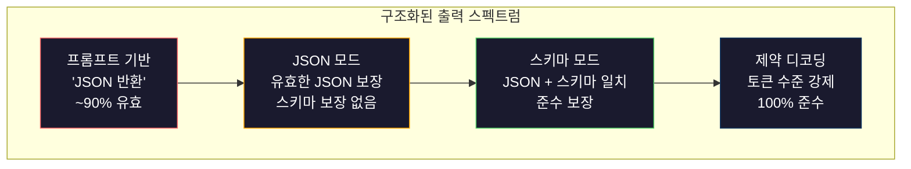
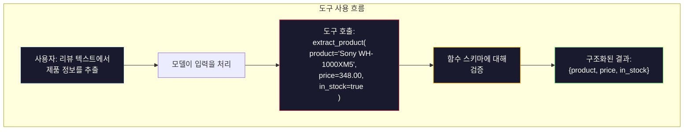

# 구조화된 출력: JSON, 스키마 검증, 제약 디코딩

> LLM은 문자열을 반환합니다. 애플리케이션은 JSON이 필요합니다. 이 간극은 모델 환각보다 더 많은 프로덕션 시스템을 crash시켰습니다. 구조화된 출력은 자연어와 타입이 지정된 데이터 사이의 다리입니다. 이를 올바르게 구현하면 LLM은 신뢰할 수 있는 API가 됩니다. 잘못하면 새벽 3시에 정규식으로 자유 텍스트를 파싱하고 있을 것입니다.

**유형:** Build
**언어:** Python
**선수 요건:** 10단계, 01-05강 (LLM을 처음부터 구축하기)
**시간:** 약 90분

**관련:** 5단계 · 20강 (구조화된 출력 및 제약 디코딩)은 디코더 수준의 이론(FSM/CFG 로그it 프로세서, Outlines, XGrammar)을 다룹니다. 이 강의는 프로덕션 SDK 표면(OpenAI `response_format`, Anthropic 도구 사용, Instructor)에 집중합니다. API 아래에서 일어나는 일을 이해하려면 5단계 · 20강을 먼저 읽어 보세요.

## 학습 목표

- OpenAI 및 Anthropic API 매개변수를 사용하여 JSON 모드 및 스키마 제약 출력을 구현합니다
- 잘못된 LLM 출력을 거부하고 오류 피드백으로 재시도하는 Pydantic 검증 계층을 구축합니다
- 후처리 없이 토큰 수준에서 유효한 JSON을 강제하는 제약 디코딩의 작동 방식을 설명합니다
- 비구조화된 텍스트를 타입이 지정된 데이터 구조로 신뢰성 있게 변환하는 견고한 추출 프롬프트를 설계합니다

## 문제점

LLM에게 "이 텍스트에서 제품 이름, 가격, 가용성을 추출하세요"라고 요청합니다. 응답은 다음과 같습니다:

```
The product is the Sony WH-1000XM5 headphones, which cost $348.00 and are currently in stock.
```

완벽하게 정확한 답변입니다. 하지만 애플리케이션에는 전혀 쓸모가 없습니다. 재고 시스템은 `{"product": "Sony WH-1000XM5", "price": 348.00, "in_stock": true}`이 필요합니다. 특정 키, 특정 타입, 특정 값 제약이 있는 JSON 객체가 필요합니다. 문장이 필요한 것이 아닙니다.

소박한 해결책: 프롬프트에 "JSON으로 응답하세요"를 추가합니다. 이는 90%의 경우 잘 작동합니다. 나머지 10%는 모델이 JSON을 마크다운 코드 펜스에 감싸거나, "JSON은 다음과 같습니다:"와 같은 서문을 추가하거나, 대괄호를 조기에 닫아 구문적으로 유효하지 않은 JSON을 생성합니다. JSON 파서가 crash합니다. 파이프라인이 끊어집니다. try/except와 재시도 루프를 추가합니다. 재시도는 때때로 다른 데이터를 생성합니다. 이제 파싱 문제 위에 일관성 문제가 추가됩니다.

이것은 프롬프트 엔지니어링 문제가 아닙니다. 디코딩 문제입니다. 모델은 토큰을 왼쪽에서 오른쪽으로 생성합니다. 각 위치에서 10만 개 이상의 어휘 중 가장 가능성 높은 다음 토큰을 선택합니다. 그중 대부분은 특정 위치에서 유효하지 않은 JSON을 생성합니다. 모델이 `{"price":`을 출력했다면, 다음 토큰은 숫자, 따옴표(문자열용), `null`, `true`, `false`, 또는 음수 부호여야 합니다. 그 외의 것은 유효하지 않은 JSON을 생성합니다. 제약이 없다면, 모델은 문법적으로 치명적으로 잘못된, 완전히 합리적인 영어 단어를 선택할 수 있습니다.

## 개념

### 구조화된 출력 스펙트럼

구조화된 출력 제어에는 네 가지 수준이 있으며, 각각이 이전 수준보다 더 신뢰할 수 있습니다.



**프롬프트 기반** ("유효한 JSON으로 응답"): 강제 없음. 모델은 보통 따르지만 때로는 따르지 않습니다. 신뢰도: ~90%. 실패 모드: 마크다운 울타리, 서문 텍스트, 잘린 출력, 잘못된 구조.

**JSON 모드**: API가 출력이 유효한 JSON임을 보장합니다. OpenAI의 `response_format: { type: "json_object" }`가 이를 활성화합니다. 출력은 오류 없이 파싱됩니다. 하지만 예상 스키마와 일치하지 않을 수 있습니다 -- 추가 키, 잘못된 타입, 누락된 필드.

**스키마 모드**: API가 JSON 스키마를 받아 출력이 이를 일치하도록 보장합니다. 2026년 현재 모든 주요 제공자가 이를 네이티브로 지원합니다: OpenAI의 `response_format: { type: "json_schema", json_schema: {...} }` (`tool_choice="required"`로도), Anthropic의 `input_schema`를 사용한 도구 사용, Gemini의 `response_schema` + `response_mime_type: "application/json"`. 출력은 지정된 정확한 키, 타입, 제약 조건을 가집니다.

**제약 디코딩**: 생성 중 각 토큰 위치에서 디코더는 유효하지 않은 출력을 생성할 모든 토큰을 마스킹합니다. 스키마가 숫자를 요구하는데 모델이 문자를 출력하려 한다면, 그 토큰의 확률은 0으로 설정됩니다. 모델은 유효한 출력으로 이어지는 토큰만 생성할 수 있습니다. 이것이 OpenAI의 구조화된 출력 모드와 Outlines, Guidance 같은 라이브러리가 내부적으로 구현하는 방식입니다.

### JSON 스키마: 계약 언어

JSON Schema는 모델(또는 검증 레이어)에 출력의 형태가 어떻게 되어야 하는지 알려주는 방법입니다. 모든 주요 구조화된 출력 시스템이 이를 사용합니다.

```json
{
  "type": "object",
  "properties": {
    "product": { "type": "string" },
    "price": { "type": "number", "minimum": 0 },
    "in_stock": { "type": "boolean" },
    "categories": {
      "type": "array",
      "items": { "type": "string" }
    }
  },
  "required": ["product", "price", "in_stock"]
}
```

이 스키마는 다음과 같이 말합니다: 출력은 문자열 `product`, 음수가 아닌 숫자 `price`, 불리언 `in_stock`, 그리고 선택적인 문자열 배열 `categories`을 포함하는 객체여야 합니다. 일치하지 않는 출력은 거부됩니다.

스키마는 중첩 객체, 타입이 지정된 항목을 가진 배열, 열거형(문자열을 특정 값으로 제한), 패턴 매칭(문자열에 대한 정규식), 그리고 조합자(다형성 출력에 대한 oneOf, anyOf, allOf) 같은 어려운 케이스를 처리합니다.

### Pydantic 패턴

Python에서는 JSON Schema를 직접 작성하지 않습니다. Pydantic 모델을 정의하면 스키마가 자동으로 생성됩니다.

```python
from pydantic import BaseModel

class Product(BaseModel):
    product: str
    price: float
    in_stock: bool
    categories: list[str] = []
```

이것은 위와 동일한 JSON Schema를 생성합니다. Instructor 라이브러리(및 OpenAI SDK)는 Pydantic 모델을 직접 허용합니다: 모델 클래스를 전달하면 검증된 인스턴스를 반환받습니다. LLM 출력이 일치하지 않으면 Instructor가 자동으로 재시도합니다.

### 함수 호출 / 도구 사용

동일한 문제에 대한 대안적인 인터페이스입니다. 모델이 JSON을 직접 생성하도록 요청하는 대신, 타입이 지정된 매개변수를 가진 "도구"(함수)를 정의합니다. 모델은 구조화된 인수를 가진 함수 호출을 출력합니다. OpenAI는 이를 "함수 호출(function calling)"이라고 부르고, Anthropic는 "도구 사용(tool use)"이라고 부릅니다. 결과는 동일합니다: 구조화된 데이터.



모델이 매개변수를 채우는 것뿐만 아니라 호출할 함수를 선택해야 할 때 도구 사용이 선호됩니다. 10가지 다른 추출 스키마가 있고 모델이 입력에 따라 올바른 것을 선택해야 한다면, 도구 사용은 스키마 선택과 구조화된 출력 모두를 제공합니다.

### 일반적인 실패 모드

스키마 강제 적용이 있더라도, 구조화된 출력은 미묘한 방식으로 실패할 수 있습니다.

**환각 값(Hallucinated values)**: 출력은 스키마와 일치하지만, 발명된 데이터를 포함합니다. 텍스트에 $348이라고 적혀 있는데 모델이 `{"price": 299.99}`을 생성하는 경우입니다. 스키마 검증은 이를 잡아낼 수 없습니다 -- 타입은 맞지만 값이 틀렸기 때문입니다.

**열거형 혼동(Enum confusion)**: 필드를 `["in_stock", "out_of_stock", "preorder"]`으로 제한합니다. 모델이 `"available"`을 출력합니다 -- 의미적으로는 맞지만, 허용된 집합에 속하지 않습니다. 좋은 제약 디코딩(제약 디코딩)은 이를 방지합니다. 프롬프트 기반 접근법은 방지하지 못합니다.

**중첩 객체 깊이(Nested object depth)**: 깊게 중첩된 스키마(4단계 이상)는 더 많은 오류를 생성합니다. 중첩 단계마다 모델이 구조를 놓칠 수 있는 지점이 됩니다.

**배열 길이(Array length)**: 모델이 배열에 너무 많거나 너무 적은 항목을 생성할 수 있습니다. 스키마는 `minItems`과 `maxItems`을 지원하지만, 모든 제공자가 디코딩 단계에서 이를 강제하지는 않습니다.

**선택 필드 생략(Optional field omission)**: 모델은 기술적으로 선택 필드이지만 사용 사례에서 의미적으로 중요한 필드를 생략합니다. 데이터가 때때로 누락되더라도 스키마에서 이를 필수(required)로 설정하세요 -- 모델이 `null`을 명시적으로 생성하도록 강제합니다.

```figure
mx-schema-funnel
```

## 구현하기

### 1단계: JSON 스키마 검증기

Python 객체가 JSON 스키마와 일치하는지 확인하는 검증기를 처음부터 구축해 보세요. 이는 출력 측에서 준수를 검증하는 데 사용됩니다.

```python
import json

def validate_schema(data, schema):
    errors = []
    _validate(data, schema, "", errors)
    return errors

def _validate(data, schema, path, errors):
    schema_type = schema.get("type")

    if schema_type == "object":
        if not isinstance(data, dict):
            errors.append(f"{path}: expected object, got {type(data).__name__}")
            return
        for key in schema.get("required", []):
            if key not in data:
                errors.append(f"{path}.{key}: required field missing")
        properties = schema.get("properties", {})
        for key, value in data.items():
            if key in properties:
                _validate(value, properties[key], f"{path}.{key}", errors)

    elif schema_type == "array":
        if not isinstance(data, list):
            errors.append(f"{path}: expected array, got {type(data).__name__}")
            return
        min_items = schema.get("minItems", 0)
        max_items = schema.get("maxItems", float("inf"))
        if len(data) < min_items:
            errors.append(f"{path}: array has {len(data)} items, minimum is {min_items}")
        if len(data) > max_items:
            errors.append(f"{path}: array has {len(data)} items, maximum is {max_items}")
        items_schema = schema.get("items", {})
        for i, item in enumerate(data):
            _validate(item, items_schema, f"{path}[{i}]", errors)

    elif schema_type == "string":
        if not isinstance(data, str):
            errors.append(f"{path}: expected string, got {type(data).__name__}")
            return
        enum_values = schema.get("enum")
        if enum_values and data not in enum_values:
            errors.append(f"{path}: '{data}' not in allowed values {enum_values}")

    elif schema_type == "number":
        if not isinstance(data, (int, float)):
            errors.append(f"{path}: expected number, got {type(data).__name__}")
            return
        minimum = schema.get("minimum")
        maximum = schema.get("maximum")
        if minimum is not None and data < minimum:
            errors.append(f"{path}: {data} is less than minimum {minimum}")
        if maximum is not None and data > maximum:
            errors.append(f"{path}: {data} is greater than maximum {maximum}")

    elif schema_type == "boolean":
        if not isinstance(data, bool):
            errors.append(f"{path}: expected boolean, got {type(data).__name__}")

    elif schema_type == "integer":
        if not isinstance(data, int) or isinstance(data, bool):
            errors.append(f"{path}: expected integer, got {type(data).__name__}")
```

### 2단계: Pydantic 스타일 모델에서 스키마로

최소한의 클래스-스키마 변환기를 구축해 보세요. Python 클래스를 정의하고 JSON 스키마를 자동으로 생성합니다.

```python
class SchemaField:
    def __init__(self, field_type, required=True, default=None, enum=None, minimum=None, maximum=None):
        self.field_type = field_type
        self.required = required
        self.default = default
        self.enum = enum
        self.minimum = minimum
        self.maximum = maximum

def python_type_to_schema(field):
    type_map = {
        str: "string",
        int: "integer",
        float: "number",
        bool: "boolean",
    }

    schema = {}

    if field.field_type in type_map:
        schema["type"] = type_map[field.field_type]
    elif field.field_type == list:
        schema["type"] = "array"
        schema["items"] = {"type": "string"}
    elif isinstance(field.field_type, dict):
        schema = field.field_type

    if field.enum:
        schema["enum"] = field.enum
    if field.minimum is not None:
        schema["minimum"] = field.minimum
    if field.maximum is not None:
        schema["maximum"] = field.maximum

    return schema

def model_to_schema(name, fields):
    properties = {}
    required = []

    for field_name, field in fields.items():
        properties[field_name] = python_type_to_schema(field)
        if field.required:
            required.append(field_name)

    return {
        "type": "object",
        "properties": properties,
        "required": required,
    }
```

### 3단계: 제약 토큰 필터

제약 디코딩(제약 디코딩)을 시뮬레이션합니다. 부분적인 JSON 문자열과 스키마가 주어졌을 때, 현재 위치에서 유효한 토큰 카테고리를 결정합니다.

```python
def next_valid_tokens(partial_json, schema):
    stripped = partial_json.strip()

    if not stripped:
        return ["{"]

    try:
        json.loads(stripped)
        return ["<EOS>"]
    except json.JSONDecodeError:
        pass

    last_char = stripped[-1] if stripped else ""

    if last_char == "{":
        return ['"', "}"]
    elif last_char == '"':
        if stripped.endswith('":'):
            return ['"', "0-9", "true", "false", "null", "[", "{"]
        return ["a-z", '"']
    elif last_char == ":":
        return [" ", '"', "0-9", "true", "false", "null", "[", "{"]
    elif last_char == ",":
        return [" ", '"', "{", "["]
    elif last_char in "0123456789":
        return ["0-9", ".", ",", "}", "]"]
    elif last_char == "}":
        return [",", "}", "]", "<EOS>"]
    elif last_char == "]":
        return [",", "}", "<EOS>"]
    elif last_char == "[":
        return ['"', "0-9", "true", "false", "null", "{", "[", "]"]
    else:
        return ["any"]

def demonstrate_constrained_decoding():
    partial_states = [
        '',
        '{',
        '{"product"',
        '{"product":',
        '{"product": "Sony"',
        '{"product": "Sony",',
        '{"product": "Sony", "price":',
        '{"product": "Sony", "price": 348',
        '{"product": "Sony", "price": 348}',
    ]

    print(f"{'Partial JSON':<45} {'Valid Next Tokens'}")
    print("-" * 80)
    for state in partial_states:
        valid = next_valid_tokens(state, {})
        display = state if state else "(empty)"
        print(f"{display:<45} {valid}")
```

### 4단계: 추출 파이프라인

모든 것을 추출 파이프라인으로 결합합니다: 스키마를 정의하고, LLM이 구조화된 출력을 생성하는 것을 시뮬레이션하며, 출력을 검증하고, 재시도를 처리합니다.

```python
def simulate_llm_extraction(text, schema, attempt=0):
    if "headphones" in text.lower() or "sony" in text.lower():
        if attempt == 0:
            return '{"product": "Sony WH-1000XM5", "price": 348.00, "in_stock": true, "categories": ["audio", "headphones"]}'
        return '{"product": "Sony WH-1000XM5", "price": 348.00, "in_stock": true}'

    if "laptop" in text.lower():
        return '{"product": "MacBook Pro 16", "price": 2499.00, "in_stock": false, "categories": ["computers"]}'

    return '{"product": "Unknown", "price": 0, "in_stock": false}'

def extract_with_retry(text, schema, max_retries=3):
    for attempt in range(max_retries):
        raw = simulate_llm_extraction(text, schema, attempt)

        try:
            data = json.loads(raw)
        except json.JSONDecodeError as e:
            print(f"  Attempt {attempt + 1}: JSON parse error -- {e}")
            continue

        errors = validate_schema(data, schema)
        if not errors:
            return data

        print(f"  Attempt {attempt + 1}: Schema validation errors -- {errors}")

    return None

product_schema = {
    "type": "object",
    "properties": {
        "product": {"type": "string"},
        "price": {"type": "number", "minimum": 0},
        "in_stock": {"type": "boolean"},
        "categories": {"type": "array", "items": {"type": "string"}},
    },
    "required": ["product", "price", "in_stock"],
}
```

### 5단계: 전체 파이프라인 실행

```python
def run_demo():
    print("=" * 60)
    print("  Structured Output Pipeline Demo")
    print("=" * 60)

    print("\n--- Schema Definition ---")
    product_fields = {
        "product": SchemaField(str),
        "price": SchemaField(float, minimum=0),
        "in_stock": SchemaField(bool),
        "categories": SchemaField(list, required=False),
    }
    generated_schema = model_to_schema("Product", product_fields)
    print(json.dumps(generated_schema, indent=2))

    print("\n--- Schema Validation ---")
    test_cases = [
        ({"product": "Test", "price": 10.0, "in_stock": True}, "Valid object"),
        ({"product": "Test", "price": -5.0, "in_stock": True}, "Negative price"),
        ({"product": "Test", "in_stock": True}, "Missing price"),
        ({"product": "Test", "price": "ten", "in_stock": True}, "String as price"),
        ("not an object", "String instead of object"),
    ]

    for data, label in test_cases:
        errors = validate_schema(data, product_schema)
        status = "PASS" if not errors else f"FAIL: {errors}"
        print(f"  {label}: {status}")

    print("\n--- Constrained Decoding Simulation ---")
    demonstrate_constrained_decoding()

    print("\n--- Extraction Pipeline ---")
    texts = [
        "The Sony WH-1000XM5 headphones are priced at $348 and currently available.",
        "The new MacBook Pro 16-inch laptop costs $2499 but is sold out.",
        "This is a random sentence with no product info.",
    ]

    for text in texts:
        print(f"\n  Input: {text[:60]}...")
        result = extract_with_retry(text, product_schema)
        if result:
            print(f"  Output: {json.dumps(result)}")
        else:
            print(f"  Output: FAILED after retries")
```

## 사용하기

### OpenAI 구조화된 출력

```python
# from openai import OpenAI
# from pydantic import BaseModel
#
# client = OpenAI()
#
# class Product(BaseModel):
#     product: str
#     price: float
#     in_stock: bool
#
# response = client.beta.chat.completions.parse(
#     model="gpt-5-mini",
#     messages=[
#         {"role": "system", "content": "Extract product information."},
#         {"role": "user", "content": "Sony WH-1000XM5, $348, in stock"},
#     ],
#     response_format=Product,
# )
#
# product = response.choices[0].message.parsed
# print(product.product, product.price, product.in_stock)
```

OpenAI의 구조화된 출력 모드(Structured Output)는 내부적으로 제약 디코딩(제약 디코딩)을 사용합니다. 모델이 생성하는 모든 토큰은 Pydantic 스키마와 일치하는 출력을 생성하도록 보장됩니다. 재시도가 필요하지 않으며, 검증도 필요하지 않습니다. 제약 조건은 디코딩 과정에 내장되어 있습니다.

### Anthropic 도구 사용(Tool Use)

```python
# import anthropic
#
# client = anthropic.Anthropic()
#
# response = client.messages.create(
#     model="claude-opus-4-7",
#     max_tokens=1024,
#     tools=[{
#         "name": "extract_product",
#         "description": "Extract product information from text",
#         "input_schema": {
#             "type": "object",
#             "properties": {
#                 "product": {"type": "string"},
#                 "price": {"type": "number"},
#                 "in_stock": {"type": "boolean"},
#             },
#             "required": ["product", "price", "in_stock"],
#         },
#     }],
#     messages=[{"role": "user", "content": "Extract: Sony WH-1000XM5, $348, in stock"}],
# )
```

Anthropic은 도구 사용(tool use)을 통해 구조화된 출력(structured output)을 달성합니다. 모델은 input_schema와 일치하는 구조화된 인수를 가진 도구 호출을 방출합니다. 결과는 동일하지만 API 표면이 다릅니다.

### Instructor 라이브러리

```python
# pip install instructor
# import instructor
# from openai import OpenAI
# from pydantic import BaseModel
#
# client = instructor.from_openai(OpenAI())
#
# class Product(BaseModel):
#     product: str
#     price: float
#     in_stock: bool
#
# product = client.chat.completions.create(
#     model="gpt-5-mini",
#     response_model=Product,
#     messages=[{"role": "user", "content": "Sony WH-1000XM5, $348, in stock"}],
# )
```

Instructor는 모든 LLM 클라이언트를 감싸고 검증과 함께 자동 재시도를 추가합니다. 첫 번째 시도가 검증에 실패하면, 오류를 컨텍스트로 모델에 보내고 출력을 수정하도록 요청합니다. 이는 OpenAI뿐만 아니라 모든 프로바이더와 함께 작동합니다.

## 출시하기

이 강은 `outputs/prompt-structured-extractor.md`를 생성합니다. 이는 스키마 정의가 주어지면 모든 텍스트에서 구조화된 데이터를 추출하는 재사용 가능한 프롬프트 템플릿입니다. JSON Schema와 비구조화된 텍스트를 입력하면 검증된 JSON을 반환합니다.

이 강은 `outputs/skill-structured-outputs.md`도 생성합니다. 이는 프로바이더, 신뢰성 요구 사항, 스키마 복잡성에 따라 적절한 구조화된 출력 전략을 선택하기 위한 의사 결정 프레임워크입니다.

## 연습 문제

1. 스키마 검증기를 확장하여 `oneOf`를 지원하세요 (데이터가 여러 스키마 중 정확히 하나와 일치해야 합니다). 이는 다형성 출력, 예를 들어 서로 다른 형태를 가진 `Product` 또는 `Service` 객체 중 하나일 수 있는 필드를 처리합니다.

2. 두 스키마를 비교하고 파괴적 변경 사항(필수 필드 제거, 타입 변경)과 비파괴적 변경 사항(선택 필드 추가, 제약 완화)을 식별하는 "스키마 diff" 도구를 구축하세요. 이는 프로덕션 환경에서 추출 스키마의 버저닝에 필수적입니다.

3. 더 현실적인 제약 디코딩 시뮬레이터를 구현하세요. JSON Schema와 100개 토큰(문자, 숫자, 구두점, 키워드)의 어휘가 주어지면, 생성을 단계별로 진행하면서 각 위치에서 유효하지 않은 토큰을 마스킹하세요. 각 단계에서 어휘의 몇 퍼센트가 유효한지 측정하세요.

4. 추출 평가 스위트를 구축하세요. 수동으로 라벨링된 JSON 출력이 포함된 제품 설명 50개를 만드세요. 추출 파이프라인을 50개 모두에 실행하고 정확 일치, 필드 단위 정확도, 타입 준수를 측정하세요. 가장 정확하게 추출하기 어려운 필드가 무엇인지 식별하세요.

5. 추출 파이프라인에 "신뢰도 점수"를 추가하세요. 각 추출된 필드에 대해 모델의 신뢰도를 추정하세요 (토큰 확률에 기반하거나, 추출을 3번 실행하고 일관성을 측정하여). 신뢰도가 낮은 필드는 인간 검토 대상으로 표시하세요.

## 핵심 용어

| 용어 | 사람들이 말하는 것 | 실제 의미 |
|------|----------------|----------------------|
| JSON 모드 | "JSON 반환" | 구문적으로 유효한 JSON 출력을 보장하는 API 플래그이지만, 특정 스키마를 강제하지는 않음 |
| 구조화된 출력(Structured Output) | "타입이 지정된 JSON" | 특정 JSON Schema와 일치하는 출력으로, 올바른 키, 타입 및 제약 조건을 포함 |
| 제약 디코딩(제약 디코딩) | "가이드된 생성" | 각 토큰 위치에서 유효하지 않은 출력을 생성하는 토큰을 마스킹하여 -- 100% 스키마 준수를 보장 |
| JSON Schema | "JSON 템플릿" | JSON 데이터의 구조, 타입 및 제약 조건을 설명하는 선언적 언어 (OpenAPI, JSON Forms 등에서 사용) |
| Pydantic | "Python 데이터 클래스+" | 타입 검증을 포함하여 데이터 모델을 정의하는 Python 라이브러리로, FastAPI 및 Instructor가 JSON Schema를 생성하는 데 사용 |
| 함수 호출(Function Calling) | "도구 사용" | LLM이 자유 텍스트 대신 구조화된 함수 호출(이름 + 타입이 지정된 인자)을 출력 -- OpenAI와 Anthropic 모두 이를 지원 |
| Instructor | "LLM을 위한 Pydantic" | 검증된 Pydantic 인스턴스를 반환하도록 LLM 클라이언트를 래핑하는 Python 라이브러리로, 검증 실패 시 자동 재시도 기능 포함 |
| 토큰 마스킹(Token masking) | "어휘 필터링" | 생성 중 특정 토큰 확률을 0으로 설정하여 모델이 이를 생성할 수 없게 함 |
| 스키마 준수(Schema compliance) | "형태 일치" | 출력에 모든 필수 필드가 있고, 타입이 정확하며, 값이 제약 조건 내에 있고, 허용되지 않은 추가 필드가 없음 |
| 재시도 루프(Retry loop) | "작동할 때까지 시도" | 검증 오류를 모델에 보내 출력을 수정하도록 요청 -- Instructor는 이를 자동으로 수행하며, 설정 가능한 최대 횟수까지 반복 |

## 추가 읽기

- [OpenAI Structured Outputs Guide](https://platform.openai.com/docs/guides/structured-outputs) -- OpenAI API에서 JSON Schema 기반 제약 디코딩(제약 디코딩)에 대한 공식 문서
- [Willard & Louf, 2023 -- "Efficient Guided Generation for Large Language Models"](https://arxiv.org/abs/2307.09702) -- Outlines 논문으로, JSON Schema를 토큰 수준 제약 조건을 위한 유한 상태 기계로 컴파일하는 방법을 설명
- [Instructor documentation](https://python.useinstructor.com/) — Pydantic 검증 및 재시도를 통해 모든 LLM에서 구조화된 출력을 얻기 위한 표준 라이브러리입니다
- [Anthropic Tool Use Guide](https://docs.anthropic.com/en/docs/tool-use) — Claude가 JSON Schema의 input_schema를 사용하여 도구 호출을 통해 구조화된 출력을 구현하는 방식입니다
- [JSON Schema specification](https://json-schema.org/) — 모든 주요 구조화된 출력 시스템이 사용하는 스키마 언어의 전체 사양입니다
- [Outlines library](https://github.com/outlines-dev/outlines) — 정규식 및 JSON Schema를 유한 상태 기계로 컴파일하여 오픈소스 제약 생성을 수행합니다
- [Dong et al., "XGrammar: Flexible and Efficient Structured Generation Engine for Large Language Models" (MLSys 2025)](https://arxiv.org/abs/2411.15100) — 현재 최신 문법 엔진으로, 푸시다운 오토마톤 컴파일을 통해 토큰을 약 100 ns / 토큰 속도로 마스킹합니다
- [Beurer-Kellner et al., "Prompting Is Programming: A Query Language for Large Language Models" (LMQL)](https://arxiv.org/abs/2212.06094) — 제약 디코딩을 타입 및 값 제약이 있는 쿼리 언어로 정의한 LMQL 논문입니다
- [Microsoft Guidance (framework docs)](https://github.com/guidance-ai/guidance) — 템플릿 기반 제약 생성으로, Outlines 및 XGrammar와 벤더에 독립적인 보완 관계를 형성합니다
