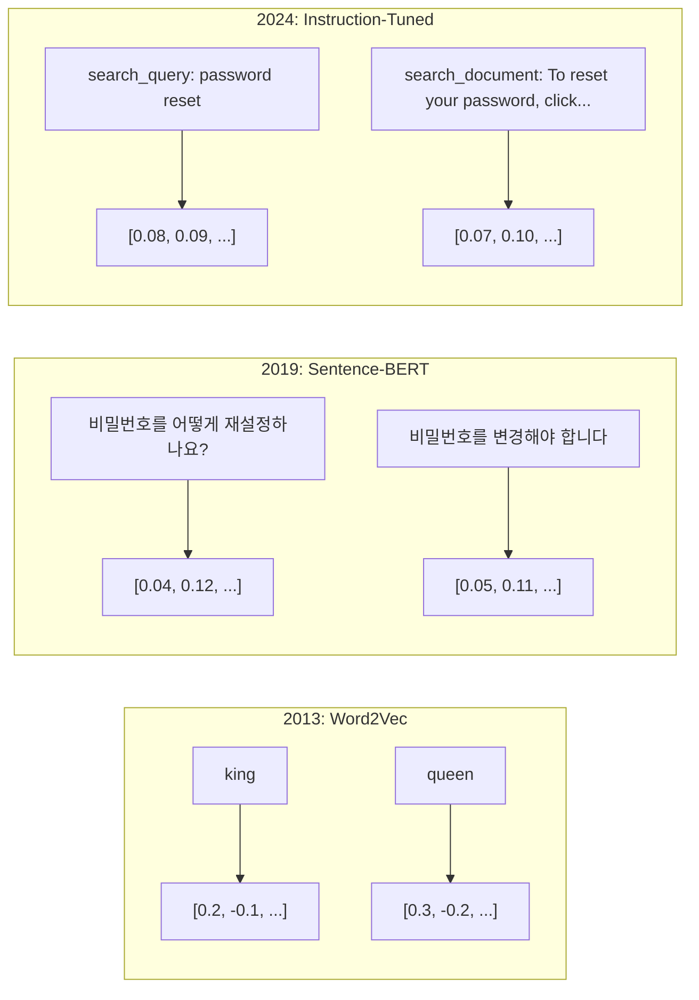
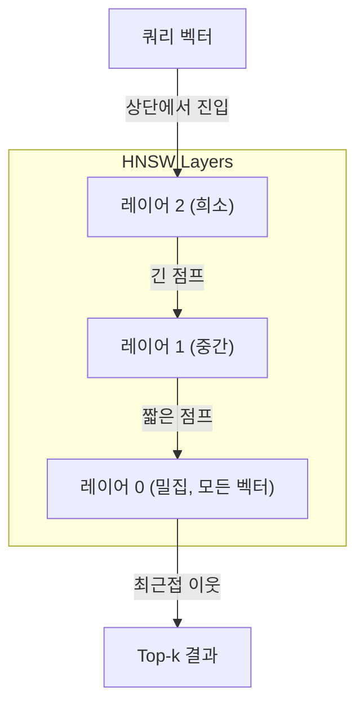

# 임베딩 및 벡터 표현

> 텍스트는 이산적입니다. 수학은 연속적입니다. LLM에게 "유사한" 문서를 찾거나, 의미를 비교하거나, 키워드를 넘어서 검색하도록 요청할 때마다, 이 두 세계를 연결하는 다리에 의존하고 있습니다. 그 다리가 바로 임베딩입니다. 임베딩을 이해하지 못하면 현대 AI를 이해하지 못합니다. 단순히 사용하는 것뿐입니다.

**유형:** Build
**언어:** Python
**선수 요건:** 11단계, 01강 (프롬프트 엔지니어링)
**시간:** 약 75분

**관련:** 5단계 · 22강 (임베딩 모델 심층 분석)은 밀집(dense) vs 희소(sparse) vs 다중 벡터, Matryoshka 절단, 축별 모델 선택을 다룹니다. 이 강의는 프로덕션 파이프라인(벡터 DB, HNSW, 유사도 수학)에 집중합니다. 모델을 선택하기 전에 5단계 · 22강을 읽어 보세요.

## 학습 목표

- API 제공자 및 오픈 소스 모델을 사용하여 텍스트 임베딩을 생성하고, 그들 간의 코사인 유사도(Cosine Similarity)를 계산해 보세요
- 키워드 검색이 처리할 수 없는 어휘 불일치(vocabulary mismatch) 문제를 임베딩이 왜 해결하는지 설명해 보세요
- 정확한 키워드 매칭이 아닌 의미에 따라 문서를 검색하는 시맨틱 검색 인덱스를 구축해 보세요
- 검색 벤치마크(precision@k, recall)를 사용하여 임베딩 품질을 평가하고, 작업에 적합한 임베딩 모델을 선택해 보세요

## 문제점

10,000개의 지원 티켓이 있습니다. 고객이 "my payment didn't go through."라고 작성했습니다. 유사한 과거 티켓을 찾아야 합니다. 키워드 검색은 "payment"와 "didn't go through."를 포함하는 티켓을 찾습니다. "transaction failed," "charge was declined," "billing error."는 놓칩니다. 이 티켓들은 완전히 다른 단어를 사용하지만 정확히 동일한 문제를 설명하고 있습니다.

이것이 어휘 불일치(vocabulary mismatch) 문제입니다. 인간 언어는 같은 것을 표현하는 수십 가지 방법을 가지고 있습니다. 키워드 검색은 각 단어를 의미가 없는 독립적인 기호로 취급합니다. "declined"와 "didn't go through"가 동일한 개념을 지칭한다는 것을 알 수 없습니다.

철자(spelling)가 아닌 의미(meaning)가 유사도를 결정하는 텍스트 표현이 필요합니다. "my payment didn't go through"와 "transaction was declined"를 어떤 수학 공간에서 가깝게 배치하고, "payment"라는 단어를 공유함에도 불구하고 "my payment arrived on time"는 멀리 밀어내는 방법이 필요합니다.

그 표현은 임베딩(Embedding)입니다.

## 개념

### 임베딩(Embedding)이란?

임베딩(Embedding)은 텍스트의 의미를 나타내는 밀집(floating-point) 벡터입니다. "밀집(dense)"이라는 용어가 중요합니다. 모든 차원이 정보를 담고 있으며, 대부분의 차원이 0인 희소 표현(bag-of-words, TF-IDF)과는 다릅니다.

"The cat sat on the mat"은 `[0.023, -0.041, 0.087, ..., 0.012]`와 같은 형태가 됩니다. 이는 모델에 따라 768에서 3072개의 숫자 목록입니다. 이 숫자들은 의미를 인코딩합니다. 숫자를 직접 검사하지는 않으며, 비교만 수행합니다.

### Word2Vec의 돌파구

2013년, Google의 Tomas Mikolov와 동료들이 Word2Vec을 발표했습니다. 핵심 통찰은 다음과 같습니다. 주변 단어로부터 단어를 예측하는(또는 단어로부터 주변 단어를 예측하는) 신경망을 학습하면, 은닉층 가중치가 의미 있는 벡터 표현이 됩니다.

유명한 결과:

```
king - man + woman = queen
```

단어 임베딩(Embedding)에 대한 벡터 연산은 의미적 관계를 포착합니다. "man"에서 "woman"으로 가는 방향은 "king"에서 "queen"으로 가는 방향과 대략 동일합니다. 이는 기하학이 의미를 인코딩할 수 있다는 사실을 분야가 깨달은 순간이었습니다.

Word2Vec은 300차원 벡터를 생성했습니다. 각 단어는 문맥에 관계없이 하나의 벡터를 가졌습니다. "river bank"의 "Bank"과 "bank account"의 "bank"는 동일한 임베딩(Embedding)을 가졌습니다. 이 한계는 이후 10년간의 연구를 촉진했습니다.

### 단어에서 문장으로

단어 임베딩(Embedding)은 단일 토큰을 표현합니다. 프로덕션 시스템은 전체 문장, 단락, 문서를 임베딩(Embedding)해야 합니다. 네 가지 접근법이 등장했습니다:

**평균화(Averaging)**: 문장 내 모든 단어 벡터의 평균을 취합니다. 저렴하고 손실이 크지만, 짧은 텍스트에는 놀라울 정도로 잘 작동합니다. 단어 순서를 완전히 잃습니다. "dog bites man"과 "man bites dog"는 동일한 임베딩(Embedding)을 얻습니다.

**CLS 토큰**: 트랜스포머(Transformer) 모델(BERT, 2018)은 전체 입력을 대표하는 특별한 [CLS] 토큰 임베딩(Embedding)을 출력합니다. 평균화보다 낫지만, [CLS] 토큰은 유사성이 아닌 다음 문장 예측을 위해 학습되었습니다.

**대조 학습(Contrastive Learning)**: 유사한 쌍은 가깝게, 비유사한 쌍은 멀리 떨어뜨리도록 모델을 명시적으로 학습합니다. Sentence-BERT (Reimers & Gurevych, 2019)는 이 접근법을 사용했으며, 현대 임베딩 모델의 기반이 되었습니다. "비밀번호를 어떻게 재설정하나요?"와 "비밀번호를 변경해야 합니다"가 주어지면, 모델은 이 두 문장이 거의 동일한 벡터를 가져야 함을 학습합니다.

**지시문 튜닝 임베딩(Instruction-tuned Embeddings)**: 최신 접근법입니다. E5 및 GTE와 같은 모델은 "search_query:", "search_document:"와 같은 작업 접미사를 받아 어떤 종류의 임베딩을 생성할지 모델에 지시합니다. 이를 통해 하나의 모델이 여러 작업을 수행할 수 있습니다.



### 현대 임베딩 모델

시장은 몇 가지 프로덕션급 옵션으로 정착했습니다 (2026년 초 기준 MTEB 점수, MTEB v2):

| 모델 | 제공자 | 차원 | MTEB | 컨텍스트 | 비용 / 1M 토큰 |
|-------|----------|-----------|------|---------|------------------|
| Gemini Embedding 2 | Google | 3072 (Matryoshka) | 67.7 (검색) | 8192 | $0.15 |
| embed-v4 | Cohere | 1024 (Matryoshka) | 65.2 | 128K | $0.12 |
| voyage-4 | Voyage AI | 1024/2048 (Matryoshka) | 66.8 | 32K | $0.12 |
| text-embedding-3-large | OpenAI | 3072 (Matryoshka) | 64.6 | 8192 | $0.13 |
| text-embedding-3-small | OpenAI | 1536 (Matryoshka) | 62.3 | 8192 | $0.02 |
| BGE-M3 | BAAI | 1024 (밀집+희소+ColBERT) | 63.0 다국어 | 8192 | 오픈 웨이트 |
| Qwen3-Embedding | Alibaba | 4096 (Matryoshka) | 66.9 | 32K | 오픈 웨이트 |
| Nomic-embed-v2 | Nomic | 768 (Matryoshka) | 63.1 | 8192 | 오픈 웨이트 |

MTEB (대규모 텍스트 임베딩 벤치마크)(Massive Text Embedding Benchmark) v2는 검색, 분류, 클러스터링, 리랭킹 및 요약 등 100개 이상의 작업을 포함합니다. 점수가 높을수록 좋습니다. 2026년까지 오픈 웨이트 모델(Qwen3-Embedding, BGE-M3)은 대부분의 축에서 폐쇄형 호스트 모델과 동등하거나 더 나은 성능을 보입니다. Gemini Embedding 2는 순수 검색 성능에서 선두를 달리고 있으며, Voyage/Cohere는 특정 도메인(금융, 법률, 코드)에서 선두를 달리고 있습니다. 확정하기 전에 항상 자체 쿼리로 벤치마킹해 보세요.

### 유사도 지표

두 임베딩 벡터가 얼마나 유사한지 측정하는 세 가지 방법입니다:

**코사인 유사도(Cosine similarity)**: 두 벡터 사이의 각도의 코사인 값입니다. -1(반대 방향)부터 1(동일한 방향)까지의 범위를 가집니다. 크기는 무시합니다 -- 같은 방향을 가리킨다면 10단어 문장과 500단어 문서가 모두 1.0의 점수를 받을 수 있습니다. 사용 사례의 90%에서 기본값으로 사용됩니다.

```
cosine_sim(a, b) = dot(a, b) / (||a|| * ||b||)
```

**내적(Dot product)**: 두 벡터의 순수 내적 값입니다. 벡터가 정규화(단위 길이)되어 있을 경우 코사인 유사도와 동일합니다. 계산 속도가 더 빠릅니다. OpenAI의 임베딩은 정규화되어 있으므로, 내적과 코사인 유사도는 동일한 순위를 산출합니다.

```
dot(a, b) = sum(a_i * b_i)
```

**유클리드(L2) 거리(Euclidean (L2) distance)**: 벡터 공간에서의 직선 거리입니다. 값이 작을수록 더 유사합니다. 크기 차이에 민감합니다. 방향뿐만 아니라 공간에서의 절대적인 위치가 중요한 경우에 사용하세요.

```
L2(a, b) = sqrt(sum((a_i - b_i)^2))
```

어떤 메트릭을 언제 사용할지:

| 메트릭 | 사용 시 | 피해야 할 경우 |
|--------|----------|------------|
| 코사인 유사도(Cosine similarity) | 길이가 다른 텍스트 비교; 대부분의 검색 작업 | 크기가 정보를 담고 있는 경우 |
| 내적(Dot product) | 임베딩이 이미 정규화되어 있는 경우; 최대 속도 | 벡터의 크기가 다양하게 변하는 경우 |
| 유클리드 거리(Euclidean distance) | 클러스터링; 공간적 최근접 이웃 문제 | 길이가 극단적으로 다른 문서 비교 |

### 벡터 데이터베이스와 HNSW

브루트 포스(brute-force) 유사성 검색은 쿼리를 저장된 모든 벡터와 비교합니다. 1536차원의 벡터 100만 개가 있을 경우, 쿼리당 15억 번의 곱셈-덧셈 연산이 필요합니다. 너무 느립니다.

벡터 데이터베이스는 근사 최근접 이웃 (ANN)(Approximate Nearest Neighbor (ANN)) 알고리즘으로 이 문제를 해결합니다. 지배적인 알고리즘은 HNSW(Hierarchical Navigable Small World)입니다:

1. 벡터의 다층 그래프를 구축합니다
2. 상위 레이어는 희소합니다 -- 먼 클러스터 간의 장거리 연결
3. 하위 레이어는 밀집합니다 -- 가까운 벡터 간의 세밀한 연결
4. 검색은 상위 레이어에서 시작하여, 정밀도를 높이기 위해 하위 레이어로 탐욕적으로 내려갑니다
5. O(n) 대신 O(log n) 시간에 근사적인 top-k 결과를 반환합니다

HNSW는 거대한 속도 향상과 교환으로 작은 정확도 손실(통상 95-99% 재현율)을 감수합니다. 벡터 1000만 개가 있을 경우, 브루트 포스는 수 초가 걸립니다. HNSW는 수 밀리초가 걸립니다.



프로덕션 옵션:

| 데이터베이스 | 유형 | 최적 용도 | 최대 규모 |
|----------|------|----------|-----------|
| Pinecone | 관리형 SaaS | 무운영 프로덕션 | 수십억 |
| Weaviate | 오픈 소스 | 셀프 호스팅, 하이브리드 검색 | 1억+ |
| Qdrant | 오픈 소스 | 고성능, 필터링 | 1억+ |
| ChromaDB | 임베디드 | 프로토타이핑, 로컬 개발 | 100만 |
| pgvector | Postgres 확장 | 이미 Postgres 사용 중 | 1000만 |
| FAISS | 라이브러리 | 프로세스 내, 연구 | 10억+ |

### 청킹 전략

문서는 단일 벡터로 임베딩하기에는 너무 길다. 50페이지 PDF는 수십 가지 주제를 다루며, 그 임베딩은 모든 것의 평균이 되어 특정 주제와 유사하지 않게 된다. 문서를 청크로 나누고 각각을 임베딩한다.

**고정 크기 청킹**: N 토큰마다 M 토큰 겹침으로 분할한다. 단순하고 예측 가능하다. 문서에 명확한 구조가 없을 때 잘 작동한다. 512 토큰 청크에 50 토큰 겹침: 청크 1은 토큰 0-511, 청크 2는 토큰 462-973이다.

**문장 기반 청킹**: 문장 경계에서 분할하고, 토큰 한도에 도달할 때까지 문장을 그룹화한다. 각 청크는 최소 한 개의 완전한 문장이다. 고정 크기보다 나은데, 생각을 반으로 자르지 않기 때문이다.

**재귀 청킹**: 가장 큰 경계(섹션 헤더)에서 먼저 분할을 시도한다. 여전히 너무 크면 단락 경계를 시도한다. 그 다음 문장 경계, 그 다음 문자 한도. 이것은 LangChain의 `RecursiveCharacterTextSplitter`이며, 혼합 형식 코퍼스에 잘 작동한다.

**시맨틱 청킹**: 각 문장을 임베딩한 후, 임베딩이 유사한 연속 문장을 그룹화한다. 임베딩 유사도가 임계값 아래로 떨어지면 새 청크를 시작한다. 비용이 많이 든다(각 문장을 개별적으로 임베딩해야 함)가, 가장 일관된 청크를 생성한다.

| 전략 | 복잡도 | 품질 | 최적 용도 |
|----------|-----------|---------|----------|
| 고정 크기 | 낮음 | 적당함 | 비구조화 텍스트, 로그 |
| 문장 기반 | 낮음 | 좋음 | 기사, 이메일 |
| 재귀적 | 중간 | 좋음 | Markdown, HTML, 혼합 문서 |
| 시맨틱 | 높음 | 최상 | 중요한 검색 품질 |

대부분의 시스템에 적합한 균형점: 256-512 토큰 청크와 50 토큰 겹침.

### 바이 인코더 vs 크로스 인코더

바이 인코더는 쿼리와 문서를 독립적으로 임베딩한 후 벡터를 비교합니다. 빠릅니다 -- 쿼리를 한 번 임베딩하고 미리 계산된 문서 임베딩과 비교합니다. 검색에 사용하는 방식입니다.

크로스 인코더는 쿼리와 문서를 단일 입력으로 받아 관련성 점수를 출력합니다. 느립니다 -- 각 쿼리-문서 쌍을 전체 모델을 통해 처리합니다. 쿼리와 문서 토큰을 동시에 어텐션할 수 있으므로 훨씬 더 정확합니다.

프로덕션 패턴: 바이 인코더가 상위 100개 후보를 검색하고, 크로스 인코더가 이를 상위 10개로 리랭킹합니다. 이것이 검색 후 리랭킹 파이프라인입니다.


리랭킹 모델: Cohere Rerank 3.5 (1000 쿼리당 $2), BGE-reranker-v2 (무료, 오픈 소스), Jina Reranker v2 (무료, 오픈 소스).

### 마트리osh카 임베딩

전통적인 임베딩은 전부 또는 전무(all-or-nothing)입니다. 1536차원 벡터는 1536개의 floats를 사용합니다. 재학습 없이 256차원으로 잘라낼 수 없습니다.

Matryoshka Representation Learning (Kusupati et al., 2022)이 이를 해결합니다. 모델은 첫 N 차원이 가장 중요한 정보를 포착하도록 학습되며, 러시아 인형처럼 nested 구조를 가집니다. 1536차원 Matryoshka 임베딩을 256차원으로 잘라내면 일부 정확도가 손실되지만 기능은 유지됩니다.

OpenAI의 text-embedding-3-small 및 text-embedding-3-large는 `dimensions` 매개변수를 통해 Matryoshka 잘라내기를 지원합니다. 1536차원 대신 256차원을 요청하면 MTEB 벤치마크에서 약 3-5%의 정확도 손실로 저장 공간을 6배 줄입니다.

### 이진 양자화

float32으로 저장된 1536차원 임베딩은 6,144 바이트를 사용합니다. 1000만 문서에 곱하면: 벡터만으로도 61 GB가 필요합니다.

이진 양자화는 각 부동소수점 값을 단일 비트로 변환합니다: 양수 값은 1이 되고, 음수 값은 0이 됩니다. 저장 용량은 6,144바이트에서 192바이트로 감소하며, 이는 32배의 감소입니다. 유사도는 해밍 거리(다른 비트의 수를 세는 것)를 사용하여 계산하며, CPU는 이를 단일 명령어로 수행할 수 있습니다.

검색 재현율(retrieval recall)의 정확도 손실은 약 5-10%입니다. 일반적인 패턴은 다음과 같습니다: 수백만 개의 벡터에 대한 1차 검색에는 이진 양자화를 사용하고, 상위 1000개는 전체 정밀도 벡터로 재점수화(rescore)합니다. 이렇게 하면 전체 정밀도 정확도의 95% 이상을 32배 적은 메모리로 달성할 수 있습니다.

```figure
cosine-similarity
```

## 구현하기

우리는 시맨틱 검색 엔진을 처음부터 구축합니다. 벡터 데이터베이스는 없습니다. 외부 임베딩 API도 없습니다. 수학 연산에는 numpy를 사용하는 순수 Python입니다.

### 1단계: 텍스트 청킹

```python
def chunk_text(text, chunk_size=200, overlap=50):
    words = text.split()
    chunks = []
    start = 0
    while start < len(words):
        end = start + chunk_size
        chunk = " ".join(words[start:end])
        chunks.append(chunk)
        start += chunk_size - overlap
    return chunks


def chunk_by_sentences(text, max_chunk_tokens=200):
    sentences = text.replace("\n", " ").split(".")
    sentences = [s.strip() + "." for s in sentences if s.strip()]
    chunks = []
    current_chunk = []
    current_length = 0
    for sentence in sentences:
        sentence_length = len(sentence.split())
        if current_length + sentence_length > max_chunk_tokens and current_chunk:
            chunks.append(" ".join(current_chunk))
            current_chunk = []
            current_length = 0
        current_chunk.append(sentence)
        current_length += sentence_length
    if current_chunk:
        chunks.append(" ".join(current_chunk))
    return chunks
```

### 2단계: 처음부터 임베딩 구축하기

우리는 L2 정규화(L2 normalization)를 적용한 TF-IDF를 사용하여 간단한 밀집 임베딩(dense embedding)을 구현합니다. 이는 신경망 기반 임베딩이 아니지만, 동일한 계약(contract)을 따릅니다: 텍스트가 입력되면 고정 크기의 벡터가 출력되고, 유사한 텍스트는 유사한 벡터를 생성합니다.

```python
import math
import numpy as np
from collections import Counter

class SimpleEmbedder:
    def __init__(self):
        self.vocab = []
        self.idf = []
        self.word_to_idx = {}

    def fit(self, documents):
        vocab_set = set()
        for doc in documents:
            vocab_set.update(doc.lower().split())
        self.vocab = sorted(vocab_set)
        self.word_to_idx = {w: i for i, w in enumerate(self.vocab)}
        n = len(documents)
        self.idf = np.zeros(len(self.vocab))
        for i, word in enumerate(self.vocab):
            doc_count = sum(1 for doc in documents if word in doc.lower().split())
            self.idf[i] = math.log((n + 1) / (doc_count + 1)) + 1

    def embed(self, text):
        words = text.lower().split()
        count = Counter(words)
        total = len(words) if words else 1
        vec = np.zeros(len(self.vocab))
        for word, freq in count.items():
            if word in self.word_to_idx:
                tf = freq / total
                vec[self.word_to_idx[word]] = tf * self.idf[self.word_to_idx[word]]
        norm = np.linalg.norm(vec)
        if norm > 0:
            vec = vec / norm
        return vec
```

### 3단계: 유사도 함수

```python
def cosine_similarity(a, b):
    dot = np.dot(a, b)
    norm_a = np.linalg.norm(a)
    norm_b = np.linalg.norm(b)
    if norm_a == 0 or norm_b == 0:
        return 0.0
    return float(dot / (norm_a * norm_b))


def dot_product(a, b):
    return float(np.dot(a, b))


def euclidean_distance(a, b):
    return float(np.linalg.norm(a - b))
```

### 4단계: 브루트 포스 검색을 사용하는 벡터 인덱스

```python
class VectorIndex:
    def __init__(self):
        self.vectors = []
        self.texts = []
        self.metadata = []

    def add(self, vector, text, meta=None):
        self.vectors.append(vector)
        self.texts.append(text)
        self.metadata.append(meta or {})

    def search(self, query_vector, top_k=5, metric="cosine"):
        scores = []
        for i, vec in enumerate(self.vectors):
            if metric == "cosine":
                score = cosine_similarity(query_vector, vec)
            elif metric == "dot":
                score = dot_product(query_vector, vec)
            elif metric == "euclidean":
                score = -euclidean_distance(query_vector, vec)
            else:
                raise ValueError(f"Unknown metric: {metric}")
            scores.append((i, score))
        scores.sort(key=lambda x: x[1], reverse=True)
        results = []
        for idx, score in scores[:top_k]:
            results.append({
                "text": self.texts[idx],
                "score": score,
                "metadata": self.metadata[idx],
                "index": idx
            })
        return results

    def size(self):
        return len(self.vectors)
```

### 5단계: 시맨틱 검색 엔진

```python
class SemanticSearchEngine:
    def __init__(self, chunk_size=200, overlap=50):
        self.embedder = SimpleEmbedder()
        self.index = VectorIndex()
        self.chunk_size = chunk_size
        self.overlap = overlap

    def index_documents(self, documents, source_names=None):
        all_chunks = []
        all_sources = []
        for i, doc in enumerate(documents):
            chunks = chunk_text(doc, self.chunk_size, self.overlap)
            all_chunks.extend(chunks)
            name = source_names[i] if source_names else f"doc_{i}"
            all_sources.extend([name] * len(chunks))
        self.embedder.fit(all_chunks)
        for chunk, source in zip(all_chunks, all_sources):
            vec = self.embedder.embed(chunk)
            self.index.add(vec, chunk, {"source": source})
        return len(all_chunks)

    def search(self, query, top_k=5, metric="cosine"):
        query_vec = self.embedder.embed(query)
        return self.index.search(query_vec, top_k, metric)

    def search_with_scores(self, query, top_k=5):
        results = self.search(query, top_k)
        return [
            {
                "text": r["text"][:200],
                "source": r["metadata"].get("source", "unknown"),
                "score": round(r["score"], 4)
            }
            for r in results
        ]
```

### 6단계: 유사도 지표 비교

```python
def compare_metrics(engine, query, top_k=3):
    results = {}
    for metric in ["cosine", "dot", "euclidean"]:
        hits = engine.search(query, top_k=top_k, metric=metric)
        results[metric] = [
            {"score": round(h["score"], 4), "preview": h["text"][:80]}
            for h in hits
        ]
    return results
```

## 사용하기

프로덕션 임베딩 API를 사용하더라도 아키텍처는 동일하게 유지됩니다. 임베더(embedder)만 변경됩니다:

```python
from openai import OpenAI

client = OpenAI()

def openai_embed(texts, model="text-embedding-3-small", dimensions=None):
    kwargs = {"model": model, "input": texts}
    if dimensions:
        kwargs["dimensions"] = dimensions
    response = client.embeddings.create(**kwargs)
    return [item.embedding for item in response.data]
```

OpenAI를 사용한 Matryoshka 절단(truncation) -- 동일한 모델, 더 적은 차원, 더 낮은 저장 용량:

```python
full = openai_embed(["semantic search query"], dimensions=1536)
compact = openai_embed(["semantic search query"], dimensions=256)
```

256차원 벡터는 저장 용량을 6배 줄입니다. 1,000만 개의 문서의 경우, 이는 10GB 대 61GB입니다. 표준 벤치마크에서의 정확도 손실은 약 3-5%입니다.

Cohere를 사용하여 리랭킹(reranking)하는 경우:

```python
import cohere

co = cohere.ClientV2()

results = co.rerank(
    model="rerank-v3.5",
    query="What is the refund policy?",
    documents=["Full refund within 30 days...", "No refunds after 90 days..."],
    top_n=3
)
```

API 의존성이 없는 로컬 임베딩을 사용하는 경우:

```python
from sentence_transformers import SentenceTransformer

model = SentenceTransformer("BAAI/bge-small-en-v1.5")
embeddings = model.encode(["semantic search query", "another document"])
```

우리가 구축한 VectorIndex 클래스는 이러한 모든 옵션과 함께 작동합니다. 임베딩 함수를 교체하고 검색 로직은 유지하세요.

## 출시하기

이 강의는 다음을 생성합니다:
- `outputs/prompt-embedding-advisor.md` -- 특정 사용 사례에 대한 임베딩 모델 및 전략을 선택하기 위한 프롬프트
- `outputs/skill-embedding-patterns.md` -- 에이전트가 프로덕션 환경에서 임베딩을 효과적으로 사용하는 방법을 가르치는 스킬

## 연습 문제

1. **메트릭 비교**: 샘플 문서에 대해 동일한 5개의 쿼리를 코사인 유사도, 내적, 유클리드 거리로 실행해 보세요. 각 메트릭에 대한 상위 3개 결과를 기록하세요. 어떤 쿼리에서 메트릭이 불일치하나요? 왜 그럴까요?

2. **청크 크기 실험**: 샘플 문서를 50, 100, 200, 500 단어 크기의 청크로 인덱싱하세요. 각 청크 크기에 대해 5개의 쿼리를 실행하고 상위 1개 유사도 점수를 기록하세요. 청크 크기와 검색 품질 간의 관계를 그래프로 그려보세요. 더 큰 청크가 성능을 해치기 시작하는 지점을 찾아보세요.

3. **Matryoshka 시뮬레이션**: 500차원 벡터를 생성하는 SimpleEmbedder를 구축하세요. 이를 50, 100, 200, 500차원으로 잘라보세요. 각 잘라내기(truncation)에서 검색 재현율(recall)이 어떻게 저하되는지 측정하세요. 이는 실제 학습 기법(trick) 없이 Matryoshka 동작을 시뮬레이션합니다.

4. **이진 양자화**: 검색 엔진의 임베딩을 가져와 이진화(양수면 1, 음수면 0)하고 해밍 거리 검색을 구현하세요. 전체 정밀도 코사인 유사도의 상위 10개 결과와 비교하세요. 겹치는 비율을 측정하세요.

5. **문장 기반 청킹**: 고정 크기 청킹을 `chunk_by_sentences`으로 대체하세요. 동일한 쿼리를 실행하고 검색 점수를 비교하세요. 문장 경계를 준수하는 것이 결과를 개선하나요?

## 핵심 용어

| 용어 | 사람들이 말하는 것 | 실제 의미 |
|------|----------------|----------------------|
| 임베딩(Embedding) | "텍스트를 숫자로" | 기하학적 근접성이 의미적 유사성을 인코딩하는 밀집 벡터 |
| Word2Vec | "원조 임베딩" | 2013년 모델로, 문맥 단어를 예측하여 단어 벡터를 학습했으며, 벡터 연산이 의미를 인코딩함을 증명 |
| 코사인 유사도(Cosine similarity) | "두 벡터가 얼마나 유사한가" | 벡터 간 각도의 코사인 값; 1 = 동일한 방향, 0 = 직교, -1 = 반대 방향 |
| HNSW | "빠른 벡터 검색" | Hierarchical Navigable Small World 그래프 -- O(log n) 근사 최근접 이웃 검색을 가능하게 하는 다층 구조 |
| Bi-encoder | "별도로 임베딩하고 빠르게 비교" | 쿼리와 문서를 독립적으로 벡터로 인코딩; 사전 계산 및 빠른 검색을 가능하게 함 |
| Cross-encoder | "느리지만 정확한 리랭커" | 쿼리-문서 쌍을 전체 모델을 통해 함께 처리; 더 높은 정확도, 사전 계산 불가 |
| Matryoshka 임베딩 | "절단 가능한 벡터" | 첫 N개 차원이 가장 중요한 정보를 포착하도록 학습된 임베딩으로, 가변 크기 저장 가능 |
| 이진 양자화 | "1비트 임베딩" | 32배 저장 공간 절감을 위해 부호 비트만 사용하여 부동 소수점 벡터를 이진으로 변환하고 해밍 거리 검색 수행 |
| 청킹 | "임베딩용 문서 분할" | 문서를 256-512 토큰 세그먼트로 분할하여 각각 독립적으로 임베딩하고 검색 가능 |
| 벡터 데이터베이스 | "임베딩용 검색 엔진" | 대규모 근사 최근접 이웃 (ANN)(Approximate Nearest Neighbor (ANN)) 검색을 위해 벡터 저장 및 검색에 최적화된 데이터 저장소 |
| 대조 학습(Contrastive Learning) | "비교를 통한 학습" | 유사한 쌍의 임베딩은 가깝게, 비유사한 쌍의 임베딩은 멀리 배치하는 학습 접근법 |
| MTEB | "임베딩 벤치마크" | Massive Text Embedding Benchmark -- 8개 작업에 걸친 56개 데이터셋; 임베딩 모델 비교 표준 |

## 추가 읽기

- Mikolov et al., "Efficient Estimation of Word Representations in Vector Space" (2013) -- king-queen 비유로 임베딩 혁명을 시작한 Word2Vec 논문
- Reimers & Gurevych, "Sentence-BERT: Sentence Embeddings using Siamese BERT-Networks" (2019) -- 문장 수준 유사성을 위한 바이인코더 학습 방법, 현대 임베딩 모델의 기초
- Kusupati et al., "Matryoshka Representation Learning" (2022) -- OpenAI가 text-embedding-3에 채택한 가변 차원 임베딩의 기술
- Malkov & Yashunin, "Efficient and Robust Approximate Nearest Neighbor using Hierarchical Navigable Small World Graphs" (2018) -- HNSW 논문, 대부분의 프로덕션 벡터 검색의 알고리즘
- OpenAI Embeddings Guide (platform.openai.com/docs/guides/embeddings) -- Matryoshka 차원 감소 등 text-embedding-3 모델에 대한 실용적 참고 자료
- MTEB Leaderboard (huggingface.co/spaces/mteb/leaderboard) -- 모든 임베딩 모델을 작업 및 언어 전반에 걸쳐 비교하는 라이브 벤치마크
- [Muennighoff et al., "MTEB: Massive Text Embedding Benchmark" (EACL 2023)](https://arxiv.org/abs/2210.07316) -- 리더보드가 보고하는 8가지 작업 범주(분류, 클러스터링, 쌍 분류, 리랭킹, 검색, STS, 요약, 병렬 텍스트 마이닝)를 정의하는 벤치마크입니다. 단일 MTEB 점수를 신뢰하기 전에 읽어 보세요.
- [Sentence Transformers documentation](https://www.sbert.net/) -- 바이 인코더와 크로스 인코더, 풀링 전략, 그리고 이 강의가 구현하는 ingest-split-embed-store RAG 파이프라인에 대한 표준 참조입니다.
