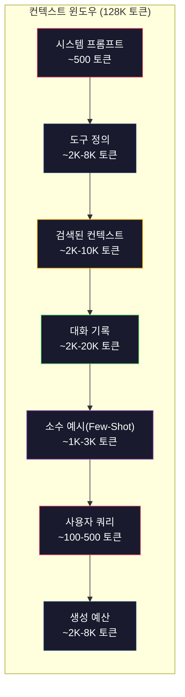
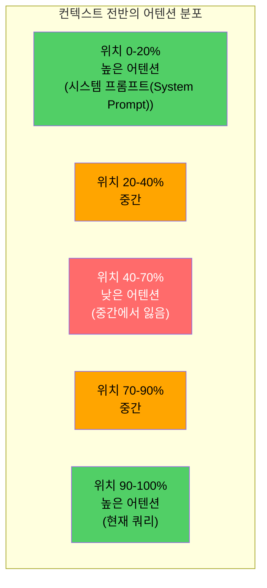
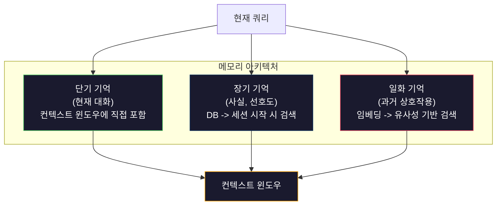

# 컨텍스트 엔지니어링: 윈도우, 예산, 메모리, 검색

> 프롬프트 엔지니어링은 하위 집합입니다. 컨텍스트 엔지니어링은 전체 게임입니다. 프롬프트는 사용자가 입력하는 문자열입니다. 컨텍스트는 모델의 윈도우에 들어가는 모든 것을 의미합니다: 시스템 지침, 검색된 문서, 도구 정의, 대화 기록, 소수 예시(few-shot examples), 그리고 프롬프트 자체. 2026년 최고의 AI 엔지니어는 컨텍스트 엔지니어입니다. 그들은 무엇이 들어가고, 무엇이 제외되며, 어떤 순서로 배치되는지 결정합니다.

**유형:** Build
**언어:** Python
**선수 요건:** 10단계 (LLM을 처음부터 구축하기), 11단계 01-02강
**시간:** 약 90분

**관련:** 11단계 · 15강 (프롬프트 캐싱) — 캐시에 친화적인 레이아웃은 컨텍스트 엔지니어링의 확장입니다. 5단계 · 28강 (긴 컨텍스트 평가)은 NIAH/RULER를 사용하여 lost-in-the-middle 현상을 측정하는 방법을 다룹니다.

## 학습 목표

- 모든 컨텍스트 윈도우 구성 요소(시스템 프롬프트, 도구, 기록, 검색된 문서, 생성 여유 공간)에 걸쳐 토큰 예산을 계산해 보세요.
- 대화 기록을 위한 컨텍스트 윈도우 관리 전략(절단, 요약, 슬라이딩 윈도우)을 구현해 보세요.
- 가장 관련성 높은 정보에 모델의 어텐션이 집중되도록 컨텍스트 구성 요소를 우선순위를 정하고 순서를 지정해 보세요.
- 쿼리 유형과 가용 윈도우 공간에 따라 토큰을 동적으로 할당하는 컨텍스트 어셈블러를 구축해 보세요.

## 문제점

Claude Opus 4.7은 200K 토큰 윈도우(베타에서는 1M)를 가지고 있습니다. GPT-5는 400K입니다. Gemini 3 Pro는 2M입니다. Llama 4는 10M을 주장합니다. 이 수치들은 채워보기 전까지는 거대하게 들립니다.

코딩 어시스턴트를 위한 실제 분해 예시입니다. 시스템 프롬프트: 500 토큰. 50개 도구에 대한 도구 정의: 8,000 토큰. 검색된 문서: 4,000 토큰. 대화 기록(10턴): 6,000 토큰. 현재 사용자 쿼리: 200 토큰. 생성 예산(최대 출력): 4,000 토큰. 총합: 22,700 토큰. 이는 128K 윈도우의 18%에 불과합니다.

그러나 어텐션은 컨텍스트 길이에 따라 선형적으로 확장되지 않습니다. 128K 토큰의 컨텍스트를 가진 모델은 2차 어텐션 비용(O(n^2), 바닐라 트랜스포머의 경우, 대부분의 프로덕션 모델은 효율적인 어텐션 변형을 사용함)을 지불합니다. 더 중요한 것은 검색 정확도가 저하된다는 점입니다. "Needle in a Haystack" 테스트는 모델이 긴 컨텍스트의 중간에 배치된 정보를 찾는 데 어려움을 겪는다는 것을 보여줍니다. Liu et al. (2023)의 연구에 따르면 LLM은 긴 컨텍스트의 시작과 끝에 있는 정보를 거의 완벽한 정확도로 검색하지만, 중간에 배치된 정보(컨텍스트의 40-70% 위치)에 대해서는 정확도가 10-20% 감소합니다. 이 "lost-in-the-middle" 효과는 모델에 따라 다르지만 모든 최신 아키텍처에 영향을 미칩니다.

실용적인 교훈: 200K 토큰이 가용하다는 것이 200K 토큰을 사용하는 것이 효과적이라는 의미는 아닙니다. 신중하게 큐레이션된 10K 토큰의 컨텍스트는 무분별하게 덤프된 100K 토큰의 컨텍스트보다 종종 더 나은 성능을 발휘합니다. 컨텍스트 엔지니어링은 컨텍스트 윈도우 내에서 신호 대 잡음비를 극대화하는 학문입니다.

윈도우에 넣는 모든 토큰은 더 관련성 높은 정보를 담을 수 있는 토큰을 밀어냅니다. 모든 관련 없는 도구 정의, 모든 오래된 대화 턴, 질문에 답하지 못하는 검색된 텍스트의 모든 청크는 모델이 작업 수행 능력을 약간 떨어뜨립니다.

## 개념

### 컨텍스트 윈도우는 희소 자원입니다

컨텍스트 윈도우를 디스크가 아닌 RAM이라고 생각해 보세요. 빠르고 직접 접근 가능하지만 제한적입니다. 모든 것을 담을 수 없습니다. 선택해야 합니다.



각 구성 요소는 공간을 놓고 경쟁합니다. 도구 정의를 더 추가하면 대화 기록을 위한 공간이 줄어듭니다. 검색된 컨텍스트를 더 추가하면 소수 예시(Few-Shot)를 위한 공간이 줄어듭니다. 컨텍스트 엔지니어링은 작업 성능을 극대화하기 위해 이 예산을 할당하는 예술입니다.

### 중간 손실(Lost-in-the-Middle)

컨텍스트 엔지니어링(Context Engineering)에서 가장 중요한 경험적 발견입니다. 모델은 컨텍스트의 시작과 끝에 있는 정보에 더 잘 집중합니다. 중간에 있는 정보는 어텐션 점수가 낮아지고 무시될 가능성이 더 높습니다.

Liu et al. (2023)는 이를 체계적으로 테스트했습니다. 20개의 관련 없는 문서 중 관련 문서를 다양한 위치에 배치하고 답변 정확도를 측정했습니다. 관련 문서가 첫 번째나 마지막에 있을 때 정확도는 85-90%였습니다. 중간 위치(20개 중 10번째)에 있을 때 정확도는 60-70%로 떨어졌습니다.

이는 직접적인 엔지니어링적 함의를 가집니다:

- 가장 중요한 정보를 먼저 배치하세요 (시스템 프롬프트(System Prompt), 핵심 지침)
- 현재 쿼리와 가장 관련성 높은 컨텍스트를 마지막에 배치하세요 (최근성 편향이 도움이 됩니다)
- 컨텍스트의 중간은 가장 낮은 우선순위 영역으로 취급하세요
- 중간에 정보를 포함해야 한다면, 핵심 포인트(핵심 포인트)를 끝에 복제하세요



### 컨텍스트 구성 요소

**시스템 프롬프트(System Prompt)**: 페르소나, 제약 조건 및 행동 규칙을 설정합니다. 이는 가장 먼저 배치되며 턴(turn) 전체에 걸쳐 일정하게 유지됩니다. Claude Code는 도구 정의 및 행동 지침을 포함하여 시스템 프롬프트에 약 6,000 토큰을 사용합니다. 간결하게 유지하세요. 시스템 프롬프트의 모든 단어는 모든 API 호출에서 반복됩니다.

**도구 정의**: 각 도구는 50-200 토큰을 추가합니다 (이름, 설명, 매개변수 스키마). 50개 도구가 각각 150 토큰이면 대화 시작 전에 7,500 토큰이 됩니다. 동적 도구 선택 -- 현재 쿼리와 관련된 도구만 포함 -- 이 이를 60-80% 줄일 수 있습니다.

**검색된 컨텍스트**: 벡터 데이터베이스(Vector Database)의 문서, 검색 결과, 파일 내용. 검색 품질이 응답 품질을 직접 결정합니다. 나쁜 검색은 검색을 하지 않는 것보다 더 나쁩니다 -- 윈도우를 잡음으로 채우고 모델을 능동적으로 오도합니다.

**대화 기록**: 모든 이전 사용자 메시지와 어시스턴트 응답. 대화 길이에 따라 선형적으로 증가합니다. 한 턴당 200 토큰인 50턴 대화는 10,000 토큰의 기록이 됩니다. 대부분은 현재 쿼리와 관련이 없습니다.

**소수 예시(Few-Shot)**: 원하는 동작을 보여주는 입력/출력 쌍. 잘 선택된 두세 개의 예시가 수천 토큰의 지시문보다 출력 품질을 더 개선하는 경우가 많습니다. 하지만 공간을 차지합니다.

**생성 예산**: 모델의 응답을 위해 예약된 토큰. 윈도우를 가득 채우면 모델이 답변할 공간이 없습니다. 생성을 위해 최소 2,000-4,000 토큰을 예약하세요.

### 컨텍스트 압축 전략

**기록 요약**: 모든 이전 턴을 원문 그대로 유지하는 대신, 주기적으로 대화를 요약하세요. "X를 논의하고, Y를 결정했으며, 사용자는 Z를 원한다"는 100 토큰이 2,000 토큰을 차지한 10턴을 대체합니다. 기록이 임계값(예: 5,000 토큰)을 초과할 때 요약을 실행하세요.

**관련성 필터링**: 검색된 각 문서를 현재 쿼리에 대해 점수화하고 임계값 미만인 문서를 제거하세요. 10개 청크를 검색했지만 관련 있는 것은 3개뿐이라면 나머지 7개를 버리세요. 10개의 평범한 청크보다 3개의 고도로 관련 있는 청크가 더 좋습니다.

**도구 가지치기**: 사용자 쿼리의 의도를 분류하고 해당 의도와 관련된 도구만 포함하세요. 코드 질문에는 캘린더 도구가 필요하지 않습니다. 일정 조정 질문에는 파일 시스템 도구가 필요하지 않습니다. 이를 통해 도구 정의를 8,000 토큰에서 1,000 토큰으로 줄일 수 있습니다.

**재귀적 요약**: 매우 긴 문서의 경우 단계적으로 요약하세요. 먼저 각 섹션을 요약한 후, 요약본을 다시 요약하세요. 50페이지 문서가 핵심 포인트를 포착하는 500 토큰의 다이제스트가 됩니다.

### 메모리 시스템

컨텍스트 엔지니어링은 세 가지 시간 범위를 포괄합니다.

**단기 기억**: 현재 대화. 컨텍스트 윈도우에 직접 저장됩니다. 각 턴마다 증가합니다. 요약과 잘라내기로 관리됩니다.

**장기 기억**: 대화 전반에 걸쳐 지속되는 사실과 선호 사항. "사용자는 TypeScript를 선호합니다." "프로젝트는 PostgreSQL을 사용합니다." 데이터베이스에 저장되며 세션 시작 시 검색됩니다. Claude Code는 이를 CLAUDE.md 파일에 저장합니다. ChatGPT는 메모리 기능에 저장합니다.

**일화 기억(Episodic Memory)**: 관련 있을 수 있는 과거의 특정 상호작용. "지난 화요일, 우리는 인증 모듈에서 유사한 문제를 디버깅했습니다." 임베딩으로 저장되며, 현재 대화가 과거의 일화와 일치할 때 검색됩니다.



### 동적 컨텍스트 조립

핵심 통찰: 쿼리에 따라 필요한 컨텍스트가 다릅니다. 정적인 시스템 프롬프트 + 정적인 도구 + 정적인 히스토리는 낭비입니다. 최고의 시스템은 쿼리별로 컨텍스트를 동적으로 조립합니다.

1. 쿼리 의도를 분류합니다
2. 관련된 도구를 선택합니다 (모든 도구가 아님)
3. 관련된 문서를 검색합니다 (고정된 세트가 아님)
4. 관련된 히스토리 턴을 포함합니다 (모든 히스토리가 아님)
5. 작업 유형과 일치하는 소수 예시(Few-Shot)를 추가합니다
6. 중요도에 따라 모든 것을 순서대로 배치합니다: 중요한 것은 먼저, 중요한 것은 마지막에, 선택적인 것은 중간에

이것이 좋은 AI 애플리케이션과 훌륭한 AI 애플리케이션을 구분하는 요소입니다. 모델은 동일합니다. 컨텍스트가 차별점입니다.

```figure
lost-in-the-middle
```

## 구현하기

### 1단계: 토큰 카운터

측정할 수 없는 것은 예산을 설정할 수 없습니다. 간단한 토큰 카운터를 구축하세요 (정확한 개수는 토크나이저에 의존하므로, 공백 분할을 이용한 근사치를 사용하세요).

```python
import json
import numpy as np
from collections import OrderedDict

def count_tokens(text):
    if not text:
        return 0
    return int(len(text.split()) * 1.3)

def count_tokens_json(obj):
    return count_tokens(json.dumps(obj))
```

### 2단계: 컨텍스트 예산 관리자

핵심 추상화입니다. 예산 관리자는 각 구성 요소가 사용하는 토큰 수를 추적하고 제한을 강제합니다.

```python
class ContextBudget:
    def __init__(self, max_tokens=128000, generation_reserve=4000):
        self.max_tokens = max_tokens
        self.generation_reserve = generation_reserve
        self.available = max_tokens - generation_reserve
        self.allocations = OrderedDict()

    def allocate(self, component, content, max_tokens=None):
        tokens = count_tokens(content)
        if max_tokens and tokens > max_tokens:
            words = content.split()
            target_words = int(max_tokens / 1.3)
            content = " ".join(words[:target_words])
            tokens = count_tokens(content)

        used = sum(self.allocations.values())
        if used + tokens > self.available:
            allowed = self.available - used
            if allowed <= 0:
                return None, 0
            words = content.split()
            target_words = int(allowed / 1.3)
            content = " ".join(words[:target_words])
            tokens = count_tokens(content)

        self.allocations[component] = tokens
        return content, tokens

    def remaining(self):
        used = sum(self.allocations.values())
        return self.available - used

    def utilization(self):
        used = sum(self.allocations.values())
        return used / self.max_tokens

    def report(self):
        total_used = sum(self.allocations.values())
        lines = []
        lines.append(f"Context Budget Report ({self.max_tokens:,} token window)")
        lines.append("-" * 50)
        for component, tokens in self.allocations.items():
            pct = tokens / self.max_tokens * 100
            bar = "#" * int(pct / 2)
            lines.append(f"  {component:<25} {tokens:>6} tokens ({pct:>5.1f}%) {bar}")
        lines.append("-" * 50)
        lines.append(f"  {'Used':<25} {total_used:>6} tokens ({total_used/self.max_tokens*100:.1f}%)")
        lines.append(f"  {'Generation reserve':<25} {self.generation_reserve:>6} tokens")
        lines.append(f"  {'Remaining':<25} {self.remaining():>6} tokens")
        return "\n".join(lines)
```

### 3단계: Lost-in-the-Middle 재순서화

재순서화 전략을 구현하세요: 가장 중요한 항목은 처음과 끝에 배치하고, 가장 중요하지 않은 항목은 중간에 배치합니다.

```python
def reorder_lost_in_middle(items, scores):
    paired = sorted(zip(scores, items), reverse=True)
    sorted_items = [item for _, item in paired]

    if len(sorted_items) <= 2:
        return sorted_items

    first_half = sorted_items[::2]
    second_half = sorted_items[1::2]
    second_half.reverse()

    return first_half + second_half

def score_relevance(query, documents):
    query_words = set(query.lower().split())
    scores = []
    for doc in documents:
        doc_words = set(doc.lower().split())
        if not query_words:
            scores.append(0.0)
            continue
        overlap = len(query_words & doc_words) / len(query_words)
        scores.append(round(overlap, 3))
    return scores
```

### 4단계: 대화 히스토리 압축기

이전 대화 턴을 요약하여 토큰 예산을 회수하세요.

```python
class ConversationManager:
    def __init__(self, max_history_tokens=5000):
        self.turns = []
        self.summaries = []
        self.max_history_tokens = max_history_tokens

    def add_turn(self, role, content):
        self.turns.append({"role": role, "content": content})
        self._compress_if_needed()

    def _compress_if_needed(self):
        total = sum(count_tokens(t["content"]) for t in self.turns)
        if total <= self.max_history_tokens:
            return

        while total > self.max_history_tokens and len(self.turns) > 4:
            old_turns = self.turns[:2]
            summary = self._summarize_turns(old_turns)
            self.summaries.append(summary)
            self.turns = self.turns[2:]
            total = sum(count_tokens(t["content"]) for t in self.turns)

    def _summarize_turns(self, turns):
        parts = []
        for t in turns:
            content = t["content"]
            if len(content) > 100:
                content = content[:100] + "..."
            parts.append(f"{t['role']}: {content}")
        return "Previous: " + " | ".join(parts)

    def get_context(self):
        parts = []
        if self.summaries:
            parts.append("[Conversation Summary]")
            for s in self.summaries:
                parts.append(s)
        parts.append("[Recent Conversation]")
        for t in self.turns:
            parts.append(f"{t['role']}: {t['content']}")
        return "\n".join(parts)

    def token_count(self):
        return count_tokens(self.get_context())
```

### 5단계: 동적 도구 선택기

현재 쿼리와 관련된 도구만 포함하세요. 의도를 분류한 후 필터링하세요.

```python
TOOL_REGISTRY = {
    "read_file": {
        "description": "Read contents of a file",
        "tokens": 120,
        "categories": ["code", "files"],
    },
    "write_file": {
        "description": "Write content to a file",
        "tokens": 150,
        "categories": ["code", "files"],
    },
    "search_code": {
        "description": "Search for patterns in codebase",
        "tokens": 130,
        "categories": ["code"],
    },
    "run_command": {
        "description": "Execute a shell command",
        "tokens": 140,
        "categories": ["code", "system"],
    },
    "create_calendar_event": {
        "description": "Create a new calendar event",
        "tokens": 180,
        "categories": ["calendar"],
    },
    "list_emails": {
        "description": "List recent emails",
        "tokens": 160,
        "categories": ["email"],
    },
    "send_email": {
        "description": "Send an email message",
        "tokens": 200,
        "categories": ["email"],
    },
    "web_search": {
        "description": "Search the web for information",
        "tokens": 140,
        "categories": ["research"],
    },
    "query_database": {
        "description": "Run a SQL query on the database",
        "tokens": 170,
        "categories": ["code", "data"],
    },
    "generate_chart": {
        "description": "Generate a chart from data",
        "tokens": 190,
        "categories": ["data", "visualization"],
    },
}

def classify_intent(query):
    query_lower = query.lower()

    intent_keywords = {
        "code": ["code", "function", "bug", "error", "file", "implement", "refactor", "debug", "test"],
        "calendar": ["meeting", "schedule", "calendar", "appointment", "event"],
        "email": ["email", "mail", "send", "inbox", "message"],
        "research": ["search", "find", "what is", "how does", "explain", "look up"],
        "data": ["data", "query", "database", "chart", "graph", "analytics", "sql"],
    }

    scores = {}
    for intent, keywords in intent_keywords.items():
        score = sum(1 for kw in keywords if kw in query_lower)
        if score > 0:
            scores[intent] = score

    if not scores:
        return ["code"]

    max_score = max(scores.values())
    return [intent for intent, score in scores.items() if score >= max_score * 0.5]

def select_tools(query, token_budget=2000):
    intents = classify_intent(query)
    relevant = {}
    total_tokens = 0

    for name, tool in TOOL_REGISTRY.items():
        if any(cat in intents for cat in tool["categories"]):
            if total_tokens + tool["tokens"] <= token_budget:
                relevant[name] = tool
                total_tokens += tool["tokens"]

    return relevant, total_tokens
```

### 6단계: 전체 컨텍스트 조립 파이프라인

모든 요소를 연결합니다. 쿼리가 주어지면 최적의 컨텍스트를 동적으로 조립합니다.

```python
class ContextEngine:
    def __init__(self, max_tokens=128000, generation_reserve=4000):
        self.budget = ContextBudget(max_tokens, generation_reserve)
        self.conversation = ConversationManager(max_history_tokens=5000)
        self.system_prompt = (
            "You are a helpful AI assistant. You have access to tools for "
            "code editing, file management, web search, and data analysis. "
            "Use the appropriate tools for each task. Be concise and accurate."
        )
        self.knowledge_base = [
            "Python 3.12 introduced type parameter syntax for generic classes using bracket notation.",
            "The project uses PostgreSQL 16 with pgvector for embedding storage.",
            "Authentication is handled by Supabase Auth with JWT tokens.",
            "The frontend is built with Next.js 15 using the App Router.",
            "API rate limits are set to 100 requests per minute per user.",
            "The deployment pipeline uses GitHub Actions with Docker multi-stage builds.",
            "Test coverage must be above 80% for all new modules.",
            "The codebase follows the repository pattern for data access.",
        ]

    def assemble(self, query):
        self.budget = ContextBudget(self.budget.max_tokens, self.budget.generation_reserve)

        system_content, _ = self.budget.allocate("system_prompt", self.system_prompt, max_tokens=1000)

        tools, tool_tokens = select_tools(query, token_budget=2000)
        tool_text = json.dumps(list(tools.keys()))
        tool_content, _ = self.budget.allocate("tools", tool_text, max_tokens=2000)

        relevance = score_relevance(query, self.knowledge_base)
        threshold = 0.1
        relevant_docs = [
            doc for doc, score in zip(self.knowledge_base, relevance)
            if score >= threshold
        ]

        if relevant_docs:
            doc_scores = [s for s in relevance if s >= threshold]
            reordered = reorder_lost_in_middle(relevant_docs, doc_scores)
            doc_text = "\n".join(reordered)
            doc_content, _ = self.budget.allocate("retrieved_context", doc_text, max_tokens=3000)

        history_text = self.conversation.get_context()
        if history_text.strip():
            history_content, _ = self.budget.allocate("conversation_history", history_text, max_tokens=5000)

        query_content, _ = self.budget.allocate("user_query", query, max_tokens=500)

        return self.budget

    def chat(self, query):
        self.conversation.add_turn("user", query)
        budget = self.assemble(query)
        response = f"[Response to: {query[:50]}...]"
        self.conversation.add_turn("assistant", response)
        return budget


def run_demo():
    print("=" * 60)
    print("  Context Engineering Pipeline Demo")
    print("=" * 60)

    engine = ContextEngine(max_tokens=128000, generation_reserve=4000)

    print("\n--- Query 1: Code task ---")
    budget = engine.chat("Fix the bug in the authentication module where JWT tokens expire too early")
    print(budget.report())

    print("\n--- Query 2: Research task ---")
    budget = engine.chat("What is the best approach for implementing vector search in PostgreSQL?")
    print(budget.report())

    print("\n--- Query 3: After conversation history builds up ---")
    for i in range(8):
        engine.conversation.add_turn("user", f"Follow-up question number {i+1} about the implementation details of the system")
        engine.conversation.add_turn("assistant", f"Here is the response to follow-up {i+1} with technical details about the architecture")

    budget = engine.chat("Now implement the changes we discussed")
    print(budget.report())

    print("\n--- Tool Selection Examples ---")
    test_queries = [
        "Fix the bug in auth.py",
        "Schedule a meeting with the team for Tuesday",
        "Show me the database query performance stats",
        "Search for best practices on error handling",
    ]

    for q in test_queries:
        tools, tokens = select_tools(q)
        intents = classify_intent(q)
        print(f"\n  Query: {q}")
        print(f"  Intents: {intents}")
        print(f"  Tools: {list(tools.keys())} ({tokens} tokens)")

    print("\n--- Lost-in-the-Middle Reordering ---")
    docs = ["Doc A (most relevant)", "Doc B (somewhat relevant)", "Doc C (least relevant)",
            "Doc D (relevant)", "Doc E (moderately relevant)"]
    scores = [0.95, 0.60, 0.20, 0.80, 0.50]
    reordered = reorder_lost_in_middle(docs, scores)
    print(f"  Original order: {docs}")
    print(f"  Scores:         {scores}")
    print(f"  Reordered:      {reordered}")
    print(f"  (Most relevant at start and end, least relevant in middle)")
```

## 사용하기

### 하네스가 관리하는 컨텍스트

Claude Code는 계층적 접근 방식으로 컨텍스트를 관리합니다. 시스템 프롬프트에는 행동 규칙과 도구 정의(~6K 토큰)가 포함됩니다. 파일을 열면 그 내용이 컨텍스트로 주입됩니다. 검색을 수행하면 결과가 추가됩니다. 이전 대화 턴은 요약됩니다. CLAUDE.md는 세션을 넘어 지속되는 장기 기억을 제공합니다.

핵심 엔지니어링 결정: Claude Code는 전체 코드베이스를 컨텍스트에 덤프하지 않습니다. 관련 파일을 필요에 따라 검색합니다. 이것이 실제 컨텍스트 엔지니어링입니다.

### 동적 컨텍스트 로딩

Cursor는 전체 코드베이스를 임베딩으로 인덱싱합니다. 쿼리를 입력하면 벡터 유사성을 사용하여 가장 관련성 높은 파일과 코드 블록을 검색합니다. 해당 조각들만 컨텍스트 윈도우에 들어갑니다. 50만 줄의 코드베이스는 가장 관련성 높은 코드 블록 5~10개로 압축됩니다.

이것이 패턴입니다: 모든 것을 임베딩하고, 필요에 따라 검색하며, 중요한 것만 포함합니다.

### 어시스턴트 장기 기억

ChatGPT는 사용자 선호도와 사실을 장기 기억으로 저장합니다. 각 대화 시작 시 관련 기억을 검색하여 시스템 프롬프트에 포함합니다. "사용자는 Python을 선호합니다"는 5토큰이 소요되지만, 대화 전반에 걸쳐 반복적인 지시문 수백 토큰을 절약합니다.

### 컨텍스트 엔지니어링으로서의 RAG

검색 증강 생성(RAG)은 컨텍스트 엔지니어링을 형식화한 것입니다. 지식을 모델 가중치(학습)나 시스템 프롬프트(정적 컨텍스트)에 채워 넣는 대신, 쿼리 시점에 관련 문서를 검색하여 컨텍스트 윈도우에 주입합니다. 청킹, 임베딩, 검색, 리랭킹 등 전체 RAG 파이프라인은 하나의 문제를 해결하기 위해 존재합니다: 컨텍스트 윈도우에 올바른 정보를 넣는 것.

## 출시하기

이 강의는 `outputs/prompt-context-optimizer.md`를 생성합니다. 이는 컨텍스트 조립 전략을 감사하고 최적화를 권장하는 재사용 가능한 프롬프트입니다. 시스템 프롬프트, 도구 수, 평균 히스토리 길이, 검색 전략을 입력하면 토큰 낭비를 식별하고 개선 사항을 제안합니다.

이것은 또한 `outputs/skill-context-engineering.md`를 생성합니다. 는 작업 유형, 컨텍스트 윈도우 크기, 지연 시간 예산에 기반하여 컨텍스트 조립 파이프라인을 설계하기 위한 의사결정 프레임워크입니다.

## 연습 문제

1. `ContextBudget` 클래스에 "토큰 낭비 감지자"를 추가해 보세요. 이 감지자는 예산의 30% 이상을 사용하는 구성 요소를 표시하고, 각 구성 요소 유형에 맞는 압축 전략(이력 요약, 도구 제거, 문서 재순위화)을 제안해야 합니다.

2. 검색된 컨텍스트에 대한 시맨틱 중복 제거를 구현해 보세요. 두 검색된 문서가 단어 겹침이나 임베딩의 코사인 유사도(Cosine Similarity) 기준으로 80% 이상 유사하다면, 점수가 더 높은 문서만 유지합니다. 이 과정이 토큰 예산을 얼마나 회복하는지 측정해 보세요.

3. "컨텍스트 재생" 도구를 구축해 보세요. 대화 기록을 `ContextEngine`를 통해 재생하고, 턴별로 예산 할당이 어떻게 변하는지 시각화합니다. 시간 경과에 따른 구성 요소별 토큰 사용량을 플롯합니다. 컨텍스트 압축이 시작되는 턴을 식별해 보세요.

4. 우선순위 기반 도구 선택기를 구현해 보세요. 이진 포함/제거 방식 대신, 각 도구에 현재 쿼리에 대한 관련성 점수를 할당합니다. 도구 예산이 소진될 때까지 관련성 점수가 높은 순서대로 도구를 포함합니다. 도구 5개, 10개, 20개, 50개를 포함했을 때의 작업 성능을 비교해 보세요.

5. 다중 전략 컨텍스트 압축기를 구축해 보세요. 세 가지 압축 전략(절단, 요약, 핵심 문장 추출)을 구현하고 20개 문서 세트에서 벤치마킹합니다. 압축률과 정보 보존 간의 트레이드오프를 측정합니다(압축된 버전이 쿼리에 대한 답변을 여전히 포함하는지 확인합니다).

## 핵심 용어

| 용어 | 사람들이 말하는 것 | 실제 의미 |
|------|----------------|----------------------|
| 컨텍스트 윈도우 | "모델이 읽을 수 있는 양" | 모델이 단일 순방향 패스에서 처리하는 최대 토큰 수(입력 + 출력) -- GPT-5는 400K, Claude Opus 4.7은 200K(1M 베타), Gemini 3 Pro는 2M |
| 컨텍스트 엔지니어링(Context Engineering) | "고급 프롬프트 엔지니어링(Prompt Engineering)" | 컨텍스트 윈도우에 무엇을, 어떤 순서로, 어떤 우선순위로 넣을지 결정하는 학문 -- 검색, 압축, 도구 선택, 메모리 관리를 포함합니다 |
| Lost-in-the-middle | "모델이 중간 부분을 잊어버림" | LLM이 컨텍스트의 시작과 끝에 더 잘 주의하고, 중간에 배치된 정보의 정확도가 10-20% 감소한다는 경험적 발견 |
| 토큰 예산 | "남은 토큰 수" | 컨텍스트 윈도우 용량을 구성 요소(시스템 프롬프트, 도구, 히스토리, 검색, 생성)에 명시적으로 할당하고 각 구성 요소에 제한을 두는 것 |
| 동적 컨텍스트 | "즉시 로드하기" | 의도 분류, 관련 도구 선택, 검색 결과에 따라 각 쿼리마다 컨텍스트 윈도우를 다르게 조립하는 것 |
| 히스토리 요약 | "대화 압축하기" | 오래된 대화 턴을 원문 그대로 유지하는 대신 간결한 요약으로 대체하여, 주요 정보를 보존하면서 토큰 비용을 줄이는 것 |
| 도구 가지치기 | "관련된 도구만 포함하기" | 쿼리 의도를 분류하고 일치하는 도구 정의만 포함하여, 도구 토큰 비용을 60-80% 줄이는 것 |
| 장기 기억 | "세션 간 기억하기" | 데이터베이스에 저장된 사실과 선호도를 세션 시작 시 검색하는 것 -- CLAUDE.md, ChatGPT Memory 및 유사한 시스템 |
| 일화 기억 | "특정 과거 사건 기억하기" | 과거 상호작용을 임베딩으로 저장하고, 현재 쿼리가 과거 대화와 유사할 때 검색하는 것 |
| 생성 예산 | "답변을 위한 공간" | 모델의 출력에 예약된 토큰 -- 컨텍스트가 윈도우를 완전히 채우면 모델이 응답할 공간이 없음 |

## 추가 읽기

- [Liu et al., 2023 -- "Lost in the Middle: How Language Models Use Long Contexts"](https://arxiv.org/abs/2307.03172) -- 위치 의존적 주의에 대한 결정적인 연구로, 모델이 긴 컨텍스트의 중간 정보 처리에 어려움을 겪는다는 것을 보여줍니다
- [Anthropic's Contextual Retrieval blog post](https://www.anthropic.com/news/contextual-retrieval) -- Anthropic이 컨텍스트 인식 청크 검색을 접근하는 방식이며, 검색 실패를 49% 줄입니다
- [Simon Willison's "Context Engineering"](https://simonwillison.net/2025/Jun/27/context-engineering/) -- 이 분야를 명명하고 프롬프트 엔지니어링과 구분한 블로그 게시물
- [LangChain documentation on RAG](https://python.langchain.com/docs/tutorials/rag/) -- 컨텍스트 엔지니어링 패턴으로서 검색 증강 생성(RAG)의 실용적 구현
- [Greg Kamradt's Needle in a Haystack test](https://github.com/gkamradt/LLMTest_NeedleInAHaystack) -- 모든 주요 모델에서 위치 의존적 검색 실패를 드러낸 벤치마크
- [Pope et al., "Efficiently Scaling Transformer Inference" (2022)](https://arxiv.org/abs/2211.05102) -- 컨텍스트 길이가 메모리와 지연 시간을 어떻게 주도하는지, 그리고 KV 캐시, MQA, GQA가 예산 계산을 어떻게 변경하는지
- [Agrawal et al., "SARATHI: Efficient LLM Inference by Piggybacking Decodes with Chunked Prefills" (2023)](https://arxiv.org/abs/2308.16369) -- 추론의 두 단계로, 긴 프롬프트는 TTFT에서 비싸지만 TPOT에서는 저렴하게 만듭니다. 컨텍스트 패킹 트레이드오프의 기준이 됩니다.
- [Ainslie et al., "GQA: Training Generalized Multi-Query Transformer Models from Multi-Head Checkpoints" (EMNLP 2023)](https://arxiv.org/abs/2305.13245) -- 프로덕션 디코더에서 품질 손실 없이 KV 메모리를 8배 줄인 그룹 쿼리 어텐션 논문입니다.
