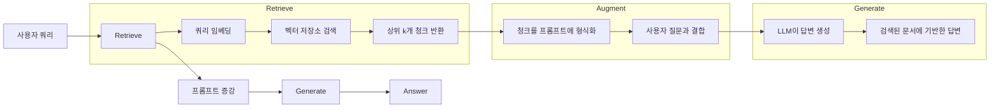
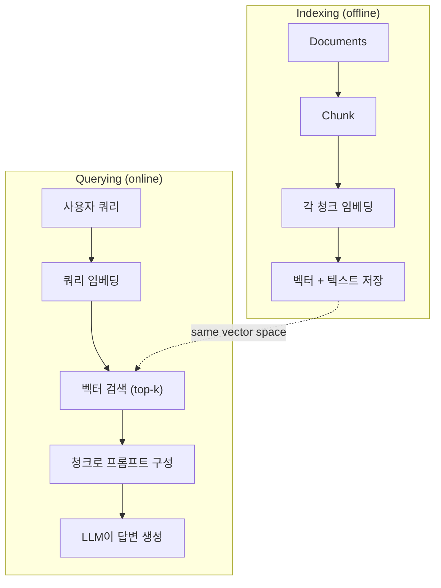

# RAG (검색 증강 생성)(RAG (Retrieval-Augmented Generation))

> LLM (대규모 언어 모델)(LLM (Large Language Model))는 학습 컷오프 시점까지의 모든 것을 알고 있습니다. 하지만 회사 문서, 코드베이스, 지난주 회의록에 대해서는 아무것도 알지 못합니다. RAG은 관련 문서를 검색하여 프롬프트에 포함하는 방식으로 이 문제를 해결합니다. 이는 프로덕션 AI에서 가장 많이 배포되는 패턴입니다. 이 코스에서 하나만 구축한다면, RAG 파이프라인을 구축해 보세요.

**유형:** Build
**언어:** Python
**선수 요건:** 10단계 (LLM (대규모 언어 모델)(LLM (Large Language Model)) 기초부터 시작하기), 11단계 01-05강
**시간:** 약 90분

**관련:** 5단계 · 23강 (RAG를 위한 청킹 전략)에서 6가지 청킹 알고리즘과 각각이 유리한 경우를 다루며, 5단계 · 22강 (임베딩 모델 심층 분석)에서 임베더 선택을 다루고, 11단계 · 07강 (고급 RAG)에서 하이브리드 검색(Hybrid Retrieval), 리랭킹(Reranker), 쿼리 변환을 다룹니다.

## 학습 목표

- 문서 로드, 청킹(Chunking), 임베딩(Embedding), 벡터 저장, 검색, 생성을 포함한 완전한 RAG 파이프라인을 구축합니다
- 적절한 인덱싱을 통해 벡터 데이터베이스(Vector Database) (ChromaDB, FAISS, Pinecone)를 사용하여 시맨틱 검색(Semantic Search)을 구현합니다
- 지식 기반 애플리케이션에서 미세 조정(Fine-tuning)보다 RAG이 선호되는 이유 (비용, 최신성, 출처)를 설명합니다
- 검색 지표 (정밀도 및 재현율(Precision & Recall))와 생성 지표 (충실성, 관련성)를 사용하여 RAG 품질을 평가합니다

## 문제점

회사용 챗봇을 구축했습니다. 고객이 "엔터프라이즈 플랜의 환불 정책은 무엇인가요?"라고 묻자, LLM (대규모 언어 모델)(LLM (Large Language Model))은 일반적인 SaaS 환불 정책에 대한 일반적인 답변을 합니다. 실제 정책은 200페이지 분량의 내부 위키에 묻혀 있으며, 엔터프라이즈 고객은 60일 기간의 비례 환불을 받을 수 있다고 명시되어 있습니다. LLM은 이 문서를 본 적이 없습니다. 학습되지 않은 내용을 알 수 없습니다.

미세 조정(Fine-tuning)은 하나의 해결책입니다. LLM을 내부 문서로 학습하고 업데이트된 모델을 배포합니다. 이는 작동하지만 심각한 문제가 있습니다. 미세 조정은 컴퓨팅 비용이 수천 달러에 달합니다. 문서가 변경되는 순간 모델은 낡아집니다. 모델이 어떤 출처를 참조했는지 알 수 있는 방법이 없습니다. 그리고 다음 달에 회사가 다른 제품 라인을 인수하면 다시 미세 조정해야 합니다.

RAG는 다른 해결책입니다. 모델을 건드리지 마세요. 질문이 들어오면 문서 저장소에서 관련 구문을 검색하고, 질문 전에 프롬프트에 붙여넣은 후, 모델이 그 구문을 컨텍스트로 사용하여 답변하도록 합니다. 문서 저장소는 몇 분 안에 업데이트할 수 있습니다. 어떤 문서가 검색되었는지 정확히 확인할 수 있습니다. 모델 자체는 절대 변하지 않습니다. RAG가 프로덕션 환경의 지배적인 패턴인 이유는 더 저렴하고, 더 최신이며, 더 감사(audit)하기 쉽고, 모든 LLM과 작동하기 때문입니다.

## 개념

### RAG 패턴

이 패턴 전체는 네 단계로 구성됩니다:



쿼리 -> 검색 -> 프롬프트 증강 -> 생성. 모든 RAG 시스템은 이 패턴을 따릅니다. 프로덕션 RAG 시스템 간의 차이는 각 단계의 세부 사항에 있습니다: 청킹 방법, 임베딩 방법, 검색 방법, 프롬프트 구성 방법.

### RAG가 미세 조정(Fine-Tuning)을 이기는 이유

| 관심사 | 미세 조정 | RAG |
|---------|------------|-----|
| 비용 | $1,000-$100,000+ (훈련 실행당) | $0.01-$0.10 (쿼리당, 임베딩 + LLM) |
| 최신성 | 재훈련할 때까지 낡음 | 문서 재인덱싱으로 몇 분 안에 업데이트 |
| 감사 가능성 | 답변을 출처로 추적할 수 없음 | 검색된 정확한 구문을 표시할 수 있음 |
| 환각(Hallucination) | 자유롭게 환각 발생 | 검색된 문서에 기반함 |
| 데이터 프라이버시 | 훈련 데이터가 가중치에 구워짐 | 문서가 벡터 저장소에 남음 |

미세 조정은 모델의 가중치를 영구적으로 변경합니다. RAG는 모델의 컨텍스트를 일시적으로 변경합니다. 대부분의 애플리케이션에서는 일시적인 컨텍스트가 원합니다.

미세 조정이 이기는 유일한 경우: 모델이 프롬프트만으로 달성할 수 없는 특정 스타일, 톤, 또는 추론 패턴을 채택해야 할 때입니다. 사실적 지식 검색의 경우, RAG가 매번 이깁니다.

### 임베딩 모델

임베딩 모델은 텍스트를 밀집 벡터로 변환합니다. 유사한 텍스트는 이 고차원 공간에서 서로 가까운 벡터를 생성합니다. "비밀번호를 어떻게 재설정하나요?"와 "비밀번호를 변경해야 합니다"는 공유하는 단어가 거의 없음에도 거의 동일한 벡터를 생성합니다. "고양이가 매트에 앉아 있다"는 매우 다른 벡터를 생성합니다.

일반적인 임베딩 모델 (2026 라인업 — 전체 분석은 5단계 · 22강 참조):

| 모델 | 차원 | 제공자 | 비고 |
|-------|-----------|----------|-------|
| text-embedding-3-small | 1536 (Matryoshka) | OpenAI | 대부분의 사용 사례에 대해 최적의 가격/성능 |
| text-embedding-3-large | 3072 (Matryoshka) | OpenAI | 더 높은 정확도, 256/512/1024로 잘라낼 수 있음 |
| Gemini Embedding 2 | 3072 (Matryoshka) | Google | MTEB 검색 최고 성능; 8K 컨텍스트 |
| voyage-4 | 1024/2048 (Matryoshka) | Voyage AI | 도메인 변형 (코드, 금융, 법률) |
| Cohere embed-v4 | 1024 (Matryoshka) | Cohere | 강력한 다국어 지원, 128K 컨텍스트 |
| BGE-M3 | 1024 (밀집 + 희소 + ColBERT) | BAAI (오픈 웨이트) | 하나의 모델에서 세 가지 관점 |
| Qwen3-Embedding | 4096 (Matryoshka) | Alibaba (오픈 웨이트) | 오픈 웨이트 검색 점수 최고 |
| all-MiniLM-L6-v2 | 384 | 오픈 웨이트 (Sentence Transformers) | 프로토타이핑 기준선 |

이 강의에서는 TF-IDF를 사용하여 자체적인 간단한 임베딩을 구축합니다. TF-IDF가 생산 시스템에서 사용되기 때문이 아니라, 개념을 구체적으로 만들기 위해서입니다: 텍스트가 입력되고, 벡터가 출력되며, 유사한 텍스트는 유사한 벡터를 생성합니다.

### 벡터 유사성

두 벡터가 주어졌을 때, 유사성을 어떻게 측정하나요? 세 가지 옵션이 있습니다:

**코사인 유사도(Cosine Similarity)**: 두 벡터 사이의 각도의 코사인 값. -1 (반대)에서 1 (동일)까지의 범위를 가집니다. 크기는 무시하고 방향만 고려합니다. RAG의 기본값입니다.

```
cosine_sim(a, b) = dot(a, b) / (||a|| * ||b||)
```

**내적(Dot product)**: 원시 내적. 더 큰 벡터는 더 높은 점수를 받습니다. 크기가 정보를 담고 있을 때 유용합니다 (긴 문서가 더 관련성이 높을 수 있음).

```
dot(a, b) = sum(a_i * b_i)
```

**L2 (유클리드) 거리**: 벡터 공간에서의 직선 거리. 거리가 작을수록 더 유사합니다. 크기 차이에 민감합니다.

```
L2(a, b) = sqrt(sum((a_i - b_i)^2))
```

코사인 유사도(Cosine Similarity)가 표준입니다. 크기를 기준으로 정규화하므로 길이가 다른 문서도 잘 처리합니다. "벡터 검색(vector search)"이라고 하면 거의 항상 코사인 유사도를 의미합니다.

### 청킹 전략

문서는 단일 벡터로 임베딩하기에는 너무 길 수 있습니다. 50페이지 PDF는 수십 개의 주제를 포함하고 있어 임베딩 품질이 떨어질 수 있습니다. 대신 문서를 청크로 나누고 각 청크를 개별적으로 임베딩합니다.

**고정 크기 청킹**: 매 N 토큰마다 분할합니다. 단순하고 예측 가능합니다. 512 토큰 청크에 50 토큰 겹침을 적용하면 청크 1은 토큰 0-511, 청크 2는 토큰 462-973이 됩니다. 겹침을 통해 문장이 불리한 경계에서 분할되지 않도록 보장합니다.

**시맨틱 청킹**: 자연스러운 경계에서 분할합니다. 단락, 섹션, 마크다운 헤더를 기준으로 합니다. 각 청크는 의미적으로 일관된 단위입니다. 구현은 더 복잡하지만 검색 품질이 더 좋습니다.

**재귀 청킹**: 가장 큰 경계(섹션 헤더)부터 분할을 시도합니다. 섹션이 여전히 너무 크면 단락 경계에서 분할합니다. 단락이 여전히 너무 크면 문장 경계에서 분할합니다. LangChain의 RecursiveCharacterTextSplitter 방식이며 실무에서 잘 작동합니다.

청크 크기는 사람들이 생각하는 것보다 중요합니다:

- 너무 작음 (64-128 토큰): 각 청크에 컨텍스트가 부족합니다. "지난 분기에 15% 증가했다"는 "it"이 무엇을 가리키는지 알지 못하면 의미가 없습니다.
- 너무 큼 (2048+ 토큰): 각 청크가 여러 주제를 포함하여 관련성이 희석됩니다. 매출 데이터를 검색하면 10%는 매출에 관한 것이고 90%는 인력 관련인 청크가 나옵니다.
- 적정 범위 (256-512 토큰): 자체적으로 완결된 컨텍스트를 포함할 만큼 충분히 크고, 관련성을 유지할 만큼 충분히 집중되어 있습니다.

대부분의 프로덕션 RAG (검색 증강 생성)(RAG (Retrieval-Augmented Generation)) 시스템은 50 토큰 겹침을 가진 256-512 토큰 청크를 사용합니다. Anthropic의 RAG 가이드라인은 이 범위를 권장합니다.

### 벡터 데이터베이스

임베딩을 생성한 후, 이를 저장하고 검색할 곳이 필요합니다. 선택지:

| 데이터베이스 | 유형 | 최적 용도 |
|----------|------|----------|
| FAISS | 라이브러리 (프로세스 내) | 프로토타이핑, 소규모~중규모 데이터셋 |
| Chroma | 경량 DB | 로컬 개발, 소규모 배포 |
| Pinecone | 관리형 서비스 | 운영 오버헤드 없는 프로덕션 |
| Weaviate | 오픈 소스 DB | 자체 호스팅 프로덕션 |
| pgvector | Postgres 확장 | 이미 Postgres를 사용 중 |
| Qdrant | 오픈 소스 DB | 고성능 자체 호스팅 |

이 강의에서는 간단한 메모리 내 벡터 스토어를 구축합니다. 벡터를 리스트에 저장하고 브루트 포스 코사인 유사도 검색을 수행합니다. 이는 평탄 인덱스(flat index)를 사용한 FAISS와 동일합니다. 약 100,000개의 벡터까지 확장 가능하며 그 이상에서는 느려집니다. 프로덕션 시스템은 HNSW와 같은 근사 최근접 이웃 (ANN)(Approximate Nearest Neighbor (ANN)) 알고리즘을 사용하여 수백만 개의 벡터를 밀리초 단위로 검색합니다.

### 전체 파이프라인



인덱싱 단계는 문서당 한 번(또는 문서가 업데이트될 때) 실행됩니다. 쿼리 단계는 모든 사용자 요청마다 실행됩니다. 프로덕션에서는 인덱싱이 수백만 개의 문서를 몇 시간에 걸쳐 처리할 수 있습니다. 쿼리는 1초 이내에 응답해야 합니다.

### 실제 수치

대부분의 프로덕션 RAG (검색 증강 생성)(RAG (Retrieval-Augmented Generation)) 시스템은 다음 매개변수를 사용합니다:

- **k = 5 ~ 10** 쿼리당 검색된 청크 수
- **청크 크기 = 256 ~ 512 토큰** (50 토큰 겹침)
- **컨텍스트 예산**: 쿼리당 검색된 콘텐츠 2,500~5,000 토큰
- **총 프롬프트**: ~8,000~16,000 토큰 (시스템 프롬프트 + 검색된 청크 + 대화 기록 + 사용자 쿼리)
- **임베딩 차원**: 모델에 따라 384~3072
- **인덱싱 처리량**: API 임베딩 사용 시 초당 100~1,000개 문서
- **쿼리 지연**: 검색 50~200ms, 생성 500~3000ms

```figure
rag-chunking
```

## 구현하기

### 1단계: 문서 청킹

```python
def chunk_text(text, chunk_size=200, overlap=50):
    words = text.split()
    chunks = []
    start = 0
    while start < len(words):
        end = start + chunk_size
        chunk = " ".join(words[start:end])
        chunks.append(chunk)
        start += chunk_size - overlap
    return chunks
```

### 2단계: TF-IDF 임베딩

간단한 임베딩 함수를 구축합니다. TF-IDF (단어 빈도-역 문서 빈도)(Term Frequency-Inverse Document Frequency)는 신경망 임베딩이 아니지만, 단어의 중요성을 포착하는 방식으로 텍스트를 벡터로 변환합니다. 문서 내에서 자주 등장하는 단어는 높은 TF 값을 얻습니다. 코퍼스 전체에서 드문 단어는 높은 IDF 값을 얻습니다. 이 두 값의 곱은 중요하고 독특한 단어가 높은 값을 가지는 벡터를 생성합니다.

```python
import math
from collections import Counter

def build_vocabulary(documents):
    vocab = set()
    for doc in documents:
        vocab.update(doc.lower().split())
    return sorted(vocab)

def compute_tf(text, vocab):
    words = text.lower().split()
    count = Counter(words)
    total = len(words)
    return [count.get(word, 0) / total for word in vocab]

def compute_idf(documents, vocab):
    n = len(documents)
    idf = []
    for word in vocab:
        doc_count = sum(1 for doc in documents if word in doc.lower().split())
        idf.append(math.log((n + 1) / (doc_count + 1)) + 1)
    return idf

def tfidf_embed(text, vocab, idf):
    tf = compute_tf(text, vocab)
    return [t * i for t, i in zip(tf, idf)]
```

### 3단계: 코사인 유사도 검색

```python
def cosine_similarity(a, b):
    dot = sum(x * y for x, y in zip(a, b))
    norm_a = math.sqrt(sum(x * x for x in a))
    norm_b = math.sqrt(sum(x * x for x in b))
    if norm_a == 0 or norm_b == 0:
        return 0.0
    return dot / (norm_a * norm_b)

def search(query_embedding, stored_embeddings, top_k=5):
    scores = []
    for i, emb in enumerate(stored_embeddings):
        sim = cosine_similarity(query_embedding, emb)
        scores.append((i, sim))
    scores.sort(key=lambda x: x[1], reverse=True)
    return scores[:top_k]
```

### 4단계: 프롬프트 구성

여기서 RAG의 '증강'이 이루어집니다. 검색된 청크를 가져와 프롬프트로 형식화하고, 제공된 컨텍스트를 바탕으로 LLM이 답변하도록 요청합니다.

```python
def build_rag_prompt(query, retrieved_chunks):
    context = "\n\n---\n\n".join(
        f"[Source {i+1}]\n{chunk}"
        for i, chunk in enumerate(retrieved_chunks)
    )
    return f"""Answer the question based ONLY on the following context.
If the context doesn't contain enough information, say "I don't have enough information to answer that."

Context:
{context}

Question: {query}

Answer:"""
```

### 5단계: 완전한 RAG 파이프라인

```python
class RAGPipeline:
    def __init__(self):
        self.chunks = []
        self.embeddings = []
        self.vocab = []
        self.idf = []

    def index(self, documents):
        all_chunks = []
        for doc in documents:
            all_chunks.extend(chunk_text(doc))
        self.chunks = all_chunks
        self.vocab = build_vocabulary(all_chunks)
        self.idf = compute_idf(all_chunks, self.vocab)
        self.embeddings = [
            tfidf_embed(chunk, self.vocab, self.idf)
            for chunk in all_chunks
        ]

    def query(self, question, top_k=5):
        query_emb = tfidf_embed(question, self.vocab, self.idf)
        results = search(query_emb, self.embeddings, top_k)
        retrieved = [(self.chunks[i], score) for i, score in results]
        prompt = build_rag_prompt(
            question, [chunk for chunk, _ in retrieved]
        )
        return prompt, retrieved
```

### 6단계: 생성 (시뮬레이션)

프로덕션 환경에서는 여기서 LLM API를 호출합니다. 이 강의에서는 검색된 컨텍스트에서 가장 관련성 높은 문장을 추출하여 생성을 시뮬레이션합니다.

```python
def simple_generate(prompt, retrieved_chunks):
    query_words = set(prompt.lower().split("question:")[-1].split())
    best_sentence = ""
    best_score = 0
    for chunk in retrieved_chunks:
        for sentence in chunk.split("."):
            sentence = sentence.strip()
            if not sentence:
                continue
            words = set(sentence.lower().split())
            overlap = len(query_words & words)
            if overlap > best_score:
                best_score = overlap
                best_sentence = sentence
    return best_sentence if best_sentence else "I don't have enough information."
```

## 사용하기

실제 임베딩 모델과 LLM을 사용하면 코드가 거의 변하지 않습니다:

```python
from openai import OpenAI

client = OpenAI()

def embed(text):
    response = client.embeddings.create(
        model="text-embedding-3-small",
        input=text
    )
    return response.data[0].embedding

def generate(prompt):
    response = client.chat.completions.create(
        model="gpt-4o-mini",
        messages=[{"role": "user", "content": prompt}],
        temperature=0
    )
    return response.choices[0].message.content
```

또는 Anthropic를 사용하는 경우:

```python
import anthropic

client = anthropic.Anthropic()

def generate(prompt):
    response = client.messages.create(
        model="claude-sonnet-5",
        max_tokens=1024,
        messages=[{"role": "user", "content": prompt}]
    )
    return response.content[0].text
```

파이프라인은 동일합니다. 임베딩 함수를 교체하고, 생성 함수를 교체합니다. 검색 로직, 청킹, 프롬프트 구성은 사용하는 모델에 관계없이 모두 동일합니다.

대규모 벡터 저장을 위해 브루트 포스 검색을 적절한 벡터 데이터베이스로 교체합니다:

```python
import chromadb

client = chromadb.Client()
collection = client.create_collection("my_docs")

collection.add(
    documents=chunks,
    ids=[f"chunk_{i}" for i in range(len(chunks))]
)

results = collection.query(
    query_texts=["What is the refund policy?"],
    n_results=5
)
```

Chroma는 임베딩을 내부적으로 처리하며 (기본적으로 all-MiniLM-L6-v2를 사용함) 벡터를 로컬 데이터베이스에 저장합니다. 패턴은 같지만 구현 세부 사항이 다릅니다.

## 출시하기

이 강의는 다음을 생성합니다:
- `outputs/prompt-rag-architect.md` -- 특정 사용 사례에 대한 RAG 시스템 설계를 위한 프롬프트
- `outputs/skill-rag-pipeline.md` -- 에이전트에게 RAG 파이프라인을 구축하고 디버깅하는 방법을 가르치는 스킬

## 연습 문제

1. TF-IDF 임베딩을 단순한 단어 주머니(bag-of-words) 접근법(단어가 존재하면 1, 없으면 0인 이진 방식)으로 교체합니다. 샘플 문서에서 검색 품질을 비교합니다. TF-IDF는 드문 단어를 더 높게 가중치하므로 더 나은 성능을 보여야 합니다.

2. 청크 크기를 실험해 보세요: 동일한 문서 세트에서 50, 100, 200, 500 단어를 시도합니다. 각 크기에 대해 동일한 5개 쿼리를 실행하고 상위 3개 중 관련 청크를 반환하는 횟수를 세어 보세요. 검색 품질이 최고조에 달하는 최적점을 찾아보세요.

3. 각 청크에 메타데이터(출처 문서 이름, 청크 위치)를 추가합니다. 프롬프트 템플릿을 수정하여 출처 표기를 포함하고, LLM이 출처를 인용하도록 합니다.

4. 간단한 평가를 구현합니다: 10개의 질문-답변 쌍을 주어, 각 질문을 RAG 파이프라인을 통해 실행하고, 검색된 청크 중 답변을 포함하는 비율을 측정합니다. 이는 k에서의 검색 재현율입니다.

5. 대화 인식 RAG 파이프라인을 구축합니다: 최근 3번의 교환 기록을 유지하고, 검색된 청크와 함께 프롬프트에 포함합니다. 가격에 대해 질문한 후 "엔터프라이즈는 어떻게 되나요?"와 같은 후속 질문으로 테스트해 보세요.

## 핵심 용어

| 용어 | 사람들이 말하는 것 | 실제 의미 |
|------|----------------|----------------------|
| RAG (검색 증강 생성)(RAG (Retrieval-Augmented Generation)) | "문서를 읽는 AI" | 관련 문서를 검색하고, 프롬프트에 붙여넣으며, 해당 문서를 기반으로 답변을 생성합니다 |
| 임베딩(Embedding) | "텍스트를 숫자로 변환" | 유사한 의미가 유사한 벡터를 생성하는 텍스트의 밀집 벡터 표현 |
| 벡터 데이터베이스(Vector Database) | "AI용 검색 엔진" | 벡터를 저장하고 유사성에 따라 최근접 이웃을 찾기 위해 최적화된 데이터 저장소 |
| 청킹(Chunking) | "문서를 조각으로 나누기" | 문서를 더 작은 세그먼트(일반적으로 256-512 토큰)로 분할하여 각각 독립적으로 임베딩 및 검색할 수 있도록 합니다 |
| 코사인 유사도(Cosine Similarity) | "두 벡터가 얼마나 유사한가" | 두 벡터 사이의 각도의 코사인 값; 1 = 동일한 방향, 0 = 직교, -1 = 반대 방향 |
| Top-k 검색(Top-k retrieval) | "k개의 최상위 일치 항목 가져오기" | 벡터 저장소에서 쿼리와 가장 유사한 k개의 청크를 반환합니다 |
| 컨텍스트 윈도우(Context Window) | "LLM이 볼 수 있는 텍스트 양" | 단일 요청에서 LLM이 처리할 수 있는 최대 토큰 수; 검색된 청크는 이 범위 내에 있어야 합니다 |
| 증강 생성(Augmented generation) | "주어진 컨텍스트를 사용하여 답변하기" | 학습된 지식에만 의존하지 않고, 검색된 문서를 컨텍스트로 사용하여 응답을 생성합니다 |
| TF-IDF | "단어 중요도 점수 매기기" | 용어 빈도(Term Frequency)에 역 문서 빈도(Inverse Document Frequency)를 곱한 값; 코퍼스 내에서 단어가 얼마나 독특한지에 따라 가중치를 부여합니다 |
| 인덱싱(Indexing) | "검색을 위해 문서를 준비하기" | 쿼리 시간에 검색할 수 있도록 문서를 청킹, 임베딩 및 저장하는 오프라인 프로세스 |

## 추가 읽기

- Lewis et al., "Retrieval-Augmented Generation for Knowledge-Intensive NLP Tasks" (2020) -- Facebook AI Research의 원본 RAG 논문으로, 검색 후 생성 패턴을 공식화했습니다
- Anthropic의 RAG 문서 (docs.anthropic.com) -- 청크 크기, 프롬프트 구성 및 평가에 대한 실용적인 가이드라인
- Pinecone Learning Center, "What is RAG?" -- 프로덕션 고려 사항이 포함된 RAG 파이프라인의 명확한 시각적 설명
- Sentence-BERT: Reimers & Gurevych (2019) -- all-MiniLM 임베딩 모델의 기반 논문으로, 시맨틱 유사성을 위한 바이인코더 훈련 방법을 보여줍니다
- [Karpukhin et al., "Dense Passage Retrieval for Open-Domain Question Answering" (EMNLP 2020)](https://arxiv.org/abs/2004.04906) -- 밀집 바이인코더 검색이 오픈 도메인 QA에서 BM25를 능가함을 증명하고 현대 RAG 리트리버의 패턴을 설정한 DPR 논문입니다.
- [LlamaIndex High-Level Concepts](https://docs.llamaindex.ai/en/stable/getting_started/concepts.html) -- RAG 파이프라인 구축 시 알아야 할 주요 개념: 데이터 로더, 노드 파서, 인덱스, 리트리버, 응답 합성기입니다.
- [LangChain RAG tutorial](https://python.langchain.com/docs/tutorials/rag/) -- 반대 방향의 오케스트레이터; 동일한 검색 후 생성 패턴의 런너블 체인 관점입니다.
