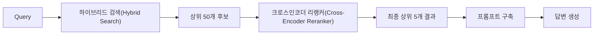
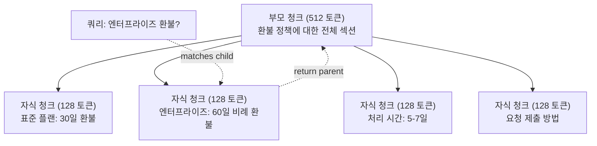
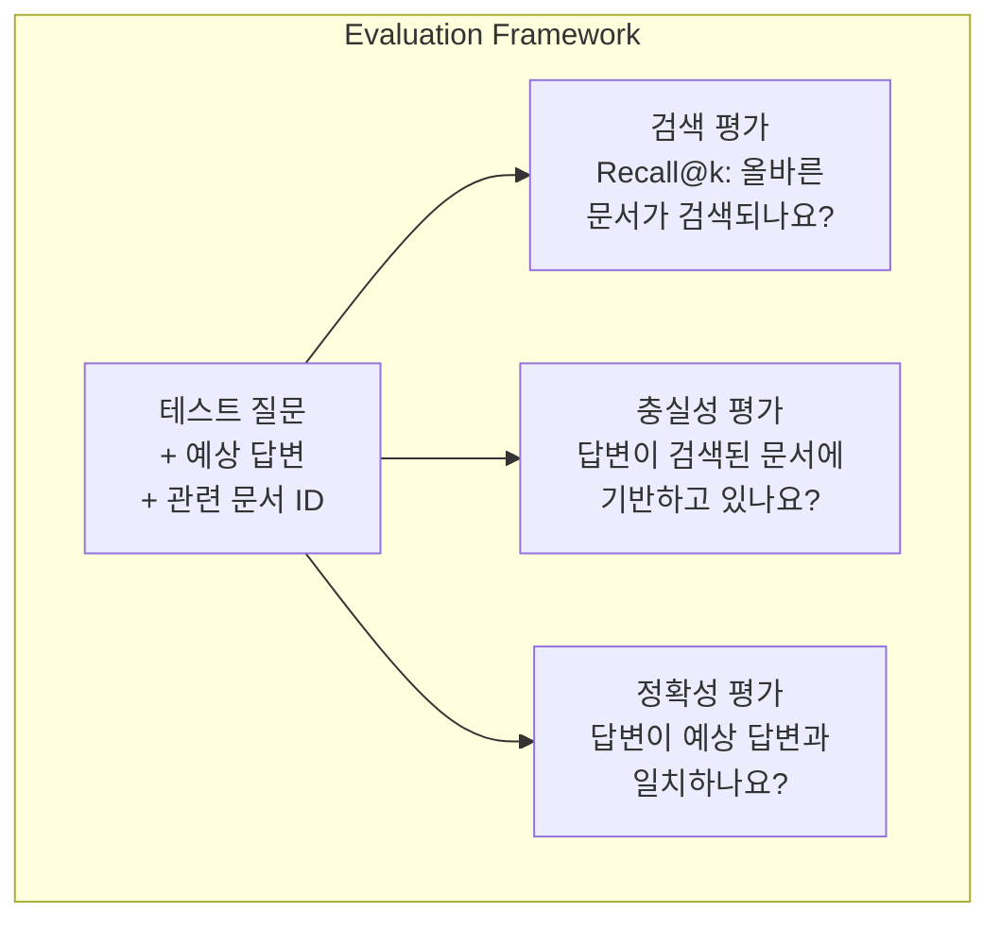

# 고급 RAG (청킹, 리랭킹, 하이브리드 검색)

> 기본 RAG는 가장 유사한 청크를 top-k로 검색합니다. 이는 단순한 질문에 대해서는 잘 작동합니다. 다단계 추론, 모호한 쿼리, 대규모 코퍼어에서는 작동하지 않습니다. 고급 RAG는 10개 문서에서 작동하는 데모와 1,000만 개 문서에서 작동하는 시스템의 차이입니다.

**유형:** Build
**언어:** Python
**선수 요건:** 11단계, 06강 (RAG)
**시간:** 약 90분

**관련:** 5단계 · 23강 (RAG를 위한 청킹 전략)은 재귀적, 시맨틱, 문장, 부모 문서, 후기 청킹, 컨텍스트 검색 등 6가지 청킹 알고리즘을 Vectara/Anthropic 벤치마크와 함께 다루고 있습니다. 이 강의는 그 위에 하이브리드 검색, 리랭킹, 쿼리 변환을 구축합니다.

## 학습 목표

- 문서 구조와 컨텍스트를 보존하는 고급 청킹 전략(시맨틱, 재귀적, 부모-자식)을 구현해 보세요
- BM25 키워드 매칭과 시맨틱 벡터 검색, 크로스 인코더 리랭커를 결합한 하이브리드 검색 파이프라인을 구축해 보세요
- 모호하거나 복잡한 질문에 대한 검색 성능을 개선하기 위해 쿼리 변환 기법(HyDE, 다중 쿼리, 스텝 백)을 적용해 보세요
- 잘못된 청크가 검색됨, 컨텍스트에 답이 없음, 다단계 추론이 깨지는 등 일반적인 RAG 실패를 진단하고 수정해 보세요

## 문제점

06강에서 기본 RAG 파이프라인을 구축했습니다. 이는 작은 코퍼어에서의 단순한 질문에 대해서는 잘 작동합니다. 이제 다음을 시도해 보세요:

**모호한 쿼리**: "지난 분기 매출은 얼마였나요?" 시맨틱 검색은 매출 전략, 매출 예측, CFO의 매출 성장에 대한 생각을 담은 청크를 반환합니다. 모두 "매출"이라는 단어와 시맨틱적으로 유사합니다. 실제 숫자를 포함하는 청크는 없습니다. 올바른 청크는 "$47.2M in Q3 2025" but uses the word "earnings" instead of "revenue." The embedding model thinks "revenue strategy" is closer to the query than "Q3 earnings were $47.2M."라고 말합니다.

**다단계 질문**: "어떤 팀이 고객 만족도 점수 개선이 가장 높았나요?" 이는 각 팀의 만족도 점수를 찾고, 비교하고, 최대값을 식별해야 합니다. 단일 청크에는 답이 없습니다. 정보는 팀 보고서 전반에 흩어져 있습니다.

**대규모 코퍼스 문제**: 200만 개의 청크가 있습니다. 정답은 청크 #1,847,293에 있습니다. 상위 5개 검색 결과로 청크 #14, #89,201, #1,200,000, #44, #901,333이 추출됩니다. 임베딩 공간에서는 가깝지만, 정답을 포함하는 청크는 없습니다. 이 규모에서는 근사 최근접 이웃 (ANN)(Approximate Nearest Neighbor (ANN)) 검색이 충분한 오차를 발생시켜 관련 결과가 top-k에서 밀려납니다.

기본 RAG (검색 증강 생성)(RAG (Retrieval-Augmented Generation))는 벡터 유사성이 관련성과 같지 않기 때문에 실패합니다. 청크는 쿼리에 대해 의미적으로 유사할 수 있지만, 답변하는 데 유용하지 않을 수 있습니다. 고급 RAG는 네 가지 기술로 이를 해결합니다: 하이브리드 검색 (키워드 매칭 추가), 리랭킹 (후보 점수를 더 신중하게 계산), 쿼리 변환 (검색 전 쿼리를 수정), 더 나은 청킹 (적절한 세분도로 검색).

## 개념

### 하이브리드 검색: 시맨틱 + 키워드

시맨틱 검색 (벡터 유사성)은 의미를 이해하는 데 능숙합니다. "구독을 어떻게 취소하나요?"는 단어를 공유하지 않더라도 "플랜 종료 단계"와 일치합니다. 하지만 정확한 일치 항목을 놓칩니다. 임베딩 모델이 "E-4021"을 잡음으로 처리한다면, "E-4021"을 포함하는 청크가 "Error code E-4021"과 일치하지 않을 수 있습니다.

키워드 검색 (BM25)은 그 반대입니다. 정확한 일치 항목에 능숙합니다. "E-4021"은 완벽하게 일치합니다. 하지만 문서가 "terminate your plan"이라고 말한다면 "cancel my subscription"은 0개의 결과를 반환합니다.

하이브리드 검색은 두 가지를 모두 실행한 후 결과를 병합합니다.

**BM25** (Best Matching 25)는 표준 키워드 검색 알고리즘입니다. 1990년대부터 검색 엔진의 핵심이 되어 왔습니다. 공식은 다음과 같습니다:

```
BM25(q, d) = sum over terms t in q:
    IDF(t) * (tf(t,d) * (k1 + 1)) / (tf(t,d) + k1 * (1 - b + b * |d| / avgdl))
```

여기서 tf(t,d)는 문서 d에서 t의 용어 빈도, IDF(t)는 역 문서 빈도, |d|는 문서 길이, avgdl은 평균 문서 길이, k1은 용어 빈도 포화 제어 (기본값 1.2), b는 길이 정규화 제어 (기본값 0.75)입니다.

쉽게 말해: BM25는 쿼리 용어 (특히 희소한 용어)를 포함하는 문서에 더 높은 점수를 부여하지만, 반복된 용어에 대해서는 수익이 감소합니다. "revenue"라는 단어가 50번 포함된 문서는 한 번 포함된 문서보다 관련성이 50배 높지 않습니다.

### 상호 랭킹 융합 (RRF)(Reciprocal Rank Fusion (RRF))

두 개의 순위 목록이 있습니다: 하나는 벡터 검색에서, 하나는 BM25에서. 이들을 어떻게 결합하나요? 상호 랭킹 융합 (RRF)(Reciprocal Rank Fusion (RRF))이 표준적인 접근 방식입니다.

```
RRF_score(d) = sum over rankings R:
    1 / (k + rank_R(d))
```

k는 상수(일반적으로 60)로, 상위 순위 결과가 지배하는 것을 방지합니다.

벡터 검색에서 1위, BM25에서 5위인 문서는: 1/(60+1) + 1/(60+5) = 0.0164 + 0.0154 = 0.0318

벡터 검색에서 3위, BM25에서 2위인 문서는: 1/(60+3) + 1/(60+2) = 0.0159 + 0.0161 = 0.0320

상호 랭킹 융합 (RRF)(Reciprocal Rank Fusion (RRF))는 두 신호를 자연스럽게 균형시킵니다. 두 목록 모두에서 높은 순위를 차지한 문서는 가장 좋은 점수를 받습니다. 한 목록에서 1위지만 다른 목록에 없는 문서는 중간 점수를 받습니다. 이는 점수 분포의 차이와 무관하게 순위(rank)를 사용하므로, 두 시스템 간의 점수 분포 차이에 영향을 받지 않는 견고한 방법입니다.

### 리랭킹(Reranking)

검색(벡터, 키워드, 하이브리드)은 빠르지만 정확도가 낮습니다. 바이인코더(bi-encoder)를 사용하며, 쿼리와 각 문서를 독립적으로 임베딩한 후 비교합니다. 임베딩은 한 번 계산되어 캐시됩니다. 이 방식은 수백만 개의 문서로 확장 가능합니다.

리랭킹(Reranking)은 크로스인코더(cross-encoder)를 사용합니다. 쿼리와 후보 문서를 함께 모델에 입력하면 관련성 점수가 출력됩니다. 모델은 두 텍스트를 동시에 보며 미세한 상호작용을 포착할 수 있습니다. 크로스인코더는 바이인코더가 연결을 놓쳤더라도 "Q3 수익은 얼마였나요?"가 "$47.2M in Q3"를 포함하는 청크와 매우 관련이 높다는 것을 이해할 수 있습니다.

트레이드오프: 크로스인코더는 쿼리-문서 쌍을 함께 처리하므로 바이인코더보다 100-1000배 느립니다. 수백만 개의 문서에 대해 크로스인코더 점수를 미리 계산할 수 없습니다. 해결책: 더 큰 후보 집합(하이브리드 검색에서 상위 50개)을 검색한 후, 크로스인코더로 리랭킹하여 최종 상위 5개를 얻습니다.



일반적인 리랭킹 모델 (2026 라인업):
- Cohere Rerank 3.5: 관리형 API, 다국어 지원, 혼합 코퍼스에서 가장 높은 재현율 향상
- Voyage rerank-2.5: 관리형 API, 호스팅 옵션 중 가장 낮은 지연 시간
- Jina-Reranker-v2 Multilingual: 오픈 웨이트, 100개 이상의 언어 지원
- bge-reranker-v2-m3: 오픈 웨이트, 강력한 기준선
- cross-encoder/ms-marco-MiniLM-L-6-v2: 오픈 웨이트, 프로토타이핑을 위해 CPU에서 실행
- ColBERTv2 / Jina-ColBERT-v2: 후기 상호작용 다중 벡터 리랭커 — 스코어링 시 O(docs)가 아닌 O(tokens)

### 쿼리 변환

때로는 문제가 검색이 아니라 쿼리 자체일 수 있습니다. "새 정책 변경에 대한 그건 뭐였지?"는 형편없는 검색 쿼리입니다. 구체적인 용어가 포함되어 있지 않습니다. 임베딩이 모호합니다. 이 쿼리로는 어떤 검색 시스템도 올바른 문서를 찾을 수 없습니다.

**쿼리 재작성**: 사용자의 쿼리를 더 나은 검색 쿼리로 재구성합니다. LLM이 이를 수행할 수 있습니다:

```
User: "What was that thing about the new policy change?"
Rewritten: "Recent policy changes and updates"
```

**HyDE (가상 문서 임베딩)(Hypothetical Document Embeddings)**: 쿼리로 검색하는 대신 가상 답변을 생성하고, 이를 임베딩하여 유사한 실제 문서를 검색합니다.

```
Query: "What is the refund policy for enterprise?"
Hypothetical answer: "Enterprise customers are eligible for a full refund
within 60 days of purchase. Refunds are pro-rated based on the remaining
subscription period and processed within 5-7 business days."
```

가상 답변을 임베딩하고 이와 유사한 실제 문서를 검색합니다. 직관적으로, 가상 답변은 원본 질문보다 임베딩 공간에서 실제 답변에 더 가깝게 위치합니다. 질문과 답변은 서로 다른 언어적 구조를 가집니다. 가상 답변을 생성함으로써 임베딩에서의 "질문 공간"과 "답변 공간" 사이의 간극을 메울 수 있습니다.

HyDE는 검색 전에 LLM 호출을 한 번 추가합니다. 이는 지연 시간을 500-2000ms 증가시킵니다. 원시 쿼리에 대한 검색 품질이 낮을 때 가치가 있습니다.

### 부모-자식 청킹

표준 청킹은 절충을 강요합니다: 정확한 검색을 위해 작은 청크를 사용해야 하고, 충분한 컨텍스트를 위해 큰 청크를 사용해야 합니다. 부모-자식 청킹은 이 절충을 없앱니다.

검색을 위해 작은 청크(128 토큰)를 인덱싱합니다. 작은 청크가 검색되면, 프롬프트를 위해 부모 청크(512 토큰)를 반환합니다. 작은 청크는 쿼리와 정확하게 일치합니다. 부모 청크는 LLM이 좋은 답변을 생성하기에 충분한 컨텍스트를 제공합니다.



쿼리 "enterprise refund?"는 자식 청크 C2와 정확히 일치합니다. 하지만 프롬프트는 처리 시간 및 제출 프로세스에 대한 주변 컨텍스트를 포함하는 전체 부모 청크 P를 받습니다.

### 메타데이터 필터링

벡터 검색을 실행하기 전에 메타데이터(날짜, 출처, 카테고리, 저자, 언어)로 코퍼스를 필터링하세요. 이는 검색 공간을 줄이고 관련 없는 결과를 방지합니다.

"지난 달 보안 정책에 어떤 변화가 있었나요?"는 보안 카테고리의 최근 30일 문서만 검색해야 합니다. 메타데이터 필터링이 없으면 전체 코퍼스를 검색하여, 우연히 의미적으로 유사한 2년 전 보안 문서를 검색할 수 있습니다.

프로덕션 RAG 시스템은 각 청크와 함께 메타데이터(출처 문서, 생성 날짜, 카테고리, 저자, 버전)를 저장합니다. 벡터 데이터베이스는 유사성 검색 전에 메타데이터로 사전 필터링을 지원하며, 이는 대규모 환경에서의 성능에 매우 중요합니다.

### 평가

RAG 시스템을 구축했습니다. 작동하는지 어떻게 알 수 있나요? 세 가지 지표가 있습니다:

**검색 관련성 (Recall@k)**: 알려진 관련 문서가 있는 테스트 질문 집합에 대해, 관련 문서의 몇 퍼센트가 상위 k개 결과에 나타나나요? 질문의 답이 청크 #47에 있다면, 청크 #47이 상위 5개에 나타나나요?

**충실성 (Faithfulness)**: 생성된 답변이 검색된 문서에 기반하고 있나요? 검색된 청크가 "60일 환불 기간"이라고 말하는데 모델이 "90일 환불 기간"이라고 말한다면, 이는 충실성 실패입니다. 모델이 올바른 컨텍스트를 가지고 있음에도 환각(Hallucination)을 일으켰습니다.

**답변 정확성**: 생성된 답변이 예상 답변과 일치하나요? 이는 엔드투엔드(end-to-end) 지표입니다. 검색 품질과 생성 품질을 결합합니다.

간단한 충실성 확인 방법: 생성된 답변의 각 주장을 취하여, 검색된 청크에 (본질적으로) 나타나는지 검증하세요. 답변에 검색된 청크에 없는 사실이 포함되어 있다면, 환각(Hallucination)일 가능성이 높습니다.



```figure
agentic-rag-loop
```

## 구현하기

### 1단계: BM25 구현

```python
import math
from collections import Counter

class BM25:
    def __init__(self, k1=1.2, b=0.75):
        self.k1 = k1
        self.b = b
        self.docs = []
        self.doc_lengths = []
        self.avg_dl = 0
        self.doc_freqs = {}
        self.n_docs = 0

    def index(self, documents):
        self.docs = documents
        self.n_docs = len(documents)
        self.doc_lengths = []
        self.doc_freqs = {}

        for doc in documents:
            words = doc.lower().split()
            self.doc_lengths.append(len(words))
            unique_words = set(words)
            for word in unique_words:
                self.doc_freqs[word] = self.doc_freqs.get(word, 0) + 1

        self.avg_dl = sum(self.doc_lengths) / self.n_docs if self.n_docs else 1

    def score(self, query, doc_idx):
        query_words = query.lower().split()
        doc_words = self.docs[doc_idx].lower().split()
        doc_len = self.doc_lengths[doc_idx]
        word_counts = Counter(doc_words)
        score = 0.0

        for term in query_words:
            if term not in word_counts:
                continue
            tf = word_counts[term]
            df = self.doc_freqs.get(term, 0)
            idf = math.log((self.n_docs - df + 0.5) / (df + 0.5) + 1)
            numerator = tf * (self.k1 + 1)
            denominator = tf + self.k1 * (1 - self.b + self.b * doc_len / self.avg_dl)
            score += idf * numerator / denominator

        return score

    def search(self, query, top_k=10):
        scores = [(i, self.score(query, i)) for i in range(self.n_docs)]
        scores.sort(key=lambda x: x[1], reverse=True)
        return scores[:top_k]
```

### 2단계: 상호 랭킹 융합 (RRF)

```python
def reciprocal_rank_fusion(ranked_lists, k=60):
    scores = {}
    for ranked_list in ranked_lists:
        for rank, (doc_id, _) in enumerate(ranked_list):
            if doc_id not in scores:
                scores[doc_id] = 0.0
            scores[doc_id] += 1.0 / (k + rank + 1)
    fused = sorted(scores.items(), key=lambda x: x[1], reverse=True)
    return fused
```

### 3단계: 하이브리드 검색 파이프라인

```python
def hybrid_search(query, chunks, vector_embeddings, vocab, idf, bm25_index, top_k=5, fusion_k=60):
    query_emb = tfidf_embed(query, vocab, idf)
    vector_results = search(query_emb, vector_embeddings, top_k=top_k * 3)
    bm25_results = bm25_index.search(query, top_k=top_k * 3)
    fused = reciprocal_rank_fusion([vector_results, bm25_results], k=fusion_k)
    return fused[:top_k]
```

### 4단계: 간단한 리랭커

프로덕션 환경에서는 크로스 인코더 모델을 사용해야 합니다. 여기서는 단어 중복, 용어 중요도, 구문 매칭을 사용하여 쿼리-문서 관련성을 점수화하는 리랭커를 구축해 보세요.

```python
def rerank(query, candidates, chunks):
    query_words = set(query.lower().split())
    stop_words = {"the", "a", "an", "is", "are", "was", "were", "what", "how",
                  "why", "when", "where", "do", "does", "for", "of", "in", "to",
                  "and", "or", "on", "at", "by", "it", "its", "this", "that",
                  "with", "from", "be", "has", "have", "had", "not", "but"}
    query_terms = query_words - stop_words

    scored = []
    for doc_id, initial_score in candidates:
        chunk = chunks[doc_id].lower()
        chunk_words = set(chunk.split())

        term_overlap = len(query_terms & chunk_words)

        query_bigrams = set()
        q_list = [w for w in query.lower().split() if w not in stop_words]
        for i in range(len(q_list) - 1):
            query_bigrams.add(q_list[i] + " " + q_list[i + 1])
        bigram_matches = sum(1 for bg in query_bigrams if bg in chunk)

        position_boost = 0
        for term in query_terms:
            pos = chunk.find(term)
            if pos != -1 and pos < len(chunk) // 3:
                position_boost += 0.5

        rerank_score = (
            term_overlap * 1.0
            + bigram_matches * 2.0
            + position_boost
            + initial_score * 5.0
        )
        scored.append((doc_id, rerank_score))

    scored.sort(key=lambda x: x[1], reverse=True)
    return scored
```

### 5단계: HyDE (가상 문서 임베딩)

```python
def hyde_generate_hypothesis(query):
    templates = {
        "what": "The answer to '{query}' is as follows: Based on our documentation, {topic} involves specific policies and procedures that define how the process works.",
        "how": "To address '{query}': The process involves several steps. First, you need to initiate the request. Then, the system processes it according to the defined rules.",
        "default": "Regarding '{query}': Our records indicate specific details and policies related to this topic that provide a comprehensive answer."
    }
    query_lower = query.lower()
    if query_lower.startswith("what"):
        template = templates["what"]
    elif query_lower.startswith("how"):
        template = templates["how"]
    else:
        template = templates["default"]

    topic_words = [w for w in query.lower().split()
                   if w not in {"what", "is", "the", "how", "do", "does", "a", "an",
                                "for", "of", "to", "in", "on", "at", "by", "and", "or"}]
    topic = " ".join(topic_words) if topic_words else "this topic"

    return template.format(query=query, topic=topic)


def hyde_search(query, chunks, vector_embeddings, vocab, idf, top_k=5):
    hypothesis = hyde_generate_hypothesis(query)
    hypothesis_emb = tfidf_embed(hypothesis, vocab, idf)
    results = search(hypothesis_emb, vector_embeddings, top_k)
    return results, hypothesis
```

### 6단계: 부모-자식 청킹

```python
def create_parent_child_chunks(text, parent_size=200, child_size=50):
    words = text.split()
    parents = []
    children = []
    child_to_parent = {}

    parent_idx = 0
    start = 0
    while start < len(words):
        parent_end = min(start + parent_size, len(words))
        parent_text = " ".join(words[start:parent_end])
        parents.append(parent_text)

        child_start = start
        while child_start < parent_end:
            child_end = min(child_start + child_size, parent_end)
            child_text = " ".join(words[child_start:child_end])
            child_idx = len(children)
            children.append(child_text)
            child_to_parent[child_idx] = parent_idx
            child_start += child_size

        parent_idx += 1
        start += parent_size

    return parents, children, child_to_parent
```

### 7단계: 충실도 평가

```python
def evaluate_faithfulness(answer, retrieved_chunks):
    answer_sentences = [s.strip() for s in answer.split(".") if len(s.strip()) > 10]
    if not answer_sentences:
        return 1.0, []

    grounded = 0
    ungrounded = []
    context = " ".join(retrieved_chunks).lower()

    for sentence in answer_sentences:
        words = set(sentence.lower().split())
        stop_words = {"the", "a", "an", "is", "are", "was", "were", "and", "or",
                      "to", "of", "in", "for", "on", "at", "by", "it", "this", "that"}
        content_words = words - stop_words
        if not content_words:
            grounded += 1
            continue

        matched = sum(1 for w in content_words if w in context)
        ratio = matched / len(content_words) if content_words else 0

        if ratio >= 0.5:
            grounded += 1
        else:
            ungrounded.append(sentence)

    score = grounded / len(answer_sentences) if answer_sentences else 1.0
    return score, ungrounded


def evaluate_retrieval_recall(queries_with_relevant, retrieval_fn, k=5):
    total_recall = 0.0
    results = []

    for query, relevant_indices in queries_with_relevant:
        retrieved = retrieval_fn(query, k)
        retrieved_indices = set(idx for idx, _ in retrieved)
        relevant_set = set(relevant_indices)
        hits = len(retrieved_indices & relevant_set)
        recall = hits / len(relevant_set) if relevant_set else 1.0
        total_recall += recall
        results.append({
            "query": query,
            "recall": recall,
            "hits": hits,
            "total_relevant": len(relevant_set)
        })

    avg_recall = total_recall / len(queries_with_relevant) if queries_with_relevant else 0
    return avg_recall, results
```

## 사용하기

실제 크로스 인코더를 사용하여 리랭킹을 수행합니다:

```python
from sentence_transformers import CrossEncoder

reranker = CrossEncoder("cross-encoder/ms-marco-MiniLM-L-6-v2")

def rerank_with_cross_encoder(query, candidates, chunks, top_k=5):
    pairs = [(query, chunks[doc_id]) for doc_id, _ in candidates]
    scores = reranker.predict(pairs)
    scored = list(zip([doc_id for doc_id, _ in candidates], scores))
    scored.sort(key=lambda x: x[1], reverse=True)
    return scored[:top_k]
```

Cohere의 관리형 리랭커를 사용합니다:

```python
import cohere

co = cohere.Client()

def rerank_with_cohere(query, candidates, chunks, top_k=5):
    docs = [chunks[doc_id] for doc_id, _ in candidates]
    response = co.rerank(
        model="rerank-english-v3.0",
        query=query,
        documents=docs,
        top_n=top_k
    )
    return [(candidates[r.index][0], r.relevance_score) for r in response.results]
```

실제 LLM을 사용하여 HyDE를 구현합니다:

```python
import anthropic

client = anthropic.Anthropic()

def hyde_with_llm(query):
    response = client.messages.create(
        model="claude-sonnet-5",
        max_tokens=256,
        messages=[{
            "role": "user",
            "content": f"Write a short paragraph that would be a good answer to this question. Do not say you don't know. Just write what the answer would look like.\n\nQuestion: {query}"
        }]
    )
    return response.content[0].text
```

Weaviate를 사용하여 프로덕션 환경의 하이브리드 검색을 구현합니다:

```python
import weaviate

client = weaviate.connect_to_local()

collection = client.collections.get("Documents")
response = collection.query.hybrid(
    query="enterprise refund policy",
    alpha=0.5,
    limit=10
)
```

alpha 매개변수가 균형을 제어합니다: 0.0 = 순수 키워드 (BM25), 1.0 = 순수 벡터, 0.5 = 동일한 가중치. 대부분의 프로덕션 시스템은 alpha를 0.03강 0.7 사이로 설정합니다.

## 출시하기

이 강의에서 생성되는 결과물:
- `outputs/prompt-advanced-rag-debugger.md` -- RAG 품질 문제를 진단하고 수정하기 위한 프롬프트
- `outputs/skill-advanced-rag.md` -- 하이브리드 검색 및 리랭킹을 통해 프로덕션급 RAG를 구축하기 위한 스킬

## 연습 문제

1. 샘플 문서에서 BM25, 벡터 검색, 하이브리드 검색을 비교해 보세요. 5개의 테스트 쿼리 각각에 대해, 가장 관련성 높은 청크를 1번 위치에 반환하는 접근 방식을 기록하세요. 하이브리드 검색은 5개 중 최소 3개에서 승리해야 합니다.

2. 메타데이터 필터를 구현하세요. 각 문서에 "category" 필드를 추가하세요 (security, billing, api, product). 벡터 검색을 실행하기 전에, 관련 카테고리에만 청크를 필터링하세요. "What encryption is used?"로 테스트하고, security 카테고리 청크만 검색되는지 확인하세요.

3. 06강의 간단한 generate 함수를 사용하여 전체 HyDE 파이프라인을 구축하세요. 5개의 테스트 쿼리 전체에 대해 직접 쿼리 검색과 HyDE 검색의 검색 품질(top-3 관련성)을 비교하세요. HyDE는 모호한 쿼리에 대해 결과를 개선해야 합니다.

4. 샘플 문서에 부모-자식 청킹 전략을 구현하세요. child_size=30, parent_size=100을 사용하세요. 자식 청크로 검색하되 프롬프트에는 부모 청크를 반환하세요. chunk_size=50인 표준 청킹으로 생성된 답변과 비교하세요.

5. 평가 데이터셋을 만들어 보세요: 알려진 답변 청크가 있는 질문 10개를 준비합니다. (a) 벡터 검색만, (b) BM25만, (c) 하이브리드 검색, (d) 하이브리드 + 리랭킹에 대해 Recall@3, Recall@5, Recall@10을 측정합니다. 결과를 플롯하고 리랭킹이 가장 큰 도움이 되는 부분을 식별합니다.

## 핵심 용어

| 용어 | 사람들이 말하는 것 | 실제 의미 |
|------|----------------|----------------------|
| BM25 | "키워드 검색" | 용어 빈도, 역 문서 빈도, 문서 길이 정규화를 통해 문서에 점수를 매기는 확률적 랭킹 알고리즘 |
| 하이브리드 검색 | "두 세계의 장점" | 시맨틱(벡터) 검색과 키워드(BM25) 검색을 병렬로 실행한 후 랭킹 융합으로 결과를 병합하는 것 |
| 상호 랭킹 융합 (RRF)(Reciprocal Rank Fusion) | "랭킹된 목록 병합" | 모든 목록에 걸쳐 각 문서에 대해 1/(k + rank)를 합산하여 여러 랭킹된 목록을 결합하는 것 |
| 리랭킹 | "두 번째 패스 점수 매기기" | 초기 검색에서 후보 집합을 더 비싼 교차 인코더 모델로 다시 점수 매기기 |
| 교차 인코더 | "질문-문서 결합 모델" | 질문과 문서를 단일 입력으로 받아 관련성 점수를 생성하는 모델; 바이 인코더보다 정확하지만 전체 코퍼스 검색에는 너무 느림 |
| 바이 인코더 | "독립 임베딩 모델" | 질문과 문서를 독립적으로 임베딩하는 모델; 임베딩이 사전 계산되어 빠르지만 교차 인코더보다 정확도가 낮음 |
| HyDE | "가짜 답변으로 검색" | 질문에 대한 가설적 답변을 생성하고, 이를 임베딩하여 그와 유사한 실제 문서를 검색 |
| 부모-자식 청킹 | "작은 검색, 큰 컨텍스트" | 정확한 검색을 위해 작은 청크를 인덱싱하지만 충분한 컨텍스트를 제공하기 위해 더 큰 부모 청크를 반환 |
| 메타데이터 필터링 | "검색 전에 좁히기" | 벡터 검색을 실행하기 전에 속성(날짜, 출처, 카테고리)으로 문서를 필터링하여 검색 공간을 줄이는 것 |
| 충실성 | "그라운딩을 유지했는가" | 생성된 답변이 검색된 문서에 의해 지원되는지 여부, 모델의 학습 데이터에서 환각(Hallucination)된 것과 대비 |

## 추가 읽기

- Robertson & Zaragoza, "The Probabilistic Relevance Framework: BM25 and Beyond" (2009) -- BM25의 결정적 참고 자료로, 공식 뒤의 확률적 기초를 설명합니다
- Cormack et al., "Reciprocal Rank Fusion Outperforms Condorcet and Individual Rank Learning Methods" (2009) -- 상호 랭킹 융합 (RRF)(Reciprocal Rank Fusion (RRF))의 원 논문으로, 더 복잡한 융합 방법보다 우수함을 보여줍니다
- Gao et al., "Precise Zero-Shot Dense Retrieval without Relevance Labels" (2022) -- HyDE 논문으로, 가설 문서 임베딩이 학습 데이터 없이 검색 성능을 개선함을 입증합니다
- Nogueira & Cho, "Passage Re-ranking with BERT" (2019) -- BM25 위에 교차 인코더 리랭커를 적용하면 검색 품질이 크게 향상됨을 보여줍니다
- [Khattab et al., "DSPy: Compiling Declarative Language Model Calls into Self-Improving Pipelines" (2023)](https://arxiv.org/abs/2310.03714) -- 프롬프트 구성과 가중치 선택을 검색 파이프라인에 대한 최적화 문제로 다루며, "프롬프트 LLM"이 아닌 "프로그래밍 LLM" 관점에서 읽어 보세요
- [Edge et al., "From Local to Global: A Graph RAG Approach to Query-Focused Summarization" (Microsoft Research 2024)](https://arxiv.org/abs/2404.16130) -- GraphRAG 논문: 엔티티-관계 추출과 Leiden 커뮤니티 탐지를 활용한 질의 중심 요약; 전역 vs 지역 검색의 구분
- [Asai et al., "Self-RAG: Learning to Retrieve, Generate, and Critique through Self-Reflection" (ICLR 2024)](https://arxiv.org/abs/2310.11511) -- 반영 토큰을 사용하는 자기 평가형 RAG; 정적 검색 후 생성을 넘어선 에이전트적 최전선
- [LangChain Query Construction blog](https://blog.langchain.dev/query-construction/) -- 자연어 질의를 구조화된 데이터베이스 질의(Text-to-SQL, Cypher)로 변환하는 방법; 검색 전 단계로 수행
