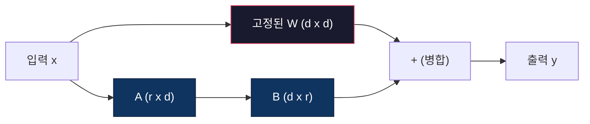
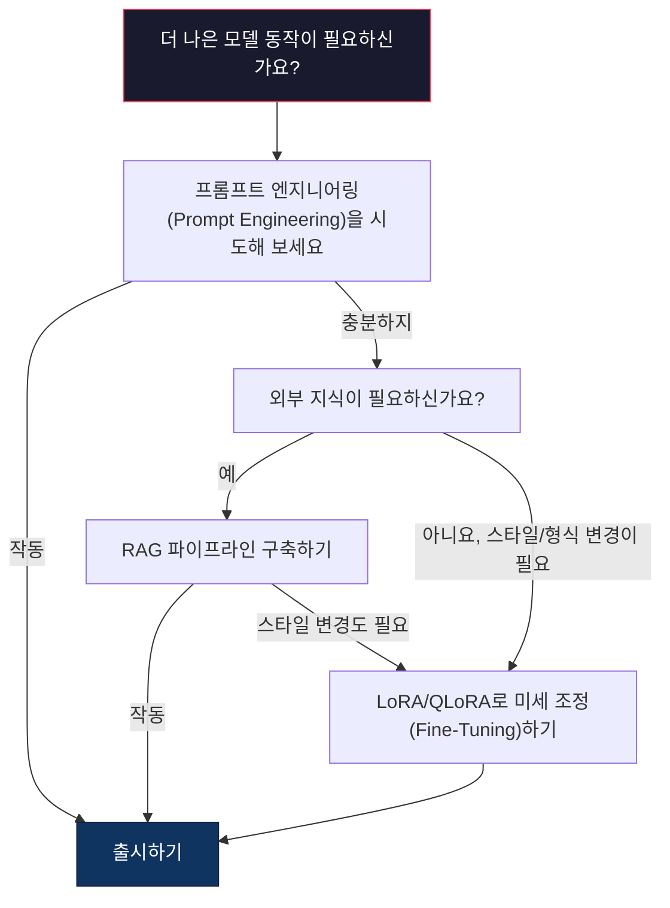

# LoRA 및 QLoRA를 이용한 미세 조정(Fine-Tuning)

> 7B 모델을 전체 미세 조정(Fine-Tuning)하려면 56GB의 VRAM이 필요합니다. 대부분의 회사도 이 사양을 충족하지 못합니다. LoRA는 매개변수(Parameter)의 1% 미만만 학습하여 같은 모델을 6GB로 미세 조정할 수 있게 해줍니다. 이는 타협이 아닙니다 -- 대부분의 작업에서 전체 미세 조정의 품질과 일치합니다. 전체 오픈소스 미세 조정 생태계는 이 하나의 기술에 의존합니다.

**유형:** Build
**언어:** Python
**선수 요건:** 10단계, 06강 (지시문 튜닝 / 지도 미세 조정 (SFT)(Supervised Fine-Tuning))
**시간:** 약 75분

**관련:** 10단계에서는 SFT/DPO 루프를 처음부터 다룹니다. 이 강의에서는 이를 2026년 PEFT 도구들(PEFT, TRL, Unsloth, Axolotl, LLaMA-Factory)에 연결합니다.

## 학습 목표

- 사전 학습된 모델의 어텐션(Attention) 레이어에 저랭크 어댑터 매트릭스(A 및 B)를 주입하여 LoRA를 구현해 보세요
- LoRA와 전체 미세 조정의 매개변수 절감량을 계산해 보세요: 차원 d_model의 랭크 r은 d^2 대신 2*r*d 매개변수를 학습합니다
- QLoRA(4비트 양자화(Quantization)된 기본 모델 + LoRA 어댑터)를 사용하여 모델이 소비자용 GPU 메모리 내에 적합하도록 미세 조정해 보세요
- LoRA 가중치(Weight)를 기본 모델에 병합하여 배포하고, 어댑터가 있을 때와 없을 때의 추론(Inference) 속도를 비교해 보세요

## 문제점

기본 모델이 있습니다. Llama 3 8B입니다. 회사만의 목소리로 고객 지원 티켓에 답변하도록 만들고 싶다고 가정해 보세요. SFT가 정답입니다. 하지만 SFT에는 비용 문제가 있습니다.

전체 미세 조정은 모델의 모든 매개변수를 업데이트합니다. Llama 3 8B는 80억 개의 매개변수를 가지고 있습니다. fp16에서는 각 매개변수가 2바이트를 차지합니다. 가중치를 로드하는 것만으로도 16GB가 필요합니다. 학습 중에는 기울기(Gradient)(16GB), Adam 옵티마이저(Optimizer)의 옵티마이저 상태(momentum + variance)(32GB), 그리고 활성화 값도 필요합니다. 총합: 단일 8B 모델에 약 56GB의 VRAM이 필요합니다.

A100 80GB는 이를 간신히 수용할 수 있습니다. 두 개의 A100는 실험당 $3-4/hour on cloud providers. Training for 3 epochs on 50,000 examples takes 6-10 hours. That's $30-40의 비용이 듭니다. 하이퍼파라미터(Hyperparameter)를 정확히 맞추기 위해 10번의 실험을 진행하면, 배포하기 전에 $400를 지출하게 됩니다.

Llama 3 70B로 확장하면 수치는 터무니없어집니다. 가중치만으로도 140GB가 필요합니다. 클러스터가 필요합니다. 실험당 $100 이상입니다.

더 깊은 문제도 있습니다. 전체 미세 조정(Fine-tuning)은 모델의 모든 가중치를 수정합니다. 고객 지원 데이터로 미세 조정하면 모델의 일반적 능력이 저하될 수 있습니다. 이를 '파국적遗忘(Catastrophic Forgetting)'이라고 합니다. 모델은 특정 작업에 대해서는 더 잘 수행하지만, 다른 모든 작업에서는 성능이 떨어집니다.

더 적은 매개변수를 학습하고, 메모리를 덜 사용하며, 모델의 기존 지식을 파괴하지 않는 방법이 필요합니다.

## 개념

### LoRA: 저랭크 적응(Low-Rank Adaptation)

Microsoft의 Edward Hu와 동료들은 2021년 6월에 LoRA를 발표했습니다. 논문 핵심 통찰: 미세 조정 중 가중치 업데이트는 낮은 내재적 랭크(intrinsic rank)를 가집니다. 4096x4096 가중치 행렬의 1670만 개 매개변수를 모두 업데이트할 필요가 없습니다. 업데이트의 유용한 정보는 랭크 16 또는 32의 행렬로 포착할 수 있습니다.

수학적 표현은 다음과 같습니다. 표준 선형 레이어는 다음을 계산합니다:

```
y = Wx
```

여기서 W는 d_out x d_in 행렬입니다. 4096x4096 어텐션 투사(projection)의 경우, 이는 16,777,216개의 매개변수입니다.

LoRA는 W를 고정(freeze)하고 낮은 랭크 분해(low-rank decomposition)를 추가합니다:

```
y = Wx + BAx
```

여기서 B는 (d_out x r), A는 (r x d_in)입니다. 랭크 r은 d보다 훨씬 작으며, 일반적으로 8, 16 또는 32를 사용합니다.

4096x4096 레이어에서 r=16인 경우:
- 원래 매개변수: 4096 x 4096 = 16,777,216
- LoRA 매개변수: (4096 x 16) + (16 x 4096) = 65,536 + 65,536 = 131,072
- 감소율: 131,072 / 16,777,216 = 0.78%

매개변수의 0.78%만 학습하면서 품질의 95-100%를 얻습니다.



A는 랜덤 가우시안으로 초기화됩니다. B는 0으로 초기화됩니다. 이는 LoRA 기여도가 0에서 시작한다는 의미로, 모델은 원래 동작에서 학습을 시작하여 적응을 점진적으로 학습합니다.

### 스케일링 팩터: Alpha

LoRA는 낮은 랭크 업데이트가 출력에 미치는 영향을 제어하는 스케일링 팩터 alpha를 도입합니다:

```
y = Wx + (alpha / r) * BAx
```

alpha = r일 때, 스케일링은 1x입니다. alpha = 2r (일반적인 기본값)일 때, 스케일링은 2x입니다. 이 하이퍼파라미터는 기본 학습률과 독립적으로 LoRA 경로의 학습률을 제어합니다.

실용적인 가이드:
- alpha = 2 * rank는 커뮤니티에서 흔히 사용되는 관례입니다 (원 논문에서는 대부분의 실험에서 alpha = rank를 사용했습니다)
- alpha = rank는 1x 스케일링을 제공하며, 보수적이지만 안정적입니다
- 더 높은 alpha는 단계당 더 큰 업데이트를 의미하며, 이는 수렴을 가속화하거나 불안정성을 초래할 수 있습니다

### LoRA 적용 위치

트랜스포머에는 많은 선형 레이어가 있습니다. 모든 레이어에 LoRA를 추가할 필요는 없습니다. 원 논문에서는 다양한 조합을 테스트했습니다:

| 대상 레이어 | 학습 가능한 매개변수 (7B) | 품질 |
|--------------|----------------------|---------|
| q_proj만 | 4.7M | 좋음 |
| q_proj + v_proj | 9.4M | 더 좋음 |
| q_proj + k_proj + v_proj + o_proj | 18.9M | 어텐션에 최적 |
| 모든 선형 레이어 (어텐션 + MLP) | 37.7M | 미미한 개선, 매개변수 2배 |

대부분의 작업에 적합한 최적 지점: q_proj + v_proj. 이는 셀프 어텐션의 쿼리 및 밸류 프로젝션을 대상으로 하며, 모델이 무엇을 주시하고 어떤 정보를 추출하는지 제어합니다. MLP 레이어를 추가하면 코드 생성과 같은 복잡한 작업에 도움이 되지만, 더 단순한 작업에서는 매개변수 수가 두 배로 증가하는 것에 비해 효과가 감소합니다.

### 랭크 선택

랭크 r은 적응의 표현력을 제어합니다:

| 랭크 | 학습 가능한 매개변수 (레이어당) | 최적 용도 |
|------|---------------------------|----------|
| 4 | 32,768 | 단순 분류, 감정 분석 |
| 8 | 65,536 | 단일 도메인 Q&A, 요약 |
| 16 | 131,072 | 다중 도메인 작업, 지시문 따르기 |
| 32 | 262,144 | 복잡한 추론, 코드 생성 |
| 64 | 524,288 | 대부분의 작업에서 효과가 감소 |
| 128 | 1,048,576 | 거의 정당화되지 않음 |

Hu 등은 r=4가 단순한 작업의 적응 대부분을 이미 포착한다고 보여주었습니다. r=08강 r=16은 실무에서 가장 흔한 선택입니다. r=64를 넘어서는 것은 품질을 거의 개선하지 못하며 LoRA의 메모리 이점을 잃기 시작합니다.

### QLoRA: 4비트 양자화 + LoRA

워싱턴 대학교의 Tim Dettmers와 동료들은 2023년 5월에 QLoRA를 발표했습니다. 아이디어는 다음과 같습니다: 동결된 기본 모델을 4비트 정밀도로 양자화한 후, 그 위에 fp16 LoRA 어댑터를 부착합니다.

이로 인해 메모리 방정식이 극적으로 변합니다:

| 방법 | 가중치 메모리 (7B) | 학습 메모리 (7B) | 필요 GPU |
|--------|-------------------|---------------------|-------------|
| 전체 미세 조정 (fp16) | 14GB | ~56GB | 1x A100 80GB |
| LoRA (fp16 기반) | 14GB | ~18GB | 1x A100 40GB |
| QLoRA (4-bit 기반) | 3.5GB | ~6GB | 1x RTX 3090 24GB |

QLoRA는 세 가지 기술적 기여를 합니다:

**NF4 (Normal Float 4-bit)**: 신경망 가중치를 위해 특별히 설계된 새로운 데이터 타입입니다. 신경망 가중치는 대략적인 정규 분포를 따릅니다. NF4는 16개의 양자화 수준을 표준 정규 분포의 분위수에 배치합니다. 이는 정규 분포 데이터에 대해 정보 이론적으로 최적입니다. 균일한 4-bit 양자화(INT4)나 표준 Float4보다 정보 손실이 적습니다.

**이중 양자화**: 양자화 상수 자체가 메모리를 차지합니다. 64개 가중치 블록마다 fp32 스케일 팩터(4바이트)가 필요합니다. 7B 모델의 경우, 이는 추가 0.4GB입니다. 이중 양자화는 이러한 상수를 fp8로 양자화하여 오버헤드를 0.1GB로 줄입니다. 작지만 누적됩니다.

**페이지드 옵티마이저**: 학습 중 옵티마이저 상태(Adam의 모멘텀 및 분산)는 긴 시퀀스에서 GPU 메모리를 초과할 수 있습니다. 페이지드 옵티마이저는 NVIDIA의 통합 메모리를 사용하여 GPU 메모리가 고갈되면 옵티마이저 상태를 CPU RAM으로 자동으로 페이지 아웃하고, 필요할 때 다시 페이지 인합니다. 이는 일부 처리량 손실 비용으로 OOM 충돌을 방지합니다.

### 품질 질문

매개변수를 줄이거나 기반 모델을 양자화하면 품질이 저하됩니까? 여러 논문에서의 결과:

| 방법 | MMLU (5-shot) | MT-Bench | HumanEval |
|--------|--------------|----------|-----------|
| 전체 미세 조정 (Llama 2 7B) | 48.3 | 6.72 | 14.6 |
| LoRA r=16 | 47.9 | 6.68 | 14.0 |
| QLoRA r=16 (NF4) | 47.5 | 6.61 | 13.4 |
| QLoRA r=64 (NF4) | 48.1 | 6.70 | 14.2 |

LoRA r=16은 대부분의 벤치마크에서 전체 미세 조정 대비 1% 이내입니다. QLoRA r=16은 추가로 몇 퍼센트 포인트를 잃습니다. QLoRA r=64는 메모리를 90% 적게 사용하면서 전체 미세 조정과 본질적으로 일치합니다.

### 실제 비용

50,000개 예제에서 Llama 3 8B를 미세 조정하는 경우(3 에포크):

| 방법 | GPU | 시간 | 비용 |
|--------|-----|------|------|
| 전체 미세 조정 | A100 80GB 2개 | 8시간 | ~$32 |
| LoRA r=16 | A100 40GB 1개 | 4시간 | ~$8 |
| QLoRA r=16 | RTX 4090 24GB 1개 | 6시간 | ~$5 |
| QLoRA r=16 (Unsloth) | RTX 4090 24GB 1개 | 2.5시간 | ~$2 |
| QLoRA r=16 | T4 16GB 1개 | 12시간 | ~$4 |

단일 소비자용 GPU에서 QLoRA를 실행하는 비용은 점심 식사 비용보다 적습니다. 이것이 오픈 웨이트 미세 조정 커뮤니티가 2023년에 폭발적으로 성장한 이유이며, 아래 모든 학습 프레임워크가 2026년에 QLoRA를 기본으로 제공하는 이유입니다.

### 2026년 PEFT 스택

| 프레임워크 | 정의 | 선택 기준 |
|-----------|-----------|-----------|
| **Hugging Face PEFT** | LoRA/QLoRA/DoRA/IA3의 표준 라이브러리 | 원시적인 제어권을 원하고 학습 루프가 이미 `transformers.Trainer` 위에 구축되어 있는 경우 |
| **TRL** | HF의 인간 피드백 기반 강화 학습 트레이너 (SFT, DPO, GRPO, PPO, ORPO) | SFT 이후 DPO/GRPO가 필요하며 PEFT 위에 구축된 경우 |
| **Unsloth** | 순전파/역전파의 Triton 커널 재작성 | 정확도 손실 없이 2-5배 속도 향상 및 VRAM 절반 절감을 원하며 Llama/Mistral/Qwen 계열인 경우 |
| **Axolotl** | PEFT + TRL + DeepSpeed + Unsloth의 YAML 설정 래퍼 | 재현 가능하고 버전 관리가 되는 학습 실행을 원하는 경우 |
| **LLaMA-Factory** | PEFT + TRL의 GUI/CLI/API | 코드 없는 미세 조정을 원하며 100개 이상의 모델 계열을 지원하는 경우 |
| **torchtune** | `transformers` 의존성이 없는 네이티브 PyTorch 레시피 | 최소한의 의존성을 원하고 조직이 이미 PyTorch를 표준으로 채택한 경우 |

경험칙: 연구 용도나 일회성 실험 → PEFT. 반복 가능한 생산 파이프라인 → Unsloth 커널이 활성화된 Axolotl. 일회성 프로토타이핑 → LLaMA-Factory.

### 어댑터 병합

학습 후, 동결된 기본 모델과 작은 LoRA 어댑터(일반적으로 10-100MB)가 생성됩니다. 두 가지 방법 중 하나를 선택할 수 있습니다:

1. **분리 유지**: 기본 모델을 로드하고 그 위에 어댑터를 로드합니다. 다른 작업을 위해 어댑터를 교체합니다. 하나의 기본 모델로 여러 미세 조정 변형을 서빙하는 방법입니다.

2. **영구 병합**: W' = W + (alpha/r) * BA를 계산하고 결과를 새로운 전체 모델로 저장합니다. 병합된 모델은 원본과 동일한 크기입니다. 추론 오버헤드가 없습니다. 어댑터를 관리할 필요가 없습니다.

여러 작업(고객 지원 어댑터, 코드 어댑터, 번역 어댑터)을 서빙할 때는 각각 분리하여 유지하세요. 단일 전문화 모델을 배포할 때는 병합하세요.

여러 어댑터를 결합하기 위한 고급 병합 기법:

- **TIES-Merging** (Yadav et al. 2023): 작은 크기의 매개변수를 잘라내고, 부호 충돌을 해결한 후 병합합니다. 어댑터 간의 간섭을 줄입니다.
- **DARE** (Yu et al. 2023): 병합하기 전에 어댑터 매개변수를 무작위로 드롭하고 나머지를 재스케일링합니다. 놀라울 정도로 효과적으로 기능을 결합합니다.
- **작업 연산(Task arithmetic)**: 어댑터 가중치를 단순히 더하거나 빼는 방식입니다. "코드" 어댑터와 "수학" 어댑터를 더하면 두 분야 모두에 능숙한 모델이 만들어지는 경우가 많습니다.

### 미세 조정(Fine-Tuning)을 하지 말아야 할 때

미세 조정(Fine-Tuning)은 세 번째 선택지이며, 첫 번째가 아닙니다.

**첫 번째: 프롬프트 엔지니어링(Prompt Engineering).** 더 나은 시스템 프롬프트를 작성하세요. 소수 예시(Few-Shot)를 추가하고, 사고의 연쇄(CoT)를 사용하세요. 비용이 들지 않으며 몇 분이면 됩니다. 프롬프트로 목표의 80%를 달성했다면, 미세 조정(Fine-Tuning)이 필요하지 않을 가능성이 높습니다.

**두 번째: RAG (검색 증강 생성)(RAG (Retrieval-Augmented Generation)).** 모델이 특정 데이터(문서, 지식 베이스, 제품 카탈로그)를 알아야 한다면, 가중치에 고정하는 것보다 검색이 더 저렴하고 유지보수하기 쉽습니다. 06강을 참고하세요.

**세 번째: 미세 조정(Fine-Tuning).** 프롬프트로는 달성할 수 없는 특정 스타일, 형식, 추론 패턴을 모델이 채택해야 할 때 사용하세요. 일관된 구조화된 출력(Structured Output)이 필요할 때, 더 큰 모델을 더 작은 모델로 지식 증류(Knowledge Distillation)해야 할 때, 지연 시간이 중요하고 소수 예시(Few-Shot) 프롬프트의 추가 토큰을 감당할 수 없을 때 사용하세요.



```figure
lora-params
```

## 구현하기

순수 PyTorch로 LoRA를 처음부터 구현합니다. 라이브러리도, 마법도 없습니다. LoRA 레이어를 구축하고, 모델에 주입하고, 학습하고, 가중치를 병합하는 과정을 직접 해 보세요.

### 1단계: LoRA 레이어

```python
import torch
import torch.nn as nn
import math

class LoRALayer(nn.Module):
    def __init__(self, in_features, out_features, rank=8, alpha=16):
        super().__init__()
        self.rank = rank
        self.alpha = alpha
        self.scaling = alpha / rank

        self.A = nn.Parameter(torch.randn(in_features, rank) * (1 / math.sqrt(rank)))
        self.B = nn.Parameter(torch.zeros(rank, out_features))

    def forward(self, x):
        return (x @ self.A @ self.B) * self.scaling
```

A는 스케일된 랜덤 값으로 초기화됩니다. B는 0으로 초기화됩니다. BA의 곱은 0에서 시작하므로, 모델은 원래의 동작을 유지하며 시작합니다.

### 2단계: LoRA로 감싼 선형 레이어

```python
class LinearWithLoRA(nn.Module):
    def __init__(self, linear, rank=8, alpha=16):
        super().__init__()
        self.linear = linear
        self.lora = LoRALayer(
            linear.in_features, linear.out_features, rank, alpha
        )

        for param in self.linear.parameters():
            param.requires_grad = False

    def forward(self, x):
        return self.linear(x) + self.lora(x)
```

원래 선형 레이어는 고정(frozen)됩니다. LoRA 매개변수(A와 B)만 학습 가능합니다.

### 3단계: 모델에 LoRA 주입하기

```python
def inject_lora(model, target_modules, rank=8, alpha=16):
    for param in model.parameters():
        param.requires_grad = False

    lora_layers = {}
    for name, module in model.named_modules():
        if isinstance(module, nn.Linear):
            if any(t in name for t in target_modules):
                parent_name = ".".join(name.split(".")[:-1])
                child_name = name.split(".")[-1]
                parent = dict(model.named_modules())[parent_name]
                lora_linear = LinearWithLoRA(module, rank, alpha)
                setattr(parent, child_name, lora_linear)
                lora_layers[name] = lora_linear
    return lora_layers
```

먼저 모델의 모든 매개변수를 고정합니다. 그런 다음 모델 트리를 순회하며 대상 이름과 일치하는 선형 레이어를 찾아 LoRA로 감싼 버전으로 교체합니다. LoRA A 및 B 행렬은 전체 모델에서 유일하게 학습 가능한 매개변수입니다.

### 4단계: 매개변수 개수 세기

```python
def count_parameters(model):
    total = sum(p.numel() for p in model.parameters())
    trainable = sum(p.numel() for p in model.parameters() if p.requires_grad)
    frozen = total - trainable
    return {
        "total": total,
        "trainable": trainable,
        "frozen": frozen,
        "trainable_pct": 100 * trainable / total if total > 0 else 0
    }
```

### 5단계: 가중치 병합(Merge)

```python
def merge_lora_weights(model):
    for name, module in model.named_modules():
        if isinstance(module, LinearWithLoRA):
            with torch.no_grad():
                merged = (
                    module.lora.A @ module.lora.B
                ) * module.lora.scaling
                module.linear.weight.data += merged.T
            parent_name = ".".join(name.split(".")[:-1])
            child_name = name.split(".")[-1]
            if parent_name:
                parent = dict(model.named_modules())[parent_name]
            else:
                parent = model
            setattr(parent, child_name, module.linear)
```

병합 후 LoRA 레이어는 사라집니다. 모델은 적응(adaptation)이 가중치에 반영된 상태로 원래 크기와 동일합니다. 추론 오버헤드가 없습니다.

### 6단계: 시뮬레이션된 QLoRA 양자화

```python
def quantize_to_nf4(tensor, block_size=64):
    blocks = tensor.reshape(-1, block_size)
    scales = blocks.abs().max(dim=1, keepdim=True).values / 7.0
    scales = torch.clamp(scales, min=1e-8)
    quantized = torch.round(blocks / scales).clamp(-8, 7).to(torch.int8)
    return quantized, scales

def dequantize_from_nf4(quantized, scales, original_shape):
    dequantized = quantized.float() * scales
    return dequantized.reshape(original_shape)
```

이 과정은 가중치를 64개 블록 내의 16개 이산 레벨로 매핑하여 4비트 양자화를 시뮬레이션합니다. 실제 프로덕션 환경의 QLoRA는 GPU에서 진정한 NF4를 위해 bitsandbytes 라이브러리를 사용합니다.

### 7단계: 학습 루프

```python
def train_lora(model, data, epochs=5, lr=1e-3, batch_size=4):
    optimizer = torch.optim.AdamW(
        [p for p in model.parameters() if p.requires_grad], lr=lr
    )
    criterion = nn.MSELoss()

    losses = []
    for epoch in range(epochs):
        epoch_loss = 0.0
        n_batches = 0
        indices = torch.randperm(len(data["inputs"]))

        for i in range(0, len(indices), batch_size):
            batch_idx = indices[i:i + batch_size]
            x = data["inputs"][batch_idx]
            y = data["targets"][batch_idx]

            output = model(x)
            loss = criterion(output, y)

            optimizer.zero_grad()
            loss.backward()
            optimizer.step()

            epoch_loss += loss.item()
            n_batches += 1

        avg_loss = epoch_loss / n_batches
        losses.append(avg_loss)

    return losses
```

### 8단계: 전체 데모

```python
def demo():
    torch.manual_seed(42)
    d_model = 256
    n_classes = 10

    model = nn.Sequential(
        nn.Linear(d_model, 512),
        nn.ReLU(),
        nn.Linear(512, 512),
        nn.ReLU(),
        nn.Linear(512, n_classes),
    )

    n_samples = 500
    x = torch.randn(n_samples, d_model)
    y = torch.randint(0, n_classes, (n_samples,))
    y_onehot = torch.zeros(n_samples, n_classes).scatter_(1, y.unsqueeze(1), 1.0)

    data = {"inputs": x, "targets": y_onehot}

    params_before = count_parameters(model)

    lora_layers = inject_lora(
        model, target_modules=["0", "2"], rank=8, alpha=16
    )

    params_after = count_parameters(model)

    losses = train_lora(model, data, epochs=20, lr=1e-3)

    merge_lora_weights(model)
    params_merged = count_parameters(model)

    return {
        "params_before": params_before,
        "params_after": params_after,
        "params_merged": params_merged,
        "losses": losses,
    }
```

이 데모는 작은 모델을 생성하고, 두 레이어에 LoRA를 주입하며, 학습한 후 가중치를 병합합니다. LoRA 학습 중에는 매개변수 개수가 전체 학습 가능 상태에서 약 1% 학습 가능 상태로 줄어들며, 병합 후에는 원래 아키텍처로 돌아갑니다.

## 사용하기

Hugging Face 생태계를 사용하면 실제 모델에 LoRA를 적용하는 데 약 20줄이 필요합니다:

```python
from transformers import AutoModelForCausalLM, AutoTokenizer
from peft import LoraConfig, get_peft_model, TaskType

model = AutoModelForCausalLM.from_pretrained("meta-llama/Llama-3.1-8B")
tokenizer = AutoTokenizer.from_pretrained("meta-llama/Llama-3.1-8B")

lora_config = LoraConfig(
    task_type=TaskType.CAUSAL_LM,
    r=16,
    lora_alpha=32,
    lora_dropout=0.05,
    target_modules=["q_proj", "v_proj"],
)

model = get_peft_model(model, lora_config)
model.print_trainable_parameters()
```

QLoRA의 경우 bitsandbytes 양자화를 추가합니다:

```python
from transformers import BitsAndBytesConfig

bnb_config = BitsAndBytesConfig(
    load_in_4bit=True,
    bnb_4bit_quant_type="nf4",
    bnb_4bit_compute_dtype=torch.bfloat16,
    bnb_4bit_use_double_quant=True,
)

model = AutoModelForCausalLM.from_pretrained(
    "meta-llama/Llama-3.1-8B",
    quantization_config=bnb_config,
    device_map="auto",
)

model = get_peft_model(model, lora_config)
```

이것이 전부입니다. 동일한 학습 루프, 동일한 데이터 파이프라인을 사용합니다. 기본 모델은 4비트로 저장되고, LoRA 어댑터는 fp16으로 학습되며, 전체가 6GB 안에 들어갑니다.

Hugging Face Trainer를 사용하여 학습하는 경우:

```python
from transformers import TrainingArguments, Trainer
from datasets import load_dataset

dataset = load_dataset("tatsu-lab/alpaca", split="train[:5000]")

training_args = TrainingArguments(
    output_dir="./lora-llama",
    num_train_epochs=3,
    per_device_train_batch_size=4,
    gradient_accumulation_steps=4,
    learning_rate=2e-4,
    fp16=True,
    logging_steps=10,
    save_strategy="epoch",
    optim="paged_adamw_8bit",
)

trainer = Trainer(
    model=model,
    args=training_args,
    train_dataset=dataset,
)

trainer.train()

model.save_pretrained("./lora-adapter")
```

저장된 어댑터는 10-100MB입니다. 기본 모델은 변경되지 않습니다. 전체 모델을 재배포하지 않고도 Hugging Face Hub에서 어댑터를 공유할 수 있습니다.

## 출시하기

이 강의는 다음을 생성합니다:
- `outputs/prompt-lora-advisor.md` -- 특정 작업에 대해 LoRA 랭크, 대상 모듈 및 하이퍼파라미터를 결정하는 데 도움이 되는 프롬프트
- `outputs/skill-fine-tuning-guide.md` -- 에이전트에게 미세 조정(fine-tune)의 시기와 방법을 결정하는 의사결정 트리를 가르치는 스킬

## 연습 문제

1. **랭크 제거 실험.** 랭크를 2, 4, 8, 16, 32, 64로 설정하여 데모를 실행하세요. 최종 손실과 랭크의 관계를 그래프로 그려 보세요. 랭크를 두 배로 늘려도 손실이 절반으로 줄지 않는 수확 체감의 지점을 찾아 보세요. 256차원 특징을 사용하는 단순 분류 작업에서는 r=8-16 부근이 될 것입니다.

2. **타겟 모듈 비교.** `inject_lora`를 수정하여 "0" 레이어만, "2" 레이어만, "4" 레이어만, 그리고 세 레이어 모두를 타겟하도록 변경하세요. 각 변형을 20 에포크 동안 학습하세요. 수렴 속도와 최종 손실을 비교하세요. 이는 실제 상황에서 `q_proj`, `v_proj`, 모든 선형 레이어 중 무엇을 타겟으로 선택할지 결정하는 것과 유사합니다.

3. **양자화 오차 분석.** 학습된 모델의 가중치 행렬을 `quantize_to_nf4` / `dequantize_from_nf4` 적용 전후로 가져오세요. 평균 제곱 오차, 최대 절대 오차, 그리고 원본 가중치와 재구성된 가중치 간의 상관관계를 계산하세요. `block_size` 값을 32, 64, 128, 256으로 변경하여 실험해 보세요.

4. **다중 어댑터 서빙.** 데이터의 서로 다른 하위 집합(짝수 인덱스 vs 홀수 인덱스)에 대해 두 개의 LoRA 어댑터를 학습하세요. 두 어댑터를 모두 저장하세요. 기본 모델을 한 번 로드한 후, 어댑터를 교체하여 동일한 입력에 대해 각각 다른 출력을 생성하는지 확인하세요. 이는 하나의 기본 모델에서 여러 미세 조정된 모델을 서빙하는 생산 시스템의 방식입니다.

5. **병합 vs. 비병합 추론.** 동일한 100개 입력에 대해 `merge_lora_weights` 적용 전후의 LoRA 모델 출력을 비교하세요. 출력값이 동일함을 (1e-5의 부동소수점 허용 오차 범위 내에서) 확인하세요. 그런 다음 두 경우의 추론 속도를 벤치마킹하세요. 병합된 모델은 단일 행렬 곱셈이 두 번의 행렬 곱셈보다 빠르므로 약간 더 빨라야 합니다.

## 핵심 용어

| 용어 | 사람들이 말하는 것 | 실제 의미 |
|------|----------------|----------------------|
| LoRA | "효율적인 미세 조정" | LoRA (저랭크 적응)(LoRA (Low-Rank Adaptation)): 기본 가중치를 고정하고, 전체 가중치 업데이트를 근사하는 두 개의 작은 행렬 A와 B를 학습합니다 |
| QLoRA | "노트북에서 미세 조정" | 양자화된 LoRA: 기본 모델을 4비트 NF4로 로드하고, 그 위에 fp16으로 LoRA 어댑터를 학습하여 6GB VRAM으로 7B 모델을 미세 조정할 수 있게 합니다 |
| 랭크 (r) | "모델이 학습할 수 있는 양" | A와 B 행렬의 내부 차원; 표현력과 매개변수 수를 제어합니다 |
| Alpha | "LoRA 학습률" | LoRA 출력에 적용되는 스케일링 팩터; alpha/r는 적응이 최종 출력에 기여하는 정도를 스케일링합니다 |
| NF4 | "4비트 양자화" | Normal Float 4: 정규 분포의 양자화 수준을 사용하는 4비트 데이터 타입으로, 신경망 가중치에 최적화되어 있습니다 |
| 어댑터 | "작게 학습된 부분" | LoRA A 및 B 행렬을 별도 파일(10-100MB)로 저장한 것으로, 기본 모델의 모든 사본 위에 로드할 수 있습니다 |
| 대상 모듈 | "LoRA를 적용할 레이어" | LoRA 어댑터가 주입되는 특정 선형 레이어(q_proj, v_proj 등)입니다 |
| 병합 | "구워 넣기" | W + (alpha/r) * BA를 계산하여 원본 가중치를 대체함으로써 추론 시 어댑터 오버헤드를 제거하는 것입니다 |
| 페이지드 옵티마이저 | "학습 중 OOM 방지" | GPU 메모리가 고갈될 때 옵티마이저 상태(Adam 모멘텀, 분산)를 CPU로 오프로드하는 것입니다 |
| 파괴적遗忘 | "미세 조정이 다른 모든 것을 망가뜨림" | 모든 가중치를 업데이트하여 모델이 이전에 학습한 기능을 잃게 되는 현상입니다 |

## 추가 읽기

- Hu et al., "LoRA: Low-Rank Adaptation of Large Language Models" (2021) -- 저랭크 분해 방법을 도입한 원본 논문으로, GPT-3 175B에서 랭크가 4까지 낮은 값으로 테스트되었습니다
- Dettmers et al., "QLoRA: Efficient Finetuning of Quantized Language Models" (2023) -- NF4, 이중 양자화 및 페이지드 옵티마이저를 도입하여 단일 48GB GPU에서 65B 미세 조정을 가능하게 합니다
- PEFT 라이브러리 문서(huggingface.co/docs/peft) -- Hugging Face 생태계에서 LoRA, QLoRA 및 기타 파라미터 효율적 방법을 위한 표준 라이브러리입니다
- Yadav et al., "TIES-Merging: Resolving Interference When Merging Models" (2023) -- 품질 저하 없이 여러 LoRA 어댑터를 결합하는 기술입니다
- [Rafailov et al., "Direct Preference Optimization: Your Language Model is Secretly a Reward Model" (NeurIPS 2023)](https://arxiv.org/abs/2305.18290) -- DPO 유도; SFT 이후에 오는 선호 조정 단계로, 보상 모델이 필요하지 않습니다.
- [TRL documentation](https://huggingface.co/docs/trl/) -- `SFTTrainer`, `DPOTrainer`, `KTOTrainer` 및 PEFT/bitsandbytes/Unsloth와의 통합 인터페이스에 대한 공식 참조입니다.
- [Unsloth documentation](https://docs.unsloth.ai/) -- 미세 조정 처리량을 두 배로 늘리고 메모리를 절반으로 줄이는 융합 커널; TRL 아래의 성능 계층입니다.
- [Axolotl documentation](https://axolotl-ai-cloud.github.io/axolotl/) -- YAML로 구성된 다중 GPU SFT/DPO/QLoRA 트레이너; 수동 작성 스크립트에 대한 config-as-code 대안입니다.
