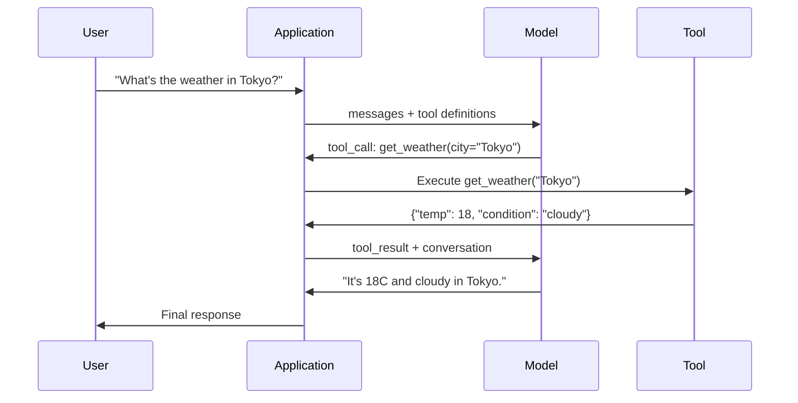

# 함수 호출 및 도구 사용

> LLM은 아무것도 할 수 없습니다. 텍스트를 생성할 뿐입니다. 이것이 유일한 기능입니다. 날씨를 확인하거나, 데이터베이스를 조회하거나, 이메일을 보내거나, 코드를 실행하거나, 파일을 읽을 수 없습니다. 지금까지 본 모든 "AI 에이전트"는 LLM이 어떤 함수를 호출해야 하는지 나타내는 JSON을 생성하고, 이후 코드가 실제로 그 함수를 호출하는 구조입니다. 모델은 뇌이고, 도구는 손이며, 함수 호출은 이 둘을 연결하는 신경계입니다.

**유형:** Build
**언어:** Python
**선수 요건:** 11단계 03강 (구조화된 출력)
**시간:** 약 75분

**관련:** 11단계 · 14강 (모델 컨텍스트 프로토콜) — 도구가 여러 호스트에서 공유될 경우, 인라인 함수 호출에서 MCP 서버로 전환하세요. 이 강의는 인라인 케이스를 다루며, MCP는 프로토콜 케이스를 다룹니다.

## 학습 목표

- 함수 호출 루프를 구현하세요: 도구 스키마를 정의하고, 모델의 도구 호출 JSON을 파싱하며, 함수를 실행하고, 결과를 반환하세요
- 모델이 신뢰할 수 있게 호출할 수 있도록 명확한 설명과 타입이 지정된 매개변수를 가진 도구 스키마를 설계하세요
- 복잡한 쿼리에 답하기 위해 여러 함수 호출을 연결하는 다중 턴 에이전트 루프를 구축하세요
- 함수 호출의 엣지 케이스를 처리하세요: 병렬 도구 호출, 오류 전파, 그리고 무한 도구 루프 방지

## 문제점

채팅봇을 구축합니다. 사용자가 "지금 도쿄의 날씨는 어때요?"라고 묻습니다.

모델은 "실시간 날씨 데이터에 접근할 수 없지만, 계절을 고려하면 도쿄는 약 15도 Celsius일 가능성이 높습니다..."라고 응답합니다.

이는 면책 조항으로 포장된 환각입니다. 모델은 날씨를 알지 못합니다. 영원히 알지 못할 것입니다. 날씨는 매시간 변합니다. 모델의 학습 데이터는 몇 달 전 것입니다.

정답은 OpenWeatherMap API를 호출하여 현재 온도를 가져오고, 실제 숫자를 반환하는 것입니다. 모델은 API를 호출할 수 없습니다. 코드는 할 수 있습니다. 빠진 조각은 모델이 "이 인자로 날씨 API를 호출해야 합니다"라고 말하고, 코드가 이를 실행하여 결과를 다시 피드백할 수 있게 하는 구조화된 프로토콜입니다.

이것이 함수 호출입니다. 모델은 어떤 함수를 어떤 인수로 호출할지 설명하는 구조화된 JSON을 출력합니다. 애플리케이션이 함수를 실행합니다. 결과가 대화로 돌아갑니다. 모델은 결과를 사용하여 최종 답변을 생성합니다.

함수 호출이 없으면 LLM은 백과사전일 뿐입니다. 함수 호출이 있으면 에이전트가 됩니다.

## 개념

### 함수 호출 루프

모든 도구 사용 상호작용은 동일한 5단계 루프를 따릅니다.



1단계: 사용자가 메시지를 보냅니다. 2단계: 모델은 도구 정의(사용 가능한 함수를 설명하는 JSON Schema)와 함께 메시지를 받습니다. 3단계: 모델은 텍스트로 응답하는 대신 도구 호출을 출력합니다. 이는 함수 이름과 인수를 포함하는 구조화된 JSON 객체입니다. 4단계: 코드가 함수를 실행하고 결과를 캡처합니다. 5단계: 결과가 모델로 돌아가고, 모델은 이제 실제 데이터를 사용하여 최종 답변을 생성합니다.

모델은 아무것도 실행하지 않습니다. 무엇을 호출할지, 어떤 인수를 사용할지 결정할 뿐입니다. 코드가 실행자입니다.

### 도구 정의: JSON Schema 계약

각 도구는 모델에게 함수가 무엇을 하는지, 어떤 인수를 받는지, 그 인수가 어떤 타입이어야 하는지 알려주는 JSON Schema로 정의됩니다.

```json
{
  "type": "function",
  "function": {
    "name": "get_weather",
    "description": "Get current weather for a city. Returns temperature in Celsius and conditions.",
    "parameters": {
      "type": "object",
      "properties": {
        "city": {
          "type": "string",
          "description": "City name, e.g. 'Tokyo' or 'San Francisco'"
        },
        "units": {
          "type": "string",
          "enum": ["celsius", "fahrenheit"],
          "description": "Temperature units"
        }
      },
      "required": ["city"]
    }
  }
}
```

`description` 필드가 중요합니다. 모델은 이 필드를 읽어 도구를 언제, 어떻게 사용할지 결정합니다. "날씨를 가져옴" 같은 모호한 설명은 "도시의 현재 날씨를 가져옴. 섭씨 온도와 조건을 반환함."보다 도구 선택이 더 나빠집니다. 설명은 도구 선택을 위한 프롬프트입니다.

### 제공자 비교

모든 주요 제공자가 함수 호출을 지원하지만, API 표면이 다릅니다.

| 제공자 | API 매개변수 | 도구 호출 형식 | 병렬 호출 | 강제 호출 |
|----------|--------------|-----------------|---------------|----------------|
| OpenAI (GPT-5, o4) | `tools` | `tool_calls[].function` | 예 (턴당 여러 개) | `tool_choice="required"` |
| Anthropic (Claude 4.6/4.7) | `tools` | `content[].type="tool_use"` | 예 (여러 블록) | `tool_choice={"type":"any"}` |
| Google (Gemini 3) | `function_declarations` | `functionCall` | 예 | `function_calling_config` |
| 오픈 웨이트 (Llama 4, Qwen3, DeepSeek-V3) | Llama 4의 네이티브 `tools`; 기타는 Hermes 또는 ChatML | 혼합 | 모델에 따라 다름 | 프롬프트 기반 또는 지원 시 `tool_choice` |

2026년까지 세 개의 폐쇄형 제공업체는 거의 동일한 JSON-Schema 기반 형식으로 수렴했습니다. Llama 4는 OpenAI의 형식과 일치하는 네이티브 `tools` 필드를 제공합니다. 오픈 웨이트 미세 조정은 여전히 다양합니다 — Hermes 형식(NousResearch)은 서드파티 미세 조정에서 가장 흔합니다. 호스트 간에 도구를 공유할 때는 인라인 함수 호출보다 MCP(11단계 · 14강)를 선호하세요 — 서버는 모두 동일합니다.

### 도구 선택: Auto, Required, Specific

모델이 언제 도구를 사용하는지 제어할 수 있습니다.

**Auto** (기본값): 모델이 도구를 호출할지 직접 응답할지 결정합니다. "2+2는 얼마인가요?" -- 직접 응답합니다. "날씨가 어떤가요?" -- 도구를 호출합니다.

**Required**: 모델은 최소한 하나의 도구를 호출해야 합니다. 사용자의 의도가 도구를 필요로 할 때 사용하세요. 모델이 실제 데이터를 조회하는 대신 추측하는 것을 방지합니다.

**Specific function**: 모델이 특정 함수를 호출하도록 강제합니다. `tool_choice={"type":"function", "function": {"name": "get_weather"}}`는 쿼리에 관계없이 날씨 도구가 호출되도록 보장합니다. 라우팅에 사용하세요 — 상류 로직이 이미 필요한 도구를 결정했을 때.

### 병렬 함수 호출

GPT-4o와 Claude는 한 턴에서 여러 함수를 호출할 수 있습니다. 사용자가 "도쿄와 뉴욕의 날씨가 어떤가요?"라고 묻습니다. 모델은 두 개의 도구 호출을 동시에 출력합니다:

```json
[
  {"name": "get_weather", "arguments": {"city": "Tokyo"}},
  {"name": "get_weather", "arguments": {"city": "New York"}}
]
```

코드가 두 호출을 모두 실행하고(이상적으로는 동시 실행), 두 결과를 반환하면 모델이 단일 응답을 종합합니다. 이는 왕복 횟수를 2에서 1로 줄입니다. 쿼리당 5-10개의 도구 호출이 있는 에이전트의 경우, 병렬 호출은 지연 시간을 60-80% 줄입니다.

### 구조화된 출력 vs 함수 호출

03강에서는 구조화된 출력을 다루었습니다. 함수 호출은 같은 JSON Schema 메커니즘을 사용하지만, 목적은 다릅니다.

**구조화된 출력**: 모델이 특정 형식으로 데이터를 생성하도록 강제합니다. 출력은 최종 산출물입니다. 예: 텍스트에서 제품 정보를 `{name, price, in_stock}`로 추출합니다.

**함수 호출**: 모델은 행동을 실행하려는 의도를 선언합니다. 출력은 중간 단계입니다. 예: `get_weather(city="Tokyo")` -- 모델은 행동을 요청하는 것이지, 최종 답변을 생성하는 것이 아닙니다.

데이터 추출을 원할 때는 구조화된 출력을 사용하세요. 모델이 외부 시스템과 상호작용하길 원할 때는 함수 호출을 사용하세요.

### 보안: 절대 타협할 수 없는 규칙

함수 호출(Function Calling)은 LLM (대규모 언어 모델)(LLM (Large Language Model))에 부여할 수 있는 가장 위험한 기능입니다. 모델이 무엇을 실행할지 선택합니다. 도구 세트에 데이터베이스 쿼리가 포함되면 모델이 쿼리를 생성합니다. 셸 명령이 포함되면 모델이 이를 작성합니다.

**규칙 1: 모델이 생성한 SQL을 직접 데이터베이스에 전달하지 마세요.** 모델은 DROP TABLE, UNION 인젝션, 모든 행을 반환하는 쿼리를 생성할 수 있으며 실제로 생성합니다. 항상 매개변수화(Parameterize)하세요. 항상 검증하세요. 항상 연산 허용 목록(Allowlist)을 사용하세요.

**규칙 2: 함수 허용 목록(Allowlist)을 지정하세요.** 모델은 사용자가 명시적으로 정의한 함수만 호출할 수 있습니다. "이름으로 임의의 함수를 실행"하는 범용 도구를 절대 만들지 마세요. 내부 함수가 50개라면 사용자가 필요한 5개만 노출하세요.

**규칙 3: 인자를 검증하세요.** 모델이 `"; DROP TABLE users; --"`와 같은 도시 이름을 전달할 수 있습니다. 실행 전에 모든 인자를 예상된 타입, 범위, 형식과 대조하여 검증하세요.

**규칙 4: 도구 결과를 정화(Sanitize)하세요.** 도구가 민감한 데이터(API 키, 개인 식별 정보(PII), 내부 오류)를 반환하면 모델에 다시 보내기 전에 필터링하세요. 모델은 도구 결과를 응답에 원문 그대로 포함합니다.

**규칙 5: 도구 호출에 속도 제한(Rate Limit)을 설정하세요.** 루프에 갇힌 모델은 도구를 수백 번 호출할 수 있습니다. 최대값을 설정하세요 (대화당 10-20회 호출이 적당합니다). 무한 루프를 끊으세요.

### 오류 처리

도구는 실패합니다. API는 시간 초과(Time out)됩니다. 데이터베이스는 다운됩니다. 파일이 존재하지 않습니다. 모델은 도구가 언제, 왜 실패하는지 알아야 합니다.

예외가 아닌 구조화된 도구 결과로 오류를 반환하세요:

```json
{
  "error": true,
  "message": "City 'Toky' not found. Did you mean 'Tokyo'?",
  "code": "CITY_NOT_FOUND"
}
```

모델은 이를 읽고 인자를 조정하며 재시도합니다. 모델은 구조화된 오류 메시지로부터 스스로 수정하는 데 능숙합니다. 빈 응답이나 일반적인 "무언가 잘못되었습니다" 오류로부터 복구하는 데는 서투릅니다.

### MCP (모델 컨텍스트 프로토콜)(MCP (Model Context Protocol))

MCP (모델 컨텍스트 프로토콜)(MCP (Model Context Protocol))는 Anthropic의 도구 상호 운용성을 위한 개방 표준입니다. 모든 애플리케이션이 자체 도구를 정의하는 대신, MCP는 범용 프로토콜을 제공합니다: 도구는 MCP 서버가 서빙하고, MCP 클라이언트(Claude Code, Cursor, 또는 사용자의 애플리케이션 등)가 소비합니다.

하나의 MCP 서버는 호환되는 모든 클라이언트에 도구를 노출할 수 있습니다. Postgres MCP 서버는 MCP 호환 에이전트(Agent)에 데이터베이스 접근 권한을 제공합니다. GitHub MCP 서버는 모든 에이전트(Agent)에 저장소 접근 권한을 제공합니다. 도구는 한 번만 정의하면 어디서나 사용할 수 있습니다.

MCP는 함수 호출(Function Calling)에서 HTTP가 네트워킹에서 하는 역할을 수행합니다. 전송 계층을 표준화하여 도구를 이식 가능하게 만듭니다.

```figure
mx-tool-call-loop
```

## 구현하기

### 1단계: 도구 레지스트리 정의하기

도구 정의와 구현을 저장하는 레지스트리를 구축하세요. 각 도구는 JSON Schema 정의(모델이 보는 부분)와 Python 함수(코드가 실행하는 부분)를 가집니다.

```python
import ast
import json
import math
import time
import hashlib


TOOL_REGISTRY = {}


def register_tool(name, description, parameters, function):
    TOOL_REGISTRY[name] = {
        "definition": {
            "type": "function",
            "function": {
                "name": name,
                "description": description,
                "parameters": parameters,
            },
        },
        "function": function,
    }
```

### 2단계: 5개 도구 구현하기

계산기, 날씨 조회, 웹 검색 시뮬레이터, 파일 리더, 코드 실행기를 구축하세요.

```python
def calculator(expression, precision=2):
    allowed = set("0123456789+-*/.() ")
    if not all(c in allowed for c in expression):
        return {"error": True, "message": f"Invalid characters in expression: {expression}"}
    try:
        result = eval(expression, {"__builtins__": {}}, {"math": math})
        return {"result": round(float(result), precision), "expression": expression}
    except Exception as e:
        return {"error": True, "message": str(e)}


WEATHER_DB = {
    "tokyo": {"temp_c": 18, "condition": "cloudy", "humidity": 72, "wind_kph": 14},
    "new york": {"temp_c": 22, "condition": "sunny", "humidity": 45, "wind_kph": 8},
    "london": {"temp_c": 12, "condition": "rainy", "humidity": 88, "wind_kph": 22},
    "san francisco": {"temp_c": 16, "condition": "foggy", "humidity": 80, "wind_kph": 18},
    "sydney": {"temp_c": 25, "condition": "sunny", "humidity": 55, "wind_kph": 10},
}


def get_weather(city, units="celsius"):
    key = city.lower().strip()
    if key not in WEATHER_DB:
        suggestions = [c for c in WEATHER_DB if c.startswith(key[:3])]
        return {
            "error": True,
            "message": f"City '{city}' not found.",
            "suggestions": suggestions,
            "code": "CITY_NOT_FOUND",
        }
    data = WEATHER_DB[key].copy()
    if units == "fahrenheit":
        data["temp_f"] = round(data["temp_c"] * 9 / 5 + 32, 1)
        del data["temp_c"]
    data["city"] = city
    return data


SEARCH_DB = {
    "python function calling": [
        {"title": "OpenAI Function Calling Guide", "url": "https://platform.openai.com/docs/guides/function-calling", "snippet": "Learn how to connect LLMs to external tools."},
        {"title": "Anthropic Tool Use", "url": "https://docs.anthropic.com/en/docs/tool-use", "snippet": "Claude can interact with external tools and APIs."},
    ],
    "MCP protocol": [
        {"title": "Model Context Protocol", "url": "https://modelcontextprotocol.io", "snippet": "An open standard for connecting AI models to data sources."},
    ],
    "weather API": [
        {"title": "OpenWeatherMap API", "url": "https://openweathermap.org/api", "snippet": "Free weather API with current, forecast, and historical data."},
    ],
}


def web_search(query, max_results=3):
    key = query.lower().strip()
    for db_key, results in SEARCH_DB.items():
        if db_key in key or key in db_key:
            return {"query": query, "results": results[:max_results], "total": len(results)}
    return {"query": query, "results": [], "total": 0}


FILE_SYSTEM = {
    "data/config.json": '{"model": "gpt-4o", "temperature": 0.7, "max_tokens": 4096}',
    "data/users.csv": "name,email,role\nAlice,alice@example.com,admin\nBob,bob@example.com,user",
    "README.md": "# My Project\nA tool-use agent built from scratch.",
}


def read_file(path):
    if ".." in path or path.startswith("/"):
        return {"error": True, "message": "Path traversal not allowed.", "code": "FORBIDDEN"}
    if path not in FILE_SYSTEM:
        available = list(FILE_SYSTEM.keys())
        return {"error": True, "message": f"File '{path}' not found.", "available_files": available, "code": "NOT_FOUND"}
    content = FILE_SYSTEM[path]
    return {"path": path, "content": content, "size_bytes": len(content), "lines": content.count("\n") + 1}


def run_code(code, language="python"):
    if language != "python":
        return {"error": True, "message": f"Language '{language}' not supported. Only 'python' is available."}
    try:
        tree = ast.parse(code)
    except SyntaxError as e:
        return {"error": True, "message": f"SyntaxError: {e}", "code": "SYNTAX_ERROR"}
    unsafe_names = {"exec", "eval", "compile", "__import__", "open", "globals", "locals", "vars", "getattr", "setattr", "delattr"}
    for node in ast.walk(tree):
        if isinstance(node, (ast.Import, ast.ImportFrom)):
            return {"error": True, "message": "Forbidden operation: import is not allowed", "code": "SECURITY_VIOLATION"}
        if isinstance(node, ast.Attribute) and node.attr.startswith("__") and node.attr.endswith("__"):
            return {"error": True, "message": "Forbidden operation: dunder attribute access is not allowed", "code": "SECURITY_VIOLATION"}
        if isinstance(node, ast.Name) and node.id in unsafe_names:
            return {"error": True, "message": f"Forbidden operation: {node.id} is not allowed", "code": "SECURITY_VIOLATION"}
    try:
        local_vars = {}
        exec(code, {"__builtins__": {"print": print, "range": range, "len": len, "str": str, "int": int, "float": float, "list": list, "dict": dict, "sum": sum, "min": min, "max": max, "abs": abs, "round": round, "sorted": sorted, "enumerate": enumerate, "zip": zip, "map": map, "filter": filter, "math": math}}, local_vars)
        result = local_vars.get("result", None)
        return {"success": True, "result": result, "variables": {k: str(v) for k, v in local_vars.items() if not k.startswith("_")}}
    except Exception as e:
        return {"error": True, "message": f"{type(e).__name__}: {e}"}
```

부분 문자열 차단 목록은 코드를 텍스트로 읽기 때문에 문자열 매칭이 문자 그대로 표기하지 않는 모든 것을 놓칩니다. 코드를 구문 트리로 파싱하고 순회하면 가드레일(Guardrails)이 `import` 문장, 듀너 속성 접근(실제 인터프리터로 돌아가는 `__class__` 및 `__globals__` 체인), 그리고 unsafe 내장 이름을 표기가 아닌 구조에 따라 거부할 수 있습니다. 그럼에도 불구하고, 이를 실제 경계가 아닌 교육용 필터로 취급하세요. 프로세스 내 가드레일(Guardrails)은 실행하는 코드와 인터프리터를 공유하며, 결심한 호출자는 여전히 도달 가능한 객체를 찾을 수 있습니다. 프로덕션 시스템은 신뢰할 수 없는 코드를 별도 프로세스나 컨테이너(권한이 낮아진 하위 프로세스, gVisor, Firecracker, 또는 호스팅된 코드 실행기)에서 실행하며, 탈출 시 공격자는 일회용 샌드박스(Sandbox)에 갇히게 되며 서비스 자체는 안전합니다.

### 3단계: 모든 도구 등록하기

```python
def register_all_tools():
    register_tool(
        "calculator", "Evaluate a mathematical expression. Supports +, -, *, /, parentheses, and decimals. Returns the numeric result.",
        {"type": "object", "properties": {"expression": {"type": "string", "description": "Math expression, e.g. '(10 + 5) * 3'"}, "precision": {"type": "integer", "description": "Decimal places in result", "default": 2}}, "required": ["expression"]},
        calculator,
    )
    register_tool(
        "get_weather", "Get current weather for a city. Returns temperature, condition, humidity, and wind speed.",
        {"type": "object", "properties": {"city": {"type": "string", "description": "City name, e.g. 'Tokyo' or 'San Francisco'"}, "units": {"type": "string", "enum": ["celsius", "fahrenheit"], "description": "Temperature units, defaults to celsius"}}, "required": ["city"]},
        get_weather,
    )
    register_tool(
        "web_search", "Search the web for information. Returns a list of results with title, URL, and snippet.",
        {"type": "object", "properties": {"query": {"type": "string", "description": "Search query"}, "max_results": {"type": "integer", "description": "Maximum results to return", "default": 3}}, "required": ["query"]},
        web_search,
    )
    register_tool(
        "read_file", "Read the contents of a file. Returns the file content, size, and line count.",
        {"type": "object", "properties": {"path": {"type": "string", "description": "Relative file path, e.g. 'data/config.json'"}}, "required": ["path"]},
        read_file,
    )
    register_tool(
        "run_code", "Run a small Python snippet behind a static-analysis guard and a restricted interpreter. This is a teaching filter, not real isolation. Set a 'result' variable to return output.",
        {"type": "object", "properties": {"code": {"type": "string", "description": "Python code to execute"}, "language": {"type": "string", "enum": ["python"], "description": "Programming language"}}, "required": ["code"]},
        run_code,
    )
```

### 4단계: 함수 호출(Function Calling) 루프 구축하기

이것이 핵심 엔진입니다. 모델이 어떤 도구를 호출할지 결정하는 것을 시뮬레이션하고, 도구를 실행하며, 결과를 피드백합니다.

```python
def simulate_model_decision(user_message, tools, conversation_history):
    msg = user_message.lower()

    if any(word in msg for word in ["weather", "temperature", "forecast"]):
        cities = []
        for city in WEATHER_DB:
            if city in msg:
                cities.append(city)
        if not cities:
            for word in msg.split():
                if word.capitalize() in [c.title() for c in WEATHER_DB]:
                    cities.append(word)
        if not cities:
            cities = ["tokyo"]
        calls = []
        for city in cities:
            calls.append({"name": "get_weather", "arguments": {"city": city.title()}})
        return calls

    if any(word in msg for word in ["calculate", "compute", "math", "what is", "how much"]):
        for token in msg.split():
            if any(c in token for c in "+-*/"):
                return [{"name": "calculator", "arguments": {"expression": token}}]
        if "+" in msg or "-" in msg or "*" in msg or "/" in msg:
            expr = "".join(c for c in msg if c in "0123456789+-*/.() ")
            if expr.strip():
                return [{"name": "calculator", "arguments": {"expression": expr.strip()}}]
        return [{"name": "calculator", "arguments": {"expression": "0"}}]

    if any(word in msg for word in ["search", "find", "look up", "google"]):
        query = msg.replace("search for", "").replace("look up", "").replace("find", "").strip()
        return [{"name": "web_search", "arguments": {"query": query}}]

    if any(word in msg for word in ["read", "file", "open", "cat", "show"]):
        for path in FILE_SYSTEM:
            if path.split("/")[-1].split(".")[0] in msg:
                return [{"name": "read_file", "arguments": {"path": path}}]
        return [{"name": "read_file", "arguments": {"path": "README.md"}}]

    if any(word in msg for word in ["run", "execute", "code", "python"]):
        return [{"name": "run_code", "arguments": {"code": "result = 'Hello from the sandbox!'", "language": "python"}}]

    return []


def execute_tool_call(tool_call):
    name = tool_call["name"]
    args = tool_call["arguments"]

    if name not in TOOL_REGISTRY:
        return {"error": True, "message": f"Unknown tool: {name}", "code": "UNKNOWN_TOOL"}

    tool = TOOL_REGISTRY[name]
    func = tool["function"]
    start = time.time()

    try:
        result = func(**args)
    except TypeError as e:
        result = {"error": True, "message": f"Invalid arguments: {e}"}

    elapsed_ms = round((time.time() - start) * 1000, 2)
    return {"tool": name, "result": result, "execution_time_ms": elapsed_ms}


def run_function_calling_loop(user_message, max_iterations=5):
    conversation = [{"role": "user", "content": user_message}]
    tool_definitions = [t["definition"] for t in TOOL_REGISTRY.values()]
    all_tool_results = []

    for iteration in range(max_iterations):
        tool_calls = simulate_model_decision(user_message, tool_definitions, conversation)

        if not tool_calls:
            break

        results = []
        for call in tool_calls:
            result = execute_tool_call(call)
            results.append(result)

        conversation.append({"role": "assistant", "content": None, "tool_calls": tool_calls})

        for result in results:
            conversation.append({"role": "tool", "content": json.dumps(result["result"]), "tool_name": result["tool"]})

        all_tool_results.extend(results)
        break

    return {"conversation": conversation, "tool_results": all_tool_results, "iterations": iteration + 1 if tool_calls else 0}
```

### 5단계: 인자 검증하기

실행 전에 JSON Schema와 비교하여 도구 호출 인자를 검사하는 검증기를 구축하세요.

```python
def validate_tool_arguments(tool_name, arguments):
    if tool_name not in TOOL_REGISTRY:
        return [f"Unknown tool: {tool_name}"]

    schema = TOOL_REGISTRY[tool_name]["definition"]["function"]["parameters"]
    errors = []

    if not isinstance(arguments, dict):
        return [f"Arguments must be an object, got {type(arguments).__name__}"]

    for required_field in schema.get("required", []):
        if required_field not in arguments:
            errors.append(f"Missing required argument: {required_field}")

    properties = schema.get("properties", {})
    for arg_name, arg_value in arguments.items():
        if arg_name not in properties:
            errors.append(f"Unknown argument: {arg_name}")
            continue

        prop_schema = properties[arg_name]
        expected_type = prop_schema.get("type")

        type_checks = {"string": str, "integer": int, "number": (int, float), "boolean": bool, "array": list, "object": dict}
        if expected_type in type_checks:
            if not isinstance(arg_value, type_checks[expected_type]):
                errors.append(f"Argument '{arg_name}': expected {expected_type}, got {type(arg_value).__name__}")

        if "enum" in prop_schema and arg_value not in prop_schema["enum"]:
            errors.append(f"Argument '{arg_name}': '{arg_value}' not in {prop_schema['enum']}")

    return errors
```

### 6단계: 데모 실행하기

```python
def run_demo():
    register_all_tools()

    print("=" * 60)
    print("  Function Calling & Tool Use Demo")
    print("=" * 60)

    print("\n--- Registered Tools ---")
    for name, tool in TOOL_REGISTRY.items():
        desc = tool["definition"]["function"]["description"][:60]
        params = list(tool["definition"]["function"]["parameters"].get("properties", {}).keys())
        print(f"  {name}: {desc}...")
        print(f"    params: {params}")

    print(f"\n--- Argument Validation ---")
    validation_tests = [
        ("get_weather", {"city": "Tokyo"}, "Valid call"),
        ("get_weather", {}, "Missing required arg"),
        ("get_weather", {"city": "Tokyo", "units": "kelvin"}, "Invalid enum value"),
        ("calculator", {"expression": 123}, "Wrong type (int for string)"),
        ("unknown_tool", {"x": 1}, "Unknown tool"),
    ]
    for tool_name, args, label in validation_tests:
        errors = validate_tool_arguments(tool_name, args)
        status = "VALID" if not errors else f"ERRORS: {errors}"
        print(f"  {label}: {status}")

    print(f"\n--- Tool Execution ---")
    direct_tests = [
        {"name": "calculator", "arguments": {"expression": "(10 + 5) * 3 / 2"}},
        {"name": "get_weather", "arguments": {"city": "Tokyo"}},
        {"name": "get_weather", "arguments": {"city": "Mars"}},
        {"name": "web_search", "arguments": {"query": "python function calling"}},
        {"name": "read_file", "arguments": {"path": "data/config.json"}},
        {"name": "read_file", "arguments": {"path": "../etc/passwd"}},
        {"name": "run_code", "arguments": {"code": "result = sum(range(1, 101))"}},
        {"name": "run_code", "arguments": {"code": "import os; os.system('rm -rf /')"}},
    ]
    for call in direct_tests:
        result = execute_tool_call(call)
        print(f"\n  {call['name']}({json.dumps(call['arguments'])})")
        print(f"    -> {json.dumps(result['result'], indent=None)[:100]}")
        print(f"    time: {result['execution_time_ms']}ms")

    print(f"\n--- Full Function Calling Loop ---")
    test_queries = [
        "What's the weather in Tokyo?",
        "Calculate (100 + 250) * 0.15",
        "Search for MCP protocol",
        "Read the config file",
        "Run some Python code",
        "Tell me a joke",
    ]
    for query in test_queries:
        print(f"\n  User: {query}")
        result = run_function_calling_loop(query)
        if result["tool_results"]:
            for tr in result["tool_results"]:
                print(f"    Tool: {tr['tool']} ({tr['execution_time_ms']}ms)")
                print(f"    Result: {json.dumps(tr['result'], indent=None)[:90]}")
        else:
            print(f"    [No tool called -- direct response]")
        print(f"    Iterations: {result['iterations']}")

    print(f"\n--- Parallel Tool Calls ---")
    multi_city_query = "What's the weather in tokyo and london?"
    print(f"  User: {multi_city_query}")
    result = run_function_calling_loop(multi_city_query)
    print(f"  Tool calls made: {len(result['tool_results'])}")
    for tr in result["tool_results"]:
        city = tr["result"].get("city", "unknown")
        temp = tr["result"].get("temp_c", "N/A")
        print(f"    {city}: {temp}C, {tr['result'].get('condition', 'N/A')}")

    print(f"\n--- Security Checks ---")
    security_tests = [
        ("read_file", {"path": "../../etc/passwd"}),
        ("run_code", {"code": "import subprocess; subprocess.run(['ls'])"}),
        ("calculator", {"expression": "__import__('os').system('ls')"}),
    ]
    for tool_name, args in security_tests:
        result = execute_tool_call({"name": tool_name, "arguments": args})
        blocked = result["result"].get("error", False)
        print(f"  {tool_name}({list(args.values())[0][:40]}): {'BLOCKED' if blocked else 'ALLOWED'}")
```

## 사용하기

### OpenAI 함수 호출(Function Calling)

```python
# from openai import OpenAI
#
# client = OpenAI()
#
# tools = [
#     "type": "function",
#     "function": {
#         "name": "get_weather",
#         "description": "도시의 현재 날씨를 가져오기",
#         "parameters": {
#             "type": "object",
#             "properties": {
#                 "city": {"type": "string"},
#                 "units": {"type": "string", "enum": ["celsius", "fahrenheit"]}
#             },
#             "required": ["city"]
#         }
#     }
# }]
#
# response = client.chat.completions.create(
#     model="gpt-4o",
#     messages=[{"role": "user", "content": "Weather in Tokyo?"}],
#     tools=tools,
#     tool_choice="auto",
# )
#
# tool_call = response.choices[0].message.tool_calls[0]
# args = json.loads(tool_call.function.arguments)
# result = get_weather(**args)
#
# final = client.chat.completions.create(
#     model="gpt-4o",
#     messages=[
#         {"role": "user", "content": "Weather in Tokyo?"},
#         response.choices[0].message,
#         {"role": "tool", "tool_call_id": tool_call.id, "content": json.dumps(result)},
#     ],
# )
# print(final.choices[0].message.content)
```

OpenAI는 도구 호출을 `response.choices[0].message.tool_calls`으로 반환합니다. 각 호출에는 결과를 반환할 때 반드시 포함해야 하는 `id`이 있습니다. 모델은 이 ID를 사용하여 결과를 호출과 매칭합니다. GPT-4o는 단일 응답에서 여러 도구 호출을 반환할 수 있으므로, 반복하여 모두 실행해 보세요.

### Anthropic 도구 사용

```python
# import anthropic
#
# client = anthropic.Anthropic()
#
# response = client.messages.create(
#     model="claude-sonnet-5",
#     max_tokens=1024,
#     tools=[{
#         "name": "get_weather",
#         "description": "도시의 현재 날씨를 가져오기",
#         "input_schema": {
#             "type": "object",
#             "properties": {
#                 "city": {"type": "string"},
#                 "units": {"type": "string", "enum": ["celsius", "fahrenheit"]}
#             },
#             "required": ["city"]
#         }
#     }],
#     messages=[{"role": "user", "content": "Weather in Tokyo?"}],
# )
#
# tool_block = next(b for b in response.content if b.type == "tool_use")
# result = get_weather(**tool_block.input)
#
# final = client.messages.create(
#     model="claude-sonnet-5",
#     max_tokens=1024,
#     tools=[...],
#     messages=[
#         {"role": "user", "content": "Weather in Tokyo?"},
#         {"role": "assistant", "content": response.content},
#         {"role": "user", "content": [{"type": "tool_result", "tool_use_id": tool_block.id, "content": json.dumps(result)}]},
#     ],
# )
```

Anthropic은 `type: "tool_use"`을 사용하여 도구 호출을 콘텐츠 블록으로 반환합니다. 도구 결과는 `type: "tool_result"`을 포함하는 사용자 메시지에 들어갑니다. 주요 차이점을 주의하세요: Anthropic은 도구 매개변수 정의에 `input_schema`을 사용하지만, OpenAI는 `parameters`을 사용합니다.

### MCP 통합

```python
# MCP 서버는 표준화된 프로토콜을 통해 도구를 노출합니다.
# MCP 호환 클라이언트는 이러한 도구를 발견하고 호출할 수 있습니다.
#
# 예시: Postgres MCP 서버에 연결하기
#
# from mcp import ClientSession, StdioServerParameters
# from mcp.client.stdio import stdio_client
#
# server_params = StdioServerParameters(
#     command="npx",
#     args=["-y", "@modelcontextprotocol/server-postgres", "postgresql://localhost/mydb"],
# )
#
# async with stdio_client(server_params) as (read, write):
#     async with ClientSession(read, write) as session:
#         await session.initialize()
#         tools = await session.list_tools()
#         result = await session.call_tool("query", {"sql": "SELECT count(*) FROM users"})
```

MCP는 도구 구현과 도구 소비를 분리합니다. Postgres 서버는 SQL을 알고 있습니다. GitHub 서버는 API를 알고 있습니다. 에이전트(Agent)는 도구를 발견하고 호출하기만 하면 되며, 각 통합에 대해 공급자별 코드가 필요하지 않습니다.

## 출시하기

이 강의는 `outputs/prompt-tool-designer.md`를 생성합니다. 이는 도구 정의를 설계하기 위한 재사용 가능한 프롬프트 템플릿입니다. 도구가 수행해야 할 작업에 대한 설명을 입력하면, 설명, 타입, 제약 조건을 포함한 완전한 JSON Schema 정의가 생성됩니다.

또한 `outputs/skill-function-calling-patterns.md`를 생성합니다. 이는 프로덕션 환경에서 함수 호출을 구현하기 위한 결정 프레임워크로, 도구 설계, 오류 처리, 보안, 공급자별 패턴을 다룹니다.

## 연습 문제

1. **6번째 도구 추가: 데이터베이스 쿼리.** 메모리 내 테이블을 사용하는 시뮬레이션된 SQL 도구를 구현하세요. 이 도구는 테이블 이름과 필터 조건(원시 SQL이 아님)을 입력으로 받습니다. 테이블 이름이 허용 목록에 있는지, 필터 연산자가 `=`, `>`, `<`, `>=`, `<=`로 제한되는지 검증하세요. 일치하는 행을 JSON으로 반환하세요.

2. **오류 피드백을 포함한 재시도 구현.** 도구 호출이 실패했을 때(예: 도시를 찾을 수 없음), 오류 메시지를 모델 결정 함수로 되돌려 보내 인수를 수정하도록 하세요. 각 호출이 몇 번의 재시도를 거치는지 추적하세요. 도구 호출당 최대 재시도 횟수를 3회로 설정하세요.

3. **다단계 에이전트(Agent) 구축.** 일부 쿼리는 도구 호출의 체이닝을 필요로 합니다: "설정 파일을 읽고 어떤 모델이 구성되어 있는지 알려준 후, 그 모델의 가격을 웹에서 검색하세요." 모델이 더 이상 도구가 필요 없다고 결정할 때까지 반복하는 루프를 구현하고, 누적된 결과를 각 결정 단계로 전달하세요. 무한 루프를 방지하기 위해 반복 횟수를 10회로 제한하세요.

4. **도구 선택 정확도 측정.** 예상 도구 이름이 포함된 30개의 테스트 쿼리를 만드세요. 결정 함수를 30개 쿼리에 모두 실행하고, 올바른 도구를 선택한 비율을 측정하세요. 도구 간 혼동을 가장 많이 유발하는 쿼리를 식별하세요.

5. **도구 호출 캐싱 구현.** 60초 이내에 동일한 인수로 같은 도구가 호출되면, 재실행하지 않고 캐시된 결과를 반환하세요. `(tool_name, frozenset(args.items()))`를 키로 사용하는 사전(dictionary)을 사용하세요. 20개의 쿼리를 포함한 대화에서 캐시 적중률을 측정하세요.

## 핵심 용어

| 용어 | 사람들이 말하는 것 | 실제 의미 |
|------|----------------|----------------------|
| 함수 호출(Function Calling) | "도구 사용" | 모델이 특정 인수를 가진 함수를 호출하도록 구조화된 JSON을 출력합니다 -- 모델이 아니라 코드가 이를 실행합니다 |
| 도구 정의 | "함수 스키마" | 도구의 이름, 목적, 매개변수 및 타입을 설명하는 JSON Schema 객체 -- 모델은 이를 읽어 도구를 언제, 어떻게 사용할지 결정합니다 |
| 도구 선택 | "호출 모드" | 모델이 도구를 반드시 호출해야 하는지(required), 호출할 수 있는지(auto), 또는 특정 도구를 호출해야 하는지(named)를 제어합니다 |
| 병렬 호출 | "다중 도구" | 모델이 한 턴에서 여러 도구 호출을 출력하여 왕복 횟수를 줄입니다 -- GPT-4o와 Claude 모두 이를 지원합니다 |
| 도구 결과 | "함수 출력" | 도구 실행의 반환값으로, 모델에 메시지로서 전송되어 응답에 실제 데이터를 사용할 수 있게 합니다 |
| 인수 검증 | "입력 검사" | 도구 실행 전에 모델이 생성한 인수가 예상되는 타입, 범위 및 제약 조건과 일치하는지 확인합니다 |
| MCP | "도구 프로토콜" | 모델 컨텍스트 프로토콜(Model Context Protocol)(MCP (Model Context Protocol)) -- Anthropic의 개방 표준으로, 호환되는 모든 클라이언트가 발견하고 호출할 수 있는 서버를 통해 도구를 노출합니다 |
| 에이전트 루프 | "ReAct 루프" | 모델이 도구를 결정하고, 코드가 도구를 실행하며, 결과가 피드백되는 반복적인 사이클로, 모델이 응답하기에 충분한 정보를 얻을 때까지 계속됩니다 |
| 도구 오염 | "도구를 통한 프롬프트 주입" | 도구 결과에 모델의 행동을 조작하는 지침이 포함된 공격 -- 모든 도구 출력은 정화(sanitize)해야 합니다 |
| 속도 제한(Rate Limit) | "호출 예산" | 무한 루프와 폭주하는 API 비용을 방지하기 위해 대화당 도구 호출의 최대 수를 설정합니다 |

## 추가 읽기

- [OpenAI Function Calling Guide](https://platform.openai.com/docs/guides/function-calling) -- 병렬 호출, 강제 호출 및 구조화된 인수를 포함하여 GPT-4o의 도구 사용에 대한 결정적인 참고 자료
- [Anthropic Tool Use Guide](https://docs.anthropic.com/en/docs/tool-use) -- input_schema, 다중 도구 응답 및 tool_choice 구성을 포함한 Claude의 도구 사용 구현
- [Model Context Protocol Specification](https://modelcontextprotocol.io) -- 서버/클라이언트 아키텍처를 갖춘 AI 애플리케이션 간 도구 상호 운용성을 위한 개방 표준
- [Schick et al., 2023 -- "Toolformer: Language Models Can Teach Themselves to Use Tools"](https://arxiv.org/abs/2302.04761) -- 외부 도구를 언제, 어떻게 호출할지 결정하도록 LLM을 훈련하는 기초 논문
- [Patil et al., 2023 -- "Gorilla: Large Language Model Connected with Massive APIs"](https://arxiv.org/abs/2305.15334) - 1,645개 API에 걸쳐 환각(Hallucination)을 줄이며 정확한 API 호출을 위해 LLM (대규모 언어 모델)(LLM (Large Language Model))을 미세 조정(Fine-tuning)합니다
- [Berkeley Function Calling Leaderboard](https://gorilla.cs.berkeley.edu/leaderboard.html) - GPT-4o, Claude, Gemini 및 오픈 모델 간 함수 호출(Function Calling) 정확도를 비교하는 실시간 벤치마크입니다
- [Yao et al., "ReAct: Synergizing Reasoning and Acting in Language Models" (ICLR 2023)](https://arxiv.org/abs/2210.03629) - 모든 도구 호출을 둘러싼 외부 에이전트 루프인 Thought-Action-Observation 루프이며, 이 강의가 끝나면 14단계가 이어집니다
- [Anthropic — Building effective agents (Dec 2024)](https://www.anthropic.com/research/building-effective-agents) - 단일 도구 사용 프리미티브로 구축된 5가지 조합 가능한 패턴(프롬프트 체이닝, 라우팅, 병렬화, 오케스트레이터-워커, 평가자-최적화자)입니다
