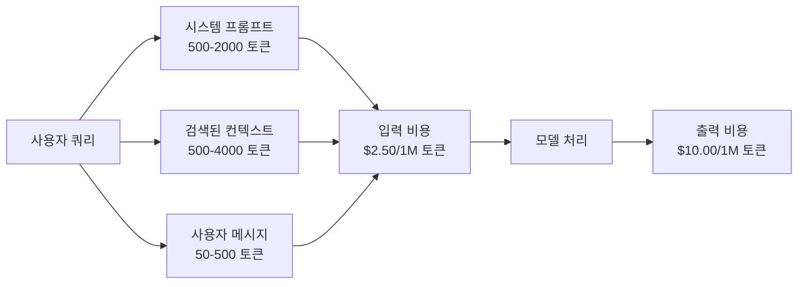
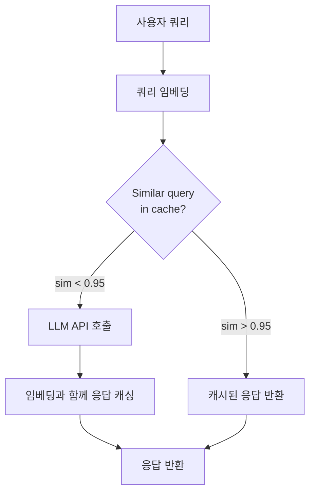
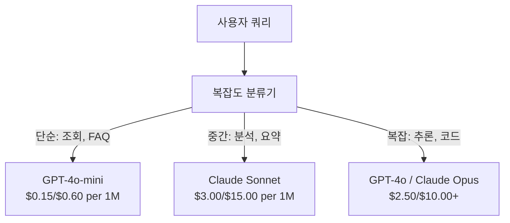

# 캐싱, 속도 제한 및 비용 최적화

> 대부분의 AI 스타트업은 나쁜 모델 때문에 망하지 않습니다. 나쁜 단위 경제학(unit economics) 때문에 망합니다. GPT-4o 호출 한 번은 몇 센트의 일부 비용이 듭니다. 하루에 10번씩 호출하는 사용자 1만 명은 입력 토큰만으로 $250가 들며, 이는 단 한 달러도 청구하기 전의 비용입니다. 생존하는 기업은 모든 API 호출을 함수 호출이 아닌 금융 거래로 취급하는 기업입니다.

**유형:** Build
**언어:** Python
**선수 요건:** 11단계 09강 (함수 호출)
**시간:** 약 45분

**관련:** 11단계 · 15강 (프롬프트 캐싱) — 이 강의는 애플리케이션 계층 캐싱(시맨틱 캐시, 정확 해시 캐시, 모델 라우팅)을 다룹니다. 15강은 제공자 계층 프롬프트 캐싱(Anthropic cache_control, OpenAI 자동, Gemini CachedContent)을 다룹니다. 두 가지를 결합하면 50-95%의 비용 절감을 달성할 수 있습니다.

## 학습 목표

- 반복되거나 유사한 쿼리를 새로운 API 호출 없이 캐시에서 제공하는 시맨틱 캐싱을 구현해 보세요
- 제공자 간 요청별 비용을 계산하고 토큰 인식 속도 제한 및 예산 알림을 구현해 보세요
- 프롬프트 압축, 모델 라우팅(비싼 모델 vs 저렴한 모델), 응답 캐싱을 포함한 비용 최적화 계층을 구축해 보세요
- 정확 일치, 시맨틱 유사성, 접두어 캐싱을 사용하여 쿼리 유형에 따른 계층적 캐싱 전략을 설계해 보세요

## 문제점

RAG 챗봇을 구축했습니다. 잘 작동하고, 사용자들도 좋아합니다.

그러나 청구서가 도착합니다.

GPT-5는 백만 출력 토큰당 $5 per million input tokens and $15입니다. Claude Opus 4.7은 출력 토큰당 $15 input / $75입니다. Gemini 3 Pro는 출력 토큰당 $1.25 input / $5입니다. GPT-5-mini는 $0.25/$2입니다. 아래 가격은 예시이며, 항상 제공자의 최신 가격 페이지를 확인하세요.

스타트업을 죽이는 계산은 다음과 같습니다:

- 일일 활성 사용자 10,000명
- 사용자당 하루 쿼리 10개
- 쿼리당 입력 토큰 1,000개 (시스템 프롬프트 + 컨텍스트 + 사용자 메시지)
- 응답당 출력 토큰 500개

**하루 입력 비용:** 10,000 x 10 x 1,000 / 1,000,000 x $2.50 = **$250/day**
**하루 출력 비용:** 10,000 x 10 x 500 / 1,000,000 x $10.00 = **$500/day**
**월간 총합:** **$22,500/month**

이것은 LLM에만 해당합니다. 임베딩, 벡터 데이터베이스 호스팅, 인프라 비용을 추가해 보세요. 채팅봇의 경우 월 $30,000가 소요됩니다.

가혹한 부분은 이 쿼리의 40-60%가 거의 중복된다는 점입니다. 사용자는 같은 질문을 약간 다른 단어로 반복합니다. 모든 요청에 동일한 시스템 프롬프트가 매번 청구됩니다. RAG (검색 증강 생성)(RAG (Retrieval-Augmented Generation))가 검색한 컨텍스트 문서도 같은 주제에 대해 질문하는 사용자들 사이에서 반복됩니다.

중복된 연산에 대해 전액 비용을 지불하고 있습니다.

## 개념

### LLM 호출의 비용 구조

모든 API 호출에는 다섯 가지 비용 구성 요소가 있습니다.



시스템 프롬프트는 조용한 킬러입니다. 모든 요청에 전송되는 1,500 토큰의 시스템 프롬프트는 변경되지 않는 텍스트에 대해 $3.75 per million requests just for that prefix. At 100K requests per day, that is $375/day -- 월 $11,250 -- 비용을 발생시킵니다.

### 제공자 캐싱: 내장 할인

2026년 현재 세 주요 제공자 모두 제공자 측 프롬프트 캐싱을 제공하지만, 메커니즘은 다릅니다. 11단계 · 15강에서 심층 분석을 확인해 보세요.

| 제공자 | 메커니즘 | 할인 | 최소 | 캐시 지속 시간 |
|----------|-----------|----------|---------|----------------|
| Anthropic | 명시적 cache_control 마커 | 캐시 적중 시 90% (쓰기 시 25% 추가 지불) | 1,024 토큰 (Sonnet/Opus), 2,048 (Haiku) | 기본 5분; 확장 1시간 (쓰기 프리미엄 2배) |
| OpenAI | 자동 접두어 매칭 | 캐시 적중 시 50% | 1,024 토큰 | 최대 1시간까지 최선 노력 |
| Google Gemini | 명시적 CachedContent API | 약 75% 감소 (저장 비용 포함) | 4,096 (Flash) / 32,768 (Pro) | 사용자 설정 TTL |

**Anthropic의 방식**은 명시적입니다. 프롬프트의 섹션을 `cache_control: {"type": "ephemeral"}`로 표시합니다. 첫 요청은 25%의 쓰기 프리미엄을 지불합니다. 동일한 접두어를 가진 후속 요청은 90% 할인을 받습니다. 2,000 토큰 시스템 프롬프트가 캐시 적중 시 $0.005 normally costs $0.000625의 비용이 듭니다. 100K 요청 동안, 이는 하루에 $437.50를 절약합니다.

**OpenAI의 방식**은 자동적입니다. 이전 요청과 일치하는 모든 프롬프트 접두어는 50% 할인을 받습니다. 마커가 필요하지 않습니다. 트레이드오프: 할인율이 낮고, 제어 가능성이 낮지만, 구현 노력은 제로입니다.

### 시맨틱 캐싱: 사용자 정의 레이어

제공자 캐싱은 동일한 접두어에만 작동합니다. 시맨틱 캐싱은 더 어려운 경우를 처리합니다: 동일한 의미를 가진 다른 쿼리들.

"환불 정책은 무엇인가요?"와 "물건을 어떻게 반환하나요?"는 다른 문자열이지만 동일한 의도입니다. 시맨틱 캐시는 두 쿼리를 임베딩하고, 코사인 유사도(Cosine Similarity)를 계산하며, 유사도가 임계값(보통 0.92-0.95)을 초과하면 캐시된 응답을 반환합니다.



임베딩 비용은 무시할 수 있습니다. OpenAI의 text-embedding-3-small은 백만 토큰당 $0.02입니다. 캐시를 확인하는 비용은 전체 LLM 호출과 비교하면 거의 없습니다.

### 정확 캐싱: 해시 및 일치

결정론적 호출(온도=0, 동일한 모델, 동일한 프롬프트)의 경우, 정확 캐싱은 더 단순하고 빠릅니다. 전체 프롬프트를 해시하고, 캐시를 확인하며, 발견되면 반환합니다.

이는 다음에 완벽하게 작동합니다:
- 시스템 프롬프트 + 고정된 컨텍스트 + 동일한 사용자 쿼리
- 동일한 도구 정의와 함께 함수 호출
- 동일한 문서가 여러 번 처리되는 배치 처리

### 속도 제한: 예산 보호

속도 제한(Rate Limit)은 공정성에 관한 것만이 아닙니다. 생존에 관한 것입니다.

**토큰 버킷 알고리즘:** 각 사용자는 N개의 토큰이 담긴 버킷을 받으며, 이 버킷은 초당 R의 속도로 채워집니다. 요청은 버킷에서 토큰을 소모합니다. 버킷이 비어 있으면 요청이 거부됩니다. 이를 통해 평균 속도를 준수하면서도 버스트(burst, 버킷을 한 번에 모두 사용)를 허용할 수 있습니다.

**사용자별 할당량:** 사용자 등급별로 일간/월간 토큰 제한을 설정합니다.

| 등급 | 일간 토큰 제한 | 최대 요청/min | 모델 접근 |
|------|------------------|------------------|-------------|
| 무료 | 50,000 | 10 | GPT-4o-mini 전용 |
| 프로 | 500,000 | 60 | GPT-4o, Claude Sonnet |
| 엔터프라이즈 | 5,000,000 | 300 | 모든 모델 |

### 모델 라우팅: 올바른 작업에 올바른 모델 사용

모든 쿼리가 GPT-4o를 필요로 하지는 않습니다.

"매장이 몇 시에 닫나요?"는 $10/M-output model. GPT-4o-mini at $0.60/M 출력으로 완벽하게 처리할 수 있습니다. Claude Haiku는 $1.25/M 출력으로 이를 처리합니다. 간단한 분류기가 저렴한 쿼리를 저렴한 모델로, 복잡한 쿼리를 비싼 모델로 라우팅합니다.



잘 튜닝된 라우터는 모델 비용만으로도 40-70%를 절약합니다.

### 비용 추적: 돈이 어디로 가는지 파악하기

측정하지 않는 것은 최적화할 수 없습니다. 모든 API 호출을 다음 정보와 함께 로깅합니다:

- 타임스탬프
- 모델 이름
- 입력 토큰
- 출력 토큰
- 지연(ms)
- 계산된 비용($)
- 사용자 ID
- 캐시 히트/미스
- 요청 카테고리

이 데이터는 어떤 기능이 비싼지, 어떤 사용자가 많은 소비자인지, 캐싱이 가장 큰 영향을 미치는 부분이 어디인지 알려줍니다.

### 배치 처리: 대량 할인

OpenAI의 Batch API는 요청을 비동기적으로 처리하며 50% 할인을 적용합니다. 최대 50,000개의 요청 배치를 제출하면, 결과는 24시간 내에 반환됩니다.

배칭은 다음에 사용하세요:
- 야간 문서 처리
- 대량 분류
- 평가 실행
- 데이터 보강 파이프라인

다음에는 사용하지 마세요: 실시간 사용자 대상 쿼리 (레이턴시가 중요합니다).

### 예산 알림 및 서킷 브레이커

서킷 브레이커는 한도에 도달하면 지출을 중단합니다. 서킷 브레이커가 없으면 버그나 남용이 몇 시간 만에 월간 예산을 소진할 수 있습니다.

세 가지 임계값을 설정하세요:
1. **경고** (예산의 70%): 알림을 전송
2. **스로틀** (예산의 85%): 더 저렴한 모델만 사용하도록 전환
3. **중지** (예산의 95%): 새 요청을 거부하고 캐시된 응답만 반환

### 최적화 스택

이 기술들을 순서대로 적용하세요. 각 레이어는 이전 레이어 위에 누적됩니다.

| 레이어 | 기술 | 일반적인 절감액 | 구현 노력 |
|-------|-----------|----------------|----------------------|
| 1 | 공급자 프롬프트 캐싱 | 30-50% | 낮음 (캐시 마커 추가) |
| 2 | 정확 캐싱 | 10-20% | 낮음 (해시 + 사전) |
| 3 | 시맨틱 캐싱 | 15-30% | 중간 (임베딩 + 유사도) |
| 4 | 모델 라우팅 | 40-70% | 중간 (분류기) |
| 5 | 속도 제한 | 예산 보호 | 낮음 (토큰 버킷) |
| 6 | 프롬프트 압축 | 10-30% | 중간 (프롬프트 재작성) |
| 7 | 배칭 | 대상에 따라 50% | 낮음 (배치 API) |

레이어 1-5를 적용한 RAG 앱은 일반적으로 비용을 $22,500/month to $4,000-6,000/month에서 절감합니다. 이는 런웨이 소진과 비즈니스 구축의 차이입니다.

### 실제 절감액: 최적화 전과 후

10,000 DAU를 서비스하는 RAG 챗봇의 실제 분해입니다.

| 지표 | 최적화 전 | 최적화 후 | 절감액 |
|--------|--------------------|--------------------|---------|
| 월간 LLM 비용 | $22,500 | $5,200 | 77% |
| 쿼리당 평균 비용 | $0.0075 | $0.0017 | 77% |
| 캐시 적중률 | 0% | 52% | -- |
| 미니 모델로 라우팅된 쿼리 | 0% | 65% | -- |
| P95 레이턴시 | 2,800ms | 900ms (캐시 적중: 50ms) | 68% |
| 월간 임베딩 비용 | $0 | $180 | (새 비용) |
| 월 총 비용 | $22,500 | $5,380 | 76% |

시맨틱 캐싱을 위한 임베딩 비용(월 $180)은 캐시 적중 첫 시간 내에 자체적으로 회수됩니다.

```figure
semantic-cache
```

## 구현하기

### 1단계: 비용 계산기

주요 모델의 현재 가격을 알고 있는 토큰 비용 계산기를 만들어 보세요.

```python
import hashlib
import time
import json
import math
from dataclasses import dataclass, field


MODEL_PRICING = {
    "gpt-4o": {"input": 2.50, "output": 10.00, "cached_input": 1.25},
    "gpt-4o-mini": {"input": 0.15, "output": 0.60, "cached_input": 0.075},
    "gpt-4.1": {"input": 2.00, "output": 8.00, "cached_input": 0.50},
    "gpt-4.1-mini": {"input": 0.40, "output": 1.60, "cached_input": 0.10},
    "gpt-4.1-nano": {"input": 0.10, "output": 0.40, "cached_input": 0.025},
    "o3": {"input": 2.00, "output": 8.00, "cached_input": 0.50},
    "o3-mini": {"input": 1.10, "output": 4.40, "cached_input": 0.55},
    "o4-mini": {"input": 1.10, "output": 4.40, "cached_input": 0.275},
    "claude-opus-4": {"input": 15.00, "output": 75.00, "cached_input": 1.50},
    "claude-sonnet-4": {"input": 3.00, "output": 15.00, "cached_input": 0.30},
    "claude-haiku-3.5": {"input": 0.80, "output": 4.00, "cached_input": 0.08},
    "gemini-2.5-pro": {"input": 1.25, "output": 10.00, "cached_input": 0.3125},
    "gemini-2.5-flash": {"input": 0.15, "output": 0.60, "cached_input": 0.0375},
}


def calculate_cost(model, input_tokens, output_tokens, cached_input_tokens=0):
    if model not in MODEL_PRICING:
        return {"error": f"Unknown model: {model}"}
    pricing = MODEL_PRICING[model]
    non_cached = input_tokens - cached_input_tokens
    input_cost = (non_cached / 1_000_000) * pricing["input"]
    cached_cost = (cached_input_tokens / 1_000_000) * pricing["cached_input"]
    output_cost = (output_tokens / 1_000_000) * pricing["output"]
    total = input_cost + cached_cost + output_cost
    return {
        "model": model,
        "input_tokens": input_tokens,
        "output_tokens": output_tokens,
        "cached_input_tokens": cached_input_tokens,
        "input_cost": round(input_cost, 6),
        "cached_input_cost": round(cached_cost, 6),
        "output_cost": round(output_cost, 6),
        "total_cost": round(total, 6),
    }
```

### 2단계: 정확 캐시

전체 프롬프트를 해싱하여 동일한 요청에 대해 캐시된 응답을 반환합니다.

```python
class ExactCache:
    def __init__(self, max_size=1000, ttl_seconds=3600):
        self.cache = {}
        self.max_size = max_size
        self.ttl = ttl_seconds
        self.hits = 0
        self.misses = 0

    def _hash(self, model, messages, temperature):
        key_data = json.dumps({"model": model, "messages": messages, "temperature": temperature}, sort_keys=True)
        return hashlib.sha256(key_data.encode()).hexdigest()

    def get(self, model, messages, temperature=0.0):
        if temperature > 0:
            self.misses += 1
            return None
        key = self._hash(model, messages, temperature)
        if key in self.cache:
            entry = self.cache[key]
            if time.time() - entry["timestamp"] < self.ttl:
                self.hits += 1
                entry["access_count"] += 1
                return entry["response"]
            del self.cache[key]
        self.misses += 1
        return None

    def put(self, model, messages, temperature, response):
        if temperature > 0:
            return
        if len(self.cache) >= self.max_size:
            oldest_key = min(self.cache, key=lambda k: self.cache[k]["timestamp"])
            del self.cache[oldest_key]
        key = self._hash(model, messages, temperature)
        self.cache[key] = {
            "response": response,
            "timestamp": time.time(),
            "access_count": 1,
        }

    def stats(self):
        total = self.hits + self.misses
        return {
            "hits": self.hits,
            "misses": self.misses,
            "hit_rate": round(self.hits / total, 4) if total > 0 else 0,
            "cache_size": len(self.cache),
        }
```

### 3단계: 시맨틱 캐시

쿼리를 임베딩하고 유사도가 임계값을 초과할 때 캐시된 응답을 반환합니다.

```python
def simple_embed(text):
    words = text.lower().split()
    vocab = {}
    for w in words:
        vocab[w] = vocab.get(w, 0) + 1
    norm = math.sqrt(sum(v * v for v in vocab.values()))
    if norm == 0:
        return {}
    return {k: v / norm for k, v in vocab.items()}


def cosine_similarity(a, b):
    if not a or not b:
        return 0.0
    all_keys = set(a) | set(b)
    dot = sum(a.get(k, 0) * b.get(k, 0) for k in all_keys)
    return dot


class SemanticCache:
    def __init__(self, similarity_threshold=0.85, max_size=500, ttl_seconds=3600):
        self.entries = []
        self.threshold = similarity_threshold
        self.max_size = max_size
        self.ttl = ttl_seconds
        self.hits = 0
        self.misses = 0

    def get(self, query):
        query_embedding = simple_embed(query)
        now = time.time()
        best_match = None
        best_sim = 0.0
        for entry in self.entries:
            if now - entry["timestamp"] > self.ttl:
                continue
            sim = cosine_similarity(query_embedding, entry["embedding"])
            if sim > best_sim:
                best_sim = sim
                best_match = entry
        if best_match and best_sim >= self.threshold:
            self.hits += 1
            best_match["access_count"] += 1
            return {"response": best_match["response"], "similarity": round(best_sim, 4), "original_query": best_match["query"]}
        self.misses += 1
        return None

    def put(self, query, response):
        if len(self.entries) >= self.max_size:
            self.entries.sort(key=lambda e: e["timestamp"])
            self.entries.pop(0)
        self.entries.append({
            "query": query,
            "embedding": simple_embed(query),
            "response": response,
            "timestamp": time.time(),
            "access_count": 1,
        })

    def stats(self):
        total = self.hits + self.misses
        return {
            "hits": self.hits,
            "misses": self.misses,
            "hit_rate": round(self.hits / total, 4) if total > 0 else 0,
            "cache_size": len(self.entries),
        }
```

### 4단계: 속도 제한기

사용자별 할당량이 있는 토큰 버킷 속도 제한기를 구현합니다.

```python
class TokenBucketRateLimiter:
    def __init__(self):
        self.buckets = {}
        self.tiers = {
            "free": {"capacity": 50_000, "refill_rate": 500, "max_requests_per_min": 10},
            "pro": {"capacity": 500_000, "refill_rate": 5_000, "max_requests_per_min": 60},
            "enterprise": {"capacity": 5_000_000, "refill_rate": 50_000, "max_requests_per_min": 300},
        }

    def _get_bucket(self, user_id, tier="free"):
        if user_id not in self.buckets:
            tier_config = self.tiers.get(tier, self.tiers["free"])
            self.buckets[user_id] = {
                "tokens": tier_config["capacity"],
                "capacity": tier_config["capacity"],
                "refill_rate": tier_config["refill_rate"],
                "last_refill": time.time(),
                "request_timestamps": [],
                "max_rpm": tier_config["max_requests_per_min"],
                "tier": tier,
                "total_tokens_used": 0,
            }
        return self.buckets[user_id]

    def _refill(self, bucket):
        now = time.time()
        elapsed = now - bucket["last_refill"]
        refill = int(elapsed * bucket["refill_rate"])
        if refill > 0:
            bucket["tokens"] = min(bucket["capacity"], bucket["tokens"] + refill)
            bucket["last_refill"] = now

    def check(self, user_id, tokens_needed, tier="free"):
        bucket = self._get_bucket(user_id, tier)
        self._refill(bucket)
        now = time.time()
        bucket["request_timestamps"] = [t for t in bucket["request_timestamps"] if now - t < 60]
        if len(bucket["request_timestamps"]) >= bucket["max_rpm"]:
            return {"allowed": False, "reason": "rate_limit", "retry_after_seconds": 60 - (now - bucket["request_timestamps"][0])}
        if bucket["tokens"] < tokens_needed:
            deficit = tokens_needed - bucket["tokens"]
            wait = deficit / bucket["refill_rate"]
            return {"allowed": False, "reason": "token_limit", "tokens_available": bucket["tokens"], "retry_after_seconds": round(wait, 1)}
        return {"allowed": True, "tokens_available": bucket["tokens"]}

    def consume(self, user_id, tokens_used, tier="free"):
        bucket = self._get_bucket(user_id, tier)
        bucket["tokens"] -= tokens_used
        bucket["request_timestamps"].append(time.time())
        bucket["total_tokens_used"] += tokens_used

    def get_usage(self, user_id):
        if user_id not in self.buckets:
            return {"error": "User not found"}
        b = self.buckets[user_id]
        return {
            "user_id": user_id,
            "tier": b["tier"],
            "tokens_remaining": b["tokens"],
            "capacity": b["capacity"],
            "total_tokens_used": b["total_tokens_used"],
            "utilization": round(b["total_tokens_used"] / b["capacity"], 4) if b["capacity"] else 0,
        }
```

### 5단계: 비용 추적기

모든 호출을 기록하고 누적 합계를 계산합니다.

```python
class CostTracker:
    def __init__(self, monthly_budget=1000.0):
        self.logs = []
        self.monthly_budget = monthly_budget
        self.alerts = []

    def log_call(self, model, input_tokens, output_tokens, cached_input_tokens=0, latency_ms=0, user_id="anonymous", cache_status="miss"):
        cost = calculate_cost(model, input_tokens, output_tokens, cached_input_tokens)
        entry = {
            "timestamp": time.time(),
            "model": model,
            "input_tokens": input_tokens,
            "output_tokens": output_tokens,
            "cached_input_tokens": cached_input_tokens,
            "latency_ms": latency_ms,
            "cost": cost["total_cost"],
            "user_id": user_id,
            "cache_status": cache_status,
        }
        self.logs.append(entry)
        self._check_budget()
        return entry

    def _check_budget(self):
        total = self.total_cost()
        pct = total / self.monthly_budget if self.monthly_budget > 0 else 0
        if pct >= 0.95 and not any(a["level"] == "stop" for a in self.alerts):
            self.alerts.append({"level": "stop", "message": f"Budget 95% consumed: ${total:.2f}/${self.monthly_budget:.2f}", "timestamp": time.time()})
        elif pct >= 0.85 and not any(a["level"] == "throttle" for a in self.alerts):
            self.alerts.append({"level": "throttle", "message": f"Budget 85% consumed: ${total:.2f}/${self.monthly_budget:.2f}", "timestamp": time.time()})
        elif pct >= 0.70 and not any(a["level"] == "warning" for a in self.alerts):
            self.alerts.append({"level": "warning", "message": f"Budget 70% consumed: ${total:.2f}/${self.monthly_budget:.2f}", "timestamp": time.time()})

    def total_cost(self):
        return round(sum(e["cost"] for e in self.logs), 6)

    def cost_by_model(self):
        by_model = {}
        for e in self.logs:
            m = e["model"]
            if m not in by_model:
                by_model[m] = {"calls": 0, "cost": 0, "input_tokens": 0, "output_tokens": 0}
            by_model[m]["calls"] += 1
            by_model[m]["cost"] = round(by_model[m]["cost"] + e["cost"], 6)
            by_model[m]["input_tokens"] += e["input_tokens"]
            by_model[m]["output_tokens"] += e["output_tokens"]
        return by_model

    def cache_savings(self):
        cache_hits = [e for e in self.logs if e["cache_status"] == "hit"]
        if not cache_hits:
            return {"saved": 0, "cache_hits": 0}
        saved = 0
        for e in cache_hits:
            full_cost = calculate_cost(e["model"], e["input_tokens"], e["output_tokens"])
            saved += full_cost["total_cost"]
        return {"saved": round(saved, 4), "cache_hits": len(cache_hits)}

    def summary(self):
        if not self.logs:
            return {"total_calls": 0, "total_cost": 0}
        total_latency = sum(e["latency_ms"] for e in self.logs)
        cache_hits = sum(1 for e in self.logs if e["cache_status"] == "hit")
        return {
            "total_calls": len(self.logs),
            "total_cost": self.total_cost(),
            "avg_cost_per_call": round(self.total_cost() / len(self.logs), 6),
            "avg_latency_ms": round(total_latency / len(self.logs), 1),
            "cache_hit_rate": round(cache_hits / len(self.logs), 4),
            "cost_by_model": self.cost_by_model(),
            "cache_savings": self.cache_savings(),
            "budget_remaining": round(self.monthly_budget - self.total_cost(), 2),
            "budget_utilization": round(self.total_cost() / self.monthly_budget, 4) if self.monthly_budget > 0 else 0,
            "alerts": self.alerts,
        }
```

### 6단계: 모델 라우터

쿼리를 처리할 수 있는 가장 저렴한 모델로 라우팅합니다.

```python
SIMPLE_KEYWORDS = ["what time", "hours", "address", "phone", "price", "return policy", "hello", "hi", "thanks", "yes", "no"]
COMPLEX_KEYWORDS = ["analyze", "compare", "explain why", "write code", "debug", "architect", "design", "trade-off", "evaluate"]


def classify_complexity(query):
    q = query.lower()
    if len(q.split()) <= 5 or any(kw in q for kw in SIMPLE_KEYWORDS):
        return "simple"
    if any(kw in q for kw in COMPLEX_KEYWORDS):
        return "complex"
    return "medium"


def route_model(query, tier="pro"):
    complexity = classify_complexity(query)
    routing_table = {
        "simple": {"free": "gpt-4.1-nano", "pro": "gpt-4o-mini", "enterprise": "gpt-4o-mini"},
        "medium": {"free": "gpt-4o-mini", "pro": "claude-sonnet-4", "enterprise": "claude-sonnet-4"},
        "complex": {"free": "gpt-4o-mini", "pro": "gpt-4o", "enterprise": "claude-opus-4"},
    }
    model = routing_table[complexity].get(tier, "gpt-4o-mini")
    return {"query": query, "complexity": complexity, "model": model, "tier": tier}
```

### 7단계: 데모 실행

```python
def simulate_llm_call(model, query):
    input_tokens = len(query.split()) * 4 + 500
    output_tokens = 150 + (len(query.split()) * 2)
    latency = 200 + (output_tokens * 2)
    return {
        "model": model,
        "response": f"[Simulated {model} response to: {query[:50]}...]",
        "input_tokens": input_tokens,
        "output_tokens": output_tokens,
        "latency_ms": latency,
    }


def run_demo():
    print("=" * 60)
    print("  Caching, Rate Limiting & Cost Optimization Demo")
    print("=" * 60)

    print("\n--- Model Pricing ---")
    for model, pricing in list(MODEL_PRICING.items())[:6]:
        cost_1k = calculate_cost(model, 1000, 500)
        print(f"  {model}: ${cost_1k['total_cost']:.6f} per 1K in + 500 out")

    print("\n--- Cost Comparison: 100K Requests ---")
    for model in ["gpt-4o", "gpt-4o-mini", "claude-sonnet-4", "claude-haiku-3.5"]:
        cost = calculate_cost(model, 1000 * 100_000, 500 * 100_000)
        print(f"  {model}: ${cost['total_cost']:.2f}")

    print("\n--- Anthropic Cache Savings ---")
    no_cache = calculate_cost("claude-sonnet-4", 2000, 500, 0)
    with_cache = calculate_cost("claude-sonnet-4", 2000, 500, 1500)
    saving = no_cache["total_cost"] - with_cache["total_cost"]
    print(f"  Without cache: ${no_cache['total_cost']:.6f}")
    print(f"  With 1500 cached tokens: ${with_cache['total_cost']:.6f}")
    print(f"  Savings per call: ${saving:.6f} ({saving/no_cache['total_cost']*100:.1f}%)")

    exact_cache = ExactCache(max_size=100, ttl_seconds=300)
    semantic_cache = SemanticCache(similarity_threshold=0.75, max_size=100)
    rate_limiter = TokenBucketRateLimiter()
    tracker = CostTracker(monthly_budget=100.0)

    print("\n--- Exact Cache ---")
    messages_1 = [{"role": "user", "content": "What is the return policy?"}]
    result = exact_cache.get("gpt-4o-mini", messages_1, 0.0)
    print(f"  First lookup: {'HIT' if result else 'MISS'}")
    exact_cache.put("gpt-4o-mini", messages_1, 0.0, "You can return items within 30 days.")
    result = exact_cache.get("gpt-4o-mini", messages_1, 0.0)
    print(f"  Second lookup: {'HIT' if result else 'MISS'} -> {result}")
    result = exact_cache.get("gpt-4o-mini", messages_1, 0.7)
    print(f"  With temp=0.7: {'HIT' if result else 'MISS (non-deterministic, skip cache)'}")
    print(f"  Stats: {exact_cache.stats()}")

    print("\n--- Semantic Cache ---")
    test_queries = [
        ("What is the return policy?", "Items can be returned within 30 days with receipt."),
        ("How do I return an item?", None),
        ("What are your store hours?", "We are open 9am-9pm Monday through Saturday."),
        ("When does the store open?", None),
        ("Tell me about quantum computing", "Quantum computers use qubits..."),
        ("Explain quantum mechanics", None),
    ]
    for query, response in test_queries:
        cached = semantic_cache.get(query)
        if cached:
            print(f"  '{query[:40]}' -> CACHE HIT (sim={cached['similarity']}, original='{cached['original_query'][:40]}')")
        elif response:
            semantic_cache.put(query, response)
            print(f"  '{query[:40]}' -> MISS (stored)")
        else:
            print(f"  '{query[:40]}' -> MISS (no match)")
    print(f"  Stats: {semantic_cache.stats()}")

    print("\n--- Rate Limiting ---")
    for i in range(12):
        check = rate_limiter.check("user_1", 1000, "free")
        if check["allowed"]:
            rate_limiter.consume("user_1", 1000, "free")
        status = "OK" if check["allowed"] else f"BLOCKED ({check['reason']})"
        if i < 5 or not check["allowed"]:
            print(f"  Request {i+1}: {status}")
    print(f"  Usage: {rate_limiter.get_usage('user_1')}")

    print("\n--- Model Routing ---")
    routing_queries = [
        "What time do you close?",
        "Summarize this quarterly earnings report",
        "Analyze the trade-offs between microservices and monoliths",
        "Hello",
        "Write code for a binary search tree with deletion",
    ]
    for q in routing_queries:
        route = route_model(q, "pro")
        print(f"  '{q[:50]}' -> {route['model']} ({route['complexity']})")

    print("\n--- Full Pipeline: Before vs After Optimization ---")
    queries = [
        "What is the return policy?",
        "How do I return something?",
        "What are your hours?",
        "When do you open?",
        "Explain the difference between TCP and UDP",
        "Compare TCP vs UDP protocols",
        "Hello",
        "What is your phone number?",
        "Write a Python function to sort a list",
        "Analyze the pros and cons of serverless architecture",
    ]

    print("\n  [Before: no caching, single model (gpt-4o)]")
    tracker_before = CostTracker(monthly_budget=1000.0)
    for q in queries:
        result = simulate_llm_call("gpt-4o", q)
        tracker_before.log_call("gpt-4o", result["input_tokens"], result["output_tokens"], latency_ms=result["latency_ms"], cache_status="miss")
    before = tracker_before.summary()
    print(f"  Total cost: ${before['total_cost']:.6f}")
    print(f"  Avg cost/call: ${before['avg_cost_per_call']:.6f}")
    print(f"  Avg latency: {before['avg_latency_ms']}ms")

    print("\n  [After: caching + routing + rate limiting]")
    exact_c = ExactCache()
    semantic_c = SemanticCache(similarity_threshold=0.75)
    tracker_after = CostTracker(monthly_budget=1000.0)

    for q in queries:
        messages = [{"role": "user", "content": q}]
        cached = exact_c.get("gpt-4o", messages, 0.0)
        if cached:
            tracker_after.log_call("gpt-4o-mini", 0, 0, latency_ms=5, cache_status="hit")
            continue
        sem_cached = semantic_c.get(q)
        if sem_cached:
            tracker_after.log_call("gpt-4o-mini", 0, 0, latency_ms=15, cache_status="hit")
            continue
        route = route_model(q)
        result = simulate_llm_call(route["model"], q)
        tracker_after.log_call(route["model"], result["input_tokens"], result["output_tokens"], latency_ms=result["latency_ms"], cache_status="miss")
        exact_c.put(route["model"], messages, 0.0, result["response"])
        semantic_c.put(q, result["response"])

    after = tracker_after.summary()
    print(f"  Total cost: ${after['total_cost']:.6f}")
    print(f"  Avg cost/call: ${after['avg_cost_per_call']:.6f}")
    print(f"  Avg latency: {after['avg_latency_ms']}ms")
    print(f"  Cache hit rate: {after['cache_hit_rate']:.0%}")

    if before["total_cost"] > 0:
        savings_pct = (1 - after["total_cost"] / before["total_cost"]) * 100
        print(f"\n  SAVINGS: {savings_pct:.1f}% cost reduction")
        print(f"  Latency improvement: {(1 - after['avg_latency_ms'] / before['avg_latency_ms']) * 100:.1f}% faster")

    print("\n--- Budget Alerts Demo ---")
    alert_tracker = CostTracker(monthly_budget=0.01)
    for i in range(5):
        alert_tracker.log_call("gpt-4o", 5000, 2000, latency_ms=500)
    print(f"  Total spent: ${alert_tracker.total_cost():.6f} / ${alert_tracker.monthly_budget}")
    for alert in alert_tracker.alerts:
        print(f"  ALERT [{alert['level'].upper()}]: {alert['message']}")

    print("\n--- Cost Breakdown by Model ---")
    multi_tracker = CostTracker(monthly_budget=500.0)
    for _ in range(50):
        multi_tracker.log_call("gpt-4o-mini", 800, 200, latency_ms=150)
    for _ in range(30):
        multi_tracker.log_call("claude-sonnet-4", 1500, 500, latency_ms=400)
    for _ in range(10):
        multi_tracker.log_call("gpt-4o", 2000, 800, latency_ms=600)
    for _ in range(10):
        multi_tracker.log_call("claude-opus-4", 3000, 1000, latency_ms=1200)
    breakdown = multi_tracker.cost_by_model()
    for model, data in sorted(breakdown.items(), key=lambda x: x[1]["cost"], reverse=True):
        print(f"  {model}: {data['calls']} calls, ${data['cost']:.6f}, {data['input_tokens']:,} in / {data['output_tokens']:,} out")
    print(f"  Total: ${multi_tracker.total_cost():.6f}")

    print("\n" + "=" * 60)
    print("  Demo complete.")
    print("=" * 60)


if __name__ == "__main__":
    run_demo()
```

## 사용하기

### Anthropic 프롬프트 캐싱

```python
# import anthropic
#
# client = anthropic.Anthropic()
#
# response = client.messages.create(
#     model="claude-sonnet-5",
#     max_tokens=1024,
#     system=[
#         {
#             "type": "text",
#             "text": "You are a helpful customer support agent for Acme Corp...",
#             "cache_control": {"type": "ephemeral"},
#         }
#     ],
#     messages=[{"role": "user", "content": "What is the return policy?"}],
# )
#
# print(f"Input tokens: {response.usage.input_tokens}")
# print(f"Cache creation tokens: {response.usage.cache_creation_input_tokens}")
# print(f"Cache read tokens: {response.usage.cache_read_input_tokens}")
```

첫 번째 호출은 캐시에 기록됩니다(25% 프리미엄). 동일한 시스템 프롬프트 접두어를 사용하는 모든 후속 호출은 캐시에서 읽습니다(90% 할인). 캐시는 5분 동안 지속되며, 적중할 때마다 타이머가 리셋됩니다.

### OpenAI 자동 캐싱

```python
# from openai import OpenAI
#
# client = OpenAI()
#
# response = client.chat.completions.create(
#     model="gpt-4o",
#     messages=[
#         {"role": "system", "content": "You are a helpful customer support agent..."},
#         {"role": "user", "content": "What is the return policy?"},
#     ],
# )
#
# print(f"Prompt tokens: {response.usage.prompt_tokens}")
# print(f"Cached tokens: {response.usage.prompt_tokens_details.cached_tokens}")
# print(f"Completion tokens: {response.usage.completion_tokens}")
```

OpenAI는 자동으로 캐싱합니다. 최근 요청과 일치하는 1,024개 이상의 토큰을 가진 프롬프트 접두어는 50% 할인을 받습니다. 코드 변경이 필요 없으며, `prompt_tokens_details.cached_tokens`를 응답에서 확인하여 작동 여부를 검증해 보세요.

### OpenAI Batch API

```python
# import json
# from openai import OpenAI
#
# client = OpenAI()
#
# requests = []
# for i, query in enumerate(queries):
#     requests.append({
#         "custom_id": f"request-{i}",
#         "method": "POST",
#         "url": "/v1/chat/completions",
#         "body": {
#             "model": "gpt-4o-mini",
#             "messages": [{"role": "user", "content": query}],
#         },
#     })
#
# with open("batch_input.jsonl", "w") as f:
#     for r in requests:
#         f.write(json.dumps(r) + "\n")
#
# batch_file = client.files.create(file=open("batch_input.jsonl", "rb"), purpose="batch")
# batch = client.batches.create(input_file_id=batch_file.id, endpoint="/v1/chat/completions", completion_window="24h")
# print(f"Batch ID: {batch.id}, Status: {batch.status}")
```

Batch API는 모든 토큰에 대해 고정 50% 할인을 제공합니다. 결과는 24시간 내에 도착합니다. 평가, 데이터 라벨링, 대량 요약 등 실시간 처리가 필요하지 않은 작업에 적합합니다.

### Redis를 활용한 프로덕션 시맨틱 캐시

```python
# import redis
# import numpy as np
# from openai import OpenAI
#
# r = redis.Redis()
# client = OpenAI()
#
# def get_embedding(text):
#     response = client.embeddings.create(model="text-embedding-3-small", input=text)
#     return response.data[0].embedding
#
# def semantic_cache_lookup(query, threshold=0.95):
#     query_emb = np.array(get_embedding(query))
#     keys = r.keys("cache:emb:*")
#     best_sim, best_key = 0, None
#     for key in keys:
#         stored_emb = np.frombuffer(r.get(key), dtype=np.float32)
#         sim = np.dot(query_emb, stored_emb) / (np.linalg.norm(query_emb) * np.linalg.norm(stored_emb))
#         if sim > best_sim:
#             best_sim, best_key = sim, key
#     if best_sim >= threshold and best_key:
#         response_key = best_key.decode().replace("cache:emb:", "cache:resp:")
#         return r.get(response_key).decode()
#     return None
```

프로덕션 환경에서는 선형 스캔을 벡터 인덱스(Redis Vector Search, Pinecone, pgvector)로 교체하세요. 선형 스캔은 1,000개 미만의 항목에 대해서는 잘 작동합니다. 그 이상에서는 O(log n) 조회를 위해 근사 최근접 이웃 (ANN)(Approximate Nearest Neighbor (ANN))을 사용하세요.

## 출시하기

이 강의는 `outputs/prompt-cost-optimizer.md`를 생성합니다. 이는 LLM 애플리케이션을 분석하고 예상 절감액과 함께 구체적인 비용 최적화를 권장하는 재사용 가능한 프롬프트입니다.

이 강의는 `outputs/skill-cost-patterns.md`도 생성합니다. 이는 사용 사례에 맞는 캐싱 전략, 속도 제한 구성, 모델 라우팅 규칙을 선택하기 위한 의사결정 프레임워크입니다.

## 연습 문제

1. **시맨틱 캐시에 LRU 제거를 구현하세요.** 가장 오래된 항목을 먼저 제거하는 방식(LRU)을 최소 최근 사용(LRU) 방식으로 교체하세요. 각 항목의 마지막 접근 시간을 추적하고, 캐시가 가득 찼을 때 가장 오래된 접근 시간을 가진 항목을 제거하세요. 100개의 쿼리에 대해 두 전략의 적중률을 비교하세요.

2. **비용 예측 도구를 구축하세요.** API 호출 로그(CostTracker 로그)를 받아 최근 7일 평균을 기준으로 월간 비용을 예측하세요. 평일/주말 패턴을 고려하세요. 예측된 월간 비용이 예산을 20% 이상 초과하면 알림을 트리거하세요.

3. **계층적 시맨틱 캐싱을 구현하세요.** 두 개의 유사도 임계값을 사용하세요: 높은 신뢰도 적중(high-confidence hits)을 위한 0.98(즉시 반환)과 중간 신뢰도 적중(medium-confidence hits)을 위한 0.90("비슷한 이전 질문에 기반한 답변..."이라는 고지문과 함께 반환). 각 적중이 어느 계층에서 발생했는지 추적하고 사용자 만족도 차이를 측정하세요.

4. **모델 라우팅 분류기를 구축하세요.** 키워드 기반 분류기를 임베딩 기반 분류기로 교체하세요. 50개의 라벨이 붙은 쿼리(단순/중간/복잡)를 임베딩한 후, 가장 가까운 라벨 예제를 찾아 새로운 쿼리를 분류하세요. 20개 쿼리로 구성된 테스트 세트에 대해 분류 정확도를 측정하세요.

5. **단계적 저하(degradation levels)가 있는 서킷 브레이커를 구현하세요.** 예산의 70%에 도달하면 경고 로그를 남기세요. 85%에 도달하면 모든 라우팅을 가장 저렴한 모델(gpt-4o-mini)로 자동 전환하세요. 95%에 도달하면 캐시된 응답만 제공하고 새로운 쿼리를 거부하세요. $1.00 예산으로 1,000개 요청을 시뮬레이션하여 각 임계값이 올바르게 트리거되는지 테스트하세요.

## 핵심 용어

| 용어 | 사람들이 말하는 표현 | 실제 의미 |
|------|----------------|----------------------|
| 프롬프트 캐싱(Prompt caching) | "시스템 프롬프트를 캐시하세요" | 반복되는 프롬프트 접두어(prefixes)에 할인이 적용되는 공급자 수준의 캐싱(Anthropic 90%, OpenAI 50%) -- OpenAI는 코드 변경이 필요 없고, Anthropic은 명시적 마커가 필요합니다 |
| 시맨틱 캐싱(Semantic caching) | "스마트 캐싱" | 쿼리를 임베딩하고 과거 쿼리와의 유사도를 계산하여, 유사도가 임계값을 초과하면 캐시된 응답을 반환하는 방식 -- 정확 일치(exact matching)가 놓치는 패러프레이즈(paraphrases)를 잡아냅니다 |
| 정확 캐싱(Exact caching) | "해시 캐싱" | 전체 프롬프트(모델 + 메시지 + 온도)를 해싱하고 동일한 입력에 대해 캐시된 응답을 반환하는 방식 -- temperature=0인 결정적(deterministic) 호출에만 작동합니다 |
| 토큰 버킷(Token bucket) | "속도 제한기(Rate limiter)" | 각 사용자에게 N개의 토큰이 담겨 초당 R의 속도로 채워지는 버킷이 있는 알고리즘 -- 평균 속도 R을 강제하면서 N까지의 버스트(bursts)를 허용합니다 |
| 모델 라우팅 | "저비용 라우팅" | 분류기를 사용하여 단순한 쿼리는 저렴한 모델(GPT-4o-mini, Haiku)로, 복잡한 쿼리는 비싼 모델(GPT-4o, Opus)로 보내는 방식 -- 모델 비용을 40-70% 절감합니다 |
| 비용 추적 | "계량화" | 모든 API 호출을 모델, 토큰, 지연 시간, 비용, 사용자 ID와 함께 기록하여 돈이 어디로 가는지, 어떤 기능이 비싼지 정확히 파악합니다 |
| 서킷 브레이커 | "킬 스위치" | 지출이 예산 한계에 근접하면 서비스 품질을 자동으로 낮추거나(저렴한 모델, 캐시 전용) 요청을 완전히 중단합니다 |
| 배치 API | "대량 할인" | OpenAI의 비동기 처리로 50% 할인 -- 최대 50,000개 요청을 제출하면 24시간 내에 결과를 받을 수 있습니다 |
| 프롬프트 압축 | "토큰 다이어트" | 의미를 보존하면서 시스템 프롬프트와 컨텍스트를 더 적은 토큰으로 재작성 -- 짧은 프롬프트는 비용이 적게 들며 성능이 더 좋은 경우도 많습니다 |
| 캐시 적중률 | "캐시 효율성" | LLM을 호출하지 않고 캐시에서 처리된 요청의 비율 -- 프로덕션 채팅봇에서는 40-60%가 일반적이며, 비용이 비례하여 절감됩니다 |

## 추가 읽기

- [Anthropic Prompt Caching Guide](https://docs.anthropic.com/en/docs/build-with-claude/prompt-caching) -- Anthropic의 명시적 cache_control 마커, 가격 및 캐시 수명 동작에 대한 공식 문서
- [OpenAI Prompt Caching](https://platform.openai.com/docs/guides/prompt-caching) -- OpenAI의 자동 캐싱, usage 필드를 통해 캐시 적중을 확인하는 방법 및 최소 접두어 길이
- [OpenAI Batch API](https://platform.openai.com/docs/guides/batch) -- 비동기 처리에 대한 50% 할인, JSONL 형식, 24시간 완료 창 및 50K 요청 한도
- [GPTCache](https://github.com/zilliztech/GPTCache) -- 여러 임베딩 백엔드, 벡터 스토어 및 제거(eviction) 정책을 지원하는 오픈소스 시맨틱 캐싱 라이브러리
- [Martian Model Router](https://docs.withmartian.com) -- 각 쿼리를 처리할 수 있는 가장 저렴한 모델을 자동으로 선택하는 프로덕션 모델 라우팅
- [Not Diamond](https://www.notdiamond.ai) -- 트래픽 패턴을 학습하여 제공업체 간 비용/품질 트레이드오프를 최적화하는 ML 기반 모델 라우터
- [Helicone](https://www.helicone.ai) -- 프록시 레이어로서 비용 추적, 캐싱, 속도 제한 및 예산 알림을 제공하는 LLM 관측 가능성 플랫폼
- [Dean & Barroso, "The Tail at Scale" (CACM 2013)](https://research.google/pubs/the-tail-at-scale/) -- 지연 시간, 처리량, TTFT/TPOT 백분위수 및 헤지(hedged) 요청; "P95를 충족하는 가장 저렴한 모델을 선택"이라는 비용 모델의 배경
- [Kwon et al., "Efficient Memory Management for Large Language Model Serving with PagedAttention" (SOSP 2023)](https://arxiv.org/abs/2309.06180) -- vLLM 논문; 페이지드 KV 캐시(Paged KV Cache)와 연속 배치(Continuous Batching)가 단순 서버 대비 처리량을 24배 향상시키는 이유, "캐싱 및 비용"의 인프라 계층.
- [Dao et al., "FlashAttention-2: Faster Attention with Better Parallelism and Work Partitioning" (ICLR 2024)](https://arxiv.org/abs/2307.08691) -- 프롬프트 캐시(Prompt Cache)와 직교하는 커널 수준의 비용 절감; 추론적 디코딩(Speculative Decoding) 및 GQA와 함께 읽어 전체 비용 곡선 그림을 파악해 보세요.
