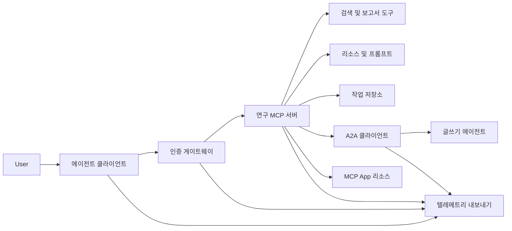
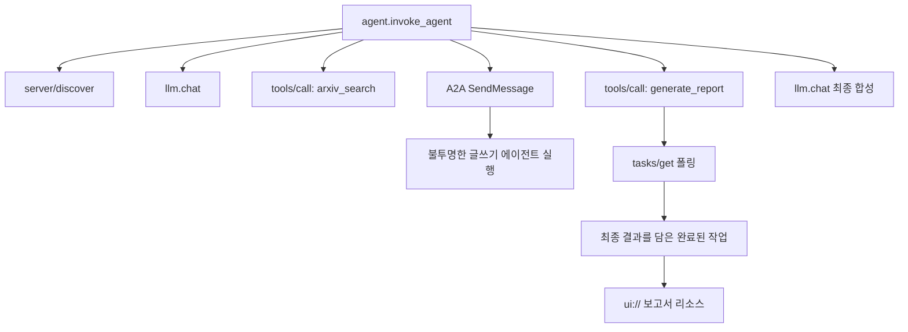
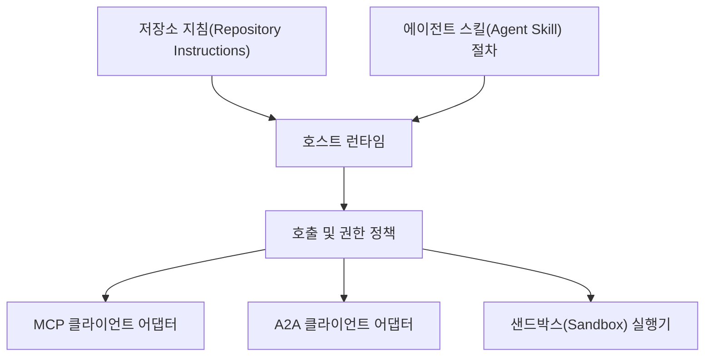

# 캡스톤: 상태 비저장 도구 생태계

> 프로덕션 에이전트 시스템은 기능의 집합이 아니라 경계의 집합입니다. 이 캡스톤은 가독성 있는 프로세스 내 시뮬레이션과 실제 배포에 필요한 프로토콜 클라이언트, 인증 서버, 샌드박스, 텔레메트리 익스포터를 분리합니다.

**유형:** Build
**언어:** Python (표준 라이브러리, 프로세스 내 시뮬레이션)
**선수 요건:** 13단계 · 01~22강, MCP 개정판 `2026-07-28` 사용
**시간:** 약 120분

## 학습 목표

- 도구 호출, 작업 형태 결과, 위임된 작업, UI 리소스, 인증 정책, 추적 기록을 하나의 흐름으로 구성해 보세요.
- 연결 세션에 의존하지 않고 모든 MCP 요청에 프로토콜 버전, 클라이언트 식별자, 기능을 포함해 보세요.
- 사용 전에 서버를 발견하고 공식 Tasks 확장 기능을 통해 장기 작업을 수행해 보세요.
- 프로토콜 형태 시뮬레이션과 MCP, A2A, OAuth, OpenTelemetry 구현을 구분해 보세요.
- 각 시뮬레이션된 경계를 대체해야 할 프로덕션 구성 요소에 매핑해 보세요.
- `AGENTS.md`, 에이전트 스킬, 런타임 어댑터, 도구, 보안 정책을 올바른 역할로 유지해 보세요.
- 로컬 출력에서 검증할 수 있는 주장과 라이브 통합 테스트가 필요한 주장을 설명해 보세요.

## 문제점

연구 및 보고서 시스템을 설계합니다. 사용자가 에이전트 프로토콜에 관한 논문을 요청합니다. 시스템은 논문 카탈로그를 검색하고, 요약 작업을 위임하며, 보고서를 생성하고, UI 리소스를 반환하며, 시스템을 거친 경로를 기록합니다.

이 한 문장에는 여러 독립적인 계약이 숨어 있습니다:

- 모델이 보는 도구 스키마;
- 상태 비저장 요청 엔벨로프 및 서버 발견 계약;
- 행위자, 범위, 도구 식별자에 대한 게이트웨이 결정;
- 장기 실행 작업 계약;
- 위임 프로토콜;
- 호스트-앱 브리지;
- 추적 전파 및 내보내기;
- 재사용 가능한 운영 절차.

`code/main.py`는 일반적인 Python 함수와 사전(dictionary)을 사용하여 이러한 경계를 가시화합니다. 전송(transports)을 열지, arXiv에 연결하지, OAuth를 수행하지, A2A 서버를 호출하지, MCP App을 렌더링하지, 텔레메트리를 내보내지 않습니다. 이는 시뮬레이션이 규격 준수 서비스로 위장되지 않도록 제어 흐름을 쉽게 검사할 수 있게 합니다.

## 개념

### 목표 아키텍처



이 아키텍처는 공개 프로토콜 패턴의 개념적 조합입니다. 특정 제품의 내부 구조에 대한 주장이 아닙니다.

### 목표 추적(trace)



실제 구현에서는 모든 단계가 추적 컨텍스트를 전파합니다. 스팬(span) 이름과 속성은 선택한 계측(instrumentation) 버전이 지원하는 OpenTelemetry 시맨틱 컨벤션을 따라야 합니다. 공유된 추적 식별자만으로는 올바른 부모 관계, 내보내기, 백엔드 수집이 증명되지 않습니다.

### 현재 프로토콜 표면

이전 초안에서 기억한 이름이 아닌, 현재 프로토콜에서 정의된 메서드 이름을 사용하세요:

| 경계 | 현재 표면 | 캡스톤 시뮬레이션이 하는 것 |
|---|---|---|
| MCP 발견 | 필수 `server/discover` | 버전, 기능, 서버 식별자를 반환하는 직접 함수 |
| MCP 요청 컨텍스트 | 모든 `params._meta`에 버전, 기능, 클라이언트 식별자 포함 | 모든 시뮬레이션된 호출에 전달되는 최신 요청 메타데이터 |
| MCP 도구 호출 | `tools/call` | 직접 Python 함수 디스패치 |
| MCP 작업 폴링 | `io.modelcontextprotocol/tasks` 및 `tasks/get` | 작동하는 핸들(handle)을 거쳐 최종 결과를 담은 완료된 작업 |
| A2A 위임 | gRPC 및 JSON-RPC의 `SendMessage`; HTTP+JSON의 `POST /message:send` | 원격 호출이나 인위적 지연이 없는 중첩된 단일 스팬 |
| MCP 앱이 서버 도구 호출 | `app.callServerTool({ name, arguments })` | 라이브 브리지 없이 HTML 문자열만 |
| OAuth 인증 | 인증 서버, 보호된 리소스 메타데이터, 오디언스 및 스코프 검증 | 정적 토큰 조회 및 스코프 멤버십 |
| OpenTelemetry | SDK, 전파기, 내보내기 도구, 수집기 또는 백엔드 | 메모리 내 스팬 사전 |

프로토콜 이름은 첫 번째 계층일 뿐입니다. 프로덕션 테스트는 실제 네트워크를 통해 직렬화, 인증 실패, 취소, 시간 초과, 재시도 및 버전 호환성을 반드시 검증해야 합니다.

### 상태 비저장 MCP는 통합 경계를 변경합니다

리비전 `2026-07-28`은 프로토콜 세션과 `initialize` / `notifications/initialized` 핸드셰이크를 제거합니다. 또한 `Mcp-Session-Id`도 제거됩니다. 모든 요청은 네임스페이스가 지정된 `_meta` 필드를 포함합니다:

```json
{
  "io.modelcontextprotocol/protocolVersion": "2026-07-28",
  "io.modelcontextprotocol/clientCapabilities": {
    "extensions": {
      "io.modelcontextprotocol/tasks": {}
    }
  },
  "io.modelcontextprotocol/clientInfo": {
    "name": "capstone-client",
    "version": "1.0.0"
  }
}
```

서버는 `server/discover`을 구현해야 합니다. 일반적인 결과는 `resultType: "complete"`을 사용하며, 작업 핸들(handle)은 `resultType: "task"`을 사용합니다. 각 결과는 `_meta.io.modelcontextprotocol/serverInfo`에서 서버를 식별해야 합니다.

작업 확장에는 `tasks/get`, `tasks/update`, `tasks/cancel`가 있습니다. 도구는 먼저 `resultType: "task"`을 반환할 수 있으며, `tasks/get` 자체는 `resultType: "complete"`을 반환하고, 완료된 `Task`에는 최종 결과가 포함됩니다. 이전 `tasks/result` 및 `tasks/list` 메서드는 현재 확장의 일부가 아닙니다. 클라이언트는 작업 핸들을 받을 수 있는 동일한 요청에서 `io.modelcontextprotocol/tasks`를 광고해야 합니다. 그렇지 않으면 서버는 누락된 클라이언트 기능 객체로 형식화된 `requiredCapabilities`와 `extensions.io.modelcontextprotocol/tasks`를 포함하는 `-32021`을 반환합니다.

### 보안 태세

의도된 배포는 심층 방어(Defense in Depth)를 사용합니다:

- 클라이언트 유형이 요구하는 경우 PKCE를 사용한 OAuth 인증;
- 발급된 접근 토큰에 대한 리소스 및 오디언스 바인딩;
- 요청된 도구 및 스코프를 확인하는 게이트웨이 RBAC;
- 모델 가시 컨텍스트 외부에 보관되는 업스트림 자격 증명;
- 고정되거나 검토된 도구 설명 매니페스트;
- 신뢰할 수 없는 입력, 민감한 데이터 및 중대한 조치에 대한 Rule of Two 검토;
- 파일시스템, 프로세스, 네트워크, 자격 증명 및 리소스 제한이 스킬 외부에서 강제되는 실행 샌드박스(Sandbox).

이 데모는 정적 토큰, 범위 확인 및 설명 해시만 구현합니다. 정책 흐름에는 유용하지만 보안 검증에는 적합하지 않습니다.

### 스킬은 절차이지 전송 매체가 아닙니다

에이전트 스킬(Agent Skill)은 런타임에 연구 워크플로우 수행 방법, 예상되는 도구 계약(Tool Contract), 저장해야 할 증거 및 종료 시점을 지시할 수 있습니다. MCP 서버를 생성하거나, A2A 호환성을 확립하거나, 범위를 부여하거나, 샌드박스(Sandbox)를 만들 수는 없습니다.



절차가 동반 파일을 참조하는 경우, 전체 스킬 디렉토리를 출시하세요. 이 이전 캡스톤의 평면 아티팩트는 코스 청사진일 뿐, 호스트가 휴대 가능한 번들(Bundle)을 보존한다는 증거가 아닙니다. 24강부터 27강까지 전체 번들(Bundle) 생명주기를 구축하고 테스트합니다.

### 코스 아티팩트 메타데이터는 로컬 어댑터입니다

코스 카탈로그(Catalog)와 설치 프로그램은 `skill-*.md`라는 이름의 평면 파일을 인식하지만, 이는 저장소 관례일 뿐 휴대 가능한 에이전트 스킬(Agent Skills) 패키지 계약이 아닙니다. 그들의 최소한의 frontmatter 파서는 최상위 키만 읽습니다. 따라서 이 강의는 휴대 가능한 식별 필드와 코스 카탈로그(Catalog) 필드를 동일한 레벨에 유지합니다:

```yaml
---
name: ecosystem-blueprint
description: Produce a full 13단계 ecosystem architecture for a product need.
version: "1.0.0"
phase: "13"
lesson: "23"
tags: [mcp, capstone, ecosystem, architecture, a2a, otel]
---
```

`name`과 `description`은 휴대 가능한 식별 필드입니다. `version`, `phase`, `lesson` 및 `tags`는 코스 전용 카탈로그(Catalog) 확장 필드입니다. 코스 파서는 `--tag capstone`이 매칭할 수 있도록 `tags`을 인라인 목록으로 요구합니다.

휴대 가능한 디렉토리 스킬은 문자열 값의 확장 데이터를 위해 선택적 `metadata` 맵을 사용할 수 있습니다. 이는 `metadata`이 이 저장소의 카탈로그(Catalog) 스키마와 상호 교환 가능하다는 의미는 아닙니다. 이 평면 파일이 `metadata` 아래에 `version` 또는 `tags`을 중첩하면, 최소한의 파서는 들여쓰기된 키를 건너뛰고, 카탈로그(Catalog)는 빈 버전을 기록하며, 태그 필터링은 아티팩트를 찾을 수 없습니다. 프로덕션 호스트는 안전한 YAML 파서를 사용하고 자체 문서화된 스키마를 검증해야 합니다.

### 시뮬레이션 대 프로덕션

| 계층 | `code/main.py` | 프로덕션 대체 | 필수 증거 |
|---|---|---|---|
| 발견 | `server_discover()` 및 정적 `TOOLS` | `server/discover` 이후 캐시 인식 `tools/list` | 와이어 트랜스크립트, 결정적 순서, 스키마 검증 |
| 인증 | 토큰 키 사전 | OAuth 권한 부여 및 리소스 서버 검증 | 발급자, 대상, 범위, 만료 및 실패 테스트 |
| 권한 부여 | 범위 멤버십 | 행위자, 도구, 대상, 테넌트에 바인딩된 게이트웨이 정책 | 허용 및 거부 감사 케이스 |
| 검색 | 정적 종이 픽스처 | 검색 API 또는 MCP 서버 | 출처, 순위 및 오류 테스트 |
| 작업 | 로컬 핸들 및 즉시 `tasks/get` | `io.modelcontextprotocol/tasks`, `tasks/get`, `tasks/update`, TTL을 포함한 내구성 있는 `tasks/cancel` 저장소 | 상태 전환, 입력, 취소 및 복구 테스트 |
| 위임 | Sleep 및 중첩 span | A2A 클라이언트 및 원격 Agent Card | 계약, 시간 초과, 재시도 및 투명성 테스트 |
| 앱 | HTML 문자열 및 URI | MCP Apps 리소스 및 `App` 브리지 | CSP, 권한, 도구 호출 및 브라우저 테스트 |
| 텔레메트리 | 메모리 내 리스트 | OTel SDK 및 익스포터 | 수집기 수신 및 trace-parent 단정 |
| 샌드박스 | 없음 | 호스트가 강제하는 격리된 실행기 | 탈출, 아웃바운드, 시크릿 및 리소스 제한 테스트 |

이 표는 핸드오프 경계입니다. 로컬 실행이 초록색으로 통과하면 시뮬레이션만 검증됩니다.

### 13단계 맵

| 강 | 기여 |
|---|---|
| 01-05 | 도구 인터페이스, 호출, 스키마, 구조화된 결과 및 결정적 검증 |
| 06-14 | 상태 비저장 MCP 요청 엔벨로프, 발견, 전송, 리소스, 프롬프트, 확장 및 Apps |
| 15-18 | 오염 방어, OAuth, 게이트웨이, 레지스트리 및 프로덕션 인증 |
| 19 | A2A 메시지 및 작업 위임 |
| 20 | OpenTelemetry GenAI 추적 설계 |
| 21 | 모델 제공자 라우팅 |
| 22 | 이식 가능한 스킬 계약 및 런타임 경계 |

```figure
t3-capstone-chain
```

## 구현하기

프로세스 내 하네스를 실행하세요:

```bash
cd phases/13-tools-and-protocols/23-capstone-tool-ecosystem
python3 code/main.py
```

다섯 가지를 점검하세요:

1. `server/discover`은 리비전 `2026-07-28` 및 Tasks 확장 기능을 홍보합니다.
2. Alice는 보고서를 읽고 생성할 수 있지만, Bob의 쓰기 범위 호출은 거부됩니다.
3. 하나의 오케스트레이터 실행 내의 모든 로컬 스팬은 하나의 추적 식별자를 공유하며 부모 스팬 식별자를 기록합니다.
4. 보고서는 작업 핸들로서 시작합니다. `tasks/get`은 텍스트와 `ui://` 참조를 포함하는 최종 결과를 가진 완료된 작업을 반환합니다.
5. 위임된 작성자는 오케스트레이터가 경계 스팬만 기록하기 때문에 불투명 상태로 유지됩니다.
6. 출력은 네트워크 연결, OAuth 교환, 수집기 내보내기, 브라우저 렌더링, 샌드박스 실행이 발생했다고 주장하지 않습니다.

스크립트는 두 번 실행되므로 두 개의 루트 추적을 생성합니다. 감사 항목은 프로세스 로컬이며 다음 실행 시 초기화됩니다.

## 사용하기

한 번에 한 계층씩 승격하세요:

1. `server_discover()` 및 정적 도구 목록을 실제 `server/discover` 및 `tools/list` 호출로 교체하세요. 모든 요청에 버전, 식별자 및 기능을 포함하세요.
2. 정적 토큰을 인증 서버 및 보호된 자원 검증으로 교체하세요.
3. `io.modelcontextprotocol/tasks` 확장 기능을 구현하고 `tasks/get`, `tasks/update`, `tasks/cancel`, 시간 초과, TTL 및 재시작 복구를 테스트하세요. `tasks/result` 또는 `tasks/list`를 추가하지 마세요.
4. 위임 스텁을 에이전트 카드를 해석하고 메시지를 전송하는 A2A 클라이언트로 교체하세요.
5. 공식 SDK로 App을 빌드하고 `app.callServerTool`를 통해 서버 도구를 호출하세요.
6. 스팬을 테스트 수집기로 내보내고 수신자에서 부모 관계를 단언하세요.
7. 26강의 샌드박스 계약 내에서 도구 및 스크립트 실행을 수행하세요.
8. 절차를 완전한 디렉토리 번들로 패키징하고 27강의 릴리스 게이트를 통과하세요.

각 승격은 새로운 경계를 넘나드는 통합 테스트가 필요합니다. 통신이 실제가 될 때 하위 수준 정책 테스트를 삭제하지 마세요.

## 출시하기

이 강의는 `outputs/skill-ecosystem-blueprint.md`, 즉 레거시 단일 파일 코스 아티팩트를 생성합니다. 이는 프리미티브, 보안, 위임, 텔레메트리, 패키징 및 가장 어려운 운영 위험을 다루는 한 페이지 아키텍처를 요구합니다. 그 최상위 카탈로그 필드는 저장소의 실제 카탈로그 및 설치 프로그램 파서로 검증됩니다.

디렉토리 번들이 아니므로 참조, 스크립트, 자산, 평가 픽스처를 포함할 수 없습니다. 이 과정 밖에서 재사용 가능한 스킬을 게시할 때는 22강 및 24강-27강의 패키지 형식을 사용해 보세요.

## 연습 문제

1. `code/main.py`을 실행해 보세요. 출력으로 증명된 사실과 통합 증거가 아직 필요한 프로덕션 주장을 분리해 보세요.
2. 두 번째 정적 백엔드를 추가하고 동일한 이름을 가진 두 도구의 충돌 규칙을 정의해 보세요. 그런 다음 두 목록을 실제 `tools/list` 호출로 교체해 보세요.
3. Writer 스텁을 A2A 테스트 서버로 교체해 보세요. 에이전트 카드, 메시지 요청, 시간 초과 경로, 반환된 아티팩트를 기록해 보세요.
4. 프로세스 재시작을 견디는 태스크 스토어를 추가해 보세요. 클라이언트가 `tasks/get`로 재개하고 `pollIntervalMs`을 준수하며 `tasks/result` 없이 완료된 태스크의 최종 결과를 읽을 수 있음을 증명해 보세요.
5. 최소 MCP 앱을 구축하고 restrictive CSP와 명시적 권한이 있는 브라우저에서 `app.callServerTool`을 검증해 보세요.
6. 시뮬레이션된 스팬을 OTel SDK를 통해 로컬 수집기로 내보내 보세요. 수신, 추적 식별자, 부모 관계, 오류 상태를 단언해 보세요.
7. 저장소 전체 유지보수 규칙용 `AGENTS.md`과 재사용 가능한 연구 절차용 별도 스킬 번들을 작성해 보세요. 두 파일 모두 도구 권한을 부여하지 않는 이유를 설명해 보세요.

## 핵심 용어

| 용어 | 사람들이 말하는 것 | 실제 의미 |
|---|---|---|
| Capstone | "모든 것이 연결됨" | 시뮬레이션 및 라이브 경계가 명시적으로 남아 있는 단계적 통합 |
| 프로토콜형 시뮬레이션 | "기본적으로 MCP임" | 와이어 계약을 구현하지 않으면서 프로토콜을 닮은 로컬 데이터 및 호출 |
| 태스크 확장 | "긴 도구 호출" | 내구성 있는 식별자, 폴링, 클라이언트 입력, 최종 결과, 취소 시맨틱을 가진 선택적 `io.modelcontextprotocol/tasks` 수명주기 |
| 투명성 경계 | "다른 에이전트가 처리함" | 호출자는 선언된 인터페이스와 아티팩트를 보며, 비공개 추론이나 내부 상태를 보지 못함 |
| 런타임 어댑터 | "스킬 통합" | 이식 가능한 절차를 발견, 호출, 도구, 정책, 컨텍스트에 매핑하는 호스트 코드 |
| 통합 증거 | "통과함" | 실제 경계를 넘었음을 증명하는 트랜스크립트, 아티팩트, 또는 수신 측 관찰 |

## 추가 읽기

- [MCP specification 2026-07-28](https://modelcontextprotocol.io/specification/2026-07-28)는 상태 비저장 요청, 발견, 도구, 인증 및 전송 동작에 대한 내용입니다.
- [MCP 2026-07-28 key changes](https://modelcontextprotocol.io/specification/2026-07-28/changelog)는 세션 제거, 요청별 메타데이터, MRTR (다중 왕복 요청)(Multi Round-Trip Request), 확장 및 폐기된 기능에 대한 내용입니다.
- [MCP Tasks extension](https://tasks.extensions.modelcontextprotocol.io/specification/draft/tasks)는 `tasks/get`, `tasks/update`, `tasks/cancel` 및 종료 작업이 전달하는 최종 결과에 대한 내용입니다.
- [MCP Apps SDK](https://github.com/modelcontextprotocol/ext-apps/blob/main/docs/overview.md)는 `App` 및 `app.callServerTool`에 대한 내용입니다.
- [A2A protocol](https://a2a-protocol.org/latest/)는 에이전트 카드, 메시지 전달, 작업, 아티팩트 및 전송 바인딩에 대한 내용입니다.
- [OpenTelemetry GenAI semantic conventions](https://opentelemetry.io/docs/specs/semconv/gen-ai/)는 추적 및 속성 규약에 대한 내용입니다.
- [Agent Skills specification](https://agentskills.io/specification)는 절차적 계층이 사용하는 이식 가능한 패키지 계약에 대한 내용입니다.
