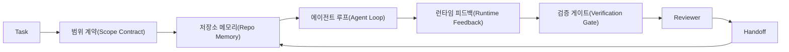

# 에이전트 워크벤치 엔지니어링: 유능한 모델이 여전히 실패하는 이유

> 유능한 모델만으로는 충분하지 않습니다. 신뢰할 수 있는 에이전트에는 워크벤치가 필요합니다: 지침, 상태, 범위, 피드백, 검증, 리뷰, 핸드오프. 이 요소들을 제거하면 프론티어 모델조차 출시하기 위험한 작업을 생성합니다.

**유형:** Learn + Build
**언어:** Python (stdlib)
**선수 요건:** 14단계 · 01강 (에이전트 루프), 14단계 · 26강 (실패 모드)
**시간:** 약 45분

## 학습 목표

- 모델의 능력과 실행 신뢰성을 분리해 보세요.
- 에이전트가 출시될지 여부를 결정하는 7가지 워크벤치 표면을 나열해 보세요.
- 작은 저장소 작업에서 프롬프트 전용 실행과 워크벤치 가이드 실행을 비교해 보세요.
- 누락된 각 표면을 그로 인해 발생한 증상과 매핑하는 실패 모드 보고서를 작성해 보세요.

## 문제점

프론티어 모델을 실제 저장소에 넣고 입력 유효성 검사를 추가하도록 요청합니다. 모델은 네 개의 파일을 열고, 그럴듯한 코드를 작성하고, 성공을 선언하고, 멈춥니다. 테스트를 실행합니다. 두 개가 실패합니다. 유효성 검사와 전혀 관련 없는 세 번째 파일이 수정되었습니다. 에이전트가 무엇을 가정했는지, 무엇을 먼저 시도했는지, 무엇을 남겨야 하는지에 대한 기록이 없습니다.

모델은 Python에 대해 틀린 것이 아닙니다. 작업에 대해 틀린 것입니다. 완료 기준이 무엇인지, 어디에 작성할 수 있는지, 어떤 테스트가 권위 있는 것인지, 다음 세션이 어떻게 이어져야 하는지에 대해 아무것도 알지 못했습니다.

이것은 모델 버그가 아닙니다. 워크벤치 버그입니다. 에이전트 주변 표면이 일회성 생성을 신뢰할 수 있고 재개 가능한 엔지니어링으로 바꾸는 부분을 누락하고 있습니다.

## 개념

워크벤치는 작업 중 모델을 감싸는 운영 환경입니다. 7가지 표면을 포함합니다:

| 표면 | 포함 내용 | 누락 시 실패 |
|---------|-----------------|----------------------|
| 지침 | 시작 규칙, 금지된 작업, 완료 정의 | 에이전트가 출시의 의미를 추측합니다 |
| 상태 | 현재 작업, 수정된 파일, 차단 요인, 다음 조치 | 각 세션이 제로에서 다시 시작합니다 |
| 범위 | 허용된 파일, 금지된 파일, 수용 기준 | 편집이 관련 없는 코드로 유출됩니다 |
| 피드백 | 루프에 캡처된 실제 명령 출력 | 에이전트가 400 응답에서 성공을 선언 |
| 검증 | 테스트, 린트, 스모크 실행, 범위 확인 | "괜찮아"가 main에 도달 |
| 리뷰 | 다른 역할로 진행하는 두 번째 패스 | 빌더가 자신의 숙제를 채점 |
| 핸드오프 | 변경된 내용, 이유, 남은 작업 | 다음 세션이 모든 것을 다시 발견 |

워크벤치는 모델과 독립적입니다. 모델을 교체해도 표면(surfaces)은 유지할 수 있습니다. 표면을 교체하고 신뢰성을 유지할 수는 없습니다.



루프는 채팅 기록이 아닌 상태 파일에서 닫힙니다. 채팅은 휘발성입니다. 저장소가 기록 시스템입니다.

### 워크벤치 대 프롬프트 엔지니어링

프롬팅은 이번 턴에서 원하는 것을 모델에 지시합니다. 워크벤치는 모델이 턴과 세션을 넘어 작업을 수행하는 방법을 알려줍니다. 대부분의 에이전트 실패 사례는 프롬프트 엔지니어링 옷을 입은 워크벤치 실패입니다.

### 워크벤치 대 프레임워크

프레임워크는 런타임(LangGraph, AutoGen, Agents SDK)을 제공합니다. 워크벤치는 그 런타임 안에서 에이전트가 작업할 장소를 제공합니다. 둘 다 필요합니다. 이 미니 트랙은 두 번째 것에 대한 것입니다.

### 벤더 분류 체계가 아닌 프리미티브로부터의 추론

현재 "하네스 엔지니어링"에 대한 글이 많이 있습니다. Addy Osmani, OpenAI, Anthropic, LangChain, Martin Fowler, MongoDB, HumanLayer, Augment Code, Thoughtworks, walkinglabs awesome list, 그리고 Medium와 Hacker News의 꾸준한 글들이 이를 다루고 있습니다. 하네스의 경계, 범위, 사용해야 할 어휘에 대해 의견이 갈립니다. 우리는 편을 들 필요가 없습니다. 7가지 표면은 UX 레이어입니다. 모든 워크벤치 아래에는 신뢰할 수 있는 백엔드를 지탱하는 동일한 분산 시스템 프리미티브 집합이 있습니다.

에이전트라는 라벨을 잠시 떼어 보세요. 에이전트 실행은 시간, 프로세스, 기계를 넘나드는 계산입니다. 이를 신뢰할 수 있게 만들려면 모든 생산 시스템이 필요로 하는 동일한 프리미티브가 필요합니다.

| 프리미티브 | 정의 | 에이전트가 전달하는 것 |
|-----------|------------|------------------------------|
| 함수 | 타입이 지정된 핸들러. 가능한 한 순수 함수로 작성합니다. 입력과 출력을 자체적으로 관리합니다. | 도구 호출, 규칙 검사, 검증 단계, 모델 호출 |
| 워커 | 하나 이상의 함수와 생명주기를 소유하는 장기 실행 프로세스 | 빌더, 리뷰어, 검증자, MCP 서버 |
| 트리거 | 함수를 호출하는 이벤트 소스 | 에이전트 루프 틱, HTTP 요청, 큐 메시지, cron, 파일 변경, 훅 |
| 런타임 | 어디서, 어떤 시간 제한과 자원으로 실행할지 결정하는 경계 | Claude Code의 프로세스, LangGraph의 런타임, 워커 컨테이너 |
| HTTP / RPC | 호출자와 워커 사이의 통신 경로 | 도구 호출 프로토콜, MCP 요청, 모델 API |
| 큐 | 트리거와 워커 사이의 내구성 있는 버퍼; 백프레셔, 재시도, 멱등성 | 작업 보드, 피드백 로그, 리뷰 인박스 |
| 세션 지속성 | 크래시, 재시작, 모델 교체에도 살아남는 상태 | `agent_state.json`, 체크포인트, KV 저장소, 저장소 자체 |
| 권한 정책 | 누가 어떤 범위로 어떤 함수를 호출할 수 있는지 | 허용/금지 파일, 승인 경계, MCP 기능 목록 |

이제 7가지 작업대 표면을 이러한 프리미티브에 매핑해 보세요.

- **지침** — 정책 + 함수 메타데이터. 규칙은 검사(함수)입니다. 라우터(`AGENTS.md`)는 런타임의 시작에 연결된 정책입니다.
- **상태** — 세션 지속성. 런타임이 모든 단계에서 읽는 키가 지정된 저장소. 파일, KV, DB 중 무엇이든 될 수 있으며, 지속성 의미가 중요하고 저장소 백엔드는 중요하지 않습니다.
- **범위** — 작업별 권한 정책. 허용/금지 글롭(glob)은 ACL입니다. 필요한 승인은 권한 격자입니다.
- **피드백** — 큐에 기록되는 호출 로그. 모든 셸 호출은 내구성 있고 재생 가능한 기록입니다.
- **검증** — 함수입니다. 입력에 대해 결정적입니다. 작업 종료 시 트리거됩니다. 실패 시 닫힙니다(fails closed).
- **리뷰** — 빌더 산출물에 대해 읽기 전용 권한을, 리뷰 보고서에 대해 쓰기 전용 권한을 가진 독립적인 워커입니다.
- **핸드오프** — 세션 종료 트리거가 방출하는 내구성 있는 기록입니다. 다음 세션의 시작 트리거가 이를 읽습니다.

에이전트 루프 자체는 이벤트(사용자 메시지, 도구 결과, 타이머 틱)를 소비하고, 함수(모델, 그리고 모델이 선택한 도구)를 호출하고, 레코드(상태, 피드백)를 기록하고, 트리거(검증, 리뷰, 핸드오프)를 방출하는 워커입니다. 신비로운 것이 없으며, 작업 처리기와 동일한 형태입니다.

### 순환하는 패턴을 프리미티브로 번역하기

모든 인기 있는 하네스 패턴은 8가지 프리미티브로 축소됩니다. 번역 표를 확인해 보세요.

| 벤더 또는 커뮤니티 패턴 | 실제 내용 |
|------------------------------|--------------------|
| Ralph Loop (Claude Code, Codex, agentic_harness 책) — 에이전트가 조기 종료하려고 할 때 새로운 컨텍스트 윈도우에 원래 의도를 재주입 | 깨끗한 컨텍스트로 작업을 재큐잉하는 트리거; 세션 지속성이 목표를 전달 |
| Plan / Execute / Verify (PEV) | 각 역할에 하나의 워커, 세 개의 워커가 상태와 단계 간 큐를 통해 통신 |
| 하네스-컴퓨트 분리 (OpenAI Agents SDK, 2026년 4월) — 제어 평면과 실행 평면을 분리 | 제어 평면 / 데이터 평면을 재진술. 에이전트라는 라벨보다 수십 년 앞선 개념 |
| Open Agent Passport (OAP, 2026년 3월) — 실행 전에 선언적 정책과 대조하여 모든 도구 호출에 서명하고 감사 | 사전 행동 워커가 강제하는 권한 부여 정책과 서명된 감사 큐 |
| Guides and Sensors (Birgitta Böckeler / Thoughtworks) — 순방향 규칙 + 피드백 관측 가능성 | 권한 부여 정책 + 검증 함수 + 관측 가능성 추적 |
| 점진적 압축, 5단계 (Claude Code 리버스 엔지니어링, 2026년 4월) | 세션 지속성을 예산 내에 유지하기 위해 크론처럼 실행되는 상태 관리 워커 |
| Hooks / middleware (LangChain, Claude Code) — 모델 및 도구 호출을 가로채기 | 런타임의 호출 경로에 감싸진 트리거 + 함수 |
| 점진적 공개를 포함한 Markdown 스킬 (Anthropic, Flue) | 함수 메타데이터가 적시에 컨텍스트에 로드되는 함수 레지스트리 |
| 샌드박스 에이전트 (Codex, Sandcastle, Vercel Sandbox) | 컴퓨트 평면: 격리된 파일 시스템, 네트워크 및 생명 주기를 가진 런타임 |
| MCP 서버 | 권한 부여로서 기능 목록을 가진 안정적 RPC를 통해 함수를 노출하는 워커 |

해당 표의 모든 항목은 에이전트 커뮤니티가 분산 시스템에서 이미 이름이 붙어 있던 원시 요소를 받아들이고, 거기에 새로운 이름을 붙인 것입니다. 마케팅용으로는 유용한 라벨이지만, 엔지니어링 용어로는 유용하지 않습니다.

### 실제 증거가 말하는 것

하네스가 모델을 능가한다는 주장에는 이제 수치적 근거가 있습니다. "더 똑똑한 모델을 기다리라"는 주장에 대한 유일한 정직한 반론이기도 하므로, 이를 알아두는 것이 가치 있습니다.

- Terminal Bench 2.0 — 동일한 모델에서, 하네스 변경만으로 코딩 에이전트가 상위 30위 밖에서 5위로 상승했습니다 (LangChain, *Anatomy of an Agent Harness*).
- Vercel — 에이전트의 도구 80%를 삭제하자 성공률이 80%에서 100%로 급증했습니다 (MongoDB).
- Harvey — 법률 에이전트는 하네스 최적화만으로 정확도를 두 배 이상 높였습니다 (MongoDB).
- 기업용 AI 에이전트 프로젝트의 88%가 프로덕션에 도달하지 못합니다. 실패는 추론이 아닌 런타임 주변에서 집중됩니다 (preprints.org, *Harness Engineering for Language Agents*, 2026년 3월).
- 2025년 세 가지 인기 오픈소스 프레임워크에 대한 벤치마크 연구는 약 50%의 작업 완료율을 보고했습니다. 긴 컨텍스트 WebAgent는 긴 컨텍스트 조건에서 40-50%에서 10% 미만으로 급락했으며, 이는 주로 무한 루프와 목표 상실 때문입니다 (2026년 초의 다양한 글에서 널리 다루어짐).

결론은 "하네스가 영원히 이긴다"는 것이 아닙니다. 모델은 시간이 지나면 하네스의 트릭을 흡수합니다. 결론은, 오늘날 핵심적인 엔지니어링은 모델 내부가 아니라 모델 주변에 있으며, 그 부하를 지탱하는 원시 요소는 모든 프로덕션 시스템이 항상 필요로 해온 것들입니다.

### 벤더의 글이 미흡한 부분

이 부분은 예의를 차릴 필요가 없습니다.

- LangChain의 *Anatomy of an Agent Harness*는 프롬프트, 도구, 훅, 샌드박스, 오케스트레이션, 메모리, 스킬, 서브에이전트, 그리고 런타임 "멍청한 루프" 등 11가지 구성 요소를 나열합니다. 큐, 배포 단위로서의 워커, 트리거 시맨틱, 별도 관심사로서의 세션 지속성, 또는 권한 정책은 언급하지 않습니다. 하네스를 배포하는 시스템이 아니라 설정하는 객체로 취급합니다.
- Addy Osmani의 *Agent Harness Engineering*은 `Agent = Model + Harness` 프레임과 래칫 패턴을 제시하지만, 하네스가 무엇으로 구성되는지 말하지는 않습니다. 스펙이 아니라 스탠스로 읽힙니다.
- Anthropic과 OpenAI는 표면(surface)에 대해 가장 깊이 다루지만, 자체 런타임 내부에 머무릅니다. 2026년 4월 Agents SDK에서 발표된 "하네스-컴퓨트 분리(harness-compute separation)"은 제어 평면(control-plane)과 데이터 평면(data-plane)의 분리를 명시적으로 지지하는 최초의 벤더 관련 자료입니다. 이는 새로운 개념이 아니라 원시적인(primitive) 아이디어입니다.
- agentic_harness 책은 하네스를 설정 객체로 취급합니다(Jaymin West의 *Agentic Engineering*, 6장). 이 책에서 가장 강력한 문장은 "하네스는 에이전트 시스템에서 주요 보안 경계입니다"입니다. 이는 단순히 권한 부여 정책을 다시 서술한 것에 불과합니다.
- Hacker News 스레드들은 항상 같은 결론에 도달합니다. 2026년 4월의 스레드 *The agent harness belongs outside the sandbox*는 하네스가 "모든 것의 밖에 위치하며 컨텍스트와 사용자에 기반해 접근을 승인하는 하이퍼바이저처럼 존재해야 한다"고 주장합니다. 이는 다시 말해, 권한 부여 정책을 별도의 평면으로 분리하는 것입니다.

이 자료들에 동의하지 않더라도 공백을 발견할 수 있습니다. 이들은 이미 존재하는 시스템의 UX 설명을 작성하고 있습니다. 우리는 시스템을 작성하고 있습니다. 시스템이 올바르게 구축되면, 7가지 표면(surface)은 원시 요소(primitives)에서 자연스럽게 도출됩니다. 시스템이 잘못 구축되면, `AGENTS.md`을 아무리 다듬어도 누락된 큐(queue)를 해결할 수 없습니다.

따라서 "하네스 엔지니어링(harness engineering)"이라는 용어를 들으면 원시 요소(primitives)로 번역하세요. 프롬프트와 규칙은 정책(policy)과 함수(function)입니다. 스캐폴딩(scaffolding)은 런타임(runtime)입니다. 가드레일(guardrails)은 권한 부여(authorization) + 검증(verification)입니다. 훅(hooks)은 트리거(trigger)입니다. 메모리(memory)는 세션 지속성(session persistence)입니다. Ralph Loop는 재큐잉(requeue)입니다. 서브에이전트(subagents)는 워커(worker)입니다. 샌드박스(sandboxes)는 컴퓨트 평면(compute planes)입니다. 용어는 변하지만 엔지니어링은 변하지 않습니다. 워크벤치(workbench)는 에이전트 중심의 UX이며, 하네스는 다음 벤더의 재정의(reframe)를 견디는 의미에서 함수, 워커, 트리거, 런타임, 큐, 지속성, 정책이 올바르게 연결된 것입니다.

```figure
wb-seven-surfaces
```

## 구현하기

`code/main.py`는 작은 저장소(repo) 작업을 두 번 실행합니다. 먼저 프롬프트만 사용하여 실행하고, 그 다음 7가지 표면을 연결하여 실행합니다. 동일한 모델, 동일한 작업입니다. 스크립트는 실패한 실행에서 누락된 표면을 계산하고 실패 모드(failure-mode) 보고서를 출력합니다.

저장소 작업은 의도적으로 작습니다: 단일 파일 FastAPI 스타일 핸들러에 입력 유효성 검사를 추가하고 통과하는 테스트를 작성합니다.

실행하세요:

```
python3 code/main.py
```

출력: 두 실행의 나란한(side-by-side) 로그, 프롬프트 전용 실행을 요약하는 `failure_modes.json`, 그리고 워크벤치 실행에 대한 한 줄 판정(verdict)입니다.

에이전트는 작은 규칙 기반 스텁이며, 핵심은 모델이 아니라 표면입니다. 이 미니 트랙의 나머지 부분에서는 각 표면을 실제 재사용 가능한 산출물로 재구축하게 됩니다.

## 사용하기

이렇게 부르는 사람이 없더라도, 워크벤치 표면은 이미 야생(wild)에 세 군데 존재합니다:

- **Claude Code, Codex, Cursor.** `AGENTS.md`와 `CLAUDE.md`는 지침 표면입니다. 슬래시 명령은 범위이고, 훅은 검증입니다.
- **LangGraph, OpenAI Agents SDK.** 체크포인트와 세션 저장소는 상태 표면입니다. 핸드오프는 핸드오프 표면입니다.
- **실제 저장소에서의 CI.** 테스트, 린트, 타입 체크는 검증입니다. PR 템플릿은 핸드오프입니다. CODEOWNERS는 리뷰입니다.

워크벤치 엔지니어링은 각 팀이 이 표면들을 다시 발견하도록 방치하지 않고, 이를 명시적이고 재사용 가능하게 만드는 규율입니다.

## 출시하기

`outputs/skill-workbench-audit.md`는 기존 저장소를 감사하여 7가지 워크벤치 표면 중 어떤 것이 누락되었는지, 어떤 것이 부분적인지, 어떤 것이 건강한지 보고하는 이식 가능한 스킬입니다. 임의의 에이전트 설정 옆에 배치해 보세요. 무엇을 먼저 고쳐야 하는지 알려줍니다.

## 연습 문제

1. 이미 에이전트를 실행하고 있는 저장소를 선택하세요. 7가지 표면을 0(누락)에서 2(건강)까지 점수 매겨 보세요. 가장 약한 표면은 무엇인가요?
2. `main.py`을 확장하여 프롬프트 전용 실행이 가짜 "성공" 주장을 생성하도록 하세요. 검증 게이트가 이를 잡아냈을지 확인해 보세요.
3. 귀하의 제품에 대한 여덟 번째 표면을 추가하세요. 왜 이것이 기존 7가지 중 하나로 붕괴되지 않는지 정당화하세요.
4. 추가 파일 쓰기를 환각하는 다른 스텁 에이전트로 스크립트를 다시 실행하세요. 어떤 표면이 가장 먼저 이를 잡아내나요?
5. 14단계 · 26강의 다섯 가지 산업 반복 실패 모드를 7가지 표면에 매핑하세요. 각 표면은 어떤 모드를 흡수하도록 설계되었나요?

## 핵심 용어

| 용어 | 사람들이 말하는 것 | 실제 의미 |
|------|----------------|------------------------|
| 워크벤치 | "설정" | 작업을 신뢰성 있게 만드는 모델 주변의 엔지니어링된 표면 |
| 표면 | "문서" 또는 "스크립트" | 에이전트가 매 턴마다 읽거나 쓰는 명명된 기계 가독 입력 |
| 기록 시스템 | "메모" | 채팅 기록이 사라졌을 때 에이전트가 진실로 취급하는 파일 |
| 완료 정의 | "수락" | 에이전트가 위조할 수 없는, 파일로 뒷받침되는 객관적인 체크리스트 |
| 워크벤치 감사 | "저장소 준비 상태 점검" | 작업 시작 전에 누락된 부분을 표시하는, 7개 영역에 대한 점검 |

## 추가 읽기

이 자료들을 권위 있는 출처가 아닌 데이터 포인트로 읽어 보세요. 각각은 부분적인 분류 체계입니다. 채택 여부를 결정하기 전에 모든 개념을 기본 요소(함수, 워커, 트리거, 런타임, HTTP/RPC, 큐, 지속성, 정책)로 번역해 보세요.

벤더 관점:

- [Addy Osmani, Agent Harness Engineering](https://addyosmani.com/blog/agent-harness-engineering/) — `Agent = Model + Harness` 및 래칫 패턴; 인프라에 대한 설명이 얕음
- [LangChain, The Anatomy of an Agent Harness](https://blog.langchain.com/the-anatomy-of-an-agent-harness/) — 11개 구성 요소: 프롬프트, 도구, 훅, 오케스트레이션, 샌드박스, 메모리, 스킬, 하위 에이전트, 런타임; 큐, 배포, 권한 인증 누락
- [OpenAI, Harness engineering: leveraging Codex in an agent-first world](https://openai.com/index/harness-engineering/) — Codex 팀이 보는 런타임 주변의 영역
- [OpenAI, Unrolling the Codex agent loop](https://openai.com/index/unrolling-the-codex-agent-loop/) — 함수 호출에 대한 `while`로 축소된 에이전트 루프
- [Anthropic, Effective harnesses for long-running agents](https://www.anthropic.com/engineering/effective-harnesses-for-long-running-agents) — 특정 런타임 내부의 장기적 관점 영역
- [Anthropic, Harness design for long-running application development](https://www.anthropic.com/engineering/harness-design-long-running-apps) — 적용된 설계 노트
- [LangChain Deep Agents harness capabilities](https://docs.langchain.com/oss/python/deepagents/harness) — 런타임 구성 영역

실용적인 세부 사항이 있는 실무자 자료:

- [Martin Fowler / Birgitta Böckeler, Harness engineering for coding agent users](https://martinfowler.com/articles/harness-engineering.html) — 가이드(피드포워드) + 센서(피드백); 가장 깔끔한 제어 이론 관점
- [HumanLayer, Skill Issue: Harness Engineering for Coding Agents](https://www.humanlayer.dev/blog/skill-issue-harness-engineering-for-coding-agents) — "모델 문제가 아니라 구성 문제다"
- [MongoDB, The Agent Harness: Why the LLM Is the Smallest Part of Your Agent System](https://www.mongodb.com/company/blog/technical/agent-harness-why-llm-is-smallest-part-of-your-agent-system) — 실적: Vercel 80%에서 100%, Harvey 정확도 2배, Terminal Bench Top 30에서 Top 5
- [Augment Code, Harness Engineering for AI Coding Agents](https://www.augmentcode.com/guides/harness-engineering-ai-coding-agents) — 제약 우선 워크스루
- [Sequoia podcast, Harrison Chase on Context Engineering Long-Horizon Agents](https://sequoiacap.com/podcast/context-engineering-our-way-to-long-horizon-agents-langchains-harrison-chase/) — 모델 관련 우려보다 런타임 관련 우려

도서, 논문 및 참고 구현:

- [Jaymin West, Agentic Engineering — Chapter 6: Harnesses](https://www.jayminwest.com/agentic-engineering-book/6-harnesses) — 책 분량의 상세한 설명, 하네스를 주요 보안 경계로 취급
- [preprints.org, Harness Engineering for Language Agents (March 2026)](https://www.preprints.org/manuscript/202603.1756) — 제어 / 에이전시 / 런타임으로 보는 학술적 관점
- [walkinglabs/awesome-harness-engineering](https://github.com/walkinglabs/awesome-harness-engineering) — 컨텍스트, 평가, 관측 가능성, 오케스트레이션에 걸친 큐레이션된 읽기 목록
- [ai-boost/awesome-harness-engineering](https://github.com/ai-boost/awesome-harness-engineering) — 대안 큐레이션 목록(도구, 평가, 메모리, MCP, 권한)
- [HKUDS/OpenHarness](https://github.com/HKUDS/OpenHarness) — 내장 개인 에이전트가 있는 오픈 에이전트 하네스

합의가 아닌 이견을 읽기 위해 가치 있는 Hacker News 스레드:

- [HN: Effective harnesses for long-running agents](https://news.ycombinator.com/item?id=46081704)
- [HN: Improving 15 LLMs at Coding in One Afternoon. Only the Harness Changed](https://news.ycombinator.com/item?id=46988596)
- [HN: The agent harness belongs outside the sandbox](https://news.ycombinator.com/item?id=47990675) — 권한 부여를 별도의 평면으로 분리할 것을 주장합니다

이 커리큘럼 내의 상호 참조:

- 14단계 · 23강 — OpenTelemetry GenAI 컨벤션: 센서(sensors) 문헌이 지목하는 관측 가능성 계층
- 14단계 · 26강 — 7개 표면이 흡수하도록 설계된 실패 모드 카탈로그
- 14단계 · 27강 — 권한 부여 정책 원시(primitive)에 위치하는 프롬프트 인젝션 방어
- 14단계 · 29강 — 프로덕션 런타임(큐, 이벤트, 크론): 이 강의의 원시(primitive)가 배포되는 위치
