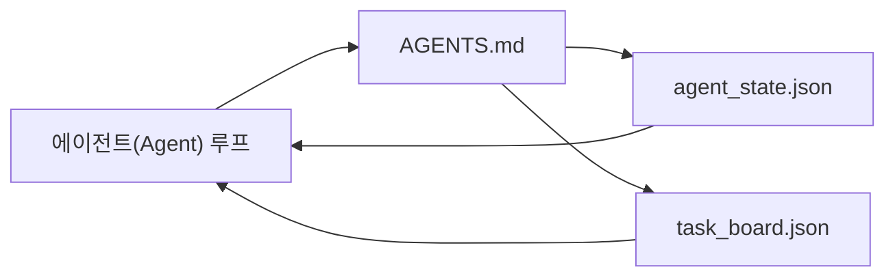

# 최소 에이전트(Agent) 워크벤치

> 가장 작은 유용한 워크벤치는 세 개의 파일로 구성됩니다: 루트 지침 라우터, 상태 파일, 그리고 작업 보드입니다. 나머지 모든 것은 이 위에 계층화됩니다. 저장소가 이 세 가지를 담지 못한다면, 어떤 모델도 이를 구제하지 못할 것입니다.

**유형:** Build
**언어:** Python (stdlib)
**선수 요건:** 14단계 · 31강 (유능한 모델이 여전히 실패하는 이유)
**시간:** 약 45분

## 학습 목표

- 최소 실행 가능한 워크벤치를 구성하는 세 개의 파일을 정의해 보세요.
- 긴 단일 `AGENTS.md`보다 짧은 루트 라우터가 더 나은 이유를 설명해 보세요.
- 에이전트(Agent)가 매 턴마다 읽고 마지막에 작성할 수 있는 상태 파일을 만들어 보세요.
- 채팅 기록 없이도 여러 세션에 걸친 작업을 견디는 작업 보드를 만들어 보세요.

## 문제점

대부분의 팀은 3000줄짜리 `AGENTS.md`를 작성하고 완료했다고 선언하는 방식으로 워크벤치를 구축합니다. 모델은 이를 로드하지만 요약할 수 없는 부분을 무시하며, 항상 실패했던 동일한 영역에서 여전히 실패합니다.

반대 방향이 필요합니다. 관련이 있을 때만 에이전트(Agent)를 더 깊은 파일로 라우팅하는 작은 루트 파일이 필요합니다. 에이전트(Agent)가 행동하기 전에 읽고 행동한 후에 작성하는 지속 가능한 상태가 필요합니다. 진행 중인 작업, 차단된 작업, 그리고 다음에 수행할 작업을 알려주는 작업 보드가 필요합니다.

세 개의 파일. 각각의 파일이 하나의 역할을 수행합니다. 각각은 나중에 실제 시스템으로 진화할 수 있을 정도로 기계가 읽기 쉬워야 합니다.

## 개념



### AGENTS.md는 매뉴얼이 아니라 라우터입니다

좋은 `AGENTS.md`는 짧습니다. 에이전트(Agent)를 다음으로 안내합니다:

- 상태 파일 (현재 위치).
- 작업 보드 (남은 작업).
- 더 깊은 규칙 (`docs/agent-rules.md` 아래).
- 검증 명령 (작동 여부를 확인하는 방법).

더 긴 내용은 필요할 때만 로드되는 더 깊은 문서에 넣습니다. 긴 매뉴얼은 무시됩니다. 짧은 라우터는 따릅니다.

### agent_state.json은 공식 기록 시스템입니다

상태는 다음을 담습니다: 활성 작업 ID, 수정된 파일,做出的 가정을, 차단 요인, 그리고 다음 행동. 에이전트(Agent)는 매 턴마다 이를 읽습니다. 다음 세션은 채팅을 재생하는 대신 이를 읽습니다.

채팅 기록은 신뢰할 수 없기 때문에 상태는 파일에 저장됩니다. 세션은 종료되고, 대화는 잘려나갑니다. 파일은 그렇지 않습니다.

### task_board.json은 큐입니다

태스크 보드는 `todo | in_progress | done | blocked` 상태의 모든 태스크를 담고 있습니다. 상태가 비어 있을 때 에이전트가 가져오는 큐이며, 에이전트가 순조롭게 진행 중인지 확인하기 위해 읽는 큐이기도 합니다.

보드의 태스크에는 id, 목표, 소유자(`builder`, `reviewer` 또는 `human`) 및 수용 기준이 있습니다. 보드는 의도적으로 작게 유지합니다. 화면을 넘칠 정도로 커지면 보드 문제가 아니라 계획 문제입니다.

### 세 개의 파일은 하한선이지 상한선이 아닙니다

이후 강의에서는 범위 계약, 피드백 러너, 검증 게이트, 리뷰어 체크리스트 및 핸드오프 패킷이 추가됩니다. 여기서의 세 파일은 이 모든 것들이 전제하는 기반입니다.

```figure
wb-three-files
```

## 구현하기

`code/main.py`는 빈 저장소에 최소한의 작업대를 작성하고, 단일 에이전트 턴을 시연합니다. 이 턴은:

1. `agent_state.json`을 읽습니다.
2. 상태가 비어 있으면 `task_board.json`에서 다음 태스크를 가져옵니다.
3. 범위 내의 단일 파일을 건드립니다.
4. 업데이트된 상태를 다시 작성합니다.

실행해 보세요:

```
python3 code/main.py
```

스크립트는 `workdir/`을 자기 옆에 생성하고, 세 파일을 배치하며, 한 턴을 실행하고 diff를 출력합니다. 두 번째 턴이 첫 번째가 멈춘 지점부터 이어지는지 확인하기 위해 다시 실행해 보세요.

## 사용하기

프로덕션 에이전트 제품에서는 동일한 세 파일이 다른 이름으로 나타납니다:

- **Claude Code:** 라우터용 `AGENTS.md` 또는 `CLAUDE.md`, 상태용 `.claude/state.json` 스타일 저장소, 보드용 훅.
- **Codex / Cursor:** 라우터용 워크스페이스 규칙, 상태용 세션 메모리, 보드용 채팅 사이드바의 큐잉된 태스크.
- **Custom Python agent:** 방금 작성한 동일한 파일들.

이름은 변합니다. 형태는 변하지 않습니다.

## 현장에서 발견되는 프로덕션 패턴

세 가지 패턴이 최소 작업대 위에 겹쳐질 때, 실제 모노레포와의 접촉에서도 최소 작업대는 살아남습니다. 이 패턴들은 독립적이며, 저장소에 실제로 필요한 것을 선택하세요.

**가장 가까운 파일이 우선하는 `AGENTS.md`의 중첩 구조.** OpenAI는 메인 저장소 전체에 하위 구성 요소마다 하나씩 총 88개의 `AGENTS.md` 파일을 배포합니다. Codex, Cursor, Claude Code, Copilot은 모두 작업 파일에서 저장소 루트까지 이동하며 그 경로에서 발견한 모든 `AGENTS.md`을 연결합니다. 하위 디렉토리의 파일은 루트 파일을 확장합니다. Codex는 확장 대신 대체하기 위해 `AGENTS.override.md`을 추가합니다. 이 덮어쓰기 메커니즘은 Codex 전용이므로 도구 간 작업에서는 피하세요. Augment Code의 측정 결과가 중요합니다. 최상의 `AGENTS.md` 파일은 Haiku에서 Opus로 업그레이드한 것과 같은 품질 향상 효과를 제공하며, 최악의 파일은 파일이 없는 것보다 출력을 더 나쁘게 만듭니다.

**커버리지처럼 보이지만 거부해야 하는 안티 패턴.** 충돌하는 지시문은 에이전트를 인터랙티브 모드에서 그리디 모드로 조용히 전환합니다 (ICLR 2026 AMBIG-SWE: 해결률 48.8% → 28%). 우선순위를 평평하게 쌓지 말고 번호를 매기세요. 강제 명령이 없는 검증 불가능한 스타일 규칙 ("Google Python Style Guide를 따르세요")은 에이전트가 준수를 임의로 생성하게 만듭니다. 모든 스타일 규칙에 정확한 린트 명령을 쌍으로 지정하세요. 명령이 아닌 스타일을 먼저 제시하면 검증 경로가 묻혀버립니다. 명령을 먼저, 스타일을 마지막에 두세요. 에이전트 대신 인간을 위해 작성하면 컨텍스트 예산을 낭비합니다. 간결함은 기능입니다.

**도구 간 심링크.** 단일 루트 파일과 심링크 (`ln -s AGENTS.md CLAUDE.md`, `ln -s AGENTS.md .github/copilot-instructions.md`, `ln -s AGENTS.md .cursorrules`)는 모든 코딩 에이전트가 동일한 진실의 원천을 공유하도록 유지합니다. Nx의 `nx ai-setup`은 단일 설정으로 Claude Code, Cursor, Copilot, Gemini, Codex, OpenCode 전반에 걸쳐 이 과정을 자동화합니다.

## 출시하기

`outputs/skill-minimal-workbench.md`은 모든 새 저장소에 대해 3개 파일의 작업 벤치를 생성합니다. 프로젝트에 맞춰 조정된 `AGENTS.md` 라우터, 올바른 키가 포함된 `agent_state.json`, 그리고 현재 백로그가 시드된 `task_board.json`입니다.

## 연습 문제

1. `agent_state.json`에 `last_run` 타임스탬프를 추가하세요. 파일이 24시간 이상 오래된 경우 운영자가 확인하지 않는 한 실행을 거부하세요.
2. 작업 보드에 `priority` 필드를 추가하고, 풀러가 항상 가장 높은 우선순위의 `todo`을 선택하도록 변경하세요.
3. `task_board.json`을 JSON Lines 형식으로 마이그레이션하여 각 작업이 한 줄이 되고, 버전 관리에서 diff가 깔끔하게 유지되도록 하세요.
4. `AGENTS.md`이 80줄을 넘거나 존재하지 않는 파일을 참조하면 실패하는 `lint_workbench.py`을 작성하세요.
5. 세 파일 중 하나를 잃는 것이 가장 큰 피해를 준다고 결정하세요. 그 파일을 방어하세요.

## 핵심 용어

| 용어 | 사람들이 말하는 표현 | 실제 의미 |
|------|----------------|------------------------|
| 라우터 | `AGENTS.md` | 에이전트를 더 깊은 문서 및 파일로 안내하는 짧은 루트 파일 |
| 상태 파일 | "메모" | 에이전트가 어디에 있는지 기록하는 기계 가독성 있는 레코드로, 매 턴마다 작성됨 |
| 작업 보드 | "백로그" | 상태, 소유자, 수용 기준이 포함된 작업 JSON 큐 |
| 기록 시스템 | "진실의 원천" | 채팅이 사라졌을 때 작업대가 권위 있는 것으로 취급하는 파일 |

## 추가 읽기

- [agents.md — the open spec](https://agents.md/) — Cursor, Codex, Claude Code, Copilot, Gemini, OpenCode에서 채택
- [Augment Code, A good AGENTS.md is a model upgrade. A bad one is worse than no docs at all](https://www.augmentcode.com/blog/how-to-write-good-agents-dot-md-files) — 측정된 품질 향상
- [Blake Crosley, AGENTS.md Patterns: What Actually Changes Agent Behavior](https://blakecrosley.com/blog/agents-md-patterns) — 경험적으로 효과가 있는 것과 없는 것
- [Datadog Frontend, Steering AI Agents in Monorepos with AGENTS.md](https://dev.to/datadog-frontend-dev/steering-ai-agents-in-monorepos-with-agentsmd-13g0) — 실무에서의 중첩 우선순위
- [Nx Blog, Teach Your AI Agent How to Work in a Monorepo](https://nx.dev/blog/nx-ai-agent-skills) — 6개 도구에 걸친 단일 소스 생성
- [The Prompt Shelf, AGENTS.md Best Practices: Structure, Scope, and Real Examples](https://thepromptshelf.dev/blog/agents-md-best-practices/) — 리뷰를 통과하는 섹션 순서
- [Anthropic, Claude Code subagents](https://code.claude.com/docs/en/sub-agents)
- 14단계 · 31강 — 이 최소 구성이 흡수하는 실패 모드
- 14단계 · 34강 — 이 강에서 미리보기하는 내구성 있는 상태 스키마
