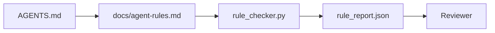

# 실행 가능한 제약 조건으로서의 에이전트 지침

> 산문으로 작성된 지침은 소원에 불과합니다. 제약 조건으로 작성된 지침은 테스트입니다. 워크벤치는 각 규칙을 에이전트가 런타임에 확인할 수 있고, 리뷰어가 사후에 검증할 수 있는 형태로 변환합니다.

**유형:** Build
**언어:** Python (stdlib)
**선수 요건:** 14단계 · 32 (최소 워크벤치)
**시간:** 약 50분

## 학습 목표

- 라우팅 산문과 운영 규칙을 분리하세요.
- 시작 규칙, 금지된 작업, 완료 정의, 불확실성 처리, 승인 경계를 기계가 확인할 수 있는 제약 조건으로 표현하세요.
- 규칙 집합에 대해 실행을 채점하는 규칙 검사기를 구현하세요.
- 규칙 집합을 diff 친화적으로 만들어 리뷰에서 변경 사항을 볼 수 있도록 하세요.

## 문제점

일반적인 `AGENTS.md`는 온보딩 문서처럼 읽힙니다. 에이전트에게 "주의 깊게", "철저히 테스트", "모르면 물어보라"고 지시합니다. 3일 후, 에이전트는 테스트 없이 변경 사항을 출시하고, 금지된 디렉터리에 쓰며, 선이 어디에 있는지 몰랐기 때문에 한 번도 물어보지 않습니다.

지침은 운영적일 때 강력하고, 지향적일 때 약합니다. 해결책은 워크벤치가 해석하고 리뷰어가 채점할 수 있는 규칙을 작성하는 것입니다.

## 개념

규칙은 짧은 루트 라우터에서 멀리 떨어진 `docs/agent-rules.md`에 속합니다. 각 규칙은 이름, 카테고리, 검사를 가집니다.



### 대부분의 규칙을 포괄하는 5가지 카테고리

| 카테고리 | 규칙이 답하는 질문 | 예시 |
|----------|---------------------------|---------|
| 시작 | 작업이 시작되기 전에 무엇이 참이어야 합니까? | "상태 파일이 존재하고 최신 상태" |
| 금지 | 절대 일어나서는 안 되는 것은 무엇입니까? | "`scripts/release.sh`를 편집하지 마세요" |
| 완료 정의 | 작업이 완료되었음을 증명하는 것은 무엇입니까? | "pytest가 0으로 종료되고 허용 라인이 통과" |
| 불확실성 | 에이전트가 확신하지 못할 때 무엇을 합니까? | "추측하는 대신 질문 노트를 열기" |
| 승인 | 무엇이 인간 승인을 필요로 합니까? | "새로운 의존성, 프로덕션 쓰기" |

이 5가지 중 하나에 맞지 않는 규칙은 보통 두 개의 규칙이 되기를 원합니다. 분리를 강제하세요.

### 규칙은 기계가 읽을 수 있는 형태입니다

각 규칙에는 슬러그(slug), 카테고리, 한 줄 설명, 그리고 `rule_checker.py`의 함수 이름을 지정하는 `check` 필드가 있습니다. 규칙을 추가한다는 것은 검사를 추가한다는 의미이며, 검사기는 워크벤치와 함께 확장됩니다.

### 규칙은 diff에 친화적입니다

규칙은 하나의 마크다운 파일에서 각 헤딩 아래에 하나씩 존재합니다. 이름 변경은 diff에서 명확하게 보입니다. 새로운 규칙은 해당 카테고리의 상단에 위치합니다. 오래된 규칙은 주석 처리하지 않고 삭제합니다. 워크벤치가 진실의 원천(source of truth)이기 때문이며, 지난 분기 팀의 감정을 기록한 채팅 로그가 아니기 때문입니다.

### 규칙과 프레임워크 가드레일

프레임워크 가드레일(OpenAI Agents SDK 가드레일, LangGraph 인터럽트)은 런타임 수준에서 규칙을 강제합니다. 이 강의의 규칙 세트는 이러한 가드레일이 구현하는 인간이 읽고 검토할 수 있는 계약(contract)입니다. 두 가지 모두 필요합니다. 런타임은 턴(turn) 중 위반을 포착하고, 규칙 세트는 런타임이 올바른 일을 수행하고 있음을 증명합니다.

### 점진적 공개(Progressive Disclosure): 백과사전이 아닌 지도

`AGENTS.md`가 계속 커지는 이유는 모든 인시던트가 규칙을 추가하고, 어떤 인시던트도 규칙을 제거하지 않기 때문입니다. 1년 후 파일은 2,000줄이 되며, 에이전트는 첫 화면을 읽고 주의력 예산(attention budget)이 고갈되어 지시받은 내용의 일부만 수행합니다. 거대한 지시 파일이 실패하는 이유는 40페이지짜리 온보딩 문서가 실패하는 이유와 같습니다. 독자는 한 번 훑어보고 중요한 부분으로 다시 돌아가지 않기 때문입니다.

해결책은 더 짧은 파일이 아닙니다. 계층화된 파일입니다. 루트 라우터는 매 세션 읽을 수 있을 만큼 작게 유지하며, 포인터만 포함합니다. 깊이는 에이전트가 작업이 관련될 때만 로드하는 주제 파일에 있습니다. 에이전트에게 백과사전 전체가 아닌 지도를 주고, 필요한 페이지로 이동하게 하세요.

```
AGENTS.md                  # 라우터, 50줄 미만: 이 저장소가 무엇인지, 어디를 봐야 하는지, 5가지 엄격한 규칙
docs/
  agent-rules.md           # 전체 규칙 세트(이 강의)
  architecture.md          # 작업이 모듈 경계에 닿을 때 로드
  testing.md               # 작업이 테스트를 작성하거나 실행할 때 로드
  deploy.md                # 출시 작업에만 로드되며, 승인 규칙 뒤에 게이트(gate)되어 있음
feature_list.json          # 백로그(14단계 · 36강)
```

| 계층 | 위치 | 읽는 시점 | 크기 예산 |
|------|----------|-----------|-------------|
| 라우터 | `AGENTS.md` | 매 세션, 항상 | 약 50줄 미만 |
| 규칙 | `docs/agent-rules.md` | 매 세션, 시작 시 | 카테고리당 한 화면 |
| 주제 문서 | `docs/<topic>.md` | 작업이 해당 주제를 다룰 때만 | 필요한 깊이만큼 |

레이어링의 정직성을 유지하기 위해 두 가지 테스트가 필요합니다. 도달성 테스트: 에이전트는 라우터에서 최대 두 단계(hop)로 모든 규칙에 도달할 수 있어야 하므로, 라우터는 모든 주제 문서를 경로로 연결해야 하며 산문으로 설명해서는 안 됩니다. 신선도 테스트: 라우터는 짧아서 리뷰어가 모든 PR에서 다시 읽을 수 있어야 하며, 이것이 라우터가 대체한 백과사전으로 조용히 다시 커지는 것을 막는 유일한 방법입니다. 더 이상 해석되지 않는 포인터는 누락된 규칙보다 더 심각한 실패이므로, 라우터의 깨진 링크 자체가 시작 시 점검 위반입니다.

```figure
wb-rule-checkoff
```

## 구현하기

`code/main.py`가 출시됩니다:

- 규칙을 데이터 클래스로 로드하는 `agent-rules.md` 파서.
- `check` 참조당 하나의 `rule_checker.py` 스타일 검사 함수.
- 두 가지 규칙을 위반하는 데모 에이전트 실행 및 이를 포착하는 검사 통과.

실행해 보세요:

```
python3 code/main.py
```

출력: 파싱된 규칙 집합, 실행 추적, 규칙별 통과/실패, 그리고 스크립트 옆에 저장된 `rule_report.json`.

## 실전에서의 프로덕션 패턴

세 가지 패턴이 한 분기 동안 지속되는 규칙 집합과 일주일 만에 퇴화하는 규칙 집합을 구분합니다.

**작성 시 심각도 태깅.** 모든 규칙은 `severity`을 포함합니다: `block`, `warn` 또는 `info`. 검사기는 세 가지를 모두 보고하며, 런타임은 `block`에서만 거부합니다. 대부분의 팀은 초기에 심각도를 과장한 후 마감 압박 하에 조용히 이를 약화시킵니다. 작성 시 태깅은 초기에 보정을 강제합니다. `block` 규칙의 모든 오버라이드를 `overrides.jsonl` 감사 로그에 서명하는 검증 게이트(14단계 · 38강)와 함께 사용하세요.

**강제 기능으로서의 규칙 만료.** 모든 규칙은 `expires_at` 날짜를 포함합니다(기본값은 작성일로부터 90일). 검사기는 만료되지 않은 규칙이 60일 연속으로 위반이 없을 때 경고합니다. 다음 분기 리뷰에서는 유지하는 것을 정당화하거나, `info`로 약화하거나, 삭제해야 합니다. Cloudflare의 프로덕션 AI 코드 리뷰 데이터(2026년 4월, 30일 동안 5,169개 저장소에서 131,246회 리뷰 실행)에 따르면, 명시적 만료일이 있는 규칙 집합은 저장소당 30개 미만으로 유지된 반면, 만료일이 없는 집합은 80개 이상으로 증가했으며 대부분 발동되지 않았습니다.

**소스는 Markdown, 캐시는 JSON.** `agent-rules.md`은 작성된 파일이며, `agent-rules.lock.json`은 체커가 핫 패스에서 읽는 캐시입니다. 잠금(lock)은 pre-commit hook에 의해 재생성됩니다. Markdown diff는 리뷰가 가능하며, JSON 파싱은 모든 턴에서 제외됩니다. `package.json` / `package-lock.json` 및 `Cargo.toml` / `Cargo.lock`와 동일한 형태입니다.

## 사용하기

프로덕션 환경에서는:

- Claude Code, Codex, Cursor는 세션 시작 시 규칙을 읽고, 작업 거절 시 이를 인용합니다. 체커는 CI에서 규칙을 재실행하여 조용한 드리프트(silent drift)를 잡아냅니다.
- OpenAI Agents SDK 가드레일(Guardrails)은 동일한 검사를 입력 및 출력 가드레일로 등록합니다. Markdown은 문서 표면이고, SDK는 런타임 표면입니다.
- LangGraph 인터럽트(interrupt)는 진행 중인 노드가 규칙을 위반할 때 발생합니다. 인터럽트 핸들러는 규칙을 읽고, 인간에게 질문하며, 재개합니다.

규칙 세트는 Markdown과 함수 이름만으로 구성되므로 세 도구 모두에 이식 가능합니다.

## 출시하기

`outputs/skill-rule-set-builder.md`은 프로젝트 소유자와 인터뷰를 진행하여, 기존 산문형 지침을 다섯 가지 범주로 분류하고, 버전이 지정된 `agent-rules.md`과 체커 스텁(stub)을 생성합니다.

## 연습 문제

1. 제품이 진정으로 필요로 한다면 여섯 번째 범주를 추가해 보세요. 왜 다섯 범주 중 하나로 수렴하지 않는지 방어해 보세요.
2. 체커를 확장하여 규칙이 심각도(`block`, `warn`, `info`)를 가질 수 있게 하고, 보고서를 이에 따라 집계해 보세요.
3. 체커를 CI에 연결해 보세요. 최신 에이전트 실행에서 block-severity 규칙이 실패하면 빌드를 실패로 처리합니다.
4. 규칙마다 "만료(expiry)" 필드를 추가해 보세요. 90일 동안 검사 실패가 없으면 규칙은 리뷰 대상이 됩니다.
5. 실제 `AGENTS.md`을 찾아 다섯 범주 규칙으로 다시 작성해 보세요. 그 줄 중 몇 줄이 운영적(operational)이었으며, 몇 줄이 지향적(aspirational)이었나요?

## 핵심 용어

| 용어 | 사람들이 말하는 것 | 실제 의미 |
|------|----------------|------------------------|
| 운영적 규칙 | "진짜 지침" | 워크벤치가 런타임에 검사할 수 있는 규칙 |
| 지향적 규칙 | "주의하세요" | 검사가 없는 규칙; 삭제하거나 업그레이드해야 함 |
| 완료 정의 | "수락(Acceptance)" | 작업이 완료되었음을 객관적으로 파일로 증명하는 것 |
| 블록 심각도 | "하드 규칙" | 위반 시 실행이 중단되며, 운영자 없이는 무시할 수 없습니다 |
| 규칙 만료 | "오래된 규칙 제거" | N일 동안 위반이 없는 규칙은 폐기 대상이 됩니다 |

## 추가 읽기

- [OpenAI Agents SDK guardrails](https://openai.github.io/openai-agents-python/guardrails/)
- [LangGraph interrupts](https://langchain-ai.github.io/langgraph/how-tos/human_in_the_loop/breakpoints/)
- [Anthropic, Building Effective Agents](https://www.anthropic.com/research/building-effective-agents)
- [Rick Hightower, Agent RuleZ: A Deterministic Policy Engine](https://medium.com/@richardhightower/agent-rulez-a-deterministic-policy-engine-for-ai-coding-agents-9489e0561edf) — 프로덕션에서의 블록/경고/정보 심각도
- [Cloudflare, Orchestrating AI Code Review at Scale](https://blog.cloudflare.com/ai-code-review/) — 131k 리뷰 실행, 규칙 구성에 대한 교훈
- [microservices.io, GenAI development platform — part 1: guardrails](https://microservices.io/post/architecture/2026/03/09/genai-development-platform-part-1-development-guardrails.html) — 규칙과 CI 간의 심층 방어
- [Type-Checked Compliance: Deterministic Guardrails (arXiv 2604.01483)](https://arxiv.org/pdf/2604.01483) — 규칙을 체크로 사용하는 상한선으로서의 Lean 4
- [logi-cmd/agent-guardrails](https://github.com/logi-cmd/agent-guardrails) — 병합 게이트 구현: 범위, 변형 테스트, 위반 예산
- 14단계 · 38강 — 이 규칙 세트가 적용되는 최소 작업대
- 14단계 · 38강 — 규칙 보고서를 소비하는 검증 게이트
- 14단계 · 39강 — 규칙 준수 점수를 매기는 리뷰어 에이전트
