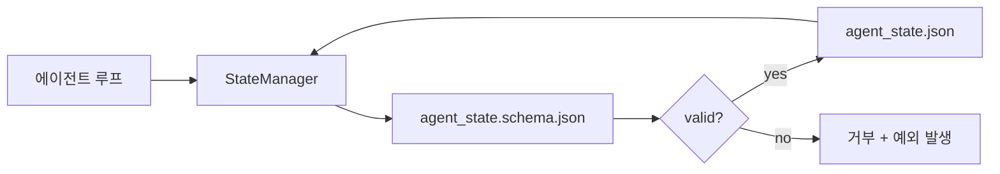

# 저장소 메모리와 내구성 있는 상태

> 채팅 기록은 휘발성입니다. 저장소는 내구성 있습니다. 워크벤치는 에이전트 상태를 버전 관리된 파일에 저장하므로, 다음 세션, 다음 에이전트, 그리고 다음 리뷰어 모두 동일한 진실의 원천(source of truth)에서 읽습니다.

**유형:** Build
**언어:** Python (stdlib + `jsonschema` 선택적)
**선수 요건:** 14단계 · 32 (Minimal Workbench)
**시간:** 약 60분

## 학습 목표

- 저장소 메모리에 포함해야 할 것과 채팅 기록에 포함해야 할 것을 정의해 보세요.
- `agent_state.json` 및 `task_board.json`에 대한 JSON 스키마를 작성해 보세요.
- 상태를 로드, 검증, 변경 및 원자적으로 지속하는 상태 관리자를 구축해 보세요.
- 스키마를 사용하여 워크벤치를 손상시키기 전에 잘못된 쓰기를 거부해 보세요.

## 문제점

에이전트가 세션을 완료합니다. 채팅이 닫힙니다. 다음 세션이 열리고 시작 위치를 묻습니다. 모델은 "파일을 확인해 보겠습니다"라고 말하고, 오래된 노트를 읽으며, 이미 완료된 작업을 다시 수행합니다. 또는 더 나쁜 경우, 파일이 완료되었다는 사실을 아무도 알려주지 않아 완료된 파일을 다시 작성합니다.

워크벤치에 대한 해결책은 저장소 메모리입니다: 상태는 저장소 내 JSON 파일에 스키마에 따라 기록되고, 원자적으로 지속되며, 코드 리뷰에서 diff 친화적입니다. 채팅은 일시적인 피드이며, 저장소가 공식 기록 시스템(system of record)입니다.

## 개념



### 저장소 메모리에 포함해야 할 것

| 포함 | 포함하지 않음 |
|---------|-----------------|
| 활성 작업 ID | 원시 채팅 기록 |
| 이번 세션에서 건드린 파일 | 토큰 단위 추론 추적 |
| 에이전트가 한 가정 | "사용자가 좌절해 보였다" |
| 열려 있는 차단 요인 | 샘플링된 완성 |
| 다음 행동 | 벤더별 모델 ID |

테스트 기준은 내구성입니다: 3개월 후 CI 재실행에서 유용할까요? 예라면 저장소로, 아니라면 텔레메트리로 이동합니다.

### 스키마 우선 상태

JSON 스키마는 계약입니다. 스키마가 없으면 모든 에이전트가 새로운 필드를 발명하고, 모든 리뷰어가 새로운 형태를 학습해야 하며, 모든 CI 스크립트가 이전 버전에 대해 특수 처리를 해야 합니다. 스키마가 있으면, 잘못된 쓰기는 거부된 쓰기가 됩니다.

스키마는 다음을 포함합니다:

- 필수 키.
- 허용된 `status` 값.
- 금지된 값 (예: 배열에 대한 `null`).
- 패턴 제약 조건 (작업 ID가 `T-\d{3,}`과 일치해야 함).
- 마이그레이션을 위한 버전 필드.

### 원자적 쓰기

상태 쓰기는 부분 실패를 견뎌야 합니다: 임시 파일에 쓰고, fsync를 수행한 후, 대상 파일로 이름을 변경하세요. 상태 파일은 진실의 원천(source of truth)입니다. 반쯤 쓰여진 파일은 파일이 없는 것보다 더 나쁜 상태입니다.

### 마이그레이션

스키마가 변경되면, 스키마 버전 상향과 함께 마이그레이션 스크립트를 배포하세요. 상태 파일은 `schema_version` 필드를 포함합니다. 매니저는 마이그레이션할 수 없는 버전의 파일을 로드하는 것을 거부합니다.

```figure
wb-state-persist
```

## 구현하기

`code/main.py`는 다음을 구현합니다:

- `agent_state.schema.json` 및 `task_board.schema.json`.
- 표준 라이브러리 전용 검증기 (JSON Schema의 하위 집합: required, type, enum, pattern, items).
- 원자적 임시 파일 생성 및 이름 변경 쓰기를 수행하는 `StateManager.load`, `StateManager.update`, `StateManager.commit`.
- 상태를 변경하고, 저장하며, 다시 로드하고, 왕복 왕복(round-trip)을 증명하는 데모.

실행하세요:

```
python3 code/main.py
```

스크립트는 `workdir/agent_state.json`과 `workdir/task_board.json`을 쓰고, 두 턴에 걸쳐 이를 변경하며, 각 단계에서 검증된 상태를 출력합니다.

## 실전에서의 프로덕션 패턴

네 가지 패턴은 강의의 최소 요구 사항을 다중 에이전트 모노레포가 견딜 수 있는 것으로 만듭니다.

**원자적 임시 파일 생성 및 이름 변경은 선택 사항이 아닙니다.** 2026년 3월 Hive 프로젝트의 버그 보고서는 실패 모드를 명확하게 문서화했습니다: `state.json`은 `write_text()`을 통해 쓰여졌으며, 예외는 잡혀서 조용히 무시되었습니다. 부분 쓰기는 신호 없이 손상된 상태로 세션을 재개하게 만들었습니다. 해결책은 항상 다음과 같습니다: 대상과 같은 디렉토리에 `tempfile.mkstemp`을 생성하고, 쓰고, `fsync`을 수행한 후, `os.replace`을 수행하세요 (POSIX 및 Windows에서 원자적 이름 변경). 이 강의의 `atomic_write`는 정확히 이를 수행합니다.

**모든 비멱등(non-idempotent) 도구 호출에 멱등성 키를 사용하세요.** 에이전트가 도구 호출 후 결과를 체크포인팅하기 전에 크래시하면, 복구 시 도구 호출을 재시도합니다. 읽기 작업은 안전하지만, 이메일, DB 삽입, 파일 업로드에는 위험합니다. 패턴: 실행 전에 모든 도구 호출 ID를 `pending_calls.jsonl`에 기록하세요. 재시도 시 ID를 확인하고, 존재하면 호출을 건너뛰고 캐시된 결과를 사용하세요. Anthropic과 LangChain 모두 2026 가이드에서 이 점을 명시했으며, LangGraph의 체크포인터도 같은 이유로 대기 중인 쓰기(pending writes)를 지속합니다.

**대형 아티팩트를 상태(state)와 분리하세요.** CSV, 긴 트랜스크립트, 생성된 파일을 `agent_state.json`에 저장하지 마세요. 아티팩트를 별도 파일로 저장하거나(또는 객체 스토리지에 업로드하고) 상태에는 경로만 유지하세요. 체크포인트는 작고 빠르게 유지되며, 아티팩트는 독립적으로 증가합니다.

**감사를 위해 이벤트 소싱, 재개를 위해 스냅샷을 사용하세요.** 모든 변경 시 이벤트 로그(`state.events.jsonl`)에 추가하고, 주기적으로 `state.json`에 스냅샷을 저장하세요. 재개 시 스냅샷을 읽고, 스냅샷 타임스탬프 이후의 이벤트를 재생(replay)합니다. 디스크 비용은 더 들지만 에이전트 결정을 그대로 재생할 수 있어, 장기 실행(long-horizon runs) 디버깅에 필수적입니다. Postgres가 내부적으로 WAL에 사용하는 것과 동일한 형태입니다.

**스키마 마이그레이션을 수행하거나 로드를 거부하세요.** `schema_version` 정수가 계약(contract)입니다. 매니저가 알 수 없는 버전의 파일을 로드할 경우 읽기를 거부합니다. 스키마 버전 상향(bump)과 함께 마이그레이션 스크립트를 배포하세요; `tools/migrate_state.py`은 모든 시작 시 멱등적으로 실행됩니다.

## 사용하기

프로덕션에서는:

- **LangGraph 체크포인터.** 동일한 개념, 다른 저장소. 체크포인터는 그래프 상태를 SQLite, Postgres, 또는 커스텀 백엔드에 지속합니다. 이 강의에서 가르치는 스키마는 체크포인터가 죽었을 때 상태를 수동으로 읽어야 할 때 사용하는 것입니다.
- **Letta 메모리 블록.** 구조화된 스키마를 가진 지속 블록(14단계 · 08강). 장기 실행 페르소나에 동일한 규율을 적용합니다.
- **OpenAI Agents SDK 세션 스토어.** 플러그형 백엔드, 스키마 인식. 이 강의의 상태 파일은 로컬 파일 백엔드입니다.

## 출시하기

`outputs/skill-state-schema.md`는 프로젝트별 JSON Schema 쌍(상태 + 보드), 원자적 쓰기(atomic writes)에 연결된 Python `StateManager`, 그리고 다음 스키마 버전 상향 시 워크벤치가 깨지지 않도록 하는 마이그레이션 스캐폴드를 생성합니다.

## 연습 문제

1. `last_human_touch` 타임스탬프를 추가하세요. 사람이 편집한 후 5초 이내의 에이전트 쓰기는 거부하세요.
2. 검증기를 확장하여 `oneOf`를 지원하세요. 이렇게 하면 작업이 빌드 작업이든 리뷰 작업이든 서로 다른 필수 필드를 가질 수 있습니다.
3. `schema_version` 필드를 추가하고 v1에서 v2로 마이그레이션을 작성하세요 (`blockers`를 `risks`로 이름 변경).
4. 저장 백엔드를 로컬 파일에서 SQLite로 이동하세요. `StateManager` API는 동일하게 유지하세요.
5. 50ms 쓰기 경쟁이 있는 동일한 상태 파일에 두 에이전트를 실행하세요. 무엇이 잘못되며, 원자적 이름 변경이 어떻게 당신을 구제하나요?

## 핵심 용어

| 용어 | 사람들이 말하는 것 | 실제 의미 |
|------|----------------|------------------------|
| 저장소 메모리 | "메모 파일" | 스키마에 따라 저장소 내 추적된 파일에 저장된 상태 |
| 스키마 우선 | "입력 검증" | 작성자보다 먼저 계약을 정의하고, 드리프트를 거부 |
| 원자적 쓰기 | "단순히 이름 변경" | 임시 파일에 쓰고, fsync하고, 이름 변경하여 부분 실패가 손상을 일으키지 못하게 함 |
| 마이그레이션 | "스키마 버전 상향" | vN 상태를 v(N+1) 상태로 변환하는 스크립트 |
| 기록 시스템 | "진실의 원천" | 작업대가 권위 있는 것으로 취급하는 산출물 |

## 추가 읽기

- [JSON Schema specification](https://json-schema.org/specification.html)
- [LangGraph checkpointers](https://langchain-ai.github.io/langgraph/concepts/persistence/)
- [Letta memory blocks](https://docs.letta.com/v1-sdk/memory/memory-blocks)
- [Fast.io, AI Agent State Checkpointing: A Practical Guide](https://fast.io/resources/ai-agent-state-checkpointing/) — 멱등성을 갖춘 스키마 우선 체크포인팅
- [Fast.io, AI Agent Workflow State Persistence: Best Practices 2026](https://fast.io/resources/ai-agent-workflow-state-persistence/) — 동시성 제어, TTL, 이벤트 소싱
- [Hive Issue #6263 — non-atomic state.json writes silently ignored](https://github.com/aden-hive/hive/issues/6263) — 실제 프로젝트에서의 실패 모드
- [eunomia, Checkpoint/Restore Systems: Evolution, Techniques, Applications](https://eunomia.dev/blog/2025/05/11/checkpointrestore-systems-evolution-techniques-and-applications-in-ai-agents/) — OS 역사에서 에이전트에 적용된 CR 원시 요소
- [Indium, 7 State Persistence Strategies for Long-Running AI Agents in 2026](https://www.indium.tech/blog/7-state-persistence-strategies-ai-agents-2026/)
- [Microsoft Agent Framework, Compaction](https://learn.microsoft.com/en-us/agent-framework/agents/conversations/compaction) — 벤더 체크포인트 관리자
- 14단계 · 08 — 메모리 블록과 수면 시간 계산
- 14단계 · 32 — 이 강의가 스키마화하는 최소 3개 파일
- 14단계 · 40 — 동일한 스키마에서 읽는 핸드오프 패킷
