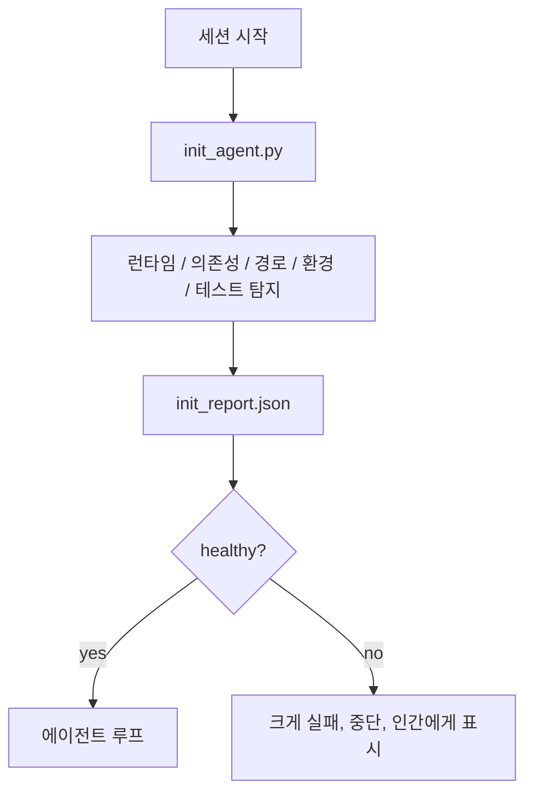

# 에이전트용 초기화 스크립트

> 모든 세션이 차갑게 시작할 때마다 비용을 치릅니다. 에이전트는 같은 파일을 읽고, 같은 탐지를 재시도하며, 같은 경로를 다시 발견합니다. 초기화 스크립트는 이 비용을 한 번만 치르고, 그 답을 상태에 기록합니다.

**유형:** Build
**언어:** Python (stdlib)
**선수 요건:** 14단계 · 32강 (최소 작업대), 14단계 · 34강 (저장소 메모리)
**시간:** 약 45분

## 학습 목표

- 에이전트가 세션마다 다시 수행해야 하는 작업을 식별해 보세요.
- 런타임, 의존성, 저장소 상태를 탐지하는 결정적 초기화 스크립트를 구축해 보세요.
- 탐지 결과를 저장하여 에이전트가 검사를 다시 실행하는 대신 이를 읽도록 해 보세요.
- 초기화가 실패할 때 크게, 빠르게, 그리고 한 곳에서 확인할 수 있도록 실패하게 해 보세요.

## 문제점

세션을 열면 에이전트는 Python 버전을 추측합니다. 테스트 명령을 추측합니다. 진입점을 찾기 위해 저장소 루트를 다섯 번 나열합니다. 설치되지 않은 패키지를 가져오려고 시도합니다. 설정 파일이 어디에 있는지 사용자에게 묻습니다. 실제 편집을 시작할 때쯤이면, 단일 스크립트로 처리해야 할 설정 작업에 만 개의 토큰이 소진됩니다.

해결책은 에이전트가 다른 모든 작업을 수행하기 전에 실행되는 하나의 초기화 스크립트이며, 이 스크립트는 에이전트가 시작 시 읽는 `init_report.json`을 기록합니다.

## 개념



### 초기화 스크립트가 탐지하는 항목

| 탐지 항목 | 중요성 |
|-------|----------------|
| 런타임 버전 | 잘못된 Python 또는 Node 버전은 조용한 버전 오류 버그를 의미합니다 |
| 의존성 가용성 | 나중에 누락된 패키지는 지금 잡는 비용의 10배가 됩니다 |
| 테스트 명령 | 에이전트는 검증 방법을 알아야 합니다. 명령이 없으면 작업대가 고장 난 것입니다 |
| 저장소 경로 | 하드코딩된 경로는漂移(drift)합니다. 한 번만 해석하고 고정하세요 |
| 환경 변수 | `OPENAI_API_KEY`이 누락되면 실패 표면이 되며, 런타임 미스터리가 아닙니다 |
| 상태 + 보드 최신성 | 크래시된 세션의 오래된 상태는 함정입니다 |
| 마지막 알려진 좋은 커밋 | 세션 종료 시 핸드오프 diff의 앵커입니다 |

### 큰 소리로, 빠르게, 한 곳에서 실패하세요

프로브 실패는 중단과 인간에게 알리는 것을 의미합니다. "에이전트가 알아서 처리할 것"이라는 식은 없습니다. init의 핵심은 작업대가 고장났을 때 시작을 거부하는 것입니다.

### 멱등성(Idempotency)

두 번 연속 실행해 보세요. 두 번째 실행은 새로운 타임스탬프를 제외하고는 아무 작업도 하지 않아야(no-op) 합니다. 멱등성(Idempotency) 덕분에 스크립트를 CI, 훅(hook), 또는 사전 작업 슬래시 명령에 연결할 수 있습니다.

### init와 시작 규칙 비교

규칙(14단계 · 33강)은 행동하기 위해 참이어야 하는 조건을 설명합니다. init은 이러한 규칙을 확인할 수 있도록 설정하는 스크립트입니다. init 없는 규칙은 "주의하세요"가 되고, 규칙 없는 init은 세련된 실패가 됩니다.

```figure
wb-init-probes
```

## 구현하기

`code/main.py`는 `init_agent.py`을 구현합니다:

- 5개의 프로브: Python 버전, `importlib.util.find_spec`를 통한 나열된 의존성, 테스트 명령 해석 가능성, 필수 환경 변수, 상태 파일 최신성.
- 각 프로브는 `(name, status, detail)`를 반환합니다.
- 스크립트는 전체 프로브 세트와 함께 `init_report.json`를 작성하며, 차단 심각도(block-severity) 프로브가 하나라도 실패하면 비-0(non-zero)으로 종료합니다.

실행해 보세요:

```
python3 code/main.py
```

스크립트는 프로브 테이블을 출력하고, `init_report.json`를 작성하며, 정상 경로에서는 0으로 종료하거나 실패한 프로브 목록과 함께 비-0(non-zero)으로 종료합니다.

## 실제 환경에서의 프로덕션 패턴

3가지 패턴이 유용한 init 스크립트와 의식(ceremony)을 구분합니다.

**마지막 알려진 좋은 커밋 앵커링.** 마지막 성공적인 병합 시 작성된 `LKG` 파일과 현재 커밋을 비교해 보세요. diff가 예산(기본값 50개 파일)을 초과하면 시작을 거부하고 인간이 새로운 기준선을 비준(ratify)하도록 요구합니다. Cloudflare의 AI Code Review는 리뷰어 에이전트(Reviewer Agent)의 범위를 설정하기 위해 이 방식을 사용하며, 모든 리뷰 세션은 동일한 마지막 알려진 좋은 커밋을 앵커로 삼고 세션 간 드리프트(drift)가 누적되지 않도록 합니다.

**TTL이 있는 잠금 파일.** 첫 번째 프로브 통과가 성공한 후 `prereqs.lock`을 작성합니다. 이후 실행에서는 N시간(기본값 24시간) 동안 잠금을 신뢰하고 비싼 프로브를 건너뜁니다. init 스크립트는 잠금을 먼저 읽습니다. 잠금이 최신이고 의존성 매니페스트 해시가 일치하면 즉시 중단(short-circuit)합니다. 이는 Docker가 레이어 캐시에 사용하는 패턴과 동일합니다: 멱등성 있는 프로브 + 콘텐츠 해시 = 건너뛰기.

**네트워크 없음, LLM 없음, 핫 패스에 놀라움 없음.** init 프로브는 결정적인(plumbing) 작업입니다. 실패를 분류하기 위해 LLM을 호출하거나 라이선스를 확인하기 위해 외부 서비스에 접속하는 프로브는 프로브가 아니라 워크플로입니다. dry run에서 프로브가 3초 이상 걸린다면, 이를 워크벤치 냄새(workbench smell)로 간주하고 init에서 제거하거나 결과를 캐시하세요.

## 사용하기

프로덕션에서는:

- **Claude Code 훅.** `pre-task` 훅은 init 스크립트를 호출하며, 실패하면 에이전트(Agent)의 실행을 거부합니다.
- **GitHub Actions.** `setup-agent` 작업이 init 스크립트를 실행합니다. 에이전트(Agent) 작업은 이 작업에 의존합니다.
- **Docker 엔트리포인트.** 에이전트(Agent) 컨테이너는 에이전트(Agent) 런타임을 exec하기 전에 init 스크립트를 실행합니다. 실패 시 로그가 표시됩니다.

init 스크립트는 특정 프레임워크에 대한 호출을 하지 않으므로 이식성이 있습니다. Bash, Make, 또는 tasks 파일 모두 이를 래핑할 수 있습니다.

## 출시하기

`outputs/skill-init-script.md`은 프로젝트를 인터뷰하고, 설정 작업을 프로브로 분류하며, 프로젝트 전용 `init_agent.py`과 에이전트(Agent) 단계 실행 전에 이를 실행하는 CI 워크플로를 생성합니다.

## 연습 문제

1. 현재 커밋을 마지막 잘 알려진 커밋(last-known-good commit)과 비교(diff)하고, 변경된 파일이 50개 이상이면 시작을 거부하는 프로브를 추가하세요.
2. 스크립트가 `prereqs.lock` 파일을 작성하고, 잠금이 7일 이상 오래되면 시작을 거부하도록 연결하세요.
3. 누락된 개발(dev) 의존성을 자동 설치하되, 승인 없이 런타임 의존성을 수정하지 않는 `--fix` 플래그를 추가하세요.
4. 프로브를 하드코딩된 함수에서 YAML 레지스트리로 이동하세요. 트레이드오프(trade-off)를 방어하세요.
5. 프로브마다 시간 예산을 추가하세요. 3초 이상 실행되는 프로브는 워크벤치 냄새(workbench smell)입니다.

## 핵심 용어

| 용어 | 사람들이 말하는 것 | 실제 의미 |
|------|----------------|------------------------|
| 프로브 | "검사" | `(name, status, detail)`을 반환하는 결정적 함수 |
| 초기화 보고서 | "설정 출력" | 프로브 결과와 함께 상태 파일 옆에 기록된 JSON |
| 멱등성(Idempotency) | "재실행 안전" | 연속 두 번 실행해도 타임스탬프를 제외하고 동일한 보고서를 생성 |
| 명시적 실패 | "침묵 금지" | 중단하고 인간에게 알림; 조용한 폴백 없음 |
| 설정 비용 | "부트스트랩 비용" | 에이전트(Agent)가 매 세션마다 자명한 것을 재발견하는 데 소비하는 토큰 |

## 추가 읽기

- [Anthropic, Effective harnesses for long-running agents](https://www.anthropic.com/engineering/effective-harnesses-for-long-running-agents)
- [GitHub Actions, composite actions for setup](https://docs.github.com/en/actions/sharing-automations/creating-actions/creating-a-composite-action)
- [microservices.io, GenAI dev platform: guardrails](https://microservices.io/post/architecture/2026/03/09/genai-development-platform-part-1-development-guardrails.html) — 커밋 전 + CI 검사를 초기화로서 사용
- [Augment Code, How to Build Your AGENTS.md (2026)](https://www.augmentcode.com/guides/how-to-build-agents-md) — 초기화 기대값
- [Codex Blog, Codex CLI Context Compaction](https://codex.danielvaughan.com/2026/03/31/codex-cli-context-compaction-architecture/) — 압축 인식 초기화로서 세션 시작
- 14단계 · 33강 — 이 스크립트가 활성화하는 규칙 세트
- 14단계 · 34강 — 이 스크립트가 시드하는 상태 파일
- 14단계 · 38강 — 초기화 스크립트가 공급하는 검증 게이트(Verification Gate)
- 14단계 · 40강 — 초기화 보고서의 마지막 알려진 정상(last-known-good)을 소비하는 핸드오프(Handoff)
