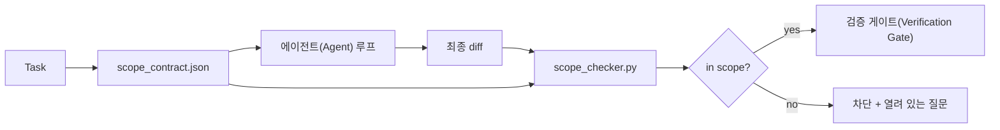

# 범위 계약과 작업 경계

> 모델은 작업이 어디에서 끝나는지 알지 못합니다. 범위 계약은 작업이 어디서 시작하고, 어디서 끝나며, 범위를 넘칠 경우 어떻게 롤백(Rollback)할지 명시하는 작업별 파일입니다. 이 계약은 "범위를 유지하라"는 바람을 체크로 바꿉니다.

**유형:** Build
**언어:** Python (stdlib)
**선수 요건:** 14단계 · 32강 (Minimal Workbench), 14단계 · 33강 (Rules as Constraints)
**시간:** 약 50분

## 학습 목표

- 에이전트(Agent)가 작업 시작 시 읽고, 검증자가 작업 종료 시 읽는 범위 계약을 작성해 보세요.
- 허용된 파일, 금지된 파일, 수용 기준, 롤백(Rollback) 계획, 승인 경계를 지정해 보세요.
- diff를 계약과 비교하고 위반을 표시하는 범위 체크어를 구현해 보세요.
- 범위 초과를 가시적이고, 자동화되며, 검토 가능한 상태로 만들어 보세요.

## 문제점

에이전트(Agent)는 범위를 넘칩니다. 작업이 "로그인 버그 수정"이라고 가정해 보세요. diff가 로그인 라우트, 이메일 헬퍼, 데이터베이스 드라이버, README, 릴리스 스크립트를 건드립니다. 각 변경은 당시에는 그럴듯한 이유가 있었습니다. 하지만 합쳐지면 검토된 변경과 다른 변경이 됩니다.

범위 초과는 에이전트(Agent) 작업에서 가장 감시가 소홀한 실패 모드입니다. 에이전트(Agent)가 각 단계를 성실하게 서술하기 때문입니다. 해결책은 더 엄격한 프롬프트가 아닙니다. 해결책은 디스크에 있는 계약으로, 약속된 내용을 명시하고 결과를 약속과 비교하는 체크가 필요합니다.

## 개념



### 범위 계약에 포함할 내용

| 필드 | 목적 |
|-------|---------|
| `task_id` | 보드上の 작업과 연결 |
| `goal` | 리뷰어가 검증할 수 있는 한 문장 |
| `allowed_files` | 에이전트(Agent)가 작성할 수 있는 glob |
| `forbidden_files` | 실수로라도 건드려서는 안 되는 glob |
| `acceptance_criteria` | 완료됨을 증명하는 테스트 명령어 또는 단정문 |
| `rollback_plan` | 중단이 필요할 경우 운영자가 실행할 수 있는 한 단락 |
| `approvals_required` | 명시적 인간 승인(sign-off)이 필요한 범위 밖의 작업 |

`forbidden_files`이 없는 계약은 불완전합니다. 부정적 공간(negative space)은 계약의 절반입니다.

### 원시 경로가 아닌 글롭(glob) 사용

실제 저장소는 파일을 이동합니다. 계약은 글롭(`app/**/*.py`, `tests/test_signup*.py`)에 고정하여 세션 간 리팩토링이 계약을 무효화하지 않도록 하세요.

### 롤백은 범위의 일부

롤백 방법을 나열하면 계약 작성자가 무엇이 잘못될 수 있는지 고려하게 됩니다. 롤백할 수 없는 계약은 승인되지 않아야 하는 계약입니다.

### 범위 체크는 diff 체크

에이전트(Agent)는 diff를 작성합니다. 체크어는 diff, 허용된 글롭, 금지된 글롭, 실행된 수용 명령 목록을 읽습니다. 각 위반은 검증 게이트(Verification Gate)가 거부할 수 있는 태그가 지정된 발견 사항입니다.

### 범위의 두 높이: 기능 목록과 작업 계약

범위 계약은 하나의 작업을 제한합니다. 프로젝트 전체를 제한하지는 않습니다. 에이전트(Agent)는 로그인 수정에 대해 계약 내에 완벽하게 머무를 수 있지만, 다음 턴에서 프로젝트에 설정 페이지, 다크 모드 토글, 라우터 재작성이 필요하다고 결정할 수 있습니다. 계약은 프로젝트 범위에서 어떤 작업이 포함되는지 묻지 않았으며, 작업 범위에서 어떤 파일이 포함되는지 묻지 않았습니다.

두 번째 높이에는 자체적인 원시 요소가 필요합니다. 에이전트(Agent)가 세션 시작 시 읽는 `feature_list.json`입니다. 이는 기계가 읽을 수 있고 순서가 지정된 파일 형태의 프로젝트 백로그입니다. 에이전트(Agent)는 `status`이 `todo`인 기능을 정확히 하나 선택하고, `id`을 활성 범위 계약에 기록하며, 같은 세션에서 두 번째 기능을 시작하는 것이 금지됩니다. "한 번에 하나의 기능"은 에이전트(Agent)가 합리화하여 넘어갈 수 있는 프롬프트의 한 줄이 아니라, 디스크에서 읽는 값과 게이트가 강제하는 체크가 됩니다.

```json
{
  "project": "knowledge-base",
  "active": "import-pdf",
  "features": [
    { "id": "import-pdf",   "status": "in_progress", "goal": "import a PDF into the library",        "done_when": "pytest tests/test_import.py && a sample PDF appears in the library view" },
    { "id": "full-text-search", "status": "todo",     "goal": "search document text and rank hits",   "done_when": "query returns ranked results with snippets" },
    { "id": "cite-answers", "status": "todo",         "goal": "answers carry source citations",        "done_when": "every answer renders at least one clickable citation" }
  ]
}
```

| 필드 | 목적 |
|-------|---------|
| `active` | 현재 세션이 건드릴 수 있는 단일 기능; 비어 있으면 하나를 선택하여 설정 |
| `features[].id` | 범위 계약의 `task_id`이 가리키는 안정적 슬러그(slug) |
| `features[].status` | `todo`, `in_progress`, `done`, `blocked`; 한 번에 하나의 `in_progress`만 가능 |
| `features[].goal` | 리뷰어(reviewer)가 검증할 수 있는 한 문장 |
| `features[].done_when` | `in_progress`을 `done`로 전환하는 허용 기준선 |

두 가지 규칙이 목록을 장식으로가 아닌 핵심 요소로 만듭니다. 첫째, "`in_progress`이 최대 하나"라는 불변 조건 자체가 시작 시 점검 항목입니다 (14단계 · 33강): 목록에 두 개가 표시되면 사람이 해결할 때까지 세션이 시작되지 않습니다. 둘째, 기능 목록은 채팅 메시지가 아닌 파일입니다. 채팅은 컨텍스트에서 사라지지만, 파일은 세션과 에이전트를 초월하여 지속되기 때문입니다. 핸드오프 (14단계 · 40강)는 완료된 기능의 상태를 `done`에 기록하여, 다음 세션이 남은 작업을 다시 유추하는 대신 정확한 보드 상태로 열리도록 합니다.

계약과 목록은 최소 권한 원칙에 따라 결합됩니다. 아래에 설명된 것과 동일한 병합 방식입니다. 작업 계약의 `allowed_files`는 활성 기능이 다루는 범위 안에 있어야 하며, 절대 그 밖으로 나가지 않아야 합니다.

```figure
wb-scope-bounce
```

## 구현하기

`code/main.py`이 구현하는 내용:

- `scope_contract.json` 스키마 (JSON Schema의 하위 집합, 글로브 배열).
- 접촉된 파일 목록과 실행 명령 목록을 `RunSummary`으로 변환하는 diff 파서.
- 계약에 대해 `(violations, in_scope, off_scope)`을 반환하는 `scope_check`.
- 두 가지 데모 실행: 하나는 범위를 유지하고, 다른 하나는 범위를 벗어납니다. 체커가 범위를 벗어난 부분을 정확한 파일과 이유와 함께 표시합니다.

실행해 보세요:

```
python3 code/main.py
```

출력: 계약, 두 실행 결과, 실행별 판정, 그리고 저장된 `scope_report.json`.

## 실전에서의 프로덕션 패턴

"스펙스맥싱"(에이전트를 호출하기 전에 YAML로 범위 계약을 작성하는 방식)을 실행하는 실무자는 에이전트를 변경하지 않고도 3주 만에 토끼굴 비율이 52%에서 21%로 감소했다고 보고합니다. 모델이 아니라 계약이 역할을 수행한 것입니다. 세 가지 패턴이 이 성과를 유지하게 합니다.

**이진 실패가 아닌 위반 예산.** `agent-guardrails` (Claude Code, Cursor, Windsurf, Codex가 MCP를 통해 사용하는 OSS 병합 게이트)는 작업별로 `violationBudget`을 제공합니다. 예산 내의 사소한 범위 이탈은 경고로 표시되며, 예산을 초과할 때만 병합 게이트가 거부합니다. `violationSeverity: "error" | "warning"`과 함께 사용하세요. 예산은 출시되는 게이트와 팀이 싫어해서 비활성화되는 게이트의 차이입니다.

**경로 계열별 심각도 비대칭.** `docs/**`에 대한 범위 밖 쓰기는 보통 `warn`입니다. `scripts/**`, `migrations/**`, `config/prod/**`에 대한 범위 밖 쓰기는 항상 `block`입니다. 이 비대칭은 프로젝트별이며 작업마다 변하기 때문에, 런타임이 아닌 계약에 포함해야 합니다.

**파일 예산 옆에 시간 및 네트워크 예산.** `time_budget_minutes` 필드는 벽시계 시간을 제한합니다. 런타임은 재승인 없이 이 시간을 초과하면 계속 진행하지 않습니다. 호스트 이름에 대한 `network_egress` 허용 목록은 에이전트가 작업에 포함되지 않은 외부 API를 조용히 호출하는 것을 방지합니다. 이것들도 범위 차원입니다. 파일 글롭은 필요하지만 충분하지 않습니다.

**다중 계약 병합 의미론 (최소 권한).** 두 범위 계약이 적용될 때 (예: 프로젝트 전체 계약과 작업별 계약), 병합은 다음과 같습니다: `allowed_files`는 **교집합** (두 계약 모두 경로 허용), `forbidden_files`는 **합집합** (둘 중 하나가 금지 가능), `time_budget_minutes`는 가장 restrictive (min), `approvals_required`는 누적됩니다. `network_egress`는 강제 없음에 `None`, 전체 금지에 `[]`, 허용 목록에 `[...]`입니다. 병합 시 `None`는 다른 쪽에 양보하고, 두 목록은 교집합하며, 전체 금지는 전체 금지를 유지합니다. 병합이 기계적이고 검토 가능하도록 계약 스키마에 명시하세요.

## 사용하기

프로덕션 패턴:

- **Claude Code 슬래시 명령.** `/scope` 명령은 계약을 작성하고 세션 컨텍스트로 고정합니다. 하위 에이전트는 행동하기 전에 계약을 읽습니다.
- **GitHub PR.** 계약을 PR 본문에 JSON 파일로 푸시하거나 체크된 아티팩트로 푸시합니다. CI는 병합 diff에 대해 범위 검사기를 실행합니다.
- **LangGraph 인터럽트.** 범위 위반은 인터럽트를 트리거합니다. 핸들러는 인간에게 계약이 확장되어야 하는지, 에이전트가 후퇴해야 하는지 묻습니다.

계약은 작업과 함께 이동합니다. 작업이 종료되면 계약은 `outputs/scope/closed/` 아래에 아카이브됩니다.

## 출시하기

`outputs/skill-scope-contract.md`는 작업 설명에 대한 범위 계약과 모든 에이전트 diff에 대해 CI에서 실행되는 글롭 인식 검사기를 생성합니다.

## 연습 문제

1. 허용된 외부 호스트를 나열하는 `network_egress` 필드를 추가하세요. 다른 호스트를 건드리는 실행은 거부하세요.
2. 검사기를 `docs/**`에 대해 소프트 실패, `scripts/**`에 대해 하드 실패하도록 확장하세요. 비대칭을 정당화하세요.
3. `goal` 필드를 정적 규칙 집합(LLM 없음)으로 `allowed_files`에서 파생되도록 계약을 만드세요. 첫 번째 엣지 케이스에서 무엇이 잘못됩니까?
4. `time_budget_minutes`을 추가하고, 벽 시계(wall clock)가 이를 초과하면 계속 진행하지 않도록 거부하세요.
5. 동일한 diff에 대해 두 개의 계약을 실행하세요. 둘 다 적용될 때 올바른 병합 semantics는 무엇입니까?

## 핵심 용어

| 용어 | 사람들이 말하는 것 | 실제 의미 |
|------|----------------|------------------------|
| 범위 계약(Scope Contract) | "작업 브리프" | 허용/금지 파일, 수용 기준, 롤백을 나열한 작업별 JSON |
| 범위 확장(Scope creep) | "그것도 건드렸어..." | 계약 밖의 파일이 동일한 작업에서 변경됨 |
| 롤백 계획(Rollback plan) | "되돌릴 수 있어" | 중단을 위한 한 단락의 운영자 런북 |
| 승인 경계(Approval boundary) | "서명 필요" | 계약에서 명시적인 인간 승인이 필요하다고 나열된 행동 |
| diff 검사(Diff check) | "경로 감사" | 계약의 glob 패턴과 건드린 파일을 비교 |

## 추가 읽기

- [LangGraph human-in-the-loop interrupts](https://langchain-ai.github.io/langgraph/concepts/human_in_the_loop/)
- [OpenAI Agents SDK tool approval policies](https://platform.openai.com/docs/guides/agents-sdk)
- [logi-cmd/agent-guardrails — merge gates and scope validation](https://github.com/logi-cmd/agent-guardrails) — 위반 예산, 심각도 등급
- [Dev|Journal, Preventing AI Agent Configuration Drift with Agent Contract Testing](https://earezki.com/ai-news/2026-05-05-i-built-a-tiny-ci-tool-to-keep-ai-agent-configs-from-drifting-in-my-repo/) — 외부 의존성 없는 `--strict` 모드
- [Agentic Coding Is Not a Trap (production logs)](https://dev.to/jtorchia/agentic-coding-is-not-a-trap-i-answered-the-viral-hn-post-with-my-own-production-logs-33d9) — 스펙 최대화 receipts: 52% → 21%
- [OpenCode permission globs](https://opencode.ai/docs/agents/) — 세밀한 권한별 범위
- [Knostic, AI Coding Agent Security: Threat Models and Protection Strategies](https://www.knostic.ai/blog/ai-coding-agent-security) — 최소 권한의 일부로서의 범위
- [Augment Code, AI Spec Template](https://www.augmentcode.com/guides/ai-spec-template) — 3단계 경계 시스템 (must/ask/never)
- 14단계 · 27강 — 범위 잠금과 짝을 이루는 프롬프트 주입 방어
- 14단계 · 33강 — 이 계약이 작업별로 특화하는 규칙 집합
- 14단계 · 38강 — 검사기가 보고하는 검증 게이트
