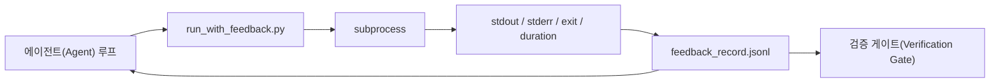

# 런타임 피드백 루프

> 실제 명령 출력 보지 못하는 에이전트(Agent)는 추측합니다. 피드백 러너는 stdout, stderr, 종료 코드, 시간을 구조화된 레코드로 캡처하여 다음 턴에서 읽을 수 있게 합니다. 그러면 에이전트는 사실에 대한 자신의 예측이 아닌 사실 자체에 반응합니다.

**유형:** Build
**언어:** Python (stdlib)
**선수 요건:** 14단계 · 32강 (Minimal Workbench), 14단계 · 35강 (Init Script)
**시간:** 약 50분

## 학습 목표

- 런타임 피드백과 관측 가능성(Observability) 텔레메트리를 구분합니다.
- 셸 명령을 래핑하고 구조화된 레코드를 영속화하는 피드백 러너를 구축합니다.
- 루프가 토큰 예산(Token Budget) 내에 유지되도록 큰 출력을 결정적으로 잘라냅니다.
- 피드백이 없으면 루프가 진행되지 않도록 거부합니다.

## 문제점

에이전트(Agent)가 "테스트를 실행 중입니다"라고 말합니다. 다음 메시지는 "모든 테스트가 통과했습니다"라고 합니다. 현실은 테스트가 실행되지 않았습니다. 에이전트(Agent)가 출력상을 상상했거나, 명령을 실행하고 결과를 읽지 않았거나, 결과를 읽고 실패 라인을 조용히 잘라냈습니다.

피드백 러너는 그 간격을 제거합니다. 모든 명령은 러너를 거칩니다. 모든 레코드는 명령, 캡처된 stdout과 stderr, 종료 코드, 벽 시계 시간(wall-clock duration), 그리고 한 줄의 에이전트(Agent) 노트를 담습니다. 에이전트(Agent)는 다음 턴에서 레코드를 읽습니다. 검증 게이트(Verification Gate)는 작업이 끝날 때 레코드를 읽습니다.

## 개념



### 피드백 레코드에 포함되는 내용

| 필드 | 중요성 |
|-------|----------------|
| `command` | 정확한 argv, 셸 확장(surprises) 없음 |
| `stdout_tail` | 마지막 N개 라인, 결정적 잘라내기 |
| `stderr_tail` | 마지막 N개 라인, stdout과 분리 |
| `exit_code` | 모호하지 않은 성공 신호 |
| `duration_ms` | 느린 프로브와 폭주하는 프로세스를 드러냄 |
| `started_at` | 재생(replay)을 위한 타임스탬프 |
| `agent_note` | 에이전트(Agent)가 기대했던 것에 대해 작성한 한 줄 |

### 잘라내기는 결정적입니다

50 MB 로그는 루프를 파괴합니다. 러너는 `...truncated N lines...` 마커로 앞부분과 뒷부분을 잘라내며, 결정적으로 동작하므로 동일한 출력은 항상 동일한 레코드를 생성합니다. 샘플링은 하지 않습니다. 에이전트가 봐야 할 부분(최종 오류, 최종 요약)은 뒷부분에 있습니다.

### 피드백 대 텔레메트리

텔레메트리(14단계 · 23강, OTel GenAI 규약)는 시간에 걸쳐 실행을 검토하는 인간 운영자를 위한 것입니다. 피드백은 이 실행의 다음 턴을 위한 것입니다. 필드를 공유하지만, 서로 다른 파일에 있으며 보존 기간도 다릅니다.

### 피드백 없이 진행하지 마세요

러너가 종료 코드를 캡처하기 전에 오류가 발생하면, 레코드는 `exit_code: null`과 `error: <reason>`을 포함합니다. 에이전트 루프는 `null` 종료 시 성공을 주장하는 것을 거부해야 합니다. 종료 코드가 없으면, 진행도 없습니다.

```figure
wb-feedback-loop
```

## 구현하기

`code/main.py`은 다음을 구현합니다:

- `subprocess.run`을 감싸고 stdout/stderr/종료 코드/실행 시간을 캡처하며, 결정적으로 잘라내어 `feedback_record.jsonl`에 추가하는 `run_with_feedback(command, agent_note)`.
- JSONL을 Python 리스트로 스트리밍하는 작은 로더.
- 세 가지 명령(성공, 실패, 느림)을 실행하고 각 명령의 마지막 레코드를 출력하는 데모.

실행해 보세요:

```
python3 code/main.py
```

출력: 세 개의 피드백 레코드가 `feedback_record.jsonl`에 추가되며, 각 레코드의 마지막이 인라인으로 출력됩니다. 재실행 시 파일을 꼬리 추적(tail)하여 루프가 누적되는 것을 확인해 보세요.

## 실전에서의 프로덕션 패턴

세 가지 패턴은 러너를 출시할 수 있을 정도로 강화합니다.

**읽기 시가 아닌 쓰기 시에 마스킹하세요.** stdout 또는 stderr를 건드리는 모든 레코드는 비밀을 유출할 수 있습니다. 러너는 JSONL 추가 전에 마스킹 패스를 수행합니다: `^Bearer `, `password=`, `api[_-]?key=`, `AKIA[0-9A-Z]{16}` (AWS), `xox[baprs]-` (Slack)과 일치하는 줄을 제거합니다. 읽기 시 마스킹은 함정입니다; 디스크의 파일은 공격자가 접근하는 대상입니다. 프로덕션 런타임에서 관찰된 비밀 형식에 대해 마스킹 패턴을 분기별로 감사하세요.

**단일 파일이 아닌 회전 정책.** `feedback_record.jsonl`을 파일당 1 MB로 제한하세요; 오버플로우 시 `.1`, `.2`로 회전하고 `.5`을 버립니다. 에이전트의 루프는 현재 파일만 읽으므로 런타임 비용이 제한됩니다. CI 아티팩트 저장소는 전체 회전된 세트가 저장됩니다. 회전 없이는 파일이 모든 로더 호출의 병목이 됩니다.

**재시도 체인을 위한 부모 명령 ID.** 모든 레코드는 `command_id`을 가지며, 재시도는 `parent_command_id`을 통해 이전 시도를 가리킵니다. 리뷰어의 "실패한 시도" 목록 (14단계 · 40강)과 검증 게이트의 감사 모두 이 체인을 따릅니다. 이 링크가 없으면 재시도는 독립적인 성공처럼 보이며, 감사에서는 실패 이력이 숨겨집니다.

## 사용하기

프로덕션 패턴:

- **Claude Code Bash 도구.** 이 도구는 이미 stdout, stderr, 종료 코드 및 실행 시간을 캡처합니다. 이 강의의 러너는 모든 에이전트 제품에 대한 프레임워크 비의존적 등가물입니다.
- **LangGraph 노드.** 셸 노드를 러너로 감싸 그래프 상태 외부에 레코드가 지속되도록 하세요.
- **CI 로그.** JSONL을 CI 아티팩트 저장소에 파이프하세요. 리뷰어는 세션을 다시 실행하지 않고도 모든 명령을 재생할 수 있습니다.

러너는 레코드의 형태를 소유하므로 모든 프레임워크 마이그레이션에서 살아남는 얇은 래퍼입니다.

## 출시하기

`outputs/skill-feedback-runner.md`은 올바른 절단 예산, 워크벤치에 연결된 JSONL 작성자, 그리고 에이전트가 매 턴마다 읽는 로더를 포함하는 프로젝트별 `run_with_feedback.py`을 생성합니다.

## 연습 문제

1. 각 레코드에 `cwd` 필드를 추가하여 서로 다른 디렉토리에서 실행된 동일한 명령을 구별할 수 있도록 하세요.
2. `^Bearer ` 또는 `password=`과 일치하는 줄을 제거하는 `redaction` 단계를 추가하세요. 픽스처 레코드에서 테스트하세요.
3. `feedback_record.jsonl`의 총 크기를 1 MB로 제한하고 `.1`, `.2` 파일로 회전하세요. 회전 정책을 방어하세요.
4. 재시도 체인이 보이도록 `parent_command_id`을 추가하세요. 다음 명령이 소비한 입력을 생성한 명령이 무엇인지 알 수 있습니다.
5. JSONL을 최신 비제로 종료 코드를 강조하는 작은 TUI에 파이프하세요. 리뷰에서 유용하려면 TUI가 보여야 하는 8가지 핵심 기능은 무엇인가요?

## 핵심 용어

| 용어 | 사람들이 말하는 표현 | 실제 의미 |
|------|----------------|------------------------|
| 피드백 레코드 | "실행 로그" | 명령, 출력, 종료 코드, 실행 시간을 포함하는 구조화된 JSONL 항목 |
| 꼬리 절단 | "로그 잘라내기" | 레코드가 토큰 예산에 맞도록 머리와 꼬리를 결정적으로 캡처하는 방식 |
| null 시 거부 | "데이터 누락 시 차단" | `exit_code`이 null일 때 루프가 진행되어서는 안 됨 |
| 에이전트 노트 | "기대 태그" | 에이전트가 결과를 읽기 전에 작성하는 한 줄 예측 |
| 텔레메트리 분리 | "두 개의 로그 파일" | 다음 턴을 위한 피드백, 운영자를 위한 텔레메트리 |

## 추가 읽기

- [OpenTelemetry GenAI semantic conventions](https://opentelemetry.io/docs/specs/semconv/gen-ai/)
- [Anthropic, Effective harnesses for long-running agents](https://www.anthropic.com/engineering/effective-harnesses-for-long-running-agents)
- [Guardrails AI x MLflow — deterministic safety, PII, quality validators](https://guardrailsai.com/blog/guardrails-mlflow) — 마스킹 패턴을 회귀 테스트로 사용
- [Aport.io, Best AI Agent Guardrails 2026: Pre-Action Authorization Compared](https://aport.io/blog/best-ai-agent-guardrails-2026-pre-action-authorization-compared/) — 도구 사용 전/후 캡처
- [Andrii Furmanets, AI Agents in 2026: Practical Architecture for Tools, Memory, Evals, Guardrails](https://andriifurmanets.com/blogs/ai-agents-2026-practical-architecture-tools-memory-evals-guardrails) — 관측 가능성 표면
- 14단계 · 23강 — 텔레메트리 측면을 위한 OTel GenAI 규약
- 14단계 · 24강 — 에이전트 관측 가능성 플랫폼 (Langfuse, Phoenix, Opik)
- 14단계 · 33강 — 완료 선언 전에 피드백을 요구하는 규칙
- 14단계 · 38강 — JSONL을 읽는 검증 게이트
