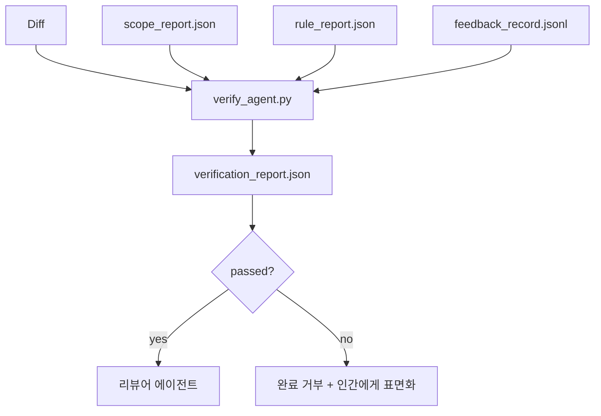

# 검증 게이트

> 에이전트는 자신의 작업을 완료했다고 스스로 표시할 수 없습니다. 검증 게이트는 범위 계약, 피드백 로그, 규칙 보고서 및 diff를 읽고 단 하나의 질문에 답합니다: 이 작업이 실제로 완료되었습니까? 게이트가 아니라고 답하면, 채팅에서 무엇이 말하든 상관없이 작업은 완료되지 않은 것입니다.

**유형:** Build
**언어:** Python (stdlib)
**선수 요건:** 14단계 · 33강 (규칙), 14단계 · 36강 (범위), 14단계 · 37강 (피드백)
**시간:** 약 55분

## 학습 목표

- 검증 게이트를 워크벤치 산출물에 대한 결정론적 함수로 정의해 보세요.
- 규칙 보고서, 범위 보고서, 피드백 기록 및 diff를 하나의 판정으로 통합해 보세요.
- 리뷰어 에이전트와 CI가 모두 읽을 수 있는 `verification_report.json`을 생성해 보세요.
- 블록 심각도 실패가 있는 경우 예외 없이 작업 진행을 거부해 보세요.

## 문제점

에이전트는 성공을 너무 쉽게 선언합니다. 세 가지 실패 형태가 지배적입니다:

- "좋아 보여요." 모델이 자신의 diff를 읽고 정확하다고 판단했습니다.
- "테스트가 통과했습니다." 자신 있게 말하지만, 테스트가 실제로 실행된 기록이 없습니다.
- "수락 기준 충족." 수락 기준이 "완료된 것과 유사한 것"을 의미할 정도로 느슨하게 해석되었습니다.

워크벤치 해결책은 에이전트가 이미 생성한 산출물을 읽고 판정을 내리는 단일 검증 게이트입니다. 게이트는 결정론적입니다. 게이트는 버전 관리에 있습니다. 게이트는 CI에 연결되어 있습니다. 에이전트는 게이트를 매수할 수 없습니다.

## 개념



### 게이트가 확인하는 사항

| 확인 | 소스 산출물 | 심각도 |
|-------|-----------------|----------|
| 모든 수락 명령이 실행됨 | `feedback_record.jsonl` | block |
| 모든 수락 명령이 0으로 종료됨 | `feedback_record.jsonl` | block |
| 범위 검사에 금지된 쓰기 없음 | `scope_report.json` | block |
| 범위 검사에 범위 밖 쓰기 없음 | `scope_report.json` | block 또는 warn |
| 모든 블록 심각도 규칙 통과 | `rule_report.json` | block |
| 피드백에 `null` 종료 코드 없음 | `feedback_record.jsonl` | block |
| 변경된 파일이 `scope.allowed_files`과 일치 | 둘 다 | 경고 |

`warn` 발견은 판정을 주석으로 달며, `block` 발견은 `passed: true`을 방지합니다.

### 확률적이지 않고 결정적입니다

게이트는 동일한 아티팩트 집합에 대해 매번 동일한 판정을 산출해야 합니다. LLM 판정자는 없습니다. LLM 판정자는 정성적 평가가 목표인 리뷰어 측(14단계 · 39강)에 속합니다. 상태 평가가 아닙니다.

### 하나의 보고서, 하나의 경로

게이트는 작업 종결 시 `verification_report.json`을 하나 방출하며, `outputs/verification/<task_id>.json` 아래에 기록합니다. CI는 동일한 경로를 소비합니다. 서로 다른 경로를 가진 여러 게이트는 진실의 원천을 분기시킵니다.

### 예외 없이 거부

차단 심각도(block-severity) 발견은 에이전트가 덮어쓸 수 없습니다. 기록된 `override_reason`과 `overridden_by` 사용자 ID를 가진 인간만이 덮어쓸 수 있습니다. 덮어쓰기는 서명된 변경이며, 에이전트의 결정이 아닙니다.

```figure
wb-gate-sequence
```

## 구현하기

`code/main.py`은 다음을 구현합니다:

- 각 입력 아티팩트에 대한 로더로, 모두 로컬에서 스텁(stub) 처리되어 강의가 자기 완결적입니다.
- `verify(task_id, artifacts) -> VerdictReport` 순수 함수.
- 체크별 결과와 최종 통과/실패를 표시하는 프린터.
- 세 가지 작업 시나리오를 포함한 데모: 깨끗한 통과, 범위 확장(scope creep), 누락된 수용 기준.

실행해 보세요:

```
python3 code/main.py
```

출력: 스크립트 옆에 저장된 세 개의 판정 보고서.

## 실전에서의 프로덕션 패턴

네 가지 패턴이 게이트를 "또 다른 린트 작업"에서 "결정적 경계"로 격상시킵니다.

**심층 방어(Defense in Depth), 단일 게이트가 아닙니다.** 사전 커밋 훅 → CI 상태 체크 → 사전 도구 권한 인증 훅 → 병합 전 게이트. 각 계층은 결정적이므로 한 계층의 실패는 다음 계층에서 잡힙니다. microservices.io의 2026년 3월 플레이북은 명확합니다: 사전 커밋 훅은 우회 불가능합니다. 모델 측 스킬과 달리 에이전트가 지침을 따르는 것에 의존하지 않기 때문입니다. 검증 게이트는 CI / 병합 전 계층에 위치합니다.

**결정적 검사로 방어하고, 미묘한 부분은 모델 판정만 사용하세요.** Anthropic의 2026 Hybrid Norm 페어링: 검증 가능한 보상(단위 테스트, 스키마 검사, 종료 코드)은 "코드가 문제를 해결했는가?"에 답하고, LLM 루브릭은 "코드가 가독성이 있고, 안전하며, 스타일에 맞는가?"에 답합니다. 게이트는 첫 번째 유형을 실행하고, 리뷰어(14단계 · 39강)는 두 번째 유형을 실행합니다. 두 가지를 섞으면 신호가 붕괴됩니다.

**Slack 스레드가 아닌 서명된 오버라이드 로그를 사용하세요.** 모든 오버라이드는 `outputs/verification/overrides.jsonl`에 타임스탬프, 발견 코드, 이유, 서명 사용자, 현재 HEAD 커밋을 포함하는 행을 생성합니다. 런타임은 서명이 없는 오버라이드를 거부하며, 감사 추적은 git으로 추적됩니다. 이는 오버라이드 정책과 오버라이드 연극 사이의 경계선입니다.

**커버리지 하한을 일급 검사로 설정하세요.** `coverage_report.json`가 `coverage_floor` 검사(기본값 80%)에 입력됩니다. 측정된 커버리지가 하한보다 낮거나, 이전 병합의 하한보다 1 퍼센트 포인트 이상 낮으면 게이트가 실패합니다. 이 검사가 없으면 에이전트가 실패하는 테스트를 조용히 삭제하고 검증 보고서는 초록색으로 유지됩니다.

**`--strict` 모드는 경고(warn)를 차단(block)으로 승격합니다.** 릴리스 브랜치, 출시 차단 PR, 사후 분석 트리아지에서는 `--strict`가 모든 경고를 하드 실패로 만듭니다. 이 플래그는 브랜치별로 옵트인(opt-in) 설정합니다. 모든 것에 엄격하게 적용하면 일상적인 흐름이 부식되므로 전역 기본값은 아닙니다.

## 사용하기

프로덕션 패턴:

- **CI 단계.** `verify_agent` 작업이 에이전트의 최종 산출물에 대해 게이트를 실행합니다. 병합 보호는 `passed: true` 없이는 거부됩니다.
- **핸드오프 전 훅.** 에이전트 런타임은 핸드오프 문서를 생성하기 전에 게이트를 호출합니다. 초록색 판정이 없으면 핸드오프가 없습니다.
- **수동 트리아지.** 에이전트가 성공을 주장하고 사람이 이를 의심할 때, 운영자가 보고서를 읽습니다.

게이트는 워크벤치 흐름에서 결정적인 가장자리입니다. 다른 모든 표면은 게이트의 상류에 있습니다.

## 출시하기

`outputs/skill-verification-gate.md`는 게이트를 특정 프로젝트에 연결합니다. 어떤 수용 명령이 게이트에 입력되는지, 어떤 규칙이 차단 심각도(block-severity)인지, 어떤 범위 밖 쓰기가 허용되는지, 오버라이드 감사 로그가 어떻게 저장되는지를 정의합니다.

## 연습 문제

1. `coverage_floor` 검사를 추가하세요: 테스트 명령은 최소 80%의 커버리지 보고서를 생성해야 합니다. 하한을 담당하는 산출물을 결정하세요.
2. 모든 `warn`을 `block`로 승격하는 `--strict` 모드를 지원하세요. 엄격 모드가 기본값으로 적합한 경우를 문서화하세요.
3. 게이트가 JSON 외에 Markdown 요약도 생성하도록 하세요. 요약에 포함해야 할 필드를 방어하세요.
4. `time_since_last_human_touch` 검사를 추가하세요: 사람이 키를 입력한 후 60초 이내에 편집된 모든 파일은 범위 이탈 플래그에서 제외됩니다.
5. 제품의 실제 에이전트 diff에 게이트를 실행해 보세요. 몇 개의 발견 사항이 실제이고 몇 개는 잡음인가요? 게이트가 어디에서 확장되어야 할까요?

## 핵심 용어

| 용어 | 사람들이 말하는 것 | 실제 의미 |
|------|----------------|------------------------|
| 검증 게이트 | "작업을 멈추는 검사" | 워크벤치 산출물에 대한 결정론적 함수로 통과/실패 판정을 생성 |
| 차단 심각도 | "하드 실패" | `passed: true`을 방지하고 서명된 오버라이드를 요구하는 발견 사항 |
| 오버라이드 로그 | "왜 통과시켰는지" | 이유와 사용자 ID가 포함된 서명된 항목으로, 리뷰를 통해 감사 |
| 수용 명령 | "증명" | 0 종료 코드가 `done`의 의미인 셸 명령 |
| 단일 보고서 경로 | "진실의 원천" | CI와 사람이 모두 소비하는 `outputs/verification/<task_id>.json` |

## 추가 읽기

- [Anthropic, Harness design for long-running application development](https://www.anthropic.com/engineering/harness-design-long-running-apps)
- [OpenAI Agents SDK guardrails](https://openai.github.io/openai-agents-python/guardrails/)
- [microservices.io, GenAI dev platform: guardrails](https://microservices.io/post/architecture/2026/03/09/genai-development-platform-part-1-development-guardrails.html) — 프리 커밋과 CI 사이의 심층 방어
- [ICMD, The 2026 Playbook for Agentic AI Ops](https://icmd.app/article/the-2026-playbook-for-agentic-ai-ops-guardrails-costs-and-reliability-at-scale-1776661990431) — 승인 게이트 사다리 (초안 → 승인 → 임계값 아래 자동)
- [Type-Checked Compliance: Deterministic Guardrails (arXiv 2604.01483)](https://arxiv.org/pdf/2604.01483) — 결정론적 게팅의 상한으로서 Lean 4
- [logi-cmd/agent-guardrails — merge gate spec](https://github.com/logi-cmd/agent-guardrails) — 범위 + 변형 테스트 게이트
- [Guardrails AI x MLflow](https://guardrailsai.com/blog/guardrails-mlflow) — CI 스코어로서의 결정론적 검증기
- 14단계 · 27강 — 프롬프트 인젝션 방어 (게이트의 적대적 쌍)
- 14단계 · 36강 — 이 게이트가 강제하는 범위 계약
- 14단계 · 37강 — 이 게이트가 점수화하는 피드백 로그
- 14단계 · 39강 — 게이트가 핸드오프하는 리뷰어 에이전트
