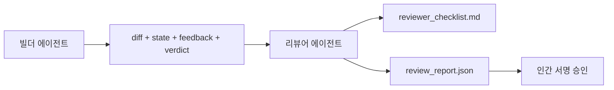

# 리뷰어 에이전트: 빌더와 마커 분리

> 코드를 작성한 에이전트는 그 코드를 채점할 수 없습니다. 리뷰어는 빌더가 생성한 모든 것에 대해 읽기 전용 접근 권한을 가진, 다른 시스템 프롬프트와 다른 목표를 가진 두 번째 루프입니다. 빌더와 리뷰어 사이의 간격이 신뢰성의 대부분을 결정합니다.

**유형:** Build
**언어:** Python (stdlib)
**선수 요건:** 14단계 · 38강 (검증 게이트)
**시간:** 약 55분

## 학습 목표

- 동일한 에이전트가 자신의 작업을 신뢰성 있게 리뷰할 수 없는 이유를 설명해 보세요.
- 빌더 산출물을 소비하고 구조화된 리뷰 보고서를 생성하는 리뷰어 에이전트 루프를 구축해 보세요.
- 분위기(vibes)가 아닌 특정 차원을 채점하는 리뷰어 루브릭을 작성해 보세요.
- 리뷰어를 워크벤치에 연결하여 인간 리뷰 단계가 실제 산출물에서 시작되도록 해 보세요.

## 문제점

에이전트에게 버그 수정을 요청합니다. 에이전트는 네 개의 파일을 수정하고, 테스트를 실행하며, 완료했다고 보고합니다. 검증 게이트(14단계 · 38강)는 수용 검사가 실행되었고 범위가 유지되었음을 확인합니다. 게이트는 `passed: true`라고 말합니다. 병합합니다. 이틀 후, 수정이 버그의 잘못된 절반만 해결했다는 사실을 발견합니다.

수용은 필요하지만 충분하지 않습니다. 리뷰어는 수용이 할 수 없는 질문을 던집니다: 이것이 올바른 문제를 해결했나요? 범위를 확장하면서 이를 표시하지 않았나요? 질문해야 했던 가정을 문서화하지 않았나요? 다음 세션이 이어받을 수 있는 상태로 워크벤치를 남겨두었나요?

## 개념



### 리뷰어 루브릭

5개 차원, 각 0에서 2까지 점수 매김.

| 차원 | 질문 |
|-----------|----------|
| 문제 적합성 | 변경 사항이 명시된 작업을 해결했나요, 아니면 근처의 다른 작업을 해결했나요? |
| 범위 규율 | 편집이 계약에 한정되었나요, 아니면 계약을 의도적으로 확장했나요? |
| 가정 | 모든 숨겨진 가정이 리뷰 가능한 어딘가에 기록되어 있나요? |
| 검증 품질 | 수용 명령이 실제로 목표를 증명하나요, 아니면 더 약한 버전을 증명하나요? |
| 핸드오프 준비 상태 | 다음 세션이 현재 상태에서 깔끔하게 이어갈 수 있었나요? |

10점 만점. 7점 미만은 소프트 실패, 5점 미만은 하드 실패입니다.

### 리뷰어는 별도의 역할이지, 별도의 모델이 아닙니다

빌더와 동일한 모델로 리뷰어를 실행할 수 있습니다. 규율은 역할 분리입니다: 다른 시스템 프롬프트, 다른 입력, diff에 대한 쓰기 권한 없음. 태도의 변화는 신호의 변화입니다.

### 리뷰어는 diff를 편집할 수 없습니다

리뷰어는 diff, 상태, 피드백, 판정을 읽습니다. 보고서를 작성합니다. diff를 패치하지는 않습니다. 보고서가 "이것을 수정하라"고 하면, 다음 빌더 턴이 수정을 수행합니다; 리뷰어는 리뷰로 돌아갑니다. 역할을 혼합하면 격차가 무의미해집니다.

### 리뷰어 루브릭 대 검증 게이트

게이트(14단계 · 38강)는 결정적인 사실을 확인합니다: 수용 테스트가 실행되었는지, 규칙이 통과되었는지, 범위가 유지되었는지. 리뷰어는 정성적 판단을 내립니다: 이것이 올바른 작업이었는지, 문서화되었는지, 핸드오프가 사용 가능한지. 둘 다 필요합니다.

```figure
wb-builder-marker
```

## 구현하기

`code/main.py`는 다음을 구현합니다:

- 리뷰어가 읽는 산출물을 묶는 `ReviewerInputs` 데이터 클래스입니다.
- 각 차원마다 하나의 함수를 가진 루브릭 스코어입니다. 각 함수는 결정적이며 강의용 스텁 수준입니다; 실제 구현은 LLM을 호출할 것입니다.
- `review_report.json` 작성자는 다섯 점수, 총점, 판정(`pass`, `soft_fail`, `hard_fail`)을 포함합니다.
- 두 개의 데모 케이스: 깔끔한 변경과 "올바른 테스트, 잘못된 문제" 변경.

실행해 보세요:

```
python3 code/main.py
```

출력: 디스크에 기록된 두 개의 리뷰 보고서와 차원별 점수 콘솔 테이블입니다.

## 실전에서의 프로덕션 패턴

증거: Cloudflare의 2026년 4월 AI Code Review 시스템은 30일 동안 5,169개 저장소의 48,095개 병합 요청에 걸쳐 131,246번의 리뷰 실행을 수행했습니다. 중앙값 리뷰 완료 시간은 3분 39초였습니다. 최대 7명의 전문가 리뷰어(보안, 성능, 코드 품질, 문서, 릴리스 관리, 컴플라이언스, Engineering Codex)가 발견 사항을 중복 제거하고 심각도를 판단하는 Review Coordinator 아래에서 병렬로 실행되었습니다. 최상위 모델은 Coordinator 전용으로 예약되었으며, 전문가들은 더 저렴한 티어에서 실행되었습니다.

네 가지 패턴이 대규모로 작동하도록 합니다.

**하나의 큰 리뷰어가 아닌 전문가 풀.** 5개 차원 평가 기준을 가진 단일 리뷰어는 개인 저장소에는 적합합니다. 코드베이스에 보안, 성능, 문서 관련 영역이 생기면 더 작은 프롬프트를 가진 전문가들로 분리하세요. 코디네이터가 중복 제거를 담당하며, 전문가들은 전체 평가 기준을 실행하지 않습니다. 모델 등급 분리도 자연스럽게 따라옵니다: 저렴한 전문가, 고가의 코디네이터.

**설계 요구사항으로서의 편향 완화, 최적화가 아닙니다.** LLM 평가자는 네 가지 신뢰할 수 있는 편향을 보입니다 (Adnan Masood, 2026년 4월): 위치 편향 (GPT-4는 (A,B)와 (B,A) 순서에서 약 40%의 불일치를 보임), 장황함 편향 (긴 출력에 대해 약 15%의 점수 인플레이션), 자기 선호 (평가자는 같은 모델 계열의 출력을 선호함), 권위 (평가자는 알려진 저자에 대한 참조를 과대평가함). 완화 방법: 두 순서를 모두 평가하고 일관된 승리만 계산하세요; 간결성을 명시적으로 보상하는 1-4 척도를 사용하세요; 모델 계열 간에 평가자를 순환시키세요; 채점 전에 저자 이름을 제거하세요.

**분위기(vibes)가 아닌 보정 세트.** 알려진 올바른 판정이 포함된 10-20개 작업의 역사적 세트입니다. 프롬프트가 변경될 때마다 리뷰어를 이 세트에 대해 실행하세요. 역사적 기록과의 일치율이 80% 미만으로 떨어지면, 리뷰어가 출시되기 전에 평가 기준을 수정해야 합니다. 모든 팀이 결국 재발견하는 것이 바로 이것입니다; 처음부터 이것으로 시작하는 것이 좋습니다.

**게이트와 함께 하는 하이브리드 규범.** 검증 게이트 (14단계 · 38강)는 결정론적 체크를 처리합니다 (수락이 실행되었는지, 테스트가 통과되었는지, 범위가 유지되었는지). 리뷰어는 의미론적 체크를 처리합니다 (이 작업이 옳은 작업이었는지, 가정이 문서화되었는지, 핸드오프가 사용 가능한지). Anthropic의 2026년 가이드는 이 분리를 명시적으로 강조합니다: 게이트가 이미 증명하는 것을 리뷰어에게 다시 요청하지 마세요.

## 사용하기

프로덕션 패턴:

- **Claude Code 서브에이전트.** 리뷰어 서브에이전트가 빌더가 작업을 완료한 후 실행됩니다. 평가 기준 점수를 PR에 댓글로 게시합니다.
- **OpenAI Agents SDK 핸드오프.** 빌더는 작업 완료 시 리뷰어에게 핸드오프합니다. 리뷰어는 발견된 사항 목록을 포함하여 빌더에게 반환하거나 인간에게 에스컬레이션할 수 있습니다.
- **두 모델 페어링.** 빌더는 더 빠르고 저렴한 모델에서 실행됩니다. 리뷰어는 판단에 집중하는 더 강력한 모델에서 더 작은 컨텍스트로 실행됩니다.

리뷰어는 사람이 모든 리뷰를 직접 수행할 수 없을 때 작업대가 키우는 두 번째 눈입니다.

## 출시하기

`outputs/skill-reviewer-agent.md`는 프로젝트별 리뷰어 루브릭, 빌더의 산출물에 연결된 리뷰어 에이전트 스텁, 그리고 사람이 빈 페이지가 아닌 작성된 보고서에서 리뷰를 시작하도록 검증 게이트와 연동하는 기능을 생성합니다.

## 연습 문제

1. 제품 도메인에 특화된 여섯 번째 차원을 추가하세요. 기존 다섯 차원에 흡수되지 않는 이유를 방어하세요.
2. 두 가지 다른 시스템 프롬프트(간결한 것, 상세한 것)로 리뷰어를 실행하세요. 사람이 읽을 가능성이 더 높은 보고서를 생성하는 것은 어느 쪽인가요?
3. 각 차원마다 `confidence` 필드를 추가하세요. 가장 낮은 차원에 대한 신뢰도가 0.6 미만일 때 보고서 출시를 거부하세요.
4. 보정 세트를 구축하세요: 알려진 올바른 판정을 가진 10개의 과거 작업 완료 기록. 리뷰어를 그 위에 실행하세요. 과거 기록과 어디에서 불일치하나요?
5. "추가 증거 요청" 기능을 추가하세요: 리뷰어는 점수를 매기기 전에 빌더에게 특정 테스트 실행을 요청할 수 있습니다. 루프에 빠지지 않도록 하는 올바른 백오프(back-off)는 무엇인가요?

## 핵심 용어

| 용어 | 사람들이 말하는 것 | 실제 의미 |
|------|----------------|------------------------|
| 리뷰어 루브릭 | "체크리스트" | 각 차원마다 작성된 질문이 있는 5차원 0-2 점수 체계 |
| 소프트 실패 | "수정 필요" | 총점이 7 미만; 빌더가 처리해야 할 발견 사항이 전달됨 |
| 하드 실패 | "거절" | 총점이 5 미만이거나 어느 차원이든 0점; 중단하고 사람에게 표면화 |
| 역할 분리 | "다른 프롬프트" | 같은 모델이 두 역할을 모두 수행할 수 있음; 규율은 입력과 자세(posture) |
| 신뢰도 하한 | "저신호 보고서 출시 금지" | 루브릭이 불확실할 때 판정 방출을 거부 |

## 추가 읽기

- [OpenAI Agents SDK handoffs](https://openai.github.io/openai-agents-python/handoffs/)
- [Anthropic Claude Code subagents](https://code.claude.com/docs/en/sub-agents)
- [Cloudflare, Orchestrating AI Code Review at Scale](https://blog.cloudflare.com/ai-code-review/) — 7전문가 + 코디네이터 아키텍처, 30일 동안 131k 실행
- [Agent-as-a-Judge: Evaluating Agents with Agents (OpenReview / ICLR)](https://openreview.net/forum?id=DeVm3YUnpj) — DevAI 벤치마크, 366개의 계층적 솔루션 요구 사항
- [Adnan Masood, Rubric-Based Evaluations and LLM-as-a-Judge: Methodologies, Biases, Empirical Validation](https://medium.com/@adnanmasood/rubric-based-evals-llm-as-a-judge-methodologies-and-empirical-validation-in-domain-context-71936b989e80) — 4가지 편향과 완화 전략
- [MLflow, LLM-as-a-Judge Evaluation](https://mlflow.org/llm-as-a-judge) — 분리된 빌더/평가자를 위한 프로덕션 도구
- [LangChain, How to Calibrate LLM-as-a-Judge with Human Corrections](https://www.langchain.com/articles/llm-as-a-judge) — 보정 세트 워크플로
- [Evidently AI, LLM-as-a-judge: a complete guide](https://www.evidentlyai.com/llm-guide/llm-as-a-judge)
- [Arize, LLM as a Judge — Primer and Pre-Built Evaluators](https://arize.com/llm-as-a-judge/)
- 14단계 · 05강 — Self-Refine 및 CRITIC (단일 에이전트 자기 검토 기준선)
- 14단계 · 30강 — 평가 기반 에이전트 개발 (보정 세트 생성기)
- 14단계 · 38강 — 리뷰어가 읽는 검증 게이트
- 14단계 · 40강 — 리뷰어 보고서가 제공하는 핸드오프 팩
