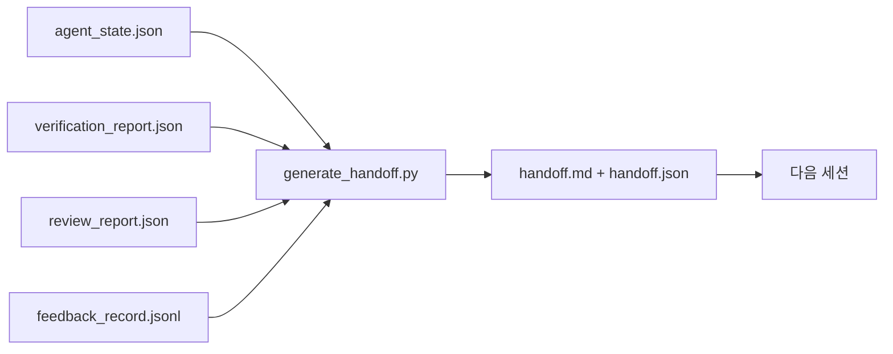

# 멀티 세션 핸드오프

> 세션은 끝나지만, 작업은 끝나지 않습니다. 핸드오프 패킷은 "에이전트가 한 시간 동안 작업했다"를 "다음 세션이 첫 1분부터 생산적으로 진행"으로 바꾸는 산출물입니다. 사후에 생각하지 말고, 의도적으로 만드세요.

**유형:** Build
**언어:** Python (stdlib)
**선수 요건:** 14단계 · 34강 (저장소 메모리), 14단계 · 38강 (검증), 14단계 · 39강 (리뷰어)
**시간:** 약 50분

## 학습 목표

- 모든 핸드오프 패킷에 필요한 7가지 필드를 식별하세요.
- 작업대 산출물로부터 핸드오프를 생성하고, 문장을 직접 작성하지 마세요.
- 대규모 피드백 로그를 핸드오프 크기의 요약으로 정리하세요.
- 다음 세션의 첫 번째 행동을 결정적으로 만드세요.

## 문제점

세션이 끝납니다. 에이전트는 "좋아, 진전을 이루었어"라고 말합니다. 다음 세션이 열립니다. 다음 에이전트는 "우리가 어디까지 진행했지?"라고 묻습니다. 첫 번째 에이전트의 답변은 사라졌습니다. 다음 에이전트는 다시 발견하고, 같은 명령을 다시 실행하고, 인간에게 같은 질문을 다시 하고, 이전 세션의 마지막 30초를 복원하는 데 30분을 낭비합니다.

나쁜 핸드오프의 비용은 작업의 수명 동안 매 세션마다 지불됩니다. 해결책은 세션 종료 시 자동으로 생성되는 패킷입니다: 무엇이 변경되었는지, 왜 변경되었는지, 무엇이 시도되었는지, 무엇이 실패했는지, 무엇이 남아 있는지, 다음에 먼저 해야 할 일이 무엇인지.

## 개념



### 모든 핸드오프가 담아야 하는 7가지 필드

| 필드 | 답하는 질문 |
|-------|---------------------|
| `summary` | 수행된 작업에 대한 한 단락 |
| `changed_files` | 한눈에 보는 diff |
| `commands_run` | 실제로 실행된 내용 |
| `failed_attempts` | 시도되었지만 작동하지 않은 이유 |
| `open_risks` | 다음 세션에서 문제가 될 수 있는 것과 심각도 |
| `next_action` | 다음 세션이 취하는 첫 번째 구체적 단계 |
| `verdict_pointer` | 검증 및 리뷰 보고서의 경로 |

`next_action` 필드는 핵심적인 부분입니다. `next_action`을 제외한 모든 요소가 포함된 핸드오프는 상태 보고일 뿐, 핸드오프가 아닙니다.

### 핸드오프는 작성하는 것이 아니라 생성하는 것입니다

직접 작성한 핸드오프는 힘든 날에 건너뛰게 됩니다. 생성기는 워크벤치 산출물을 읽고 패킷을 방출합니다. 에이전트의 역할은 생성기가 요약할 수 있는 상태로 워크벤치를 유지하는 것이지, 요약을 작성하는 것이 아닙니다.

### 두 가지 형식: 사람이 읽는 형식과 기계가 읽는 형식

`handoff.md`은 사람이 읽는 내용입니다. `handoff.json`은 다음 에이전트가 로드하는 내용입니다. 둘 다 동일한 출처 산출물에서 나옵니다. 두 내용이 서로 다르면 JSON이 우선합니다.

### 피드백 로그 정리

전체 `feedback_record.jsonl`는 수백 개의 항목으로 구성될 수 있습니다. 핸드오프에는 마지막 K개 항목과 비-0 종료 코드를 가진 모든 항목만 포함됩니다. 다음 세션이 필요하면 전체 로그를 로드하지만, 패킷은 작게 유지됩니다.

### 깨끗한 상태 남기기

핸드오프는 작업을 설명합니다. 깨끗한 상태는 작업을 재개 가능하게 만듭니다. 이 둘은 같은 것이 아닙니다. 완벽한 `handoff.md`도 다음 세션이 반쯤 적용된 diff, 에이전트가 잊어버린 임시 파일, 방치된 브랜치, 실행하기 전에 오류가 발생하는 테스트를 열면 무용지물입니다. 다음 에이전트는 첫 10분 동안 마지막 에이전트의 뒷정리를 하느라 시간을 낭비하고, 작업의 수명 동안 매 세션마다 비용이 누적됩니다.

따라서 세션은 기능이 작동할 때 끝나지 않습니다. 생성기가 요약할 수 있고 다음 세션이 신뢰할 수 있는 상태로 워크벤치가 유지될 때 끝납니다. 정리 작업은 핸드오프 전에 실행되는 자체 단계이며, 습관이 아닌 체크입니다. 습관은 힘든 날에 건너뛰는 것이기 때문입니다.

| 체크 | 깨끗한 상태의 의미 | 더러운 상태가 막는 이유 |
|-------|-------------|----------------------|
| 작업 트리 | 모든 변경 사항이 커밋되거나 메모와 함께 명시적으로 스태시(stash)됨 | 반쯤 적용된 diff는 다음 에이전트에게 의도된 작업처럼 보입니다 |
| 임시 산출물 | `*.tmp`, 스크래치 디렉토리, 디버그 출력, 주석 처리된 블록이 남지 않음 | 방치된 파일은 diff와 다음 에이전트의 멘탈 모델을 오염시킵니다 |
| 테스트 | 통과(Green), 또는 `open_risks`에 실패 원인이 명시된 실패(Red) | 조용히 실패한 테스트는 다음 세션이 빠지는 함정입니다 |
| 기능 보드 | `feature_list.json` 상태가 실제를 반영합니다 (14단계 · 36강) | 오래된 보드는 다음 세션이 이미 완료된 작업을 수행하도록 유도합니다 |
| 브랜치 | 예상된 브랜치에 있으며, detached HEAD가 없고, 고립된 브랜치가 없습니다 | 잘못된 브랜치는 다음 세션의 첫 커밋이 잘못된 위치에 저장됨을 의미합니다 |

정리 단계는 `clean_state.json` 차단 이슈를 방출합니다. 빈 목록은 핸드오프 생성기가 패킷을 작성하기 전에 단언하는 전제 조건입니다. 더러운 트리에 기반한 핸드오프는 핸드오프가 아니라, 전달된 혼란입니다. 두 산출물은 짝을 이룹니다: 정리는 작업대가 안전함을 증명하고, 핸드오프는 다음 세션이 시작 위치를 알고 있음을 증명합니다.

```figure
wb-handoff-packet
```

## 구현하기

`code/main.py`는 다음을 구현합니다:

- 상태, 판정, 리뷰 및 피드백을 단일 `WorkbenchSnapshot`에 수집하는 로더입니다.
- `generate_handoff(snapshot) -> (markdown, payload)` 함수입니다.
- 마지막 K개의 피드백 항목과 모든 비-zero 종료 코드를 선택하는 필터입니다.
- 스크립트 옆에 `handoff.md` 및 `handoff.json`을 작성하는 데모 실행입니다.

실행해 보세요:

```
python3 code/main.py
```

출력: 인쇄된 핸드오프 본문, 그리고 디스크에 있는 두 파일입니다.

## 실전에서의 프로덕션 패턴

Codex CLI, Claude Code 및 OpenCode는 각각 다른 컴팩션 스토리를 제공합니다. 구조화된 핸드오프 패킷은 이 세 가지 위에 위치합니다.

**컴팩션 전략은 다양하지만, 패킷 스키마는 그렇지 않습니다.** Codex CLI의 POST /v1/responses/compact는 서버 측 불투명 AES 블롭 (OpenAI 모델용 빠른 경로)입니다. 폴백은 `_summary` 사용자 역할 메시지로 추가되는 로컬 "핸드오프 요약"입니다. Claude Code는 컨텍스트의 95%에서 5단계 점진적 컴팩션을 수행합니다. OpenCode는 타임스탬프 기반 메시지 숨김과 5개 제목의 LLM 요약을 수행합니다. 세 가지 다른 메커니즘, 동일한 필요성: 압축에서 살아남은 것을 휴대 가능한 산출물로 직렬화하는 것입니다. 패킷이 바로 그 산출물입니다.

**새 세션 핸드오프는 컴팩션이 아닙니다.** 컴팩션은 세션을 연장합니다. 핸드오프는 세션을 깔끔하게 종료하고 다음 세션을 시작합니다. Hermes Issue #20372의 프레이밍 (2026년 4월)이 옳습니다: 제자리 압축이 성능 저하를 시작할 때, 에이전트는 컴팩트한 핸드오프를 작성하고, 세션을 종료하며, 새 컨텍스트에서 재개해야 합니다. 패킷은 이 전환을 저렴하게 만듭니다. 실수는 품질이 붕괴할 때까지 계속 압축하는 것이며, 해결책은 초기의 깔끔한 핸드오프를 위해 예산을 배정하는 것입니다.

**브랜치와 주제당 활성 핸드오프는 하나만.** 다중 에이전트(Agent) 조정은 나쁜 모델 출력보다 오래된 핸드오프(Handoff)에서 더 많이 무너집니다. 항상 `branch`, `last_known_good_commit`, `active | superseded | archived`의 `status`를 포함하세요. 오래된 핸드오프는 아카이브되며, 활성 핸드오프만 다음 세션을 주도합니다. 이는 노트로서의 핸드오프와 상태로서의 핸드오프의 차이입니다.

**50-75% 컨텍스트에서 마무리하세요, 한계에 도달하기 전에.** 수동 패턴 플레이북(CLAUDE.md + HANDOVER.md)은 세션이 95%가 아닌 50-75% 컨텍스트 예산에서 종료될 때 가장 좋은 결과를 보고합니다. 패킷 생성기는 압축 아티팩트가 소스 상태를 오염시키기 전에 깔끔하게 실행됩니다. 컨텍스트가 온전할 때 작성하는 것은 저렴하지만, 모델이 이미 위치를 잃고 있을 때는 비쌉니다.

## 사용하기

프로덕션 패턴:

- **세션 종료 훅.** 런타임은 사용자가 채팅을 닫을 때 생성기를 실행합니다. 패킷은 `outputs/handoff/<session_id>/`에 들어갑니다.
- **PR 템플릿.** 생성기의 마크다운은 PR 본문이기도 합니다. 리뷰어는 다른 다섯 파일을 열지 않고도 이를 읽습니다.
- **교차 에이전트 핸드오프.** 하나의 제품(Claude Code)으로 빌드하고, 다른 제품(Codex)으로 계속하세요. 패킷은 공통 언어입니다.

패킷은 작고, 규칙적이며, 제작 비용이 저렴합니다. 비용 절감은 모든 세션에서 누적됩니다.

## 출시하기

`outputs/skill-handoff-generator.md`는 프로젝트의 아티팩트 경로에 맞춰 조정된 생성기, 이를 실행하는 세션 종료 훅, 그리고 다음 에이전트가 시작 시 읽는 `handoff.json` 스키마를 생성합니다.

## 연습 문제

1. 빌더가 기록했지만 리뷰어가 1점 이상으로 평가하지 않은 모든 가정을 드러내는 `assumptions_to_validate` 필드를 추가하세요.
2. 실패한 실행과 통과한 실행에 대해 피드백 요약 방식을 다르게 다듬으세요. 그 비대칭성을 방어하세요.
3. "인간을 위한 질문" 목록을 포함하세요. 질문이 패킷에 포함되는 것과 채팅 메시지에 포함되는 것의 기준은 무엇인가요?
4. 생성기를 멱등(Idempotency)하게 만드세요: 두 번 실행해도 동일한 패킷이 생성됩니다. 이를 유지하려면 무엇이 안정적이어야 하나요?
5. 다음 세션이 행동하기 전에 로드해야 하는 아티팩트를 정확히 나열하는 "다음 세션 전제 조건" 섹션을 추가하세요.

## 핵심 용어

| 용어 | 사람들이 말하는 것 | 실제 의미 |
|------|----------------|------------------------|
| 핸드오프 패킷 | "세션 요약" | 7개 필드를 담고 마크다운과 JSON 형식 모두를 포함하는 생성 아티팩트 |
| 다음 조치 | "먼저 할 일" | 다음 세션을 시작하는 하나의 구체적 단계 |
| 피드백 트림 | "로그 요약" | 마지막 K개 레코드와 모든 비-0 종료 코드 |
| 상태 보고서 | "우리가 한 일" | `next_action`이 누락된 문서; 유용하지만 핸드오프는 아님 |
| 판정 포인터 | "영수증" | 추적성을 위한 검증 및 리뷰 보고서 경로 |

## 추가 읽기

- [Anthropic, Effective harnesses for long-running agents](https://www.anthropic.com/engineering/effective-harnesses-for-long-running-agents)
- [OpenAI Agents SDK handoffs](https://openai.github.io/openai-agents-python/handoffs/)
- [Codex Blog, Codex CLI Context Compaction: Architecture, Configuration, Managing Long Sessions](https://codex.danielvaughan.com/2026/03/31/codex-cli-context-compaction-architecture/) — POST /v1/responses/compact 및 로컬 폴백
- [Justin3go, Shedding Heavy Memories: Context Compaction in Codex, Claude Code, OpenCode](https://justin3go.com/en/posts/2026/04/09-context-compaction-in-codex-claude-code-and-opencode) — 3개 벤더 컴팩션 비교
- [JD Hodges, Claude Handoff Prompt: How to Keep Context Across Sessions (2026)](https://www.jdhodges.com/blog/ai-session-handoffs-keep-context-across-conversations/) — CLAUDE.md + HANDOVER.md, 50-75% 컨텍스트 예산
- [Mervin Praison, Managing Handoffs in Multi-Agent Coding Sessions: Fresh Context Without Losing Continuity](https://mer.vin/2026/04/managing-handoffs-in-multi-agent-coding-sessions-fresh-context-without-losing-continuity/) — 분산 시스템 관점
- [Hermes Issue #20372 — automatic fresh-session handoff when compression becomes risky](https://github.com/NousResearch/hermes-agent/issues/20372)
- [Hermes Issue #499 — Context Compaction Quality Overhaul](https://github.com/NousResearch/hermes-agent/issues/499) — Codex CLI의 핸드오프 중심 프롬프트
- [Microsoft Agent Framework, Compaction](https://learn.microsoft.com/en-us/agent-framework/agents/conversations/compaction)
- [OpenCode, Context Management and Compaction](https://deepwiki.com/sst/opencode/2.4-context-management-and-compaction)
- [LangChain, Context Engineering for Agents](https://www.langchain.com/blog/context-engineering-for-agents)
- 14단계 · 34강 — 생성기가 읽는 상태 파일
- 14단계 · 38강 — 패킷이 가리키는 검증 판정
- 14단계 · 39강 — 패킷에 포함된 리뷰어 보고서
