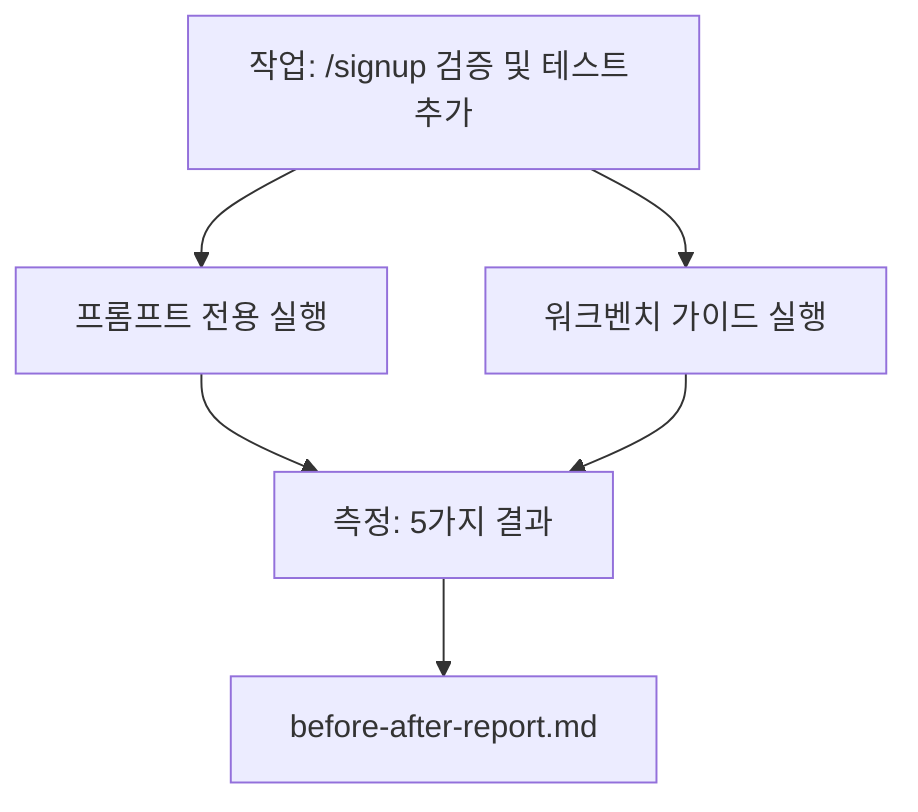

# 실제 저장소에서의 워크벤치

> 실제 코드베이스와 접촉했을 때 생존하지 못한다면, 11강의 표면은 아무 의미가 없습니다. 이 강의에서는 작은 샘플 앱에서 동일한 작업을 두 번 실행합니다: 프롬프트 전용 대 워크벤치 가이드. 숫자가 논쟁을 합니다.

**유형:** Build
**언어:** Python (stdlib)
**선수 요건:** 14단계 · 32강부터 14단계 · 40강
**시간:** 약 60분

## 학습 목표

- 작은 애플리케이션에서 7가지 워크벤치 표면을 통합해 보세요.
- 동일한 작업을 두 번 실행(프롬프트 전용 및 워크벤치 가이드)하고 5가지 결과를 측정해 보세요.
- 전후 보고서를 읽고, 어떤 표면이 가장 큰 레버리지(효과)를 주었는지 결정해 보세요.
- "내 모델은 충분히 좋다"는 반론에 대해 워크벤치를 방어해 보세요.

## 문제점

장난감 같은 작업에 대한 데모는 아무도 설득하지 못합니다. 워크벤치의 근거는, 실제처럼 느껴지는 저장소에서 실제처럼 느껴지는 작업이 프로덕션에 더 적은 실패, 더 적은 롤백, 그리고 다음 세션이 사용할 수 있는 패킷과 함께 정착했을 때 만들어집니다.

이 강의는 그 실제처럼 느껴지는 저장소를 출시하고, 두 파이프라인을 통해 동일한 작업을 실행합니다. 결과는 회의론자에게 건넬 수 있는 전후 보고서입니다.

## 개념



### 샘플 앱

`sample_app/`의 최소한의 FastAPI 스타일 핸들러:

- `app.py`는 `/signup`를 사용하며 (아직 검증 없음).
- `test_app.py`는 하나의 해피패스 테스트를 가집니다.
- `README.md`와 `scripts/release.sh`는 금지 구역 미끼로 사용됩니다.

### 작업

> `/signup`에 입력 검증을 추가하세요: 8자 미만 비밀번호를 거부하고, 타입이 지정된 오류 엔벨로프와 함께 422를 반환하세요. 새로운 동작을 증명하는 테스트를 추가하세요.

### 두 파이프라인

프롬프트 전용:

1. README를 읽으세요.
2. `app.py`를 읽으세요.
3. 파일을 편집하세요.
4. 완료했다고 주장하세요.

워크벤치 가이드:

1. 초기화 스크립트 실행 (35강).
2. 범위 계약 읽기 (36강).
3. 상태 읽기 (34강).
4. 허용된 파일만 편집하세요.
5. 피드백 러너를 통해 수용 명령 실행 (37강).
6. 검증 게이트 실행 (38강).
7. 리뷰어 실행 (39강).
8. 핸드오프 생성 (40강).

### 측정된 다섯 가지 결과

| 결과 | 중요성 |
|---------|----------------|
| `tests_actually_run` | 대부분의 "테스트 통과" 주장은 검증 불가능합니다 |
| `acceptance_met` | 목표를 증명하는 테스트는 실제로 실행된 테스트여야 합니다 |
| `files_outside_scope` | 범위 확대는 지배적인 조용한 실패입니다 |
| `handoff_quality` | 다음 세션이 이를 위해 비용을 지불하거나 혜택을 받습니다 |
| `reviewer_total` | 게이트 위에 정성적 판단이 추가됩니다 |

```figure
wb-ab-runs
```

## 구현하기

`code/main.py`는 동일한 샘플 앱 픽스처에 대해 두 파이프라인을 오케스트레이션합니다. 두 파이프라인 모두 스크립트화되어 있어 (루프에 LLM이 없음) 측정이 재현 가능합니다. 스크립트는 비교 결과를 `before-after-report.md` 및 `comparison.json`에 기록합니다.

실행하세요:

```
python3 code/main.py
```

출력: 파이프라인별 결과의 콘솔 테이블, 스크립트 옆에 저장된 마크다운 보고서, 그리고 차트를 원하는 사람을 위한 JSON입니다.

## 야생에서의 프로덕션 패턴

회의론자의 질문은 "워크벤치가 실제로 얼마나 도움이 되는가?"입니다. 2026년 수치들은 설명보다 훨씬 많은 것을 말해줍니다.

**동일 모델에서 Terminal Bench Top-30에서 Top-5로.** LangChain의 *Anatomy of an Agent Harness* (2026년 4월): 코딩 에이전트가 하네스만 변경하여 Terminal Bench 2.0에서 Top 30 밖에서 5위로 급상승했습니다. 동일한 모델. 다른 표면. 25계단 차이.

**도구 삭제를 통해 Vercel 80%에서 100%로.** Vercel은 에이전트 도구의 80%를 삭제하여 성공률을 80%에서 100%로 높였다고 보고했습니다. 더 작은 도구 표면, 더 날카로운 범위, 더 적은 실패 경로. 음의 공간이 승리합니다.

**하네스만으로 Harvey 2배 정확도.** 법률 에이전트는 모델 변경 없이 하네스 최적화를 통해 정확도를 두 배 이상 높였습니다.

**기업 AI 에이전트 프로젝트의 88%가 프로덕션에 도달하지 못합니다.** preprints.org의 *Harness Engineering for Language Agents* 논문(2026년 3월)은 실패의 원인이 추론이 아닌 런타임에 있다고 지적합니다: 오래된 상태, 취약한 재시도, 과도하게 커진 컨텍스트, 중간 오류에 대한 회복 실패.

**긴 컨텍스트 붕괴.** WebAgent의 기본 성공률 40-50%가 긴 컨텍스트 조건에서는 10% 미만으로 떨어지며, 이는 주로 무한 루프와 목표 상실 때문입니다. Ralph Loop와 핸드오프 패킷은 이를 흡수하기 위해 존재합니다.

**거짓 음성이 여전히 존재합니다.** 단일 단계 사실적 작업, 한 줄 린트, 포매터 실행, 모델이 그대로 기억한 모든 것 — 이러한 작업은 프롬프트 전용으로 더 빠르게 실행됩니다. 벤치마크는 이를 정직하게 나열해야 하며, 워크벤치가 과잉으로 묘사되지 않도록 해야 합니다.

결론은 "하네스가 항상 이긴다"는 것이 아닙니다. 모델은 시간이 지나면 하네스 기법을 흡수합니다. 결론은 오늘날, 엔지니어링 부하가 7개 표면에 있으며, 수치들이 이를 증명한다는 것입니다.

## 사용하기

이 강의는 다음 상황에서 인용하는 사례 파일입니다:

- 누군가 왜 모든 PR에 `agent-rules.md`과 범위 계약이 포함되는지 묻는 경우.
- 팀이 "이번 스프린트만" 검증 게이트를 생략하고 싶어 하는 경우.
- 새로운 에이전트 제품이 출시되고, 실제로 시간을 절약하는지 확인하기 위한 휴대 가능한 벤치마크가 필요한 경우.

수치들은 설명보다 더 멀리 전달됩니다.

## 출시하기

`outputs/skill-workbench-benchmark.md`은 프로젝트의 자체 샘플 앱을 통해 모든 에이전트 제품을 두 파이프라인으로 실행하고 5가지 결과를 보고하는 휴대 가능한 평가 하네스입니다.

## 연습 문제

1. 6번째 결과를 추가하세요: 첫 의미 있는 편집까지의 시간. 이를 깔끔하게 측정하려면 어떻게 해야 합니까?
2. 코드베이스의 실제 이틀째 작업에서 비교를 실행하세요. 워크벤치 수치가 어디에서 미끄러집니까?
3. "거짓 음성" 패스를 추가하세요: 프롬프트 전용이 더 빠르고 워크벤치 오버헤드가 실제 비용인 작업들. 그럼에도 워크벤치를 유지하는 이유를 방어하세요.
4. 스크립트화된 "에이전트"를 실제 LLM 호출로 교체하세요. 어떤 결과가 더 노이즈가 많아집니까?
5. 비엔지니어를 대상으로 한 한 페이지 요약을 작성하세요. 무엇을 남기겠습니까?

## 핵심 용어

| 용어 | 사람들이 말하는 것 | 실제 의미 |
|------|----------------|------------------------|
| 샘플 앱 | "Toy repo" | 모든 7개 표면을 실습할 만큼 작지만 충분히 현실적인 저장소 |
| 파이프라인 | "Workflow" | 에이전트가 따르는 순서화된 표면 읽기/쓰기 시퀀스 |
| 전후 보고서 | "The receipts" | 회의론자에게 전달하는 산출물 |
| 오탐(False negative) | "Workbench overkill" | 프롬프트 전용이 더 빠른 작업; 솔직하게 나열하면 유용 |
| 워크벤치 벤치마크 | "Reliability score" | 코드베이스에서 비교를 실행하는 이식 가능한 하네스 |

## 추가 읽기

- [LangChain, The Anatomy of an Agent Harness](https://blog.langchain.com/the-anatomy-of-an-agent-harness/) — Terminal Bench Top-30에서 Top-5로 개선된 근거
- [MongoDB, The Agent Harness: Why the LLM Is the Smallest Part of Your Agent System](https://www.mongodb.com/company/blog/technical/agent-harness-why-llm-is-smallest-part-of-your-agent-system) — Vercel + Harvey 수치
- [preprints.org, Harness Engineering for Language Agents](https://www.preprints.org/manuscript/202603.1756) — 88% 기업 실패율, 런타임 근본 원인
- [HN: Improving 15 LLMs at Coding in One Afternoon. Only the Harness Changed](https://news.ycombinator.com/item?id=46988596) — 15개 모델에 걸쳐 재현됨
- [Cloudflare, Orchestrating AI Code Review at Scale](https://blog.cloudflare.com/ai-code-review/) — 131k 리뷰 실행 / 30일 프로덕션 운영
- [Anthropic, Building Effective Agents](https://www.anthropic.com/research/building-effective-agents)
- 14단계 · 32부터 14단계 · 40까지 — 이 강의가 엔드투엔드로 실습하는 표면
- 14단계 · 19 — SWE-bench, GAIA, AgentBench는 이 강의가 보완하는 거시 벤치마크
- 14단계 · 30 — 동일한 하네스가 연결되는 평가 기반 에이전트 개발
