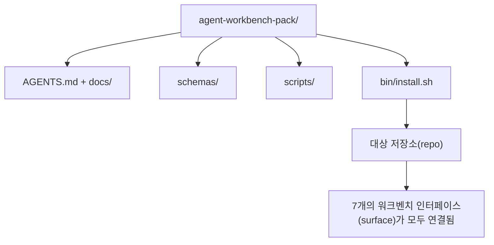

# 캡스톤: 재사용 가능한 에이전트(Agent) 워크벤치 팩 출시하기

> 미니 트랙은 어떤 저장소(repo)에든 넣을 수 있는 팩으로 마무리됩니다. 11강의 인터페이스(surface)가 하나의 디렉토리로 압축되어, `cp -r`을 설치하면 다음 날 아침부터 에이전트(Agent)가 안정적으로 작동합니다. 이 캡스톤은 이 커리큘럼이 제공하는 산출물입니다.

**유형:** Build
**언어:** Python (stdlib)
**선수 요건:** 14단계 · 31강부터 14단계 · 41강
**시간:** 약 75분

## 학습 목표

- 7개의 워크벤치 인터페이스(surface)를 하나의 드롭인(drop-in) 디렉토리로 패키징하세요.
- 스키마(schema), 스크립트, 템플릿을 고정(pin)하여 새 저장소(repo)가 알려진 좋은 기준선(baseline)을 갖도록 하세요.
- 팩을 멱등적으로(idempotently) 설치하는 단일 설치 스크립트를 추가하세요.
- 팩에 포함할 것과 제외할 것을 결정하고, 각 제외 항목에 대한 근거를 방어하세요.

## 문제점

Google 문서, 채팅 기록, 그리고 세 개의 반쯤 기억나는 스크립트에 의존하는 워크벤치는 매 분기마다 재구축됩니다. 해결책은 버전 관리되는 팩입니다: 인터페이스(surface), 스키마(schema), 스크립트, 그리고 단일 명령 설치 프로그램이 포함된 저장소(repo) 또는 디렉토리입니다.

이 강의를 마치면 `outputs/agent-workbench-pack/`이 디스크에 출시되고, `bin/install.sh`이 이를 대상 저장소(repo)에 드롭하는 상태가 됩니다.

## 개념



### 팩 레이아웃

```
outputs/agent-workbench-pack/
├── AGENTS.md
├── docs/
│   ├── agent-rules.md
│   ├── reliability-policy.md
│   ├── handoff-protocol.md
│   └── reviewer-rubric.md
├── schemas/
│   ├── agent_state.schema.json
│   ├── task_board.schema.json
│   └── scope_contract.schema.json
├── scripts/
│   ├── init_agent.py
│   ├── run_with_feedback.py
│   ├── verify_agent.py
│   └── generate_handoff.py
├── bin/
│   └── install.sh
└── README.md
```

### 포함할 것과 제외할 것

포함:

- 인터페이스(surface) 스키마(schema). 이들은 계약(contract)입니다.
- 위 네 개의 스크립트. 이들은 런타임(runtime)입니다.
- 네 개의 문서. 이들은 규칙과 평가 기준(rubric)입니다.

제외:

- 프로젝트별 작업(task). 작업은 팩이 아니라 대상 저장소(repo)의 보드에 속합니다.
- 벤더 SDK 호출. 팩은 프레임워크에 독립적입니다.
- 온보딩(onboarding) 산문. 팩은 팀의 기존 온보딩(onboarding) 옆에 위치하며 그 내부에 있지 않습니다.

### 설치 프로그램

짧은 `bin/install.sh` (또는 `bin/install.py`):

1. `--force` 없이 기존 팩 위에 설치하는 것을 거부합니다.
2. 팩을 대상 저장소(repo)에 복사합니다.
3. `.github/workflows/`이 존재하면 CI를 연결합니다.
4. 다음 단계를 출력합니다: 보드 채우기, 수용 명령 설정, init 스크립트 실행.

### 버전 관리

팩은 `VERSION` 파일을 포함합니다. 마이그레이션이 필요한 스키마 변경 및 스크립트 변경은 major 버전을 올립니다. 문서 전용 변경은 patch 버전을 올립니다. 대상 저장소의 `agent_state.json`은 팩이 어떤 버전으로 초기화되었는지 기록합니다.

```figure
wb-pack-install
```

## 구현하기

`code/main.py`는 이전 미니 트랙 강의에서 작성한 스키마, 스크립트 및 문서로 시드된 `outputs/agent-workbench-pack/`을 강의 옆에 조립합니다.

실행해 보세요:

```
python3 code/main.py
```

스크립트는 표면(surface)을 복사하고 고정(pinning)하며, README를 작성하고, 팩 트리를 출력한 후 0으로 종료합니다. 재실행은 멱등성(Idempotency)을 가집니다.

## 실전에서의 프로덕션 패턴

팩은 포크, 업데이트 및 비우호적인 upstream을 견뎌야만 가치가 있습니다. 네 가지 패턴이 이를 가능하게 합니다.

**`VERSION`은 마케팅이 아닌 계약입니다.** Major 버전 상향은 상태 마이그레이션을 요구합니다. Minor 버전 상향은 checker 재실행을 요구합니다. Patch 버전 상향은 문서 전용입니다. 설치 프로그램은 모든 설치 시 대상 저장소에 `.workbench-version`을 기록합니다. `lint_pack.py`는 대상의 lock이 팩의 `VERSION`과 일치하지 않으면 배포를 거부합니다. 이것이 `npm`, `Cargo`, `pyproject.toml`이 10년간의 변화(churn)를 견디는 방식입니다. 에이전트에 관한 어떤 것도 규칙을 바꾸지 않습니다.

**도구 간 배포를 위한 단일 소스.** Nx는 단일 설정으로 `AGENTS.md`, `CLAUDE.md`, `.cursor/rules/`, `.github/copilot-instructions.md` 및 MCP 서버를 배치하는 `nx ai-setup`을 제공합니다. 팩도 동일하게 해야 합니다. 설치 프로그램은 심링크(`ln -s AGENTS.md CLAUDE.md`)를 생성하여 단일 진실 공급원(single source of truth)이 모든 코딩 에이전트로 퍼져 나가게 합니다. 한 도구를 다른 도구보다 우선시하기 위해 팩을 포크하는 것은 실패 모드입니다.

**비자명한(non-trivial) 상태가 있으면 거부하는 `uninstall.sh`.** 팩을 제거할 때 사용자의 `agent_state.json`, `task_board.json` 또는 `outputs/`을 삭제해서는 안 됩니다. 제거 프로그램은 스키마, 스크립트, 문서 및 `AGENTS.md`(`--keep-agents-md` opt-out 포함)를 제거하며, 상태 파일에 커밋되지 않은 변경 사항이 있으면 진행을 거부합니다. 상태는 사용자의 소유이며, 팩은 이를 소유하지 않습니다.

**게시 가능한 스킬. SkillKit 스타일 배포.** 이 팩은 SkillKit 스킬로 출시됩니다: `skillkit install agent-workbench-pack`는 단일 소스에서 32개 AI 에이전트(Agent)에 팩을 설치합니다. 팩 저장소(repo)가 진실의 원천(source of truth)이며, SkillKit은 배포 채널입니다. 벤더 종속(vendor lock-in)이 사라지고, 7개 표면(surface)은 동일하게 유지됩니다.

## 사용하기

이 팩이 배포되는 세 가지 위치:

- **저장소(repo)에 넣는 디렉터리로.** `cp -r outputs/agent-workbench-pack /path/to/repo`.
- **공개 템플릿 저장소(repo)로.** 포크(fork) 후 커스터마이즈하며, `VERSION`가 드리프트(drift)를 제어합니다.
- **SkillKit 스킬로.** 에이전트 제품(agent product)에 연결하여 단일 명령으로 팩을 설치합니다.

팩은 레시피(recipe)입니다. 각 설치는 서빙(serving)입니다.

## 출시하기

`outputs/skill-workbench-pack.md`는 프로젝트에 맞춰 조정된 팩을 생성합니다: 팀의 역사(history)에 맞춰 규칙을 날카롭게 다듬고, 저장소(repo)에 맞춰 스코프(scope) 글롭(glob)을 매칭하며, 평가 기준(rubric) 차원을 도메인 특화 항목 하나로 확장합니다.

## 연습 문제

1. 선택 가능한 다섯 번째 문서 중 정식 팩(canonical pack)으로 승격할 대상을 결정하세요. 제외된 항목에 대해 방어하세요.
2. 설치 스크립트(installer)를 `--dry-run` 플래그(flag)를 사용하는 Python으로 다시 작성하세요. bash와 사용성(ergonomics)을 비교하세요.
3. 팩을 안전하게 제거하고, 상태 파일(state files)에 비자명한(non-trivial) 이력이 있으면 제거를 거부하는 `bin/uninstall.sh`를 추가하세요. 비자명한 이력은 무엇을 의미하나요?
4. 팩이 `VERSION`에서 드리프트(drift)되면 실패하는 `lint_pack.py`를 추가하세요. 팩 자체 저장소(repo)의 CI에 연결하세요.
5. 수작업(work-rolled) 워크벤치(workbench)에서 이 팩으로 이주하는 마이그레이션(migration) 런북(runbook)을 작성하세요. 다운타임(downtime)을 최소화하는 작업 순서는 무엇인가요?

## 핵심 용어

| 용어 | 사람들이 말하는 것 | 실제 의미 |
|------|----------------|------------------------|
| 워크벤치 팩(workbench pack) | "스타터 키트(starter kit)" | 7개 표면을 모두 담고 있는 버전 관리된 디렉터리 |
| 설치 스크립트(installer) | "설정 스크립트(setup script)" | 팩을 멱등적으로(idempotently) 설치하는 `bin/install.sh` |
| 팩 버전(pack version) | "VERSION" | 스키마(schema)/스크립트 변경은 메이저(major)로 올리고, 문서 전용 변경은 패치(patch)로 올림 |
| 드롭인 팩(drop-in pack) | "cp -r 후 바로 사용" | 저장소(repo)별 커스터마이즈 없이 첫날부터 팩이 작동 |
| 포크 가능한 템플릿(forkable template) | "GitHub 템플릿(template)" | GitHub의 "Use this template" 기능으로 클론(clone)할 수 있는 공개 저장소(repo) |

## 추가 읽기

- 14단계 · 31강부터 14단계 · 41강까지 — 이 팩이 번들(bundle)하는 모든 표면(surface)
- [SkillKit](https://github.com/rohitg00/skillkit) — 이 스킬을 32개 AI 에이전트(Agent)에 설치하세요
- [Nx Blog, Teach Your AI Agent How to Work in a Monorepo](https://nx.dev/blog/nx-ai-agent-skills) — 6개 도구를 아우르는 단일 소스 생성기
- [agents.md — the open spec](https://agents.md/) — 팩(pack)의 라우터(Model Router)가 구현해야 하는 사항
- [HKUDS/OpenHarness](https://github.com/HKUDS/OpenHarness) — 팩(pack) 동등 구현의 참고 구현
- [Augment Code, A good AGENTS.md is a model upgrade](https://www.augmentcode.com/blog/how-to-write-good-agents-dot-md-files) — 팩(pack) 문서 품질 기준
- [Anthropic, Effective harnesses for long-running agents](https://www.anthropic.com/engineering/effective-harnesses-for-long-running-agents)
- [Anthropic, Harness design for long-running application development](https://www.anthropic.com/engineering/harness-design-long-running-apps)
- 14단계 · 30강 — 팩(pack)의 검증 게이트(Verification Gate)를 소비하는 평가(Evaluation (Eval)) 기반 에이전트(Agent) 개발
- 14단계 · 41강 — 이 팩(pack)이 개선하는 전후 벤치마크
