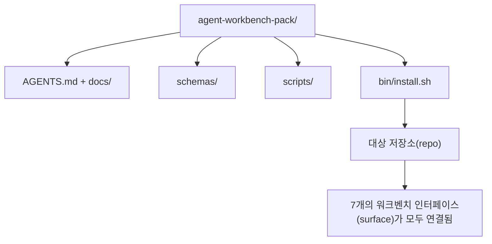

# 캡스톤: 재사용 가능한 에이전트(Agent) 워크벤치 팩 출시하기

> 미니 트랙은 어떤 저장소(repo)에든 넣을 수 있는 팩으로 마무리됩니다. 11강의 인터페이스(surface)가 하나의 디렉토리로 압축되어, `cp -r`을 설치하면 다음 날 아침부터 에이전트(Agent)가 안정적으로 작동합니다. 이 캡스톤은 이 커리큘럼이 제공하는 산출물입니다.

**유형:** Build
**언어:** Python (stdlib)
**선수 요건:** 14단계 · 31강부터 14단계 · 41강
**시간:** 약 75분

## 학습 목표

- 7개의 워크벤치 인터페이스(surface)를 하나의 드롭인(drop-in) 디렉토리로 패키징하세요.
- 스키마(schema), 스크립트, 템플릿을 고정(pin)하여 새 저장소(repo)가 알려진 좋은 기준선(baseline)을 갖도록 하세요.
- 팩을 멱등적으로(idempotently) 설치하는 단일 설치 스크립트를 추가하세요.
- 팩에 포함할 것과 제외할 것을 결정하고, 각 제외 항목에 대한 근거를 방어하세요.
- 리뷰어(reviewer)가 재현할 수 있는 증거와 함께 에이전트(Agent)가 지원한 저장소(repo) 변경을 한 번 시연하세요.

## 문제점

Google 문서, 채팅 기록, 그리고 세 개의 반쯤 기억나는 스크립트에 의존하는 워크벤치는 매 분기마다 재구축됩니다. 해결책은 버전 관리되는 팩입니다: 인터페이스(surface), 스키마(schema), 스크립트, 그리고 단일 명령 설치 프로그램이 포함된 저장소(repo) 또는 디렉토리입니다.

이 강의를 마치면 `outputs/agent-workbench-pack/`이 디스크에 출시되고, `bin/install.sh`이 이를 대상 저장소(repo)에 드롭하는 상태가 됩니다.

## 개념



### 팩 레이아웃

```
outputs/agent-workbench-pack/
├── AGENTS.md
├── docs/
│   ├── agent-rules.md
│   ├── reliability-policy.md
│   ├── handoff-protocol.md
│   └── reviewer-rubric.md
├── schemas/
│   ├── agent_state.schema.json
│   ├── task_board.schema.json
│   └── scope_contract.schema.json
├── scripts/
│   ├── init_agent.py
│   ├── run_with_feedback.py
│   ├── verify_agent.py
│   └── generate_handoff.py
├── bin/
│   └── install.sh
└── README.md
```

### 포함할 것과 제외할 것

포함:

- 인터페이스(surface) 스키마(schema). 이들은 계약(contract)입니다.
- 위 네 개의 스크립트. 이들은 런타임(runtime)입니다.
- 네 개의 문서. 이들은 규칙과 평가 기준(rubric)입니다.

제외:

- 프로젝트별 작업(task). 작업은 팩이 아니라 대상 저장소(repo)의 보드에 속합니다.
- 벤더 SDK 호출. 팩은 프레임워크에 독립적입니다.
- 온보딩(onboarding) 산문. 팩은 팀의 기존 온보딩(onboarding) 옆에 위치하며 그 내부에 있지 않습니다.

### 설치 프로그램

짧은 `bin/install.sh` (또는 `bin/install.py`):

1. `--force` 없이 기존 팩 위에 설치하는 것을 거부합니다.
2. 팩을 대상 저장소(repo)에 복사합니다.
3. `.github/workflows/`이 존재하면 CI를 연결합니다.
4. 다음 단계를 출력합니다: 보드 채우기, 수용 명령 설정, init 스크립트 실행.

### 버전 관리

팩은 `VERSION` 파일을 포함합니다. 마이그레이션이 필요한 스키마 변경 및 스크립트 변경은 major 버전을 올립니다. 문서 전용 변경은 patch 버전을 올립니다. 대상 저장소의 `agent_state.json`은 팩이 어떤 버전으로 초기화되었는지 기록합니다.

```figure
wb-pack-install
```

## 구현하기

`code/main.py`는 이전 미니 트랙 강의에서 작성한 스키마, 스크립트 및 문서로 시드된 `outputs/agent-workbench-pack/`을 강의 옆에 조립합니다.

실행해 보세요:

```
python3 code/main.py
```

스크립트는 표면(surface)을 복사하고 고정(pinning)하며, README를 작성하고, 팩 트리를 출력한 후 0으로 종료합니다. 재실행은 멱등성(Idempotency)을 가집니다.

## 실전에서의 프로덕션 패턴

팩은 포크, 업데이트 및 비우호적인 upstream을 견뎌야만 가치가 있습니다. 네 가지 패턴이 이를 가능하게 합니다.

**`VERSION`은 마케팅이 아니라 계약입니다.** Major 버전 상향은 상태 마이그레이션을 요구합니다. Minor 버전 상향은 checker 재실행을 요구합니다. Patch 버전 상향은 문서 전용입니다. 설치 프로그램은 모든 설치 시 대상 저장소에 `.workbench-version`을 기록합니다. `lint_pack.py`는 대상의 lock이 팩의 `VERSION`과 일치하지 않으면 배포를 거부합니다. 이것이 `npm`, `Cargo`, `pyproject.toml`이 10년간의 변화(churn)를 견디는 방식입니다. 에이전트와 관련된 사항이 규칙을 바꾸지 않습니다.

**도구 간 배포를 위한 단일 소스.** Nx는 단일 설정으로 `AGENTS.md`, `CLAUDE.md`, `.cursor/rules/`, `.github/copilot-instructions.md` 및 MCP 서버를 배치하는 `nx ai-setup`을 제공합니다. 팩도 동일하게 해야 합니다. 설치 프로그램은 심링크(`ln -s AGENTS.md CLAUDE.md`)를 생성하여 단일 진실 공급원(single source of truth)이 모든 코딩 에이전트로 퍼져 나가게 합니다. 한 도구를 다른 도구보다 우선시하기 위해 팩을 포크하는 것은 실패 모드입니다.

**비자명한(non-trivial) 상태가 있으면 거부하는 `uninstall.sh`.** 팩을 제거할 때 사용자의 `agent_state.json`, `task_board.json` 또는 `outputs/`을 삭제해서는 안 됩니다. 제거 프로그램은 스키마, 스크립트, 문서 및 `AGENTS.md`(`--keep-agents-md` opt-out 포함)를 제거하며, 상태 파일에 커밋되지 않은 변경 사항이 있으면 진행을 거부합니다. 상태는 사용자의 소유이며, 팩은 이를 소유하지 않습니다.

**게시 가능한 스킬. SkillKit 스타일 배포.** 이 팩은 SkillKit 스킬로 출시됩니다: `skillkit install agent-workbench-pack`는 단일 소스에서 32개 AI 에이전트(Agent)에 팩을 설치합니다. 팩 저장소(repo)가 진실의 원천(source of truth)이며, SkillKit은 배포 채널입니다. 벤더 종속(vendor lock-in)이 사라지고, 7개 표면(surface)은 동일하게 유지됩니다.

## 사용하기

이 팩이 배포되는 세 가지 위치:

- **저장소(repo)에 넣는 디렉터리로.** `cp -r outputs/agent-workbench-pack /path/to/repo`.
- **공개 템플릿 저장소(repo)로.** 포크(fork) 후 커스터마이즈하며, `VERSION`가 드리프트(drift)를 제어합니다.
- **SkillKit 스킬로.** 에이전트 제품(agent product)에 연결하여 단일 명령으로 팩을 설치합니다.

팩은 레시피(recipe)입니다. 각 설치는 서빙(serving)입니다.

## 출시하기

`outputs/skill-workbench-pack.md`는 프로젝트에 맞춰 조정된 팩을 생성합니다: 팀의 역사(history)에 맞춰 규칙을 날카롭게 다듬고, 저장소(repo)에 맞춰 스코프(scope) 글롭(glob)을 매칭하며, 평가 기준(rubric) 차원을 도메인 특화 항목 하나로 확장합니다.

## 연습 문제

1. 선택적인 다섯 번째 문서 중 어떤 것이 정식 팩으로 승격되어야 하는지 결정하세요. 제외 결정을 방어하세요.
2. 설치 스크립트를 `--dry-run` 플래그가 있는 Python으로 다시 작성하세요. bash와 사용성을 비교하세요.
3. 팩을 안전하게 제거하고 상태 파일에 비자명한 이력이 있으면 제거를 거부하는 `bin/uninstall.sh`를 추가하세요. 비자명한 이력은 무엇을 의미하나요?
4. 팩이 `VERSION`에서 드리프트되면 실패하는 `lint_pack.py`를 추가하세요. 팩 자체 저장소(Repository)의 CI에 연결하세요.
5. 수작업 워크벤치에서 이 팩으로 이관하는 런북을 작성하세요. 다운타임을 최소화하는 작업 순서는 무엇인가요?

## 커리어 연습: 하나의 저장소 변경 증명하기

패키징 데모는 어셈블러가 실행되어 파일을 생성함을 증명합니다. 에이전트(Agent)가 새로운 작업을 완료할 수 있음을, 생성된 체크가 그 작업을 증명함을, 배포된 시스템이 작동함을 증명하지는 않습니다. 이러한 주장들을 분리하세요.

본인이 소유하거나 변경 권한이 있는 저장소(Repository)에서 작은 실제 작업을 선택하세요. 이미 접근 권한이 있는 코딩 에이전트(Coding Agent) 하나를 사용하세요. 버그 수정, 범위가 한정된 기능, 또는 운영 개선이면 충분합니다; 여러 에이전트(Agent)를 설치하는 것은 연습의 일부가 아닙니다.

패키징 실습 이후 별도의 작업 세션을 예산에 포함하세요. 아래에 연결된 증거 템플릿을 자신의 `learning-artifacts/` 디렉토리로 복사하세요. 체크인된 템플릿을 유지하고 참조 자료로 패키징하세요.

### 1. 작업을 정의하고 자율성을 선택하세요

43강의 작업 프레임과 44강의 증거 계획을 사용하세요. 시작 리비전, 관찰 가능한 목표, 비목표, 허용된 경로, 수용 증거를 기록하세요. 해당 동작이 필요한 실제 사용자나 운영자를 식별하세요.

작업 모드를 선택하세요: 안내된 단계, 체크포인트가 있는 구현, 또는 제한된 자율 실행. 불확실성, 결과, 가역성이 이를 정당화하는 이유를 설명하세요. 작은 로컬 리팩토링은 접근 제어 변경보다 체크포인트가 적게 필요할 수 있습니다.

에이전트가 노출하는 경우, 벽 시간 예산과 토큰 또는 비용 제한을 설정하세요. 측정할 수 없는 항목은 정직하게 기록하세요. 반복 실패, 새로운 권한, 예산 소진, 미해결 계약 결정에 대한 중단 조건을 정의하고, 이를 해결할 수 있는 사람을 지정하세요.

### 2. 가장 작은 유용한 환경을 준비하세요

관련된 구현, 호출자, 테스트, 로컬 지침을 가져오세요. 각 소스가 컨텍스트에 포함되는 이유와, 오래된 노트를 덮어쓸 현재 증거가 무엇인지 기록하세요. 기본적으로 전체 저장소를 로드하지 마세요.

각 관련 확장 기능에 대해 명시적인 선택을 하세요: 스킬은 반복 가능한 절차를 제공하며, MCP 도구는 접근을 제공하며, 훅은 결정적 검사를 실행하며, 플러그인은 기능을 패키징합니다. 작업이 필요로 할 때만 확장 기능을 유지하고, 작동할 수 있는 최소 권한을 사용하세요.

거절된 제안된 추가 기능의 컨텍스트 또는 유지보수 비용을 기록하세요. 오래된 메모리나 지침을 재검토하고, 증거가 그 결정을 지지할 때 학습자 소유 설정에서 폐기하거나 교체하세요. 제거가 필요한 제약 조건을 잃지 않았는지 확인하기 위해 영향을 받은 검사를 다시 실행하세요.

### 3. 기준선을 캡처하고 구현하세요

편집하기 전에 가장 가까운 기존 검사를 실행하고 요청된 동작의 현재 상태를 시연하세요. 명령, 리비전, 결과, 증거 위치를 유지하세요. 아직 존재하지 않는 기능에도 기준선이 있습니다: 관찰된 응답이나 지원되지 않는 작업을 기록하세요.

계약 내에서 에이전트가 구현하도록 하세요. 각 수정, 권한 변경, 계획 개정의 이유를 포함한 개입 로그를 유지하세요. 위임은 선택 사항입니다. 유용하다면, 다른 워커를 추가하기 전에 45강의 소유권 및 통합 계약을 적용해 보세요.

### 4. 증거에 도전하세요

변경된 표면을 관찰하는 증거를 선택하세요. UI의 경우, 관련 너비에서 제공된 여정을 재빌드하고 검사하세요. API의 경우, 요청과 직렬화된 응답을 검사하세요. CLI의 경우, 빌드된 명령을 실행하고 종료 코드와 출력을 확인하세요. 작업에 필요한 검사를 선택하고 그 한계를 설명하세요.

에이전트의 구현과 독립적으로 작업 계약에서 기대되는 결과를 작성하세요. 일회용 사본에서 유효하지 않은 값을 허용하거나 필수 응답 필드를 누락하는 것과 같은 특정 잘못된 결과를 도입하세요. 동일한 수용 검사를 실행하세요: 그 이유로 실패해야 합니다.

검사가 계속 통과한다면, 신뢰하기 전에 단정(assertion)이나 관찰을 강화하세요. 올바른 구현을 복원하고 성공적으로 재실행하세요. 두 영수증(receipt)을 모두 보관하세요. 구문 오류나 깨진 테스트 설정은 회귀를 감지한 것으로 간주되지 않습니다.

변경된 테스트를 포함한 최종 diff를 원래 목표와 허용된 경로에 대해 검토하세요. 구현을 편집하지 않으면서 가장 약한 증거에 도전하도록 동료나 별도의 리뷰어 세션에 요청하세요. 최종 판단은 여전히 당신이 소유합니다. 다른 에이전트의 동의는 실행 증거가 아닙니다.

### 5. 운영 및 복구를 연습하세요

변경된 산출물을 일회용 로컬 또는 스테이징 환경에서 실행하세요. 모든 관찰을 `local`, `staging`, `live`로 라벨링하고, 정확한 리비전이나 산출물 식별자를 포함하세요. 로컬 연습은 로컬 주장을 뒷받침합니다. 이 연습을 위해 프로덕션 배포는 필요하지 않습니다.

작업과 관련된 하나의 실패 신호, 임계값, 관찰 윈도우, 소유자를 선택하세요. 그 임계값이 초과될 때의 대응을 설명하세요. 연습 환경에서 신호를 안전하게 트리거하고 관찰된 로그, 메트릭, 또는 응답을 보존하세요.

알려진 좋은(good) 산출물로 롤백을 연습하고 이전 동작이 복원되는지 확인하세요. 해당되는 경우 지속되는 데이터를 고려하세요. 바이너리만 교체하는 것만으로는 데이터 변경을 되돌릴 수 없을 수 있습니다. 검증할 수 없었던 복구 단계를 기록하세요.

### 6. 다음 실행을 개선하고 핸드오프하세요

결과를 기준선과 비교하세요. 경과 시간, 사용 가능한 사용 데이터, 인간 개입을 포함해야 합니다. 한 작업은 그 작업에서 일어난 일을 보여줄 뿐이며, 에이전트가 일반적으로 더 빠르거나 더 신뢰할 수 있음을 증명하지는 않습니다.

46강을 사용하여 관찰된 한 가지 수정을 테스트, 더 작은 권한 경계, 자동화, 또는 더 명확한 예시로 승격하세요. 영향을 받은 검사를 다시 실행하세요. 임시 변경을 제거하고, 최종 브랜치, 변경된 파일, 열린 위험, 그리고 다음 세션을 위한 다음 조치를 명시적으로 남겨두세요.

### 수동 검토 평가 기준

리뷰어가 증거 파일을 검토하고, 적어도 가장 약한 수용 검사를 재현하도록 하세요. 각 행에 대해 `demonstrated`, `needs revision`, 또는 `unverified`를 사용하며, 증거 포인터와 이유를 포함하세요. 채워진 필드와 통과하는 패키징 스크립트는 이러한 관찰을 대체하지 않습니다.

| 차원 | 리뷰어가 도전해야 할 증거 |
|---|---|
| 작업 및 자율성 | 시작 동작, 제한된 목표, 정당화된 권한, 예산, 그리고 사용 가능한 중단 규칙 |
| 컨텍스트 및 환경 | 관련 출처, 정당화된 도구 접근, 그리고 재검토된 은퇴 결정 |
| 검증 | 실제 전후 동작과, 동일한 검사가 거부하는 의도적으로 잘못된 결과 |
| 검토 및 운영 | 검토된 diff, 독립적인 도전, 라벨이 붙은 런타임 관찰, 그리고 연습된 복구 |
| 반복 및 핸드오프 | 검증된 한 가지 개선, 정직한 한계, 깨끗한 최종 상태, 그리고 재현 가능한 다음 조치 |

작업이 완료되었다고 주장하기 전에 `needs revision` 발견 사항을 해결하세요. 사용 불가능한 증거 `unverified`를 남겨두고, 주장에 따라 범위를 좁히세요. 포트폴리오는 제한된 작업에 대한 당신의 엔지니어링 판단력을 보여줍니다. 이는 채용이나 배포 보장이 아닙니다.

## 출시된 산출물

재사용 가능한 팩과 [career-agent-evidence.md](https://github.com/rohitg00/ai-engineering-from-scratch/blob/main/phases/14-agent-engineering/42-agent-workbench-capstone/outputs/career-agent-evidence.md)의 완성된 사본을 유지하세요. 템플릿은 작업 프레임, 실행 계획, 런타임 영수증, 검토, 복구 연습, 그리고 핸드오프를 하나의 검토 가능한 사례 연구로 연결합니다.

## 핵심 용어

| 용어 | 사람들이 말하는 것 | 실제 의미 |
|------|----------------|------------------------|
| 워크벤치 팩(workbench pack) | "스타터 키트(starter kit)" | 7개 표면을 모두 담고 있는 버전 관리된 디렉터리 |
| 설치 스크립트(installer) | "설정 스크립트(setup script)" | 팩을 멱등적으로(idempotently) 설치하는 `bin/install.sh` |
| 팩 버전(pack version) | "VERSION" | 스키마(schema)/스크립트 변경은 메이저(major)로 올리고, 문서 전용 변경은 패치(patch)로 올림 |
| 드롭인 팩(drop-in pack) | "cp -r 후 바로 사용" | 저장소(repo)별 커스터마이즈 없이 첫날부터 팩이 작동 |
| 포크 가능한 템플릿(forkable template) | "GitHub 템플릿(template)" | GitHub의 "Use this template" 기능으로 클론(clone)할 수 있는 공개 저장소(repo) |

## 추가 읽기

- 14단계 · 31부터 14 · 41까지 — 이 패키지가 번들하는 모든 표면
- [SkillKit](https://github.com/rohitg00/skillkit) — 32개 AI 에이전트(Agent)에 이 스킬을 설치
- [Nx Blog, Teach Your AI Agent How to Work in a Monorepo](https://nx.dev/blog/nx-ai-agent-skills) — 6개 도구에 걸친 단일 소스 생성기
- [agents.md — the open spec](https://agents.md/) — 패키지의 라우터가 구현해야 하는 사항
- [HKUDS/OpenHarness](https://github.com/HKUDS/OpenHarness) — 패키지 동등물의 참조 구현
- [Augment Code, A good AGENTS.md is a model upgrade](https://www.augmentcode.com/blog/how-to-write-good-agents-dot-md-files) — 패키지 문서 품질 기준
- [Anthropic, Effective harnesses for long-running agents](https://www.anthropic.com/engineering/effective-harnesses-for-long-running-agents)
- [Anthropic, Harness design for long-running application development](https://www.anthropic.com/engineering/harness-design-long-running-apps)
- 14단계 · 30 — 패키지의 검증 게이트(Verification Gate)를 소비하는 평가 기반 에이전트 개발
- 14단계 · 41 — 이 패키지가 개선하는 전후 벤치마크
