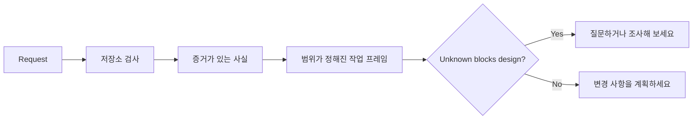

# 에이전트가 코드를 작성하기 전에 작업을 프레임화하세요

> 코딩 에이전트는 명확한 작업을 빠르게 구현할 수 있습니다. 불명확한 작업도 빠르게 구현할 수 있습니다. 속도는 동일합니다. 비용은 다릅니다.

**유형:** Learn + Build
**언어:** Python (stdlib)
**선수 요건:** 14단계 31강 및 36강
**시간:** 약 60분

## 학습 목표

- 편집 전에 요청을 범위가 정해진 작업 프레임으로 변환하세요.
- 저장소 사실과 가정 및 미해결 질문을 분리하세요.
- 허용 경로, 금지 경로 및 수용 증거를 정의하세요.
- 정찰이 작업을 시작하기에 충분한 시점을 결정하세요.

## 비싼 실패

“중복 이메일 보호 추가”는 구체적으로 들립니다. 그렇지 않습니다. 고유성은 API, 도메인 서비스, 데이터베이스 중 어디에 속해야 합니까? 비교는 대소문자를 구분합니까? 어떤 오류 형식이 이미 공개되어 있습니까? 마이그레이션이 허용됩니까? 어떤 테스트가 동작을 증명합니까?

유능한 에이전트는 이러한 공백을 그럴듯한 선택지로 채울 것입니다. 구현이 깔끔하고 테스트가 완료되어도 시스템과 호환되지 않을 수 있으므로 이것이 위험한 경우입니다.

따라서 코딩 에이전트 작업의 첫 단위 편집이 아닙니다. 저장소 증거에 기반한 작업 프레임입니다.

## 작업 프레임

유용한 프레임은 6개 필드를 포함합니다:

| 필드 | 질문 |
|---|---|
| 목표 | 어떤 관찰 가능한 동작이 변경되어야 합니까? |
| 저장소 사실 | 코드, 테스트, 설정 또는历史记录에서 무엇을 검증했습니까? |
| 허용 경로 | 변경이 어디에 적용될 수 있습니까? |
| 금지 경로 | 무엇을 건드리지 않아야 합니까? |
| 수용 증거 | 어떤 명령이나 관찰이 목표를 증명합니까? |
| 미지수 | 어떤 결정이 여전히 증거 또는 인간 판단을 필요로 합니까? |

사실은 증빙이 필요합니다. “API는 중복에 409를 사용한다”는 기존 테스트나 핸들러를 지목할 수 있을 때까지 사실이 아닙니다. 파일 경로와 줄 번호는 충분합니다. 동작이 중요할 때는 명령 결과 증빙이 더 좋습니다.



## 정찰은 제약 조건을 찾는 과정입니다

저장소 전체를 읽지 마세요. 변경을 제약하는 표면을 검색하세요:

1. 현재 동작과 그 호출자.
2. 가장 가까운 기존 테스트.
3. 공개 계약이나 직렬화된 형태.
4. 해당 경로를 지배하는 프로젝트 지침.
5. 빌드 및 검증 명령.
6. 지역 패턴을 드러내는 유사한 완료된 변경 사항.

계획된 모든 결정이 증거에 의해 지원되거나, 명시적으로 위임되었거나, 미지수로 나열되면 멈추세요. 그 이후의 추가 읽기는 종종 회피입니다.

## 미지수는 실패가 아닙니다

미지수는 통제된 공백입니다. 가정은 그 공백에 대한 통제되지 않은 답변입니다.

각 미지수를 분류하세요:

- **발견 가능:** 저장소나 실행 중인 시스템이 답할 수 있습니다.
- **결정 가능:** 작업 계약이 에이전트(Agent)에게 선택 권한을 부여합니다.
- **인간:** 선택이 제품 동작, 비용, 위험, 공개 호환성을 변경합니다.
- **연기:** 선택이 이 슬라이스 밖에 있으며 비목표에 속합니다.

에이전트(Agent)는 발견 가능한 미지수와 위임된 미지수를 통해 계속 진행해야 합니다. 선택이 코드에 묻히기 전에 인간 미지수에서 일시 중지해야 합니다.

## 구현 전 수용

패치 전에 증명을 작성하세요. 증명은 다음이 될 수 있습니다:

- 집중된 단위 또는 통합 테스트 명령;
- 명명된 뷰포트와 예상 상태를 포함한 브라우저 여정;
- 와이어 요청과 정확한 응답 계약;
- 임계값을 포함한 성능 측정;
- 관련 없는 파일이 변경되지 않았음을 확인하는 범위 검사.

“테스트 통과”는 증명 계획이 아닙니다. 권위 있는 테스트와 그것이 지원하는 주장을 명시하세요.

## 구현하기

실험실은 `TaskFrame`을 생성하고, 그 경계와 증거를 검증하며, `outputs/task-frame.md`을 작성합니다.

이 강의 디렉토리에서 실행하세요:

```bash
python3 code/main.py
python3 -m unittest discover code/tests -v
```

예제를 네 가지 방식으로 깨뜨려 보세요: 목표를 제거하고, 사실 영수증을 제거하고, 허용된 경로와 금지된 경로를 겹치게 하고, 수용 명령을 제거해 보세요. 검증기는 각 프레임을 서로 다른 이유로 거부해야 합니다.

## 실제 저장소에서 사용해 보세요

에이전트(Agent)에게 편집을 요청하기 전에:

1. 목표를 파일 변경이 아닌 행동으로 작성하세요.
2. 정확한 증거와 함께 두세 가지 사실을 기록하세요.
3. 가장 작은 허용 경로 집합을 지정하세요.
4. 금지된 영역(negative space)을 명시적으로 지정하세요.
5. 작업을 마무리하는 명령이나 관찰 결과를 작성하세요.
6. 아직 정당화되지 않은 결정들을 나열하세요.

프레임은 한 화면에 담겨야 합니다. 만약 담기지 않는다면, 작업이 여러 개의 독립적으로 검증 가능한 변경을 포함하고 있을 수 있습니다.

## 연습 문제

1. 해결책을 제안하지 않고, 저장소 중 하나에서 실제 버그를 프레임화 해 보세요.
2. 프레임 내에서 실제로는 가정인 주장 하나를 찾아 증거로 대체하세요.
3. 답변이 공개 계약(public contract)을 변경할 인간이 모르는 부분(human unknown)을 추가하세요.
4. 넓은 허용 경로 하나를 가장 안전한 최소 집합으로 분할하세요.
5. 수용 증거에 범위 영수증(scope receipt)을 추가하세요.

## 추가 읽기

- [Nuseibeh and Easterbrook, Requirements Engineering: A Roadmap](https://www.cs.toronto.edu/~sme/papers/2000/ICSE2000.pdf), 구현을 실제 세계의 목표와 진화하는 제약 조건에 연결하는 데 유용합니다.
- [Yang et al., SWE-agent: Agent-Computer Interfaces Enable Automated Software Engineering](https://arxiv.org/abs/2405.15793), 코딩 에이전트(Coding Agent) 주변 인터페이스가 그 효과성을 변화시킨다는 증거를 제공합니다.

## 보관할 내용

`outputs/task-frame.md`을 보관하세요. 이는 다음 강의의 입력이 되며, 여기서 프레임은 증거가 뒷받침되는 실행 계획이 됩니다.
