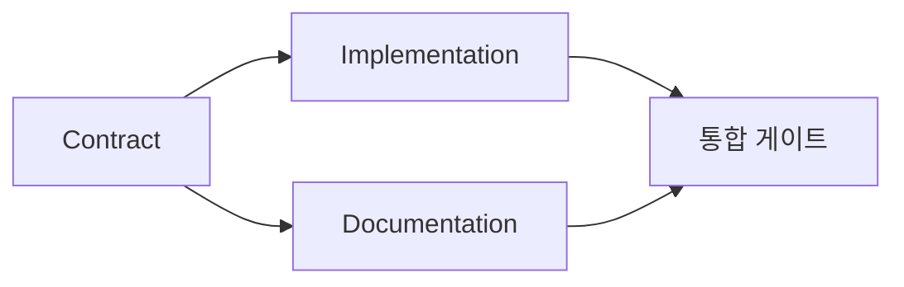

# 증거 기반 실행 계획 구축하기

> 계획은 더 예쁜 할 일 목록이 아닙니다. 모든 변경 사항에 이유가 있고 모든 최종 노드에 증거가 있는 의존성 그래프입니다.

**유형:** Learn + Build
**언어:** Python (stdlib)
**선수 요건:** 14단계 43강
**시간:** 약 65분

## 학습 목표

- 작업 프레임을 증거와 증거가 있는 작업 항목으로 변환해 보세요.
- 순서 있는 산문 대신 의존성으로 순서를 모델링해 보세요.
- 편집 전에 누락된 사실, 알 수 없는 의존성, 순환을 감지해 보세요.
- 함께 실행할 수 있는 단계와 반드시 기다려야 하는 단계를 분리해 보세요.

## 에이전트 계획이 실패하는 이유

약한 계획은 요청을 미래 시제로 반복합니다:

1. API를 업데이트합니다.
2. 테스트를 추가합니다.
3. 문서를 업데이트합니다.

해당 목록에는 발견된 내용, 파일이 올바른 이유, 계약이 먼저 변경되는 순서, 동시에 발생할 수 있는 작업이 전혀 없습니다. 에이전트는 모든 단계를 따를 수 있지만 여전히 재작업을 만들 수 있습니다.

강한 계획은 각 작업 항목에 대해 다섯 가지 약속을 만듭니다:

| 약속 | 목적 |
|---|---|
| 식별자 | 의존성 및 핸드오프를 위한 안정적 참조 |
| 변경 | 가장 작은 동작 또는 계약 변경 |
| 증거 | 변경을 정당화하는 저장소 사실 |
| 의존성 | 먼저 참이어야 하는 작업 |
| 증거 | 항목을 닫는 정확한 검사 |

## 구현 전에 계약 계획하기

여러 표면이 동일한 동작에 의존할 경우, 동작을 먼저 정의합니다. 테스트, 구현, 문서 및 통합은 네 가지 버전을 발명하는 대신 하나의 계약을 공유할 수 있습니다.



그래프는 안전한 동시성을 노출합니다. 계약이 고정된 후 구현과 문서는 함께 진행할 수 있습니다. 통합은 둘 다 완료될 때까지 기다립니다.

## 증거가 계획을 변경합니다

저장소 증거는 장식이 아닙니다. 작업을 변경할 수 있어야 합니다:

- 기존 헬퍼가 계획된 새로운 추상화를 제거합니다.
- 호환성 테스트가 마이그레이션 단계를 강제합니다.
- 배포 제약이 스키마 변경을 다른 작업으로 이동시킵니다.
- 공개 응답 타입이 구현 및 문서화의 순서를 변경합니다.

증거가 계획을 변경할 수 없다면, 그 증거는 해당 결정에 대한 증거가 아닐 가능성이 높습니다.

## 중단 대비 설계

코딩 에이전트 세션이 예상치 못하게 종료됩니다. 재개 가능한 계획은 다른 세션이 다음을 결정할 수 있을 만큼 작업 항목이 작아야 합니다:

- 어떤 항목이 완료되었는지;
- 어떤 증명이 실행되었는지;
- 어떤 산출물이 변경되었는지;
- 어떤 의존성이 이제 차단 해제되었는지;
- 다음 안전한 항목이 무엇인지.

상태를 채팅 내의 체크 박스에만 인코딩하지 마세요. 계획을 작업 옆에 저장하세요.

## 계획 검증

실행 전에 계획을 거부하세요. 다음 경우:

- 식별자가 중복될 때;
- 작업 항목에 증거가 없을 때;
- 작업 항목에 증명이 없을 때;
- 의존성이 알 수 없는 항목을 참조할 때;
- 그래프에 사이클이 포함될 때;
- 관련 불확실성이 해결되기 전에 첫 번째 비가역적 조치가 발생할 때.

첫 다섯 가지 체크는 기계적입니다. 마지막 체크는 판단이 필요하며 명시적으로 언급해야 합니다.

## 구현하기

`code/main.py`는 작업 항목을 모델링하고, 그 영수증을 검증하며, 위상 정렬로 실행 웨이브를 계산하고, `outputs/evidence-plan.json`을 작성합니다.

실행:

```bash
python3 code/main.py
python3 -m unittest discover code/tests -v
```

예제는 세 개의 웨이브를 생성합니다. 계약 정의가 먼저 실행됩니다. 구현과 문서화가 함께 실행됩니다. 통합 게이트가 마지막에 실행됩니다.

## 코딩 에이전트와 함께 사용하기

파일을 변경하기 전에 계획을 생성하도록 에이전트에게 요청하세요. 계획을 세 가지 측면에서 검토하세요:

1. 모든 경로 및 동작 주장이 저장소 영수증을 가지고 있습니다.
2. 모든 항목이 하나의 명확한 완료 증명을 가지고 있습니다.
3. 그래프는 비싼 작업이나 비가역적 작업을, 그 작업이 의존하는 불확실성이 해결될 때까지 지연시킵니다.

모호한 주의 약속이 아닌, 계획을 승인하세요.

## 연습 문제

1. 명시적인 인간 승인을 요구하는 마이그레이션 항목을 추가해 보세요.
2. 순환을 만들고 그 뒤에 숨겨진 제품 의견 불일치를 설명해 보세요.
3. 두 개의 증명 명령을 가진 항목을 분리해 보세요.
4. 기존 브랜치 중 어느 것도 건드리지 않고 두 번째 웨이브에서 실행할 수 있는 작업 항목을 추가해 보세요.
5. JSON을 진실의 원천(source of truth)으로 유지하면서 계획을 Markdown으로 렌더링해 보세요.

## 추가 읽기

- [Nuseibeh and Easterbrook, Requirements Engineering: A Roadmap](https://www.cs.toronto.edu/~sme/papers/2000/ICSE2000.pdf), 목표, 사양, 합의 및 진화 간의 반복적 관계에 대해 읽어 보세요.
- [Barry Boehm, A Spiral Model of Software Development and Enhancement](https://dl.acm.org/doi/10.1145/12944.12948), 고정된 선형 순서가 아닌 위험 해결을 중심으로 개발을 순서화하는 것에 대해 읽어 보세요.

## 유지할 사항

`outputs/evidence-plan.json`을 유지하세요. 이는 다음 강에서 위임 계약이 됩니다.
