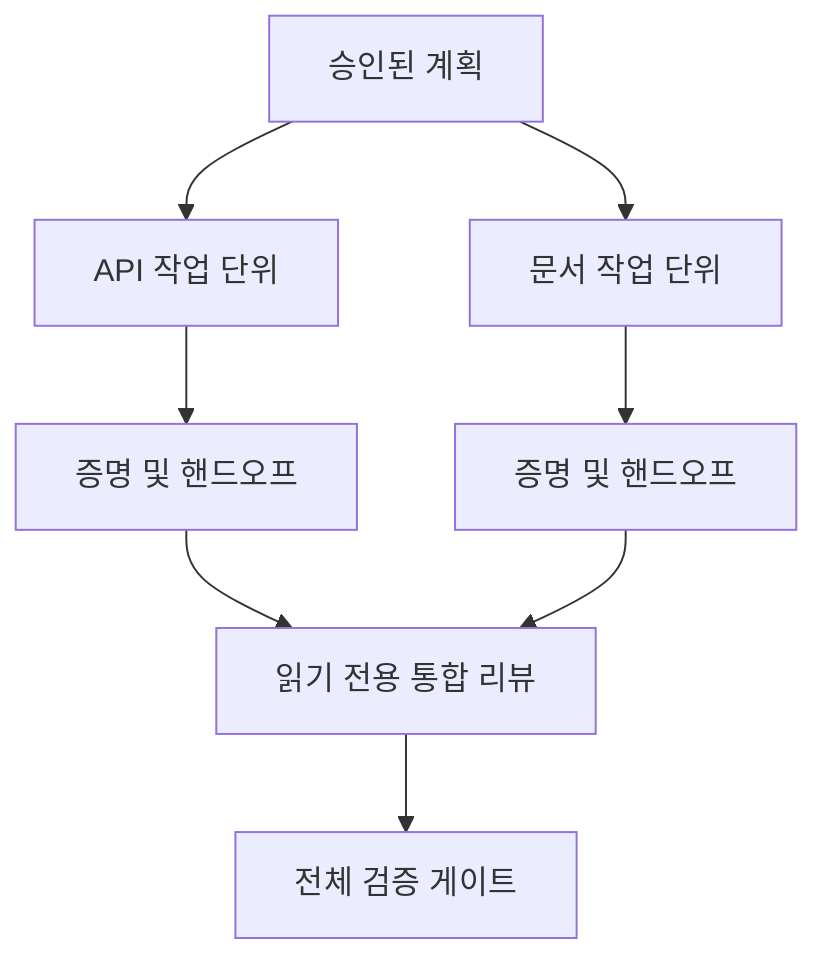

# 격리 및 병합 계약으로 에이전트 작업 위임하기

> 병렬 에이전트는 작업이 독립적일 때만 실제 시간을 절약합니다. 그렇지 않으면 하나의 명확한 작업을 더 빠른 실패율을 가진 조정 문제로 변환합니다.

**유형:** Learn + Build
**언어:** Python (stdlib)
**선수 요건:** 14단계 39강 및 44강
**시간:** 약 70분

## 학습 목표

- 실제 독립성에 의해 위임이 정당화되는지 결정해 보세요.
- 각 작업자에게 독점적인 파일 소유권과 명시적인 증명을 부여해 보세요.
- 의존성으로부터 실행 웨이브를 계산해 보세요.
- 에이전트 작업을 안전하게 결합하기 위한 병합 계약을 설계해 보세요.

## 병렬성 테스트

더 많은 에이전트가 가용하다는 이유로 위임하지 마세요. 다음 중 하나 이상이 참일 때 위임하세요:

- 두 조사가 서로 다른 미지수를 독립적으로 답할 수 있습니다;
- 두 구현이 서로 겹치지 않는 파일과 계약을 소유합니다;
- 리뷰어가 완료된 산출물을 변경하지 않고 검사할 수 있습니다;
- 느린 외부 검사가 로컬 작업이 진행되는 동안 실행될 수 있습니다.

에이전트가 동일한 파일, 동일한 미해결 결정, 또는 동일한 변경 가능한 환경을 필요로 할 때는 작업을 직렬로 유지하세요.

## 작업 단위는 계약입니다

각 위임된 단위에는 다음이 필요합니다:

| 필드 | 의미 |
|---|---|
| 목표 | 하나의 관측 가능한 결과 |
| 소유자 | 하나의 책임 있는 작업자 |
| 경로 | 독점적인 쓰기 소유권 |
| 의존성 | 시작하기 전에 완료된 단위 |
| 증명 | 통합자에게 반환되는 정확한 증거 |
| 핸드오프 | 변경된 파일, 내려진 결정, 남은 위험 |

“백엔드를 처리하세요”는 작업 단위가 아닙니다. “`app/accounts.py`에서 중복 체크를 구현하고 집중된 계정 테스트로 이를 증명하세요”는 작업 단위입니다.

## 격리에는 세 가지 계층이 있습니다

1. **파일시스템 격리:** 분리된 워크트리나 샌드박스는 우연한 공유 편집을 방지합니다.
2. **소유권 격리:** 계약은 두 작업자가 의도적으로 동일한 경로를 편집하는 것을 방지합니다.
3. **상태 격리:** 로그와 출력물을 분리하면 한 워커가 다른 워커의 증거를 덮어쓰는 것을 방지할 수 있습니다.

파일시스템 격리는 소유권 문제를 해결하지 못합니다. 두 개의 깨끗한 워크트리가 여전히 충돌하는 설계를 생성할 수 있습니다. 작업이 시작되기 전에 병합 계약이 공유 인터페이스를 해결해야 합니다.



## 통합자는 작업을 재구축하지 않습니다

통합자는 다음을 수행해야 합니다:

1. 각 핸드오프가 할당된 범위와 일치하는지 확인합니다;
2. 워커의 요약뿐만 아니라 증명 출력물을 읽습니다;
3. 의존성 순서에 따라 변경 사항을 결합합니다;
4. 전체 단위 간 게이트를 실행합니다;
5. 숨겨진 범위 확장을 거부합니다;
6. 충돌을 조용한 편집이 아닌 새로운 결정으로 기록합니다.

통합이 워커 결과의 대부분을 재작성해야 한다면, 초기 분해가 잘못된 것입니다.

## 인간과 에이전트의 역할

위임은 인간의 판단을 제거하지 않습니다. 인간은 공개된 동작, 위험, 권한, 되돌릴 수 없는 비용을 변경하는 선택을 여전히 소유합니다. 에이전트는 범위가 한정된 조사, 구현, 검증 및 리뷰를 소유할 수 있습니다.

이것은 보정된 자율성입니다: 시스템은 증거와 롤백이 강한 곳에서 자유를 부여하고, 결과가 높은 곳에서 체크포인트를 요구합니다.

## 구현하기

랩은 경로 중복을 확인하고, 의존성을 검증하며, 안전한 실행 웨이브를 계산하고, `outputs/delegation-plan.json`를 작성합니다.

실행:

```bash
python3 code/main.py
python3 -m unittest discover code/tests -v
```

문서 단위에서 `app/`를 소유하도록 변경합니다. 계획은 해당 부모 경로가 API 단위와 중복되므로 차단되어야 합니다.

## 연습 문제

1. 실제 변경 사항을 두 개의 독립적인 작업 단위와 하나의 통합자로 분해해 보세요.
2. 독립적으로 보이기만 하는 제안된 병렬 분할을 찾아보세요. 공유된 결정을 명시해 보세요.
3. 출력이 팩트 테이블인 읽기 전용 조사 워커를 추가해 보세요.
4. 최종 변경된 파일 집합을 모든 단위 계약과 대조하는 병합 게이트를 추가해 보세요.
5. 의존성이 유효하지 않게 된 워커에 대한 취소 규칙을 정의하세요.

## 추가 읽기

- [Reid Smith, The Contract Net Protocol](https://doi.org/10.1109/TC.1980.1675516), 분산 작업 할당 및 결과 보고에 대한 초기 형식적 처리를 참고하세요.
- [Eric Horvitz, Principles of Mixed-Initiative User Interfaces](https://dl.acm.org/doi/10.1145/302979.303030), 자동화가 언제 작동해야 하고 언제 제어권을 사람에게 반환해야 하는지 결정하는 데 참고하세요.

## 보존할 내용

`outputs/delegation-plan.json`를 유지하세요. 이 파일은 분리가 안전한 이유, 각 경로의 소유자, 그리고 통합 증명이 받아야 할 내용을 기록합니다.
