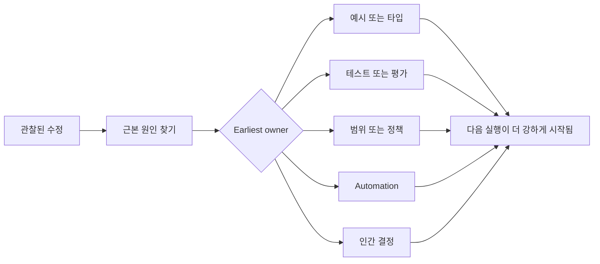

# 모든 에이전트(Agent) 수정을 시스템 개선으로 전환하기

> 채팅에만 존재하는 수정은 한 번의 실행만 해결합니다. 테스트, 경계 포인트, 예시, 또는 도구로 승격된 수정은 이후 모든 실행을 개선합니다.

**유형:** Learn + Build
**언어:** Python (stdlib)
**선수 요건:** 14단계 37-41강
**시간:** 약 65분

## 학습 목표

- 에이전트(Agent) 수정을 지속 가능한 통제 장치로 변환하세요.
- 재발을 방지할 수 있는 가장 이른 계층에 각 통제 장치를 배치하세요.
- 안정적인 지문(fingerprint)으로 반복되는 교훈을 중복 제거하세요.
- 더 이상 실제 위험을 보호하지 않는 통제 장치를 폐기하세요.

## 수정은 증거입니다

에이전트(Agent)에게 “해당 파일을 편집하지 마세요”라고 말하면, 범위 경계가 실행 불가능했다는 것을 알게 됩니다. “이 출력 형식이 잘못되었습니다”라고 말하면, 예시나 테스트가 누락되었다는 것을 알게 됩니다. 설정이 다시 실패하면, 환경 지식이 자동화에 속해야 한다는 것을 알게 됩니다.

수정을 프롬프트 작성 실패가 아닌, 작업 시스템에 대한 관찰로 취급하세요.

## 가장 이른 유효 계층으로 승격하기

이 순서를 사용하세요:

| 반복 실패 | 지속 가능한 목적지 |
|---|---|
| 잘못된 결과 또는 회귀 | 테스트 또는 평가 |
| 범위 밖 또는 위험한 행동 | 범위 또는 권한 정책 |
| 반복적인 설정 또는 명령 실수 | 자동화 또는 도구 |
| 반복적인 출력 형식 실수 | 표준 예시 및 검증기 |
| 모호한 지역 관례 | 시나리오 체크가 포함된 지시문 |
| 제품 의견 불일치 | 인간 결정 기록 |

이른 통제 장치는 더 저렴합니다. 잘못된 상태를 방지하는 타입은 나중에 이를 잡는 리뷰 댓글보다 강합니다. 집중된 테스트는 에이전트(Agent)에게 기억하라고 요청하는 단락보다 강합니다.



## 래칫 기록

포함 내용:

- 증상;
- 근본 원인;
- 결과;
- 재발 횟수;
- 선택한 통제;
- 통제에 대한 검증;
- 담당자;
- 검토하거나 폐기할 날짜.

모든 일회성 선호도를 승격하지 마세요. 재발이나 결과가 영구적인 복잡성을 정당화할 때만 수정 사항을 승격하세요.

## 원인과 증상 분리하기

“에이전트가 README를 편집했다”는 증상입니다. 가능한 원인은 다음과 같습니다:

- 작업이 저장소 루트를 허용했다;
- 문서가 암묵적으로 안전한 것으로 간주되었다;
- 계획이 구현과 문서를 함께 묶었다;
- 두 작업자가 소유권이 겹쳤다.

각 원인은 서로 다른 통제에 속합니다. 증상을 단순히 반복하는 규칙은 다음에 조금 다른 사례가 발생하면 실패합니다.

## 통제도 노후화됩니다

오래된 통제는 서로 충돌하고, 컨텍스트를 팽창시키며, 더 이상 존재하지 않는 시스템을 인코딩할 수 있습니다. 승격된 모든 규칙에는 폐기 점검이 필요합니다. 다음 조건에 해당할 때 제거하거나 재작성하세요:

- 기본 아키텍처가 변경되었다;
- 더 강력한 실행 가능한 통제가 이를 대체했다;
- 의미 있는 기간 동안 실패가 재발하지 않았다;
- 통제가 방지하는 위험보다 더 많은 마찰을 발생시킨다.

목표는 가장 긴 지시 파일이 아닙니다. 힘들게 얻은 판단을 보존하는 가장 작은 시스템이 목표입니다.

## 구현하기

이 실습은 수정 사항을 분류하고, 이를 통제로 승격하며, 중복을 지문화하고, `outputs/feedback-ratchet.json`를 작성합니다.

실행:

```bash
python3 code/main.py
python3 -m unittest discover code/tests -v
```

동일한 원인을 가진 두 개의 서로 다른 표현의 수정 사항을 추가하세요. 관련 없는 실패가 하나의 통제로 합쳐지지 않으면서도, 두 수정 사항이 하나의 통제로 합쳐질 때까지 정규화를 개선하세요.

## 연습 문제

1. 최근 코딩 세션에서 다섯 개의 수정 사항을 가져와 실제 담당자를 분류해 보세요.
2. 산문 규칙 하나를 실행 가능한 테스트로 대체해 보세요.
3. 심각한 최초 발생이 즉시 승격될 수 있도록 결과 가중치를 추가하세요.
4. 실험실 출력에 소유자와 은퇴 날짜를 추가하세요.
5. 기존 에이전트 지시문 하나를 검토하고, 더 강력한 통제가 존재함을 입증한 후에만 삭제하세요.

## 추가 읽기

- [Basili, Caldiera, and Rombach, The Goal Question Metric Approach](https://www.cs.toronto.edu/~sme/CSC444F/handouts/GQM-paper.pdf), 목표는 질문과 운영 측정으로 전환하는 데 유용합니다.
- [Shinn et al., Reflexion](https://arxiv.org/abs/2303.11366), 모델 가중치를 변경하지 않으면서 피드백 추적을 활용해 이후 결정을 개선하는 데 유용합니다.
- [Madaan et al., Self-Refine](https://arxiv.org/abs/2303.17651), 작업 루프 내 반복적인 피드백 및 수정에 유용합니다.

## 유지할 항목

`outputs/feedback-ratchet.json`을 유지하세요. 이는 에이전트 지원 엔지니어링 경로에서 영속적인 종점이며, 향후 워크벤치 변경의 입력입니다.
