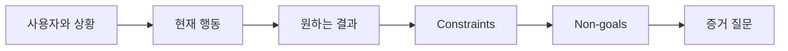

# 출력을 선택하기 전에 결과를 정의하세요

> 빠른 구현은 잘못된 문제를 선택했을 때의 페널티를 높입니다. 속도가 올바른 방향을 가리키도록 먼저 결과를 구체화하세요.

**유형:** Learn + Build
**언어:** Python (stdlib)
**선수 요건:** 없음
**시간:** 약 60분

## 학습 목표

- 해결책을 명시하지 않고 결과 프레임을 작성해 보세요.
- 사용자, 상황, 현재 행동, 그리고 원하는 변화를 식별해 보세요.
- 제약 조건과 비목표를 명시적으로 드러내세요.
- 해결책 누출이 범위로 굳어지기 전에 감지해 보세요.

## 출력은 결과가 아닙니다

“인시던트 어시스턴트를 구축한다”는 출력의 이름을 지정합니다. 누가 그것을 필요로 하는지, 무엇이 개선되는지, 무엇이 안전해야 하는지는 말하지 않습니다.

결과 프레임은 다음과 같이 말합니다:

> 프로덕션 알람이 도착하면, 온콜 엔지니어는 2분 이내에 실패한 서비스와 안전한 다음 조치를 식별하며, 진단은 읽기 전용이고 감사 가능해야 합니다.

이 문장은 소프트웨어, 런북, 데이터 복구, 또는 더 작은 인터페이스 변경으로 충족될 수 있습니다. 이는 팀이 누군가가 처음 상상한 산출물이 아닌 결과에 집중하도록 유지합니다.

## 6부 프레임

| 부 | 질문 |
|---|---|
| 사용자 | 문제를 직접 경험하는 사람은 누구인가요? |
| 상황 | 언제, 어디서 발생하나요? |
| 현재 행동 | 오늘(우회 포함) 일어나는 일은 무엇인가요? |
| 원하는 결과 | 어떤 관찰 가능한 상태가 개선되어야 하나요? |
| 제약 조건 | 안전, 정책, 비용, 호환성 한계 중 고정된 것은 무엇인가요? |
| 비목표 | 유혹적인 인접 작업 중 제외되는 것은 무엇인가요? |



## 해결책 누출 찾기

결과 진술은 증거로 정당화되지 않은 제품 형태, 인터페이스, 모델 선택, 프레임워크, 또는 아키텍처를 포함할 때 해결책을 누출합니다.

- “사용자는 주간 AI 요약본을 받는다”는 요약본과 주기(케던스)를 누출합니다.
- “사용자가 승인 전에 계정 변경을 이해한다”는 결과를 서술합니다.
- “벡터 데이터베이스를 배포한다”는 인프라 세부 사항을 노출합니다.
- “검토 중에 관련 정책 증거가 이용 가능하다”는 기능을 서술합니다.

호환성이 기술 선택을 진정으로 고정하는 경우에만 제약 조건에 기술을 명시할 수 있습니다. 왜 고정되는지 기록하세요.

## 제약 조건은 결과를 보호합니다

제약 조건은 구현 세부 사항이 아닙니다. 이는 실제 세계의 목표의 일부입니다:

- 진단 중에는 프로덕션 쓰기 작업이 없어야 합니다;
- 인시던트 시간 예산 내에서 응답해야 합니다;
- 기존 감사 이벤트는 권위를 유지해야 합니다;
- 새로운 런타임 의존성이 없어야 합니다;
- 접근성 동작이 온전하게 유지되어야 합니다.

제약 조건을 위반하여 결과에 도달한 빌드는 결과에 도달한 것이 아닙니다.

## 비목표는 경계를 만듭니다

비목표는 유용한 슬라이스가 플랫폼으로 변하는 것을 방지합니다. 좋은 비목표는 작업을 거부할 만큼 구체적이어야 합니다:

- 자동화된 구제 조치는 없습니다;
- 새로운 알림 라우팅 시스템은 없습니다;
- 인시던트 지휘관을 대체하지 않습니다;
- 이 슬라이스에는 역사적 분석이 없습니다.

## 구현하기

이 실험실은 `OutcomeFrame`을 검증하고 `outputs/outcome-frame.json`을 작성합니다.

```bash
python3 code/main.py
python3 -m unittest discover code/tests -v
```

원하는 결과를 “인시던트 어시스턴트를 사용한다”로 바꾸세요. 검증기는 제안된 출력물이 결과에 유입된 것을 표시해야 합니다.

## 연습 문제

1. 백로그의 기능 요청을 결과 프레임으로 다시 작성하세요.
2. 남은 가능한 솔루션을 변경하는 제약 조건을 하나 추가하세요.
3. 첫 슬라이스를 작게 유지하는 비목표를 두 개 추가하세요.
4. 원하는 결과를 반증할 수 있는 가장 이른 관찰을 식별하세요.
5. 동일한 결과를 충족할 수 있는 세 가지 다른 출력물을 작성하세요.

## 추가 읽기

- [Nuseibeh and Easterbrook, Requirements Engineering: A Roadmap](https://www.cs.toronto.edu/~sme/papers/2000/ICSE2000.pdf), 소프트웨어 작업의 앵커로 실제 세계의 목표를 다루는 방법.
- [Dardenne, van Lamsweerde, and Fickas, Goal-Directed Requirements Acquisition](https://doi.org/10.1016/0167-6423(93)90021-G), 고수준 목표를 제약 조건 및 운영 요구 사항으로 정제하는 방법.

## 남는 것

`outputs/outcome-frame.json`을 유지하세요. 다음 강의에서는 사람들이 실제로 수행하는 워크플로우에 대해 이를 테스트합니다.
