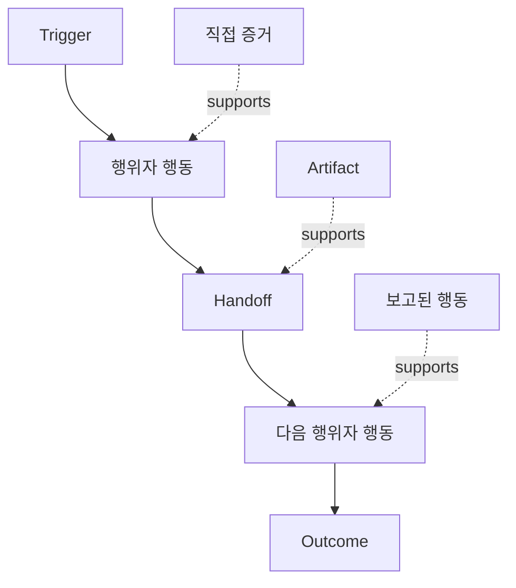

# 사람들이 실제로 수행하는 워크플로우를 발견하세요

> 요구사항은 회의에서 수집되기를 기다리고 있지 않습니다. 요구사항은 행동, 우회 절차, 기록, 그리고 의견 불일치 속에 흩어져 있습니다.

**유형:** Learn + Build
**언어:** Python (stdlib)
**선수 요건:** 14단계 47강
**시간:** 약 70분

## 학습 목표

- 현재 워크플로우를 증거가 있는 순서 있는 행동으로 모델링하세요.
- 직접 관찰한 것과 보고되거나 추론된 행동을 분리하세요.
- 마찰, 핸드오프, 권한, 그리고 숨겨진 상태를 찾아보세요.
- 불확실한 주장을 요구사항으로 바꾸지 말고, 명확하게 표시하세요.

## 현재 시스템부터 시작하세요

사람들이 원하는 기능이 무엇인지 묻는 것부터 시작하지 마세요. 지금 일어나는 일을 재구성하는 것부터 시작하세요.

각 단계에 대해 다음을 기록하세요:

| 필드 | 예시 |
|---|---|
| 행위자 | 온콜 엔지니어 |
| 트리거 | 프로덕션 알림이 도착 |
| 행동 | 알림을 열고, 대시보드를 검색 |
| 입력 | 알림 페이로드와 배포 기록 |
| 출력 | 후보 서비스와 소유자 |
| 마찰 | 세 가지 도구 간 컨텍스트 전환 |
| 권한 | 인시던트 커맨더가 쓰기 승인 |
| 증거 | 화면 녹화, 인시던트 로그, 런북 |

워크플로우는 화면보다 더 큽니다. 대기, 복사-붙여넣기, 사이드 채널, 승인, 오류 복구, 그리고 사람들이 더 이상 인식하지 못하는 단계를 포함합니다.

## 증거에는 강도가 있습니다

간단한 증거 사다리를 사용하세요:

1. **직접 행동:** 관찰, 추적, 녹화, 또는 시스템 이벤트.
2. **산출물:** 티켓, 런북, 로그, 양식, 또는 완료된 출력.
3. **보고된 행동:** 사람이 자신의 행동을 설명합니다.
4. **추론:** 팀이 아마도 일어나는 일을 결론 내립니다.

네 가지 모두 유용할 수 있습니다. 처음 두 가지만 현재 행동을 직접 증명합니다. 나머지에는 라벨을 붙여 신뢰도가 조용히 부풀려지지 않도록 하세요.



## 네 가지 요소 검색

- **마찰:** 반복적인 노력, 지연, 재진입, 또는 복구.
- **숨겨진 상태:** 메모리, 채팅, 개인 노트에 저장된 사실.
- **권한:** 중요한 변경을 수행할 수 있는 사람 또는 시스템.
- **예외:** 정상적인 워크플로우가 더 이상 정상적이지 않은 경우.

AI 기능은 핸드오프와 예외에서 자주 실패합니다. 이는 해피 패스(happy path)가 유일한 경로로 설계되었기 때문입니다.

## 이견을 평균으로 없애지 마세요

두 사용자는 합당한 이유로 서로 다른 워크플로우를 수행할 수 있습니다. 다음을 이해할 때까지 변형(variants)을 보존하세요:

- 서로 다른 역할;
- 서로 다른 위험 수준;
- 레거시 및 현재 프로세스;
- 전문성 차이;
- 진정한 정책 이견.

평균화된 워크플로우가 아무도 설명하지 못할 수 있습니다.

## 구현하기

이 랩은 모든 워크플로우 단계에 증거를 저장하고, 순서와 신뢰도를 검증하며, 직접 증거 비율을 계산하고, `outputs/workflow-evidence.json`를 작성합니다.

```bash
python3 code/main.py
python3 -m unittest discover code/tests -v
```

배포 기록이 누락된 예외 경로를 추가하세요. 주요 순서는 그대로 유지하고 분기가 시작되는 위치를 기록하세요.

## 연습 문제

1. 누구도 인터뷰하지 않고 로그로부터 하나의 워크플로우를 재구성하세요.
2. 사용자를 인터뷰하고 직접 증거가 여전히 부족한 모든 주장을 표시하세요.
3. 권한 경계와 실패 복구 단계를 하나씩 추가하세요.
4. 두 워크플로우 변형을 병합하지 않고 모델링하세요.
5. 가시적인 단계를 제거하지만 숨겨진 작업은 그대로 남겨두는 제안된 기능을 식별하세요.

## 추가 읽기

- [Nuseibeh and Easterbrook, Requirements Engineering: A Roadmap](https://www.cs.toronto.edu/~sme/papers/2000/ICSE2000.pdf), 특히 단순한 캡처가 아닌 해석, 모델링, 검증으로서의 유도(elicitation) 처리에 대해 읽어보세요.
- [Gotel and Finkelstein, An Analysis of the Requirements Traceability Problem](https://doi.org/10.1109/ICRE.1994.292398), 요구사항과 그 출처 간의 관계를 보존하는 어려움에 대해 읽어보세요.

## 보존할 것

`outputs/workflow-evidence.json`를 보존하세요. 이는 관찰된 마찰과 불확실성을 다음 강의의 가정 지도로 변환합니다.
