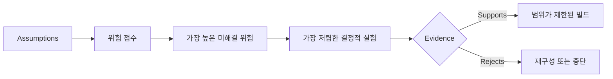

# 가정을 매핑하고 가장 위험한 가정을 먼저 해결하기

> 로드맵은 기능 내부에 불확실성을 숨깁니다. 가정 맵은 이러한 기능이 존재할 자격이 있으려면 무엇이 참이어야 하는지 드러냅니다.

**유형:** Learn + Build
**언어:** Python (stdlib)
**선수 요건:** 14단계 48강
**시간:** 약 65분

## 학습 목표

- 제안된 작업을 명시적인 가정으로 변환합니다.
- 영향, 불확실성, 비가역성을 각각 별도로 점수화합니다.
- 열정이 아닌 위험도에 따라 다음 실험을 선택합니다.
- 테스트된 가정을 증거와 결정으로 대체합니다.

## 모든 빌드에는 베팅이 포함됩니다

인시던트 도구는 다음이 모두 참이어야 의존할 수 있습니다:

- 알림 컨텍스트가 서비스를 식별하기에 충분한 정보를 포함합니다;
- 엔지니어가 스스로 도출하지 않은 추천을 신뢰합니다;
- 원하는 응답 시간이 운영적으로 중요합니다;
- 필요한 데이터에 안전하지 않은 권한 없이 접근할 수 있습니다;
- 워크플로우가 유지보수를 정당화할 만큼 충분히 자주 발생합니다.

이것은 구현 작업이 아닙니다. 빌드가 가치 있고, 사용 가능하며, 실행 가능하고, 안전하기 위한 조건입니다.

## 가정 분류

| 분류 | 질문 |
|---|---|
| 가치 | 결과가 충분히 중요할까요? |
| 사용성 | 사용자가 이를 이해하고 행동할 수 있을까요? |
| 실행 가능성 | 시스템이 가용한 데이터와 제약 조건으로 이를 생성할 수 있을까요? |
| 지속 가능성 | 조직이 비용, 소유권, 운영을 지속할 수 있을까요? |
| 안전성 | 용인할 수 없는 결과 없이 실패할 수 있을까요? |

가정은 반증 가능한 문장으로 작성합니다. “기능이 유용하다”는 테스트할 수 없습니다. “10명의 온콜 엔지니어 중 8명이 읽기 전용 결과로 올바른 서비스를 더 빠르게 식별한다”는 테스트할 수 있습니다.

## 위험은 하나의 숫자가 아닙니다

실험실은 1부터 5까지의 세 가지 차원을 사용합니다:

- **영향:** 가정이 거짓일 경우의 피해.
- **불확실성:** 현재 증거의 약점.
- **비가역성:** 커밋 후 학습 비용.

예시 점수는 영향력과 불확실성을 곱한 후 비가역성을 더합니다. 이 공식은 보편적이지 않습니다. 그 목적은 팀이 왜 하나의 미지수를 다른 미지수보다 먼저 해결해야 하는지 명시하도록 강제하는 것입니다.



## 확증 의식(Confirmation Ritual)이 아닌 실험을 설계하세요

유용한 테스트는 다음을 포함합니다:

- 거짓일 수 있는 주장;
- 인구 또는 현실적인 샘플;
- 관찰 가능한 결과;
- 결과 전에 결정된 임계값;
- 통과, 실패, 모호한 증거에 대한 다음 결정.

팀이 아이디어를 구축할 수 있다는 것을 증명하는 테스트만은 피하세요.

## 비가역성이 순서를 바꿉니다

결과가 중대한 비가역적 선택은 더 이른 증거를 필요로 합니다. 읽기 전용 재현(replay)은 프로덕션 통합에 선행할 수 있습니다. 임시 어댑터는 데이터 마이그레이션에 선행할 수 있습니다. 인간이 승인한 추천은 자동 실행에 선행할 수 있습니다.

빌드의 형태는 불확실성의 형태를 따라야 합니다.

## 구현하기

랩은 가정을 순위를 매기고, 테스트된 주장과 미해결 주장을 구분하며, 가장 높은 미해결 위험을 선택하고 `outputs/assumption-map.json`를 작성합니다.

```bash
python3 code/main.py
python3 -m unittest discover code/tests -v
```

가장 위험한 가정에 대한 증거를 변경하고, 다음 실험이 어떻게 변하는지 관찰하세요.

## 연습 문제

1. 구축하려는 기능에 대해 다섯 가지 가정을 작성하세요.
2. 기능 목록에서 빠진 안전 가정을 하나 추가하세요.
3. 빌드를 중단하게 만들 임계값을 정의하세요.
4. 하나의 큰 실험을 더 저렴한 결정적 테스트로 대체하세요.
5. 위험 순위를 로드맵 우선순위와 비교하고 불일치를 설명하세요.

## 추가 읽기

- [Barry Boehm, A Spiral Model of Software Development and Enhancement](https://dl.acm.org/doi/10.1145/12944.12948), 더 깊은 커밋 전에 불확실성을 해결하는 위험 주도 개발 사이클에 대해.
- [Dardenne, van Lamsweerde, and Fickas, Goal-Directed Requirements Acquisition](https://doi.org/10.1016/0167-6423(93)90021-G), 장애물과 제약 조건을 드러내면서 목표를 정제하는 것에 대해.

## 남는 것

`outputs/assumption-map.json`을 유지하세요. 다음 강의에서는 이를 사용하여 결정적인 증거를 생성할 수 있는 가장 작은 슬라이스를 선택합니다.
