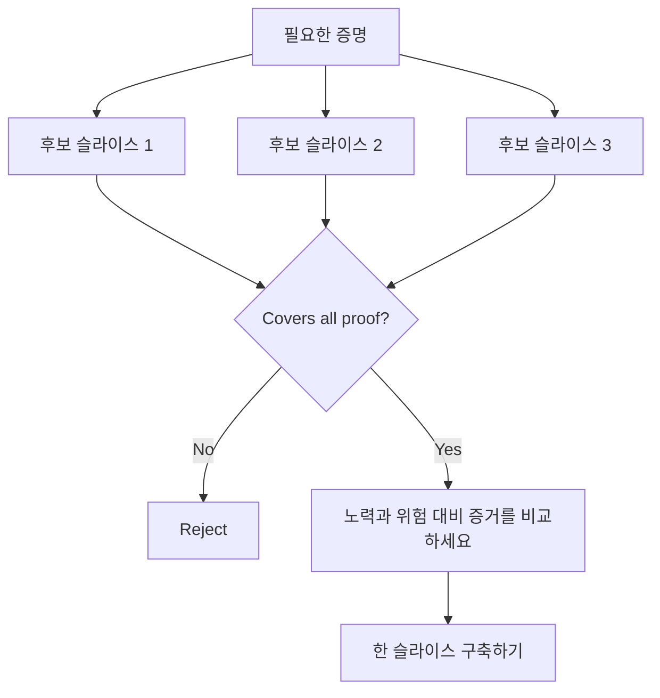

# 결정을 바꿀 수 있는 가장 작은 슬라이스를 선택하세요

> 작은 규모는 중요한 것을 증명할 때만 유용합니다. 다음 결정을 바꿀 수 없는 작은 빌드는 단순히 불완전한 것입니다.

**유형:** Learn + Build
**언어:** Python (stdlib)
**선수 요건:** 14단계 49강
**시간:** 약 65분

## 학습 목표

- 증명하는 가정에 따라 슬라이스를 정의하세요.
- 결과 가치, 불확실성 감소, 노력, 그리고 결과를 균형 있게 고려하세요.
- 조기 생산적 약속보다 되돌릴 수 있는 증거를 선호하세요.
- 워크플로우의 위험한 부분을 생략한 슬라이스는 거부하세요.

## 수직적 의미는 끝에서 끝까지의 증거를 의미합니다

유용한 슬라이스는 결과를 관찰하기 위해 필요한 최소한의 실제 워크플로우를 가로지릅니다. 사용자, 데이터, 기간, 기능 측면에서 좁을 수 있습니다. 테스트해야 할 정확한 불확실성을 제거하여 좁아져서는 안 됩니다.

예시:

- 10건의 실제 사건에 대한 읽기 전용 리플레이는 서비스 식별과 운영자 신뢰를 테스트합니다.
- 합성 데이터에 대한 세련된 대시보드는 이해도를 테스트할 수 있지만 데이터 실현 가능성을 테스트하지는 못합니다.
- 프로덕션 자동 복구기는 모든 것을 한 번에 테스트하며 용인할 수 없는 결과를 초래합니다.

## 필요한 증명을 먼저 정의하세요

가장 위험한 열려 있는 가정을 취하여 필요한 증명 집합으로 만드세요. 후보 슬라이스는 그 집합을 포함할 때만 자격이 있습니다.

그런 다음 자격이 있는 슬라이스를 다음 기준으로 비교하세요:

| 차원 | 방향 |
|---|---|
| 결과 가치 | 클수록 좋음 |
| 감소한 불확실성 | 클수록 좋음 |
| 노력 | 적을수록 좋음 |
| 결과 | 적을수록 좋음 |
| 가역성 | 클수록 좋음 |

실험실의 점수는 의도적으로 단순합니다. 자격 게이트가 산술보다 더 중요합니다.



## 흔한 거짓 최소한

- **UI 전용 최소한:** 데이터 및 운영 불확실성을 제거합니다.
- **인프라 전용 최소한:** 사용자 가치 없이 기술적 가능성을 증명합니다.
- **순조로운 경로 최소한:** 대부분의 위험을 만드는 예외를 생략합니다.
- **데모 최소한:** 설득력 있는 산출물을 만들지만 반복 가능한 측정값은 없습니다.
- **플랫폼 최소한:** 하나의 워크플로우가 정당화하기 전에 재사용 가능한 장치를 구축합니다.

## 중단 규칙 추가하기

구현 전에 슬라이스가 실패하면 어떻게 되는지 작성하세요:

- 결과를 포기합니다;
- 대상 사용자나 상황을 변경합니다;
- 다른 메커니즘을 테스트합니다;
- 더 나은 증거를 수집합니다;
- 권한을 더 좁힙니다.

모든 결과가 “계속 구축”으로 이어진다면, 그 슬라이스는 실험이 아닙니다.

## 구현하기

실험실은 필수 증명으로 후보를 필터링하고, 자격 있는 슬라이스를 점수화하며, `outputs/slice-decision.json`를 작성합니다.

```bash
python3 code/main.py
python3 -m unittest discover code/tests -v
```

오직 하나의 필수 가정을 증명하는 더 저렴한 후보를 추가하세요. 수치 점수가 높더라도 자격이 없어야 합니다.

## 연습 문제

1. 동일한 결과에 대해 다른 결과 수준으로 세 개의 슬라이스를 설계하세요.
2. 점수화하기 전에 필수 증명 집합을 명시하세요.
3. 결정적인 증거를 보존하면서 하나의 기능을 제거하세요.
4. 실패한 파일럿에 대한 중단 규칙을 추가하세요.
5. 슬라이스 이후까지 기다려야 하는 재사용 가능한 플랫폼 구성 요소를 식별하세요.

## 추가 읽기

- [Barry Boehm, A Spiral Model of Software Development and Enhancement](https://dl.acm.org/doi/10.1145/12944.12948), 개발 주기를 해결해야 하는 위험과 매칭하기 위해.
- [Lenarduzzi and Taibi, MVP Explained: A Systematic Mapping Study on the Definitions of Minimal Viable Product](https://arxiv.org/abs/1609.07592), 소프트웨어 제품 실무에서 “최소한”과 “실행 가능한”의 모호성을 위해.

## 남기는 것

`outputs/slice-decision.json`를 유지하세요. 이 슬라이스가 결정을 바꿀 수 있는 가장 작은 슬라이스인 이유를 기록합니다.
