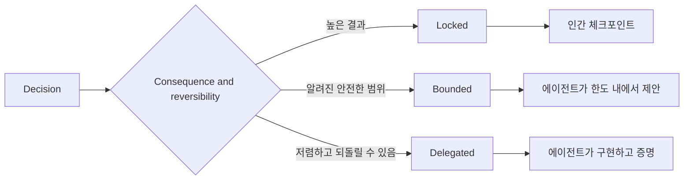

# 판단을 보존하는 명세 작성

> 유용한 명세는 불변 조건과 증거를 고정하면서, 되돌릴 수 있는 구현 선택은 열어 둡니다. 이는 결정 경계이지, 시나리오가 아닙니다.

**유형:** Learn + Build
**언어:** Python (stdlib)
**선수 요건:** 14단계 50강
**시간:** 약 75분

## 학습 목표

- 결과, 불변 조건, 예시, 비목표, 증명을 분리해 보세요.
- 결정을 잠금, 경계, 위임으로 표시해 보세요.
- 선택이 저렴하고 되돌릴 수 있는 경우 에이전트의 판단을 보존해 보세요.
- 결과나 공개 동작이 변경되는 경우 인간 체크포인트를 요구해 보세요.

## 두 가지 나쁜 극단

명세가 불충분한 작업은 에이전트가 시스템을 추측하게 만듭니다. 명세가 과도한 작업은 이미 잘못되었을 수 있는 설계를 전사하게 만듭니다.

유용한 중간 지점은 실행 가능한 계약입니다:

| 표면 | 목적 |
|---|---|
| 결과 | 관찰 가능한 결과 |
| 불변 조건 | 항상 참이어야 하는 조건 |
| 예시 | 의도를 드러내는 구체적 사례 |
| 비목표 | 의도적으로 제외된 인접 동작 |
| 결정 정책 | 어떤 선택이 잠금, 경계, 위임인지 |
| 증명 | 완료 전에 필요한 증거 |

## 세 가지 결정 모드

- **잠금(Locked):** 에이전트가 선택할 수 없습니다. 공개 호환성, 권한, 안전, 되돌릴 수 없는 비용, 제품 약속에 사용하세요.
- **경계(Bounded):** 에이전트가 명시된 한도 내에서 선택할 수 있습니다. 검색 예산, 재시도 횟수, 허용된 의존성, 알려진 인터페이스 계열에 사용하세요.
- **위임(Delegated):** 에이전트가 선택을 소유하고 이를 설명해야 합니다. 지역 구조, 이름, 되돌릴 수 있는 리팩토링, 구현 세부 사항에 사용하세요.



## 예시를 통해 동작 명세하기

예시는 형용사보다 의도를 더 잘 압축합니다. “도움”, “견고”, “프로덕션 준비 완료”는 실행 불가능합니다. 정상, 엣지, 실패, 금지 예시의 작은 집합은 빌더와 검증자 모두에게 구체적인 것을 제공합니다.

예시는 불변 조건을 대체하지 않습니다. 하나의 통과 케이스는 보편적인 안전 규칙을 증명할 수 없습니다.

## 증명은 주장과 일치해야 합니다

- 단위 테스트는 지역 함수 계약을 증명합니다.
- 와이어 테스트는 직렬화 및 전송 동작을 증명합니다.
- 브라우저 여정은 인터페이스 경로를 증명합니다.
- 리플레이 세트는 대표 케이스에 대한 동작을 증명합니다.
- 감사 로그는 권한 경계가 유지되었음을 증명합니다.

하위 계층을 상위 계층 주장의 증거로 받아들이지 마세요.

## 알 수 없는 부분을 의도적으로 보존하세요

명세는 “구현은 시간 예산 내에서 반환되는 읽기 전용 소스를 선택할 수 있습니다”라고 말할 수 있습니다. 이는 모호함이 아닙니다. 경계와 증거가 있는 의도적인 위임된 결정입니다.

명세는 증거가 변할 때 진화해야 합니다. 잠긴 및 경계 있는 선택의 이유를 보존하여 이후 팀이 고고학적 조사 없이 이를 수정할 수 있도록 하세요.

## 구현하기

랩은 모든 계약 표면을 검증하고, 결정 모드를 확인하며, `outputs/executable-specification.json`를 작성합니다.

```bash
python3 code/main.py
python3 -m unittest discover code/tests -v
```

프로덕션 쓰기 결정을 잠김에서 위임으로 이동하세요. 스키마가 값을 수용하지만 제품 위험이 수용하지 않는 이유를 설명하세요.

## 연습 문제

1. 백로그 티켓을 6개 명세 표면으로 변환하세요.
2. 3개의 구현 지침을 1개의 불변 조건과 2개의 예시로 대체하세요.
3. 모든 결정을 표시하고 각 잠김 또는 경계 있는 선택을 정당화하세요.
4. 모든 불변 조건에 대한 증명 영수증을 추가하세요.
5. 증거나 위험 근거가 없는 제약 조건을 제거하세요.

## 추가 읽기

- 목표, 정확한 명세, 검증, 합의 및 진화 간의 관계에 대해 [Nuseibeh and Easterbrook, Requirements Engineering: A Roadmap](https://www.cs.toronto.edu/~sme/papers/2000/ICSE2000.pdf)를 참고하세요.
- 환경 가정, 요구 사항 및 명세를 분리하는 것에 대해 [Zave and Jackson, Four Dark Corners of Requirements Engineering](https://doi.org/10.1145/237432.237434)를 참고하세요.
- 요구 사항이 존재하는 이유와 그 출처를 보존하는 것에 대해 [Gotel and Finkelstein, An Analysis of the Requirements Traceability Problem](https://doi.org/10.1109/ICRE.1994.292398)를 참고하세요.

## 보존할 항목

`outputs/executable-specification.json`을 보존하세요. 이 항목은 코딩 에이전트와 인간 리뷰어가 공유하는 계약이 됩니다.
