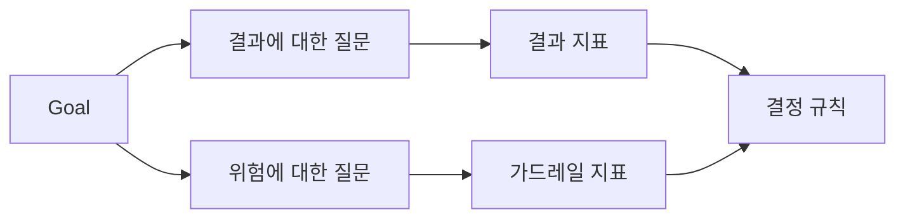

# 결과가 존재하기 전에 성공 지표 설계하기

> 측정은 대시보드를 장식하는 것이 아니라 결정을 답해야 합니다. 목표에서 시작하여 질문을 도출하고, 이를 답하는 가장 작은 지표들을 선택하세요.

**유형:** Learn + Build
**언어:** Python (stdlib)
**선수 요건:** 14단계 47강 및 51강
**시간:** 약 70분

## 학습 목표

- 결과 목표에서 질문과 지표를 도출하세요.
- 결과를 관찰하기 전에 임계값, 윈도우, 소스 및 방향을 정의하세요.
- 결과 지표에 가드레일 및 반대 지표를 쌍으로 매칭하세요.
- 빌드가 지원해야 하는 결정에 평가 근거를 매칭하세요.

## 목표, 질문, 지표

목표에서 시작하세요:

> 위험한 동작을 증가시키지 않으면서 영향을 받는 서비스를 식별하는 시간을 줄이세요.

질문을 도출하세요:

- 올바른 서비스가 얼마나 빠르게 식별되는가요?
- 식별된 서비스가 얼마나 자주 올바른가요?
- 진단이 읽기 전용 상태로 유지되는가요?
- 워크플로우가 알림 무시나 운영자 작업량을 증가시키는가요?

그런 다음 이러한 질문을 구체화하는 지표를 선택하세요.



## 지표는 계약이 필요합니다

모든 지표는 다음을 필요로 합니다:

| 필드 | 예시 |
|---|---|
| 이름 | `median_identification_seconds` |
| 방향 | 최대 |
| 임계값 | 120 |
| 윈도우 | 10번의 인시던트 리플레이 |
| 출처 | 재현 이벤트 로그 |
| 대상 집단 | 파일럿 내 온콜 엔지니어 |
| 유형 | 결과 또는 가드레일 |

출처와 기간이 없으면 숫자를 재현할 수 없습니다. 임계값이 없으면 의사결정을 내릴 수 없습니다.

## 결과, 가드레일, 반지표

- **결과 지표:** 원하는 상태가 개선되었습니까?
- **가드레일:** 고정된 제약 조건이 유지되었습니까?
- **반지표:** 지역적 개선이 다른 곳의 비용이나 피해를 증가시켰습니까?

인시던트 워크플로우에서는 속도만으로는 충분하지 않습니다. 정확성, 프로덕션 쓰기, 운영자 작업량, 놓친 경보가 빠르지만 안전하지 않은 결과를 방지합니다.

## 오프라인 및 온라인 증거

오프라인 재현은 반복성과 엣지 케이스 커버리지에 유용합니다. 제한된 파일럿은 실제 행동, 신뢰, 워크플로우 효과에 유용합니다. 둘 중 하나가 다른 하나를 대체할 수 없습니다.

현재 의사결정에 답할 수 있는 가장 저렴한 증거를 사용하세요. 구현이 완료되었다는 이유만으로 실제 사용자를 노출하지 마세요.

## 측정 전에 결정하세요

결과를 보기 전에 통과, 실패, 모호한 경로를 작성하세요. 그렇지 않으면 팀은 빌드를 보호하기 위해 임계값을 조정할 것입니다.

예시:

- 통과: 서비스 정확률이 최소 0.9이고 중앙값 시간이 최대 120초일 때;
- 실패: 프로덕션 쓰기 발생 또는 정확률이 0.75 미만일 때;
- 모호: 분산이 넓고 개선이 작은 경우, 더 큰 재현 세트가 필요합니다.

## 구현하기

랩은 측정 계획을 검증하고, 포괄적인 임계값을 평가하며, 누락된 값을 기록하고, `outputs/measurement-report.json`를 작성합니다.

```bash
python3 code/main.py
python3 -m unittest discover code/tests -v
```

가드레일 지표를 제거하고, 결과 지표가 남아 있더라도 왜 계획이 무효화되는지 관찰해 보세요.

## 연습 문제

1. 하나의 결과 목표에서 세 가지 질문을 도출해 보세요.
2. 비용이 다른 역할로 전가되는 것을 포착하는 반지표를 추가해 보세요.
3. 모든 지표에 대해 출처, 대상 집단, 기간을 정의해 보세요.
4. 값을 생성하기 전에 통과, 실패, 모호한 결정을 작성해 보세요.
5. 수집은 쉽지만 의사결정에 영향을 주지 못하는 지표 하나를 식별하고 제거해 보세요.

## 추가 읽기

- 명시적 목표로부터 운영 측정값을 도출하는 [Basili, Software Modeling and Measurement: The Goal/Question/Metric Paradigm](https://drum.lib.umd.edu/items/8119803a-362b-42ec-b6ce-2311713e7236)을 참고해 보세요.
- 이 방법을 피드백 및 개선 시스템으로 적용하는 [Basili, Caldiera, and Rombach, The Goal Question Metric Approach](https://www.cs.toronto.edu/~sme/CSC444F/handouts/GQM-paper.pdf)을 참고해 보세요.

## 유지할 항목

`outputs/measurement-report.json`을 유지하세요. 이 항목은 프로토타입, 파일럿, 또는 프로덕션 단계의 증거 게이트를 정의합니다.
